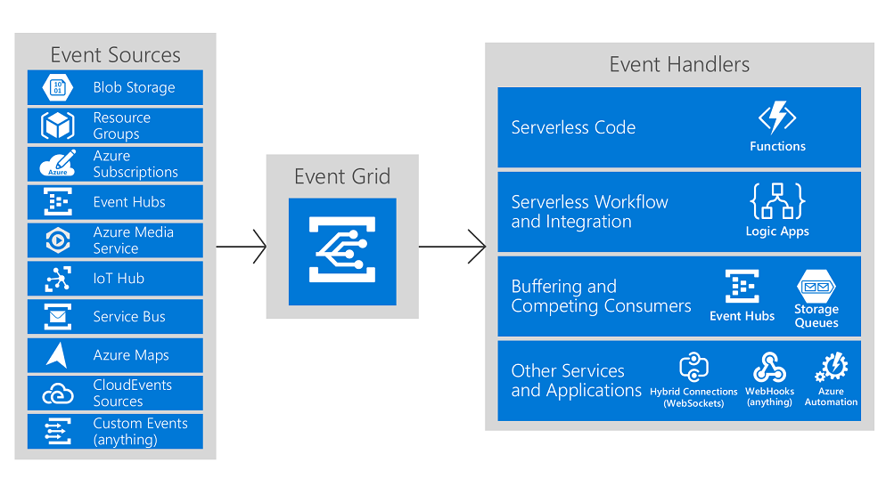

# React to Azure Maps events by using Event Grid 

Azure Maps integrates with Azure Event Grid so that you can send event notifications to other services and trigger downstream processes. The purpose of this article is to help you configure your business applications to listen for Azure Maps events so that you can react to critical events in a reliable, scalable, and secure manner. For example, build an application that performs multiple actions like updating a database, creating a ticket, and delivering an email notification every time a device enters a geofence.

Azure Event Grid is a fully managed event routing service that uses a publish-subscribe model. Event Grid has built-in support for Azure services like [Azure Functions](https://docs.microsoft.com/azure/azure-functions/functions-overview) and [Azure Logic Apps](https://docs.microsoft.com/azure/azure-functions/functions-overview), and can deliver event alerts to non-Azure services using webhooks. For a complete list of the event handlers that Event Grid supports, see [An introduction to Azure Event Grid](https://docs.microsoft.com/azure/event-grid/overview).





## Azure Maps events types

Event grid uses [event subscriptions](https://docs.microsoft.com/azure/event-grid/concepts#event-subscriptions) to route event messages to subscribers. An Azure Maps account emits the following event types: 

| Event type | Description |
| ---------- | ----------- |
| Microsoft.Maps.GeofenceEntered | Raised when coordinates received have moved from outside of a given geofence to within |
| Microsoft.Maps.GeofenceExited | Raised when coordinates received have moved from within a given geofence to outside |
| Microsoft.Maps.GeofenceResult | Raised every time a geofencing query returns a result, regardless of the state |

## Event schema

The following example show schema for GeofenceResult

```JSON
{   
   "id":"451675de-a67d-4929-876c-5c2bf0b2c000", 
   "topic":"/subscriptions/{subscriptionId}/resourceGroups/{resourceGroup}/providers/Microsoft.Maps/accounts/{accountName}", 
   "subject":"/spatial/geofence/udid/{udid}/id/{eventId}", 
   "data":{   
      "geometries":[   
         {   
            "deviceId":"device_1", 
            "udId":"1a13b444-4acf-32ab-ce4e-9ca4af20b169", 
            "geometryId":"1", 
            "distance":999.0, 
            "nearestLat":47.609833, 
            "nearestLon":-122.148274 
         }, 
         {   
            "deviceId":"device_1", 
            "udId":"1a13b444-4acf-32ab-ce4e-9ca4af20b169", 
            "geometryId":"2", 
            "distance":999.0, 
            "nearestLat":47.621954, 
            "nearestLon":-122.131841 
         } 
      ], 
      "expiredGeofenceGeometryId":[   
      ], 
      "invalidPeriodGeofenceGeometryId":[   
      ] 
   }, 
   "eventType":"Microsoft.Maps.GeofenceResult", 
   "eventTime":"2018-11-08T00:52:08.0954283Z", 
   "metadataVersion":"1", 
   "dataVersion":"1.0" 
}
```

## Tips for consuming events

Applications that handle Azure Maps geofence events should follow a few recommended practices:

* Multiple subscriptions can be configured to route events to the same event handler. It's important not to assume that events are from a particular source. Always check the message topic to ensure that it comes from the source that you expect.
* Messages can arrive out of order or after a delay. Use the `X-Correlation-id` field in the response header to understand if your information about objects is up-to-date.
* When Get and POST Geofence API is called with mode parameter set to `EnterAndExit`, an Enter or Exit event is generated for each geometry in the geofence for which the status has changed from the previous Geofence API call.

## Next steps

To learn more about how to use geofencing to control operations at a construction site, see:

> [!div class="nextstepaction"]	
> [Set up a geofence by using Azure Maps](tutorial-geofence.md)