# Azure Maps plugin for QGIS

The Quantum Geographic Information System [(QGIS)](https://qgis.org/) is a Free and Open Source Software (FOSS) application. Azure Maps provides a plug-in for "Private Atlas - Private Preview", a QGIS tool that lets users develop and own their map data.

Although the Azure Maps QGIS plug-in is currently under experimentation, it provides complete indoor mapping functionalities. The plug-in lets users visualize their data and perform quality assurance tasks on their data sets. Edits and changes to the data sets can be viewed on a rendered indoor map and in near real-time. All data modifications in the plug-in can be synced up and saved to the Azure Maps resources. This article guides you through the installation process of the Azure Maps QGIS plug-ins. It also shows you how to use the plug-in to perform common tasks with your data set.

## Prerequisites

Before you can use the Azure Maps QGIS plugin, you need to [make an Azure account](quick-demo-map-app.md#create-an-account-with-azure-maps) and [obtain a primary subscription key](quick-demo-map-app.md#get-the-primary-key-for-your-account). This key may also be called the primary key or the subscription key.

To use the Azure Maps QGIS plug-in, you'll need to [download the QGIS Desktop application](https://www.qgis.org/en/site/forusers/download.html). Select a version of 3.8.* or higher.

## Install the Azure Maps QGIS plug-in

Once the QGIS Desktop has been successfully downloaded, you can follow the steps below to install the Azure Maps QGIS plugin.

1. Launch the QGIS application.

   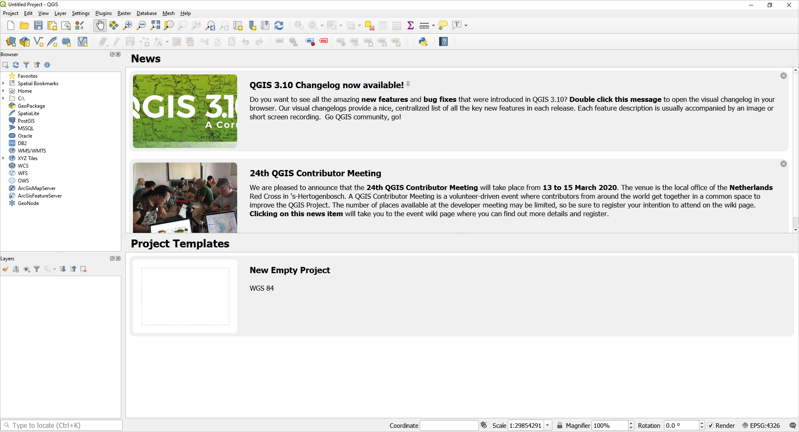

2. Click on the **Plugins** option in the main menu and select **Manage and Install Plugins**.

   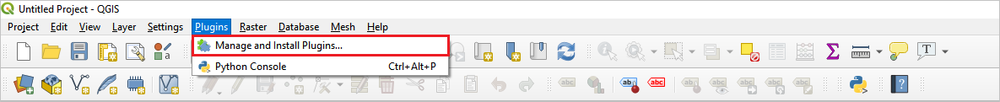

3. In the **Plugins** window, select the **settings** tab. Enable the **Show also experimental plugins** option.

   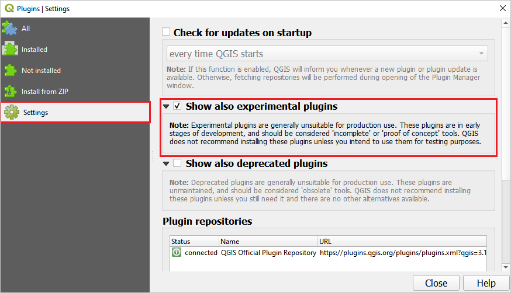

4. In the same **Plugins** window, select the **All** tab. Type "Azure Maps" in the search bar to find the Azure Maps plug-in, it should be listed in the results. Click on the **Install Plugin** button. Once the plug-in is installed, you can upgrade to a newer version, if available. Or, you may uninstall and reinstall the plug-in at any time. For more information on how to work with plugins in QGIS, visit the [QGIS plugin documentation](https://docs.qgis.org/3.4/en/docs/user_manual/plugins/plugins.html) page.

   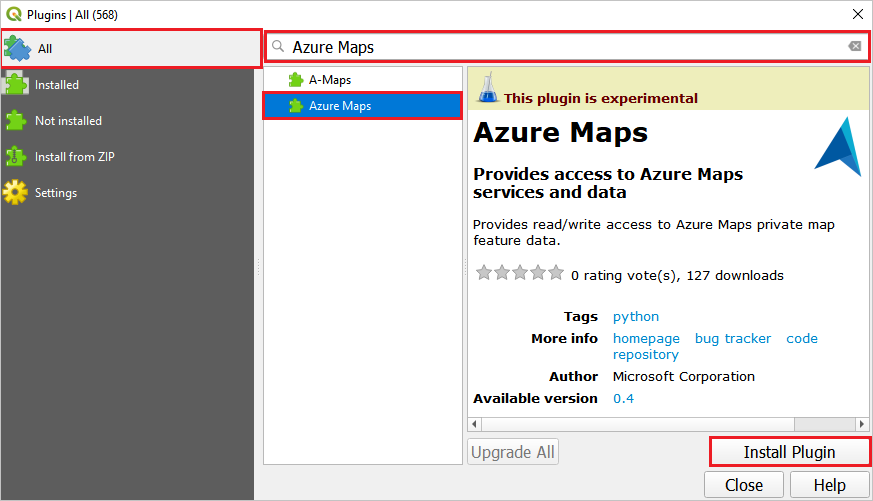

## Use the Azure Maps QGIS Plugin

After the installation is complete, the Azure Maps plug-in will be accessible via the QGIS plug-in toolbar.
  
   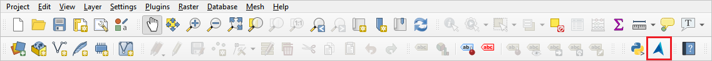

Click on the Azure Maps QGIS plug-in icon to open the **Azure Maps** window. In the **Private Atlas** tab, provide your **datasetId**. Provide your Azure Maps **primary subscription key** in the **Authentication** tab. Providing your **datasetId** and **primary subscription key** allows you to access and save the Private Atlas data set. And the modifications you make in the plug-in, will also be with the Azure Maps resources.

   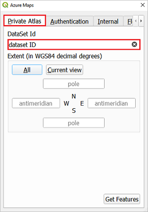
   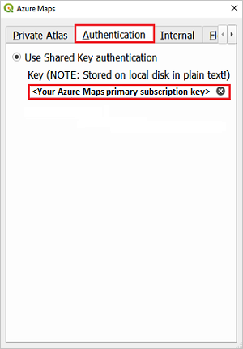

You can optionally set the spatial extents for the rendered indoor map in the **Private Atlas** tab. The spatial extent is a bounding box defined by four latitude and longitude coordinates. The coordinates represent the smallest rectangle that encloses all the referenced map data. To obtain your bounding box information, use the [Tileset List API]() from the Azure Maps Tileset service.

The **Floor Picker** tab lets you select the floor number. The map of the selected floor will render in the QGIS application window, so you can make edits to this floor map data. Initially, this option is greyed out because you need to load your data set before you can select a floor number.

   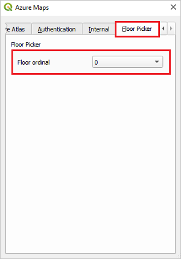
 
To load your data set, provide the **datasetId** and the **primary subscription key**. And press the **get features** button in the **Private Atlas** tab. Once this request completes successfully, you'll see layers with the features of your data set in the **Layers** panel. The layers reflect the content of your Drawing package. The features in your data may not encompass all the [feature collections](#full-list-of-feature-collections) that the **Layers** panel supports. And, you may not have used all the [supported layers](drawing-requirements.md#drawing-files-requirements). However, you'll definitely see the _Unit_ and the _Exterior_ layers because they're [required](drawing-requirements.md) to convert a Drawing package into map data.

   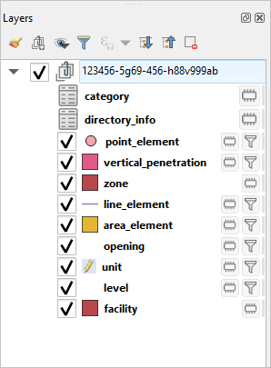

You can zoom into a layer by right-clicking on the layer and choosing **Zoom to Layer**. You may also edit the layer by right-clicking and choosing **Open Attribute Table**. In the **Attribute Table** window, click the **toggle** icon to make the data editable. When you're done editing the data, click the **save** icon. The next section shows you common data edits, you'll likely perform on your data set.

   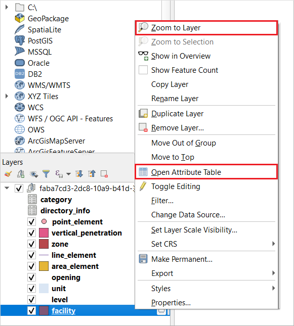

### Edit a data set

In this section, we discuss common edits you'll likely perform on your data set using the Azure Maps QGIS plug-in. Modification and soft touches are performed with the plug-in to keep your data fresh. You'll also see the changes rendered on the map in near real-time, so you can visualize them. If you like the changes, you can save them in the QGIS application. The saved changes automatically sync up with your Azure Maps resources.

Although the QGIS application lets you make geometry changes, add features, or delete features, we don't you do so. Use the Azure Maps Data, Dataset, Tileset, and Feature Stateset services to make major changes to your map data. And use the application only to edit the properties of the features. 

#### Update a feature collection

The feature collection in your **Layers** panel is imported using the **Data conversion API**. All the features listed in the [feature table](#full-list-of-feature-collections) can be updated, except the _point_, _line_, and _area_element_ feature. Follow the steps below to change the name of a unit, assuming the building unit has been repurposed.

1. In the Azure Maps plug-in, select the **Floor Picker** tab. Choose the floor where the unit to be edited is mapped.

2. In the **Layers** panel in the QGIS application, make sure the **unit** layer is selected. Right-click on the **unit** layer, and select **Open Attribute Table** from the menu.

   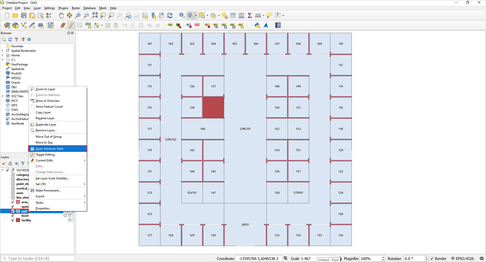

3. In the attribute table, click on the **edit** icon near the top-left of the window. Double-click the name of the unit that you want to rename, and rename it. Click the **save** icon in the toolbar menu.

   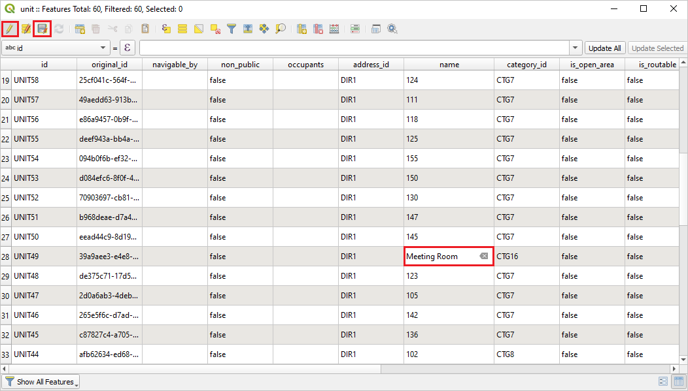

If the changes made to the data set are successful, you'll see a success message like the one below. In case your changes aren't successful, you'll see a failure message with details.

   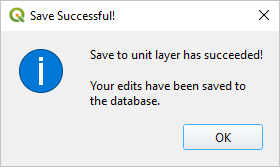

#### Update project-specific features

You might want to add, edit or delete project-specific features, such as furniture or points and lines of interest. This exercise shows you how to add an object to your map. More specifically, we'll add a desk.

The first step in adding a feature to the map is to decide the category and the layer for this feature. Because a desk is a type of furniture, we can place a desk in the _furniture_ category or the _furniture.desk_ category. Furniture items are normally inside units, such as rooms. So, we'll place the desk in the _Unit_ layer. The steps below start by showing you how to add a furniture category to your list of categories. And obtain the category **ID**. Next, we'll show you how to obtain the unit **ID**, and we'll add the desk to this unit. We'll add the desk to the _Unit_ layer, and check the category and layer to ensure the desk was successfully added.

1. Click on the **category** layer in the **Layers** panel, and click on the **edit** icon in the toolbar. Then, click the **Add Record** icon in the toolbar, it's next to the **edit** button.

   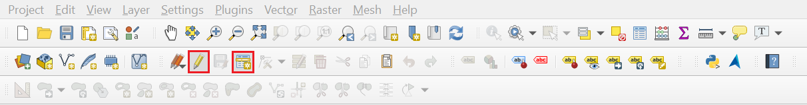

2. In the **Feature Attribute** window, define the attributes for the category. The list of supported categories can be found [here](https://aka.ms/pa-indoor-spacecategories). In the example below, we're adding the **furniture.desk** category, which will be used when creating an _area_element_ for the desk.

   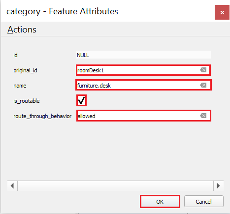

3. Click the **Save Layer Edits** button, next to the **Add Record** button, to save the new category to the data set. Upon a successful save, you'll see a success message. Otherwise, you'll see a failure message.

   

   

4. To see the assigned category ID, reload the data set by clicking the **Get Features** button in the **Private Atlas** tab. If you closed the **Azure Maps** plug-in window, you can reopen the window and click **Get Features**.

5. Right click on the **category** layer in **Layers** panel. Click on **Open Attributes Table**, and you should see the new category in the list along with its unique category ID. Copy the **ID** for the category, you may right-click and select **Copy Cell Content**.

   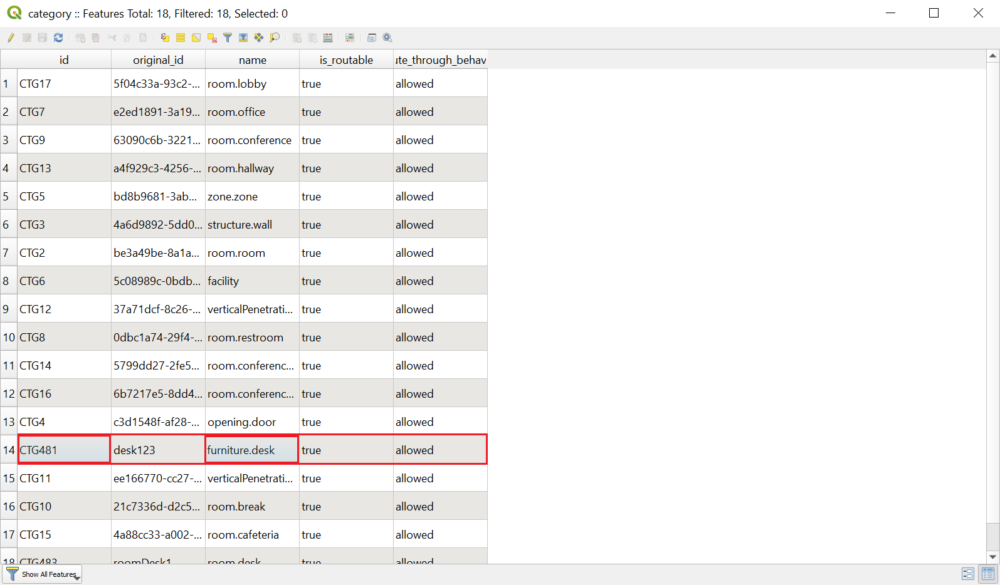

   

6. Right click on the **unit** layer in the **Layers** panel. Click on **OpenAttribute Table**. Copy the **ID** of the chosen unit.

   

   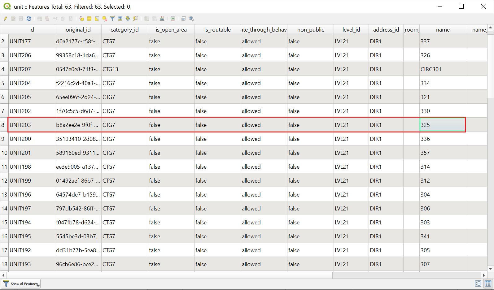

   

7. Choose **area_element** in the **Layers** panel. Click the **edit** icon, then click on the **Add Polygon Feature** button in the toolbar. 

8. On the map, draw a polygon representing the desk in the unit, and click **save**.

9. Right-click on the layer to open the **Feature Attributes** window. In the **Feature Attributes** window, provide the following required information. The inputs in the image below are possible options. It's likely that your **category_ID** and **unit_ID** will be different, because they're based on the map data. When you're done, click **OK**:

   | | |
   | :-- | :-- |
   | **original_ID** | Give an original ID of your choice |
   | **category_ID** | provide the category ID for the desk category |
   | **unit_ID** | provide the unit ID to add the desk to this unit |
   | **name** | Give a name for the element |

   

   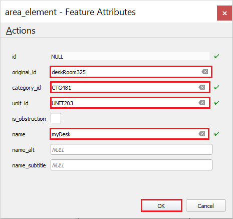

   

10. Now that you provide the required information, you should see the element on the map. Click the **Save Layer Edits** button in the toolbar to save changes to your data set.

   

   

   

5. You should see the new category we generated. Right click on **area_element** layer in the **Layers** panel. Click on the **Open Attributes Table**. Check the new category in the list along with the unique category ID that we generated in a previous step.

   

    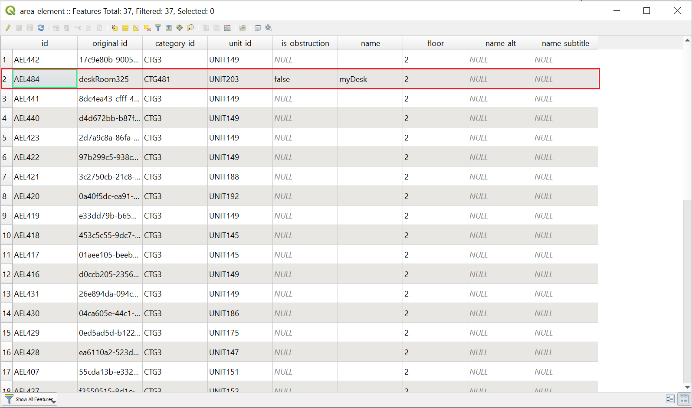

   

You can use the same thinking processes and steps to add additional features to your map. See the [supported categories](https://aka.ms/pa-indoor-spacecategories) and [supported map layer](drawing-requirements.md#drawing-files-requirements) to decide where to add your features.

## Full list of feature collections

The table below shows the full list of feature collections. You can also expose the list of feature collections using the [Azure Maps WFS service]().

| Feature collection ID | Description |
|---------|-------------|
| category | Category names. For example,  \"room.conference\". The _is_routable_ attribute puts a feature with that category on the routing graph. The _route_through_behavior_ attribute determines whether a feature can be used for through traffic or not.
| directory_info | The name, address, phone number, website, and hours of operation for a unit, facility, or occupant |
| vertical_penetration | An area that, when used in a set, represents a method of navigating vertically between levels. It can be used to model stairs, elevators, and so on. Geometry can overlap units and other vertical penetration features. |
| zone | A virtual area. ex, WiFi zone, emergency assembly area. Zones can be used as destinations but not meant for through traffic.|
| opening | A traversable boundary between two units, or a unit and vertical_penetration.|
| unit | A physical and non-overlapping area that might be occupied and traversed by a navigating agent. It can be a hallway, a room, a courtyard, and so on. It's surrounded by physical obstruction, such as a wall, unless the _is_open_area_ attribute is equal to true. The user must add openings where the obstruction shouldn't be there. If _is_open_area_ attribute is equal to true, all the sides are assumed open to the surroundings and walls are to be added where needed. Walls for open areas are represented as a _line_element_ or an _area_element_ with _is_obstruction_ set to true. |
| level | An indication of the extent and vertical position of a set of features.|
| facility | An area of the site, such as a building footprint.|
| point_element | A point feature in a unit, such as a printer or a device. |
| line_element | A line feature in a unit, such as a dividing wall or window.|
| area_element | A polygon feature in a unit, such as an obstruction like an island in a unit.|

## Known limitations

The following are limitations to keep in mind when using the Azure Maps QGIS plug-in to make edits to your data set.

1. Azure Maps QGIS plug-in doesn't currently support concurrent editing. It's recommended that only a single user at a time performs edits and apply changes to a data set.

2. Before changing floors, make sure you save your edits for the current floor you're working on. Changes done on a given floor will be lost if you don't save before changing the floor.

## Next steps

Learn more about Indoor Maps from Azure Maps by reading the following articles:

> [!div class="nextstepaction"]
> [Private Atlas tutorial](tutorial-private-atlas-indoor-maps.md)

> [!div class="nextstepaction"]
> [Indoor Maps dynamic styling](indoor-map-dynamic-styling.md)