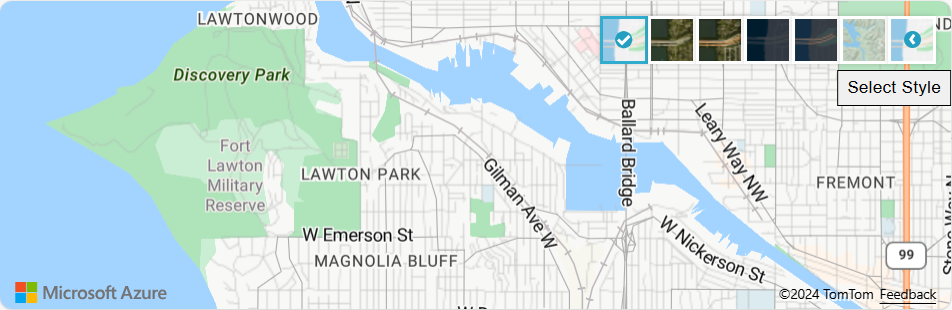

# Change the style of the map

The map supports several different [style options](https://docs.microsoft.com/javascript/api/azure-maps-control/atlas.styleoptions) that can be set when the map is being initialized or later using the maps `setStyle` function. This article shows how to use these style options to customize the maps appearance. Learn to set a style upon loading a map, and learn to set a new map style using the style picker control.

## Set the style options 

Style options can be passed into the map when it is initialized or updated later using the maps `setStyle` function.

```javascript
//Set the style options when creating the map.
var map = new atlas.Map('map', {
    renderWorldCopies: false,
    showBuildingModels: true

    //Additional map options.
};

//Update the style options at anytime using setStyle function.
map.setStyle({
    renderWorldCopies: true,
    showBuildingModels: false
});
```

The following tool shows how the different style options change how the map is rendered. To see the 3D buildings, zoom in close to a major city. 

<br/>

<iframe height="700" style="width: 100%;" scrolling="no" title="Map style options" src="https://codepen.io/azuremaps/embed/eYNMjPb?height=700&theme-id=0&default-tab=result" frameborder="no" allowtransparency="true" allowfullscreen="true">
  See the Pen <a href='https://codepen.io/azuremaps/pen/eYNMjPb'>Map style options</a> by Azure Maps
  (<a href='https://codepen.io/azuremaps'>@azuremaps</a>) on <a href='https://codepen.io'>CodePen</a>.
</iframe>

## Choose a base map style

One of the most common map style options is used to change the style of the base map that is styled. Many of the [supported map styles in Azure Maps](supported-map-styles.md) are available in the Web SDK. 

### Set base map style on map load


The map style can be specified when initializing the map by setting the `style` option. In the following code, the `style` option of the map is set to `grayscale_dark` on initialization.

```javascript
var map = new atlas.Map('map', {
    style: 'grayscale_dark',

    //Additiona map options
);
```

<br/>

<iframe height='500' scrolling='no' title='Setting the style on map load' src='//codepen.io/azuremaps/embed/WKOQRq/?height=265&theme-id=0&default-tab=js,result&embed-version=2&editable=true' frameborder='no' allowtransparency='true' allowfullscreen='true' style='width: 100%;'>See the Pen <a href='https://codepen.io/azuremaps/pen/WKOQRq/'>Setting the style on map load</a> by Azure Maps (<a href='https://codepen.io/azuremaps'>@azuremaps</a>) on <a href='https://codepen.io'>CodePen</a>.
</iframe>

### Update the base map style

 The map style can be updated using the `setStyle` function and setting the `style` option to the desired map style.

```javascript
map.setStyle({ style: 'satellite' });
```

In the following code, after a map instance is loaded, the map style is updated from `road` to `satellite` using the [setStyle](https://docs.microsoft.com/javascript/api/azure-maps-control/atlas.map?view=azure-maps-typescript-latest#setstyle-styleoptions-) function.

<br/>

<iframe height='500' scrolling='no' title='Updating the style' src='//codepen.io/azuremaps/embed/yqXYzY/?height=265&theme-id=0&default-tab=js,result&embed-version=2&editable=true' frameborder='no' allowtransparency='true' allowfullscreen='true' style='width: 100%;'>See the Pen <a href='https://codepen.io/azuremaps/pen/yqXYzY/'>Updating the style</a> by Azure Maps (<a href='https://codepen.io/azuremaps'>@azuremaps</a>) on <a href='https://codepen.io'>CodePen</a>.
</iframe>

### Add the style picker

The style picker control provides an easy to use button with flyout panel that can be used to by the end user to change the map style. The style picker has two different layout options. By default the style picker uses the `icons` layout and displays all the map style as a horizontal row of icons. 

<center>

</center>

The second layout option is called `list` and displays a scrollable list of map styles.  

<center>

</center>


The following code shows how to create an instance of the style picker control and add it to the top right corner of the map. The style picker is set to have a dark style and show a selected few map styles using the list layer.

```javascript
map.controls.add(new atlas.control.StyleControl({
    mapStyles: ['road', 'night', 'grayscale_dark', 'grayscale_light'],
    layout: 'list',
    style: 'dark'
}), {
    position: 'top-right'
}); 
```

The following code adds a style picker control with its default settings to the map, so the user can easily switch between the different map styles. Toggle the map style using the map style control near the top right corner.

<br/>

<iframe height='500' scrolling='no' title='Adding the style picker' src='//codepen.io/azuremaps/embed/OwgyvG/?height=265&theme-id=0&default-tab=js,result&embed-version=2&editable=true' frameborder='no' allowtransparency='true' allowfullscreen='true' style='width: 100%;'>See the Pen <a href='https://codepen.io/azuremaps/pen/OwgyvG/'>Adding the style picker</a> by Azure Maps (<a href='https://codepen.io/azuremaps'>@azuremaps</a>) on <a href='https://codepen.io'>CodePen</a>.
</iframe>

> [!TIP]
> By default, when using the S0 pricing tier of Azure Maps, the style picker control lists all the available styles. If you want to reduce the number of styles in this list, pass an array of the styles you want to appear in the list into the `mapStyle` option of the style picker. If you are using S1 and want to show all the available styles, set the `mapStyles` option of the style picker to `"all"`.

## Next steps

To learn more about the classes and methods used in this article:

> [!div class="nextstepaction"]
> [Map](https://docs.microsoft.com/javascript/api/azure-maps-control/atlas.map)

> [!div class="nextstepaction"]
> [StyleOptions](https://docs.microsoft.com/javascript/api/azure-maps-control/atlas.styleoptions)

> [!div class="nextstepaction"]
> [StyleControl](https://docs.microsoft.com/javascript/api/azure-maps-control/atlas.control.stylecontrol)

> [!div class="nextstepaction"]
> [StyleControlOptions](https://docs.microsoft.com/javascript/api/azure-maps-control/atlas.stylecontroloptions)

Add controls to your maps:

> [!div class="nextstepaction"]
> [Add map controls](map-add-controls.md)

> [!div class="nextstepaction"]
> [Add a pin](map-add-pin.md)
