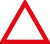

# Clustering point data in the iOS SDK (Preview)

When displaying many data points on the map, data points may overlap over each other. The overlap may cause the map may become unreadable and difficult to use. Clustering point data is the process of combining point data that are near each other and representing them on the map as a single clustered data point. As the user zooms into the map, the clusters break apart into their individual data points. When you work with large number of data points, use the clustering processes to improve your user experience.

[Internet of Things Show - Clustering point data in Azure Maps]

## Prerequisites

Be sure to complete the steps in the [Quickstart: Create an iOS app] document. Code blocks in this article can be inserted into the  `viewDidLoad` function of `ViewController`.

## Enabling clustering on a data source

Enable clustering in the `DataSource` class by setting the `cluster` option to `true`. Set `clusterRadius` to select nearby data points and combines them into a cluster. The value of `clusterRadius` is in points. Use `clusterMaxZoom` to specify a zoom level at which to disable the clustering logic. Here's an example of how to enable clustering in a data source.

```swift
// Create a data source and enable clustering.
let source = DataSource(options: [
    //Tell the data source to cluster point data.
    .cluster(true),

    //The radius in points to cluster data points together.
    .clusterRadius(45),

    //The maximum zoom level in which clustering occurs.
    //If you zoom in more than this, all points are rendered as symbols.
    .clusterMaxZoom(15)
])
```

> [!Caution]
> Clustering only works with `Point` features. If your data source contains features of other geometry types, such as `Polyline` or `Polygon`, an error will occur.

> [!TIP]
> If two data points are close together on the ground, it's possible the cluster will never break apart, no matter how close the user zooms in. To address this, you can set the `clusterMaxZoom` option to disable the clustering logic and simply display everything.

The `DataSource` class provides the following methods related to clustering as well.

| Method | Return type | Description |
|--------|-------------|-------------|
| `children(of cluster: Feature)` | `[Feature]` | Retrieves the children of the given cluster on the next zoom level. These children may be a combination of features and subclusters. The subclusters become features with properties matching ClusteredProperties. |
| `zoomLevel(forExpanding cluster: Feature)` | `Double` | Calculates a zoom level at which the cluster starts expanding or break apart. |
| `leaves(of cluster: Feature, offset: UInt, limit: UInt)` | `[Feature]` | Retrieves all points in a cluster. Set the `limit` to return a subset of the points, and use the `offset` to page through the points. |

## Display clusters using a bubble layer

A bubble layer is a great way to render clustered points. Use expressions to scale the radius and change the color based on the number of points in the cluster. If you display clusters using a bubble layer, then you should use a separate layer to render unclustered data points.

To display the size of the cluster on top of the bubble, use a symbol layer with text, and don't use an icon.

The following code displays clustered points using a bubble layer, and the number of points in each cluster using a symbol layer. A second symbol layer is used to display individual points that aren't within a cluster.

```swift
// Create a data source and enable clustering.
let source = DataSource(options: [
    // Tell the data source to cluster point data.
    .cluster(true),

    // The radius in points to cluster data points together.
    .clusterRadius(45),

    // The maximum zoom level in which clustering occurs.
    // If you zoom in more than this, all points are rendered as symbols.
    .clusterMaxZoom(15)
])

// Import the geojson data and add it to the data source.
let url = URL(string: "https://earthquake.usgs.gov/earthquakes/feed/v1.0/summary/all_week.geojson")!
source.importData(fromURL: url)

// Add data source to the map.
map.sources.add(source)

// Create a bubble layer for rendering clustered data points.
map.layers.addLayer(
    BubbleLayer(
        source: source,
        options: [
            // Scale the size of the clustered bubble based on the number of points in the cluster.
            .bubbleRadius(
                from: NSExpression(
                    forAZMStepping: NSExpression(forKeyPath: "point_count"),
                    // Default of 20 point radius.
                    from: NSExpression(forConstantValue: 20),
                    stops: NSExpression(forConstantValue: [

                        // If point_count >= 100, radius is 30 points.
                        100: 30,

                        // If point_count >= 750, radius is 40 points.
                        750: 40
                    ])
                )
            ),

            // Change the color of the cluster based on the value on the point_count property of the cluster.
            .bubbleColor(
                from: NSExpression(
                    forAZMStepping: NSExpression(forKeyPath: "point_count"),
                    // Default to green.
                    from: NSExpression(forConstantValue: UIColor.green),
                    stops: NSExpression(forConstantValue: [

                        // If the point_count >= 100, color is yellow.
                        100: UIColor.yellow,

                        // If the point_count >= 100, color is red.
                        750: UIColor.red
                    ])
                )
            ),
            .bubbleStrokeWidth(0),

            // Only rendered data points which have a point_count property, which clusters do.
            .filter(from: NSPredicate(format: "point_count != NIL"))
        ]
    )
)

// Create a symbol layer to render the count of locations in a cluster.
map.layers.addLayer(
    SymbolLayer(
        source: source,
        options: [
            // Hide the icon image.
            .iconImage(nil),

            // Display the point count as text.
            .textField(from: NSExpression(forKeyPath: "point_count")),
            .textOffset(CGVector(dx: 0, dy: 0.4)),
            .textAllowOverlap(true),

            // Allow clustered points in this layer.
            .filter(from: NSPredicate(format: "point_count != NIL"))
        ]
    )
)

// Create a layer to render the individual locations.
map.layers.addLayer(
    SymbolLayer(
        source: source,
        options: [
            // Filter out clustered points from this layer.
            .filter(from: NSPredicate(format: "point_count = NIL"))
        ]
    )
)
```

The following image shows the above code display clustered point features in a bubble layer, scaled and colored based on the number of points in the cluster. Unclustered points are rendered using a symbol layer.

:::image type="content" source="./media/ios-sdk/cluster-point-data-ios-sdk/ios-cluster-bubble-layer.gif" alt-text="Map clustered locations breaking apart while zooming the map in.":::

## Display clusters using a symbol layer

When displaying data points, the symbol layer automatically hides symbols that overlap each other to ensure a cleaner user interface. This default behavior might be undesirable if you want to show the data points density on the map. However, these settings can be changed. To display all symbols, set the `iconAllowOverlap` option of the Symbol layer to `true`.

Use clustering to show the data points density while keeping a clean user interface. The following sample shows you how to add custom symbols and represent clusters and individual data points using the symbol layer.

```swift
// Load all the custom image icons into the map resources.
map.images.add(UIImage(named: "earthquake_icon")!, withID: "earthquake_icon")
map.images.add(UIImage(named: "warning-triangle-icon")!, withID: "warning-triangle-icon")

// Create a data source and add it to the map.
let source = DataSource(options: [
    // Tell the data source to cluster point data.
    .cluster(true)
])

// Import the geojson data and add it to the data source.
let url = URL(string: "https://earthquake.usgs.gov/earthquakes/feed/v1.0/summary/all_week.geojson")!
source.importData(fromURL: url)

// Add data source to the map.
map.sources.add(source)

// Create a layer to render the individual locations.
map.layers.addLayer(
    SymbolLayer(
        source: source,
        options: [
            .iconImage("earthquake_icon"),

            // Filter out clustered points from this layer.
            .filter(from: NSPredicate(format: "point_count = NIL"))
        ]
    )
)

// Create a symbol layer to render the clusters.
map.layers.addLayer(
    SymbolLayer(
        source: source,
        options: [
            .iconImage("warning-triangle-icon"),
            .textField(from: NSExpression(forKeyPath: "point_count")),
            .textOffset(CGVector(dx: 0, dy: -0.4)),

            // Allow clustered points in this layer.
            .filter(from: NSPredicate(format: "point_count != NIL"))
        ]
    )
)
```

For this sample, the following image is loaded into the assets folder of the app.

|  |  |
|:-----------------------:|:--------------------------:|
| earthquake-icon.png     | warning-triangle-icon.png  |

The following image shows the above code rendering clustered and unclustered point features using custom icons.

:::image type="content" source="./media/ios-sdk/cluster-point-data-ios-sdk/ios-cluster-symbol-layer.gif" alt-text="Map of clustered points rendered using a symbol layer.":::

## Clustering and the heat map layer

Heat maps are a great way to display the density of data on the map. This visualization method can handle a large number of data points on its own. If the data points are clustered and the cluster size is used as the weight of the heat map, then the heat map can handle even more data. To achieve this option, set the `heatmapWeight` option of the heat map layer to `NSExpression(forKeyPath: "point_count")`. When the cluster radius is small, the heat map looks nearly identical to a heat map using the unclustered data points, but it performs better. However, the smaller the cluster radius, the more accurate the heat map is, but with fewer performance benefits.

```swift
// Create a data source and enable clustering.
let source = DataSource(options: [
    // Tell the data source to cluster point data.
    .cluster(true),

    // The radius in points to cluster points together.
    .clusterRadius(10)
])

// Import the geojson data and add it to the data source.
let url = URL(string: "https://earthquake.usgs.gov/earthquakes/feed/v1.0/summary/all_week.geojson")!
source.importData(fromURL: url)

// Add data source to the map.
map.sources.add(source)

// Create a heat map and add it to the map.
map.layers.insertLayer(
    HeatMapLayer(
        source: source,
        options: [
            // Set the weight to the point_count property of the data points.
            .heatmapWeight(from: NSExpression(forKeyPath: "point_count")),

            // Optionally adjust the radius of each heat point.
            .heatmapRadius(20)
        ]
    ),
    below: "labels"
)
```

The following image shows the above code displaying a heat map optimized by using clustered point features and the cluster count as the weight in the heat map.

:::image type="content" source="./media/ios-sdk/cluster-point-data-ios-sdk/ios-cluster-heat-map.gif" alt-text="Map of a heatmap optimized using clustered points as a weight.":::

## Tap events on clustered data points

When tap events occur on a layer that contains clustered data points, the clustered data point return to the event as a GeoJSON point feature object. This point feature has the following properties:

| Property name             | Type    | Description   |
|---------------------------|---------|---------------|
| `cluster`                 | boolean | Indicates if feature represents a cluster. |
| `point_count`             | number  | The number of points the cluster contains.  |
| `point_count_abbreviated` | string  | A string that abbreviates the `point_count` value if it's long. (for example, 4,000 becomes 4K)  |

This example takes a bubble layer that renders cluster points and adds a tap event. When the tap event triggers, the code calculates and zooms the map to the next zoom level, at which the cluster breaks apart. This functionality is implemented using the `zoomLevel(forExpanding:)` method of the `DataSource` class.

```swift
// Create a data source and enable clustering.
let source = DataSource(options: [
    // Tell the data source to cluster point data.
    .cluster(true),

    // The radius in points to cluster data points together.
    .clusterRadius(45),

    // The maximum zoom level in which clustering occurs.
    // If you zoom in more than this, all points are rendered as symbols.
    .clusterMaxZoom(15)
])

// Set data source to the class property to use in events handling later.
self.source = source

// Import the geojson data and add it to the data source.
let url = URL(string: "https://earthquake.usgs.gov/earthquakes/feed/v1.0/summary/all_week.geojson")!
source.importData(fromURL: url)

// Add data source to the map.
map.sources.add(source)

// Create a bubble layer for rendering clustered data points.
let clusterBubbleLayer = BubbleLayer(
    source: source,
    options: [
        // Scale the size of the clustered bubble based on the number of points in the cluster.
        .bubbleRadius(
            from: NSExpression(
                forAZMStepping: NSExpression(forKeyPath: "point_count"),
                // Default of 20 point radius.
                from: NSExpression(forConstantValue: 20),
                stops: NSExpression(forConstantValue: [
                    // If point_count >= 100, radius is 30 points.
                    100: 30,

                    // If point_count >= 750, radius is 40 points.
                    750: 40
                ])
            )
        ),

        // Change the color of the cluster based on the value on the point_count property of the cluster.
        .bubbleColor(
            from: NSExpression(
                forAZMStepping: NSExpression(forKeyPath: "point_count"),
                // Default to green.
                from: NSExpression(forConstantValue: UIColor.green),
                stops: NSExpression(forConstantValue: [
                    // If the point_count >= 100, color is yellow.
                    100: UIColor.yellow,

                    // If the point_count >= 100, color is red.
                    750: UIColor.red
                ])
            )
        ),
        .bubbleStrokeWidth(0),

        // Only rendered data points which have a point_count property, which clusters do.
        .filter(from: NSPredicate(format: "point_count != NIL"))
    ]
)

// Add the clusterBubbleLayer to the map.
map.layers.addLayer(clusterBubbleLayer)

// Create a symbol layer to render the count of locations in a cluster.
map.layers.addLayer(
    SymbolLayer(
        source: source,
        options: [
            // Hide the icon image.
            .iconImage(nil),

            // Display the point count as text.
            .textField(from: NSExpression(forKeyPath: "point_count_abbreviated")),

            // Offset the text position so that it's centered nicely.
            .textOffset(CGVector(dx: 0, dy: 0.4)),

            // Allow text overlapping so text is visible anyway
            .textAllowOverlap(true),

            // Allow clustered points in this layer.
            .filter(from: NSPredicate(format: "point_count != NIL"))
        ]
    )
)

// Create a layer to render the individual locations.
map.layers.addLayer(
    SymbolLayer(
        source: source,
        options: [
            // Filter out clustered points from this layer.
            .filter(from: NSPredicate(format: "point_count = NIL"))
        ]
    )
)

// Add the delegate to handle taps on the clusterBubbleLayer only.
map.events.addDelegate(self, for: [clusterBubbleLayer.id])
```

```swift
func azureMap(_ map: AzureMap, didTapOn features: [Feature]) {
    guard let source = source, let cluster = features.first else {
        // Data source have been released or no features provided
        return
    }

    // Get the cluster expansion zoom level. This is the zoom level at which the cluster starts to break apart.
    let expansionZoom = source.zoomLevel(forExpanding: cluster)

    // Update the map camera to be centered over the cluster.
    map.setCameraOptions([
        // Center the map over the cluster points location.
        .center(cluster.coordinate),

        // Zoom to the clusters expansion zoom level.
        .zoom(expansionZoom),

        // Animate the movement of the camera to the new position.
        .animationType(.ease),
        .animationDuration(200)
    ])
}
```

The following image shows the above code displaying clustered points on a map that when tapped, zoom into the next zoom level that a cluster starts to break apart and expand.

:::image type="content" source="./media/ios-sdk/cluster-point-data-ios-sdk/ios-cluster-expansion.gif" alt-text="Map of clustered features zooming in and breaking apart when tapped.":::

## Display cluster area

The point data that a cluster represents is spread over an area. In this sample when a cluster is tapped, two main behaviors occur. First, the individual data points contained in the cluster used to calculate a convex hull. Then, the convex hull is displayed on the map to show an area.  A convex hull is a polygon that wraps a set of points like an elastic band and can be calculated using the `convexHull(from:)` method. All points contained in a cluster can be retrieved from the data source using the `leaves(of:offset:limit:)` method.

```swift
// Create a data source and enable clustering.
let source = DataSource(options: [
    // Tell the data source to cluster point data.
    .cluster(true)
])

// Set data source to the class property to use in events handling later.
self.source = source

// Import the geojson data and add it to the data source.
let url = URL(string: "https://earthquake.usgs.gov/earthquakes/feed/v1.0/summary/all_week.geojson")!
source.importData(fromURL: url)

// Add data source to the map.
map.sources.add(source)

// Create a data source for the convex hull polygon.
// Since this will be updated frequently it is more efficient to separate this into its own data source.
let polygonDataSource = DataSource()

// Set polygon data source to the class property to use in events handling later.
self.polygonDataSource = polygonDataSource

// Add data source to the map.
map.sources.add(polygonDataSource)

// Add a polygon layer and a line layer to display the convex hull.
map.layers.addLayer(PolygonLayer(source: polygonDataSource))
map.layers.addLayer(LineLayer(source: polygonDataSource))

// Load an icon into the image sprite of the map.
map.images.add(.azm_markerRed, withID: "marker-red")

// Create a symbol layer to render the clusters.
let clusterLayer = SymbolLayer(
    source: source,
    options: [
        .iconImage("marker-red"),
        .textField(from: NSExpression(forKeyPath: "point_count_abbreviated")),
        .textOffset(CGVector(dx: 0, dy: -1.2)),
        .textColor(.white),
        .textSize(14),

        // Only rendered data points which have a point_count property, which clusters do.
        .filter(from: NSPredicate(format: "point_count != NIL"))
    ]
)

// Add the clusterLayer to the map.
map.layers.addLayer(clusterLayer)

// Create a layer to render the individual locations.
map.layers.addLayer(
    SymbolLayer(
        source: source,
        options: [
            // Filter out clustered points from this layer.
            .filter(from: NSPredicate(format: "point_count = NIL"))
        ]
    )
)

// Add the delegate to handle taps on the clusterLayer only
// and then calculate the convex hull of all the points within a cluster.
map.events.addDelegate(self, for: [clusterLayer.id])
```

```swift
func azureMap(_ map: AzureMap, didTapOn features: [Feature]) {
    guard let source = source, let polygonDataSource = polygonDataSource, let cluster = features.first else {
        // Data source have been released or no features provided
        return
    }

    // Get all points in the cluster. Set the offset to 0 and the max int value to return all points.
    let featureLeaves = source.leaves(of: cluster, offset: 0, limit: .max)

    // When only two points in a cluster. Render a line.
    if featureLeaves.count == 2 {

        // Extract the locations from the feature leaves.
        let locations = featureLeaves.map(\.coordinate)

        // Create a line from the points.
        polygonDataSource.set(geometry: Polyline(locations))

        return
    }

    // When more than two points in a cluster. Render a polygon.
    if let hullPolygon = Math.convexHull(from: featureLeaves) {

        // Overwrite all data in the polygon data source with the newly calculated convex hull polygon.
        polygonDataSource.set(geometry: hullPolygon)
    }
}
```

The following image shows the above code displaying the area of all points within a tapped cluster.

:::image type="content" source="./media/ios-sdk/cluster-point-data-ios-sdk/ios-cluster-leaves-convex-hull.gif" alt-text="Map showing convex hull polygon of all points within a tapped cluster.":::

## Aggregating data in clusters

Often clusters are represented using a symbol with the number of points that are within the cluster. But, sometimes it's desirable to customize the style of clusters with additional metrics. With cluster properties, custom properties can be created and equal to a calculation based on the properties within each point with a cluster. Cluster properties can be defined in `clusterProperties` option of the `DataSource`.

The following code calculates a count based on the entity type property of each data point in a cluster. When a user taps on a cluster, a popup shows with additional information about the cluster.

```swift
// Create a popup and add it to the map.
let popup = Popup()
map.popups.add(popup)

// Set popup to the class property to use in events handling later.
self.popup = popup

// Close the popup initially.
popup.close()

// Create a data source and enable clustering.
let source = DataSource(options: [
    // Tell the data source to cluster point data.
    .cluster(true),

    // The radius in points to cluster data points together.
    .clusterRadius(50),

    // Calculate counts for each entity type in a cluster as custom aggregate properties.
    .clusterProperties(self.entityTypes.map { entityType in
        ClusterProperty(
            name: entityType,
            operator: NSExpression(
                forFunction: "sum:",
                arguments: [
                    NSExpression.featureAccumulatedAZMVariable,
                    NSExpression(forKeyPath: entityType)
                ]
            ),
            map: NSExpression(
                forConditional: NSPredicate(format: "EntityType = '\(entityType)'"),
                trueExpression: NSExpression(forConstantValue: 1),
                falseExpression: NSExpression(forConstantValue: 0)
            )
        )
    })
])

// Import the geojson data and add it to the data source.
let url = URL(string: "https://samples.azuremaps.com/data/geojson/SamplePoiDataSet.json")!
source.importData(fromURL: url)

// Add data source to the map.
map.sources.add(source)

// Create a bubble layer for rendering clustered data points.
let clusterBubbleLayer = BubbleLayer(
    source: source,
    options: [
        .bubbleRadius(20),
        .bubbleColor(.purple),
        .bubbleStrokeWidth(0),

        // Only rendered data points which have a point_count property, which clusters do.
        .filter(from: NSPredicate(format: "point_count != NIL"))
    ]
)

// Add the clusterBubbleLayer to the map.
map.layers.addLayer(clusterBubbleLayer)

// Create a symbol layer to render the count of locations in a cluster.
map.layers.addLayer(
    SymbolLayer(
        source: source,
        options: [
            // Hide the icon image.
            .iconImage(nil),

            // Display the 'point_count_abbreviated' property value.
            .textField(from: NSExpression(forKeyPath: "point_count_abbreviated")),

            .textColor(.white),
            .textOffset(CGVector(dx: 0, dy: 0.4)),

            // Allow text overlapping so text is visible anyway
            .textAllowOverlap(true),

            // Only rendered data points which have a point_count property, which clusters do.
            .filter(from: NSPredicate(format: "point_count != NIL"))
        ]
    )
)

// Create a layer to render the individual locations.
map.layers.addLayer(
    SymbolLayer(
        source: source,
        options: [
            // Filter out clustered points from this layer.
            SymbolLayerOptions.filter(from: NSPredicate(format: "point_count = NIL"))
        ]
    )
)

// Add the delegate to handle taps on the clusterBubbleLayer only
// and display the aggregate details of the cluster.
map.events.addDelegate(self, for: [clusterBubbleLayer.id])
```

```swift
func azureMap(_ map: AzureMap, didTapOn features: [Feature]) {
    guard let popup = popup, let cluster = features.first else {
        // Popup has been released or no features provided
        return
    }

    // Create a number formatter that removes decimal places.
    let nf = NumberFormatter()
    nf.maximumFractionDigits = 0

    // Create the popup's content.
    var text = ""

    let pointCount = cluster.properties["point_count"] as! Int
    let pointCountString = nf.string(from: pointCount as NSNumber)!

    text.append("Cluster size: \(pointCountString) entities\n")

    entityTypes.forEach { entityType in
        text.append("\n")
        text.append("\(entityType): ")

        // Get the aggregated entity type count from the properties of the cluster by name.
        let aggregatedCount = cluster.properties[entityType] as! Int
        let aggregatedCountString = nf.string(from: aggregatedCount as NSNumber)!

        text.append(aggregatedCountString)
    }

    // Create the custom view for the popup.
    let customView = PopupTextView()

    // Set the text to the custom view.
    customView.setText(text)

    // Get the position of the cluster.
    let position = Math.positions(from: cluster).first!

    // Set the options on the popup.
    popup.setOptions([
        // Set the popups position.
        .position(position),

        // Set the anchor point of the popup content.
        .anchor(.bottom),

        // Set the content of the popup.
        .content(customView)
    ])

    // Open the popup.
    popup.open()
}
```

The popup follows the steps outlined in the [display a popup] document.

The following image shows the above code displaying a popup with aggregated counts of each entity value type for all points in the tapped clustered point.

:::image type="content" source="./media/ios-sdk/cluster-point-data-ios-sdk/ios-cluster-aggregates.gif" alt-text="Map showing popup of aggregated counts of entity types of all points in a cluster.":::

## Additional information

To add more data to your map:

- [Create a data source]
- [Add a symbol layer]
- [Add a bubble layer]

[Add a bubble layer]: add-bubble-layer-map-ios.md
[Add a symbol layer]: add-symbol-layer-ios.md
[Create a data source]: create-data-source-ios-sdk.md
[display a popup]: Display-feature-information-ios-sdk.md
[Internet of Things Show - Clustering point data in Azure Maps]: /shows/Internet-of-Things-Show/Clustering-point-data-in-Azure-Maps/player?format=ny
[Quickstart: Create an iOS app]: quick-ios-app.md
