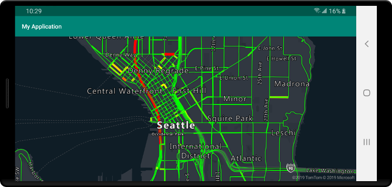
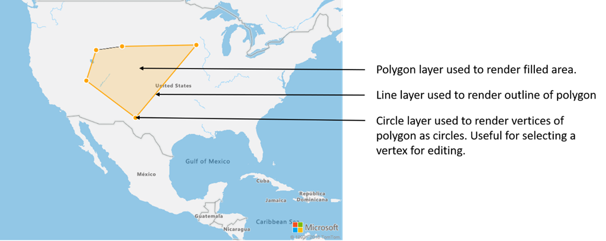

# Create a data source (Android SDK)

The Azure Maps Android SDK stores data in data sources. Using data sources optimizes the data operations for querying and rendering. Currently there are two types of data sources:

- **GeoJSON source**: Manages raw location data in GeoJSON format locally. Good for small to medium data sets (upwards of hundreds of thousands of shapes).
- **Vector tile source**: Loads data formatted as vector tiles for the current map view, based on the maps tiling system. Ideal for large to massive data sets (millions or billions of shapes).

## GeoJSON data source

Azure Maps uses GeoJSON as one of its primary data models. GeoJSON is an open geospatial standard way for representing geospatial data in JSON format. GeoJSON classes available in the Azure Maps Android SDK to easy create, and serialize GeoJSON data. Load and store GeoJSON data in the `DataSource` class and render it using layers. The following code shows how GeoJSON objects can be created in Azure Maps.

::: zone pivot="programming-language-java-android"

```java
/*
    Raw GeoJSON feature
    
    {
         "type": "Feature",
         "geometry": {
             "type": "Point",
             "coordinates": [-100, 45]
         },
         "properties": {
             "custom-property": "value"
         }
    }

*/

//Create a point feature.
Feature feature = Feature.fromGeometry(Point.fromLngLat(-100, 45));

//Add a property to the feature.
feature.addStringProperty("custom-property", "value");

//Add the feature to the data source.
source.add(feature);
```

::: zone-end

::: zone pivot="programming-language-kotlin"

```kotlin
/*
    Raw GeoJSON feature
    
    {
         "type": "Feature",
         "geometry": {
             "type": "Point",
             "coordinates": [-100, 45]
         },
         "properties": {
             "custom-property": "value"
         }
    }

*/

//Create a point feature.
val feature = Feature.fromGeometry(Point.fromLngLat(-100, 45))

//Add a property to the feature.
feature.addStringProperty("custom-property", "value")

//Add the feature to the data source.
source.add(feature)
```

> [!TIP]
> GeoJSON data can be added to a `DataSource` instance using one of three methods; `add`, `importDataFromUrl`, and `setShapes`. The `setShapes` method provides an efficient way to overwrite all data in a data source. If you call the `clear` then `add` methods to replace all data in a data source, two render calls will be made to the map. The `setShape` method clears and adds the data to the data source with a single render call to the map.

::: zone-end

Alternatively the properties can be loaded into a JsonObject first then passed into the feature when creating it, as shown in the following sample code.

::: zone pivot="programming-language-java-android"

```java
//Create a JsonObject to store properties for the feature.
JsonObject properties = new JsonObject();
properties.addProperty("custom-property", "value");

Feature feature = Feature.fromGeometry(Point.fromLngLat(-100, 45), properties);
```

::: zone-end

::: zone pivot="programming-language-kotlin"

```kotlin
//Create a JsonObject to store properties for the feature.
val properties = JsonObject()
properties.addProperty("custom-property", "value")

val feature = Feature.fromGeometry(Point.fromLngLat(-100, 45), properties)
```

::: zone-end

Once you have a GeoJSON feature created, a data source can be added to the map through the `sources` property of the map. The following code shows how to create a `DataSource`, add it to the map, and add a feature to the data source.

```javascript
//Create a data source and add it to the map.
DataSource source = new DataSource();
map.sources.add(source);

//Add GeoJSON feature to the data source.
source.add(feature);
```

The following code shows several ways to create a GeoJSON Feature, FeatureCollection, and geometries.

::: zone pivot="programming-language-java-android"

```java
//GeoJSON Point Geometry
Point point = Point.fromLngLat(LONGITUDE, LATITUDE);

//GeoJSON Point Geometry
LineString linestring = LineString.fromLngLats(PointList);

//GeoJSON Polygon Geometry
Polygon polygon = Polygon.fromLngLats(listOfPointList);
 
Polygon polygonFromOuterInner = Polygon.fromOuterInner(outerLineStringObject,innerLineStringObject);

//GeoJSON MultiPoint Geometry
MultiPoint multiPoint = MultiPoint.fromLngLats(PointList);

//GeoJSON MultiLineString Geometry
MultiLineString multiLineStringFromLngLat = MultiLineString.fromLngLats(listOfPointList);

MultiLineString multiLineString = MultiLineString.fromLineString(singleLineString);

//GeoJSON MultiPolygon Geometry
MultiPolygon multiPolygon = MultiPolygon.fromLngLats(listOflistOfPointList);

MultiPolygon multiPolygonFromPolygon = MultiPolygon.fromPolygon(polygon);

MultiPolygon multiPolygonFromPolygons = MultiPolygon.fromPolygons(PolygonList);

//GeoJSON Feature
Feature pointFeature = Feature.fromGeometry(Point.fromLngLat(LONGITUDE, LATITUDE));
 
//GeoJSON FeatureCollection 
FeatureCollection featureCollectionFromSingleFeature = FeatureCollection.fromFeature(pointFeature);
 
FeatureCollection featureCollection = FeatureCollection.fromFeatures(listOfFeatures);
```

::: zone-end

::: zone pivot="programming-language-kotlin"

```kotlin
//GeoJSON Point Geometry
val point = Point.fromLngLat(LONGITUDE, LATITUDE)

//GeoJSON Point Geometry
val linestring = LineString.fromLngLats(PointList)

//GeoJSON Polygon Geometry
val polygon = Polygon.fromLngLats(listOfPointList)

val polygonFromOuterInner = Polygon.fromOuterInner(outerLineStringObject, innerLineStringObject)

//GeoJSON MultiPoint Geometry
val multiPoint = MultiPoint.fromLngLats(PointList)

//GeoJSON MultiLineString Geometry
val multiLineStringFromLngLat = MultiLineString.fromLngLats(listOfPointList)

val multiLineString = MultiLineString.fromLineString(singleLineString)

//GeoJSON MultiPolygon Geometry
val multiPolygon = MultiPolygon.fromLngLats(listOflistOfPointList)

val multiPolygonFromPolygon = MultiPolygon.fromPolygon(polygon)

val multiPolygonFromPolygons = MultiPolygon.fromPolygons(PolygonList)

//GeoJSON Feature
val pointFeature = Feature.fromGeometry(Point.fromLngLat(LONGITUDE, LATITUDE))

//GeoJSON FeatureCollection 
val featureCollectionFromSingleFeature = FeatureCollection.fromFeature(pointFeature)

val featureCollection = FeatureCollection.fromFeatures(listOfFeatures)
```

::: zone-end

### Serialize and deserialize GeoJSON

The feature collection, feature, and geometry classes all have `fromJson()` and `toJson()` static methods, which help with serialization. The formatted valid JSON String passed through the `fromJson()` method creates the geometry object. This `fromJson()` method also means you can use Gson or other serialization/deserialization strategies. The following code shows how to take a stringified GeoJSON feature and deserialize it into the Feature class, then serialize it back into a GeoJSON string.

::: zone pivot="programming-language-java-android"

```java
//Take a stringified GeoJSON object.
String GeoJSON_STRING = "{"
    + "      \"type\": \"Feature\","            
    + "      \"geometry\": {"
    + "            \"type\": \"Point\""
    + "            \"coordinates\": [-100, 45]"
    + "      },"
    + "      \"properties\": {"
    + "            \"custom-property\": \"value\""
    + "      },"
    + "}";

//Deserialize the JSON string into a feature.
Feature feature = Feature.fromJson(GeoJSON_STRING);
 
//Serialize a feature collection to a string.
String featureString = feature.toJson();
```

::: zone-end

::: zone pivot="programming-language-kotlin"

```kotlin
//Take a stringified GeoJSON object.
val GeoJSON_STRING = ("{"
        + "      \"type\": \"Feature\","
        + "      \"geometry\": {"
        + "            \"type\": \"Point\""
        + "            \"coordinates\": [-100, 45]"
        + "      },"
        + "      \"properties\": {"
        + "            \"custom-property\": \"value\""
        + "      },"
        + "}")

//Deserialize the JSON string into a feature.
val feature = Feature.fromJson(GeoJSON_STRING)

//Serialize a feature collection to a string.
val featureString = feature.toJson()
```

::: zone-end

### Import GeoJSON data from web or assets folder

Most GeoJSON files contain a FeatureCollection. Read GeoJSON files as strings and used the `FeatureCollection.fromJson` method to deserialize it.

The `DataSource` class has a built-in method called `importDataFromUrl` that can load in GeoJSON files using a URL to a file on the web or in the asset folder. This method **must** be called before the data source is added to the map.

zone_pivot_groups: azure-maps-android

::: zone pivot="programming-language-java-android"

``` java
//Create a data source and add it to the map.
DataSource source = new DataSource();

//Import the geojson data and add it to the data source.
source.importDataFromUrl("URL_or_FilePath_to_GeoJSON_data");

//Examples:
//source.importDataFromUrl("asset://sample_file.json");
//source.importDataFromUrl("https://example.com/sample_file.json");

//Add data source to the map.
map.sources.add(source);
```

::: zone-end

::: zone pivot="programming-language-kotlin"

```kotlin
//Create a data source and add it to the map.
var source = new DataSource()

//Import the geojson data and add it to the data source.
source.importDataFromUrl("URL_or_FilePath_to_GeoJSON_data")

//Examples:
//source.importDataFromUrl("asset://sample_file.json")
//source.importDataFromUrl("https://example.com/sample_file.json")

//Add data source to the map.
map.sources.add(source)
```

::: zone-end

The `importDataFromUrl` method provides an easy way to load a GeoJSON feed into a data source but provides limited control on how the data is loaded and what happens after it's been loaded. The following code is a reusable class for importing data from the web or assets folder and returning it to the UI thread via a callback function. Next, add more post load logic in the callback to process the data, add it to the map, calculate its bounding box, and update the maps camera.

::: zone pivot="programming-language-java-android"

```java
import android.content.Context;
import android.os.Handler;
import android.os.Looper;
import android.webkit.URLUtil;

import java.io.BufferedReader;
import java.io.IOException;
import java.io.InputStream;
import java.io.InputStreamReader;
import java.net.URL;
import java.util.concurrent.ExecutorService;
import java.util.concurrent.Executors;

import javax.net.ssl.HttpsURLConnection;

public class Utils {

    interface SimpleCallback {
        void notify(String result);
    }

    /**
     * Imports data from a web url or asset file name and returns it to a callback.
     * @param urlOrFileName A web url or asset file name that points to data to load.
     * @param context The context of the app.
     * @param callback The callback function to return the data to.
     */
    public static void importData(String urlOrFileName, Context context, SimpleCallback callback){
        importData(urlOrFileName, context, callback, null);
    }
    
    /**
     * Imports data from a web url or asset file name and returns it to a callback.
     * @param urlOrFileName A web url or asset file name that points to data to load.
     * @param context The context of the app.
     * @param callback The callback function to return the data to.
     * @param error A callback function to return errors to.
     */
    public static void importData(String urlOrFileName, Context context, SimpleCallback callback, SimpleCallback error){
        if(urlOrFileName != null && callback != null) {
            ExecutorService executor = Executors.newSingleThreadExecutor();
            Handler handler = new Handler(Looper.getMainLooper());

            executor.execute(() -> {
                String data = null;

                try {

                    if(URLUtil.isNetworkUrl(urlOrFileName)){
                        data = importFromWeb(urlOrFileName);
                    } else {
                        //Assume file is in assets folder.
                        data = importFromAssets(context, urlOrFileName);
                    }

                    final String result = data;

                    handler.post(() -> {
                        //Ensure the resulting data string is not null or empty.
                        if (result != null && !result.isEmpty()) {
                            callback.notify(result);
                        } else {
                            error.notify("No data imported.");
                        }
                    });
                } catch(Exception e) {
                    if(error != null){
                        error.notify(e.getMessage());
                    }
                }
            });
        }
    }

    /**
     * Imports data from an assets file as a string.
     * @param context The context of the app.
     * @param fileName The asset file name.
     * @return
     * @throws IOException
     */
    private static String importFromAssets(Context context, String fileName) throws IOException {
        InputStream stream = null;

        try {
            stream = context.getAssets().open(fileName);

            if(stream != null) {
                return readStreamAsString(stream);
            }
        } catch (Exception e) {
            e.printStackTrace();
        } finally {
            // Close Stream and disconnect HTTPS connection.
            if (stream != null) {
                stream.close();
            }
        }

        return null;
    }

    /**
     * Imports data from the web as a string.
     * @param url URL to the data.
     * @return
     * @throws IOException
     */
    private static String importFromWeb(String url) throws IOException {
        InputStream stream = null;
        HttpsURLConnection connection = null;
        String result = null;

        try {
            connection = (HttpsURLConnection) new URL(url).openConnection();

            //For this use case, set HTTP method to GET.
            connection.setRequestMethod("GET");

            //Open communications link (network traffic occurs here).
            connection.connect();

            int responseCode = connection.getResponseCode();
            if (responseCode != HttpsURLConnection.HTTP_OK) {
                throw new IOException("HTTP error code: " + responseCode);
            }

            //Retrieve the response body as an InputStream.
            stream = connection.getInputStream();

            if (stream != null) {
                return readStreamAsString(stream);
            }
        } catch (Exception e) {
            e.printStackTrace();
        } finally {
            // Close Stream and disconnect HTTPS connection.
            if (stream != null) {
                stream.close();
            }
            if (connection != null) {
                connection.disconnect();
            }
        }

        return result;
    }

    /**
     * Reads an input stream as a string.
     * @param stream Stream to convert.
     * @return
     * @throws IOException
     */
    private static String readStreamAsString(InputStream stream) throws IOException {
        //Convert the contents of an InputStream to a String.
        BufferedReader in = new BufferedReader(new InputStreamReader(stream, "UTF-8"));

        String inputLine;
        StringBuffer response = new StringBuffer();

        while ((inputLine = in.readLine()) != null) {
            response.append(inputLine);
        }

        in.close();

        return response.toString();
    }
}
```

::: zone-end

::: zone pivot="programming-language-kotlin"

```kotlin
import android.content.Context
import android.os.Handler
import android.os.Looper
import android.webkit.URLUtil
import java.net.URL
import java.util.concurrent.ExecutorService
import java.util.concurrent.Executors

class Utils {
    companion object {

        /**
            * Imports data from a web url or asset file name and returns it to a callback.
            * @param urlOrFileName A web url or asset file name that points to data to load.
            * @param context The context of the app.
            * @param callback The callback function to return the data to.
            */
        fun importData(urlOrFileName: String?, context: Context, callback: (String?) -> Unit) {
            importData(urlOrFileName, context, callback, null)
        }

        /**
            * Imports data from a web url or asset file name and returns it to a callback.
            * @param urlOrFileName A web url or asset file name that points to data to load.
            * @param context The context of the app.
            * @param callback The callback function to return the data to.
            * @param error A callback function to return errors to.
            */
        public fun importData(urlOrFileName: String?, context: Context, callback: (String?) -> Unit, error: ((String?) -> Unit)?) {
            if (urlOrFileName != null && callback != null) {
                val executor: ExecutorService = Executors.newSingleThreadExecutor()
                val handler = Handler(Looper.getMainLooper())
                executor.execute {
                    var data: String? = null
                    
                    try {
                        data = if (URLUtil.isNetworkUrl(urlOrFileName)) {
                            URL(urlOrFileName).readText()
                        } else { //Assume file is in assets folder.
                            context.assets.open(urlOrFileName).bufferedReader().use{
                                it.readText()
                            }
                        }

                        handler.post {
                            //Ensure the resulting data string is not null or empty.
                            if (data != null && !data.isEmpty()) {
                                callback(data)
                            } else {
                                error!!("No data imported.")
                            }
                        }
                    } catch (e: Exception) {
                        error!!(e.message)
                    }
                }
            }
        }
    }
}
```

::: zone-end

The following code demonstrates how to use this utility to import GeoJSON data as a string and return it to the UI thread via a callback. In the callback, the string data can be serialized into a GeoJSON Feature collection and added to the data source. Optionally, update the maps camera to focus in on the data.

::: zone pivot="programming-language-java-android"

```java
//Create a data source and add it to the map.
DataSource source = new DataSource();
map.sources.add(source);

//Import the geojson data and add it to the data source.
Utils.importData("URL_or_FilePath_to_GeoJSON_data",
    this,
    (String result) -> {
        //Parse the data as a GeoJSON Feature Collection.
        FeatureCollection fc = FeatureCollection.fromJson(result);

        //Add the feature collection to the data source.
        source.add(fc);

        //Optionally, update the maps camera to focus in on the data.

        //Calculate the bounding box of all the data in the Feature Collection.
        BoundingBox bbox = MapMath.fromData(fc);

        //Update the maps camera so it is focused on the data.
        map.setCamera(
            bounds(bbox),
            padding(20));
    });
```

::: zone-end

::: zone pivot="programming-language-kotlin"

```kotlin
//Create a data source and add it to the map.
DataSource source = new DataSource();
map.sources.add(source);

//Import the GeoJSON data and add it to the data source.
Utils.importData("SamplePoiDataSet.json", this) { 
    result: String? ->
        //Parse the data as a GeoJSON Feature Collection.
            val fc = FeatureCollection.fromJson(result!!)

        //Add the feature collection to the data source.
        source.add(fc)

        //Optionally, update the maps camera to focus in on the data.

        //Calculate the bounding box of all the data in the Feature Collection.
        val bbox = MapMath.fromData(fc);

        //Update the maps camera so it is focused on the data.
        map.setCamera(
            bounds(bbox),

            //Padding added to account for pixel size of rendered points.
            padding(20)
        )
    }
```

::: zone-end

### Update a feature

The `DataSource` class makes it easy to add and remove features. Updating the geometry or properties of a feature requires replacing the feature in the data source. There are two methods that can be used to update a feature(s):

1. Create the new feature(s) with the desired updates and replace all features in the data source using the `setShapes` method. This method works well when you want to update all features in a data source.

::: zone pivot="programming-language-java-android"

``` java
DataSource source;

private void onReady(AzureMap map) {
    //Create a data source and add it to the map.
    source = new DataSource();
    map.sources.add(source);

    //Create a feature and add it to the data source.
    Feature myFeature = Feature.fromGeometry(Point.fromLngLat(0,0));
    myFeature.addStringProperty("Name", "Original value");

    source.add(myFeature);
}

private void updateFeature(){
    //Create a new replacement feature with an updated geometry and property value.
    Feature myNewFeature = Feature.fromGeometry(Point.fromLngLat(-10, 10));
    myNewFeature.addStringProperty("Name", "New value");

    //Replace all features to the data source with the new one.
    source.setShapes(myNewFeature);
}
```

::: zone-end

::: zone pivot="programming-language-kotlin"

```kotlin
var source: DataSource? = null

private fun onReady(map: AzureMap) {
    //Create a data source and add it to the map.
    source = DataSource()
    map.sources.add(source)

    //Create a feature and add it to the data source.
    val myFeature = Feature.fromGeometry(Point.fromLngLat(0.0, 0.0))
    myFeature.addStringProperty("Name", "Original value")
    source!!.add(myFeature)
}

private fun updateFeature() {
    //Create a new replacement feature with an updated geometry and property value.
    val myNewFeature = Feature.fromGeometry(Point.fromLngLat(-10.0, 10.0))
    myNewFeature.addStringProperty("Name", "New value")

    //Replace all features to the data source with the new one.
    source!!.setShapes(myNewFeature)
}
```

::: zone-end

2. Keep track of the feature instance in a variable, and pass it into the data sources `remove` method to remove it. Create the new feature(s) with the desired updates, updated the variable reference, and add it to the data source using the `add` method.

::: zone pivot="programming-language-java-android"

``` java
DataSource source;
Feature myFeature;

private void onReady(AzureMap map) {
    //Create a data source and add it to the map.
    source = new DataSource();
    map.sources.add(source);

    //Create a feature and add it to the data source.
    myFeature = Feature.fromGeometry(Point.fromLngLat(0,0));
    myFeature.addStringProperty("Name", "Original value");

    source.add(myFeature);
}

private void updateFeature(){
    //Remove the feature instance from the data source.
    source.remove(myFeature);

    //Get properties from original feature.
    JsonObject props = myFeature.properties();

    //Update a property.
    props.addProperty("Name", "New value");

    //Create a new replacement feature with an updated geometry.
    myFeature = Feature.fromGeometry(Point.fromLngLat(-10, 10), props);

    //Re-add the feature to the data source.
    source.add(myFeature);
}
```

::: zone-end

::: zone pivot="programming-language-kotlin"

```kotlin
var source: DataSource? = null
var myFeature: Feature? = null

private fun onReady(map: AzureMap) {
    //Create a data source and add it to the map.
    source = DataSource()
    map.sources.add(source)

    //Create a feature and add it to the data source.
    myFeature = Feature.fromGeometry(Point.fromLngLat(0.0, 0.0))
    myFeature.addStringProperty("Name", "Original value")
    source!!.add(myFeature)
}

private fun updateFeature() {
    //Remove the feature instance from the data source.
    source!!.remove(myFeature)

    //Get properties from original feature.
    val props = myFeature!!.properties()

    //Update a property.
    props!!.addProperty("Name", "New value")

    //Create a new replacement feature with an updated geometry.
    myFeature = Feature.fromGeometry(Point.fromLngLat(-10.0, 10.0), props)

    //Re-add the feature to the data source.
    source!!.add(myFeature)
}
```

::: zone-end

> [!TIP]
> If you have some data that is going to be regularly updated, and other data that is will rarely be changed, it is best to split these into separate data source instances. When an update occurs in a data source it forces the map to repaint all features in the data source. By splitting this data up, only the features that are regularly updated would be repainted when an update occurs in that one data source while the features in the other data source wouldn't need to be repainted. This helps with performance.

## Vector tile source

A vector tile source describes how to access a vector tile layer. Use the `VectorTileSource` class to instantiate a vector tile source. Vector tile layers are similar to tile layers, but they aren't the same. A tile layer is a raster image. Vector tile layers are a compressed file, in **PBF** format. This compressed file contains vector map data, and one or more layers. The file can be rendered and styled on the client, based on the style of each layer. The data in a vector tile contain geographic features in the form of points, lines, and polygons. There are several advantages of using vector tile layers instead of raster tile layers:

- A file size of a vector tile is typically much smaller than an equivalent raster tile. As such, less bandwidth is used. It means lower latency, a faster map, and a better user experience.
- Since vector tiles are rendered on the client, they adapt to the resolution of the device they're being displayed on. As a result, the rendered maps appear more well defined, with crystal clear labels.
- Changing the style of the data in the vector maps doesn't require downloading the data again, since the new style can be applied on the client. In contrast, changing the style of a raster tile layer typically requires loading tiles from the server then applying the new style.
- Since the data is delivered in vector form, there's less server-side processing required to prepare the data. As a result, the newer data can be made available faster.

Azure Maps adheres to the [Mapbox Vector Tile Specification], an open standard. Azure Maps provides the following vector tiles services as part of the platform:

- [Road tiles]
- [Traffic incidents]
- [Traffic flow]
- Azure Maps Creator also allows custom vector tiles to be created and accessed through the [Render - Get Map Tile] API

> [!TIP]
> When using vector or raster image tiles from the Azure Maps render service with the web SDK, you can replace `atlas.microsoft.com` with the placeholder `azmapsdomain.invalid`. This placeholder will be replaced with the same domain used by the map and will automatically append the same authentication details as well. This greatly simplifies authentication with the render service when using Azure Active Directory authentication.

To display data from a vector tile source on the map, connect the source to one of the data rendering layers. All layers that use a vector source must specify a `sourceLayer` value in the options. The following code loads the Azure Maps traffic flow vector tile service as a vector tile source, then displays it on a map using a line layer. This vector tile source has a single set of data in the source layer called "Traffic flow". The line data in this data set has a property called `traffic_level` that is used in this code to select the color and scale the size of lines.

::: zone pivot="programming-language-java-android"

```java
//Formatted URL to the traffic flow vector tiles, with the maps subscription key appended to it.
String trafficFlowUrl = "https://azmapsdomain.invalid/traffic/flow/tile/pbf?api-version=1.0&style=relative&zoom={z}&x={x}&y={y}";

//Create a vector tile source and add it to the map.
VectorTileSource source = new VectorTileSource(
    tiles(new String[] { trafficFlowUrl }),
    maxSourceZoom(22)
);
map.sources.add(source);

//Create a layer for traffic flow lines.
LineLayer layer = new LineLayer(source,
    //The name of the data layer within the data source to pass into this rendering layer.
    sourceLayer("Traffic flow"),

    //Color the roads based on the traffic_level property.
    strokeColor(
        interpolate(
            linear(),
            get("traffic_level"),
            stop(0, color(Color.RED)),
            stop(0.33, color(Color.YELLOW)),
            stop(0.66, color(Color.GREEN))
        )
    ),

    //Scale the width of roads based on the traffic_level property.
    strokeWidth(
        interpolate(
            linear(),
            get("traffic_level"),
            stop(0, 6),
            stop(1,1)
        )
    )
);

//Add the traffic flow layer below the labels to make the map clearer.
map.layers.add(layer, "labels");
```

::: zone-end

::: zone pivot="programming-language-kotlin"

```kotlin
//Formatted URL to the traffic flow vector tiles, with the maps subscription key appended to it.
val trafficFlowUrl = "https://azmapsdomain.invalid/traffic/flow/tile/pbf?api-version=1.0&style=relative&zoom={z}&x={x}&y={y}"

//Create a vector tile source and add it to the map.
val source = VectorTileSource(
    tiles(arrayOf(trafficFlowUrl)),
    maxSourceZoom(22)
)
map.sources.add(source)

//Create a layer for traffic flow lines.
val layer = LineLayer(
    source,  //The name of the data layer within the data source to pass into this rendering layer.
    sourceLayer("Traffic flow"),  //Color the roads based on the traffic_level property.
    strokeColor(
        interpolate(
            linear(),
            get("traffic_level"),
            stop(0, color(Color.RED)),
            stop(0.33, color(Color.YELLOW)),
            stop(0.66, color(Color.GREEN))
        )
    ),  //Scale the width of roads based on the traffic_level property.
    strokeWidth(
        interpolate(
            linear(),
            get("traffic_level"),
            stop(0, 6),
            stop(1, 1)
        )
    )
)

//Add the traffic flow layer below the labels to make the map clearer.
map.layers.add(layer, "labels")
```

::: zone-end



## Connecting a data source to a layer

Data is rendered on the map using rendering layers. One or more rendering layers can reference a single data source. The following rendering layers require a data source:

- [Bubble layer] - renders point data as scaled circles on the map.
- [Symbol layer]- renders point data as icons or text.
- [Heat map layer] - renders point data as a density heat map.
- [Line layer] - render a line and or render the outline of polygons.
- [Polygon layer] - fills the area of a polygon with a solid color or image pattern.

The following code shows how to create a data source, add it to the map, and connect it to a bubble layer. And then, import GeoJSON point data from a remote location into the data source.

::: zone pivot="programming-language-java-android"

```java
//Create a data source and add it to the map.
DataSource source = new DataSource();

//Import the geojson data and add it to the data source.
source.importDataFromUrl("URL_or_FilePath_to_GeoJSON_data");

//Add data source to the map.
map.sources.add(source);

//Create a layer that defines how to render points in the data source and add it to the map.
BubbleLayer layer = new BubbleLayer(source);
map.layers.add(layer);
```

::: zone-end

::: zone pivot="programming-language-kotlin"

```kotlin
//Create a data source and add it to the map.
val source = DataSource()

//Import the geojson data and add it to the data source.
source.importDataFromUrl("URL_or_FilePath_to_GeoJSON_data")

//Add data source to the map.
map.sources.add(source)
```

::: zone-end

There are more rendering layers that don't connect to these data sources, but they directly load the data for rendering.

- [Tile layer] - superimposes a raster tile layer on top of the map.

## One data source with multiple layers

Multiple layers can be connected to a single data source. There are many different scenarios in which this option is useful. For example, consider the scenario in which a user draws a polygon. We should render and fill the polygon area as the user adds points to the map. Adding a styled line to outline the polygon makes it easier see the edges of the polygon, as the user draws. To conveniently edit an individual position in the polygon, we may add a handle, like a pin or a marker, above each position.



In most mapping platforms, you would need a polygon object, a line object, and a pin for each position in the polygon. As the polygon is modified, you would need to manually update the line and pins, which can quickly become complex.

With Azure Maps, all you need is a single polygon in a data source as shown in the following code.

::: zone pivot="programming-language-java-android"

```java
//Create a data source and add it to the map.
DataSource source = new DataSource();
map.sources.add(source);

//Create a polygon and add it to the data source.
source.add(Polygon.fromLngLats(/* List of points */));

//Create a polygon layer to render the filled in area of the polygon.
PolygonLayer polygonLayer = new PolygonLayer(source,
    fillColor("rgba(255,165,0,0.2)")
);

//Create a line layer for greater control of rendering the outline of the polygon.
LineLayer lineLayer = new LineLayer(source,
    strokeColor("orange"),
    strokeWidth(2f)
);

//Create a bubble layer to render the vertices of the polygon as scaled circles.
BubbleLayer bubbleLayer = new BubbleLayer(source,
    bubbleColor("orange"),
    bubbleRadius(5f),
    bubbleStrokeColor("white"),
    bubbleStrokeWidth(2f)
);

//Add all layers to the map.
map.layers.add(new Layer[] { polygonLayer, lineLayer, bubbleLayer });
```

::: zone-end

::: zone pivot="programming-language-kotlin"

```kotlin
//Create a data source and add it to the map.
val source = DataSource()
map.sources.add(source)

//Create a polygon and add it to the data source.
source.add(Polygon.fromLngLats())

//Create a polygon layer to render the filled in area of the polygon.
val polygonLayer = PolygonLayer(
    source,
    fillColor("rgba(255,165,0,0.2)")
)

//Create a line layer for greater control of rendering the outline of the polygon.
val lineLayer = LineLayer(
    source,
    strokeColor("orange"),
    strokeWidth(2f)
)

//Create a bubble layer to render the vertices of the polygon as scaled circles.
val bubbleLayer = BubbleLayer(
    source,
    bubbleColor("orange"),
    bubbleRadius(5f),
    bubbleStrokeColor("white"),
    bubbleStrokeWidth(2f)
)

//Add all layers to the map.
map.layers.add(arrayOf<Layer>(polygonLayer, lineLayer, bubbleLayer))
```

::: zone-end

> [!TIP]
> When adding layers to the map using the `map.layers.add` method, the ID or instance of an existing layer can be passed in as a second parameter. This would tell that map to insert the new layer being added below the existing layer. In addition to passing in a layer ID this method also supports the following values.
>
> - `"labels"` - Inserts the new layer below the map label layers.
> - `"transit"` - Inserts the new layer below the map road and transit layers.

## Next steps

See the following articles for more code samples to add to your maps:

> [!div class="nextstepaction"]
> [Use data-driven style expressions](create-data-source-android-sdk.md)

> [!div class="nextstepaction"]
> [Cluster point data](clustering-point-data-android-sdk.md)

> [!div class="nextstepaction"]
> [Add a symbol layer](how-to-add-symbol-to-android-map.md)

> [!div class="nextstepaction"]
> [Add a bubble layer](map-add-bubble-layer-android.md)

> [!div class="nextstepaction"]
> [Add a line layer](android-map-add-line-layer.md)

> [!div class="nextstepaction"]
> [Add a polygon layer](how-to-add-shapes-to-android-map.md)

> [!div class="nextstepaction"]
> [Add a heat map](map-add-heat-map-layer-android.md)

> [!div class="nextstepaction"]
> [Web SDK Code samples](/samples/browse/?products=azure-maps)

<!---------   learn.microsoft.com links     --------------->
[Bubble layer]: map-add-bubble-layer-android.md
[Symbol layer]: how-to-add-symbol-to-android-map.md
[Heat map layer]: map-add-heat-map-layer-android.md
[Line layer]: android-map-add-line-layer.md
[Polygon layer]: how-to-add-shapes-to-android-map.md
[Tile layer]: how-to-add-tile-layer-android-map.md
<!---------   REST API Links     --------------->
[Road tiles]: /rest/api/maps/render-v2/get-map-tile
[Traffic incidents]: /rest/api/maps/traffic/gettrafficincidenttile
[Traffic flow]: /rest/api/maps/traffic/gettrafficflowtile
[Render - Get Map Tile]: /rest/api/maps/render-v2/get-map-tile
<!---------   External Links     --------------->
[Mapbox Vector Tile Specification]: https://github.com/mapbox/vector-tile-spec
