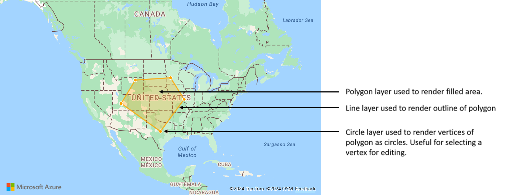

# Create a data source

The Azure Maps Web SDK stores data in data sources. Using data sources optimizes the data operations for querying and rendering. Currently there are two types of data sources:

**GeoJSON data source**

A GeoJSON based data source load and store data locally using the `DataSource` class. GeoJSON data can be manually created or created using the helper classes in the [atlas.data](https://docs.microsoft.com/javascript/api/azure-maps-control/atlas.data) namespace. The `DataSource` class provides functions to import local or remote GeoJSON files. Remote GeoJSON files must be hosted on a CORs enabled endpoint. The `DataSource` class provides functionality for clustering point data. And, data can easily be added, removed, and updated with the `DataSource` class.


> [!TIP]
> Lets say you want to overwrite all data in a `DataSource`. If you make calls to the `clear` then `add` functions, the map might re-render twice, which might cause a bit of a delay. Instead use the `setShapes` function, which will remove and replace all data in the data source and only trigger a single re-render of the map.

**Vector tile source**

A vector tile source describes how to access a vector tile layer. Use the [VectorTileSource](https://docs.microsoft.com/javascript/api/azure-maps-control/atlas.source.vectortilesource) class to instantiate a vector tile source. Vector tile layers are similar to tile layers, but they aren't the same. A tile layer is a raster image. Vector tile layers are a compressed file, in PBF format. This compressed file contains vector map data, and one or more layers. The file can be rendered and styled on the client, based on the style of each layer. The data in a vector tile contain geographic features in the form of points, lines, and polygons. There are several advantages of using vector tile layers instead of raster tile layers:

 - A file size of a vector tile is typically much smaller than an equivalent raster tile. As such, less bandwidth is used. It means lower latency, a faster map, and a better user experience.
 - Since vector tiles are rendered on the client, they adapt to the resolution of the device they're being displayed on. As a result, the rendered maps appear more well defined, with crystal clear labels.
 - Changing the style of the data in the vector maps doesn’t require downloading the data again, since the new style can be applied on the client. In contrast, changing the style of a raster tile layer typically requires loading tiles from the server then applying the new style.
 - Since the data is delivered in vector form, there's less server-side processing required to prepare the data. As a result, the newer data can be made available faster.

All layers that use a vector source must specify a `sourceLayer` value.

Once created, data sources can be added to the map through the `map.sources` property, which is a [SourceManager](https://docs.microsoft.com/javascript/api/azure-maps-control/atlas.sourcemanager). The following code shows how to create a `DataSource` and add it to the map.

```javascript
//Create a data source and add it to the map.
var dataSource = new atlas.source.DataSource();
map.sources.add(dataSource);
```

Azure Maps adheres to the [Mapbox Vector Tile Specification](https://github.com/mapbox/vector-tile-spec), an open standard.

## Connecting a data source to a layer

Data is rendered on the map using rendering layers. A single data source can be referenced by one or more rendering layers. The following rendering layers require a data source:

- [Bubble layer](map-add-bubble-layer.md) - renders point data as scaled circles on the map.
- [Symbol layer](map-add-pin.md) - renders point data as icons or text.
- [Heat map layer](map-add-heat-map-layer.md) - renders point data as a density heat map.
- [Line layer](map-add-shape.md) - render a line and or render the outline of polygons. 
- [Polygon layer](map-add-shape.md) - fills the area of a polygon with a solid color or image pattern.

The following code shows how to create a data source, add it to the map, and connect it to a bubble layer. And then, import GeoJSON point data from a remote location into the data source. 

```javascript
//Create a data source and add it to the map.
var datasource = new atlas.source.DataSource();
map.sources.add(datasource);

//Create a layer that defines how to render points in the data source and add it to the map.
map.layers.add(new atlas.layer.BubbleLayer(datasource));

//Load the earthquake data.
datasource.importDataFromUrl('https://earthquake.usgs.gov/earthquakes/feed/v1.0/summary/significant_month.geojson');
```

There are additional rendering layers that don't connect to these data sources, but they directly load the data for rendering. 

- [Image layer](map-add-image-layer.md) - overlays a single image on top of the map and binds its corners to a set of specified coordinates.
- [Tile layer](map-add-tile-layer.md) - superimposes a raster tile layer on top of the map.

## One data source with multiple layers

Multiple layers can be connected to a single data source. There are many different scenarios in which this option is useful. For example, consider the scenario in which a user draws a polygon. We should render and fill the polygon area as the user adds points to the map. Adding a styled line to outline the polygon makes it easier see the edges of the polygon, as the user draws. To conveniently edit an individual position in the polygon, we may add a handle, like a pin or a marker, above each position.



In most mapping platforms, you would need a polygon object, a line object, and a pin for each position in the polygon. As the polygon is modified, you would need to manually update the line and pins, which can quickly become complex.

With Azure Maps, all you need is a single polygon in a data source as shown in the code below.

```javascript
//Create a data source and add it to the map.
var dataSource = new atlas.source.DataSource();
map.sources.add(dataSource);

//Create a polygon and add it to the data source.
dataSource.add(new atlas.data.Polygon([[[/* Coordinates for polygon */]]]));

//Create a polygon layer to render the filled in area of the polygon.
var polygonLayer = new atlas.layer.PolygonLayer(dataSource, 'myPolygonLayer', {
     fillColor: 'rgba(255,165,0,0.2)'
});

//Create a line layer for greater control of rendering the outline of the polygon.
var lineLayer = new atlas.layer.LineLayer(dataSource, 'myLineLayer', {
     color: 'orange',
     width: 2
});

//Create a bubble layer to render the vertices of the polygon as scaled circles.
var bubbleLayer = new atlas.layer.BubbleLayer(dataSource, 'myBubbleLayer', {
     color: 'orange',
     radius: 5,
     outlineColor: 'white',
     outlineWidth: 2
});

//Add all layers to the map.
map.layers.add([polygonLayer, lineLayer, bubbleLayer]);
```

## Next steps

Learn more about the classes and methods used in this article:

> [!div class="nextstepaction"]
> [DataSource](https://docs.microsoft.com/javascript/api/azure-maps-control/atlas.source.datasource?view=azure-maps-typescript-latest)

> [!div class="nextstepaction"]
> [DataSourceOptions](https://docs.microsoft.com/javascript/api/azure-maps-control/atlas.datasourceoptions?view=azure-maps-typescript-latest)

> [!div class="nextstepaction"]
> [VectorTileSource](https://docs.microsoft.com/javascript/api/azure-maps-control/atlas.source.vectortilesource?view=azure-maps-typescript-latest)

> [!div class="nextstepaction"]
> [VectorTileSourceOptions](https://docs.microsoft.com/javascript/api/azure-maps-control/atlas.vectortilesourceoptions?view=azure-maps-typescript-latest)

See the following articles for more code samples to add to your maps:

> [!div class="nextstepaction"]
> [Add a popup](map-add-popup.md)

> [!div class="nextstepaction"]
> [Use data-driven style expressions](data-driven-style-expressions-web-sdk.md)

> [!div class="nextstepaction"]
> [Add a symbol layer](map-add-pin.md)

> [!div class="nextstepaction"]
> [Add a bubble layer](map-add-bubble-layer.md)

> [!div class="nextstepaction"]
> [Add a line layer](map-add-line-layer.md)

> [!div class="nextstepaction"]
> [Add a polygon layer](map-add-shape.md)

> [!div class="nextstepaction"]
> [Add a heat map](map-add-heat-map-layer.md)

> [!div class="nextstepaction"]
> [Code samples](https://docs.microsoft.com/samples/browse/?products=azure-maps)