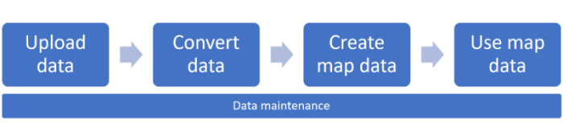

# Creator for indoor maps

This article introduces concepts and tools that apply to Azure Maps Creator. We recommend that you read this article before you begin to use the Azure Maps Creator API and SDK.

You can use Creator to develop applications with map features based on indoor map data. This article describes the process of uploading, converting, creating, and using your map data. The entire workflow is illustrated in the diagram below.

## Create Azure Maps Creator

To use Creator services, Azure Maps Creator must be created in an Azure Maps account. For information on how to create Azure Maps Creator in Azure Maps, see [Manage Azure Maps Creator](how-to-manage-creator.md).

## Upload a Drawing package

Creator collects indoor map data by converting an uploaded Drawing package. The Drawing package represents a constructed or remodeled facility. For information on Drawing package requirements, see [Drawing package requirements](drawing-requirements.md).

Use the [Azure Maps Data Upload API](https://docs.microsoft.com/rest/api/maps/data/uploadpreview) to upload a Drawing package.  Upon a successful upload, the Data Upload API will return a user data identifier (`udid`). The `udid` will be used in the next step to convert the uploaded package into indoor map data.

## Convert a Drawing package

The [Azure Maps Conversion service](https://docs.microsoft.com/rest/api/maps/conversion) converts an uploaded Drawing package into indoor map data. The Conversion service also validates the package. Validation issues are classified into two types: errors and warnings. If any errors are detected, the conversion process fails. Should warnings be detected, the conversion will succeed. However, it’s recommended that you review and resolve all warnings. A warning means that part of the conversion was ignored or automatically fixed. Failing to resolve the warnings could result in errors in latter processes. For more information, see [Drawing package warnings and errors](drawing-conversion-error-codes.md).

When an error occurs, the Conversion service provides a link to the [Azure Maps Drawing Error Visualizer](drawing-error-visualizer.md) stand-alone web application. You can use the Drawing Error Visualizer to inspect [Drawing package warnings and errors](drawing-conversion-error-codes.md) that occurred during the conversion process. Once you have fixed the errors, you can then attempt to upload and convert the package.

## Create indoor map data

Azure Maps Creator provides three services:

* [Dataset service](https://docs.microsoft.com/rest/api/maps/dataset/createpreview).
Use the Dataset service to create a dataset from a converted Drawing package data.
* [Tileset service](https://docs.microsoft.com/rest/api/maps/tileset/createpreview).
Use the Tileset service to create a vector-based representation of a dataset. Applications can use a tileset to present a visual tile-based view of the dataset.
* [Feature State service](https://docs.microsoft.com/rest/api/maps/featurestate).Use the Feature State service to support dynamic map styling. Dynamic map styling allows applications to reflect real-time events on spaces provided by IoT system.

### Datasets

A dataset is a collection of indoor map features. The indoor map features represent facilities defined in a converted Drawing package. After creating a dataset with the [Dataset service](https://docs.microsoft.com/rest/api/maps/dataset/createpreview), you can create any number of [tilesets](#tilesets) or [feature statesets](#feature-statesets).

The [Dataset service](https://docs.microsoft.com/rest/api/maps/dataset/createpreview) allows developers, at any time, to add or remove facilities to an existing dataset. For more information on how to update an existing dataset using the API, see the append options in [Dataset service](https://docs.microsoft.com/rest/api/maps/dataset/createpreview). For an example of how to update a dataset, see [Data Maintenance](#data-maintenance).

### Tilesets

A tileset is a collection of vector data that represents a set of uniform grid tiles. Developers can use the [Tileset service](https://docs.microsoft.com/rest/api/maps/tileset/createpreview) to create tilesets from a dataset.

To reflect different content stages, you can create multiple tilesets from the same dataset. For example, you could make one tileset with furniture and equipment, and another tileset without furniture and equipment.  You might choose to generate one tileset with the most recent data updates, and one without the most recent data updates.

In addition to the vector data, the tileset provides metadata for map rendering optimization. For example, tileset metadata contains a min and max zoom level for the tileset. The metadata also provides a bounding box defining the geographic extent of the tileset. The bounding box allows an application to programmatically set the correct center point. For more information about tileset metadata, see [Tileset List API](https://docs.microsoft.com/rest/api/maps/tileset/listpreview).

Once a tileset has been created, it can be retrieved by the [Render V2 service](#render-v2-service).

If a tileset becomes outdated and is no longer useful, you can delete the tileset. For more information on how to delete tilesets, see  [Data Maintenance](#data-maintenance).

>[!NOTE]
>A tileset is independent of the dataset from which it was created. If you create tilesets from a dataset, and then subsequently update that dataset, the tilesets will not be updated. To reflect changes in a dataset, you must create new tilesets. Similarly, if you delete a tileset, the dataset will not be affected.

### Feature statesets

Feature statesets are collections of dynamic properties (*states*) assigned to dataset features such as rooms or equipment. An example of a *state* could be temperature or occupancy. Each *state* is a key/value pair containing the name of the property, the value, and the timestamp of the last update.

The [Feature State service](https://docs.microsoft.com/rest/api/maps/featurestate/createstatesetpreview) lets you create and manage a feature stateset for a dataset. The stateset is defined by one or more *states*. Each feature, such as a room, can have one *state* attached to it.

The value of each *state* in a stateset can be updated or retrieved by IoT devices or other applications.  For example, using the [Feature State Update API](https://docs.microsoft.com/rest/api/maps/featurestate/updatestatespreview), devices measuring space occupancy can systematically post the state change of a room.

An application can use a feature stateset to dynamically render features in a facility according to their current state and respective map style. For more information on using feature statesets to style features in a rendering map, see [Indoor Web SDK Module](#indoor-maps-module).

>[!NOTE]
>Like tilesets, changing a dataset does not affect the existing feature stateset and deleting a feature stateset will have no effect on the dataset to which it is attached.

## Using indoor maps

### Render V2 service

The Azure Maps [Render V2 service-Get Map Tile API](https://docs.microsoft.com/rest/api/maps/renderv2/getmaptilepreview) has been extended to support Creator tilesets.

[Render V2 service-Get Map State Tile API](https://docs.microsoft.com/rest/api/maps/renderv2/getmaptilepreview) allows applications to request tilesets. The tilesets can then be integrated into a map control or SDK. For an example of a map control that uses the Render V2 service, see [Indoor Maps Module](#indoor-maps-module).

### Web Feature Service API

Datasets can be queried using the [Web Feature Service (WFS) API](https://docs.microsoft.com/rest/api/maps/wfs). WFS follows the [Open Geospatial Consortium API Features](http://docs.opengeospatial.org/DRAFTS/17-069r1.html). The WFS API lets you query features within the dataset itself. For example, you can use WFS to find all mid-size meeting rooms of a given facility and floor level.

### Indoor Maps module

The [Azure Maps Web SDK](https://docs.microsoft.com/azure/azure-maps/) includes the Indoor Maps module. This module offers extended functionalities to the Azure Maps *Map Control* library. The Indoor Maps module renders indoor maps created in Creator. It integrates widgets such as *floor picker*, which helps users visualize the different floors.

The Indoor Maps module allows you to create web applications that integrate indoor map data with other [Azure Maps services](https://docs.microsoft.com/azure/azure-maps/). The most common application setups could include adding knowledge to indoor maps from other maps such as road, imagery, weather, and transit.

The Indoor Maps module also supports dynamic map styling. For a step-by-step walk-through on how to implement feature stateset dynamic styling in an application, see [How to Use the Indoor Map Module](how-to-use-indoor-module.md)

### Azure Maps integration

As you begin to develop solutions for indoor maps, you can discover ways to integrate existing Azure Maps capabilities. For example, asset tracking or safety scenarios could be implemented by using the [Azure Maps Geofence API](https://docs.microsoft.com/rest/api/maps/spatial/postgeofence) with Creator indoor maps. The Geofence API could be used to determine, for example, whether a worker enters or leaves specific indoor areas. For more information on how to connect Azure Maps with IoT telemetry is available [here](tutorial-iot-hub-maps.md).

### Data Maintenance

 Azure Maps Creator List, Update, and Delete API allows you to list, update, and delete your datasets, tilesets, and feature statesets.

>[!NOTE]
>Whenever you review a list of items and decide to delete them, you must consider the impact of that deletion on all dependent API or applications. For example, if you should delete a tileset that is currently being used by an application by means of the [Render V2 - Get Map Tile API](https://docs.microsoft.com/rest/api/maps/renderv2/getmaptilepreview), deleting that tileset would result in an application failure to render that tileset.

### Example: Updating a dataset

The following example shows you how to update a dataset, create a new tileset, and delete an old tileset.

1. Follow steps in the [Upload a Drawing package](#upload-a-drawing-package) and [Convert a Drawing package](#convert-a-drawing-package) sections to upload and convert the new Drawing package.

2. Use the [Dataset Create API](https://docs.microsoft.com/rest/api/maps/dataset/createpreview) to append the converted data to the existing  dataset.

3. Use the [Tileset Create API](https://docs.microsoft.com/rest/api/maps/tileset/createpreview) to generate a new tileset out of the updated dataset. Save the new tilesetId for step 4.

4. Update the tileset identifier in your application to enable the visualization of the updated campus dataset. If the old tileset is no longer in use, you can delete it.

## Next steps

> [!div class="nextstepaction"]
> [Tutorial: Creating a Creator indoor map](tutorial-creator-indoor-maps.md)
