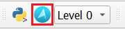
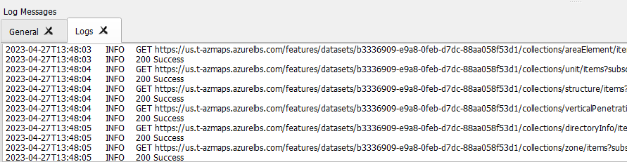
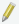
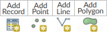
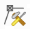
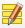
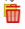
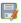
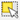

# The Azure Maps QGIS plugin

[QGIS] is an open-source [geographic information system (GIS)] application that supports viewing, editing, and analysis of geospatial data. You can view vector or raster maps, tiles, geojsons, shapefiles and many more formats.

[Creator] is an offering by [Azure Maps] that makes it possible to develop applications based on your private indoor map data using Azure Maps API and SDK. You can use building
blueprints in CAD format, or geojson format to create indoor maps using Creator. Map data is stored in the [Dataset Service], can be accessed and edited using the [Features] service and viewed using the [Tileset] and [Style] services.

The [Azure Maps QGIS Plugin] is developed by Azure Maps to visualize and edit Creator Datasets in QGIS. It also allows you to navigate floors using a custom floor-picker and perform CRUD operations for multiple features simultaneously. All QGIS functionalities, such as copying features, rotating, resizing, flipping, can be used to for advanced editing. The plugin also supports error handling for data editing. Logs created by the plugin are useful to understand the APIs and debug.

## Prerequisites

* A working knowledge of [QGIS]
* An [Azure Maps account]
* A [subscription key]

## Get started

This section provides information on how to install QGIS and the [Azure Maps QGIS Plugin], then how to fetch and view a dataset.

### Install QGIS

You can install QGIS from here: [Download QGIS]. You can use the latest version, however, we recommend getting the most stable version, which can be found on the same page, by selecting **"Looking for the most stable version?".**

### Install the Azure Maps QGIS Plugin

For detailed instructions on installing a plugin in QGIS, see [Installing New Plugins] in the QGIS Documentation.

Once you have the plugin installed, you will see the AzureMaps symbol on the [plugins toolbar].

### Fetching Dataset

Select the Azure Maps symbol to open the [Azure Maps plugin dialog box].

To fetch a dataset, select the Geography and enter your [subscription key] in the plugin dialog box.

You can then view all the datasets you have in your account by selecting the List Dataset button. Pick your desired dataset and the datasetId will be populated with it. You can also type in the datasetId that you want to load in the DatasetId field.

Once the datasetId field has been filled, select Get Features to load the dataset into QGIS.

# Viewing dataset

Once the dataset has been loaded, you can view the different feature classes it contains in the [layer panel]. The ordering of the layers determines how features will be shown on the map; layers at a higher order in the list will be displayed on top.

Sometimes, layers will have a drop-down containing multiple layers within it, followed by the geometry of the layer, like so:

:::image type="content" source="./media/creator-indoor-maps/qgis/dataset.png"alt-text="A screenshot showing a data set in the Azure Maps QGIS plugin.":::

This happens in the case when the [layer definition] shows that the layer can hold features of different geometries. In such cases, the plugin splits the layer according to the possible geometries, since QGIS only supports one geometry per layer.

> [!NOTE]
> The geometry geometryCollection is not supported by QGIS.

On the main QGIS window, you will now see the building map.

:::image type="content" source="./media/creator-indoor-maps/qgis/building-map.png"alt-text="A screenshot showing a building map in the Azure Maps QGIS plugin.":::

You can navigate to different floor by using the **Level** drop down list in the Plugins toolbar, located next to the Azure Maps plugin symbol as sown in the following image:

## Making changes to a dataset

Dataset changes can be classified into three major categories: Additions, edits, deletions.

### Dataset additions

Dataset additions involve adding features to a layer.

1. Select the layer in the [layer panel] where you want to add the new feature.

1. Toggle editing mode on in the [Digitizing Toolbar].

1. Select any add feature options from the [Digitizing Toolbar].

1. Select the save button in the [Digitizing Toolbar] to save changes

### Dataset edits

Dataset edits involve editing feature geometries.

    a.  To edit a feature geometry

        i.  Select the desired layer in the [layer panel] containing the feature you want to edit

        ii. Toggle editing mode on in the [Digitizing Toolbar].

        iii. Select the [Vertex tool] from the [Digitizing Toolbar].

        iv. Hover over the feature you want to edit, QGIS should show the feature vertices. Drag a vertical to edit the shape.

        v.  Once you are done with your changes, select the save button in the [Digitizing Toolbar].

    b.  To edit a feature property There are two ways to edit the feature property:
        Using Attribute table

        i.  Open the [attribute table](#attribute-table) for the layer containing the feature you want to edit.

        ii. Toggle the edit more on. The attribute table also contains an edit button.

        iii. Edit the property of the desired feature.

        iv. Click the save button in the [Digitizing Toolbar] to save changes. The attribute table should also have a save button.

> Selecting the Feature

i.  Select the desired feature in the [selection toolbar]

ii. Select the edit attribute tool from the [Digitizing Toolbar].

    i.  Edit the property of the desired feature.

    ii. Once you are done with your changes, select the save button in the [Digitizing Toolbar].

### Dataset deletions

    a.  Select the desired feature in the [selection toolbar] you want to delete.

    b.  Select the delete feature option from the [Digitizing
        Toolbar](#digitizing-toolbar).

    c.  Click the save button in the [Digitizing Toolbar] to save changes.

## Advanced editing features

To learn more about advance editing features, such as Moving, Scaling, Copying and Rotating Features, visit [16.3. Editing --- QGIS Documentation.](https://docs.qgis.org/3.28/en/docs/user_manual/working_with_vector/editing_geometry_attributes.html#advanced-digitizing)

## Logs

Azure Maps QGIS Plugin also allows you access to logs, for the requests made to Azure Maps. You can set the location of log file in [Azure Maps Plugin Dialog box](#azure-maps-plugin-dialog-box). By default, log files are stored in the folder containing your downloaded plugin.

You can view your log files in two ways:

1. **QGIS**. You can view the Logs in QGIS by activating the [Logs Message Panel](#logs-message-panel). You will then see:

   

1. You can also view the logs where they are stored. (when you set the
    location in Azure Maps Plugin Dialog box).

Logs will contain the following:

1. Information about the requests you made, and the response from the
    server

1. Error response provided by the server, or by QGIS

1. Statistics about the number of features loaded

Error logs for Edits:

Error logs for edits are also stored in a separate folder called "AzureMaps_ErrorLogs". They contain more detailed information about the request made, including headers and body, and the response received from the server.

Python Logs:

Sometimes, errors can arise from the QGIS framework themselves. In such cases, QGIS logs them under a tab called Python Logs. You can get more
information about went wrong from these logs as well.

## Glossary

### Azure Maps Terms

#### Features

A feature is any entry in the dataset (a row in the dataset). Usually, it will have a geometry associated with it, along with some property. For instance, a building will have facility `featureClass`, containing facility feature. It will also have the levels `featureClass`, i.e. the levels of a building, containing level features. Another `featureClass` could be furniture, where each feature would be a piece of furniture.

#### Feature Class

A `featureClass` is a collection of features, that goes to form a layer. A building will have facility and level feature classes, and could contain rooms, furniture etc.

#### Azure Maps plugin dialog box

The Azure Maps Plugin Dialog Box can be accessed by selecting the Azure Maps icon on the [Plugins Toolbar](#plugins-toolbar). You will see something like so:

:::image type="content" source="./media/creator-indoor-maps/qgis/azure-maps-plugin-dialog-box.png"alt-text="A screenshot of the Azure Maps Plugin Dialog Box.":::

The plugin has two tabs:

- Creator Tab: This is where you would input the information to load the dataset into QGIS.

- About Tab: This tab contains links to the Azure Maps documentation, the plugin documentation and feedback.

### QGIS Terms

#### Layer Panel

The layer panel is typically found on the left side of the application. It contains information about the different layers visible in QGIS. To
view the layer panel, navigate to View Panels Layers.

#### Logs Message Panel

The logs message panel allows you to view logs. For more information, see [Log Messages Panel] in the QGIS Documentation.

To access the panel, select the message icon  on the bottom right corner of QGIS.

#### Plugins Toolbar

The plugins toolbar contains all the installed plugins in QGIS. To view the plugins toolbar, navigate to View Toolbars Plugins Toolbar.

#### Digitizing Toolbar

The digitizing toolbar contains options to edit and save a feature. To view the digitizing toolbar, navigate to **View > Toolbar > Digitizing Toolbar**. For more information about the different options offered, see [Editing] in the QGIS Documentation.

Most common options are:

| Icon                                                                            | Description                       |
|---------------------------------------------------------------------------------|-----------------------------------|
|                     | Toggle editing mode off and on    |
|             | [Adding Features]                 |
|           | [Vertex tool], used to edit Feature Geometry|
|         | [Editing attribute values]        |
|    | [Deleting Selected Features]      |
|                 | [Saving Edited Layers]            |

#### Selection Toolbar

The selection toolbar allows you to select a feature in the currently active layer in QGIS. for more information, see [Selecting features] in the QGIS Documentation.

The most common ones are:

1.  - Select features by area. To use this tool

   1. Select the layer containing the desired feature. You can use the [Identify feature tool] to identify the layer.

   1. Select the desired feature

   1. You can now perform functions related to this feature such as
        edit, delete etc.

#### Attributes Toolbar

The attributes toolbar contains tools to identify the layer a feature is located in. For more information, see [Identifying Features] in the QGIS Documentation.
The most common tools are:

1. Selecting **identify features**  allows you to identify the layer containing the desired feature.

    1. Select the identify features icon.

    1. Right click on the feature whose layer you want to know.

    1. Select the desired layer from the list of layers (since there could be overlapping features, the tool shows layers for all features at the location you selected. You can hover over each layer to identify which points to your feature)

    1. On the right side, you can see all information about the feature, including its properties.

    1. You can then select the desired layer from the layer panel and select the feature using Select the desired feature in the [selection toolbar]

#### Attribute Table

The attribute table shows each feature and their properties in a tabular form. It can be accessed by right-clicking a layer in the layer panel a select open attribute table.

## Additional information

* If you have suggestions for new features, enter them in the Azure Maps section of [Microsoft Azure | Share your Ideas].
* If you have question related to Azure Maps, see [Stack Overflow]. Be sure and tag your search and questions with [azure-maps].

## Next steps

[Creator]: creator-indoor-maps.md
[Azure Maps]: about-azure-maps.md
[subscription key]: quick-demo-map-app.md#get-the-subscription-key-for-your-account
[QGIS]: https://qgis.org/en/site/
[geographic information system (GIS)]: https://www.usgs.gov/faqs/what-geographic-information-system-gis
[Dataset Service]: /rest/api/maps/2023-03-01-preview/dataset/create?tabs=HTTP
[Features]: /rest/api/maps/2023-03-01-preview/features/create?tabs=HTTP
[Tileset]: /rest/api/maps/2023-03-01-preview/tileset/create?tabs=HTTP
[Style]: /rest/api/maps/2023-03-01-preview/style/create?tabs=HTTP
[Download QGIS]: https://qgis.org/en/site/forusers/download.html
[plugins toolbar]: #plugins-toolbar
[Azure Maps plugin dialog box]: #azure-maps-plugin-dialog-box
[layer panel]: #layer-panel
[layer definition]: /rest/api/maps/2023-03-01-preview/features/get-collection-definition?tabs=HTTP
[Digitizing Toolbar]: #digitizing-toolbar
[selection toolbar]: #selection-toolbar
[Identify feature tool]: #attributes-toolbar
[Azure Maps QGIS Plugin]: https://plugins.qgis.org/plugins/QGISPlugin
[Adding Features]: https://docs.qgis.org/3.28/en/docs/user_manual/working_with_vector/editing_geometry_attributes.html#adding-features
[Installing New Plugins]: https://docs.qgis.org/3.28/en/docs/training_manual/qgis_plugins/fetching_plugins.html#basic-fa-installing-new-plugins
[Selecting features]: https://docs.qgis.org/3.28/en/docs/user_manual/introduction/general_tools.html?highlight=selection#selecting-features
[Identifying Features]: https://docs.qgis.org/3.28/en/docs/user_manual/introduction/general_tools.html?highlight=selection#identify
[Editing]: https://docs.qgis.org/3.28/en/docs/user_manual/working_with_vector/editing_geometry_attributes.html#digitizing-an-existing-layer
[Log Messages Panel]: https://docs.qgis.org/3.28/en/docs/user_manual/introduction/general_tools.html?highlight=logs#log-messages-panel
[Editing attribute values]: https://docs.qgis.org/3.28/en/docs/user_manual/working_with_vector/attribute_table.html#editing-attribute-values
[Deleting Selected Features]: https://docs.qgis.org/3.28/en/docs/user_manual/working_with_vector/editing_geometry_attributes.html#deleting-selected-features
[Saving Edited Layers]: https://docs.qgis.org/3.28/en/docs/user_manual/working_with_vector/editing_geometry_attributes.html#saving-edited-layers
[Vertex tool]: https://docs.qgis.org/3.28/en/docs/user_manual/working_with_vector/editing_geometry_attributes.html#vertex-tool
[Microsoft Azure | Share your Ideas]: https://feedback.azure.com/d365community/forum/fc834083-0925-ec11-b6e6-000d3a4f09d0
[Stack Overflow]: https://stackoverflow.com/questions/tagged/azure-maps
