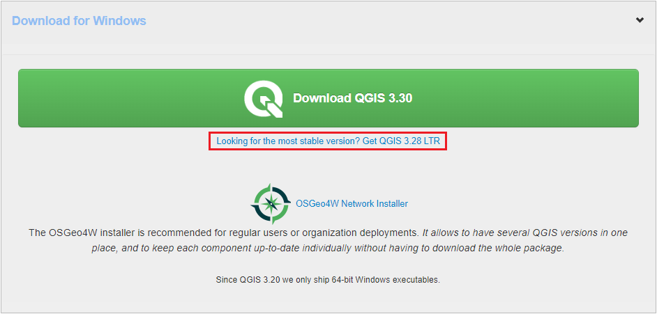
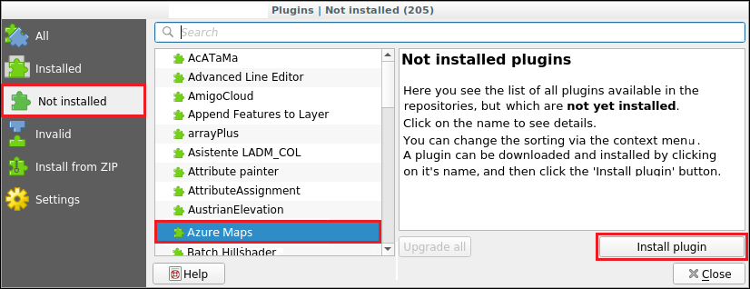
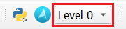
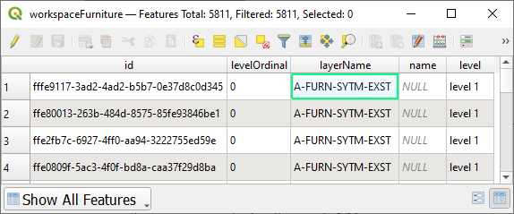
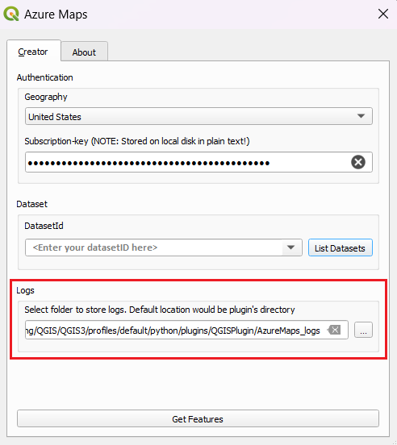

# Work with datasets using the QGIS plugin

[QGIS] is an open-source [geographic information system (GIS)] application that supports viewing, editing, and analysis of geospatial data.

The [Azure Maps QGIS plugin] is used to view and edit [datasets] in [QGIS]. It enables you to navigate floors using a custom floor-picker and perform CRUD operations for multiple features simultaneously. All QGIS functionalities, such as copying features, rotating, resizing, flipping, can be used to for advanced editing. The plugin also supports error handling for data editing. Logs created by the plugin are useful to understand the APIs and debug errors.

## Prerequisites

- Understanding of [Creator concepts].
- An Azure Maps Creator [dataset]. If you have never used Azure Maps Creator to create an indoor map, you might find the [Use Creator to create indoor maps] tutorial helpful.
- A basic working knowledge of [QGIS]

## Get started

This section provides information on how to install QGIS and the [Azure Maps QGIS plugin], then how to open and view a dataset.

### Install QGIS

If you don't already have QGIS installed, see [Download QGIS]. You can use the latest version, however, it's recommended using the most stable version, which can be found on the same page, by selecting **"Looking for the most stable version?".**

### Install the Azure Maps QGIS plugin

To install the Azure Maps QGIS plugin:

1. Select **Manage and Install Plugins** from the **Plugins** menu to open the **Plugin Manager**.

1. In the dialog that opens, select the **Azure Maps** plugin then the **Install plugin**:

For detailed instructions on installing a plugin in QGIS, see [Installing New Plugins] in the QGIS Documentation.

Once you have the plugin installed, the AzureMaps symbol appears on the plugins toolbar.

:::image type="content" source="./media/creator-indoor-maps/qgis/azure-maps-symbol.png"alt-text="A screenshot showing The Azure Maps QGIS plugin symbol on the QGIS toolbar.":::

## Working with datasets in the QGIS plugin

Your Azure Maps dataset contains the data describing your indoor map. A dataset consists of layers that define a building. Each layer contains entries called features. Each feature is a row in the dataset. A feature usually has a geometry associated with it. Each geometry consists of a set of properties that describe it.

A `featureClass` is a collection of similar features. A building has facility and level feature classes, containing features such as rooms and furniture. For example, a building has a facility `featureClass`, containing facility features. It also has a levels `featureClass` that defines the levels of the building, each level is a feature with its own set of properties that describe that level. Another `featureClass` could be furniture, with each individual piece of furniture described as a feature of the `featureClass` with its own unique set of properties.

### Open dataset

The following steps describe how to open your dataset in QGIS using the Azure Maps QGIS plugin.

1. Select the **Azure Maps symbol** on the QGIS toolbar to open the **Azure Maps plugin dialog box**.

    :::image type="content" source="./media/creator-indoor-maps/qgis/azure-maps-symbol.png" alt-text="A screenshot showing the toolbar in QGIS with the Azure Maps button highlighted.":::

1. Select your location, the United States or Europe, from the Geography drop down list.
1. Enter your [subscription key].
1. To get a list of all the dataset IDs associated with your Azure Maps account, select the **List Datasets** button.
1. Select the desired `datasetId` from the **DatasetId** drop down list.
1. (Optional) Change the location where your logs are saved if you don't want them saved to the default location.

    :::image type="content" source="./media/creator-indoor-maps/qgis/azure-maps-plugin-dialog-box.png" alt-text="A screenshot showing the Azure Maps plugin dialog box.":::

1. Select the **Get Features** button to load your indoor map data into QGIS, once loaded your map appears in the **Map canvas**.

    :::image type="content" source="./media/creator-indoor-maps/qgis/map-qgis-full-screen.png" alt-text="A screenshot showing the QGIS product with the indoor map." lightbox="./media/creator-indoor-maps/qgis/map-qgis-full-screen.png":::

### View dataset

Once the dataset has been loaded, you can view the different feature classes it contains in the **Layers** panel. The ordering of the layers determines how features are shown on the map; layers at a higher order in the list are displayed on top.

Some layers have a drop-down containing multiple layers within it, followed by the geometry of the layer, as the following image shows:

:::image type="content" source="./media/creator-indoor-maps/qgis/layers-example.png"alt-text="A screenshot showing a data set in the QGIS layers section.":::

This happens in the case when the [layer definition] shows that the layer can hold features of different geometries. since QGIS only supports one geometry per layer, the plugin splits these layers by their possible geometries.

> [!NOTE]
> The geometry geometryCollection is not supported by QGIS.

You can navigate to different floor by using the **Level** drop-down list in the plugins toolbar, located next to the Azure Maps plugin symbol as sown in the following image:

## Edit dataset

You can add, edit and delete the features of your dataset using QGIS.

> [!TIP]
> You will be using the digitizing toolbar when editing the features of your dataset in QGIS, for more information, see [Digitizing an existing layer].

### Add features

Dataset additions involve adding features to a layer.

1. In the **Layers** panel, select the layer that you want to add the new feature to.

1. Toggle edit mode to `on` in the digitizing toolbar. To view the digitizing toolbar, navigate to **View > Toolbar > Digitizing Toolbar**.

    :::image type="content" source="./media/creator-indoor-maps/qgis/digitizing-toolbar-toggle-editing-mode.png"alt-text="A screenshot showing editing mode on the digitizing toolbar.":::

1. Select any add feature options from the digitizing toolbar and make the desired changes.

1. Select the save button in the digitizing toolbar to save changes

    :::image type="content" source="./media/creator-indoor-maps/qgis/digitizing-toolbar-save-changes.png"alt-text="A screenshot showing the save changes button on the digitizing toolbar.":::

### Edit features

Dataset edits involve editing feature geometries and properties.

#### Edit a feature geometry

1. In the **Layers** panel, select the layer containing the feature you want to edit.

1. Toggle edit mode to `on` in the digitizing toolbar.

1. Select the **Vertex tool** from the digitizing toolbar.

    :::image type="content" source="./media/creator-indoor-maps/qgis/vertex-tool.png"alt-text="A screenshot showing the Vertex Tool button on the digitizing toolbar.":::

1. Once you're done with your changes, select the save button in the digitizing toolbar.

#### Edit a feature property

To edit a feature property using the attribute table

1. Open the attribute table for the layer containing the feature you want to edit.

    

    > [!NOTE]
    > The attribute table shows each feature, with their properties, in a tabular form. It can be accessed by right-clicking on any layer in the **Layers** panel then selecting **Open Attribute Table**.

1. Toggle edit mode on.

1. Edit the desired property.

1. Select the save button to save changes.

### Delete feature

1. Select the feature you want to delete.

1. Select the delete feature option from the digitizing toolbar.

    :::image type="content" source="./media/creator-indoor-maps/qgis/digitizing-toolbar-delete.png"alt-text="A screenshot showing the delete feature option in the digitizing toolbar.":::

1. Select the save button in the digitizing toolbar to save changes.

## Advanced editing

To learn more about advance editing features offered in QGIS, such as moving, scaling, copying and rotating features, see [Advanced digitizing] in the QGIS Documentation.

## Logs

Azure Maps QGIS plugin logs information related to the requests made to Azure Maps. You can set the location of log file in the Azure Maps plugin Dialog box. By default, log files are stored in the folder containing your downloaded plugin.

You can view your log files in two ways:

1. **QGIS**. You can view the Logs in QGIS by activating the **Logs Message Panel**:

    :::image type="content" source="./media/creator-indoor-maps/qgis/logs-message-panel.png"alt-text="A screenshot of the Logs Message Panel.":::

Logs contain:

- Information about server requests and response.
- Errors received from the server or QGIS.
- Statistics about the number of features loaded

### Error logs for edits

Error logs for edits are also stored in a separate folder called "AzureMaps_ErrorLogs". They contain more detailed information about the request made, including headers and body, and the response received from the server.

### Python Logs

Any errors received from the QGIS framework are displayed in the **Python Logs** tab.

## Additional information

If you have question related to Azure Maps, see [MICROSOFT Q&A]. Be sure and tag your questions with "Azure Maps".

[Advanced digitizing]: https://docs.qgis.org/3.28/en/docs/user_manual/working_with_vector/editing_geometry_attributes.html#advanced-digitizing
[Azure Maps QGIS Plugin]: https://plugins.qgis.org/plugins/AzureMapsCreator/
[Creator concepts]: creator-indoor-maps.md
[dataset]: creator-indoor-maps.md#datasets
[datasets]: creator-indoor-maps.md#datasets
[Digitizing an existing layer]: https://docs.qgis.org/3.28/en/docs/user_manual/working_with_vector/editing_geometry_attributes.html?highlight=digitizing%20toolbar#digitizing-an-existing-layer
[Download QGIS]: https://qgis.org/en/site/forusers/download.html
[geographic information system (GIS)]: https://www.usgs.gov/faqs/what-geographic-information-system-gis
[Installing New Plugins]: https://docs.qgis.org/3.28/en/docs/training_manual/qgis_plugins/fetching_plugins.html#basic-fa-installing-new-plugins
[layer definition]: /rest/api/maps/2023-03-01-preview/features/get-collection-definition?tabs=HTTP
[MICROSOFT Q&A]: /answers/questions/ask
[QGIS]: https://qgis.org/en/site/
[subscription key]: quick-demo-map-app.md#get-the-subscription-key-for-your-account
[Use Creator to create indoor maps]: tutorial-creator-indoor-maps.md
