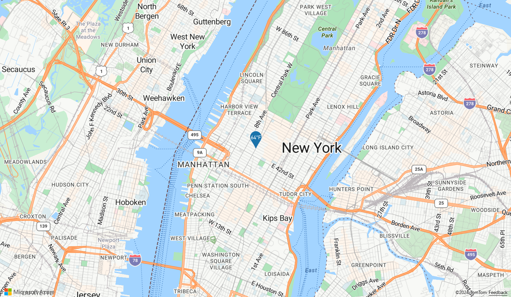
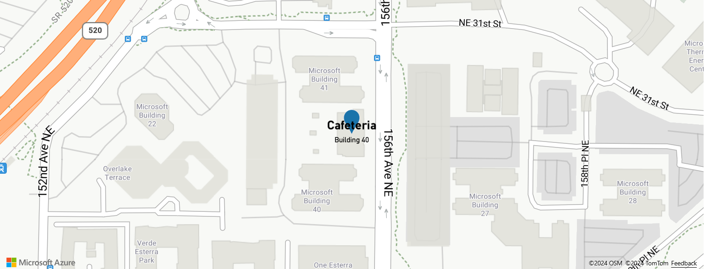

# Data-driven style expressions (Android SDK)

Expressions enable you to apply business logic to styling options that observe the properties defined in each shape in a data source. Expressions can filter data in a data source or a layer. Expressions may consist of conditional logic, like if-statements. And, they can be used to manipulate data using: string operators, logical operators, and mathematical operators.

Data-driven styles reduce the amount of code needed to implement business logic around styling. When used with layers, expressions are evaluated at render time on a separate thread. This functionality provides increased performance compared to evaluating business logic on the UI thread.

The Azure Maps Android SDK supports nearly all the same style expressions as the Azure Maps Web SDK, so all the same concepts outlined in the [Data-driven Style Expressions (Web SDK)] can be carried over into an Android app. All style expressions in the Azure Maps Android SDK are available under the `com.microsoft.azure.maps.mapcontrol.options.Expression` namespace. There are many different types of style expressions.

| Type of expressions | Description |
|---------------------|-------------|
| [Boolean expressions] | Boolean expressions provide a set of boolean operators expressions for evaluating boolean comparisons. |
| [Color expressions] | Color expressions make it easier to create and manipulate color values. |
| [Conditional expressions] | Conditional expressions provide logic operations that are like if-statements. |
| [Data expressions] | Provides access to the property data in a feature. |
| [Interpolate and Step expressions] | Interpolate and step expressions can be used to calculate values along an interpolated curve or step function. |
| [JSON-based expressions] | Makes it easy to reuse style raw JSON-based expressions created for the Web SDK with the Android SDK. |  
| [Layer specific expressions] | Special expressions that are only applicable to a single layer. |
| [Math expressions] | Provides mathematical operators to perform data-driven calculations within the expression framework. |
| [String operator expressions] | String operator expressions perform conversion operations on strings such as concatenating and converting the case. |
| [Type expressions] | Type expressions provide tools for testing and converting different data types like strings, numbers, and boolean values. |
| [Variable binding expressions] | Variable binding expressions store the results of a calculation in a variable and referenced elsewhere in an expression multiple times without having to recalculate the stored value. |
| [Zoom expression] | Retrieves the current zoom level of the map at render time. |

> [!NOTE]
> The syntax for expressions is largely identical in Java and Kotlin. If you have the documentation set to Kotlin, but see code blocks for Java, the code is identical in both languages.

All examples in this section of the document use the following feature to demonstrate different ways in which these expressions can be used.

```json
{
    "type": "Feature",
    "geometry": {
        "type": "Point",
        "coordinates": [-122.13284, 47.63699]
    },
    "properties": {
        "id": 123,
        "entityType": "restaurant",
        "revenue": 12345,
        "subTitle": "Building 40", 
        "temperature": 64,
        "title": "Cafeteria", 
        "zoneColor": "purple",
        "abcArray": ["a", "b", "c"],
        "array2d": [["a", "b"], ["x", "y"]],
        "_style": {
            "fillColor": "red"
        }
    }
}
```

The following code shows how to manually create this GeoJSON feature in an app.

::: zone pivot="programming-language-java-android"

```Java
//Create a point feature.
Feature feature = Feature.fromGeometry(Point.fromLngLat(-100, 45));

//Add properties to the feature.
feature.addNumberProperty("id", 123);
feature.addStringProperty("entityType", "restaurant");
feature.addNumberProperty("revenue", 12345);
feature.addStringProperty("subTitle", "Building 40");
feature.addNumberProperty("temperature", 64);
feature.addStringProperty("title", "Cafeteria");
feature.addStringProperty("zoneColor", "purple");

JsonArray abcArray = new JsonArray();
abcArray.add("a");
abcArray.add("b");
abcArray.add("c");

feature.addProperty("abcArray", abcArray);

JsonArray array1 = new JsonArray();
array1.add("a");
array1.add("b");

JsonArray array2 = new JsonArray();
array1.add("x");
array1.add("y");

JsonArray array2d = new JsonArray();
array2d.add(array1);
array2d.add(array2);

feature.addProperty("array2d", array2d);

JsonObject style = new JsonObject();
style.addProperty("fillColor", "red");

feature.addProperty("_style", style);
```

::: zone-end

::: zone pivot="programming-language-kotlin"

```kotlin
//Create a point feature.
val feature = Feature.fromGeometry(Point.fromLngLat(-100, 45))

//Add properties to the feature.
feature.addNumberProperty("id", 123)
feature.addStringProperty("entityType", "restaurant")
feature.addNumberProperty("revenue", 12345)
feature.addStringProperty("subTitle", "Building 40")
feature.addNumberProperty("temperature", 64)
feature.addStringProperty("title", "Cafeteria")
feature.addStringProperty("zoneColor", "purple")

val abcArray = JsonArray()
abcArray.add("a")
abcArray.add("b")
abcArray.add("c")

feature.addProperty("abcArray", abcArray)

val array1 = JsonArray()
array1.add("a")
array1.add("b")

val array2 = JsonArray()
array1.add("x")
array1.add("y")

val array2d = JsonArray()
array2d.add(array1)
array2d.add(array2)

feature.addProperty("array2d", array2d)

val style = JsonObject()
style.addProperty("fillColor", "red")

feature.addProperty("_style", style)
```

::: zone-end

The following code shows how to deserialize the stringified version of the JSON object into a GeoJSON feature in an app.

::: zone pivot="programming-language-java-android"

```java
String featureString = "{\"type\":\"Feature\",\"geometry\":{\"type\":\"Point\",\"coordinates\":[-122.13284,47.63699]},\"properties\":{\"id\":123,\"entityType\":\"restaurant\",\"revenue\":12345,\"subTitle\":\"Building 40\",\"temperature\":64,\"title\":\"Cafeteria\",\"zoneColor\":\"purple\",\"abcArray\":[\"a\",\"b\",\"c\"],\"array2d\":[[\"a\",\"b\"],[\"x\",\"y\"]],\"_style\":{\"fillColor\":\"red\"}}}";

Feature feature = Feature.fromJson(featureString);
```

::: zone-end

::: zone pivot="programming-language-kotlin"

```kotlin
val featureString = "{\"type\":\"Feature\",\"geometry\":{\"type\":\"Point\",\"coordinates\":[-122.13284,47.63699]},\"properties\":{\"id\":123,\"entityType\":\"restaurant\",\"revenue\":12345,\"subTitle\":\"Building 40\",\"temperature\":64,\"title\":\"Cafeteria\",\"zoneColor\":\"purple\",\"abcArray\":[\"a\",\"b\",\"c\"],\"array2d\":[[\"a\",\"b\"],[\"x\",\"y\"]],\"_style\":{\"fillColor\":\"red\"}}}"

val feature = Feature.fromJson(featureString)
```

::: zone-end

## JSON-based expressions

The Azure Maps Web SDK also supports data-driven style expressions that are represented using a JSON array. These same expressions can be recreated using the native `Expression` class in the Android SDK. Alternatively, these JSON-based expressions can be converted into a string using a web function such as `JSON.stringify` and passed into the `Expression.raw(String rawExpression)` method. For example, take the following JSON expression.

```javascript
var exp = ['get','title'];
JSON.stringify(exp); // = "['get','title']"
```

The stringified version of the above expression would be `"['get','title']"` and can be read into the Android SDK as follows.

::: zone pivot="programming-language-java-android"

```java
Expression exp = Expression.raw("['get','title']")
```

::: zone-end

::: zone pivot="programming-language-kotlin"

```kotlin
val exp = Expression.raw("['get','title']")
```

::: zone-end

Using this approach can make it easy to reuse style expressions between mobile and web apps that use Azure Maps.

This video provides an overview of data-driven styling in Azure Maps.

</br>

>[!VIDEO https://learn.microsoft.com/Shows/Internet-of-Things-Show/Data-Driven-Styling-with-Azure-Maps/player?format=ny]

## Data expressions

Data expressions provide access to the property data in a feature.

| Expression | Return type | Description |
|------------|-------------|-------------|
| `accumulated()` | number | Gets the value of a cluster property accumulated so far. This can only be used in the `clusterProperties` option of a clustered `DataSource` source. |
| `at(number | Expression, Expression)` | value | Retrieves an item from an array. |
| `geometryType()` | string | Gets the feature's geometry type: Point, MultiPoint, LineString, MultiLineString, Polygon, MultiPolygon. |
| `get(string | Expression)` \| `get(string | Expression, Expression)` | value | Gets the property value from the properties of the provided object. Returns null if the requested property is missing. |
| `has(string | Expression)` \| `has(string | Expression, Expression)` | boolean | Determines if the properties of a feature have the specified property. |
| `id()` | value | Gets the feature's ID if it has one. |
| `in(string | number | Expression, Expression)` | boolean | Determines whether an item exists in an array |
| `length(string | Expression)` | number | Gets the length of a string or an array. |
| `properties()`| value | Gets the feature properties object. |

The following Web SDK style expressions aren't supported in the Android SDK:

- index-of
- slice

**Examples**

Properties of a feature can be accessed directly in an expression by using a `get` expression. This example uses the `zoneColor` value of the feature to specify the color property of a bubble layer.

::: zone pivot="programming-language-java-android"

```java
BubbleLayer layer = new BubbleLayer(source,
    //Get the zoneColor value.
    bubbleColor(get("zoneColor"))
);
```

::: zone-end

::: zone pivot="programming-language-kotlin"

```kotlin
val layer = BubbleLayer(source,
    //Get the zoneColor value.
    bubbleColor(get("zoneColor"))
)
```

::: zone-end

The above example works fine, if all the point features have the `zoneColor` property. If they don't, the color will likely fall back to "black". To modify the fallback color, use a `switchCase` expression in combination with the `has` expression to check if the property exists. If the property doesn't exist, return a fallback color.

::: zone pivot="programming-language-java-android"

```java
BubbleLayer layer = new BubbleLayer(source,
    bubbleColor(
        //Use a conditional case expression.
        switchCase(
            //Check to see if feature has a "zoneColor" 
            has("zoneColor"), 

            //If it does, use it.
            get("zoneColor"), 

            //If it doesn't, default to blue.
            literal("blue")
        )
    )
);
```

::: zone-end

::: zone pivot="programming-language-kotlin"

```kotlin
val layer = BubbleLayer(source,
    bubbleColor(
        //Use a conditional case expression.
        switchCase(
            //Check to see if feature has a "zoneColor" 
            has("zoneColor"), 

            //If it does, use it.
            get("zoneColor"), 

            //If it doesn't, default to blue.
            literal("blue")
        )
    )
)
```

::: zone-end

Bubble and symbol layers render the coordinates of all shapes in a data source, by default. This behavior can highlight the vertices of a polygon or a line. The `filter` option of the layer can be used to limit the geometry type of the features it renders, by using a `geometryType` expression within a boolean expression. The following example limits a bubble layer so that only `Point` features are rendered.

::: zone pivot="programming-language-java-android"

```java
BubbleLayer layer = new BubbleLayer(source,
    filter(eq(geometryType(), "Point"))
);
```

::: zone-end

::: zone pivot="programming-language-kotlin"

```kotlin
val layer = BubbleLayer(source,
    filter(eq(geometryType(), "Point"))
)
```

::: zone-end

The following example allows both `Point` and `MultiPoint` features to be rendered.

::: zone pivot="programming-language-java-android"

```java
BubbleLayer layer = new BubbleLayer(source,
    filter(any(eq(geometryType(), "Point"), eq(geometryType(), "MultiPoint")))
);
```

::: zone-end

::: zone pivot="programming-language-kotlin"

```kotlin
val layer = BubbleLayer(source,
    filter(any(eq(geometryType(), "Point"), eq(geometryType(), "MultiPoint")))
)
```

::: zone-end

Similarly, the outline of Polygons render in line layers. To disable this behavior in a line layer, add a filter that only allows `LineString` and `MultiLineString` features.  

Here are more examples of how to use data expressions:

```java
//Get item [2] from an array "properties.abcArray[1]" = "c"
at(2, get("abcArray"))

//Get item [0][1] from a 2D array "properties.array2d[0][1]" = "b"
at(1, at(0, get("array2d")))

//Check to see if a value is in an array "properties.abcArray.indexOf('a') !== -1" = true
in("a", get("abcArray"))

//Get the length of an array "properties.abcArray.length" = 3
length(get("abcArray"))

//Get the value of a subproperty "properties._style.fillColor" = "red"
get("fillColor", get("_style"))

//Check that "fillColor" exists as a subproperty of "_style".
has("fillColor", get("_style"))
```

## Math expressions

Math expressions provide mathematical operators to perform data-driven calculations within the expression framework.

| Expression | Return type | Description |
|------------|-------------|-------------|
| `abs(number | Expression)` | number | Calculates the absolute value of the specified number. |
| `acos(number | Expression)` | number | Calculates the arccosine of the specified number. |
| `asin(number | Expression)` | number | Calculates the arcsine of the specified number. |
| `atan(number | Expression)` | number | Calculates the arctangent of the specified number. |
| `ceil(number | Expression)` | number | Rounds the number up to the next whole integer. |
| `cos(number | Expression)` | number | Calculates the cos of the specified number. |
| `division(number, number)` \| `division(Expression, Expression)` | number | Divides the first number by the second number. Web SDK equivalent expression: `/` |
| `e()` | number | Returns the mathematical constant `e`. |
| `floor(number | Expression)` | number | Rounds the number down to the previous whole integer. |
| `log10(number | Expression)` | number | Calculates the base-ten logarithm of the specified number. |
| `log2(number | Expression)` | number | Calculates the base-two logarithm of the specified number. |
| `ln(number | Expression)` | number | Calculates the natural logarithm of the specified number. |
| `ln2()` | number | Returns the mathematical constant `ln(2)`. |
| `max(numbers... | expressions...)` | number | Calculates the maximum number in the specified set of numbers. |
| `min(numbers... | expressions...)` | number | Calculates the minimum number in the specified set of numbers. |
| `mod(number, number)` \| `mod(Expression, Expression)` | number | Calculates the remainder when dividing the first number by the second number. Web SDK equivalent expression: `%` |
| `pi()` | number | Returns the mathematical constant `PI`. |
| `pow(number, number)` \| `pow(Expression, Expression)` | number | Calculates the value of the first value raised to the power of the second number. |
| `product(numbers... | expressions...)` | number | Multiplies the specified numbers together. Web SDK equivalent expression: `*` |
| `round(number | Expression)` | number | Rounds the number to the nearest integer. Halfway values are rounded away from zero. For example, `round(-1.5)` evaluates to `-2`. |
| `sin(number | Expression)` | number | Calculates the sine of the specified number. |
| `sqrt(number | Expression)` | number | Calculates the square root of the specified number. |
| `subtract(number | Expression` | number | Subtracts 0 by the specified number. |
| `subtract(number | Expression, number | Expression)` | number | Subtracts the first numbers by the second number. |
| `sum(numbers... | expressions...)` | number | Calculates the sum of the specified numbers. |
| `tan(number | Expression)` | number | Calculates the tangent of the specified number. |

## Boolean expressions

Boolean expressions provide a set of boolean operators expressions for evaluating boolean comparisons.

When comparing values, the comparison is strictly typed. Values of different types are always considered unequal. Cases where the types are known to be different at parse time are considered invalid and produces a parse error.

| Expression | Return type | Description |
|------------|-------------|-------------|
| `all(Expression...)` | boolean | Returns `true` if all the inputs are `true`, `false` otherwise. |
| `any(Expression...)` | boolean | Returns `true` if any of the inputs are `true`, `false` otherwise. |
| `eq(Expression compareOne, Expression | boolean | number | string compareTwo)` \| `eq(Expression compareOne, Expression | string compareTwo, Expression collator)` | boolean | Returns `true` if the input values are equal, `false` otherwise. The arguments are required to be either both strings or both numbers. |
| `gt(Expression compareOne, Expression | boolean | number | string compareTwo)` \| `gt(Expression compareOne, Expression | string compareTwo, Expression collator)` | boolean | Returns `true` if the first input is strictly greater than the second, `false` otherwise. The arguments are required to be either both strings or both numbers. |
| `gte(Expression compareOne, Expression | boolean | number | string compareTwo)` \| `gte(Expression compareOne, Expression | string compareTwo, Expression collator)` | boolean | Returns `true` if the first input is greater than or equal to the second, `false` otherwise. The arguments are required to be either both strings or both numbers. |
| `lt(Expression compareOne, Expression | boolean | number | string compareTwo)` \| `lt(Expression compareOne, Expression | string compareTwo, Expression collator)` | boolean | Returns `true` if the first input is strictly less than the second, `false` otherwise. The arguments are required to be either both strings or both numbers. |
| `lte(Expression compareOne, Expression | boolean | number | string compareTwo)` \| `lte(Expression compareOne, Expression | string compareTwo, Expression collator)` | boolean | Returns `true` if the first input is less than or equal to the second, `false` otherwise. The arguments are required to be either both strings or both numbers. |
| `neq(Expression compareOne, Expression | boolean | number | string compareTwo)` \| `neq(Expression compareOne, Expression | string compareTwo, Expression collator)` | boolean | Returns `true` if the input values aren't equal, `false` otherwise. |
| `not(Expression | boolean)` | boolean | Logical negation. Returns `true` if the input is `false`, and `false` if the input is `true`. |

## Conditional expressions

Conditional expressions provide logic operations that are like if-statements.

The following expressions perform conditional logic operations on the input data. For example, the `switchCase` expression provides "if/then/else" logic while the `match` expression is like a "switch-statement".

### Switch case expression

A `switchCase` expression is a type of conditional expression that provides "if/then/else" logic. This type of expression steps through a list of boolean conditions. It returns the output value of the first boolean condition to evaluate to true.

The following pseudocode defines the structure of the `switchCase` expression.

```java
switchCase(
    condition1: boolean expression, 
    output1: value,
    condition2: boolean expression, 
    output2: value,
    ...,
    fallback: value
)
```

**Example**

The following example steps through different boolean conditions until it finds one that evaluates to `true`, and then returns that associated value. If no boolean condition evaluates to `true`, a fallback value is returned.

::: zone pivot="programming-language-java-android"

```java
BubbleLayer layer = new BubbleLayer(source,
    bubbleColor(
        switchCase(
            //Check to see if the first boolean expression is true, and if it is, return its assigned result.
            //If it has a zoneColor property, use its value as a color.
            has("zoneColor"), toColor(get("zoneColor")),

            //Check to see if the second boolean expression is true, and if it is, return its assigned result.
            //If it has a temperature property with a value greater than or equal to 100, make it red.
            all(has("temperature"), gte(get("temperature"), 100)), color(Color.RED),
            
            //Specify a default value to return. In this case green.
            color(Color.GREEN)
        )
    )
);
```

::: zone-end

::: zone pivot="programming-language-kotlin"

```kotlin
val layer = BubbleLayer(source,
    bubbleColor(
        switchCase(
            //Check to see if the first boolean expression is true, and if it is, return its assigned result.
            //If it has a zoneColor property, use its value as a color.
            has("zoneColor"), toColor(get("zoneColor")),

            //Check to see if the second boolean expression is true, and if it is, return its assigned result.
            //If it has a temperature property with a value greater than or equal to 100, make it red.
            all(has("temperature"), gte(get("temperature"), 100)), color(Color.RED),
            
            //Specify a default value to return. In this case green.
            color(Color.GREEN)
        )
    )
)
```

::: zone-end

### Match expression

A `match` expression is a type of conditional expression that provides switch-statement like logic. The input can be any expression such as `get( "entityType")` that returns a string or a number. Each stop must have a label that is either a single literal value or an array of literal values, whose values must be all strings or all numbers. The input matches if any of the values in the array match. Each stop label must be unique. If the input type doesn't match the type of the labels, the result is the default fallback value.

The following pseudocode defines the structure of the `match` expression.

```java
match(Expression input, Expression defaultOutput, Expression.Stop... stops)
```

**Examples**

The following example looks at the `entityType` property of a Point feature in a bubble layer searches for a match. If it finds a match, that specified value is returned or it returns the fallback value.

::: zone pivot="programming-language-java-android"

```java
BubbleLayer layer = new BubbleLayer(source,
    bubbleColor(
        match(
            //Get the input value to match.
            get("entityType"),

            //Specify a default value to return if no match is found.
            color(Color.BLACK),

            //List the values to match and the result to return for each match.

            //If value is "restaurant" return "red".
            stop("restaurant", color(Color.RED)),

            //If value is "park" return "green".
            stop("park", color(Color.GREEN))
        )
    )
);
```

::: zone-end

::: zone pivot="programming-language-kotlin"

```kotlin
val layer = BubbleLayer(source,
    bubbleColor(
        match(
            //Get the input value to match.
            get("entityType"),

            //Specify a default value to return if no match is found.
            color(Color.BLACK),

            //List the values to match and the result to return for each match.

            //If value is "restaurant" return "red".
            stop("restaurant", color(Color.RED)),

            //If value is "park" return "green".
            stop("park", color(Color.GREEN))
        )
    )
)
```

::: zone-end

The following example uses an array to list a set of labels that should all return the same value. This approach is much more efficient than listing each label individually. In this case, if the `entityType` property is "restaurant" or "grocery_store", the color "red" is returned.

::: zone pivot="programming-language-java-android"

```java
BubbleLayer layer = new BubbleLayer(source,
    bubbleColor(
        match(
            //Get the input value to match.
            get("entityType"),

            //Specify a default value to return if no match is found.
            color(Color.BLACK),

            //List the values to match and the result to return for each match.

            //If value is "restaurant" or "grocery_store" return "red".
            stop(Arrays.asList("restaurant", "grocery_store"), color(Color.RED)),

            //If value is "park" return "green".
            stop("park", color(Color.GREEN))
        )
    )
);
```

::: zone-end

::: zone pivot="programming-language-kotlin"

```kotlin
val layer = BubbleLayer(source,
    bubbleColor(
        match(
            //Get the input value to match.
            get("entityType"),

            //Specify a default value to return if no match is found.
            color(Color.BLACK),

            //List the values to match and the result to return for each match.

            //If value is "restaurant" or "grocery_store" return "red".
            stop(arrayOf("restaurant", "grocery_store"), color(Color.RED)),

            //If value is "park" return "green".
            stop("park", color(Color.GREEN))
        )
    )
)
```

::: zone-end

### Coalesce expression

A `coalesce` expression steps through a set of expressions until the first non-null value is obtained and returns that value.

The following pseudocode defines the structure of the `coalesce` expression.

```java
coalesce(Expression... input)
```

**Example**

The following example uses a `coalesce` expression to set the `textField` option of a symbol layer. If the `title` property is missing from the feature or set to `null`, the expression tries looking for the `subTitle` property, if it's missing or `null`, it will then fall back to an empty string.

::: zone pivot="programming-language-java-android"

```java
SymbolLayer layer = new SymbolLayer(source,
    textField(
        coalesce(
            //Try getting the title property.
            get("title"),

            //If there is no title, try getting the subTitle. 
            get("subTitle"),

            //Default to an empty string.
            literal("")
        )
    )
);
```

::: zone-end

::: zone pivot="programming-language-kotlin"

```kotlin
val layer = SymbolLayer(source,
    textField(
        coalesce(
            //Try getting the title property.
            get("title"),

            //If there is no title, try getting the subTitle. 
            get("subTitle"),

            //Default to an empty string.
            literal("")
        )
    )
)
```

::: zone-end

## Type expressions

Type expressions provide tools for testing and converting different data types like strings, numbers, and boolean values.

| Expression | Return type | Description |
|------------|-------------|-------------|
| `array(Expression)` | Object[] | Asserts that the input is an array. |
| `bool(Expression)` | boolean | Asserts that the input value is a boolean. |
| `collator(boolean caseSensitive, boolean diacriticSensitive)` \| `collator(boolean caseSensitive, boolean diacriticSensitive, java.util.Locale locale)` \| `collator(Expression caseSensitive, Expression diacriticSensitive)` \| `collator(Expression caseSensitive, Expression diacriticSensitive, Expression locale)` | collator | Returns a collator for use in locale-dependent comparison operations. The case-sensitive and diacritic-sensitive options default to false. The locale argument specifies the IETF language tag of the locale to use. If none is provided, the default locale is used. If the requested locale isn't available, the collator uses a system-defined fallback locale. Use resolved-locale to test the results of locale fallback behavior.  |
| `literal(boolean \| number \| string \| Object \| Object[])` | boolean \| number \| string \| Object \| Object[] | Returns a literal array or object value. Use this expression to prevent an array or object from being evaluated as an expression. This is necessary when an array or object needs to be returned by an expression. |
| `number(Expression)` | number | Asserts that the input value is a number. |
| `object(Expression)` | Object | Asserts that the input value is an object. |
| `string(Expression)` | string | Asserts that the input value is a string. |
| `toArray(Expression)` | Object[] | Converts the expression into a JSON Object array. |
| `toBool(Expression)` | boolean | Converts the input value to a boolean. |
| `toNumber(Expression)` | number | Converts the input value to a number, if possible. |
| `toString(Expression)` | string | Converts the input value to a string. |
| `typeoOf(Expression)` | string | Returns a string describing the type of the given value. |

## Color expressions

Color expressions make it easier to create and manipulate color values.

| Expression | Return type | Description |
|------------|-------------|-------------|
| `color(int)` | color | Converts a color integer value into a color expression. |
| `rgb(Expression red, Expression green, Expression blue)` \| `rgb(number red, number green, number blue)` | color | Creates a color value from *red*, *green*, and *blue* components that must range between `0` and `255`, and an alpha component of `1`. If any component is out of range, the expression is an error. |
| `rgba(Expression red, Expression green, Expression blue, Expression alpha)` \| `rgba(number red, number green, number blue, number alpha)` | color | Creates a color value from *red*, *green*, *blue* components that must range between `0` and `255`, and an alpha component within a range of `0` and `1`. If any component is out of range, the expression is an error. |
| `toColor(Expression)` | color  | Converts the input value to a color. |
| `toRgba(Expression)` | color | Returns a four-element array containing the input color's red, green, blue, and alpha components, in that order. |

**Example**

The following example creates an RGB color value that has a *red* value of `255`, and *green* and *blue* values that are calculated by multiplying `2.5` by the value of the `temperature` property. As the temperature changes, the color changes to different shades of *red*.

::: zone pivot="programming-language-java-android"

```java
BubbleLayer layer = new BubbleLayer(source,
    bubbleColor(
        //Create a RGB color value.
        rgb(
            //Set red value to 255. Wrap with literal expression since using expressions for other values.
            literal(255f),    

            //Multiple the temperature by 2.5 and set the green value.
            product(literal(2.5f), get("temperature")), 

            //Multiple the temperature by 2.5 and set the blue value.
            product(literal(2.5f), get("temperature")) 
        )
    )
);
```

::: zone-end

::: zone pivot="programming-language-kotlin"

```kotlin
val layer = BubbleLayer(source,
    bubbleColor(
        //Create a RGB color value.
        rgb(
            //Set red value to 255. Wrap with literal expression since using expressions for other values.
            literal(255f),    

            //Multiple the temperature by 2.5 and set the green value.
            product(literal(2.5f), get("temperature")), 

            //Multiple the temperature by 2.5 and set the blue value.
            product(literal(2.5f), get("temperature")) 
        )
    )
)
```

::: zone-end

If all the color parameters are numbers, there's no need to wrap them with the `literal` expression. For example:

::: zone pivot="programming-language-java-android"

```java
BubbleLayer layer = new BubbleLayer(source,
    bubbleColor(
        //Create a RGB color value.
        rgb(
            255f,  //Set red value to 255.

            150f,  //Set green value to 150.

            0f     //Set blue value to 0.
        )
    )
);
```

::: zone-end

::: zone pivot="programming-language-kotlin"

```kotlin
val layer = BubbleLayer(source,
    bubbleColor(
        //Create a RGB color value.
        rgb(
            255f,  //Set red value to 255.

            150f,  //Set green value to 150.

            0f     //Set blue value to 0.
        )
    )
)
```

::: zone-end

> [!TIP]
> String color values can be converted into a color using the `android.graphics.Color.parseColor` method. The following converts a hex color string into a color expression that can be used with a layer.
>
> ```java
> color(parseColor("#ff00ff"))
> ```

## String operator expressions

String operator expressions perform conversion operations on strings such as concatenating and converting the case.

| Expression | Return type | Description |
|------------|-------------|-------------|
| `concat(string...)` \| `concat(Expression...)` | string | Concatenates multiple strings together. Each value must be a string. Use the `toString` type expression to convert other value types to string if needed. |
| `downcase(string)` \| `downcase(Expression)` | string | Converts the specified string to lowercase. |
| `isSupportedScript(string)` \| `isSupportedScript(Expression)`| boolean | Determines if the input string uses a character set supported by the current font stack. For example: `isSupportedScript("ಗೌರವಾರ್ಥವಾಗಿ")` |
| `resolvedLocale(Expression collator)` | string | Returns the IETF language tag of the locale being used by the provided collator. This can be used to determine the default system locale, or to determine if a requested locale was successfully loaded. |
| `upcase(string)` \| `upcase(Expression)` | string | Converts the specified string to uppercase. |

**Example**

The following example converts the `temperature` property of the point feature into a string and then concatenates "°F" to the end of it.

::: zone pivot="programming-language-java-android"

```java
SymbolLayer layer = new SymbolLayer(source,
    textField(
        concat(Expression.toString(get("temperature")), literal("°F"))
    ),

    //Some additional style options.
    textOffset(new Float[] { 0f, -1.5f }),
    textSize(12f),
    textColor("white")
);
```

::: zone-end

::: zone pivot="programming-language-kotlin"

```kotlin
val layer = SymbolLayer(source,
    textField(
        concat(Expression.toString(get("temperature")), literal("°F"))
    ),

    //Some additional style options.
    textOffset(new Float[] { 0f, -1.5f }),
    textSize(12f),
    textColor("white")
)
```

::: zone-end

The above expression renders a pin on the map with the text "64°F" overlaid on top of it as shown in the following image.



## Interpolate and step expressions

Interpolate and step expressions can be used to calculate values along an interpolated curve or step function. These expressions take in an expression that returns a numeric value as their input, for example `get("temperature")`. The input value is evaluated against pairs of input and output values, to determine the value that best fits the interpolated curve or step function. The output values are called "stops". The input values for each stop must be a number and be in ascending order. The output values must be a number, and array of numbers, or a color.

### Interpolate expression

An `interpolate` expression can be used to calculate a continuous, smooth set of values by interpolating between stop values. An `interpolate` expression that returns color values produces a color gradient in which result values are selected from. The `interpolate` expression has the following formats:

```java
//Stops consist of two expressions.
interpolate(Expression.Interpolator interpolation, Expression number, Expression... stops)

//Stop expression wraps two values.
interpolate(Expression.Interpolator interpolation, Expression number, Expression.Stop... stops)
```

There are three types of interpolation methods that can be used in an `interpolate` expression:

| Name | Description |
|------|-------------|
| `linear()` | Interpolates linearly between the pair of stops.  |
| `exponential(number)` \| `exponential(Expression)` | Interpolates exponentially between the stops. A "base" is specified and controls the rate at which the output increases. Higher values make the output increase more towards the high end of the range. A "base" value close to 1 produces an output that increases more linearly.|
| `cubicBezier(number x1, number y1, number x2, number y2)` \| `cubicBezier(Expression x1, Expression y1, Expression x2, Expression y2)` | Interpolates using a [cubic Bezier curve] defined by the given control points. |

The `stop` expression has the format `stop(stop, value)`.

Here's an example of what these different types of interpolations look like.

| Linear  | Exponential | Cubic Bezier |
|---------|-------------|--------------|
|  |  |  |

**Example**

The following example uses a `linear interpolate` expression to set the `bubbleColor` property of a bubble layer based on the `temperature` property of the point feature. If the `temperature` value is less than 60, "blue" is returned. If it's between 60 and less than 70, yellow is returned. If it's between 70 and less than 80, "orange" (`#FFA500`) is returned. If it's 80 or greater, "red" is returned.

::: zone pivot="programming-language-java-android"

```java
BubbleLayer layer = new BubbleLayer(source,
    bubbleColor(
        interpolate(
            linear(),
            get("temperature"),
            stop(50, color(Color.BLUE)),
            stop(60, color(Color.YELLOW)),
            stop(70, color(parseColor("#FFA500"))),
            stop(80, color(Color.RED))
        )
    )
);
```

::: zone-end

::: zone pivot="programming-language-kotlin"

```kotlin
val layer = BubbleLayer(source,
    bubbleColor(
        interpolate(
            linear(),
            get("temperature"),
            stop(50, color(Color.BLUE)),
            stop(60, color(Color.YELLOW)),
            stop(70, color(parseColor("#FFA500"))),
            stop(80, color(Color.RED))
        )
    )
)
```

::: zone-end

The following image demonstrates how the colors are chosen for the above expression.


### Step expression

A `step` expression can be used to calculate discrete, stepped result values by evaluating a [piecewise-constant function] defined by stops.

The `interpolate` expression has the following formats:

```java
step(Expression input, Expression defaultOutput, Expression... stops)

step(Expression input, Expression defaultOutput, Expression.Stop... stops)

step(Expression input, number defaultOutput, Expression... stops)

step(Expression input, number defaultOutput, Expression.Stop... stops)

step(number input, Expression defaultOutput, Expression... stops)

step(number input, Expression defaultOutput, Expression.Stop... stops)

step(number input, number defaultOutput, Expression... stops)

step(number input, number defaultOutput, Expression.Stop... stops)
```

Step expressions return the output value of the stop just before the input value, or the first input value if the input is less than the first stop.

**Example**

The following example uses a `step` expression to set the `bubbleColor` property of a bubble layer based on the `temperature` property of the point feature. If the `temperature` value is less than 60, "blue" is returned. If it's between 60 and less than 70, "yellow" is returned. If it's between 70 and less than 80, "orange" is returned. If it's 80 or greater, "red" is returned.

::: zone pivot="programming-language-java-android"

```java
BubbleLayer layer = new BubbleLayer(source,
    bubbleColor(
        step(
            get("temperature"),
            color(Color.BLUE),
            stop(60, color(Color.YELLOW)),
            stop(70, color(parseColor("#FFA500"))),
            stop(80, color(Color.RED))
        )
    )
);
```

::: zone-end

::: zone pivot="programming-language-kotlin"

```kotlin
val layer = BubbleLayer(source,
    bubbleColor(
        step(
            get("temperature"),
            color(Color.BLUE),
            stop(60, color(Color.YELLOW)),
            stop(70, color(parseColor("#FFA500"))),
            stop(80, color(Color.RED))
        )
    )
)
```

::: zone-end

The following image demonstrates how the colors are chosen for the above expression.


## Layer-specific expressions

Special expressions that only apply to specific layers.

### Heat map density expression

A heat map density expression retrieves the heat map density value for each pixel in a heat map layer and is defined as `heatmapDensity`. This value is a number between `0` and `1`. It's used in combination with a `interpolation` or `step` expression to define the color gradient used to colorize the heat map. This expression can only be used in the `heatmapColor` option of the heat map layer.

> [!TIP]
> The color at index 0, in an interpolation expression or the default color of a step color, defines the color of the area where there's no data. The color at index 0 can be used to define a background color. Many prefer to set this value to transparent or a semi-transparent black.

**Example**

This example uses a liner interpolation expression to create a smooth color gradient for rendering the heat map.

::: zone pivot="programming-language-java-android"

```java
HeatMapLayer layer = new HeatMapLayer(source,
    heatmapColor(
        interpolate(
            linear(),
            heatmapDensity(),
            stop(0, color(Color.TRANSPARENT)),
            stop(0.01, color(Color.MAGENTA)),
            stop(0.5, color(parseColor("#fb00fb"))),
            stop(1, color(parseColor("#00c3ff")))
        )
    )
);
```

::: zone-end

::: zone pivot="programming-language-kotlin"

```kotlin
val layer = HeatMapLayer(source,
    heatmapColor(
        interpolate(
            linear(),
            heatmapDensity(),
            stop(0, color(Color.TRANSPARENT)),
            stop(0.01, color(Color.MAGENTA)),
            stop(0.5, color(parseColor("#fb00fb"))),
            stop(1, color(parseColor("#00c3ff")))
        )
    )
)
```

::: zone-end

In addition to using a smooth gradient to colorize a heat map, colors can be specified within a set of ranges by using a `step` expression. Using a `step` expression for colorizing the heat map visually breaks up the density into ranges that resembles a contour or radar style map.

::: zone pivot="programming-language-java-android"

```java
HeatMapLayer layer = new HeatMapLayer(source,
    heatmapColor(
        step(
            heatmapDensity(),
            color(Color.TRANSPARENT),
            stop(0.01, color(parseColor("#000080"))),
            stop(0.25, color(parseColor("#000080"))),
            stop(0.5, color(Color.GREEN)),
            stop(0.5, color(Color.YELLOW)),
            stop(1, color(Color.RED))
        )
    )
);
```

::: zone-end

::: zone pivot="programming-language-kotlin"

```kotlin
val layer = HeatMapLayer(source,
    heatmapColor(
        step(
            heatmapDensity(),
            color(Color.TRANSPARENT),
            stop(0.01, color(parseColor("#000080"))),
            stop(0.25, color(parseColor("#000080"))),
            stop(0.5, color(Color.GREEN)),
            stop(0.5, color(Color.YELLOW)),
            stop(1, color(Color.RED))
        )
    )
)
```

::: zone-end

For more information, see the [Add a heat map layer] documentation.

### Line progress expression

A line progress expression retrieves the progress along a gradient line in a line layer and is defined as `lineProgress()`. This value is a number between 0 and 1. It's used in combination with an `interpolation` or `step` expression. This expression can only be used with the `strokeGradient` option of the line layer.

> [!NOTE]
> The `strokeGradient` option of the line layer requires the `lineMetrics` option of the data source to be set to `true`.

**Example**

This example uses the `lineProgress()` expression to apply a color gradient to the stroke of a line.

::: zone pivot="programming-language-java-android"

```java
LineLayer layer = new LineLayer(source,
    strokeGradient(
        interpolate(
            linear(),
            lineProgress(),
            stop(0, color(Color.BLUE)),
            stop(0.1, color(Color.argb(255, 65, 105, 225))), //Royal Blue
            stop(0.3, color(Color.CYAN)),
            stop(0.5, color(Color.argb(255,0, 255, 0))), //Lime
            stop(0.7, color(Color.YELLOW)),
            stop(1, color(Color.RED))
        )
    )
);
```

::: zone-end

::: zone pivot="programming-language-kotlin"

```kotlin
val layer = LineLayer(source,
    strokeGradient(
        interpolate(
            linear(),
            lineProgress(),
            stop(0, color(Color.BLUE)),
            stop(0.1, color(Color.argb(255, 65, 105, 225))), //Royal Blue
            stop(0.3, color(Color.CYAN)),
            stop(0.5, color(Color.argb(255,0, 255, 0))), //Lime
            stop(0.7, color(Color.YELLOW)),
            stop(1, color(Color.RED))
        )
    )
)
```

::: zone-end

[See live example]

### Text field format expression

The `format` expression can be used with the `textField` option of the symbol layer to provide mixed text formatting. This expression takes in one or more `formatEntry` expressions that specify a string and set of `formatOptions` to append to the text field.

| Expression | Description |
|------------|-------------|
| `format(Expression...)` | Returns formatted text containing annotations for use in mixed-format text-field entries. |
| `formatEntry(Expression text)` \| `formatEntry(Expression text, Expression.FormatOption... formatOptions)` \| `formatEntry(String text)` \| `formatEntry(String text, Expression.FormatOption... formatOptions)` | Returns a formatted string entry for use in the `format` expression. |

The following format options available are:

| Expression | Description |
|------------|-------------|
| `formatFontScale(number)` \| `formatFontScale(Expression)` | Specifies the scaling factor for the font size. If specified, this value overrides the `textSize` property for the individual string. |
| `formatTextFont(string[])` \| `formatTextFont(Expression)` | Specifies a color to apply to a text when rendering. |

**Example**

The following example formats the text field by adding a bold font and scaling up the font size of the `title` property of the feature. This example also adds the `subTitle` property of the feature on a newline, with a scaled down font size.

::: zone pivot="programming-language-java-android"

```java
SymbolLayer layer = new SymbolLayer(source,
    textField(
        format(
            //Bold the title property and scale its font size up.
            formatEntry(
                get("title"),
                formatTextFont(new String[] { "StandardFont-Bold" }),
                formatFontScale(1.25)),

            //Add a new line without any formatting.
            formatEntry("\n"),

            //Scale the font size down of the subTitle property.
            formatEntry(
                get("subTitle"),
                formatFontScale(0.75))
        )
    )
);
```

::: zone-end

::: zone pivot="programming-language-kotlin"

```kotlin
val layer = SymbolLayer(source,
    textField(
        format(
            //Bold the title property and scale its font size up.
            formatEntry(
                get("title"),
                formatTextFont(arrayOf("StandardFont-Bold")),
                formatFontScale(1.25)),

            //Add a new line without any formatting.
            formatEntry("\n"),

            //Scale the font size down of the subTitle property.
            formatEntry(
                get("subTitle"),
                formatFontScale(0.75))
        )
    )
)
```

::: zone-end

This layer renders the point feature as shown in the following image:



## Zoom expression

A `zoom` expression is used to retrieve the current zoom level of the map at render time and is defined as `zoom()`. This expression returns a number between the minimum and maximum zoom level range of the map. The Azure Maps interactive map controls for web and Android support 25 zoom levels, numbered 0 through 24. Using the `zoom` expression allows styles to be modified dynamically as the zoom level of the map is changed. The `zoom` expression may only be used with `interpolate` and `step` expressions.

**Example**

By default, the radii of data points rendered in the heat map layer have a fixed pixel radius for all zoom levels. As the map is zoomed, the data aggregates together and the heat map layer looks different. A `zoom` expression can be used to scale the radius for each zoom level such that each data point covers the same physical area of the map. It makes the heat map layer look more static and consistent. Each zoom level of the map has twice as many pixels vertically and horizontally as the previous zoom level. Scaling the radius, such that it doubles with each zoom level, creates a heat map that looks consistent on all zoom levels. It can be accomplished using the `zoom` expression with a `base 2 exponential interpolation` expression, with the pixel radius set for the minimum zoom level and a scaled radius for the maximum zoom level calculated as `2 * Math.pow(2, minZoom - maxZoom)` as shown below.

::: zone pivot="programming-language-java-android"

```java
HeatMapLayer layer = new HeatMapLayer(source,
    heatmapRadius(
        interpolate(
            exponential(2),
            zoom(),

            //For zoom level 1 set the radius to 2 pixels.
            stop(1, 2),

            //Between zoom level 1 and 19, exponentially scale the radius from 2 pixels to 2 * (maxZoom - minZoom)^2 pixels.
            stop(19, 2 * Math.pow(2, 19 - 1))
        )
    )
);
```

::: zone-end

::: zone pivot="programming-language-kotlin"

```kotlin
val layer = HeatMapLayer(source,
    heatmapRadius(
        interpolate(
            exponential(2),
            zoom(),

            //For zoom level 1 set the radius to 2 pixels.
            stop(1, 2),

            //Between zoom level 1 and 19, exponentially scale the radius from 2 pixels to 2 * (maxZoom - minZoom)^2 pixels.
            stop(19, 2 * Math.pow(2, 19 - 1))
        )
    )
)
```

::: zone-end

## Variable binding expressions

Variable binding expressions store the results of a calculation in a variable. So, that the calculation results can be referenced elsewhere in an expression multiple times. It's a useful optimization for expressions that involve many calculations.

| Expression | Return type | Description |
|--------------|---------------|--------------|
| `let(Expression... input)` | | Stores one or more values as variables for use by the `var` expression in the child expression that returns the result. |
| `var(Expression expression)` \| `var(string variableName)` | Object | References a variable that was created using the `let` expression. |

**Example**

This example uses an expression that calculates the revenue relative to temperature ratio and then uses a `case` expression to evaluate different boolean operations on this value. The `let` expression is used to store the revenue relative to temperature ratio, so that it only needs to be calculated once. The `var` expression references this variable as often as needed without having to recalculate it.

::: zone pivot="programming-language-java-android"

```java
BubbleLayer layer = new BubbleLayer(source,
    bubbleColor(           
        let(
            //Divide the point features `revenue` property by the `temperature` property and store it in a variable called `ratio`.
            literal("ratio"), division(get("revenue"), get("temperature")),

            //Evaluate the child expression in which the stored variable will be used.
            switchCase(
                //Check to see if the ratio is less than 100, return 'red'.
                lt(var("ratio"), 100), color(Color.RED),

                //Check to see if the ratio is less than 200, return 'green'.
                lt(var("ratio"), 200), color(Color.GREEN),

                //Return `blue` for values greater or equal to 200.
                color(Color.BLUE)
            )
        )
    )
);
```

::: zone-end

::: zone pivot="programming-language-kotlin"

```kotlin
val layer = BubbleLayer(source,
    bubbleColor(           
        let(
            //Divide the point features `revenue` property by the `temperature` property and store it in a variable called `ratio`.
            literal("ratio"), division(get("revenue"), get("temperature")),

            //Evaluate the child expression in which the stored variable will be used.
            switchCase(
                //Check to see if the ratio is less than 100, return 'red'.
                lt(var("ratio"), 100), color(Color.RED),

                //Check to see if the ratio is less than 200, return 'green'.
                lt(var("ratio"), 200), color(Color.GREEN),

                //Return `blue` for values greater or equal to 200.
                color(Color.BLUE)
            )
        )
    )
)
```

::: zone-end

## Next steps

Learn more about the layers that support expressions:

> [!div class="nextstepaction"]
> [Add a symbol layer]

> [!div class="nextstepaction"]
> [Add a bubble layer]

> [!div class="nextstepaction"]
> [Add a line layer]

> [!div class="nextstepaction"]
> [Add a polygon layer]

> [!div class="nextstepaction"]
> [Add a heat map]

[Add a bubble layer]: map-add-bubble-layer-android.md
[Add a heat map layer]: map-add-heat-map-layer-android.md
[Add a heat map]: map-add-heat-map-layer-android.md
[Add a line layer]: android-map-add-line-layer.md
[Add a polygon layer]: how-to-add-shapes-to-android-map.md
[Add a symbol layer]: how-to-add-symbol-to-android-map.md
[Boolean expressions]: #boolean-expressions
[Color expressions]: #color-expressions
[Conditional expressions]: #conditional-expressions
[cubic Bezier curve]: https://developer.mozilla.org/docs/Web/CSS/timing-function
[Data expressions]: #data-expressions
[Data-driven Style Expressions (Web SDK)]: data-driven-style-expressions-web-sdk.md
[Interpolate and Step expressions]: #interpolate-and-step-expressions
[JSON-based expressions]: #json-based-expressions
[Layer specific expressions]: #layer-specific-expressions
[Math expressions]: #math-expressions
[piecewise-constant function]: https://mathworld.wolfram.com/PiecewiseConstantFunction.html
[See live example]: map-add-line-layer.md#line-stroke-gradient
[String operator expressions]: #string-operator-expressions
[Type expressions]: #type-expressions
[Variable binding expressions]: #variable-binding-expressions
[Zoom expression]: #zoom-expression
