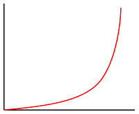

# Data-driven style expressions in the iOS SDK (Preview)

Layers use predicates and expressions to determine what to display and how
to format it. _Predicates_ are represented by the same `NSPredicate` class that
filters results from Core Data or items in an `NSArray` in Objective-C.
Predicates are based on _expressions_, represented by the `NSExpression` class.

This document discusses the specific subset of the predicate and expression
syntax supported by this SDK. For a more general introduction to predicates and
expressions, consult the
_[Predicate Programming Guide](https://developer.apple.com/library/content/documentation/Cocoa/Conceptual/Predicates/AdditionalChapters/Introduction.html)_
in Apple developer documentation.

## Using predicates to filter vector data

Most layer classes display `Feature` objects that you can show or hide
based on the feature’s properties. Use the `filter`
option to include only the features in the source layer that satisfy a
condition that you define.

### Operators

The following comparison operators are supported:

`NSPredicateOperatorType`                     | Format string syntax
----------------------------------------------|---------------------
`NSEqualToPredicateOperatorType`              | `key = value`<br />`key == value`
`NSGreaterThanOrEqualToPredicateOperatorType` | `key >= value`<br />`key => value`
`NSLessThanOrEqualToPredicateOperatorType`    | `key <= value`<br />`key =< value`
`NSGreaterThanPredicateOperatorType`          | `key > value`
`NSLessThanPredicateOperatorType`             | `key < value`
`NSNotEqualToPredicateOperatorType`           | `key != value`<br />`key <> value`
`NSBetweenPredicateOperatorType`              | `key BETWEEN { 32, 212 }`

To test whether a feature has or lacks a specific property, compare the
attribute to `NULL` or `NIL`. Predicates created using the
`NSPredicate(value:)` initializer are also supported. String
operators and custom operators aren't supported.

The following compound operators are supported:

`NSCompoundPredicateType` | Format string syntax
--------------------------|---------------------
`NSAndPredicateType`      | `predicate1 AND predicate2`<br />`predicate1 && predicate2`
`NSOrPredicateType`       | `predicate1 OR predicate2`<br />`predicate1 \|\| predicate2`
`NSNotPredicateType`      | `NOT predicate`<br />`!predicate`

The following aggregate operators are supported:

`NSPredicateOperatorType`         | Format string syntax
----------------------------------|---------------------
`NSInPredicateOperatorType`       | `key IN { 'iOS', 'macOS', 'tvOS', 'watchOS' }`
`NSContainsPredicateOperatorType` | `{ 'iOS', 'macOS', 'tvOS', 'watchOS' } CONTAINS key`

You can use the `IN` and `CONTAINS` operators to test whether a value appears in a collection, whether a string is a substring of a larger string, or whether the evaluated feature (`SELF`) lies within a given `Feature`.

The following combinations of comparison operators and modifiers are supported:

`NSComparisonPredicateModifier` | `NSPredicateOperatorType`           | Format string syntax
--------------------------------|-------------------------------------|---------------------
`NSAllPredicateModifier`        | `NSNotEqualToPredicateOperatorType` | `ALL haystack != needle`
`NSAnyPredicateModifier`        | `NSEqualToPredicateOperatorType`    | `ANY haystack = needle`<br />`SOME haystack = needle`

The following comparison predicate options are supported for comparison and
aggregate operators that are used in the predicate:

`NSComparisonPredicateOptions`          | Format string syntax
----------------------------------------|---------------------
`NSCaseInsensitivePredicateOption`      | `'QUEBEC' =[c] 'Quebec'`
`NSDiacriticInsensitivePredicateOption` | `'Québec' =[d] 'Quebec'`

Other comparison predicate options are unsupported, namely `l`
(for locale sensitivity) and `n` (for normalization). A comparison is
locale-sensitive as long as it's case- or diacritic-insensitive. Comparison
predicate options aren't supported with comparison modifiers
like `ALL` and `ANY`.

### Operands

Operands in predicates can be [variables](#variables), [key paths](#key-paths),
or almost anything else that can appear
[inside an expression](#using-expressions-to-configure-layer-options).

Automatic type casting isn't performed. Therefore, a feature only matches a
predicate if its value for the property in question is of the same type as the
value specified in the predicate. Use the `CAST()` operator to convert a key
path or variable into a matching type:

* To cast a value to a number, use `CAST(key, 'NSNumber')`.
* To cast a value to a string, use `CAST(key, 'NSString')`.
* To cast a value to a color, use `CAST(key, 'UIColor')`.
* To cast a `UIColor` object to an array, use `CAST(noindex(color), 'NSArray')`.

For details about the predicate format string syntax, consult the “Predicate
Format String Syntax” chapter of the
_[Predicate Programming Guide](https://developer.apple.com/library/content/documentation/Cocoa/Conceptual/Predicates/AdditionalChapters/Introduction.html)_
in Apple developer documentation.

### Operands examples

Bubble and symbol layers render the coordinates of all geometries in a data source, by default. This behavior can highlight the vertices of a polygon or a line. The `filter` option of the layer can be used to limit the geometry type of the features it renders, by using `NSExpression.geometryTypeAZMVariable` within a predicate. The following example limits a bubble layer so that only `Point` features are rendered.

```swift
let layer = BubbleLayer(source: source, options: [
    .filter(
        from: NSPredicate(format: "%@ == \"Point\"", NSExpression.geometryTypeAZMVariable)
    )
])
```

The following example allows both `Point` and `Polygon` features to be rendered.

```swift
let layer = BubbleLayer(source: source, options: [
    .filter(
        from: NSCompoundPredicate(orPredicateWithSubpredicates: [
            NSPredicate(format: "%@ == \"Point\"", NSExpression.geometryTypeAZMVariable),
            NSPredicate(format: "%@ == \"Polygon\"", NSExpression.geometryTypeAZMVariable)
        ])
    )
])
```

## Using expressions to configure layer options

An expression can contain subexpressions of various types. Each of the supported
types of expressions is discussed below.

Some examples in this section of the document use the following feature to demonstrate different ways in which these expressions can be used.

```json
{
    "type": "Feature",
    "geometry": {
        "type": "Point",
        "coordinates": [-122.13284, 47.63699]
    },
    "properties": {
        "id": 123,
        "entityType": "restaurant",
        "revenue": 12345,
        "subTitle": "Building 40", 
        "temperature": 64,
        "title": "Cafeteria", 
        "zoneColor": "purple",
        "abcArray": ["a", "b", "c"],
        "array2d": [["a", "b"], ["x", "y"]],
        "_style": {
            "fillColor": "red"
        }
    }
}
```

The following code shows how to manually create this GeoJSON feature in an app.

```swift
// Create a point feature.
let feature = Feature(Point(CLLocationCoordinate2D(latitude: 45, longitude: -100)))

// Add properties to the feature.
feature.addProperty("id", value:  123)
feature.addProperty("entityType", value: "restaurant")
feature.addProperty("revenue", value:  12345)
feature.addProperty("subTitle", value: "Building 40")
feature.addProperty("temperature", value:  64)
feature.addProperty("title", value: "Cafeteria")
feature.addProperty("zoneColor", value: "purple")
feature.addProperty("abcArray", value: ["a", "b", "c"])
feature.addProperty("array2d", value: [["a", "b"], ["x", "y"]])
feature.addProperty("_style", value: ["fillColor": "red"])
```

The following code shows how to deserialize the stringified version of the JSON object into a GeoJSON feature in an app.

```swift
let featureString = "{\"type\":\"Feature\",\"geometry\":{\"type\":\"Point\",\"coordinates\":[-122.13284,47.63699]},\"properties\":{\"id\":123,\"entityType\":\"restaurant\",\"revenue\":12345,\"subTitle\":\"Building 40\",\"temperature\":64,\"title\":\"Cafeteria\",\"zoneColor\":\"purple\",\"abcArray\":[\"a\",\"b\",\"c\"],\"array2d\":[[\"a\",\"b\"],[\"x\",\"y\"]],\"_style\":{\"fillColor\":\"red\"}}}"

let feature = Feature.fromJson(featureString)
```

### JSON-based

The Azure Maps Web SDK also supports data-driven style expressions that are represented using a JSON array. These same expressions can be recreated using the native `NSExpression` class in the iOS SDK. Alternatively, these JSON-based expressions can be shared to the ios app (attached to the response, for example) and passed into the `NSExpression(azmJSONObject:)` method. For example, take the following JSON expression.

```js
var exp = ['get','title'];
```

The swift version of the above expression would be `["get", "title"]` and can be read into the iOS SDK as follows.

```swift
let jsonResponse = ["get", "title"]
let exp = NSExpression(azmJSONObject: jsonResponse)
```

Using this approach can make it easy to reuse style expressions between mobile and web apps that use Azure Maps.

This video provides an overview of data-driven styling in Azure Maps.

>[Internet of Things Show - Data-Driven Styling with Azure Maps](/shows/Internet-of-Things-Show/Data-Driven-Styling-with-Azure-Maps/player?format=ny)

### Constant values

A constant value can be of any of the following types:

* `UIColor`
* `String`
* `NSNumber.boolValue`
* `NSNumber.doubleValue`
* `[Float]`
* `[String]`
* `NSValue.cgVectorValue`
* `NSValue.uiEdgeInsetsValue`

#### Constant values example

```swift
NSExpression(forConstantValue: UIColor.red)
NSExpression(forConstantValue: "constant")
NSExpression(forConstantValue: true)
NSExpression(forConstantValue: 20)
NSExpression(forConstantValue: [20, 21, 22])
NSExpression(forConstantValue: ["constant1", "constant2"])
NSExpression(forConstantValue: NSValue(cgVector: CGVector(dx: 2, dy: -4)))
NSExpression(forConstantValue: NSValue(uiEdgeInsets: UIEdgeInsets(top: 8, left: 0, bottom: 8, right: 0)))
```

### Key paths

A key path expression refers to a property of the `Feature` object being
evaluated for display. For example, if a polygon’s `Feature.properties`
dictionary contains the `floorCount` key, then the key path `floorCount` refers
to the value of the `floorCount` property when evaluating that particular
polygon.

Some characters may not be used directly as part of a key path in a format
string. For example, if a feature’s property is named `ISO 3166-1:2006`, an
expression format string of `lowercase(ISO 3166-1:2006)` or a predicate format
string of `ISO 3166-1:2006 == 'US-OH'` would raise an exception. Instead, use a
`%K` placeholder or the `NSExpression(forKeyPath:)` initializer:

```swift
NSPredicate(format: "%K == 'US-OH'", "ISO 3166-1:2006")
NSExpression(
   forFunction: "lowercase:",
   arguments: [NSExpression(forKeyPath: "ISO 3166-1:2006")]
)
```

### Functions

Of the
[functions predefined](https://developer.apple.com/documentation/foundation/nsexpression/1413747-init#discussion)
by the
[`NSExpression(forFunction:arguments:)` method](https://developer.apple.com/documentation/foundation/nsexpression/1413747-init),
the following subset is supported in layer options:

Initializer parameter | Format string syntax
----------------------|---------------------
`average:`            | `average({1, 2, 2, 3, 4, 7, 9})`
`sum:`                | `sum({1, 2, 2, 3, 4, 7, 9})`
`count:`              | `count({1, 2, 2, 3, 4, 7, 9})`
`min:`                | `min({1, 2, 2, 3, 4, 7, 9})`
`max:`                | `max({1, 2, 2, 3, 4, 7, 9})`
`add:to:`             | `1 + 2`
`from:subtract:`      | `2 - 1`
`multiply:by:`        | `1 * 2`
`divide:by:`          | `1 / 2`
`modulus:by:`         | `modulus:by:(1, 2)`
`sqrt:`               | `sqrt(2)`
`log:`                | `log(10)`
`ln:`                 | `ln(2)`
`raise:toPower:`      | `2 ** 2`
`exp:`                | `exp(0)`
`ceiling:`            | `ceiling(0.99999)`
`abs:`                | `abs(-1)`
`trunc:`              | `trunc(6378.1370)`
`floor:`              | `floor(-0.99999)`
`uppercase:`          | `uppercase('Elysian Fields')`
`lowercase:`          | `lowercase('DOWNTOWN')`
`noindex:`            | `noindex(0 + 2 + c)`
`length:`             | `length('Wapakoneta')`
`castObject:toType:`  | `CAST(ele, 'NSString')`<br>`CAST(ele, 'NSNumber')`

The following predefined functions are **not** supported:

Initializer parameter | Format string syntax
----------------------|---------------------
`median:`             | `median({1, 2, 2, 3, 4, 7, 9})`
`mode:`               | `mode({1, 2, 2, 3, 4, 7, 9})`
`stddev:`             | `stddev({1, 2, 2, 3, 4, 7, 9})`
`random`              | `random()`
`randomn:`            | `randomn(10)`
`now`                 | `now()`
`bitwiseAnd:with:`    | `bitwiseAnd:with:(5, 3)`
`bitwiseOr:with:`     | `bitwiseOr:with:(5, 3)`
`bitwiseXor:with:`    | `bitwiseXor:with:(5, 3)`
`leftshift:by:`       | `leftshift:by:(23, 1)`
`rightshift:by:`      | `rightshift:by:(23, 1)`
`onesComplement:`     | `onesComplement(255)`
`distanceToLocation:fromLocation:` | `distanceToLocation:fromLocation:(there, here)`

### Conditionals

Conditionals are supported via the built-in `NSExpression(forAZMConditional:trueExpression:falseExpression:)` method and `TERNARY()` operator. If you need to express multiple cases (“else-if”), you can either nest a conditional within a conditional or use the [match expression](#match-expression).

#### Conditionals example

The following example steps through different predicates until it finds one that evaluates to `true`, and then returns its true expression. If no predicates evaluate to `true`, the last false expression is returned.

```swift
let layer = BubbleLayer(
    source: source,
    options: [
        .bubbleColor(
            from: NSExpression(
                // Check to see whether a feature has a zoneColor property
                forAZMConditional: NSPredicate(format: "zoneColor != NIL"),
                // If it has a zoneColor property, use its value as a color.
                trueExpression: NSExpression(forKeyPath: "zoneColor"),
                // if not, do another check
                falseExpression: NSExpression(
                    // Check to see whether it has a temperature property with a value greater than or equal to 100.
                    forConditional: NSPredicate(format: "temperature != nil && temperature >= 100"),
                    // If it has, use red color.
                    trueExpression: NSExpression(forConstantValue: UIColor.red),
                    // If not, use green color.
                    falseExpression: NSExpression(forConstantValue: UIColor.green)
                )
            )
        )
    ]
)
```

### Aggregates

Aggregate expressions can contain arrays of expressions. In some cases, it's possible to use the array itself instead of wrapping the array in an aggregate expression.

### Variables

Th iOS SDK defines the following variables for use with layer options.

#### Feature identifier

A feature's ID. This variable corresponds to the `NSExpression.featureIdentifierAZMVariable` property.

_Format string syntax_: `$featureIdentifier`

#### Feature properties

A feature's properties object. This variable corresponds to the `NSExpression.featurePropertiesAZMVariable` property.

_Format string syntax_: `$featureAttributes`

#### Feature accumulated

The value of a cluster property accumulated so far.
This can only be used in the `clusterProperties` option of a clustered `DataSource` source.
This variable corresponds to the `NSExpression.featureAccumulatedAZMVariable` property.

_Format string syntax_: `$featureAccumulated`

#### Geometry type

The type of geometry represented by the feature. A feature’s type is one of the following strings:

* `Point` for point features, corresponding to the `Point` class.
* `MultiPoint` for point collection features, corresponding to the `PointCollection` class.
* `LineString` for polyline features, corresponding to the `Polyline` class.
* `MultiLineString` for multiple polylines features, corresponding to the `MultiPolyline` class.
* `Polygon` for polygon features, corresponding to the `Polygon` class.
* `MultiPolygon` for multiple polygons features, corresponding to the `MultiPolygon` class.
* `GeometryCollection` for geometry collection features, corresponding to the `GeometryCollection` class.

This variable corresponds to the `NSExpression.geometryTypeAZMVariable` property.

_Format string syntax_: `$geometryType`

##### Variables example

See [Operands examples](#operands-examples).

#### Zoom

The current zoom level.
In layer's style options, this variable may only appear as the target of a top-level interpolation or step expression.
This variable corresponds to the `NSExpression.zoomLevelAZMVariable` property.

_Format string syntax_: `$zoomLevel`

##### Zoom example

By default, the radii of data points rendered in the heat map layer have a fixed point radius for all zoom levels. As the map is zoomed, the data aggregates together and the heat map layer looks different. A `zoom` expression can be used to scale the radius for each zoom level such that each data point covers the same physical area of the map. It makes the heat map layer look more static and consistent. Each zoom level of the map has twice as many points vertically and horizontally as the previous zoom level. Scaling the radius, such that it doubles with each zoom level, creates a heat map that looks consistent on all zoom levels. It can be accomplished using the `zoom` expression with a `base 2 exponential interpolation` expression, with the point radius set for the minimum zoom level and a scaled radius for the maximum zoom level calculated as `pow(2, maxZoom - minZoom) * radius` as shown below.

```swift
let layer = HeatMapLayer(
   source: source,
   options: [
      .heatmapRadius(
         from: NSExpression(
            forAZMInterpolating: .zoomLevelAZMVariable,
            curveType: .exponential,
            parameters: NSExpression(forConstantValue: 2),
            stops: NSExpression(forConstantValue: [
               // For zoom level 1 set the radius to 2 points.
               1: 2,

               // Between zoom level 1 and 19, exponentially scale the radius from 2 points to 2 * 2^(maxZoom - minZoom) points.
               19: pow(2, 19 - 1) * 2
            ])
         )
      )
   ]
)
```

#### HeatMap density

The [kernel density estimation](https://en.wikipedia.org/wiki/Kernel_density_estimation)
of a screen point in a heatmap layer; in other words, a relative measure
of how many data points are crowded around a particular pixel. 
This variable evaluates to a number between 0 and 1.
It's used in combination with a `interpolation` or `step` expression to define the color gradient used to colorize the heat map.
Can only be used in the `heatmapColor` option of the heat map layer.
This variable corresponds to the `NSExpression.heatmapDensityAZMVariable` property.

_Format string syntax_: `$heatmapDensity`

> [!TIP]
> The color at index 0, in an interpolation expression or the default color of a step color, defines the color of the area where there's no data. The color at index 0 can be used to define a background color. Many prefer to set this value to transparent or a semi-transparent black.

##### HeatMap density example

This example uses a liner interpolation expression to create a smooth color gradient for rendering the heat map.

```swift
let layer = HeatMapLayer(
   source: source,
   options: [
      .heatmapColor(
         from: NSExpression(
            forAZMInterpolating: .heatmapDensityAZMVariable,
            curveType: .linear,
            parameters: nil,
            stops: NSExpression(forConstantValue: [
               0: UIColor.magenta.withAlphaComponent(0),
               0.01: UIColor.magenta,
               0.5: UIColor(red: 251 / 255, green: 0, blue: 251 / 255, alpha: 1),
               1: UIColor(red: 0, green: 195 / 255, blue: 1, alpha: 1)
            ])
         )
      )
   ]
)
```

In addition to using a smooth gradient to colorize a heat map, colors can be specified within a set of ranges by using a step expression. Using a step expression for colorizing the heat map visually breaks up the density into ranges that resembles a contour or radar style map.

```swift
let layer = HeatMapLayer(
   source: source,
   options: [
      .heatmapColor(
         from: NSExpression(
            forAZMStepping: .heatmapDensityAZMVariable,
            from: NSExpression(forConstantValue: UIColor.clear),
            stops: NSExpression(forConstantValue: [
               0.01: UIColor(red: 0, green: 0, blue: 128 / 255, alpha: 1),
               0.25: UIColor.cyan,
               0.5: UIColor.green,
               0.75: UIColor.yellow,
               1: UIColor.red
            ])
         )
      )
   ]
)
```

For more information, see the [Add a heat map layer](add-heat-map-layer-ios.md) documentation.

#### Line progress

A number that indicates the relative distance along a line at a given point along the line.
This variable evaluates to 0 at the beginning of the line and 1 at the end of the line.
It can only be used with the `LineLayerOption.strokeGradient` option of the line layer.
It corresponds to the `NSExpression.lineProgressAZMVariable` property.

_Format string syntax_: `$lineProgress`

> [!NOTE]
> The `strokeGradient` option of the line layer requires the `lineMetrics` option of the data source to be set to `true`.

##### Line progress example

This example uses the `NSExpression.lineProgressAZMVariable` expression to apply a color gradient to the stroke of a line.

```swift
let layer = LineLayer(
   source: source,
   options: [
      .strokeGradient(
         from: NSExpression(
            forAZMInterpolating: NSExpression.lineProgressAZMVariable,
            curveType: .linear,
            parameters: nil,
            stops: NSExpression(forConstantValue: [
               0: UIColor.blue,
               0.1: UIColor(red: 0.25, green: 0.41, blue: 1, alpha: 1), // Royal Blue
               0.3: UIColor.cyan,
               0.5: UIColor(red: 0, green: 1, blue: 0, alpha: 1), // Lime
               0.7: UIColor.yellow,
               1: UIColor.red
            ])
         )
      )
   ]
)
```

[See live example](add-line-layer-map-ios.md)

### AzureMaps-specific methods

The following section shows specific to AzureMaps methods that extend the `NSExpression` class

#### Match expression

A match expression is a type of conditional expression that provides switch-statement like logic. The input can be any expression such as `NSExpression(forKeyPath: "entityType")` that returns a string or a number. The matched expression is a dictionary, which should have keys as expressions that evaluate either to single string or number or to an array of all strings or all numbers and values as any expressions. If the input expression type doesn't match the type of the keys, the result is the default fallback value.

##### Match expression examples

The following example looks at the `entityType` property of a `Point` feature in a bubble layer and searches for a match. If it finds a match, that specified value is returned or it returns the fallback value.

```swift
let layer = BubbleLayer(
    source: source,
    options: [
        .bubbleColor(
            from: NSExpression(
                // Get the input value to match.
                forAZMMatchingKey: NSExpression(forKeyPath: "entityType"),
                // List the keys to match and the value to return for each match.
                in: [
                    // If value is "restaurant" return red color.
                    NSExpression(forConstantValue: "restaurant"): NSExpression(forConstantValue: UIColor.red),
                    // If value is "park" return green color.
                    NSExpression(forConstantValue: "park"): NSExpression(forConstantValue: UIColor.green)
                ],
                // Specify a default value to return if no match is found.
                default: NSExpression(forConstantValue: UIColor.black)
            )
        )
    ]
)
```

The following example uses an expression evaluating to string array to specify a set of labels that should all return the same value. This approach is much more efficient than listing each label individually. In this case, if the `entityType` property is `"restaurant"` or `"grocery_store"`, red color is returned.

```swift
let layer = BubbleLayer(
    source: source,
    options: [
        .bubbleColor(
            from: NSExpression(
                // Get the input value to match.
                forAZMMatchingKey: NSExpression(forKeyPath: "entityType"),
                // List the keys to match and the value to return for each match.
                in: [
                    // If value is "restaurant" or "grocery_store" return red color.
                    NSExpression(forConstantValue: ["restaurant", "grocery_store"]): NSExpression(forConstantValue: UIColor.red),
                    // If value is "park" return green color.
                    NSExpression(forConstantValue: "park"): NSExpression(forConstantValue: UIColor.green)
                ],
                // Specify a default value to return if no match is found.
                default: NSExpression(forConstantValue: UIColor.black)
            )
        )
    ]
)
```

#### Coalesce expression

A coalesce expression steps through a set of expressions until the first non-null value is obtained and returns that value.

##### Coalesce expression example

The following example uses a coalesce expression to set the `textField` option of a symbol layer. If the `title` property is missing from the feature or set to `nil`, the expression looks for the `subTitle` property, if it's missing or `nil`, it returns an empty string.

```swift
let layer = SymbolLayer(
    source: source,
    options: [
        .textField(
            from: NSExpression(forAZMFunctionCoalesce: [
                // Try getting the title property.
                NSExpression(forKeyPath: "title"),

                // If there is no title, try getting the subTitle.
                NSExpression(forKeyPath: "subTitle"),

                // Default to an empty string.
                NSExpression(forConstantValue: "")
            ])
        )
    ]
)
```

#### Join expression

Joins multiple strings together. Each value must be a string or a number.

##### Join expression example

The following example joins the `temperature` property of the point feature and `"°F"`.

```swift
let layer = SymbolLayer(
    source: source,
    options: [
        .textField(
            from: NSExpression(forAZMFunctionJoin: [
                NSExpression(forKeyPath: "temperature"),
                NSExpression(forConstantValue: "°F")
            ])
        ),

        // Some additional style options.
        .textOffset(CGVector(dx: 0, dy: -1.5)),
        .textSize(12),
        .textColor(.white)
    ]
)
```

The above expression renders a pin on the map with the text `"64°F"` overlaid on top of it as shown in the following image.

:::image type="content" source="./media/ios-sdk/data-driven-style-expressions-ios/join-expression.png" alt-text="Join expression example":::

#### Interpolation and step expressions

Interpolation and step expressions can be used to calculate values along an interpolated curve or step function. These expressions take in an expression that returns a number as their input, for example `NSExpression(forKeyPath: "temperature")`. The input value is evaluated against pairs of input and output values, to determine the value that best fits the interpolated curve or step function. The output values are called "stops". The input values for each stop must be a number and be in ascending order. The output values must be a number, an array of numbers, or a color.

##### Interpolation expression

An interpolation expression can be used to calculate a continuous, smooth set of values by interpolating between stop values.

There are three types of interpolation methods that can be used in an interpolation expression:

| Name | Description | Parameters |
|------|-------------|------------|
| `ExpressionInterpolationMode.linear` | Interpolates linearly between the pair of stops. | `nil` |
| `ExpressionInterpolationMode.exponential` | Interpolates exponentially between the stops. A base is specified and controls the rate at which the output increases. Higher values make the output increase more towards the high end of the range. A base value close to 1 produces an output that increases more linearly.| An expression that evaluates to a number, specifying the base of the exponential interpolation. |
| `ExpressionInterpolationMode.cubicBezier` | Interpolates using a [cubic Bezier curve](https://developer.mozilla.org/docs/Web/CSS/timing-function) defined by the given control points. | An array or aggregate expression containing four expressions, each evaluating to a number. The four numbers are control points for the cubic Bézier curve. |

Here's an example of what these different types of interpolations look like.

| Linear  | Exponential | Cubic Bezier |
|---------|-------------|--------------|
|  |  |  |

###### Interpolation expression example

The following example uses a linear interpolation expression to set the `bubbleColor` property of a bubble layer based on the `temperature` property of the point feature. If the `temperature` value is less than 60, blue color is returned. If it's between 60 and less than 70, yellow is returned. If it's between 70 and less than 80, orange is returned. If it's 80 or greater, red is returned.

```swift
let layer = BubbleLayer(
    source: source,
    options: [
        .bubbleColor(
            from: NSExpression(
                forAZMInterpolating: NSExpression(forKeyPath: "temperature"),
                curveType: .linear,
                parameters: nil,
                stops: NSExpression(forConstantValue: [
                    50: UIColor.blue,
                    60: UIColor.yellow,
                    70: UIColor.orange,
                    80: UIColor.red
                ])
            )
        )
    ]
)
```

The following image demonstrates how the colors are chosen for the above expression.

:::image type="content" source="./media/ios-sdk/data-driven-style-expressions-ios/interpolate-expression-example.png" alt-text="Interpolate expression example":::

##### Step expression

A step expression can be used to calculate discrete, stepped result values by evaluating a [piecewise-constant function](https://mathworld.wolfram.com/PiecewiseConstantFunction.html) defined by stops.

Step expressions return the output value of the stop just before the input value, or the from value if the input is less than the first stop.

###### Step expression example

The following example uses a step expression to set the `bubbleColor` property of a bubble layer based on the `temperature` property of the point feature. If the `temperature` value is less than 60, blue is returned. If it's between 60 and less than 70, yellow is returned. If it's between 70 and less than 80, orange is returned. If it's 80 or greater, red is returned.

```swift
let layer = BubbleLayer(
    source: source,
    options: [
        .bubbleColor(
            from: NSExpression(
                forAZMStepping: NSExpression(forKeyPath: "temperature"),
                from: NSExpression(forConstantValue: UIColor.blue),
                stops: NSExpression(forConstantValue: [
                    50: UIColor.blue,
                    60: UIColor.yellow,
                    70: UIColor.orange,
                    80: UIColor.red
                ])
            )
        )
    ]
)
```

The following image demonstrates how the colors are chosen for the above expression.

:::image type="content" source="./media/ios-sdk/data-driven-style-expressions-ios/step-expression-example.png" alt-text="Step expression example":::

## Additional information

Learn more about the layers that support expressions:

* [Add a symbol layer](add-symbol-layer-ios.md)
* [Add a bubble layer](add-bubble-layer-map-ios.md)
* [Add a line layer](add-line-layer-map-ios.md)
* [Add a polygon layer](add-polygon-layer-map-ios.md)
