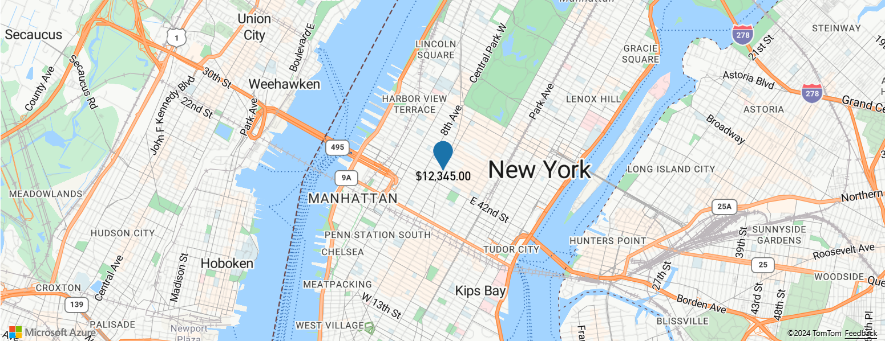

# Data-driven Style Expressions (Web SDK)

Expressions enable you to apply business logic to styling options that observe the properties defined in each shape in a data source. Expressions can filter data in a data source or a layer. Expressions may consist of conditional logic, like if-statements. And, they can be used to manipulate data using: string operators, logical operators, and mathematical operators.

Data-driven styles reduce the amount of code needed to implement business logic around styling. When used with layers, expressions are evaluated at render time on a separate thread. This functionality provides increased performance compared to evaluating business logic on the UI thread.

This video provides an overview of data-driven styling in the Azure Maps Web SDK.

</br>

>[!VIDEO https://learn.microsoft.com/Shows/Internet-of-Things-Show/Data-Driven-Styling-with-Azure-Maps/player?format=ny]

Expressions are represented as JSON arrays. The first element of an expression in the array is a string that specifies the name of the expression operator. For example, "+" or "case". The next elements (if any) are the arguments to the expression. Each argument is either a literal value (a string, number, boolean, or `null`), or another expression array. The following pseudocode defines the basic structure of an expression.

```javascript
[ 
    expression_operator, 
    argument0, 
    argument1, 
    …
] 
```

The Azure Maps Web SDK supports many types of expressions. Expressions can be used on their own or in combination with other expressions.

| Type of expressions       | Description |
|---------------------------|-------------|
| [Aggregate expression]    | An expression that defines a calculation that is processed over a set of data and can be used with the `clusterProperties` option of a `DataSource`. |
| [Boolean expressions]     | Boolean expressions provide a set of boolean operators expressions for evaluating boolean comparisons. |
| [Color expressions]       | Color expressions make it easier to create and manipulate color values. |
| [Conditional expressions] | Conditional expressions provide logic operations that are like if-statements. |
| [Data expressions]        | Provides access to the property data in a feature. |
| [Interpolate and Step expressions] | Interpolate and step expressions can be used to calculate values along an interpolated curve or step function. |
| [Layer specific expressions] | Special expressions that are only applicable to a single layer. |
| [Math expressions]        | Provides mathematical operators to perform data-driven calculations within the expression framework. |
| [String operator expressions] | String operator expressions perform conversion operations on strings such as concatenating and converting the case. |
| [Type expressions]        | Type expressions provide tools for testing and converting different data types like strings, numbers, and boolean values. |
| [Variable binding expressions] | Variable binding expressions store the results of a calculation in a variable and referenced elsewhere in an expression multiple times without having to recalculate the stored value. |
| [Zoom expression]         | Retrieves the current zoom level of the map at render time. |

All examples in this document use the following feature to demonstrate different ways in which the different types of expressions can be used.

```json
{
    "type": "Feature",
    "geometry": {
        "type": "Point",
        "coordinates": [-122.13284, 47.63699]
    },
    "properties": {
        "id": 123,
        "entityType": "restaurant",
        "revenue": 12345,
        "subTitle": "Building 40", 
        "temperature": 64,
        "title": "Cafeteria", 
        "zoneColor": "purple",
        "abcArray": ["a", "b", "c"],
        "array2d": [["a", "b"], ["x", "y"]],
        "_style": {
            "fillColor": "red"
        }
    }
}
```

## Data expressions

Data expressions provide access to the property data in a feature.

| Expression | Return type | Description |
|------------|-------------|-------------|
| `['at', number, array]` | value | Retrieves an item from an array. |
| `['geometry-type']` | string | Gets the feature's geometry type: Point, MultiPoint, LineString, MultiLineString, Polygon, MultiPolygon. |
| `['get', string]` | value | Gets the property value from the current feature's properties. Returns null if the requested property is missing. |
| `['get', string, object]` | value | Gets the property value from the properties of the provided object. Returns null if the requested property is missing. |
| `['has', string]` | boolean | Determines if the properties of a feature have the specified property. |
| `['has', string, object]` | boolean | Determines if the properties of the object have the specified property. |
| `['id']` | value | Gets the feature's ID if it has one. |
| `['in', boolean | string | number, array]` | boolean | Determines whether an item exists in an array |
| `['in', substring, string]` | boolean | Determines whether a substring exists in a string |
| `['index-of', boolean | string | number, array | string]`<br/><br/>`['index-of', boolean | string | number, array | string, number]` | number | Returns the first position at which an item can be found in an array or a substring can be found in a string, or `-1` if the input can't be found. Accepts an optional index from where to begin the search. |
| `['length', string | array]` | number | Gets the length of a string or an array. |
| `['slice', array | string, number]`<br/><br/>`['slice', array | string, number, number]` | string \| array | Returns an item from an array or a substring from a string from a specified start index, or between a start index and an end index if set. The return value is inclusive of the start index but not of the end index. |

**Examples**

Properties of a feature can be accessed directly in an expression by using a `get` expression. This example uses the `zoneColor` value of the feature to specify the color property of a bubble layer.

```javascript
var layer = new atlas.layer.BubbleLayer(datasource, null, {
    color: ['get', 'zoneColor'] //Get the zoneColor value.
});
```

The above example works fine, if all the point features have the `zoneColor` property. If they don't, the color defaults to "black". To modify the fallback color, use a `case` expression in combination with the `has` expression to check if the property exists. If the property doesn't exist, return a fallback color.

```javascript
var layer = new atlas.layer.BubbleLayer(datasource, null, {
    color: [
        'case', //Use a conditional case expression.

        ['has', 'zoneColor'],   //Check to see if feature has a "zoneColor" property
        ['get', 'zoneColor'],   //If it does, use it.

        'blue'  //If it doesn't, default to blue.
    ]
});
```

Bubble and symbol layers render the coordinates of all shapes in a data source, by default. This behavior can highlight the vertices of a polygon or a line. The `filter` option of the layer can be used to limit the geometry type of the features it renders, by using a `['geometry-type']` expression within a boolean expression. The following example limits a bubble layer so that only `Point` features are rendered.

```javascript
var layer = new atlas.layer.BubbleLayer(datasource, null, {
    filter: ['==', ['geometry-type'], 'Point']
});
```

The following example allows both `Point` and `MultiPoint` features to be rendered.

```javascript
var layer = new atlas.layer.BubbleLayer(datasource, null, {
    filter: ['any', ['==', ['geometry-type'], 'Point'], ['==', ['geometry-type'], 'MultiPoint']]
});
```

Similarly, the outline of Polygons render in line layers. To disable this behavior in a line layer, add a filter that only allows `LineString` and `MultiLineString` features.  

Here are some more examples of how to use data expressions:

```javascript
//Get item [2] from an array "properties.abcArray[1]" = "c"
['at', 2, ['get', 'abcArray']]

//Get item [0][1] from a 2D array "properties.array2d[0][1]" = "b"
['at', 1, ['at', 0, ['get', 'array2d']]]

//Check to see if a value is in an array "properties.abcArray.indexOf('a') !== -1" = true
['in', 'a', ['get', 'abcArray']]

//Gets the index of the value 'b' in an array "properties.abcArray.indexOf('b')" = 1
['index-of', 'b', ['get', 'abcArray']]

//Get the length of an array "properties.abcArray.length" = 3
['length', ['get', 'abcArray']]

//Get the value of a subproperty "properties._style.fillColor" = "red"
['get', 'fillColor', ['get', '_style']]

//Check that "fillColor" exists as a subproperty of "_style".
['has', 'fillColor', ['get', '_style']]

//Slice an array starting at index 2 "properties.abcArray.slice(2)" = ['c']
['slice', ['get', 'abcArray'], 2]

//Slice a string from index 0 to index 4 "properties.entityType.slice(0, 4)" = 'rest'
['slice', ['get', 'entityType'], 0, 4]
```

## Math expressions

Math expressions provide mathematical operators to perform data-driven calculations within the expression framework.

| Expression | Return type | Description |
|------------|-------------|-------------|
| `['+', number, number, …]` | number | Calculates the sum of the specified numbers. |
| `['-', number]` | number | Subtracts 0 by the specified number. |
| `['-', number, number]` | number | Subtracts the first numbers by the second number. |
| `['*', number, number, …]` | number | Multiplies the specified numbers together. |
| `['/', number, number]` | number | Divides the first number by the second number. |
| `['%', number, number]` | number | Calculates the remainder when dividing the first number by the second number. |
| `['^', number, number]` | number | Calculates the value of the first value raised to the power of the second number. |
| `['abs', number]` | number | Calculates the absolute value of the specified number. |
| `['acos', number]` | number | Calculates the arccosine of the specified number. |
| `['asin', number]` | number | Calculates the arcsine of the specified number. |
| `['atan', number]` | number | Calculates the arctangent of the specified number. |
| `['ceil', number]` | number | Rounds the number up to the next whole integer. |
| `['cos', number]` | number | Calculates the cos of the specified number. |
| `['distance', Point \| MultiPoint \| LineString \| MultiLineString \| Polygon \| MultiPolygon \| Feature \| FeatureCollection]` | number | Calculates the shortest distance in meters between the evaluated feature and the input geometry. Distance values returned may vary in precision due to loss in precision from encoding geometries, particularly below zoom level 13. |
| `['e']` | number | Returns the mathematical constant `e`. |
| `['floor', number]` | number | Rounds the number down to the previous whole integer. |
| `['ln', number]` | number | Calculates the natural logarithm of the specified number. |
| `['ln2']` | number | Returns the mathematical constant `ln(2)`. |
| `['log10', number]` | number | Calculates the base-ten logarithm of the specified number. |
| `['log2', number]` | number | Calculates the base-two logarithm of the specified number. |
| `['max', number, number, …]` | number | Calculates the maximum number in the specified set of numbers. |
| `['min', number, number, …]` | number | Calculates the minimum number in the specified set of numbers. |
| `['pi']` | number | Returns the mathematical constant `PI`. |
| `['round', number]` | number | Rounds the number to the nearest integer. Halfway values are rounded away from zero. For example, `['round', -1.5]` evaluates to `-2`. |
| `['sin', number]` | number | Calculates the sine of the specified number. |
| `['sqrt', number]` | number | Calculates the square root of the specified number. |
| `['tan', number]` | number | Calculates the tangent of the specified number. |

## Aggregate expression

An aggregate expression defines a calculation that's processed over a set of data and can be used with the `clusterProperties` option of a `DataSource`. The output of these expressions must be a number or a boolean.

An aggregate expression takes in three values: an operator value, and initial value, and an expression to retrieve a property from each feature in a data to apply the aggregate operation on. This expression has the following format:

```javascript
[operator: string, initialValue: boolean | number, mapExpression: Expression]
```

- operator: An expression function that's then applied to against all values calculated by the `mapExpression` for each point in the cluster. Supported operators:
  - For numbers: `+`, `*`, `max`, `min`
  - For Booleans: `all`, `any`
- initialValue: An initial value in which the first calculated value is aggregated against.
- mapExpression: An expression that's applied against each point in the data set.

**Examples**

If all features in a data set have a `revenue` property, which is a number. Then, the total revenue of all points in a cluster, which are created from the data set, can be calculated. This calculation is done using the following aggregate expression: `['+', 0, ['get', 'revenue']]`

### Accumulated expression

The `accumulated` expression  gets the value of a cluster property accumulated so far, used in the `clusterProperties` option of a clustered `DataSource` source.

**Usage**

```javascript
["accumulated"]
```

## Boolean expressions

Boolean expressions provide a set of boolean operators expressions for evaluating boolean comparisons.

The comparison is strictly typed when values are compared. Values of different types are always considered unequal. Cases where the types are known to be different at parse time are considered invalid and produces a parse error.

| Expression | Return type | Description |
|------------|-------------|-------------|
| `['!', boolean]` | boolean | Logical negation. Returns `true` if the input is `false`, and `false` if the input is `true`. |
| `['!=', value, value]` | boolean | Returns `true` if the input values aren't equal, `false` otherwise. |
| `['<', value, value]` | boolean | Returns `true` if the first input is strictly less than the second, `false` otherwise. The arguments are required to be either both strings or both numbers. |
| `['<=', value, value]` | boolean | Returns `true` if the first input is less than or equal to the second, `false` otherwise. The arguments are required to be either both strings or both numbers. |
| `['==', value, value]` | boolean | Returns `true` if the input values are equal, `false` otherwise. The arguments are required to be either both strings or both numbers. |
| `['>', value, value]` | boolean | Returns `true` if the first input is strictly greater than the second, `false` otherwise. The arguments are required to be either both strings or both numbers. |
| `['>=' value, value]` | boolean | Returns `true` if the first input is greater than or equal to the second, `false` otherwise. The arguments are required to be either both strings or both numbers. |
| `['all', boolean, boolean, …]` | boolean | Returns `true` if all the inputs are `true`, `false` otherwise. |
| `['any', boolean, boolean, …]` | boolean | Returns `true` if any of the inputs are `true`, `false` otherwise. |
| `['within', Polygon | MultiPolygon | Feature<Polygon | MultiPolygon>]` | boolean | Returns `true` if the evaluated feature is fully contained inside a boundary of the input geometry, false otherwise. The input value can be a valid GeoJSON of type `Polygon`, `MultiPolygon`, `Feature`, or `FeatureCollection`. Supported features for evaluation:<br/><br/>- Point: Returns `false` if a point is on the boundary or falls outside the boundary.<br/>- LineString: Returns `false` if any part of a line falls outside the boundary, the line intersects the boundary, or a line's endpoint is on the boundary. |

## Conditional expressions

Conditional expressions provide logic operations that are like if-statements.

The following expressions perform conditional logic operations on the input data. For example, the `case` expression provides "if/then/else" logic while the `match` expression is like a "switch-statement".

### Case expression

A `case` expression is a type of conditional expression that provides "if/then/else" logic. This type of expression steps through a list of boolean conditions. It returns the output value of the first boolean condition to evaluate to true.

The following pseudocode defines the structure of the `case` expression.

```javascript
[
    'case',
    condition1: boolean, 
    output1: value,
    condition2: boolean, 
    output2: value,
    ...,
    fallback: value
]
```

**Example**

The following example steps through different boolean conditions until it finds one that evaluates to `true`, and then returns that associated value. If no boolean condition evaluates to `true`, a fallback value is returned.

```javascript
var layer = new atlas.layer.BubbleLayer(datasource, null, {
    color: [
        'case',

        //Check to see if the first boolean expression is true, and if it is, return its assigned result.
        ['has', 'zoneColor'],
        ['get', 'zoneColor'],

        //Check to see if the second boolean expression is true, and if it is, return its assigned result.
        ['all', ['has', ' temperature '], ['>', ['get', 'temperature'], 100]],
        'red',

        //Specify a default value to return.
        'green'
    ]
});
```

### Match expression

A `match` expression is a type of conditional expression that provides switch-statement like logic. The input can be any expression such as `['get', 'entityType']` that returns a string or a number. Each label must be either a single literal value or an array of literal values, whose values must be all strings or all numbers. The input matches if any of the values in the array match. Each label must be unique. If the input type doesn't match the type of the labels, the result is the fallback value.

The following pseudocode defines the structure of the `match` expression.

```javascript
[
    'match',
    input: number | string,
    label1: number | string | (number | string)[], 
    output1: value,
    label2: number | string | (number | string)[], 
    output2: value,
    ...,
    fallback: value
]
```

**Examples**

The following example looks at the `entityType` property of a Point feature in a bubble layer searches for a match. If it finds a match, that specified value is returned or it returns the fallback value.

```javascript
var layer = new atlas.layer.BubbleLayer(datasource, null, {
    color: [
        'match',

        //Get the property to match.
        ['get', 'entityType'],

        //List the values to match and the result to return for each match.
        'restaurant', 'red',
        'park', 'green',

        //Specify a default value to return if no match is found.
        'black'
    ]
});
```

The following example uses an array to list a set of labels that should all return the same value. This approach is much more efficient than listing each label individually. In this case, if the `entityType` property is "restaurant" or "grocery_store", the color "red" is returned.

```javascript
var layer = new atlas.layer.BubbleLayer(datasource, null, {
    color: [
        'match',

        //Get the property to match.
        ['get', 'entityType'],

        //List the values to match and the result to return for each match.
        ['restaurant', 'grocery_store'], 'red',

        'park', 'green',

        //Specify a default value to return if no match is found.
        'black'
    ]
});
```

### Coalesce expression

A `coalesce` expression steps through a set of expressions until the first non-null value is obtained and returns that value.

The following pseudocode defines the structure of the `coalesce` expression.

```javascript
[
    'coalesce', 
    value1, 
    value2, 
    …
]
```

**Example**

The following example uses a `coalesce` expression to set the `textField` option of a symbol layer. If the `title` property is missing from the feature or set to `null`, the expression tries looking for the `subTitle` property, if it's missing or `null`, it falls back to an empty string.

```javascript
var layer = new atlas.layer.SymbolLayer(datasource, null, {
    textOptions: {
        textField: [
            'coalesce',

            //Try getting the title property.
            ['get', 'title'],

            //If there is no title, try getting the subTitle. 
            ['get', 'subTitle'],

            //Default to an empty string.
            ''
        ]
    }
});
```

The following example uses a `coalesce` expression to retrieve the first available image icon available in the map sprite from a list of specified image names.

```javascript
var layer = new atlas.layer.SymbolLayer(datasource, null, {
    iconOptions: {
        image: [
            'coalesce',

            //Try getting the image with id 'missing-image'.
            ['image', 'missing-image'],

            //Specify an image id to fallback to. 
            'marker-blue'
        ]
    }
});
``` 

## Type expressions

Type expressions provide tools for testing and converting different data types like strings, numbers, and boolean values.

| Expression | Return type | Description |
|------------|-------------|-------------|
| `['array', value]` \| `['array', type: "string" | "number" | "boolean", value]` | Object[] | Asserts that the input is an array. |
| `['boolean', value]` \| `["boolean", value, fallback: value, fallback: value, ...]` | boolean | Asserts that the input value is a boolean. If multiple values are provided, each one is evaluated in order until a boolean is obtained. If none of the inputs are booleans, the expression is an error. |
| `['collator', { 'case-sensitive': boolean, 'diacritic-sensitive': boolean, 'locale': string }]` | collator | Returns a collator for use in locale-dependent comparison operations. The case-sensitive and diacritic-sensitive options default to false. The locale argument specifies the IETF language tag of the locale to use. If none is provided, the default locale is used. If the requested locale isn't available, the collator uses a system-defined fallback locale. Use resolved-locale to test the results of locale fallback behavior. |
| `['literal', array]`<br/><br/>`['literal', object]` | array \| object | Returns a literal array or object value. Use this expression to prevent an array or object from being evaluated as an expression, necessary when an array or object is returned by an expression. |
| `['image', string]` | string | Checks to see if a specified image ID is loaded into the maps image sprite. If it is, the ID is returned, otherwise null is returned. |
| `['number', value]` \| `["number", value, fallback: value, fallback: value, ...]` | number | Asserts that the input value is a number. If multiple values are provided, each one is evaluated in order until a number is obtained. If none of the inputs are numbers, the expression is an error. |
| `['object', value]`  \| `["object", value, fallback: value, fallback: value, ...]` | Object | Asserts that the input value is an object.  If multiple values are provided, each one is evaluated in order until an object is obtained. If none of the inputs are objects, the expression is an error. |
| `['string', value]` \| `["string", value, fallback: value, fallback: value, ...]` | string | Asserts that the input value is a string. If multiple values are provided, each one is evaluated in order until a string is obtained. If none of the inputs are strings, the expression is an error. |
| `['to-boolean', value]` | boolean | Converts the input value to a boolean. The result is `false` when the input is an empty string, `0`, `false`, `null`, or `NaN`; otherwise its `true`. |
| `['to-color', value]`<br/><br/>`['to-color', value1, value2…]` | color | Converts the input value to a color. If multiple values are provided, each one is evaluated in order until the first successful conversion is obtained. If none of the inputs can be converted, the expression is an error. |
| `['to-number', value]`<br/><br/>`['to-number', value1, value2, …]` | number | Converts the input value to a number, if possible. If the input is `null` or `false`, the result is 0. If the input is `true`, the result is 1. If the input is a string, it's converted to a number using the [ToNumber] string function of the ECMAScript Language Specification. If multiple values are provided, each one is evaluated in order until the first successful conversion is obtained. If none of the inputs can be converted, the expression is an error. |
| `['to-string', value]` | string | Converts the input value to a string. If the input is `null`, the result is `""`. If the input is a boolean, the result is `"true"` or `"false"`. If the input is a number, it's converted to a string using the [ToString] number function of the ECMAScript Language Specification. If the input is a color, it's converted to CSS RGBA color string `"rgba(r,g,b,a)"`. Otherwise, the input is converted to a string using the [JSON.stringify] function of the ECMAScript Language Specification. |
| `['typeof', value]` | string | Returns a string describing the type of the given value. |

> [!TIP]
> If an error message similar to `Expression name must be a string, but found number instead. If you wanted a literal array, use ["literal", [...]].` appears in the browser console, then it means that there is an expression somewhere in your code that has an array that doesn't have a string for its first value. If you want the expression to return an array, wrap the array with the `literal` expression. The following example sets the icon `offset` option of a symbol layer, which needs to be an array containing two numbers, by using a `match` expression to choose between two offset values based on the value of the  `entityType` property of the point feature.
>
> ```javascript
> var layer = new atlas.layer.SymbolLayer(datasource, null, {
>     iconOptions: {
>         offset: [
>             'match',
>
>             //Get the entityType value.
>             ['get', 'entityType'],
>
>             //If the entity type is 'restaurant', return a different pixel offset. 
>             'restaurant', ['literal', [0, -10]],
>
>             //Default to value.
>             ['literal', [0, 0]]
>         ]
>     }
> });
> ```

## Color expressions

Color expressions make it easier to create and manipulate color values.

| Expression | Return type | Description |
|------------|-------------|-------------|
| `['interpolate-hcl', interpolation: ["linear"] \| ["exponential", base] \| ["cubic-bezier", x1, y1, x2, y2], input: number, stop_input_1: number, stop_output_1: Color, stop_input_n: number, stop_output_n: Color, ...]` | color | Produces continuous, smooth results by interpolating between pairs of input and output values ("stops"). Works like `interpolate`, but the output type must be a color, and the interpolation is performed in the Hue-Chroma-Luminance color space. |
| `['interpolate-lab', interpolation: ["linear"] \| ["exponential", base] \| ["cubic-bezier", x1, y1, x2, y2], input: number, stop_input_1: number, stop_output_1: Color, stop_input_n: number, stop_output_n: Color, ...]` | color | Produces continuous, smooth results by interpolating between pairs of input and output values ("stops"). Works like `interpolate`, but the output type must be a color, and the interpolation is performed in the CIELAB color space. |
| `['rgb', number, number, number]` | color | Creates a color value from *red*, *green*, and *blue* components ranging between `0` and `255`, and an alpha component of `1`. If any component is out of range, the expression is an error. |
| `['rgba', number, number, number, number]` | color | Creates a color value from *red*, *green*, *blue* components ranging between `0` and `255`, and an alpha component within a range of `0` and `1`. If any component is out of range, the expression is an error. |
| `['to-rgba']` | \[number, number, number, number\] | Returns a four-element array containing the input color's *red*, *green*, *blue*, and *alpha* components, in that order. |

**Example**

The following example creates an RGB color value that has a *red* value of `255`, and *green* and *blue* values calculated by multiplying `2.5` by the value of the `temperature` property. As the temperature changes, the color changes to different shades of *red*.

```javascript
var layer = new atlas.layer.BubbleLayer(datasource, null, {
    color: [
        'rgb', //Create a RGB color value.

        255,    //Set red value to 255.

        ['*', 2.5, ['get', 'temperature']], //Multiple the temperature by 2.5 and set the green value.

        ['*', 2.5, ['get', 'temperature']]  //Multiple the temperature by 2.5 and set the blue value.
    ]
});
```

## String operator expressions

String operator expressions perform conversion operations on strings such as concatenating and converting the case. 

| Expression | Return type | Description |
|------------|-------------|-------------|
| `['concat', string, string, …]` | string | Concatenates multiple strings together. Each value must be a string. Use the `to-string` type expression to convert other value types to string if needed. |
| `['downcase', string]` | string | Converts the specified string to lowercase. |
| `['is-supported-script', string]` \| `['is-supported-script', Expression]`| boolean | Determines if the input string uses a character set supported by the current font stack. For example: `['is-supported-script', 'ಗೌರವಾರ್ಥವಾಗಿ']` |
| `['resolved-locale', string]` | string | Returns the IETF language tag of the locale being used by the provided collator that can be used to determine the default system locale or to determine if a requested locale was successfully loaded. |
| `['upcase', string]` | string | Converts the specified string to uppercase. |

**Example**

The following example converts the `temperature` property of the point feature into a string and then concatenates "°F" to the end of it.

```javascript
var layer = new atlas.layer.SymbolLayer(datasource, null, {
    textOptions: {
        textField: ['concat', ['to-string', ['get', 'temperature']], '°F'],

        //Some additional style options.
        offset: [0, -1.5],
        size: 12,
        color: 'white'
    }
});
```

The above expression renders a pin on the map with the text "64°F" overlaid on top of it as shown in the following image.

:::image type="content" source="./media/how-to-expressions/string-operator-expression.png" alt-text="Screenshot of a map that demonstrates the string operator expression example.":::

## Interpolate and Step expressions

Interpolate and step expressions can be used to calculate values along an interpolated curve or step function. These expressions take in an expression that returns a numeric value as their input, for example `['get',  'temperature']`. The input value is evaluated against pairs of input and output values, to determine the value that best fits the interpolated curve or step function. The output values are called "stops". The input values for each stop must be a number and be in ascending order. The output values must be a number, and array of numbers, or a color.

### Interpolate expression

An `interpolate` expression can be used to calculate a continuous, smooth set of values by interpolating between stop values. An `interpolate` expression that returns color values produces a color gradient in which result values are selected from.

There are three types of interpolation methods that can be used in an `interpolate` expression:

- `['linear']` -  Interpolates linearly between the pair of stops.
- `['exponential', base]` - Interpolates exponentially between the stops. The `base` value controls the rate at which the output increases. Higher values make the output increase more towards the high end of the range. A `base` value close to 1 produces an output that increases more linearly.
- `['cubic-bezier', x1, y1, x2, y2]` - Interpolates using a [cubic Bezier curve] defined by the given control points.

Here's an example of what these different types of interpolations look like.

| Linear  | Exponential | Cubic Bezier |
|---------|-------------|--------------|
|  |  |  |

The following pseudocode defines the structure of the `interpolate` expression.

```javascript
[
    'interpolate',
    interpolation: ['linear'] | ['exponential', base] | ['cubic-bezier', x1, y1, x2, y2],
    input: number,
    stopInput1: number, 
    stopOutput1: value1,
    stopInput2: number, 
    stopOutput2: value2, 
    ...
]
```

**Example**

The following example uses a `linear interpolate` expression to set the `color` property of a bubble layer based on the `temperature` property of the point feature. If the `temperature` value is less than 60, "blue" is returned. If it's between 60 and less than 70, yellow is returned. If it's between 70 and less than 80, "orange" is returned. If it's 80 or greater, "red" is returned.

```javascript
var layer = new atlas.layer.BubbleLayer(datasource, null, {
    color: [
        'interpolate',
        ['linear'],
        ['get', 'temperature'],
        50, 'blue',
        60, 'yellow',
        70, 'orange',
        80, 'red'
    ]
});
```

The following image demonstrates how the colors are chosen for the above expression.


### Step expression

A `step` expression can be used to calculate discrete, stepped result values by evaluating a [piecewise-constant function] defined by stops.

The following pseudocode defines the structure of the `step` expression.

```javascript
[
    'step',
    input: number,
    output0: value0,
    stop1: number, 
    output1: value1,
    stop2: number, 
    output2: value2, 
    ...
]
```

Step expressions return the output value of the stop just before the input value, or the first input value if the input is less than the first stop.

**Example**

The following example uses a `step` expression to set the `color` property of a bubble layer based on the `temperature` property of the point feature. If the `temperature` value is less than 60, "blue" is returned. If it's between 60 and less than 70, "yellow" is returned. If it's between 70 and less than 80, "orange" is returned. If it's 80 or greater, "red" is returned.

```javascript
var layer = new atlas.layer.BubbleLayer(datasource, null, {
    color: [
        'step',
        ['get', 'temperature'],
        'blue',
        60, 'yellow',
        70, 'orange',
        80, 'red'
    ]
});
```

The following image demonstrates how the colors are chosen for the above expression.


## Layer-specific expressions

Special expressions that only apply to specific layers.

### Heat map density expression

A heat map density expression retrieves the heat map density value for each pixel in a heat map layer and is defined as `['heatmap-density']`. This value is a number between `0` and `1`. It's used in combination with a `interpolation` or `step` expression to define the color gradient used to colorize the heat map. This expression can only be used in the [color option] of the heat map layer.

> [!TIP]
> The color at index 0, in an interpolation expression or the default color of a step color, defines the color of the area where there's no data. The color at index 0 can be used to define a background color. Many prefer to set this value to transparent or a semi-transparent black.

**Example**

This example uses a liner interpolation expression to create a smooth color gradient for rendering the heat map.

```javascript
var layer = new atlas.layer.HeatMapLayer(datasource, null, {
    color: [
        'interpolate',
        ['linear'],
        ['heatmap-density'],
        0, 'transparent',
        0.01, 'purple',
        0.5, '#fb00fb',
        1, '#00c3ff'
    ]
});
```

In addition to using a smooth gradient to colorize a heat map, colors can be specified within a set of ranges by using a `step` expression. Using a `step` expression for colorizing the heat map visually breaks up the density into ranges that resembles a contour or radar style map.  

```javascript
var layer = new atlas.layer.HeatMapLayer(datasource, null, {
    color: [
        'step',
        ['heatmap-density'],
        'transparent',
        0.01, 'navy',
        0.25, 'navy',
        0.5, 'green',
        0.75, 'yellow',
        1, 'red'
    ]
});
```

For more information, see the [Add a heat map layer] documentation.

### Line progress expression

A line progress expression retrieves the progress along a gradient line in a line layer and is defined as `['line-progress']`. This value is a number between 0 and 1. It's used in combination with an `interpolation` or `step` expression. This expression can only be used with the [strokeGradient option] of the line layer.

> [!NOTE]
> The `strokeGradient` option of the line layer requires the `lineMetrics` option of the data source to be set to `true`.

**Example**

This example uses the `['line-progress']` expression to apply a color gradient to the stroke of a line.

```javascript
var layer = new atlas.layer.LineLayer(datasource, null, {
    strokeGradient: [
        'interpolate',
        ['linear'],
        ['line-progress'],
        0, "blue",
        0.1, "royalblue",
        0.3, "cyan",
        0.5, "lime",
        0.7, "yellow",
        1, "red"
    ]
});
```

For an interactive working example, see [Add a stroke gradient to a line].

### Text field format expression

The text field format expression can be used with the `textField` option of the symbol layers `textOptions` property to provide mixed text formatting. This expression allows a set of input strings and formatting options to be specified. The following options can be specified for each input string in this expression.

- `'font-scale'` - Specifies the scaling factor for the font size. If specified, this value overrides the `size` property of the `textOptions` for the individual string.
- `'text-font'` - Specifies one or more font families that should be used for this string. If specified, this value overrides the `font` property of the `textOptions` for the individual string.

The following pseudocode defines the structure of the text field format expression.

```javascript
[
    'format', 
    input1: string, 
    options1: { 
        'font-scale': number, 
        'text-font': string[]
    },
    input2: string, 
    options2: { 
        'font-scale': number, 
        'text-font': string[]
    },
    …
]
```

**Example**

The following example formats the text field by adding a bold font and scaling up the font size of the `title` property of the feature. This example also adds the `subTitle` property of the feature on a newline, with a scaled down font size.

```javascript
var layer = new atlas.layer.SymbolLayer(datasource, null, {
    textOptions: {
        textField: [
            'format',

            //Bold the title property and scale its font size up.
            ['get', 'title'],
            {
                'text-font': ['literal', ['StandardFont-Bold']],
                'font-scale': 1.25
            },

            '\n', {},   //Add a new line without any formatting.

            //Scale the font size down of the subTitle property. 
            ['get', 'subTitle'],
            { 
                'font-scale': 0.75
            }
        ]
    }
});
```

This layer renders the point feature as shown in the following image:


### Number format expression

The `number-format` expression can only be used with the `textField` option of a symbol layer. This expression converts the provided number into a formatted string. This expression wraps JavaScript's [Number.toLocalString] function and supports the following set of options.

- `locale` - Specify this option for converting numbers to strings in a way that aligns with the specified language. Pass a [BCP 47 language tag] into this option.
- `currency` - To convert the number into a string representing a currency. Possible values are the [ISO 4217 currency codes], such as "USD" for the US dollar, "EUR" for the euro, or "CNY" for the Chinese RMB.
- `'min-fraction-digits'` - Specifies the minimum number of decimal places to include in the string version of the number.
- `'max-fraction-digits'` - Specifies the maximum number of decimal places to include in the string version of the number.

The following pseudocode defines the structure of the text field format expression.

```javascript
[
    'number-format', 
    input: number, 
    options: {
        locale: string, 
        currency: string, 
        'min-fraction-digits': number, 
        'max-fraction-digits': number
    }
]
```

**Example**

The following example uses a `number-format` expression to modify how the `revenue` property of the point feature is rendered in the `textField` option of a symbol layer such that it appears a US dollar value.

```javascript
var layer = new atlas.layer.SymbolLayer(datasource, null, {
    textOptions: {
        textField: [
            'number-format', 
            ['get', 'revenue'], 
            { 'currency': 'USD' }
        ],

        offset: [0, 0.75]
    }
});
```

This layer renders the point feature as shown in the following image:



### Image expression

An image expression can be used with the `image` and `textField` options of a symbol layer, and the `fillPattern` option of the polygon layer. This expression checks that the requested image exists in the style and returns either the resolved image name or `null`, depending on whether or not the image is currently in the style. This validation process is synchronous and requires the image to have been added to the style before requesting it in the image argument.

**Example**

The following example uses an `image` expression to add an icon inline with text in a symbol layer.

```javascript
 //Load the custom image icon into the map resources.
map.imageSprite.add('wifi-icon', 'wifi.png').then(function () {

    //Create a data source and add it to the map.
    datasource = new atlas.source.DataSource();
    map.sources.add(datasource);
    
    //Create a point feature and add it to the data source.
    datasource.add(new atlas.data.Point(map.getCamera().center));
    
    //Add a layer for rendering point data as symbols.
    map.layers.add(new atlas.layer.SymbolLayer(datasource, null, {
        iconOptions: {
            image: 'none'
        },
        textOptions: {
            //Create a formatted text string that has an icon in it.
            textField: ["format", 'Ricky\'s ', ["image", "wifi-icon"], ' Palace']
        }
    }));
});
```

This layer renders the text field in the symbol layer as shown in the following image:


## Zoom expression

A `zoom` expression is used to retrieve the current zoom level of the map at render time and is defined as `['zoom']`. This expression returns a number between the minimum and maximum zoom level range of the map. The Azure Maps interactive map controls for web and Android support 25 zoom levels, numbered 0 through 24. Using the `zoom` expression allows styles to be modified dynamically as the zoom level of the map is changed. The `zoom` expression may only be used with `interpolate` and `step` expressions.

**Example**

By default, the radii of data points rendered in the heat map layer have a fixed pixel radius for all zoom levels. As the map is zoomed, the data aggregates together and the heat map layer looks different. A `zoom` expression can be used to scale the radius for each zoom level such that each data point covers the same physical area of the map. It makes the heat map layer look more static and consistent. Each zoom level of the map has twice as many pixels vertically and horizontally as the previous zoom level. Scaling the radius, such that it doubles with each zoom level, creates a heat map that looks consistent on all zoom levels. It can be accomplished using the `zoom` expression with a `base 2 exponential interpolation` expression, with the pixel radius set for the minimum zoom level and a scaled radius for the maximum zoom level calculated as `2 * Math.pow(2, minZoom - maxZoom)` as demonstrated in the following example.

```javascript
var layer = new atlas.layer.HeatMapLayer(datasource, null, {
    radius: [
        'interpolate',
        ['exponential', 2],
        ['zoom'],
        
        //For zoom level 1 set the radius to 2 pixels.
        1, 2,

        //Between zoom level 1 and 19, exponentially scale the radius from 2 pixels to 2 * Math.pow(2, 19 - 1) pixels (524,288 pixels).
        19, 2 * Math.pow(2, 19 - 1)
    ]
};
```

For an interactive working example, see [Consistent zoomable heat map].

## Variable binding expressions

Variable binding expressions store the results of a calculation in a variable. So, that the calculation results can be referenced elsewhere in an expression multiple times. It's a useful optimization for expressions that involve many calculations.

| Expression | Return type | Description |
|--------------|---------------|--------------|
| \[<br/>&nbsp;&nbsp;&nbsp;&nbsp;'let',<br/>&nbsp;&nbsp;&nbsp;&nbsp;name1: string,<br/>&nbsp;&nbsp;&nbsp;&nbsp;value1: any,<br/>&nbsp;&nbsp;&nbsp;&nbsp;name2: string,<br/>&nbsp;&nbsp;&nbsp;&nbsp;value2: any,<br/>&nbsp;&nbsp;&nbsp;&nbsp;…<br/>&nbsp;&nbsp;&nbsp;&nbsp;childExpression<br/>\] | | Stores one or more values as variables for use by the `var` expression in the child expression that returns the result. |
| `['var', name: string]` | any | References a variable that was created using the `let` expression. |

**Example**

This example uses an expression that calculates the revenue relative to temperature ratio and then uses a `case` expression to evaluate different boolean operations on this value. The `let` expression is used to store the revenue relative to temperature ratio, so that it only needs to be calculated once. The `var` expression references this variable as often as needed without having to recalculate it.

```javascript
var layer = new atlas.layer.BubbleLayer(datasource, null, {
    color: [
        //Divide the point features `revenue` property by the `temperature` property and store it in a variable called `ratio`.
        'let', 'ratio', ['/', ['get', 'revenue'], ['get', 'temperature']],
        //Evaluate the child expression in which the stored variable is used.
        [
            'case',

            //Check to see if the ratio is less than 100, return 'red'.
            ['<', ['var', 'ratio'], 100],
            'red',

            //Check to see if the ratio is less than 200, return 'green'.
            ['<', ['var', 'ratio'], 200],
            'green',

            //Return `blue` for values greater or equal to 200.
            'blue'
        ]
    ]
});
```

## Next steps

See the following articles for more code samples that implement expressions:

> [!div class="nextstepaction"]
> [Add a symbol layer](map-add-pin.md)

> [!div class="nextstepaction"]
> [Add a bubble layer](map-add-bubble-layer.md)

> [!div class="nextstepaction"]
> [Add a line layer](map-add-line-layer.md)

> [!div class="nextstepaction"]
> [Add a polygon layer](map-add-shape.md)

> [!div class="nextstepaction"]
> [Add a heat map layer]

Learn more about the layer options that support expressions:

> [!div class="nextstepaction"]
> [BubbleLayerOptions](/javascript/api/azure-maps-control/atlas.bubblelayeroptions)

> [!div class="nextstepaction"]
> [HeatMapLayerOptions](/javascript/api/azure-maps-control/atlas.heatmaplayeroptions)

> [!div class="nextstepaction"]
> [LineLayerOptions](/javascript/api/azure-maps-control/atlas.linelayeroptions)

> [!div class="nextstepaction"]
> [PolygonLayerOptions](/javascript/api/azure-maps-control/atlas.polygonlayeroptions)

> [!div class="nextstepaction"]
> [SymbolLayerOptions](/javascript/api/azure-maps-control/atlas.symbollayeroptions)

<!---------   Internal Links     --------------->
[Aggregate expression]: #aggregate-expression
[Boolean expressions]: #boolean-expressions
[Color expressions]: #color-expressions
[Conditional expressions]: #conditional-expressions
[Data expressions]: #data-expressions
[Interpolate and Step expressions]: #interpolate-and-step-expressions
[Layer specific expressions]: #layer-specific-expressions
[Math expressions]: #math-expressions
[String operator expressions]: #string-operator-expressions
[Type expressions]: #type-expressions
[Variable binding expressions]: #variable-binding-expressions
[Zoom expression]: #zoom-expression

<!---------   learn.microsoft.com links     --------------->
[Add a heat map layer]: map-add-heat-map-layer.md
[Add a stroke gradient to a line]: map-add-line-layer.md#line-stroke-gradient
[Consistent zoomable heat map]: map-add-heat-map-layer.md#consistent-zoomable-heat-map

<!---------   External Links     --------------->
[BCP 47 language tag]: https://developer.mozilla.org/docs/Web/JavaScript/Reference/Global_Objects/Intl#Locale_identification_and_negotiation
[cubic Bezier curve]: https://developer.mozilla.org/docs/Web/CSS/timing-function
[ISO 4217 currency codes]: https://en.wikipedia.org/wiki/ISO_4217
[JSON.stringify]: https://tc39.github.io/ecma262/#sec-json.stringify
[Number.toLocalString]: https://developer.mozilla.org/docs/Web/JavaScript/Reference/Global_Objects/Number/toLocaleString
[piecewise-constant function]: https://mathworld.wolfram.com/PiecewiseConstantFunction.html
[ToNumber]: https://tc39.github.io/ecma262/#sec-tonumber-applied-to-the-string-type
[ToString]: https://tc39.github.io/ecma262/#sec-tostring-applied-to-the-number-type

<!---------   JavaScript API Links     --------------->
[color option]: /javascript/api/azure-maps-control/atlas.heatmaplayeroptions#color
[strokeGradient option]: /javascript/api/azure-maps-control/atlas.linelayeroptions#strokegradient
