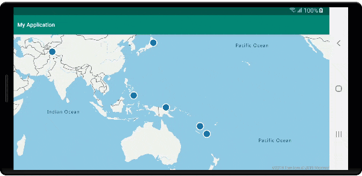

# Display feature information

Spatial data is often represented using points, lines, and polygons. This data often has metadata information associated with it. For example, a point may represent the location of a restaurant and metadata about that restaurant may be its name, address, and type of food it serves. This metadata can be added as properties of a GeoJSON `Feature`. The following code creates a simple point feature with a `title` property that has a value of "Hello World!"

::: zone pivot="programming-language-java-android"

```java
//Create a data source and add it to the map.
DataSource source = new DataSource();
map.sources.add(source);

//Create a point feature.
Feature feature = Feature.fromGeometry(Point.fromLngLat(-122.33, 47.64));

//Add a property to the feature.
feature.addStringProperty("title", "Hello World!");

//Create a point feature, pass in the metadata properties, and add it to the data source.
source.add(feature);
```

::: zone-end

::: zone pivot="programming-language-kotlin"

```kotlin
//Create a data source and add it to the map.
val source = DataSource()
map.sources.add(source)

//Create a point feature.
val feature = Feature.fromGeometry(Point.fromLngLat(-122.33, 47.64))

//Add a property to the feature.
feature.addStringProperty("title", "Hello World!")

//Create a point feature, pass in the metadata properties, and add it to the data source.
source.add(feature)
```

::: zone-end

See the [Create a data source](create-data-source-android-sdk.md) documentation for ways to create and add data to the map.

When a user interacts with a feature on the map, events can be used to react to those actions. A common scenario is to display a message made of the metadata properties of a feature the user interacted with. The `OnFeatureClick` event is the main event used to detect when the user tapped a feature on the map. There's also an `OnLongFeatureClick` event. When adding the `OnFeatureClick` event to the map, it can be limited to a single layer by passing in the ID of a layer to limit it to. If no layer ID is passed in, tapping any feature on the map, regardless of which layer it is in, would fire this event. The following code creates a symbol layer to render point data on the map, then adds an `OnFeatureClick` event and limits it to this symbol layer.

::: zone pivot="programming-language-java-android"

```java
//Create a symbol and add it to the map.
SymbolLayer layer = new SymbolLayer(source);
map.layers.add(layer);

//Add a feature click event to the map.
map.events.add((OnFeatureClick) (features) -> {
    //Retrieve the title property of the feature as a string.
    String msg = features.get(0).getStringProperty("title");

    //Do something with the message.

    //Return a boolean indicating if event should be consumed or continue bubble up.
    return false;
}, layer.getId());    //Limit this event to the symbol layer.
```

::: zone-end

::: zone pivot="programming-language-kotlin"

```kotlin
//Create a symbol and add it to the map.
val layer = SymbolLayer(source)
map.layers.add(layer)

//Add a feature click event to the map.
map.events.add(OnFeatureClick { features: List<Feature> ->
    //Retrieve the title property of the feature as a string.
    val msg = features[0].getStringProperty("title")

    //Do something with the message.

    //Return a boolean indicating if event should be consumed or continue bubble up.
    return false
}, layer.getId()) //Limit this event to the symbol layer.
```

::: zone-end

## Display a toast message

A toast message is one of the easiest ways to display information to the user and is available in all versions of Android. It doesn't support any type of user input and is only displayed for a short period of time. If you want to quickly let the user know something about what they tapped on, a toast message might be a good option. The following code shows how a toast message can be used with the `OnFeatureClick` event.

::: zone pivot="programming-language-java-android"

```java
//Add a feature click event to the map.
map.events.add((OnFeatureClick) (features) -> {
    //Retrieve the title property of the feature as a string.
    String msg = features.get(0).getStringProperty("title");

    //Display a toast message with the title information.
    Toast.makeText(this, msg, Toast.LENGTH_SHORT).show();

    //Return a boolean indicating if event should be consumed or continue bubble up.
    return false;
}, layer.getId());    //Limit this event to the symbol layer.
```

::: zone-end

::: zone pivot="programming-language-kotlin"

```kotlin
//Add a feature click event to the map.
map.events.add(OnFeatureClick { features: List<Feature> ->
    //Retrieve the title property of the feature as a string.
    val msg = features[0].getStringProperty("title")

    //Display a toast message with the title information.
    Toast.makeText(this, msg, Toast.LENGTH_SHORT).show()

    //Return a boolean indicating if event should be consumed or continue bubble up.
    return false
}, layer.getId()) //Limit this event to the symbol layer.
```

::: zone-end


In addition to toast messages, There are many other ways to present the metadata properties of a feature, such as:

- [Snackbar widget](https://developer.android.com/training/snackbar/showing.html) - `Snackbars` provide lightweight feedback about an operation. They show a brief message at the bottom of the screen on mobile and lower left on larger devices. `Snackbars` appear above all other elements on screen and only one can be displayed at a time.
- [Dialogs](https://developer.android.com/guide/topics/ui/dialogs) -  A dialog is a small window that prompts the user to make a decision or enter additional information. A dialog doesn't fill the screen and is normally used for modal events that require users to take an action before they can continue.
- Add a [Fragment](https://developer.android.com/guide/components/fragments) to the current activity.
- Navigate to another activity or view.

## Display a popup

The Azure Maps Android SDK provides a `Popup` class that makes it easy to create UI annotation elements that are anchored to a position on the map. For popups, you have to pass in a view with a relative layout into the `content` option of the popup. Here's a simple layout example that displays dark text on top of a while background.

```xml
<?xml version="1.0" encoding="utf-8"?>
<RelativeLayout xmlns:android="http://schemas.android.com/apk/res/android"
    android:layout_width="match_parent"
    android:orientation="vertical"
    android:background="#ffffff"
    android:layout_margin="8dp"
    android:padding="10dp"

    android:layout_height="match_parent">

    <TextView
        android:id="@+id/message"
        android:layout_width="wrap_content"
        android:text=""
        android:textSize="18dp"
        android:textColor="#222"
        android:layout_height="wrap_content"
        android:width="200dp"/>

</RelativeLayout>
```

Assuming the above layout is stored in a file called `popup_text.xml` in the `res -> layout` folder of an app, the following code creates a popup, adds it to the map. When a feature is clicked, the `title` property is displayed using the `popup_text.xml` layout, with the bottom center of the layout anchored to the specified position on the map.

::: zone pivot="programming-language-java-android"

```java
//Create a popup and add it to the map.
Popup popup = new Popup();
map.popups.add(popup);

map.events.add((OnFeatureClick)(feature) -> {
    //Get the first feature and it's properties.
    Feature f = feature.get(0);
    JsonObject props = f.properties();

    //Retrieve the custom layout for the popup.
    View customView = LayoutInflater.from(this).inflate(R.layout.popup_text, null);

    //Access the text view within the custom view and set the text to the title property of the feature.
    TextView tv = customView.findViewById(R.id.message);
    tv.setText(props.get("title").getAsString());

    //Get the position of the clicked feature.
    Position pos = MapMath.getPosition((Point)cluster.geometry());

    //Set the options on the popup.
    popup.setOptions(
        //Set the popups position.
        position(pos),

        //Set the anchor point of the popup content.
        anchor(AnchorType.BOTTOM),

        //Set the content of the popup.
        content(customView)

        //Optionally, hide the close button of the popup.
        //, closeButton(false)
            
        //Optionally offset the popup by a specified number of pixels.
        //pixelOffset(new Pixel(10, 10))
    );

    //Open the popup.
    popup.open();

    //Return a boolean indicating if event should be consumed or continue bubble up.
    return false;
});
```

::: zone-end

::: zone pivot="programming-language-kotlin"

```kotlin
//Create a popup and add it to the map.
val popup = Popup()
map.popups.add(popup)

map.events.add(OnFeatureClick { feature: List<Feature> ->
    //Get the first feature and it's properties.
    val f = feature[0]
    val props = f.properties()

    //Retrieve the custom layout for the popup.
    val customView: View = LayoutInflater.from(this).inflate(R.layout.popup_text, null)

    //Access the text view within the custom view and set the text to the title property of the feature.
    val tv: TextView = customView.findViewById(R.id.message)
    tv.text = props!!["title"].asString

    //Get the position of the clicked feature.
    val pos = MapMath.getPosition(f.geometry() as Point?);

    //Set the options on the popup.
    popup.setOptions( 
        //Set the popups position.
        position(pos),  

        //Set the anchor point of the popup content.
        anchor(AnchorType.BOTTOM),  

        //Set the content of the popup.
        content(customView) 

        //Optionally, hide the close button of the popup.
        //, closeButton(false)
            
        //Optionally offset the popup by a specified number of pixels.
        //pixelOffset(Pixel(10, 10))
    )

    //Open the popup.
    popup.open()

    //Return a boolean indicating if event should be consumed or continue bubble up.
    false
})
```

::: zone-end

The following screen capture shows popups appearing when features are clicked and staying anchored to their specified location on the map as it moves.



## Next steps

To add more data to your map:

> [!div class="nextstepaction"]
> [React to map events](android-map-events.md)

> [!div class="nextstepaction"]
> [Create a data source](create-data-source-android-sdk.md)

> [!div class="nextstepaction"]
> [Add a symbol layer](how-to-add-symbol-to-android-map.md)

> [!div class="nextstepaction"]
> [Add a bubble layer](map-add-bubble-layer-android.md)

> [!div class="nextstepaction"]
> [Add a line layer](android-map-add-line-layer.md)

> [!div class="nextstepaction"]
> [Add a polygon layer](how-to-add-shapes-to-android-map.md)
