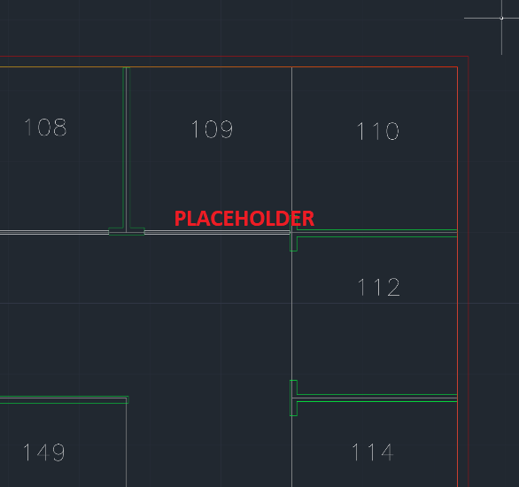
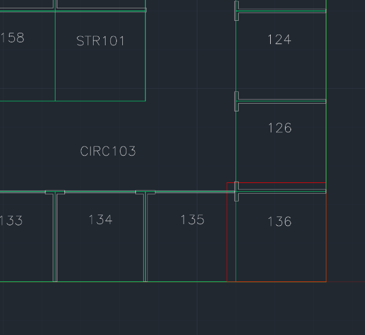

# Drawing conversion errors and warnings

The [Azure Maps Conversion service](https://docs.microsoft.com/rest/api/maps/data/conversion) lets you convert uploaded Drawing packages into map data. Drawing packages must adhere to the [Drawing package requirements](drawing-requirements.md). If one or more requirements are not met, then the Conversion service will return errors and/or warnings. This article lists the conversion error and warning codes, with recommendations on how to resolve them. It also provides some examples of drawings that can cause the Conversion service to return these codes.

## Conversion Errors

This table contains the possible errors.  The conversion will not succeed unless all conversion errors are resolved. To see more details, click on an error category or a specific error.

| Error | Location |
|:----------|:----------|
| [invalidArchiveFormat](#invalidarchiveformat) | [Package](#package-errors) |
| [invalidUserData](#invaliduserdata) | [Package](#package-errors) |
| [dwgError](#dwgerror) | [Package](#package-errors) |
| [invalidJsonFormat](#invalidjsonformat) | [Manifest](#manifest-errors) |
| [missingRequiredField](#missingrequiredfield) | [Manifest](#manifest-errors) |
| [missingManifest](#missingmanifest) | [Manifest](#manifest-errors) |
| [conflict](#conflict) | [Manifest](#manifest-errors) |
| [invalidGeoreference](#invalidgeoreference) | [Manifest](#manifest-errors) |
| [wallError](#wallerror) | [wall](#wall-errors) |
| [verticalPenetrationError](#verticalpenetrationerror) | [Vertical Penetration](#vertical-penetration-errors) |

This table contains the possible warning codes. The Conversion service will succeed if there are any conversion warnings, but it’s recommended that you review and/or resolve all warnings. A warning means part of the conversion was ignored or automatically fixed. Failing to resolve the warnings could result in errors in latter processes. To see more details, click on an error category or a specific error.

## Conversion Warnings

| Warning | Location |
|:-------|:----------|
| [geometryWarning](#geometrywarning) | [General](#general-warnings) |
| [unexpectedGeometryInLayer](#unexpectedgeometryinlayer) | [General](#general-warnings) |
| [unsupportedFeatureRepresentation](#unsupportedfeaturerepresentation) | [General](#general-warnings) |
| [automaticRepairPerformed](#automaticrepairperformed) | [General](#general-warnings) |
| [redundantAttribution](#redundantAttribution) | [Manifest](#manifest-warnings) |
| [wallOutsideLevel](#walloutsidelevel ) | [Level](#level-warnings) |
| [unitOutsideLevel](#unitoutsidelevel) | [Unit](#unit-warnings) |
| [partiallyOverlappingUnit](#partiallyoverlappingunit) | [Unit](#unit-warnings) |
| [doorOutsideLevel](#dooroutsidelevel) | [Door](#door-warnings) |
| [zoneWarning](#zonewarning ) | [Zone](#zone-warnings) |

## General Warnings

### geometryWarning

#### Description for geometryWarning

The **geometryWarning** occurs when a geometric constraint is not being met by an entity in a DWG file. As a result, the Conversion service is unable to create a map feature from that entity.

#### Example scenarios for geometryWarning

A DWG file contains geometric errors, such as PolyLine features not meeting perfectly at a point, a self-intersecting polygon, unclosed polygon, gaps between polygon borders, or overlapping polygon borders.

 

#### How to fix geometryWarning

Inspect each **geometryWarning** warning for each entity to ensure that it follows geometric constraints.

### unexpectedGeometryInLayer

#### Description for unexpectedGeometryInLayer

The **unexpectedGeometryInLayer** occurs when the Conversion service finds a geometry that is incompatible with its current layer. When the Conversion service throws an **unexpectedGeometryInLayer** warning, it will simply ignore that geometry.

#### Example scenarios for unexpectedGeometryInLayer

* A non-closed PolyLine is found in the level outline layer, unit layer, zone layer, or wall layer.

    

* A non-text entity is found in the zoneLabel layer or the unitLabel layer.

    

#### How to fix unexpectedGeometryInLayer

Inspect each **unexpectedGeometryInLayer** warning and move the geometry of unexpected type to a compatible layer. If it is not compatible with any of the other layers, it should be removed.

### unsupportedFeatureRepresentation

#### Description for unsupportedFeatureRepresentation

The **unsupportedFeatureRepresentation** warning occurs when the Conversion service finds an unsupported entity type.

#### Example scenarios for unsupportedFeatureRepresentation

* The Conversion service found a multi-line text object on a label layer.
  
    

* The Conversion service found a 3D Face in the unit layer.

    

* The Conversion service found an old-style Polyline2D entity that hasn't been converted to a regular Polyline.

    

#### How to fix unsupportedFeatureRepresentation

Ensure that your DWG files contain only the supported entity types listed under the [Drawing files requirements section in the Drawing package requirements article](drawing-requirements.md#drawing-package-requirements).

### automaticRepairPerformed

#### Description for automaticRepairPerformed

The **automaticRepairPerformed** warning occurs when invalid geometry, which would have otherwise caused an error, was automatically repaired.

#### Example scenarios for automaticRepairPerformed

* A self-intersecting polygon was repaired.

    

* A non-closed Polyline with first and last vertices closer than 1 mm were snapped to make a closed Polyline.

    

* In a layer that only supports closed Polylines, multiple non-closed Polylines were combined to create a single closed Polyline. This fix was done to avoid discarding the Polylines.

    

#### How to fix automaticRepairPerformed

To fix an `automaticRepairPerformed` warning:

1. Inspect each warning's geometry and the specific warning text.
2. Determine if the automated repair is correct.
3. If the repair is correct, continue. Otherwise, go to the design file and resolve the warning manually.

>[!TIP]
>To suppress a warning in the future, make changes to the original drawing such that the original drawing matches the repaired drawing.

## Manifest warnings

### redundantAttribution

#### Description for redundantAttribution

The **redundantAttribution** warning occurs when the Conversion service finds redundant or conflicting object properties.

#### Example scenarios for redundantAttribution

* Two or more `unitProperties` objects with the same `name`.

    

* Two or more `zoneProperties` objects with the same `name`.
    

#### How to fix redundantAttribution

To fix a **redundantAttribution* warning, remove redundant or conflicting object properties.

## Level warnings

### wallOutsideLevel

#### Description for wallOutsideLevel

The **wallOutsideLevel** warning occurs when a Wall geometry occurs outside the bounds of a level outline.

#### Example scenarios for wallOutsideLevel

* An interior wall, shown in red, is outside the yellow level boundary.

    

* An exterior wall, shown in red, is outside the yellow level boundary.

    

#### How to fix wallOutsideLeve

To fix an **wallOutsideLevel** warning, expand the level geometry to include all walls. Or, modify wall boundaries to fit inside the level boundary.

## Unit warnings

### unitOutsideLevel

#### Description for unitOutsideLevel

An **unitOutsideLevel** warning occurs when a unit geometry occurs outside the bounds of the level outline.

#### Example scenarios for unitOutsideLevel

 In the following image, a unit geometry, shown in red, exceeds the bounds of the yellow level boundary.

 

#### How to fix unitOutsideLevel

To fix an **unitOutsideLevel** warning, expand the level boundary to include all units. Or, modify unit geometry to fit inside the level boundary.

### partiallyOverlappingUnit

#### Description for partiallyOverlappingUnit

A **partiallyOverlappingUnit** occurs when the Conversion service finds a unit geometry partially overlapping on another unit geometry. The Conversion service ignores all overlapping units.

#### Example scenarios for partiallyOverlappingUnit

In the following image, the overlapping units are highlighted in red. UNIT 136 overlaps CIRC103, UNIT 126, and UNIT 135.

#### How to fix partiallyOverlappingUnit

In order to fix a **partiallyOverlappingUnit** warning, redraw each partially overlapping unit so that it doesn't overlap any other units.

## Package errors

### invalidArchiveFormat

Invalid archive format detected. Archive isn't a valid ZIP file. For example:

* When the user called the Data upload service, the data wasn't inside a zip file or the data wasn't inside a supported zip format. GZip and 7-Zip aren't supported file formats.

To resolve this error:

1. Make sure your archive file name ends in .zip.
2. Make sure you can open your zip file.

### invalidUserData

Unable to read user data object from storage. For example:

* User provided an incorrect `udid` parameter.

To resolve this error, confirm all of the following:

1. That you have provide a correct `udid` for the uploaded package.
2. That Azure Maps Creator has been enabled for the Azure Maps account you used for uploading the Drawing package.
3. That the API request to the Conversion service contains the subscription key to the Azure Maps account you used for uploading the Drawing package.

### dwgError

Error when reading one or more DWG files from the archive. For example, the DWG file is:

* Not a valid AutoCAD DWG file format drawing.
* Corrupt.
* Listed in the manifest, but it's missing from the archive.

Check your manifest.json file, and make sure to only list the DWG files in your folder. Repair your corrupt DWG file or discard it.

## Manifest errors

### invalidJsonFormat

The JSON file can't be read. For example:

* Manifest.json doesn't contain any JSON text.
* Manifest.json contains non-JSON text.
* Manifest.json has JSON syntax errors.

Use a JSON linter to detect any JSON errors and resolve them.

### missingRequiredField

Manifest is missing a required data. For example:

* Manifest is missing a "version" object.
* Manifest is missing a "dwgLayers" object.

Verify that the manifest contains all required properties. For a full list of required manifest object, see the [manifest section in the Drawing package requirements](drawing-requirements.md#manifest-file-requirements)  

### missingManifest

Manifest is missing from archive. It could be because manifest.json is:

* Misspelled.
* Missing.
* Not inside the root directory of the archive.

Ensure the archive has a file named _manifest.json_ at the root level.

### conflict

Manifest contains conflicting information. For example, it could be that more than one level is defined with the same level ordinal.

Read through your _manifest.json_ and remove conflicts.

### invalidGeoreference

Manifest georeference is invalid. For example, the user could be georeferencing:

* Out of range latitude or longitude value.
* Out of range rotation value.

Check your georeferenced values.

For GeoJSON, the coordinates order is longitude and latitude. If you don't use the correct order, you may accidentally refer to an out of range latitude or longitude value.

## Wall errors

### wallError

Error creating a wall feature. This error occurs when a wall feature doesn't overlap any units.

Redraw the wall so that it overlaps at least one unit. Otherwise, create a new unit that overlaps the wall.

## Door warnings

### doorOutsideLevel

Door geometry occurs completely outside the bounds of the level geometry. Resolve this warning by placing your door inside the level geometry.

## Zone warnings

### zoneWarning

Error creating a zone feature. For example, this warning is raised when a zone contains multiple zone labels or no zone labels.

Make sure each zone has one and only one label.

## Vertical Penetration errors

### verticalPenetrationError

Error creating a vertical penetration feature. For example:

* A vertical penetration area with no overlapping vertical penetration areas on any levels above or below it.
* There exists a level with two or more vertical penetration features on it that overlap this one.

Read about how to use a vertical penetration feature in the [Drawing package requirements](drawing-requirements.md) article.

## Next steps

After you resolve your Drawing conversion errors, try to resolve your warnings.

Once you successfully convert your uploaded Drawing package into map data, you can use your converted data to render indoor maps. Learn more by reading the following articles:

> [!div class="nextstepaction"]
> [How to use Azure Maps Drawing error visualizer](azure-maps-drawing-errors-visualizer.md)
> [!div class="nextstepaction"]
> [Creator for indoor mapping](creator-for-indoor-maps.md)