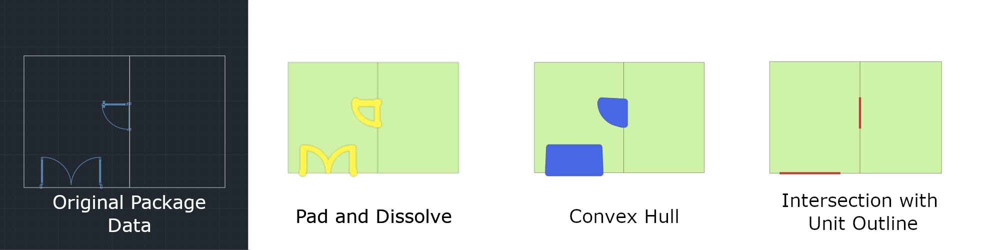

# Drawing package requirements

The [Azure Maps Conversion service](https://docs.microsoft.com/rest/api/maps/conversion) lets you convert uploaded Drawing packages into map data. This article describes the Drawing package requirements for the Conversion API. To view a sample package, you can download the sample [Drawing package](https://github.com/Azure-Samples/am-creator-indoor-data-examples).

## Prerequisites

The Drawing package includes drawings saved in DWG format, which is the native file format for Autodesk’s AutoCAD® software, a [trademark of Autodesk,Inc](https://www.autodesk.com/company/legal-notices-trademarks/trademarks/guidelines-for-use#section12).

You may choose any CAD software to produce the drawings in the Drawing package.  

The [Azure Maps Conversion service](https://docs.microsoft.com/rest/api/maps/conversion) converts the Drawing package into map data.  The Conversion service has been developed and tested using the AutoCAD DWG file format. `AC1032` is the internal format version for the DWG files. You're encouraged to select `AC1032` for the internal DWG file format version.  

Glossary of terms used within this document.

| Term  | Definition |
|:-------|:------------|
| Layer | An AutoCAD DWG layer.|
| Level | An area of a building at a set elevation. For example, the floor of a building. |
| Xref  |A file in AutoCAD DWG file format (.dwg) attached to the primary drawing as an external reference.  |
| Feature | An object that combines a geometry with additional metadata information. |
| Feature Classes | A common blueprint for features. For example, a Unit is a feature class, and an office is a feature. |

## Drawing Package structure

A Drawing package is a .zip archive that contains the following files:

* DWG files in AutoCAD DWG file format.
* A _manifest.json_ file for a single facility.

The DWG files can be organized in any way inside the folder, but the manifest file must live at the root directory of the folder. The folder must be zipped in a single archive file, with a .zip extension. The next sections detail the requirements for the DWG files, manifest file, and the content of these files.  

## DWG files requirements

A single DWG file is required for each level of the facility. The level's data must be contained in a single DWG file. Any external references (_xrefs_) must be bound to the parent drawing. Additionally, each DWG file:

* Must define the _Exterior_ and _Unit_ layers. It may optionally define the following optional layers: _Wall_, _Door_, _UnitLabel_, _Zone_, and _ZoneLabel_.
* Must not contain features from multiple levels.
* Must not contain features from multiple facilities.

The [Azure Maps Conversion service](https://docs.microsoft.com/rest/api/maps/conversion) can extract the following feature classes from a DWG file:

* Levels
* Units
* Zones
* Openings
* Walls
* Vertical Penetrations

All conversion jobs result in a minimal set of default categories: room, structure.wall, opening.door, zone, and facility. Additional categories are for each Category Name referenced by objects.  

A DWG layer must contain features of a single class. Classes must not share a layer. For example, units and walls can't share a layer.

DWG layers must also follow the following criteria:

* The origins of drawings for all DWG files must align to the same latitude and longitude.
* Each level must be in the same orientation as the other levels.
* Self-intersecting polygons will be automatically repaired, and the [Azure Maps Conversion service](https://docs.microsoft.com/rest/api/maps/conversion) will raise a warning. It's recommended to manually inspect the repaired results as they may not match the expected results.

All layer entities must be one of the following types: Line, PolyLine, Polygon, Circular Arc, Circle, Text (single line). Any other entity types will be ignored.

The table below outlines the supported entity types and supported features for each layer. If a layer contains unsupported entity types, then the [Azure Maps Conversion service](https://docs.microsoft.com/rest/api/maps/conversion) will ignore these entities.  

| Layer | Entity types | Features |
| :----- | :-------------------| :-------
| [Exterior](#exterior-layer) | Polygon, PolyLine (closed), Circle | Levels
| [Unit](#unit-layer) |  Polygon, PolyLine (closed), Circle | Vertical Penetrations, Units
| [Wall](#wall-layer)  | Polygon, PolyLine (closed), Circle | Not applicable. For more information, see the [Wall layer](#wall-layer).
| [Door](#door-layer) | Polygon, PolyLine, Line, CircularArc, Circle | Openings
| [Zone](#zone-layer) | Polygon, PolyLine (closed), Circle | Zone
| [UnitLabel](#unitlabel-layer) | Text (single line) | Not applicable. This layer can only add properties to the unit features from the Units layer. For more information, see the [UnitLabel layer](#unitlabel-layer).
| [ZoneLabel](#zonelabel-layer) | Text (single line) | Not applicable. This layer can only add properties to zone features from the ZonesLayer. For more information, see the [ZoneLabel layer](#zonelabel-layer)

The next sections detail the requirements for each layer.

### Exterior layer

The DWG file for each level must contain a layer to define that level's perimeter. This layer is referred  to as the exterior layer. For example, if a facility contains two levels, then it needs to have two DWG files, with an exterior layer for each file.

Now matter how many entity drawings are in the exterior layer, the [resulting facility dataset](tutorial-creator-indoor-maps.md#create-a-feature-stateset) will contain only **one** level feature for each DWG file. Additionally:

* Exteriors must be drawn as Polygon, PolyLine (closed), Circle.

* Exteriors may overlap, but will be dissolved into one geometry.

If the layer contains multiple overlapping PolyLines, then the PolyLines will be dissolved into a single Level feature. Alternatively, if the layer contains multiple non_overlapping PolyLines, the resulting Level feature will have a multi-polygonal representation.

An example of the Exterior layer can be seen as the OUTLINE layer in the [sample Drawing package](https://github.com/Azure-Samples/am-creator-indoor-data-examples).

### Unit layer

The DWG file for each level should define a layer containing units.  Units are navigable spaces in the building, such as offices, hallways, stairs, and elevators. The Units layer should adhere to the following requirements:

* Units must be drawn as Polygon, PolyLine (closed), Circle.
* Units must fall inside the bounds of the facility exterior perimeter.
* Units must not partially overlap.
* Units must not contain any self-intersecting geometry.

 Name a unit by creating a text object in the _unitLabel_ layer, then place the object inside the bounds of the unit. For more information, see the [UnitLabel layer](#unitlabel-layer).

An example of the Units layer can be seen as the UNITS layer in the [sample Drawing package](https://github.com/Azure-Samples/am-creator-indoor-data-examples).

### Wall layer

The DWG file for each level may contain a layer that defines the physical extents of walls, columns, and other building structure.

* Walls must be drawn as Polygon, PolyLine (closed), Circle.
* The wall layer(s) should only contain geometry that's interpreted as building structure.

An example of the Walls layer can be seen as the WALLS layer in the [sample Drawing package](https://github.com/Azure-Samples/am-creator-indoor-data-examples).

### Door layer

You may include a DWG layer containing doors. Each door must overlap the edge of a unit from the unit layer.

Doors openings in an Azure Maps dataset are represented as a single-line segment that overlaps multiple unit boundaries. The following steps are taken to convert geometry in the door layer to opening features in a dataset.



### Zone layer

The DWG file for each level may contain a zone layer that defines the physical extents of zones. A zone can be an indoor empty space or a back yard.

* Zones must be drawn as Polygon, PolyLine (closed), Circle.
* Zones may overlap.
* Zones may fall inside or outside the facility's exterior perimeter.

Name a zone by creating a text object in the _zoneLabel_ layer, and placing the text object inside the bounds of the zone. For more information, see [ZoneLabel layer](#zonelabel-layer).

An example of the Zones layer can be seen as the ZONES layer in the [sample Drawing package](https://github.com/Azure-Samples/am-creator-indoor-data-examples).

### UnitLabel layer

The DWG file for each level may contain a unit label layer. The unit label layer adds a name property to units extracted from the Unit layer. Units with a name property can have additional details specified in the manifest file.

* Unit labels must be single-line text entities.
* Unit labels must fall inside the bounds of their unit.
* Units must not contain multiple text entities in the unit labels layer.

An example of the UnitLabel layer can be seen as the UNITLABELS layer in the [sample Drawing package](https://github.com/Azure-Samples/am-creator-indoor-data-examples).

### ZoneLabel layer

The DWG file for each level may contain a zone label layer. This layer adds a name property to zones extracted from the Zone layer. Zones with a name property can have additional details specified in the manifest file.

* Zones labels must be single-line text entities.
* Zones labels must fall inside the bounds of their zone.
* Zones must not contain multiple text entities in the zone labels layer.

An example of the Zonelabel layer can be seen as the ZONELABELS layer in the [sample Drawing package](https://github.com/Azure-Samples/am-creator-indoor-data-examples).

## Manifest file requirements

The zip folder must contain a manifest file at the root level of the directory, and the file must be named **manifest.json**. It describes the DWG files to allow the [Azure Maps Conversion service](https://docs.microsoft.com/rest/api/maps/conversion) to parse their content. Only the files identified by the manifest will be ingested. Files that are in the zip folder, but aren't properly listed in the manifest, will be ignored.

The file paths, in the **buildingLevels** object of the manifest file, must be relative to the root of the zip folder. The DWG file name must exactly match the name of the facility level. For example, a DWG file for the "Basement" level would be "Basement.dwg." A DWG file for level 2 would be named as "level_2.dwg." Use an underscore, if your level name has a space.

Although there are requirements when using the manifest objects, not all objects are required. The table below shows the required and the optional objects for version 1.1 of the [Azure Maps Conversion service](https://docs.microsoft.com/rest/api/maps/conversion).

| Object | Required | Description |
| :----- | :------- | :------- |
| version | true |Manifest schema version. Currently, only version 1.1 is supported.|
| directoryInfo | true | Outlines the facility geographic and contact information. It can also be used to outline an occupant geographic and contact information. |
| buildingLevels | true | Specifies the levels of the buildings and the files containing the design of the levels. |
| georeference | true | Contains numerical geographic information for the facility drawing. |
| dwgLayers | true | Lists the names of the layers, and each layer lists the names of its own features. |
| unitProperties | false | Can be used to insert additional metadata for the unit features. |
| zoneProperties | false | Can be used to insert additional metadata for the zone features. |

The next sections detail the requirements for each object.

### directoryInfo

| Property  | type | Required | Description |
|-----------|------|----------|-------------|
| name      | string | true   |  Name of building. |
| streetAddress|    string |    false    | Address of building. |
|unit     | string    |  false    |  Unit in building. |
| locality |    string |    false |    Name of an area, neighborhood, or region. For example, "Overlake" or "Central District." Locality isn't part of the mailing address. |
| adminDivisions |    JSON Array of strings |    false     | An array containing address designations (Country, State, City) or (Country, Prefecture, City, Town). Use ISO 3166 country codes and ISO 3166-2 state/territory codes. |
| postalCode |    string    | false    | The mail sorting code. |
| hoursOfOperation |    string |     false | Adheres to the [OSM Opening Hours](https://wiki.openstreetmap.org/wiki/Key:opening_hours/specification) format. |
| phone    | string |    false |    Phone number associated with the building. Must include the country code. |
| website    | string |    false    | Website associated with the building. M begin with http or https. |
| nonPublic |    bool    | false | Flag specifying if the building is open to the public. |
| anchorLatitude | numeric |    false | Latitude of a facility anchor (pushpin). |
| anchorLongitude | numeric |    false | Longitude of a facility anchor (pushpin). |
| anchorHeightAboveSeaLevel  | numeric | false | Height of the facility's ground floor above sea level, in meters. |
| defaultLevelVerticalExtent | numeric | false | Default height (thickness) of a level of this facility to use when a level's `verticalExtent` is undefined. |

### buildingLevels

The `buildingLevels` object contains a JSON array of buildings levels.

| Property  | Type | Required | Description |
|-----------|------|----------|-------------|
|levelName    |string    |true |    Descriptive level name. For example: Floor 1, Lobby, Blue Parking, Basement, and so on.|
|ordinal | integer |    true | Ordinal is used to determine the vertical order of levels. Every facility must have a level with ordinal 0. |
|heightAboveFacilityAnchor | numeric | false |    Level height above the anchor in meters. |
| verticalExtent | numeric | false | Floor to ceiling height (thickness) of the level in meters. |
|filename |    string |    true |    File system path of the CAD drawing for a building level. It must be relative to the root of the building's zip file. |

### georeference

| Property  | Type | Required | Description |
|-----------|------|----------|-------------|
|lat    | numeric |    true |    Decimal representation of degrees latitude at the facility drawing's origin. The origin coordinates must be in WGS84 Web Mercator (`EPSG:3857`).|
|lon    |numeric|    true|    Decimal representation of degrees longitude at the facility drawing's origin. The origin coordinates must be in WGS84 Web Mercator (`EPSG:3857`). |
|angle|    numeric|    true|   The clockwise angle, in degrees, between true north and the drawing’s vertical (Y) axis.   |

### dwgLayers

| Property  | Type | Required | Description |
|-----------|------|----------|-------------|
|exterior    |Array of strings|    true|    Names of layer(s) that define the exterior building profile.|
|unit|    Array of strings|    true|    Names of layer(s) that define units.|
|wall|    Array of strings    |false|    Names of layer(s) that define walls.|
|door    |Array of strings|    false   | Names of layer(s) that define doors.|
|unitLabel    |Array of strings|    false    |Names of layer(s) that define names of units.|
|zone | Array of strings    | false    | Names of layer(s) that define zones.|
|zoneLabel | Array of strings |     false |    Names of layer(s) that define names of zones.|

### unitProperties

The `unitProperties` object contains a JSON array of unit properties.

| Property  | Type | Required | Description |
|-----------|------|----------|-------------|
|unitName    |string    |true    |Name of unit to associate with this `unitProperty` record. This record is only valid when a label matching `unitName` is found in the `unitLabel` layer(s). |
|categoryName|    string|    false    |Category Name. For a complete list of categories, refer to [categories](https://aka.ms/pa-indoor-spacecategories). |
|navigableBy| Array of strings |    false    |Indicates the types of navigating agents that can traverse the unit. For example, "pedestrian". This property will inform the wayfinding capabilities.  The permitted values are `pedestrian`, `wheelchair`, `machine`, `bicycle`, `automobile`, `hiredAuto`, `bus`, `railcar`, `emergency`, `ferry`, `boat`, and `disallowed`.|
|routeThroughBehavior|    string|    false    |The route through behavior for the unit. The permitted values are `disallowed`, `allowed`, and `preferred`. Default value is `allowed`.|
|occupants    |Array of directoryInfo objects |false    |List of occupants for the unit. |
|nameAlt|    string|    false|    Alternate Name of the unit. |
|nameSubtitle|    string    |false|    Subtitle of the unit. |
|addressRoomNumber|    string|    false|    Room/Unit/Apartment/Suite number of the unit.|
|verticalPenetrationCategory|    string|    false| When this property is defined, the resulting feature will be a Vertical Penetration (VRT) rather than a unit. VRTs can be used to navigate to other VRT features in the levels above or below it. Vertical Penetration is a [Category](https://aka.ms/pa-indoor-spacecategories) Name. If this property is defined, categoryName property is overridden with verticalPenetrationCategory. |
|verticalPenetrationDirection|    string|    false    |If `verticalPenetrationCategory` is defined, optionally define the valid direction of travel. The permitted values are `lowToHigh`, `highToLow`, `both`, and `closed`. Default value is `both`.|
| nonPublic | bool | false | Indicates if the unit is open to the public. |
| isRoutable | bool | false | When set to `false`, unit can't be navigated to, or through. Default value is `true`. |
| isOpenArea | bool | false | Allows the navigating agent to enter the unit without the need for an opening attached to the unit. By default, this value is set to `true` for units with no openings; `false` for units with openings.  Manually setting `isOpenArea` to `false` on a unit with no openings results in a warning. This is because the resulting unit won't be reachable by a navigating agent.|

### The zoneProperties object

The `zoneProperties` object contains a JSON array of zone properties.

| Property  | Type | Required | Description |
|-----------|------|----------|-------------|
|zoneName        |string    |true    |Name of zone to associate with `zoneProperty` record. This record is only valid when a label matching `zoneName` is found in the `zoneLabel` layer of the zone.  |
|categoryName|    string|    false    |Category Name. For a complete list of categories, refer to [categories](https://aka.ms/pa-indoor-spacecategories). |
|zoneNameAlt|    string|    false    |Alternate Name of the zone.  |
|zoneNameSubtitle|    string |    false    |Subtitle of the zone. |
|zoneSetId|    string |    false    | Set ID to establish relationship between multiple zones so that they may be queried or selected as a group. For example, zones that span multiple levels. |

### Sample Drawing package manifest

Below is a sample manifest file for the sample Drawing package. To download the entire package, click [sample Drawing package](https://github.com/Azure-Samples/am-creator-indoor-data-examples).

#### Manifest File

```JSON
{
    "version": "1.1", 
    "directoryInfo": { 
        "name": "Contoso Building", 
        "streetAddresss": "Contoso Way", 
        "unit": "1", 
        "locality": "Contoso eastside", 
        "postalCode": "98052", 
        "adminDivisions": [ 
            "Contoso city", 
            "Contoso state", 
            "Contoso country" 
        ], 
        "hoursOfOperation": "Mo-Fr 08:00-17:00 open", 
        "phone": "1 (425) 555-1234", 
        "website": "www.contoso.com", 
        "nonPublic": false, 
        "anchorLatitude": 47.636152, 
        "anchorLongitude": -122.132600, 
        "anchorHeightAboveSeaLevel": 1000, 
        "defaultLevelVerticalExtent": 3  
    }, 
    "buildingLevels": { 
        "levels": [ 
            { 
                "levelName": "Basement", 
                "ordinal": -1, 
                "filename": "./Basement.dwg" 
            }, { 
                "levelName": "Ground", 
                "ordinal": 0, 
                "verticalExtent": 5, 
                "filename": "./Ground.dwg" 
            }, { 
                "levelName": "Level 2", 
                "ordinal": 1, 
                "heightAboveFacilityAnchor": 3.5, 
                "filename": "./Level_2.dwg" 
            } 
        ] 
    }, 
    "georeference": { 
        "lat": 47.636152, 
        "lon": -122.132600, 
        "angle": 0 
    }, 
    "dwgLayers": { 
        "exterior": [ 
            "OUTLINE", "WINDOWS" 
        ], 
        "unit": [ 
            "UNITS" 
        ], 
        "wall": [ 
            "WALLS" 
        ], 
        "door": [ 
            "DOORS" 
        ], 
        "unitLabel": [ 
            "UNITLABELS" 
        ], 
        "zone": [ 
            "ZONES" 
        ], 
        "zoneLabel": [ 
            "ZONELABELS" 
        ] 
    }, 
    "unitProperties": [ 
        { 
            "unitName": "B01", 
            "categoryName": "room.office", 
            "navigableBy": ["pedestrian", "wheelchair", "machine"], 
            "routeThroughBehavior": "disallowed", 
            "occupants": [ 
                { 
                    "name": "Joe's Office", 
                    "phone": "1 (425) 555-1234" 
                } 
            ], 
            "nameAlt": "Basement01", 
            "nameSubtitle": "01", 
            "addressRoomNumber": "B01", 
            "nonWheelchairAccessible": false, 
            "nonPublic": true, 
            "isRoutable": true, 
            "isOpenArea": true 
        }, 
        { 
            "unitName": "B02" 
        }, 
        { 
            "unitName": "B05", 
            "categoryName": "room.office" 
        }, 
        { 
            "unitName": "STRB01", 
            "verticalPenetrationCategory": "verticalPenetration.stairs", 
            "verticalPenetrationDirection": "both" 
        }, 
        { 
            "unitName": "ELVB01", 
            "verticalPenetrationCategory": "verticalPenetration.elevator", 
            "verticalPenetrationDirection": "high_to_low" 
        } 
    ], 
    "zoneProperties": 
    [ 
        { 
            "zoneName": "WifiB01", 
            "categoryName": "Zone", 
            "zoneNameAlt": "MyZone", 
            "zoneNameSubtitle": "Wifi", 
            "zoneSetId": "1234" 
        }, 
        { 
            "zoneName": "Wifi101",
            "categoryName": "Zone",
            "zoneNameAlt": "MyZone",
            "zoneNameSubtitle": "Wifi",
            "zoneSetId": "1234"
        }
    ]
}
```

## Next steps

Once your Drawing package meets the requirements, you may use the [Azure Maps Conversion service](https://docs.microsoft.com/rest/api/maps/conversion) to convert the package to a map dataset. Then, you can use the dataset to generate an indoor map using the Indoor Maps module. Learn more about using the Indoor Maps module by reading the following articles:

> [!div class="nextstepaction"]
>[Creator for indoor maps](creator-indoor-maps.md)

> [!div class="nextstepaction"]
> [Tutorial: Creating a Creator indoor map](tutorial-creator-indoor-maps.md)

> [!div class="nextstepaction"]
> [Indoor Maps dynamic styling](indoor-map-dynamic-styling.md)
