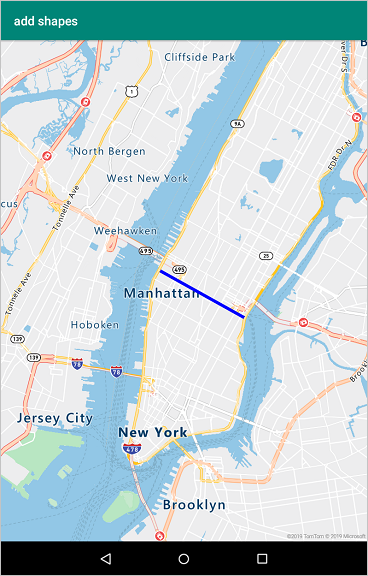
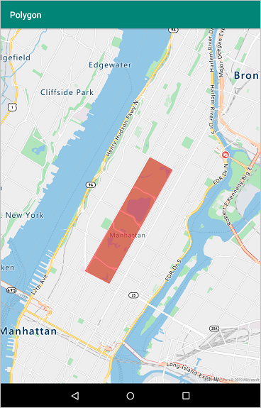

# Add a shape to a map using Azure Maps Android SDK

This article shows you how to render shapes on a map using Azure Maps Android SDK.

## Prerequisites

To complete the process in this article, you need to install [Azure Maps Android SDK](https://docs.microsoft.com/azure/azure-maps/how-to-use-android-map-control-library) to load a map.


## Add a line to the map

You can add a line to the map using a **Line Layer**, follow the steps below to add a line on the map.

1. Edit **res > layout > activity_main.xml** so it looks like the one below:

    ```XML
    <?xml version="1.0" encoding="utf-8"?>
    <FrameLayout
        xmlns:android="http://schemas.android.com/apk/res/android"
        xmlns:app="http://schemas.android.com/apk/res-auto"
        android:layout_width="match_parent"
        android:layout_height="match_parent"
        >
    
        <com.microsoft.azure.maps.mapcontrol.MapControl
            android:id="@+id/mapcontrol"
            android:layout_width="match_parent"
            android:layout_height="match_parent"
            app:mapcontrol_centerLat="40.743270"
            app:mapcontrol_centerLng="-74.004420"
            app:mapcontrol_zoom="12"
            />
    
    </FrameLayout>
    ```

2. Copy the following code snippet below into the **onCreate()** method of your `MainActivity.java` class.

    ```Java
    mapControl.onReady(map -> {

        //Create a data source and add it to the map.
        DataSource dataSource = new DataSource();
        map.sources.add(dataSource);
    
        //Create a list of points.
        List<Point> points = Arrays.asList(
            Point.fromLngLat(-73.972340, 40.743270),
            Point.fromLngLat(-74.004420, 40.756800));
    
        //Create a LineString feature and add it to the data source.
        dataSource.add(LineString.fromLngLats(points));
    
        //Create a line layer and add it to the map.
        map.layers.add(new LineLayer(dataSource,
            strokeColor("blue"),
            strokeWidth(5f)));
    });

    ```
    
    The code snippet above first obtains an Azure Maps map control instance using the **onReady()** callback method. It then creates a data source object using the **DataSource** class and adds it to the map. Then it creates a list of **Point** objects. A **LineString** is created from the list of points and added to the data source. A **Line Layer** renders line objects wrapped in a data source on the map. A line layer is then created and the data source is added to it.

    After adding the code snippet above, your `MainActivity.java` should look like the one below:
    
    ```Java
    package com.example.myapplication;
    import android.app.Activity;
    import android.os.Bundle;
    import com.mapbox.geojson.LineString;
    import com.mapbox.geojson.Point;
    import android.support.v7.app.AppCompatActivity;
    import com.microsoft.azure.maps.mapcontrol.layer.LineLayer;
    import com.microsoft.azure.maps.mapcontrol.options.LineLayerOptions;
    import com.microsoft.azure.maps.mapcontrol.source.DataSource;
    import java.util.Arrays;
    import java.util.List;
    import com.microsoft.azure.maps.mapcontrol.AzureMaps;
    import com.microsoft.azure.maps.mapcontrol.MapControl;
    import static com.microsoft.azure.maps.mapcontrol.options.LineLayerOptions.strokeColor;
    import static com.microsoft.azure.maps.mapcontrol.options.LineLayerOptions.strokeWidth;
    
    
    public class MainActivity extends AppCompatActivity {
    
        static{
            AzureMaps.setSubscriptionKey("<Your Azure Maps subscription key>");
        }
    
        MapControl mapControl;
        @Override
        protected void onCreate(Bundle savedInstanceState) {
    
            super.onCreate(savedInstanceState);
            setContentView(R.layout.activity_main);
    
            mapControl = findViewById(R.id.mapcontrol);
    
            mapControl.onCreate(savedInstanceState);
    
            mapControl.onReady(map -> {

                //Create a data source and add it to the map.
                DataSource dataSource = new DataSource();
                map.sources.add(dataSource);
            
                //Create a list of points.
                List<Point> points = Arrays.asList(
                    Point.fromLngLat(-73.972340, 40.743270),
                    Point.fromLngLat(-74.004420, 40.756800));
            
                //Create a LineString feature and add it to the data source.
                dataSource.add(LineString.fromLngLats(points));
            
                //Create a line layer and add it to the map.
                map.layers.add(new LineLayer(dataSource,
                    strokeColor("blue"),
                    strokeWidth(5f)));
            });
    
        }
    
        @Override
        public void onResume() {
            super.onResume();
            mapControl.onResume();
        }
    
        @Override
        public void onPause() {
            super.onPause();
            mapControl.onPause();
        }
    
        @Override
        public void onStop() {
            super.onStop();
            mapControl.onStop();
        }
    
        @Override
        public void onLowMemory() {
            super.onLowMemory();
            mapControl.onLowMemory();
        }
    
        @Override
        protected void onDestroy() {
            super.onDestroy();
            mapControl.onDestroy();
        }
    
        @Override
        protected void onSaveInstanceState(Bundle outState) {
            super.onSaveInstanceState(outState);
            mapControl.onSaveInstanceState(outState);
        }
    
    }
    ```

If you run your application now, you should see a line on the map as seen below:

<center>

</center>


## Add a polygon to the map

The **Polygon Layer** enables you to render the area of the polygon to the map. Follow the steps below to add a polygon on the map.

1. Edit **res > layout > activity_main.xml** so it looks like the one below:

    ```XML
    <?xml version="1.0" encoding="utf-8"?>
    <FrameLayout
        xmlns:android="http://schemas.android.com/apk/res/android"
        xmlns:app="http://schemas.android.com/apk/res-auto"
        android:layout_width="match_parent"
        android:layout_height="match_parent"
        >
    
        <com.microsoft.azure.maps.mapcontrol.MapControl
            android:id="@+id/mapcontrol"
            android:layout_width="match_parent"
            android:layout_height="match_parent"
            app:mapcontrol_centerLat="40.78"
            app:mapcontrol_centerLng="-73.97"
            app:mapcontrol_zoom="12"
            />
    
    </FrameLayout>
    ```

2. Copy the following code snippet into the **onCreate()** method of your `MainActivity.java` class.

    ```Java
    mapControl.onReady(map -> {
        //Create a data source and add it to the map.
        DataSource dataSource = new DataSource();
        map.sources.add(dataSource);
    
        //Create a list of point arrays to create polygon rings.
        List<List<Point>> rings = Arrays.asList(Arrays.asList(
            Point.fromLngLat(-73.98235, 40.76799),
            Point.fromLngLat(-73.95785, 40.80044),
            Point.fromLngLat(-73.94928, 40.7968),
            Point.fromLngLat(-73.97317, 40.76437),
            Point.fromLngLat(-73.98235, 40.76799)));
    
        //Create a Polygon feature and add it to the data source.
        dataSource.add(Feature.fromGeometry(Polygon.fromLngLats(rings)));
    
        //Add a polygon layer for rendering the polygon area.
        map.layers.add(new PolygonLayer(dataSource,
            fillColor("red")));
    
        //Add a line layer for rendering the polygon outline.
        map.layers.add(new LineLayer(dataSource,
            strokeColor("blue"),
            strokeWidth(2f)));
    });
    ```

    The code snippet above first obtains an Azure Maps map control instance using the **onReady()** callback method. It then creates a data source object using the **DataSource** class and adds it to the map. A **Polygon** object is then created from a list of **Point**  objects and is added to the data source. A **Polygon Layer** renders data wrapped in the data source on the map. It then creates a polygon layer to render the polygon area and adds the data source to it. A **Line Layer** renders line objects wrapped in a data source. The last part of the code snippet creates a line layer to render the outline of the polygon and adds the data source to it.

    After adding the code snippet above, your `MainActivity.java` should look like the one below:

    ```Java
    package com.example.myapplication;
    
    import android.app.Activity;
    import android.os.Bundle;
    import java.util.Arrays;
    import android.util.Log;
    import java.util.Collections;
    import android.support.v7.app.AppCompatActivity;
    import com.mapbox.geojson.Point;
    import com.mapbox.geojson.Polygon;
    import com.mapbox.geojson.Feature;
    import com.microsoft.azure.maps.mapcontrol.layer.LineLayer;
    import com.microsoft.azure.maps.mapcontrol.options.LineLayerOptions;
    import com.microsoft.azure.maps.mapcontrol.layer.PolygonLayer;
    import com.microsoft.azure.maps.mapcontrol.source.DataSource;
    import com.microsoft.azure.maps.mapcontrol.AzureMaps;
    import com.microsoft.azure.maps.mapcontrol.MapControl;
    import static com.microsoft.azure.maps.mapcontrol.options.LineLayerOptions.strokeColor;
    import static com.microsoft.azure.maps.mapcontrol.options.LineLayerOptions.strokeWidth;
    import static com.microsoft.azure.maps.mapcontrol.options.PolygonLayerOptions.fillColor;
    
    public class MainActivity extends AppCompatActivity {
    
        static{
            AzureMaps.setSubscriptionKey("<Your Azure Maps subscription key>");
        }
    
        MapControl mapControl;
        @Override
        protected void onCreate(Bundle savedInstanceState) {
    
            super.onCreate(savedInstanceState);
            setContentView(R.layout.activity_main);
    
            mapControl = findViewById(R.id.mapcontrol);
    
            mapControl.onCreate(savedInstanceState);
    
            mapControl.onReady(map -> {
                //Create a data source and add it to the map.
                DataSource dataSource = new DataSource();
                map.sources.add(dataSource);
            
                //Create a list of point arrays to create polygon rings.
                List<List<Point>> rings = Arrays.asList(Arrays.asList(
                    Point.fromLngLat(-73.98235, 40.76799),
                    Point.fromLngLat(-73.95785, 40.80044),
                    Point.fromLngLat(-73.94928, 40.7968),
                    Point.fromLngLat(-73.97317, 40.76437),
                    Point.fromLngLat(-73.98235, 40.76799)));
            
                //Create a Polygon feature and add it to the data source.
                dataSource.add(Feature.fromGeometry(Polygon.fromLngLats(rings)));
            
                //Add a polygon layer for rendering the polygon area.
                map.layers.add(new PolygonLayer(dataSource,
                    fillColor("red")));
            
                //Add a line layer for rendering the polygon outline.
                map.layers.add(new LineLayer(dataSource,
                    strokeColor("blue"),
                    strokeWidth(2f)));
            });
    
        }
    
        @Override
        public void onResume() {
            super.onResume();
            mapControl.onResume();
        }
    
        @Override
        public void onPause() {
            super.onPause();
            mapControl.onPause();
        }
    
        @Override
        public void onStop() {
            super.onStop();
            mapControl.onStop();
        }
    
        @Override
        public void onLowMemory() {
            super.onLowMemory();
            mapControl.onLowMemory();
        }
    
        @Override
        protected void onDestroy() {
            super.onDestroy();
            mapControl.onDestroy();
        }
    
        @Override
        protected void onSaveInstanceState(Bundle outState) {
            super.onSaveInstanceState(outState);
            mapControl.onSaveInstanceState(outState);
        }
    
    }
    ```

If you run your application now, you should see a polygon on the map as seen below:

<center>

</center>


## Next steps

See the following article to learn more about ways to set map styles

> [!div class="nextstepaction"]
> [Change map styles in Android maps](https://docs.microsoft.com/azure/azure-maps/set-android-map-styles)