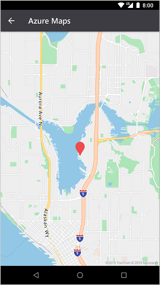
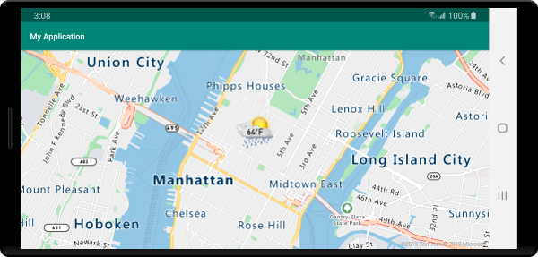

# Add a symbol layer (Android SDK)

This article shows you how to render point data from a data source as a symbol layer on a map using the Azure Maps Android SDK. Symbol layers render points as an image and text on the map.

> [!TIP]
> Symbol layers by default will render the coordinates of all geometries in a data source. To limit the layer so that it only renders point geometry features, set the `filter` option of the layer to `eq(geometryType(), "Point")`. If you want to include MultiPoint features as well, set the `filter` option of the layer to `any(eq(geometryType(), "Point"), eq(geometryType(), "MultiPoint"))`.

## Prerequisites

Be sure to complete the steps in the [Quickstart: Create an Android app] document. Code blocks in this article can be inserted into the maps `onReady` event handler.

## Add a symbol layer

Before you can add a symbol layer to the map, you need to take a couple of steps. First, create a data source, and add it to the map. Create a symbol layer. Then, pass in the data source to the symbol layer, to retrieve the data from the data source. Finally, add data into the data source, so that there's something to be rendered.

The following code demonstrates what should be added to the map after it has loaded. This sample renders a single point on the map using a symbol layer.

::: zone pivot="programming-language-java-android"

```java
//Create a data source and add it to the map.
DataSource source = new DataSource();
map.sources.add(source);

//Create a point and add it to the data source.
source.add(Point.fromLngLat(0, 0));

//Create a symbol layer to render icons and/or text at points on the map.
SymbolLayer layer = new SymbolLayer(source);

//Add the layer to the map.
map.layers.add(layer);
```

::: zone-end

::: zone pivot="programming-language-kotlin"

```kotlin
//Create a data source and add it to the map.
val source = DataSource()
map.sources.add(source)

//Create a point and add it to the data source.
source.add(Point.fromLngLat(0, 0))

//Create a symbol layer to render icons and/or text at points on the map.
val layer = SymbolLayer(source)

//Add the layer to the map.
map.layers.add(layer)
```

::: zone-end

There are three different types of point data that can be added to the map:

- GeoJSON Point geometry - This object only contains a coordinate of a point and nothing else. The `Point.fromLngLat` static method can be used to easily create these objects.
- GeoJSON MultiPoint geometry - This object contains the coordinates of multiple points and nothing else. Pass an array of points into the `MultiPoint` class to create these objects.
- GeoJSON Feature - This object consists of any GeoJSON geometry and a set of properties that contain metadata associated to the geometry.

For more information, see the [Create a data source] document on creating and adding data to the map.

The following code sample creates a GeoJSON Point geometry and passes it into the GeoJSON Feature and has a `title` value added to its properties. The `title` property is displayed as text above the symbol icon on the map.

::: zone pivot="programming-language-java-android"

```java
//Create a data source and add it to the map.
DataSource source = new DataSource();
map.sources.add(source);

//Create a point feature.
Feature feature = Feature.fromGeometry(Point.fromLngLat(0, 0));

//Add a property to the feature.
feature.addStringProperty("title", "Hello World!");

//Add the feature to the data source.
source.add(feature);

//Create a symbol layer to render icons and/or text at points on the map.
SymbolLayer layer = new SymbolLayer(source, 
    //Get the title property of the feature and display it on the map.
    textField(get("title"))
);

//Add the layer to the map.
map.layers.add(layer);
```

::: zone-end

::: zone pivot="programming-language-kotlin"

```kotlin
//Create a data source and add it to the map.
val source = DataSource()
map.sources.add(source)

//Create a point feature.
val feature = Feature.fromGeometry(Point.fromLngLat(0, 0))

//Add a property to the feature.
feature.addStringProperty("title", "Hello World!")

//Add the feature to the data source.
source.add(feature)

//Create a symbol layer to render icons and/or text at points on the map.
val layer = SymbolLayer(
    source,  //Get the title property of the feature and display it on the map.
    textField(get("title"))
)

//Add the layer to the map.
map.layers.add(layer)
```

::: zone-end

The following screenshot shows the above code rendering a point feature using an icon and text label with a symbol layer.



> [!TIP]
> By default, symbol layers optimize the rendering of symbols by hiding symbols that overlap. As you zoom in, the hidden symbols become visible. To disable this feature and render all symbols at all times, set the `iconAllowOverlap` and `textAllowOverlap` options to `true`.

## Add a custom icon to a symbol layer

Symbol layers are rendered using WebGL. As such all resources, such as icon images, must be loaded into the WebGL context. This sample shows how to add a custom icon to the map resources. This icon is then used to render point data with a custom symbol on the map. The `textField` property of the symbol layer requires an expression to be specified. In this case, we want to render the temperature property. Since temperature is a number, it needs to be converted to a string. Additionally we want to append "°F" to it. An expression can be used to do this concatenation; `concat(Expression.toString(get("temperature")), literal("°F"))`.

::: zone pivot="programming-language-java-android"

```java
//Load a custom icon image into the image sprite of the map.
map.images.add("my-custom-icon", R.drawable.showers);

//Create a data source and add it to the map.
DataSource source = new DataSource();
map.sources.add(source);

//Create a point feature.
Feature feature = Feature.fromGeometry(Point.fromLngLat(-73.985708, 40.75773));

//Add a property to the feature.
feature.addNumberProperty("temperature", 64);

//Add the feature to the data source.
source.add(feature);

//Create a symbol layer to render icons and/or text at points on the map.
SymbolLayer layer = new SymbolLayer(source,
    iconImage("my-custom-icon"),
    iconSize(0.5f),

    //Get the title property of the feature and display it on the map.
    textField(concat(Expression.toString(get("temperature")), literal("°F"))),
    textOffset(new Float[]{0f, -1.5f})
);
```

::: zone-end

::: zone pivot="programming-language-kotlin"

```kotlin
//Load a custom icon image into the image sprite of the map.
map.images.add("my-custom-icon", R.drawable.showers)

//Create a data source and add it to the map.
val source = DataSource()
map.sources.add(source)

//Create a point feature.
val feature = Feature.fromGeometry(Point.fromLngLat(-73.985708, 40.75773))

//Add a property to the feature.
feature.addNumberProperty("temperature", 64)

//Add the feature to the data source.
source.add(feature)

//Create a symbol layer to render icons and/or text at points on the map.
val layer = SymbolLayer(
    source,
    iconImage("my-custom-icon"),
    iconSize(0.5f),  //Get the title property of the feature and display it on the map.
    textField(concat(Expression.toString(get("temperature")), literal("°F"))),
    textOffset(arrayOf(0f, -1.5f))
)
```

::: zone-end

For this sample, the following image is loaded into the drawable folder of the app.

| |
|:-----------------------------------------------------------------------:|
| showers.png                                                  |

The following screenshot shows the above code rendering a point feature using a custom icon and formatted text label with a symbol layer.



> [!TIP]
> When you want to render only text with a symbol layer, you can hide the icon by setting the `iconImage` property of the icon options to `"none"`.

## Modify symbol colors

The Azure Maps Android SDK comes with a set of predefined color variations of the default marker icon. For example, `marker-red` can be passed into the `iconImage` option of a symbol layer to render a red version of the marker icon in that layer.

::: zone pivot="programming-language-java-android"

```java
SymbolLayer layer = new SymbolLayer(source,
    iconImage("marker-red")
);
```

::: zone-end

::: zone pivot="programming-language-kotlin"

```kotlin
val layer = SymbolLayer(source,
    iconImage("marker-red")
)
```

::: zone-end

The table below lists all of the built-in icon image names available. These markers pull their colors from color resources that can be overridden. However, overriding the color of one of these markers would apply to all layers that use that icon image.

| Icon image name | Color resource name |
|-----------------|---------------------|
| `marker-default` | `azure_maps_marker_default` |
| `marker-black` | `azure_maps_marker_black` |
| `marker-blue` | `azure_maps_marker_blue` |
| `marker-darkblue` | `azure_maps_marker_darkblue` |
| `marker-red` | `azure_maps_marker_red` |
| `marker-yellow` | `azure_maps_marker_yellow` |

You can also override the border color of all markers using the `azure_maps_marker_border` color resource name. The colors of these markers can be overridden  by adding a color with the same name in the `colors.xml` file of your app. For example, the following `colors.xml` file would make the default marker color bright green.

```xml
<?xml version="1.0" encoding="utf-8"?>
<resources>
    <color name="azure_maps_marker_default">#00FF00</color>
</resources>
```

The following code is a modified version of the default marker vector XML that you can modify to create custom versions of the default marker. The modified version can be added to the `drawable` folder of your app and added to the maps image sprite using `map.images.add`, then used with a symbol layer.

```xml
<vector xmlns:android="http://schemas.android.com/apk/res/android"
    android:width="24.5dp"
    android:height="36.5dp"
    android:viewportWidth="24.5"
    android:viewportHeight="36.5">
    <path
        android:pathData="M12.25,0.25a12.2543,12.2543 0,0 0,-12 12.4937c0,6.4436 6.4879,12.1093 11.059,22.5641 0.5493,1.2563 1.3327,1.2563 1.882,0C17.7621,24.8529 24.25,19.1857 24.25,12.7437A12.2543,12.2543 0,0 0,12.25 0.25Z"
        android:strokeWidth="0.5"
        android:fillColor="@color/azure_maps_marker_default"
        android:strokeColor="@color/azure_maps_marker_border"/>
</vector>
```

## Next steps

See the following articles for more code samples to add to your maps:

> [!div class="nextstepaction"]
> [Create a data source]

> [!div class="nextstepaction"]
> [Cluster point data]

> [!div class="nextstepaction"]
> [Add a bubble layer]

> [!div class="nextstepaction"]
> [Use data-driven style expressions]

> [!div class="nextstepaction"]
> [Display feature information]

[Add a bubble layer]: map-add-bubble-layer-android.md
[Cluster point data]: clustering-point-data-android-sdk.md
[Create a data source]: create-data-source-android-sdk.md
[Display feature information]: display-feature-information-android.md
[Quickstart: Create an Android app]: quick-android-map.md
[Use data-driven style expressions]: data-driven-style-expressions-android-sdk.md
