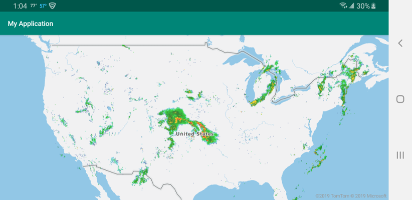

# Add a tile layer to a map using the Azure Maps Android SDK

This article shows you how to render a tile layer on a map using the Azure Maps Android SDK. Tile layers allow you to superimpose images on top of Azure Maps base map tiles. More information on Azure Maps tiling system can be found in the [Zoom levels and tile grid](zoom-levels-and-tile-grid.md) documentation.

A Tile layer loads in tiles from a server. These images can be pre-rendered and stored like any other image on a server, using a naming convention that the tile layer understands. Or, these images can be rendered with a dynamic service that generates the images near real time. There are three different tile service naming conventions supported by Azure Maps TileLayer class:

* X, Y, Zoom notation - Based on the zoom level, x is the column and y is the row position of the tile in the tile grid.
* Quadkey notation - Combination x, y, zoom information into a single string value that is a unique identifier for a tile.
* Bounding Box - Bounding box coordinates can be used to specify an image in the format `{west},{south},{east},{north}` which is commonly used by [Web Mapping Services (WMS)](https://www.opengeospatial.org/standards/wms).

> [!TIP]
> A TileLayer is a great way to visualize large data sets on the map. Not only can a tile layer be generated from an image, but vector data can also be rendered as a tile layer too. By rendering vector data as a tile layer, the map control only needs to load the tiles which can be much smaller in file size than the vector data they represent. This technique is used by many who need to render millions of rows of data on the map.

The tile URL passed into a Tile layer must be an http/https URL to a TileJSON resource or a tile URL template that uses the following parameters: 

* `{x}` - X position of the tile. Also needs `{y}` and `{z}`.
* `{y}` - Y position of the tile. Also needs `{x}` and `{z}`.
* `{z}` - Zoom level of the tile. Also needs `{x}` and `{y}`.
* `{quadkey}` - Tile quadkey identifier based on the Bing Maps tile system naming convention.
* `{bbox-epsg-3857}` - A bounding box string with the format `{west},{south},{east},{north}` in the EPSG 3857 Spatial Reference System.
* `{subdomain}` - A placeholder for the subdomain values, if the subdomain value is specified.

## Prerequisites

To complete the process in this article, you need to install [Azure Maps Android SDK](https://docs.microsoft.com/azure/azure-maps/how-to-use-android-map-control-library) to load a map.


## Add a tile layer to the map

 This sample shows how to create a tile layer that points to a set of tiles. These tiles use the "x, y, zoom" tiling system. The source of this tile layer is a weather radar overlay from the [Iowa Environmental Mesonet of Iowa State University](https://mesonet.agron.iastate.edu/ogc/). 

You can add a tile layer to the map by following the steps below.

1. Edit **res > layout > activity_main.xml** so it looks like the one below:

    ```XML
    <?xml version="1.0" encoding="utf-8"?>
    <FrameLayout
        xmlns:android="http://schemas.android.com/apk/res/android"
        xmlns:app="http://schemas.android.com/apk/res-auto"
        android:layout_width="match_parent"
        android:layout_height="match_parent"
        >
    
        <com.microsoft.azure.maps.mapcontrol.MapControl
            android:id="@+id/mapcontrol"
            android:layout_width="match_parent"
            android:layout_height="match_parent"
            app:mapcontrol_centerLat="40.75"
            app:mapcontrol_centerLng="-99.47"
            app:mapcontrol_zoom="3"
            />
    
    </FrameLayout>
    ```

2. Copy the following code snippet below into the **onCreate()** method of your `MainActivity.java` class.

    ```Java
    mapControl.onReady(map -> {
        //Add a tile layer to the map, below the map labels.
        map.layers.add(new TileLayer(
            tileUrl("https://mesonet.agron.iastate.edu/cache/tile.py/1.0.0/nexrad-n0q-900913/{z}/{x}/{y}.png"),
            opacity(0.8f),
            tileSize(256)
        ), "labels");
    });
    ```
    
    The code snippet above first obtains an Azure Maps map control instance using the **onReady()** callback method. It then creates a `TileLayer` object and passes a formatted **xyz** tile URL into the `tileUrl` option. The opacity of the layer is set to `0.8` and since the tiles from tile service being used are 256 pixel tiles, this information is passed into the `tileSize` option. The tile layer is then passed into the maps layer manager.

    After adding the code snippet above, your `MainActivity.java` should look like the one below:
    
    ```Java
    package com.example.myapplication;

    import android.app.Activity;
    import android.os.Bundle;
    import android.support.v7.app.AppCompatActivity;
    import com.microsoft.azure.maps.mapcontrol.layer.TileLayer;
    import java.util.Arrays;
    import java.util.List;
    import com.microsoft.azure.maps.mapcontrol.AzureMaps;
    import com.microsoft.azure.maps.mapcontrol.MapControl;
    import static com.microsoft.azure.maps.mapcontrol.options.TileLayerOptions.tileSize;
    import static com.microsoft.azure.maps.mapcontrol.options.TileLayerOptions.tileUrl;
        
    public class MainActivity extends AppCompatActivity {
    
        static{
            AzureMaps.setSubscriptionKey("<Your Azure Maps subscription key>");
        }
    
        MapControl mapControl;
        @Override
        protected void onCreate(Bundle savedInstanceState) {
    
            super.onCreate(savedInstanceState);
            setContentView(R.layout.activity_main);
    
            mapControl = findViewById(R.id.mapcontrol);
    
            mapControl.onCreate(savedInstanceState);
    
            mapControl.onReady(map -> {

                //Add a tile layer to the map, below the map labels.
                map.layers.add(new TileLayer(
                    tileUrl("https://mesonet.agron.iastate.edu/cache/tile.py/1.0.0/nexrad-n0q-900913/{z}/{x}/{y}.png"),
                    opacity(0.8f),
                    tileSize(256)
                ), "labels");
            });    
        }
    
        @Override
        public void onResume() {
            super.onResume();
            mapControl.onResume();
        }
    
        @Override
        public void onPause() {
            super.onPause();
            mapControl.onPause();
        }
    
        @Override
        public void onStop() {
            super.onStop();
            mapControl.onStop();
        }
    
        @Override
        public void onLowMemory() {
            super.onLowMemory();
            mapControl.onLowMemory();
        }
    
        @Override
        protected void onDestroy() {
            super.onDestroy();
            mapControl.onDestroy();
        }
    
        @Override
        protected void onSaveInstanceState(Bundle outState) {
            super.onSaveInstanceState(outState);
            mapControl.onSaveInstanceState(outState);
        }    
    }
    ```

If you run your application now, you should see a line on the map as seen below:

<center>

</center>

## Next steps

See the following article to learn more about ways to set map styles

> [!div class="nextstepaction"]
> [Change map styles in Android maps](https://docs.microsoft.com/azure/azure-maps/set-android-map-styles)