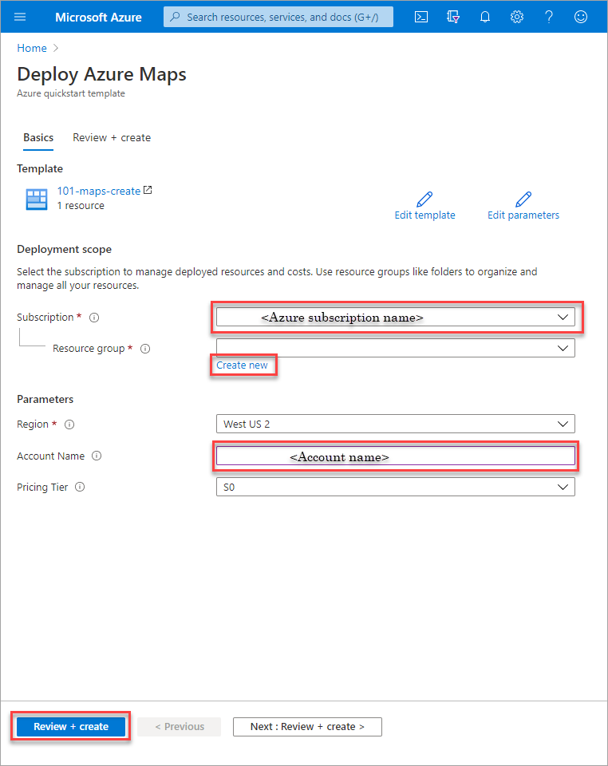
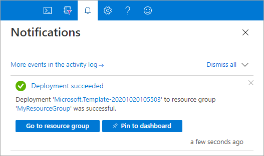

# Create your Azure Maps account using an ARM template

You can create your Azure Maps account using an Azure Resource Manager (ARM) template. After you have an account, you can implement the APIs in your website or mobile application.

[!INCLUDE [About Azure Resource Manager](../../includes/resource-manager-quickstart-introduction.md)]

If your environment meets the prerequisites and you're familiar with using ARM templates, select the **Deploy to Azure** button. The template opens in the Azure portal.

:::image type="content" source="~/reusable-content/ce-skilling/azure/media/template-deployments/deploy-to-azure-button.svg" alt-text="Button to deploy the Resource Manager template to Azure." border="false" link="https://portal.azure.com/#create/Microsoft.Template/uri/https%3A%2F%2Fraw.githubusercontent.com%2FAzure%2Fazure-quickstart-templates%2Fmaster%2Fquickstarts%2Fmicrosoft.maps%2Fmaps-create%2Fazuredeploy.json":::

## Prerequisites

To complete this article:

* If you don't have an Azure subscription, create a [free account] before you begin.

## Review the template

The template used in this quickstart is from [Azure Quickstart Templates].

:::code language="json" source="~/quickstart-templates/quickstarts/microsoft.maps/maps-create/azuredeploy.json":::

The Azure Maps account resource is defined in this template:

* [**Microsoft.Maps/accounts**]: create an Azure Maps account.

## Deploy the template

1. Select the following image to sign in to Azure and open a template. The template creates an Azure Maps account.

    :::image type="content" source="~/reusable-content/ce-skilling/azure/media/template-deployments/deploy-to-azure-button.svg" alt-text="Button to deploy the Resource Manager template to Azure." border="false" link="https://portal.azure.com/#create/Microsoft.Template/uri/https%3A%2F%2Fraw.githubusercontent.com%2FAzure%2Fazure-quickstart-templates%2Fmaster%2Fquickstarts%2Fmicrosoft.maps%2Fmaps-create%2Fazuredeploy.json":::

2. Select or enter the following values.

    

    Unless it's specified, use the default value to create your Azure Maps account.

    * **Subscription**: select an Azure subscription.
    * **Resource group**: select **Create new**, enter a unique name for the resource group, and then select **OK**.
    * **Location**: select a location.
    * **Account Name**: enter a name for your Azure Maps account, which must be globally unique.
    * **Pricing Tier**: select the appropriate pricing tier, the default value for the template is G2.

3. Select **Review + create**.
4. Confirm your settings on the review page and select **Create**. Once deployed successfully, you get a notification:

    

The Azure portal is used to deploy your template. You can also use the Azure PowerShell, Azure CLI, and REST API. To learn other deployment methods, see [Deploy templates].

## Review deployed resources

You can use the Azure portal to check your Azure Maps account and view your keys. You can also use the following Azure CLI script to list your account keys.

```azurecli-interactive
az maps account keys list --name MyMapsAccount --resource-group MyResourceGroup
```

## Clean up resources

When no longer needed, delete the resource group, which also deletes the Azure Maps account. To delete the resource group by using Azure CLI:

```azurecli-interactive
az group delete --name MyResourceGroup
```

## Next steps

To learn more about Azure Maps and Azure Resource Manager, see the following articles:

* Create an Azure Maps [demo application]
* Learn more about [ARM templates]

[**Microsoft.Maps/accounts**]: /azure/templates/microsoft.maps/accounts
[ARM templates]: ../azure-resource-manager/templates/overview.md
[Azure Quickstart Templates]: https://azure.microsoft.com/resources/templates/maps-create
[demo application]: quick-demo-map-app.md
[Deploy templates]: ../azure-resource-manager/templates/deploy-powershell.md
[free account]: https://azure.microsoft.com/free/?WT.mc_id=A261C142F
