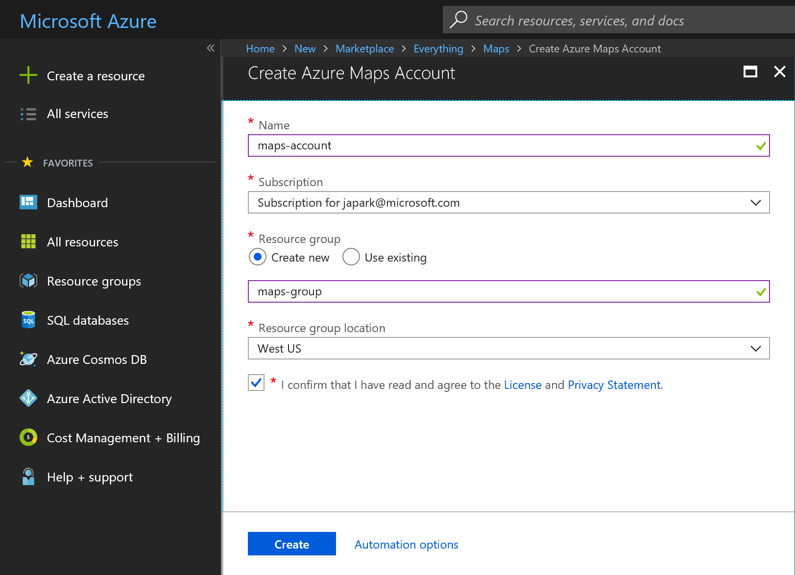
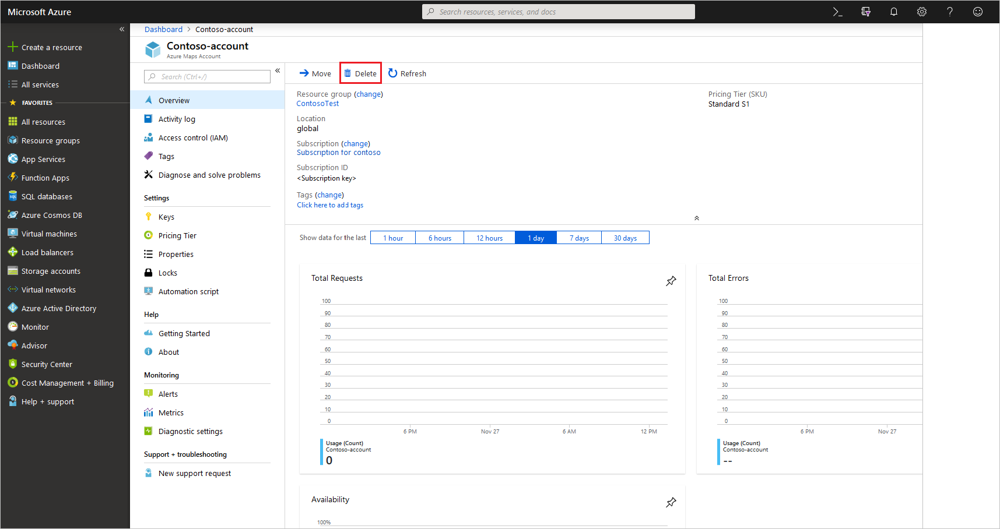

# Manage your Azure Maps account

You can manage your Azure Maps account through the Azure portal. After you have an account, you can implement the APIs in your website or mobile application.

If you don't have an Azure subscription, create a [free account](https://azure.microsoft.com/free/?WT.mc_id=A261C142F) before you begin.

## Create a new account

1. Sign in to the [Azure portal](https://portal.azure.com).

2. Select **Create a resource** in the upper-left corner of the Azure portal.

3. Search for and select **Maps**. Then select **Create**.

4. Enter the information for your new account.

## Delete an account

You can delete an account from the Azure portal. Navigate to the account overview page and select **Delete**.

You then see a confirmation page. You can confirm the deletion of your account by typing its name.

## Next steps

Set up authentication with Azure Maps and learn how to get an Azure Maps subscription key:
> [!div class="nextstepaction"]
> [Manage authentication](how-to-manage-authentication.md)

Learn how to manage an Azure Maps account pricing tier:
> [!div class="nextstepaction"]	
> [Manage a pricing tier](how-to-manage-pricing-tier.md)

Learn how to see the API usage metrics for your Azure Maps account:
> [!div class="nextstepaction"]	
> [View usage metrics](how-to-view-api-usage.md)
