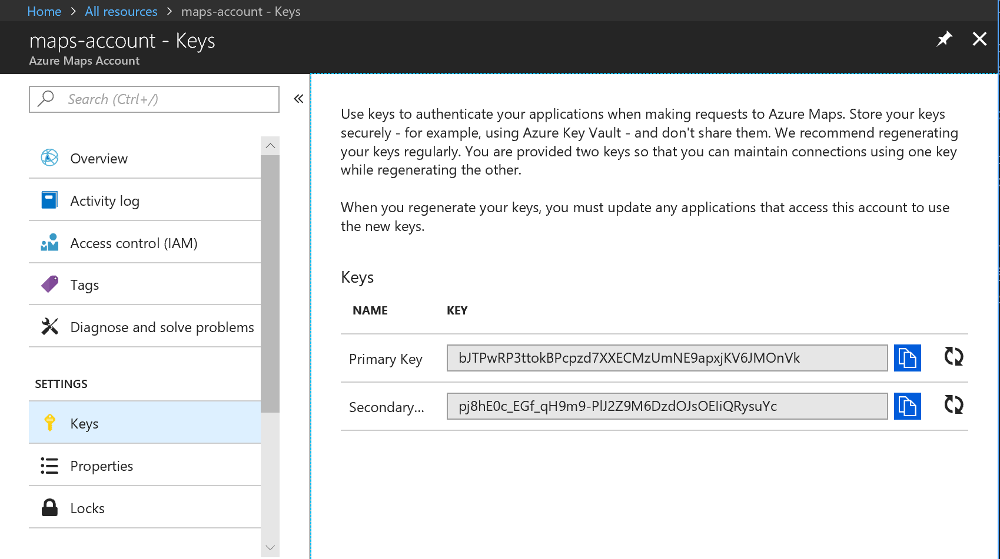

# How to manage your Azure Maps account and keys

You can manage your Azure Maps account and keys through the Azure portal. Once you have an account and a key, you can implement the APIs in your web site or mobile application.

If you don't have an Azure subscription, create a [free account](https://azure.microsoft.com/free/?WT.mc_id=A261C142F) before you begin.

## Create a new account

1. Sign in to the [Azure portal](http://portal.azure.com).

2. Click **Create a resource** in the upper left-hand corner of the Azure portal.

3. Search for and select **Maps**, then click **Create**.

4. Enter the information for your new account.

## Manage keys on the account page

Once you create an account, you get two randomly generated keys. You use the keys to authenticate against the Maps APIs when you want to retrieve map data or create a new JavaScript map instance.

You can find your keys in the Azure portal. Navigate to your account then select **Keys** from the menu.

From this page you can copy your keys or generate new ones.

## Delete an account

You can delete an account from the Azure portal. Navigate to the account overview page and select **Delete**.

You will then see a confirmation page. You can confirm the deletion of your account by typing its name.

## Next steps

* Learn how to use Azure Maps search APIs at [search for an address](./how-to-search-for-address.md).
* Learn how to use Azure maps [JavaScript map control](./how-to-use-map-control.md).
