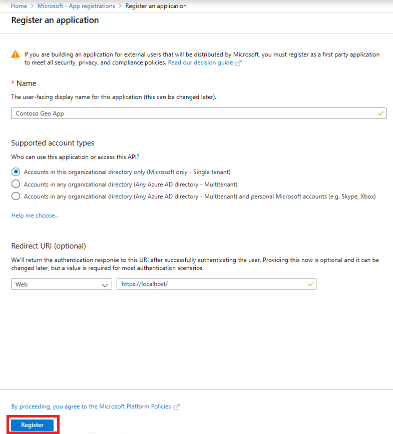
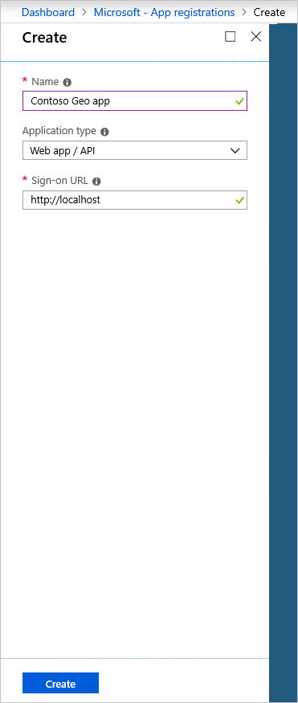
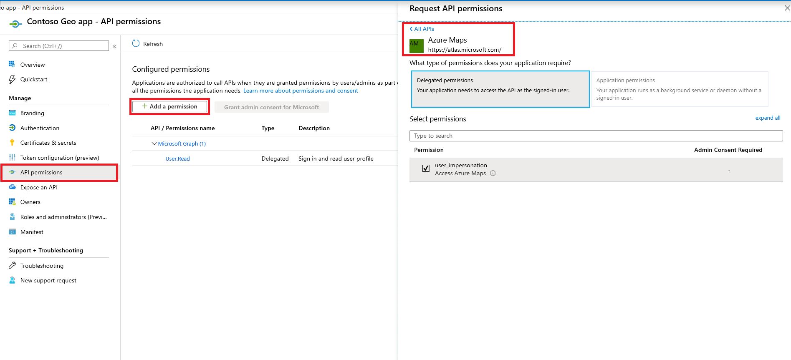
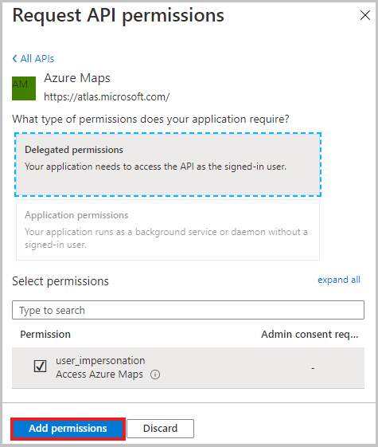
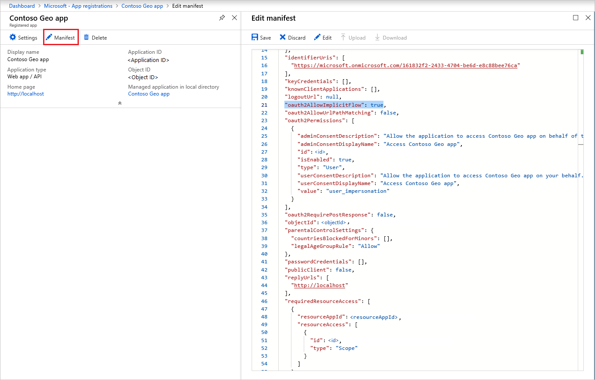
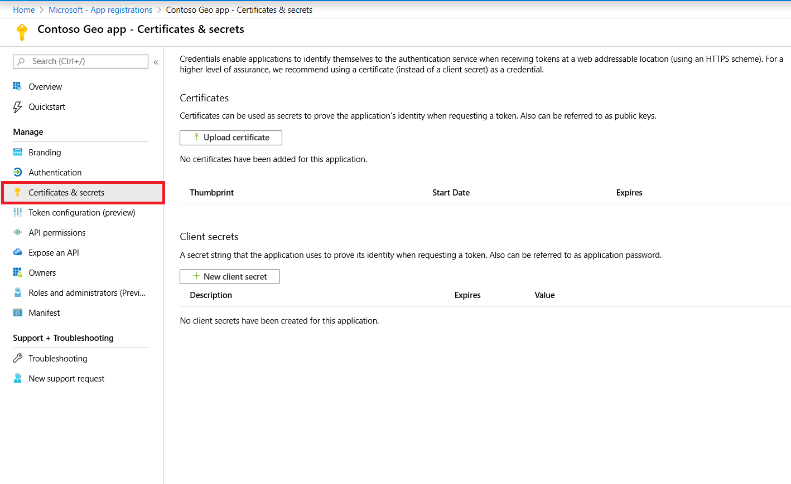
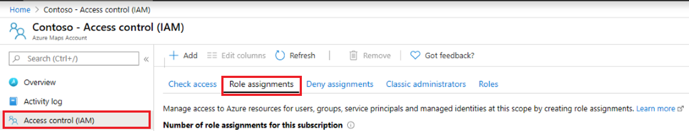
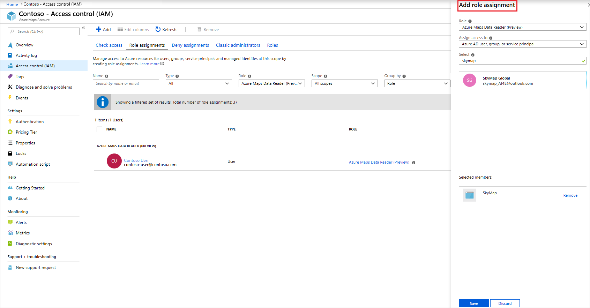
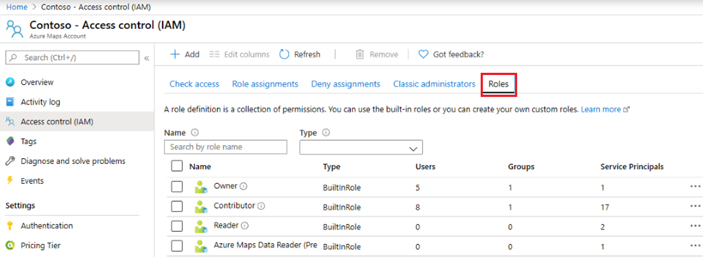
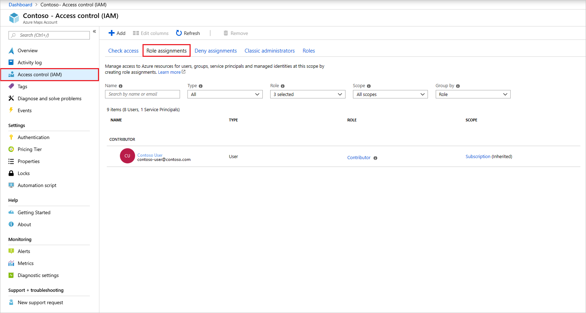

# Manage authentication in Azure Maps

After you create an Azure Maps account, a client ID and keys are created to support either Azure Active Directory (Azure AD) or Shared Key authentication.

## View authentication details

You can view your authentication details on the Azure portal. Go to your account and select **Authentication** on the **Settings** menu.

 To learn more, see [Authentication with Azure Maps](https://aka.ms/amauth).

## Set up Azure AD app registration

After you create an Azure Maps account, you need to establish a link between your Azure AD tenant and the Azure Maps resource.

1. Go to the Azure AD blade and create an app registration. Provide a name for the registration. In the **Sign-on URL** box, provide the home page of the web app / API (for example, https:\//localhost/). If you already have a registered app, go to step 2.

    

    

2. To assign delegated API permissions to Azure Maps, go to the application under **App registrations**, and then select **Settings**.  Select **Required permissions**, and then select **Add**. Search for and select **Azure Maps** under **Select an API**, and then select the **Select** button.

    

3. Under **Select permissions**, select **Access Azure Maps**, and then select the **Select** button.

    

4. Complete step a or b, depending on your authentication method.

    1. If your application uses user-token authentication with the Azure Maps Web SDK, enable `oauthEnableImplicitFlow` by setting it to true in the Manifest section of your app registration detail page.
    
       

    2. If your application uses server/application authentication, go to the **Keys** blade in app registration and either create a password or upload a public key certificate to the app registration. If you create a password, after you select **Save**, copy the password for later and store it securely. You'll use this password to acquire tokens from Azure AD.

       

## Grant RBAC to Azure Maps

After you associate an Azure Maps account with your Azure AD tenant, you can grant access control by assigning a user, group or application to one or more Azure Maps access control roles.

1. Go to **Access control (IAM)**, select **Role assignments**, and then select **Add role assignment**.

    

2. In the **Add role assignment** window, under **Role**, select **Azure Maps Date Reader (Preview)**. Under **Assign access to**, select **Azure AD user, group, or service principal**. Under **Select**, select the user or application. Select **Save**.

    

## View available Azure Maps RBAC roles

To view role-based access control (RBAC) roles that are available for Azure Maps, go to **Access control (IAM)**, select **Roles**, and then search for roles beginning with **Azure Maps**. These are the roles that you can grant access to.

## View Azure Maps RBAC

RBAC provides granular access control.

To view users and apps that have been granted RBAC for Azure Maps, go to **Access Control (IAM)**, select **Role assignments**, and then filter by **Azure Maps**.

## Request tokens for Azure Maps

After you register your app and associated it with Azure Maps, you can request access tokens.

* If your application uses user-token authentication with the Azure Maps Web SDK, you need to configure your HTML page with the Azure Maps client ID and the Azure AD app ID.

* If your application uses server/application authentication, you need to request a token from Azure AD login endpoint `https://login.microsoftonline.com` with the Azure AD resource ID `https://atlas.microsoft.com/`, the Azure Maps client ID, the Azure AD app ID, and the Azure AD app registration password or certificate.

For more information about requesting access tokens from Azure AD for users and service principals, see [Authentication scenarios for Azure AD](https://docs.microsoft.com/azure/active-directory/develop/authentication-scenarios).

## Next steps

To learn more about Azure AD authentication and the Azure Maps Web SDK, see [Azure AD and Azure Maps Web SDK](https://docs.microsoft.com/azure/azure-maps/how-to-use-map-control).

Learn how to see the API usage metrics for your Azure Maps account:
> [!div class="nextstepaction"]	
> [View usage metrics](how-to-view-api-usage.md)