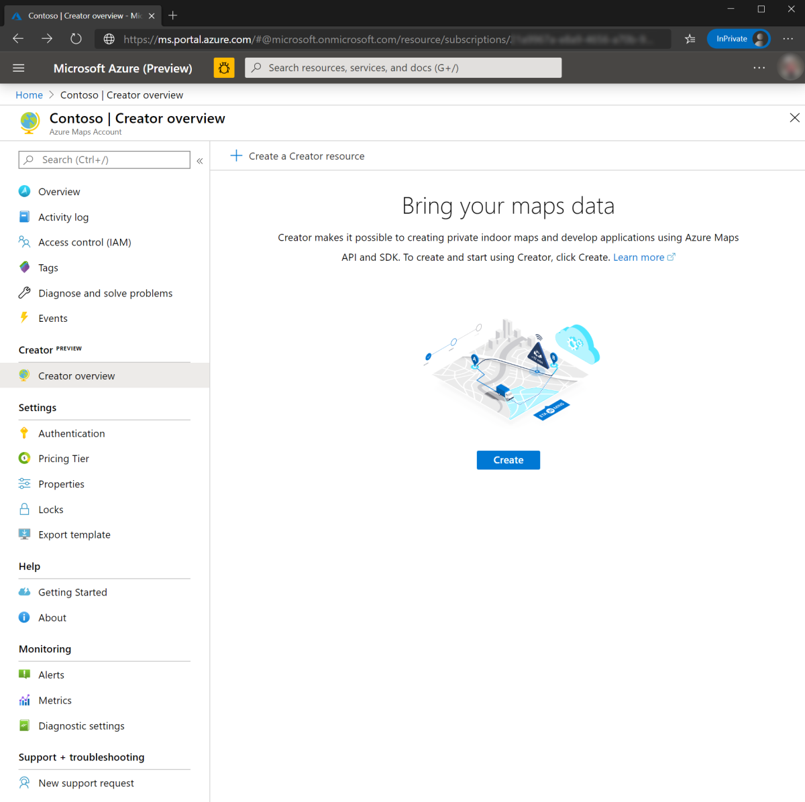
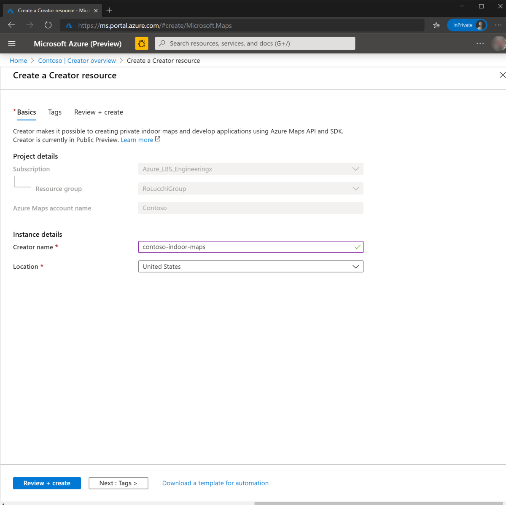
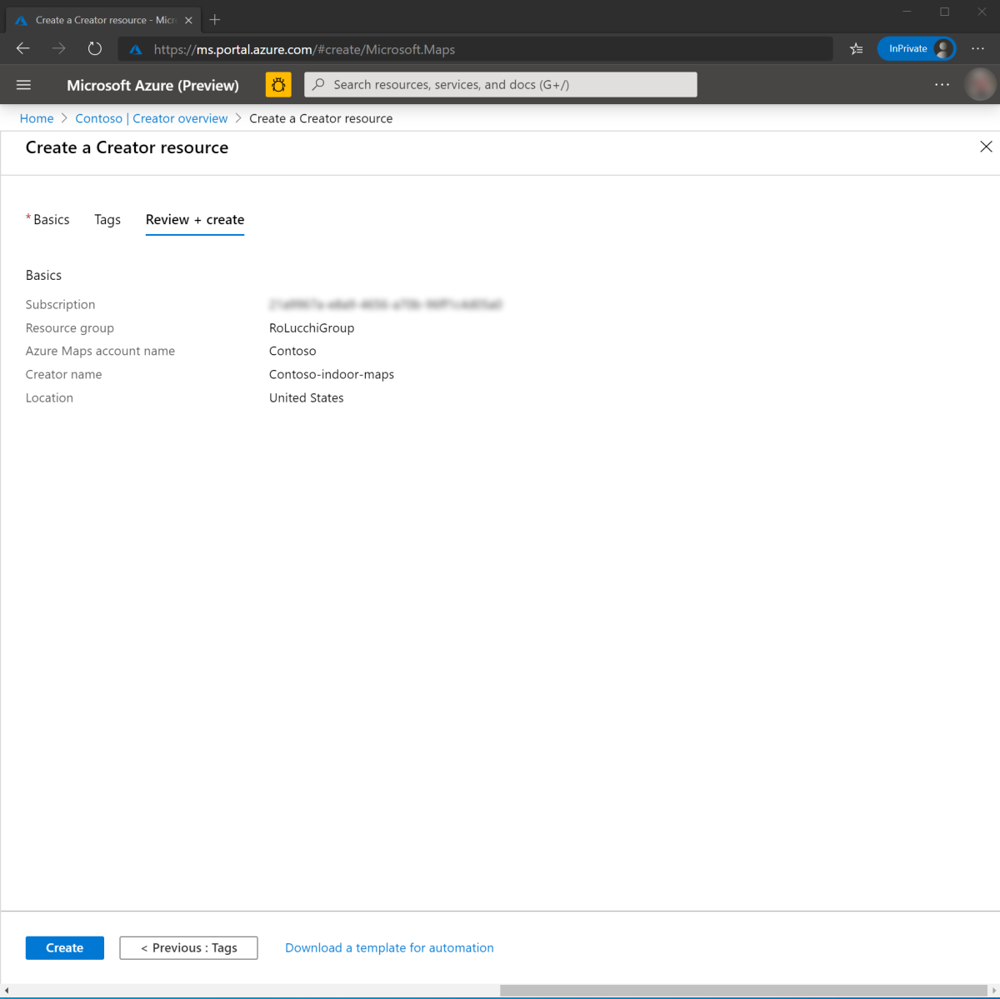
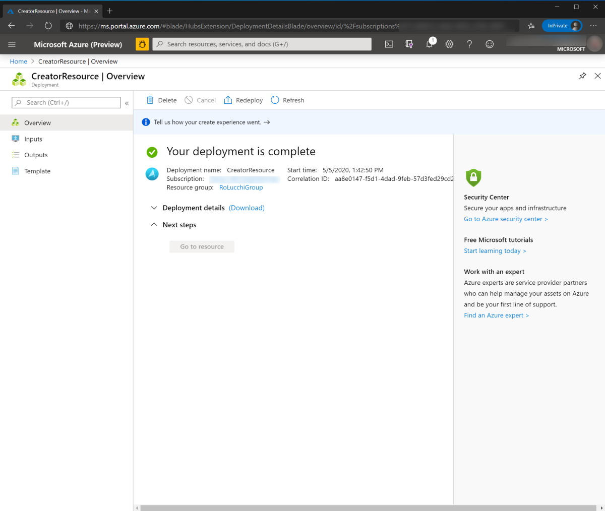
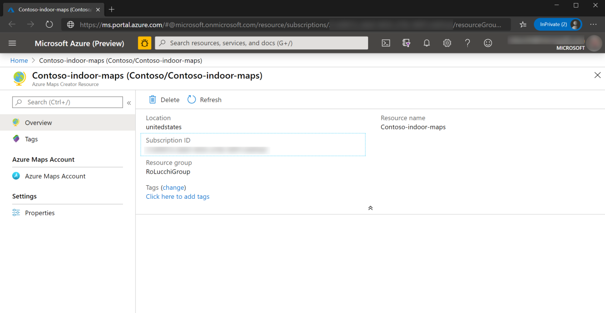
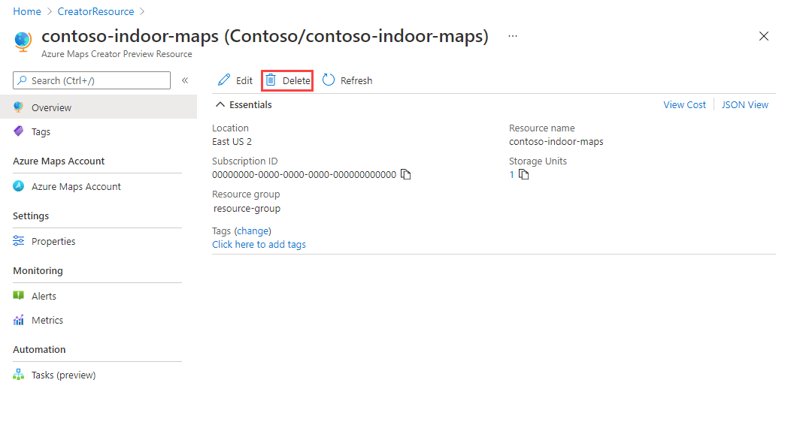
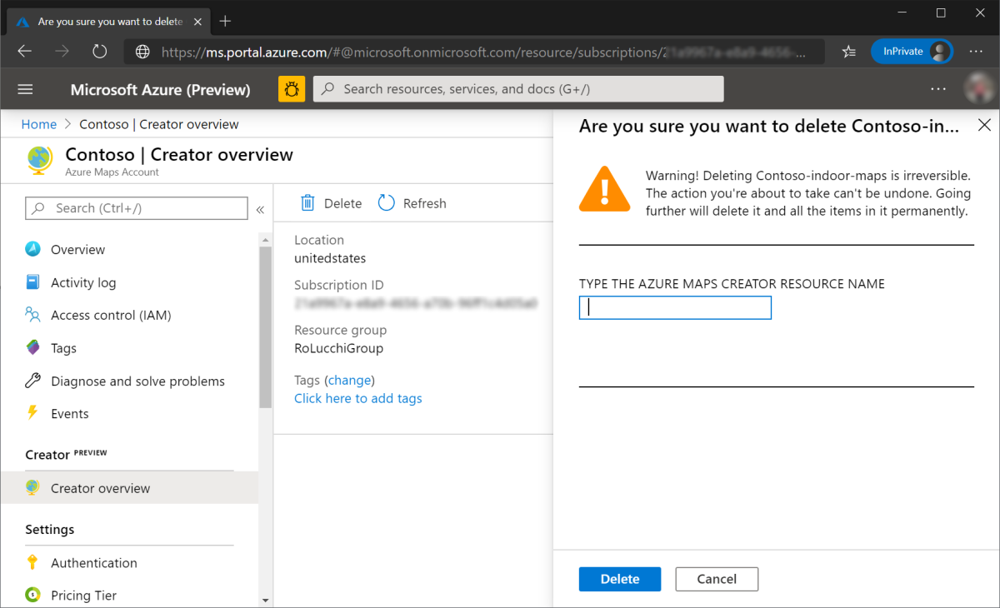

# Manage Azure Maps Creator

Azure Maps Creator lets you create private indoor map data. Using the Azure Maps API and the Indoor Maps module, you can develop interactive and dynamic indoor map web applications. Currently, Creator is only available in the United States using the S1 pricing tier.

This article takes you through the steps to create and delete a Creator resource in an Azure Maps account.

## Create Creator Resource

1. Sign in to the [Azure portal](https://portal.azure.com)

2. Select your Azure Maps account. If you can't see your Azure Maps account under the **Recent resources**, then navigate to the Azure portal menu. Select **All resources**. Find and select your Azure Maps account.

    

3. Once you're on the Azure Maps account page, navigate to the **Overview** option under **Creator**. Click  **Create**  to create an Azure Maps Creator resource.

    

4. Enter the name and location for your Creator resource. Currently, the United States is the only supported geographical location. Click **Review + create**.

   

5. Review your settings and click **Create**.

    

6. When the deployment completes, you'll see a page with a success or a failure message.

   

    >[!TIP]
    >To troubleshoot any errors you may receive, see
    [Troubleshoot query issues when using Azure Cosmos DB](https://docs.microsoft.com/azure/cosmos-db/troubleshoot-query-performance)

7. Click **Go to resource**. Your Creator resource view page shows the status of your Creator resource and the chosen demographic region.

    

   >[!NOTE]
   >From the Creator resource page, you can navigate back to the Azure Maps account it belongs to by clicking Azure Maps Account.

## Delete Creator Resource

To delete the Creator resource, navigate to your Azure Maps account. Select **Overview** under **Creator**. Click the **Delete** button.

>[!WARNING]
>When you delete the Creator resource of your Azure Maps account, you will also delete the datasets, tilesets, and feature statesets created using Creator services.

Click the **Delete** button and type your Creator name to confirm deletion. Once the resource is deleted, you'll see a confirmation page, like in the image below:

## Authentication

Creator inherits Azure Maps Access Control (IAM) settings. All API calls for data access must be sent with authentication and authorization rules. Also, Creator usage data is incorporated in your Azure Maps usage charts and activity log.  For more detail, see [Manage authentication in Azure Maps](https://docs.microsoft.com/azure/azure-maps/how-to-manage-authentication).

## Access to Creator services

Creator services are accessible only from within the location selected during creation. If calls are made to Creator services from outside the selected location, a user error message will be returned. To make calls from outside the selected location, the service URL must include the geographic prefix for the selected locations. For example, if Creator is created in the United States, all calls to the Conversion service must be submitted to `us.atlas.microsoft.com/conversion/convert`.

## Next steps

Introduction to Creator for indoor mapping:

> [!div class="nextstepaction"]
> [Data Upload](creator-for-indoor-maps.md#upload-a-drawing-package)

> [!div class="nextstepaction"]
> [Data Conversion](creator-for-indoor-maps.md#convert-a-drawing-package)

> [!div class="nextstepaction"]
> [Dataset](creator-for-indoor-maps.md#datasets)

> [!div class="nextstepaction"]
> [Tileset](creator-for-indoor-maps.md#tilesets)

> [!div class="nextstepaction"]
> [Feature State set](creator-for-indoor-maps.md#feature-statesets)

Learn how to use the Creator to render indoor maps in your application:

> [!div class="nextstepaction"]
> [Azure Maps Creator tutorial](tutorial-creator-indoor-maps.md)

> [!div class="nextstepaction"]
> [Indoor map dynamic styling](indoor-map-dynamic-styling.md)

> [!div class="nextstepaction"]
> [Use the Indoor Maps module](how-to-use-indoor-module.md)