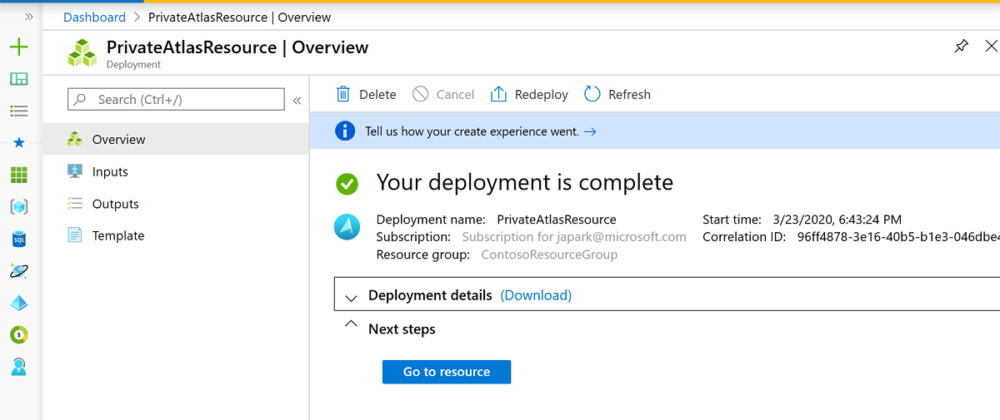
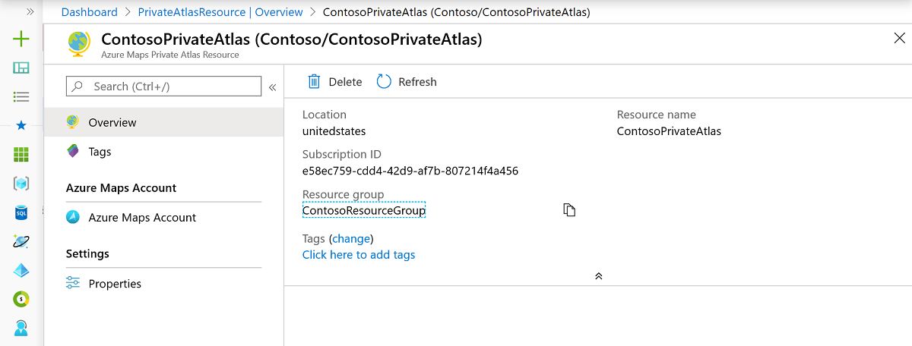
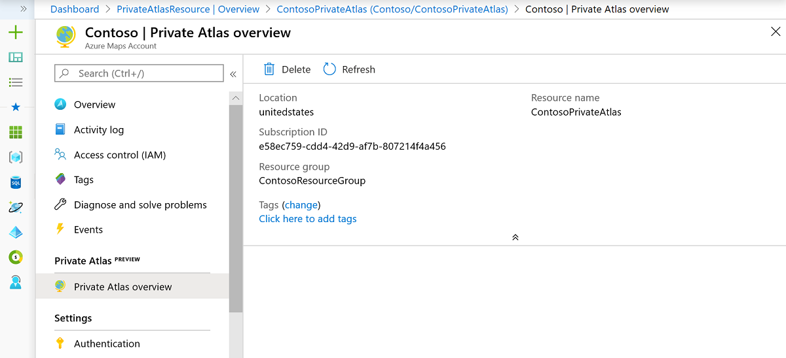

# Manage Azure Maps Creator

Azure Maps Creator makes it possible to create private indoor maps and develop web applications using the Azure Maps APIs and the Indoor Maps module. Currently, Creator is only available in the United States.

You can manage Azure Maps Creator for your Azure Maps account through the [Azure portal](https://ms.portal.azure.com/). Creator can be created and used in  Azure Maps accounts using the S1 pricing tier which cannot be changed while Creator exists.

Before you begin, if you don't have an Azure subscription, [create an Azure account](https://azure.microsoft.com/free/?WT.mc_id=A261C142F). Once you make an Azure account, you need to [create an Azure Maps account](how-to-manage-account-keys.md) to access the Creator resource.

For each Azure Maps account, you can have up to one Creator.  After you create Creator, Azure Maps Creator API is available to create and manage indoor maps.

## Create Azure Maps Creator

1. Sign in to the [Azure portal](https://portal.azure.com)

2. Select your Azure Maps account. If you can't see your Azure Maps account under the **Recent resources**, then navigate to the Azure portal menu. Select **All resources**, find, and select your Azure Maps account.

    

3. Once you're on the Azure Maps account page, navigate to the **Overview** option under **Creator**.
  
    

4. Select the **create** button to create your Azure Maps Creator. Enter the information for your Creator account and select the location for your Creator. Currently, the United States is the only supported geographical location.

    

5. Click Review + create.

     

6. Click **Create**.

7. When the deployment completes, you'll see a page with a success or a failure message.

    

    >[!TIP]
    >To troubleshoot any errors you may receive, see
    [Troubleshoot query issues when using Azure Cosmos DB](https://docs.microsoft.com/azure/cosmos-db/troubleshoot-query-performance)

8. Click **Go to resource**. Your Creator page should look like the page in the image below. It should show the status of your Creator and the chosen demographic region.

   

   >[!NOTE]
   >From the Creator resource page, you can navigate back to the Azure Maps account it belongs to by clicking Azure Maps Account.

## Delete Azure Maps Creator

You can delete the Creator of your Azure Maps account using the Azure portal. 

Navigate to your Azure Maps account and select **Overview** under **Creator**. If you have a Creator for your Azure Maps account, then you'll see a **Delete** button.

>[!WARNING]
>When you delete the Creator of your Azure Maps account, you will also delete the data sets, tile sets, and feature state sets created using the Creator API.

Click the **Delete** button and type your Creator name to confirm your desire to delete it. Once the resource is erased, you'll see a confirmation page, like in the image below:

## Authentication
Creator inherits your Azure Maps Access Control (IAM) settings. Access to any data created and processed in Creator such as converted data, datasets, tilesets, and feature statesets is available via API calls only when passing the authentication and authorization rules defined in the IAM account to which Creator belongs. In addition, Creator usage data is incorporated in your Azure Maps usage charts and activity log.  For more detail, see [Manage authentication in Azure Maps](https://docs.microsoft.com/azure/azure-maps/how-to-manage-authentication).

## Next steps

Introduction to Creator for Indoor mapping:

> [!div class="nextstepaction"]
> [Data Upload](creator-for-indoor-maps.md#upload-a-drawing-package)

> [!div class="nextstepaction"]
> [Data Conversion](creator-for-indoor-maps.md#convert-a-drawing-package)

> [!div class="nextstepaction"]
> [Dataset](creator-for-indoor-maps.md#datasets)

> [!div class="nextstepaction"]
> [Tileset](creator-for-indoor-maps.md#tilesets)

> [!div class="nextstepaction"]
> [Feature State set](creator-for-indoor-maps.md#feature-statesets)

Learn how to use the Creator to render indoor maps in your application:

> [!div class="nextstepaction"]
> [Azure Maps Creator tutorial](tutorial-creator-indoor-maps.md)

> [!div class="nextstepaction"]
> [Indoor map dynamic styling](indoor-map-dynamic-styling.md)

> [!div class="nextstepaction"]
> [Use the Indoor Maps module](how-to-use-indoor-module.md)