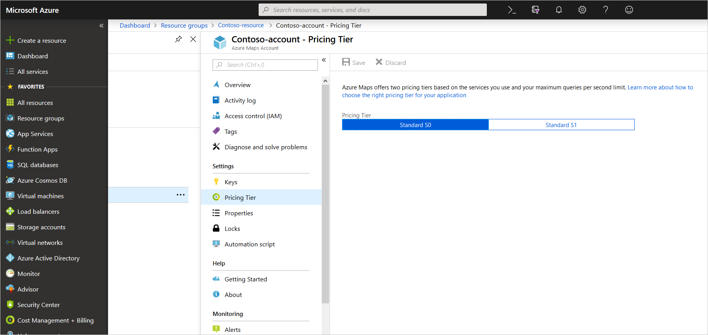
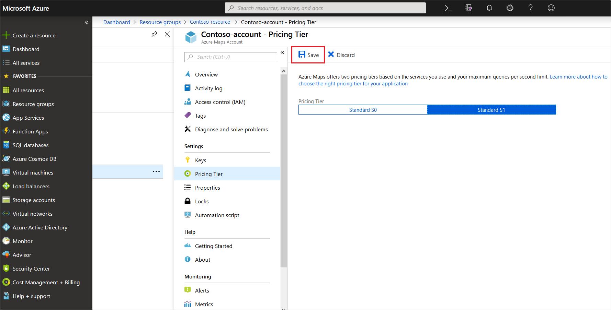

# Manage the pricing tier of your Azure Maps account

You can manage the pricing tier of your Azure Maps account through the Azure portal. After you create an [account](https://azure.microsoft.com/free/?WT.mc_id=A261C142F), you can view or change your account's pricing tier.

Get more information about [choosing the right pricing tier in Azure Maps](https://docs.microsoft.com/azure/azure-maps/choose-pricing-tier).

## View your pricing tier

To view your chosen pricing tier, navigate to the **Pricing Tier** option in the settings menu.

## Change a pricing tier

After you create your Azure Maps account, you can upgrade or downgrade the pricing tier for your Azure Maps account. To upgrade or downgrade, navigate to the **Pricing Tier** option in the settings menu. Select the pricing tier that isn't highlighted. Select the **Save** button to save your chosen pricing tier option.

> [!NOTE]
> You don't have to generate new subscription keys or client ID (for Azure AD authentication) if you upgrade or downgrade the pricing tier for your Azure Maps account.

## Next steps

Learn how to see the API usage metrics for your Azure Maps account:

> [!div class="nextstepaction"]	
> [View usage metrics](./how-to-view-api-usage.md)
