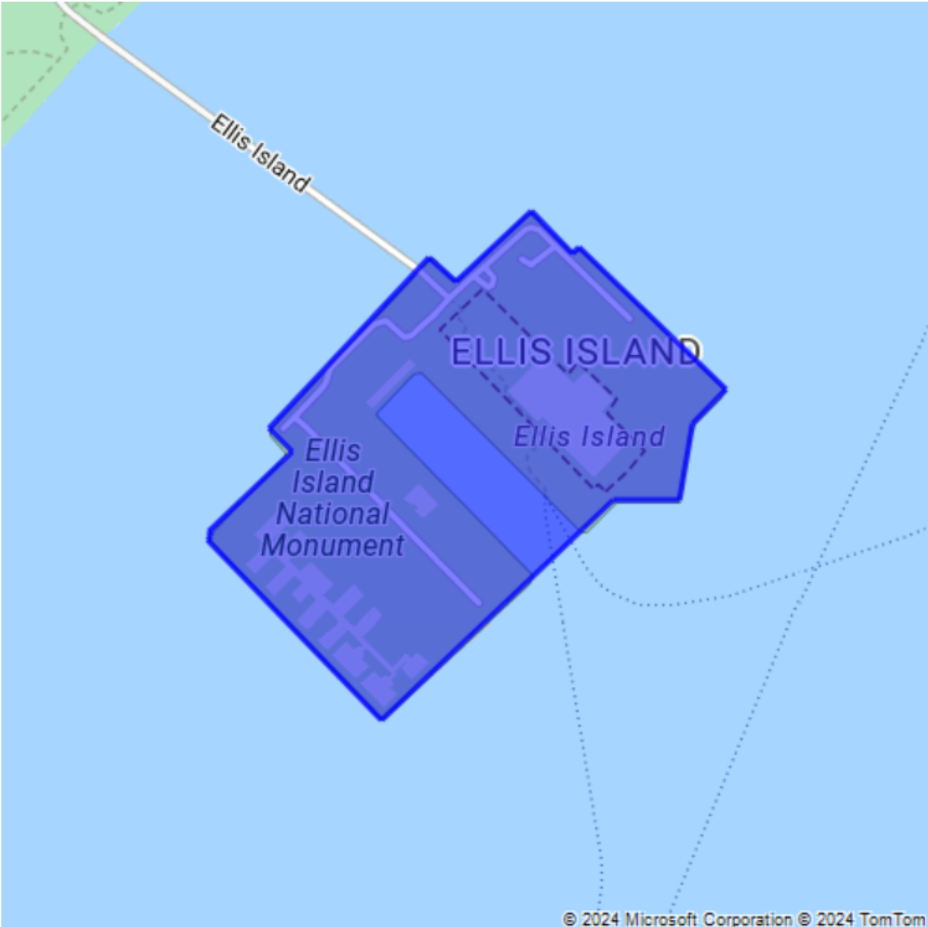

# Render custom data on a raster map

This article explains how to use the [static image service](https://docs.microsoft.com/rest/api/maps/render/getmapimage) with image composition functionality to allow overlays on top of a raster map. Image composition includes the ability to get a raster tile back, with additional data like custom pushpins, labels, and geometry overlays.

To render custom pushpins, labels, and geometry overlays, you can use the Postman application. You can use Azure Maps [Data Service APIs](https://docs.microsoft.com/rest/api/maps/data) to store and render overlays.


## Prerequisites

### Create an Azure Maps account

To complete the procedures in this article, you first need to [create an Azure Maps account](how-to-manage-account-keys.md) in the S1 pricing tier.

## Render pushpins with labels and a custom image

> [!Note]
> The procedure in this section requires an Azure Maps account in pricing tier S0 or S1.

The Azure Maps account S0 tier supports only a single instance of the `pins` parameter. It allows you to render up to five pushpins, specified in the URL request, with a custom image.

To render pushpins with labels and a custom image, complete these steps:

1. Create a collection in which to store the requests. In the Postman app, select **New**. In the **Create New** window, select **Collection**. Name the collection and select the **Create** button. 

2. To create the request, select **New** again. In the **Create New** window, select **Request**. Enter a **Request name** for the pushpins, select the collection you created in the previous step as the location in which to save the request, and then select **Save**.
    
    

3. Select the GET HTTP method on the builder tab and enter the following URL to create a GET request.

    ```HTTP
    https://atlas.microsoft.com/map/static/png?subscription-key={subscription-key}&api-version=1.0&layer=basic&style=main&zoom=12&center=-73.98,%2040.77&pins=custom%7Cla15+50%7Cls12%7Clc003b61%7C%7C%27CentralPark%27-73.9657974+40.781971%7C%7Chttp%3A%2F%2Fazuremapscodesamples.azurewebsites.net%2FCommon%2Fimages%2Fpushpins%2Fylw-pushpin.png
    ```
    Here's the resulting image:

    


## Get data from Azure Maps data storage

> [!Note]
> The procedure in this section requires an Azure Maps account in pricing tier S1.

You can also obtain the path and pin location information by using the [Data Upload API](https://docs.microsoft.com/rest/api/maps/data/uploadpreview). Follow the steps below to upload the path and pins data.

1. In the Postman app, open a new tab in the collection you created in the previous section. Select the POST HTTP method on the builder tab and enter the following URL to make a POST request:

    ```HTTP
    https://atlas.microsoft.com/mapData/upload?subscription-key={subscription-key}&api-version=1.0&dataFormat=geojson
    ```

2. On the **Params** tab, enter the following key/value pairs, which are used for the POST request URL. Replace the `subscription-key` value with your Azure Maps subscription key.
    
    

3. On the **Body** tab, select the raw input format and choose JSON as the input format from the dropdown list. Provide this JSON as data to be uploaded:
    
    ```JSON
    {
      "type": "FeatureCollection",
      "features": [
        {
          "type": "Feature",
          "properties": {},
          "geometry": {
            "type": "Polygon",
            "coordinates": [
              [
                [
                  -73.98235,
                  40.76799
                ],
                [
                  -73.95785,
                  40.80044
                ],
                [
                  -73.94928,
                  40.7968
                ],
                [
                  -73.97317,
                  40.76437
                ],
                [
                  -73.98235,
                  40.76799
                ]
              ]
            ]
          }
        },
        {
          "type": "Feature",
          "properties": {},
          "geometry": {
            "type": "LineString",
            "coordinates": [
              [
                -73.97624731063843,
                40.76560773817073
              ],
              [
                -73.97914409637451,
                40.766826609362575
              ],
              [
                -73.98513078689575,
                40.7585866048861
              ]
            ]
          }
        }
      ]
    }
    ```

4. Select **Send** and review the response header. The location header contains the URI used to access or download the data for future use. It also contains a unique `udId` for the uploaded data.  

   ```HTTP
   https://atlas.microsoft.com/mapData/{udId}/status?api-version=1.0&subscription-key={Subscription-key}
   ```

5. Use the `udId` value received from the Data Upload API to render features on the map. To do this, open a new tab in the collection you created in the preceding section. Select the GET HTTP method on the builder tab and enter this URL to make a GET request:

    ```HTTP
    https://atlas.microsoft.com/map/static/png?subscription-key={subscription-key}&api-version=1.0&layer=basic&style=main&zoom=12&center=-73.96682739257812%2C40.78119135317995&pins=default|la-35+50|ls12|lc003C62|co9B2F15||'Times Square'-73.98516297340393 40.758781646381024|'Central Park'-73.96682739257812 40.78119135317995&path=lc0000FF|fc0000FF|lw3|la0.80|fa0.30||udid-{udId}
    ```

    Here's the response image:

    

## Render a polygon with color and opacity

> [!Note]
> The procedure in this section requires an Azure Maps account in pricing tier S1.


You can modify the appearance of a polygon by using style modifiers with the [path parameter](https://docs.microsoft.com/rest/api/maps/render/getmapimage#uri-parameters).

1. In the Postman app, open a new tab in the collection you created earlier. Select the GET HTTP method on the builder tab and enter the following URL to configure a GET request to render a polygon with color and opacity:
    
    ```HTTP
    https://atlas.microsoft.com/map/static/png?api-version=1.0&style=main&layer=basic&sku=S1&zoom=14&height=500&Width=500&center=-74.040701, 40.698666&path=lc0000FF|fc0000FF|lw3|la0.80|fa0.50||-74.03995513916016 40.70090237454063|-74.04082417488098 40.70028420372218|-74.04113531112671 40.70049568385827|-74.04298067092896 40.69899904076542|-74.04271245002747 40.69879568992435|-74.04367804527283 40.6980961582905|-74.04364585876465 40.698055487620714|-74.04368877410889 40.698022951066996|-74.04168248176573 40.696444909137|-74.03901100158691 40.69837271818651|-74.03824925422668 40.69837271818651|-74.03809905052185 40.69903971085914|-74.03771281242369 40.699340668780984|-74.03940796852112 40.70058515602143|-74.03948307037354 40.70052821920425|-74.03995513916016 40.70090237454063
    &subscription-key={subscription--key}
    ```

    Here's the response image:

    


## Render a circle and pushpins with custom labels

> [!Note]
> The procedure in this section requires an Azure Maps account in pricing tier S1.


You can make pushpins and their labels larger or smaller by using the `sc` scale style modifier. This modifier takes a value that's greater than zero. A value of 1 is the standard scale. Values larger than 1 will make the pins larger, and values smaller than 1 will make them smaller. For more information about style modifiers, see [static image service path parameters](https://docs.microsoft.com/rest/api/maps/render/getmapimage#uri-parameters).


Follow these steps to render a circle and pushpins with custom labels:

1. In the Postman app, open a new tab in the collection you created earlier. Select the GET HTTP method on the builder tab and enter this URL to make a GET request:

    ```HTTP
    https://atlas.microsoft.com/map/static/png?api-version=1.0&style=main&layer=basic&zoom=14&height=700&Width=700&center=-122.13230609893799,47.64599069048016&path=lcFF0000|lw2|la0.60|ra1000||-122.13230609893799 47.64599069048016&pins=default|la15+50|al0.66|lc003C62|co002D62||'Microsoft Corporate Headquarters'-122.14131832122801  47.64690503939462|'Microsoft Visitor Center'-122.136828 47.642224|'Microsoft Conference Center'-122.12552547454833 47.642940335653996|'Microsoft The Commons'-122.13687658309935  47.64452336193245&subscription-key={subscription-key}
    ```

    Here's the response image:

    

## Next steps


* Explore the [Azure Maps Get Map Image API](https://docs.microsoft.com/rest/api/maps/render/getmapimage) documentation.
* To learn more about Azure Maps Data Service, see the [service documentation](https://docs.microsoft.com/rest/api/maps/data).

