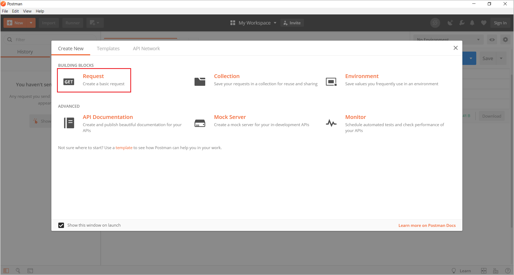

# Request public transit data using the Azure Maps Mobility Service 

This article shows you how to use Azure Maps [Mobility Service](https://aka.ms/AzureMapsMobilityService) to request public transit data. Transit data includes transit stops, route information, and travel time estimations.

In this article you'll learn, how to:

* Get a metro area ID using the [Get Metro Area API](https://aka.ms/AzureMapsMobilityMetro)
* Request nearby transit stops using [Get Nearby Transit](https://aka.ms/AzureMapsMobilityNearbyTransit) service.
* Query [Get Transit Routes API](https://aka.ms/AzureMapsMobilityTransitRoute) to plan a route using public transit.
* Request transit route geometry and detailed schedule for the route using the [Get Transit Itinerary API](https://aka.ms/https://azure.microsoft.com/services/azure-maps/).


## Prerequisites

You first need to have an Azure Maps account and a subscription key to make any calls to the Azure Maps public transit APIs. For information, follow instructions in [Create an account](quick-demo-map-app.md#create-an-account-with-azure-maps) to create an Azure Maps account. Follow the steps in [get primary key](quick-demo-map-app.md#get-the-primary-key-for-your-account) to obtain the primary key for your account. For more information on authentication in Azure Maps, see [manage authentication in Azure Maps](./how-to-manage-authentication.md).


This article uses the [Postman app](https://www.getpostman.com/apps) to build REST calls. You can use any API development environment that you prefer.


## Get a metro area ID

In order to request transit information for a particular metropolitan area, you'll need the `metroId` of that area. The [Get Metro Area API](https://aka.ms/AzureMapsMobilityMetro) allows you to request metro areas, in which the Azure Maps Mobility Service is available. The response includes details such as the `metroId`, `metroName`, and the representation of the metro area geometry in GeoJSON format.

Let's make a request to get the Metro Area for the Seattle-Tacoma metro area ID. To request ID for a metro area, complete the following steps:

1. Open the Postman app, and let's create a collection to store the requests. Near the top of the Postman app, select **New**. In the **Create New** window, select **Collection**.  Name the collection and select the **Create** button.

2. To create the request, select **New** again. In the **Create New** window, select **Request**. Enter a **Request name** for the request. Select the collection you created in the previous step as the location in which to save the request. Then, select **Save**.
    
    

3. Select the **GET** HTTP method on the builder tab and enter the following URL to create a GET request. Replace `{subscription-key}`, with your Azure Maps primary key.

    ```HTTP
    https://atlas.microsoft.com/mobility/metroArea/id/json?subscription-key={subscription-key}&api-version=1.0&query=47.63096,-122.126
    ```

4. After a successful request, you'll receive the following response:

    ```JSON
    {
        "results": [
            {
                "metroId": 522,
                "metroName": "Seattle–Tacoma–Bellevue, WA",
                "viewport": {
                    "topLeftPoint": {
                        "latitude": 48.5853,
                        "longitude": -124.80934
                    },
                    "btmRightPoint": {
                        "latitude": 46.90534,
                        "longitude": -121.55032
                    }
                },
                "geometry": {
                    "type": "Polygon",
                    "coordinates": [
                        [
                            [
                                -121.99604,
                                47.16147
                            ],
                            [
                                -121.97051,
                                47.17222
                            ],
                            [
                                -121.96308,
                                47.17671
                            ],
                            ...,
                            ...,
                            ...,
                            [
                                -122.01525,
                                47.16008
                            ],
                            [
                                -122.00553,
                                47.15919
                            ],
                            [
                                -121.99604,
                                47.16147
                            ]
                        ]
                    ]
                }
            }
        ]
    }
    ```

5. Copy the `metroId`, we'll need to use it later.

## Request nearby transit stops

The Azure Maps [Get Nearby Transit](https://aka.ms/AzureMapsMobilityNearbyTransit) service allows you to search transit objects.  the API returns the transit object details, such as public transit stops and shared bikes around a given location. Next we'll make a request to the service to search for nearby public transit stops within a 300-meters radius around the given location. In the request, we need to include the `metroId` retrieved earlier.

To make a request to the [Get Nearby Transit](https://aka.ms/AzureMapsMobilityNearbyTransit), follow the steps below:

1. In Postman, click **New Request** | **GET request** and name it **Get Nearby stops**.

2. On the Builder tab, select the **GET** HTTP method, enter the following request URL for your API endpoint and click **Send**.

    ```HTTP
    https://atlas.microsoft.com/mobility/transit/nearby/json?subscription-key={subscription-key}&api-version=1.0&metroId=522&query=47.63096,-122.126&radius=300&objectType=stop
    ```

3. After a successful request, the response structure should look like the one below:

    ```JSON
    {
        "results": [
            {
                "id": "522---2060603",
                "type": "stop",
                "objectDetails": {
                    "stopKey": "71300",
                    "stopName": "NE 24th St & 162nd Ave NE",
                    "stopCode": "71300",
                    "mainTransitType": "Bus",
                    "mainAgencyId": "522---5872",
                    "mainAgencyName": "Metro Transit"
                },
                "position": {
                    "latitude": 47.631504,
                    "longitude": -122.125275
                },
                "viewport": {
                    "topLeftPoint": {
                        "latitude": 47.632413,
                        "longitude": -122.12659
                    },
                    "btmRightPoint": {
                        "latitude": 47.630594,
                        "longitude": -122.123959
                    }
                }
            },
            {
                "id": "522---2061020",
                "type": "stop",
                "objectDetails": {
                    "stopKey": "68372",
                    "stopName": "NE 24th St & 160th Ave NE",
                    "stopCode": "68372",
                    "mainTransitType": "Bus",
                    "mainAgencyId": "522---5872",
                    "mainAgencyName": "Metro Transit"
                },
                "position": {
                    "latitude": 47.631409,
                    "longitude": -122.127136
                },
                "viewport": {
                    "topLeftPoint": {
                        "latitude": 47.632318,
                        "longitude": -122.128451
                    },
                    "btmRightPoint": {
                        "latitude": 47.630499,
                        "longitude": -122.12582
                    }
                }
            },
            {
                "id": "522---2060604",
                "type": "stop",
                "objectDetails": {
                    "stopKey": "71310",
                    "stopName": "NE 24th St & 160th Ave NE",
                    "stopCode": "71310",
                    "mainTransitType": "Bus",
                    "mainAgencyId": "522---5872",
                    "mainAgencyName": "Metro Transit"
                },
                "position": {
                    "latitude": 47.631565,
                    "longitude": -122.127808
                },
                "viewport": {
                    "topLeftPoint": {
                        "latitude": 47.632474,
                        "longitude": -122.129124
                    },
                    "btmRightPoint": {
                        "latitude": 47.630655,
                        "longitude": -122.126492
                    }
                }
            }
        ]
    }   
    ```

If you observe the response structure carefully, you'll see that it contains parameters for each transit object. Each transit object has parameters such as `id`, `type`, `stopName`, `mainTransitType`, `mainAgencyName`, and the position, in coordinates, of the object.

For the purpose of learning, we'll use an `id` of a bus stops as the origin, for our route in the next section.  


## Request a transit route

The Azure Maps [Get Transit Routes API](https://aka.ms/AzureMapsMobilityTransitRoute) allows trip planning. It returns the best possible route options from an origin to a destination. The service provides different kind of travel modes, including walking, biking, and public transit. Next, we'll search a route from the closest bus stop to the Space Needle tower in Seattle.

### Get location coordinates for destination

To obtain the location coordinates of the Space Needle tower, lets use the Azure Maps [Fuzzy Search Service](https://docs.microsoft.com/rest/api/maps/search/getsearchfuzzy).

To make a request to the Fuzzy search service, follow the steps below:

1. In Postman, click **New Request** | **GET request** and name it **Get location coordinates**.

2.  On the Builder tab, select the **GET** HTTP method, enter the following request URL, and click **Send**.
 
    ```HTTP
    https://atlas.microsoft.com/search/fuzzy/json?subscription-key={subscription-key}&api-version=1.0&query=space needle
    ```
    
3. If you look at the response carefully, it contains multiple locations in the results for the Space Needle search. Each result contains the location coordinates under the **position**. Copy the `lat` and `lon` under the **position** of the first result.
    
   ```JSON
   {
        "summary": {
            "query": "space needle",
            "queryType": "NON_NEAR",
            "queryTime": 35,
            "numResults": 8,
            "offset": 0,
            "totalResults": 11,
            "fuzzyLevel": 1
        },
        "results": [
            {
                "type": "POI",
                "id": "US/POI/p0/6993440",
                "score": 4.67369,
                "info": "search:ta:840539001406144-US",
                "poi": {
                    "name": "Space Needle",
                    "phone": "+(1)-(206)-9052100",
                    "categorySet": [
                        {
                            "id": 7376009
                        }
                    ],
                    "url": "www.spaceneedle.com",
                    "categories": [
                        "important tourist attraction",
                        "tower"
                    ],
                    "classifications": [
                        {
                            "code": "IMPORTANT_TOURIST_ATTRACTION",
                            "names": [
                                {
                                    "nameLocale": "en-US",
                                    "name": "important tourist attraction"
                                },
                                {
                                    "nameLocale": "en-US",
                                    "name": "tower"
                                }
                            ]
                        }
                    ]
                },
                "address": {
                    "streetNumber": "400",
                    "streetName": "Broad St",
                    "municipalitySubdivision": "South Lake Union, Seattle, Lower Queen Anne",
                    "municipality": "Seattle",
                    "countrySecondarySubdivision": "King",
                    "countryTertiarySubdivision": "Seattle",
                    "countrySubdivision": "WA",
                    "postalCode": "98109",
                    "countryCode": "US",
                    "country": "United States",
                    "countryCodeISO3": "USA",
                    "freeformAddress": "400 Broad St, Seattle, WA 98109",
                    "localName": "Seattle",
                    "countrySubdivisionName": "Washington"
                },
                "position": {
                    "lat": 47.62039,
                    "lon": -122.34928
                },
                "viewport": {
                    "topLeftPoint": {
                        "lat": 47.62129,
                        "lon": -122.35061
                    },
                    "btmRightPoint": {
                        "lat": 47.61949,
                        "lon": -122.34795
                    }
                },
                "entryPoints": [
                    {
                        "type": "main",
                        "position": {
                            "lat": 47.61982,
                            "lon": -122.34886
                        }
                    }
                ]
            },
            ...,
            ...,
            ...
        ]
    }
    ``` 
    

### Request route

To make a route request, complete the steps below:

1. In Postman, click **New Request** | **GET request** and name it **Get Route info**.

2. On the Builder tab, select the **GET** HTTP method, enter the following request URL for your API endpoint and click **Send**.

    We'll request public transit routes for a bus by specifying the `modeType` and `transitType` parameters. The request URL contains the locations retrieved in the previous sections. For the `originType`, we now have a **stopId**. And for the `destionationType`, we have the **position**.

    See the [list of URI parameters](https://aka.ms/AzureMapsMobilityTransitRoute#uri-parameters) you can use in your request to the [Get Transit Routes API](https://aka.ms/AzureMapsMobilityTransitRoute). 
  
    ```HTTP
    https://atlas.microsoft.com/mobility/transit/route/json?subscription-key={subscription-key}&api-version=1.0&metroId=522&originType=stopId&origin=522---2060603&destionationType=position&destination=47.62039,-122.34928&modeType=publicTransit&transitType=bus
    ```

3. Upon a successful request, the response structure should look like the one below:

    ```JSON
    {
        "results": [
            {
                "itineraryId": "cb6b6b6f-5cda-451e-b68d-2e97971dd60c---20190906BBBEC4D2219A436A9D794224978C9BBF:0---522",
                "departureTime": "2019-09-07T01:01:50Z",
                "arrivalTime": "2019-09-07T02:16:33Z",
                "travelTimeInSeconds": 4483,
                "numberOfLegs": 8,
                "legs": [
                    {
                        "legType": "Wait",
                        "legStartTime": "2019-09-07T01:01:50Z",
                        "legEndTime": "2019-09-07T01:01:50Z",
                        "caption": "249"
                    },
                    {
                        "legType": "Bus",
                        "legStartTime": "2019-09-07T01:01:50Z",
                        "legEndTime": "2019-09-07T01:26:00Z",
                        "caption": "249",
                        "lengthInMeters": 9139
                    },
                    {
                        "legType": "Wait",
                        "legStartTime": "2019-09-07T01:26:00Z",
                        "legEndTime": "2019-09-07T01:28:00Z",
                        "caption": "255"
                    },
                    {
                        "legType": "Bus",
                        "legStartTime": "2019-09-07T01:28:00Z",
                        "legEndTime": "2019-09-07T01:57:21Z",
                        "caption": "255",
                        "lengthInMeters": 13136
                    },
                    {
                        "legType": "Walk",
                        "legStartTime": "2019-09-07T01:57:22Z",
                        "legEndTime": "2019-09-07T02:01:27Z",
                        "caption": "Denny Way",
                        "lengthInMeters": 308
                    },
                    {
                        "legType": "Wait",
                        "legStartTime": "2019-09-07T02:01:27Z",
                        "legEndTime": "2019-09-07T02:06:33Z",
                        "caption": "8"
                    },
                    {
                        "legType": "Bus",
                        "legStartTime": "2019-09-07T02:06:33Z",
                        "legEndTime": "2019-09-07T02:12:41Z",
                        "caption": "8",
                        "lengthInMeters": 1060
                    },
                    {
                        "legType": "Walk",
                        "legStartTime": "2019-09-07T02:12:42Z",
                        "legEndTime": "2019-09-07T02:16:33Z",
                        "lengthInMeters": 251
                    }
                ]
            },
            ...,
            {
                "itineraryId": "cb6b6b6f-5cda-451e-b68d-2e97971dd60c---20190906BBBEC4D2219A436A9D794224978C9BBF:2---522",
                "departureTime": "2019-09-07T00:49:32Z",
                "arrivalTime": "2019-09-07T02:20:06Z",
                "travelTimeInSeconds": 5434,
                "numberOfLegs": 10,
                "legs": [
                    {
                        "legType": "Wait",
                        "legStartTime": "2019-09-07T00:49:32Z",
                        "legEndTime": "2019-09-07T00:49:32Z",
                        "caption": "226"
                    },
                    {
                        "legType": "Bus",
                        "legStartTime": "2019-09-07T00:49:32Z",
                        "legEndTime": "2019-09-07T01:15:00Z",
                        "caption": "226",
                        "lengthInMeters": 6792
                    },
                    {
                        "legType": "Wait",
                        "legStartTime": "2019-09-07T01:15:00Z",
                        "legEndTime": "2019-09-07T01:20:00Z",
                        "caption": "241"
                    },
                    {
                        "legType": "Bus",
                        "legStartTime": "2019-09-07T01:20:00Z",
                        "legEndTime": "2019-09-07T01:28:00Z",
                        "caption": "241",
                        "lengthInMeters": 3397
                    },
                    {
                        "legType": "Wait",
                        "legStartTime": "2019-09-07T01:28:00Z",
                        "legEndTime": "2019-09-07T01:33:00Z",
                        "caption": "550"
                    },
                    {
                        "legType": "Bus",
                        "legStartTime": "2019-09-07T01:33:00Z",
                        "legEndTime": "2019-09-07T01:58:00Z",
                        "caption": "550",
                        "lengthInMeters": 12899
                    },
                    {
                        "legType": "Walk",
                        "legStartTime": "2019-09-07T01:58:01Z",
                        "legEndTime": "2019-09-07T01:59:21Z",
                        "caption": "4th Avenue South",
                        "lengthInMeters": 99
                    },
                    {
                        "legType": "Wait",
                        "legStartTime": "2019-09-07T01:59:21Z",
                        "legEndTime": "2019-09-07T02:01:00Z",
                        "caption": "33"
                    },
                    {
                        "legType": "Bus",
                        "legStartTime": "2019-09-07T02:01:00Z",
                        "legEndTime": "2019-09-07T02:13:29Z",
                        "caption": "33,24",
                        "lengthInMeters": 2447
                    },
                    {
                        "legType": "Walk",
                        "legStartTime": "2019-09-07T02:13:30Z",
                        "legEndTime": "2019-09-07T02:20:06Z",
                        "lengthInMeters": 457
                    }
                ]
            }
        ]
    }
    ```

4. If you observe carefully, there are multiple **bus** routes in the response. Each route has a unique **itinerary ID** and a summary that describes each leg of the route. A route leg is the part of the route between two stop waypoints. Next, we'll request details for the fastest route using the `itineraryId` in the response.

## Request fastest route itinerary

The Azure Maps [Get Transit Itinerary](https://aka.ms/AzureMapsMobilityTransitItinerary) service allows you to request data for a particular route using the route's **itinerary ID** returned by the [Get Transit Routes API](https://aka.ms/AzureMapsMobilityTransitRoute) service. To make a request, complete the steps below:

1. In Postman, click **New Request** | **GET request** and name it **Get Transit info**.

2. On the Builder tab, select the **GET** HTTP method. Enter the following request URL for your API endpoint and click **Send**.

    We'll set the `detailType` parameter to **geometry** so that the response contains stop information for public transit and turn-by-turn navigation for walk and bike legs of the route.

    ```HTTP
    https://atlas.microsoft.com/mobility/transit/itinerary/json?api-version=1.0&subscription-key={subscription-key}&query={itineraryId}&detailType=geometry
    ```
    
3. Upon a successful request, the response structure should look like the one below:

    ```JSON
    {
        "departureTime": "2019-09-07T01:01:50Z",
        "arrivalTime": "2019-09-07T02:16:33Z",
        "legs": [
            {
                "legType": "Wait",
                "legStartTime": "2019-09-07T01:01:50Z",
                "legEndTime": "2019-09-07T01:01:50Z",
                "lineGroup": {
                    "lineGroupId": "522---666077",
                    "agencyId": "522---5872",
                    "agencyName": "Metro Transit",
                    "lineNumber": "249",
                    "caption1": "Overlake TC - South Bellevue P&R",
                    "caption2": "249 Overlake TC - South Bellevue P&R",
                    "color": "347E5D",
                    "transitType": "Bus"
                },
                "line": {
                    "lineId": "522---3760143",
                    "lineGroupId": "522---666077",
                    "direction": "backward",
                    "agencyId": "522---5872",
                    "lineNumber": "249",
                    "lineDestination": "South Bellevue S Kirkland P&R"
                },
                "stops": [
                    {
                        "stopId": "522---2060603",
                        "stopKey": "71300",
                        "stopName": "NE 24th St & 162nd Ave NE",
                        "stopCode": "71300",
                        "position": {
                            "latitude": 47.631504,
                            "longitude": -122.125275
                        },
                        "mainTransitType": "Bus",
                        "mainAgencyId": "522---5872"
                    },
                    {
                        "stopId": "522---2061703",
                        "stopKey": "74450",
                        "stopName": "South Kirkland P&R & 108th Ave NE",
                        "stopCode": "74450",
                        "position": {
                            "latitude": 47.643852,
                            "longitude": -122.196693
                        },
                        "mainTransitType": "Bus",
                        "mainAgencyId": "522---5872"
                    }
                ],
                "waitOnVehicle": false
            },
            {
                "legType": "Bus",
                "legStartTime": "2019-09-07T01:01:50Z",
                "legEndTime": "2019-09-07T01:26:00Z",
                "lineGroup": {
                    "lineGroupId": "522---666077",
                    "agencyId": "522---5872",
                    "agencyName": "Metro Transit",
                    "lineNumber": "249",
                    "caption1": "Overlake TC - South Bellevue P&R",
                    "caption2": "249 Overlake TC - South Bellevue P&R",
                    "color": "347E5D",
                    "transitType": "Bus"
                },
                "line": {
                    "lineId": "522---3760143",
                    "lineGroupId": "522---666077",
                    "direction": "backward",
                    "agencyId": "522---5872",
                    "lineNumber": "249",
                    "lineDestination": "South Bellevue S Kirkland P&R"
                },
                "stops": [
                    {
                        "stopId": "522---2060603",
                        "stopKey": "71300",
                        "stopName": "NE 24th St & 162nd Ave NE",
                        "stopCode": "71300",
                        "position": {
                            "latitude": 47.631504,
                            "longitude": -122.125275
                        },
                        "mainTransitType": "Bus",
                        "mainAgencyId": "522---5872"
                    },
                    {
                        "stopId": "522---2060604",
                        "stopKey": "71310",
                        "stopName": "NE 24th St & 160th Ave NE",
                        "stopCode": "71310",
                        "position": {
                            "latitude": 47.631565,
                            "longitude": -122.127808
                        },
                        "mainTransitType": "Bus",
                        "mainAgencyId": "522---5872"
                    },
                    ...,
                    ...,
                    {
                        "stopId": "522---2061704",
                        "stopKey": "74451",
                        "stopName": "Northup Way & NE 33rd Pl",
                        "stopCode": "74451",
                        "position": {
                            "latitude": 47.640911,
                            "longitude": -122.194443
                        },
                        "mainTransitType": "Bus",
                        "mainAgencyId": "522---5872"
                    },
                    {
                        "stopId": "522---2061703",
                        "stopKey": "74450",
                        "stopName": "South Kirkland P&R & 108th Ave NE",
                        "stopCode": "74450",
                        "position": {
                            "latitude": 47.643852,
                            "longitude": -122.196693
                        },
                        "mainTransitType": "Bus",
                        "mainAgencyId": "522---5872"
                    }
                ],
                "geometry": {
                    "type": "LineString",
                    "coordinates": [
                        [
                            -122.12527,
                            47.63143
                        ],
                        [
                            -122.12529,
                            47.63143
                        ],
                        [
                            -122.12561,
                            47.63144
                        ],
                        [
                            -122.12701,
                            47.63148
                        ],
                        ...,
                        ...,
                        ...,
                        [
                            -122.19601,
                            47.64304
                        ],
                        [
                            -122.19584,
                            47.64315
                        ],
                        [
                            -122.19677,
                            47.6438
                        ]
                    ]
                }
            },
            ...,
            ...,
            ...,
            {
                "legType": "Walk",
                "legStartTime": "2019-09-07T02:12:42Z",
                "legEndTime": "2019-09-07T02:16:33Z",
                "steps": [
                    {
                        "direction": {
                            "relativeDirection": "depart"
                        },
                        "streetName": "Denny Way"
                    },
                    {
                        "direction": {
                            "relativeDirection": "right"
                        },
                        "streetName": "4th Avenue North"
                    },
                    {
                        "direction": {
                            "relativeDirection": "right"
                        },
                        "streetName": "Broad Street"
                    }
                ],
                "origin": {
                    "position": {
                        "latitude": 47.618578,
                        "longitude": -122.348058
                    }
                },
                "destination": {
                    "position": {
                        "latitude": 47.62039,
                        "longitude": -122.34928
                    }
                },
                "geometry": {
                    "type": "LineString",
                    "coordinates": [
                        [
                            -122.34806,
                            47.61857
                        ],
                        [
                            -122.3481,
                            47.61857
                        ],
                        [
                            -122.34894,
                            47.61858
                        ],
                        [
                            -122.34892,
                            47.61964
                        ],
                        [
                            -122.34877,
                            47.61975
                        ],
                        [
                            -122.3492,
                            47.62001
                        ],
                        [
                            -122.34918,
                            47.62003
                        ],
                        [
                            -122.34917,
                            47.62006
                        ],
                        [
                            -122.34916,
                            47.62008
                        ],
                        [
                            -122.34916,
                            47.62008
                        ],
                        [
                            -122.34916,
                            47.62008
                        ],
                        [
                            -122.34916,
                            47.62008
                        ],
                        [
                            -122.34928,
                            47.62039
                        ]
                    ]
                }
            }
        ]
    }
    ```

## Next steps

Learn how to request real-time data using Mobility Service:

> [!div class="nextstepaction"]
> [How to request real-time data](how-to-request-real-time-data.md)

Explore the Azure Maps Mobility Service API documentation

> [!div class="nextstepaction"]
> [Mobility Service API documentation](https://aka.ms/AzureMapsMobilityService)

