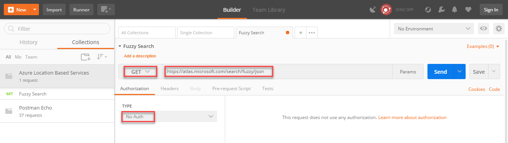
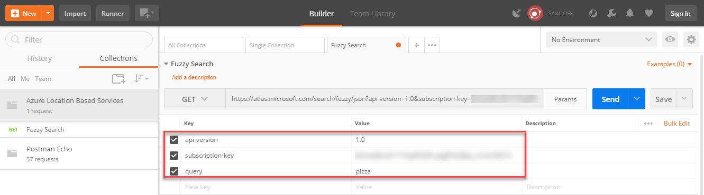
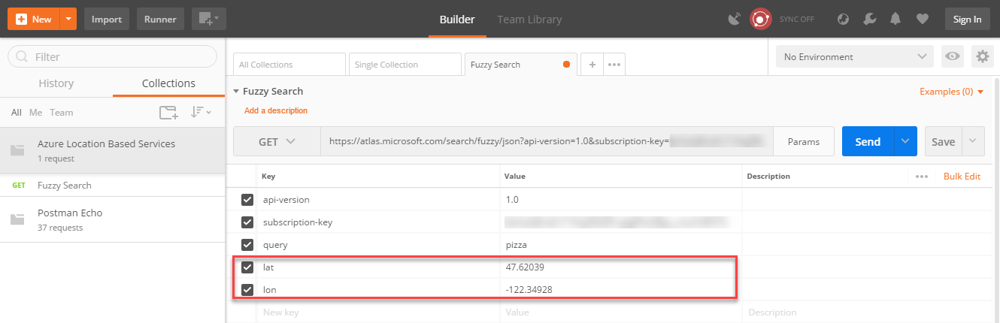
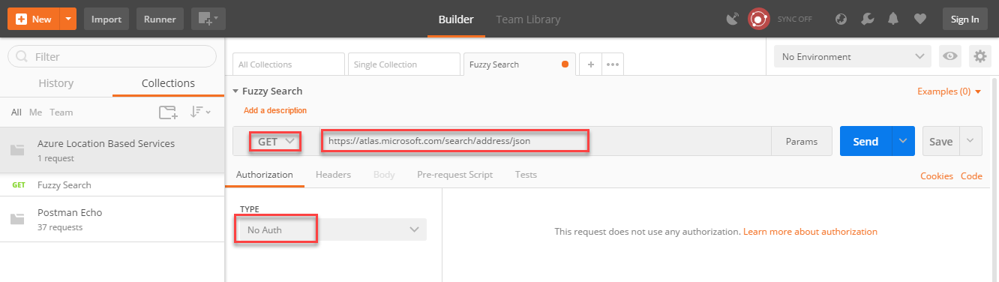
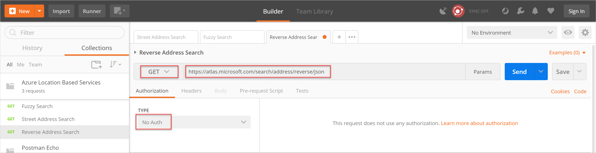
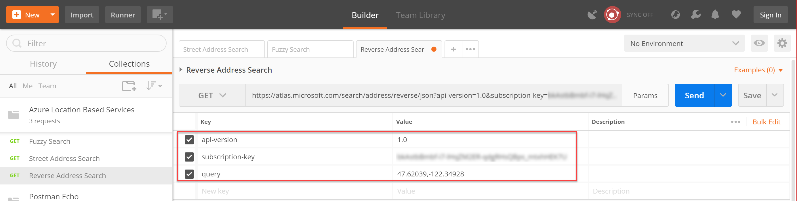

# Find an address using the Azure Maps search service

The Maps search service is a set of RESTful APIs designed for developers. The service can search for addresses, places, points of interest, business listings, and other geographic information. Each of the following have a latitude and longitude values: a specific address, cross street, geographic feature, or a point of interest (POI). You may use the returned Latitude and longitude values from a query as parameters in other Map services. For example, the returned values can become parameters for route service or the traffic flow service. 

Let's learn, how to:

* Search for an address using [Fuzzy Search API](https://docs.microsoft.com/rest/api/maps/search/getsearchfuzzy)
* Search for an address along with properties and coordinates
* Make a [Reverse Address Search](https://docs.microsoft.com/rest/api/maps/search/getsearchaddressreverse) to search for a street address
* Search for a cross street using [Search Address Reverse Cross Street API](https://docs.microsoft.com/rest/api/maps/search/getsearchaddressreversecrossstreet)

## Prerequisites

To make any calls to the Maps service APIs, you need a Maps account and a key. To make an account for Azure Maps, follow instructions in [Create an account](quick-demo-map-app.md#create-an-account-with-azure-maps). Follow steps in [get primary key](quick-demo-map-app.md#get-the-primary-key-for-your-account), if you need help with obtaining your primary key. For more information on authentication in Azure Maps, see [manage authentication in Azure Maps](./how-to-manage-authentication.md).

This article uses the [Postman app](https://www.getpostman.com/apps) to build REST calls. You can use any API development environment that you prefer.

## Using fuzzy search

The default API for the search service is [fuzzy search](https://docs.microsoft.com/rest/api/maps/search/getsearchfuzzy). This service is useful when you are not sure of the user input format in a search query. The API combines POI search and geocoding into a canonical 'single-line search'. For example, the API can handle inputs of any address or POI token combination. Also, it can be weighted with a contextual position (lat./lon. pair), fully constrained by a coordinate and radius, or executed more generally without any geo biasing anchor point.

Most Search queries default to `maxFuzzyLevel=1` to gain performance and reduce unusual results. This default can be overridden as needed per request by passing in the query parameter `maxFuzzyLevel=2` or `3`.

### Search for an address using Fuzzy Search

1. Open the Postman app, click New | Create New, and select **GET request**. Enter a Request name of **Fuzzy search**, select a collection or folder to save it to, and click **Save**.

2. On the Builder tab, select the **GET** HTTP method and enter the request URL for your API endpoint.

    

    | Parameter | Suggested value |
    |---------------|------------------------------------------------|
    | HTTP method | GET |
    | Request URL | [https://atlas.microsoft.com/search/fuzzy/json?](https://atlas.microsoft.com/search/fuzzy/json?) |
    | Authorization | No Auth |

    The **json** attribute in the URL path determines the response format. This article uses json for ease of use and readability. You can find the available response formats in the **Get Search Fuzzy** definition of the [Maps Functional API reference](https://docs.microsoft.com/rest/api/maps/search/getsearchfuzzy).

3. Click **Params**, and enter the following Key / Value pairs to use as query or path parameters in the request URL:

    

    | Key | Value |
    |------------------|-------------------------|
    | api-version | 1.0 |
    | subscription-key | \<your Azure Maps key\> |
    | query | pizza |

4. Click **Send** and review the response body.

    The ambiguous query string for "pizza" returned 10 [point of interest result](https://docs.microsoft.com/rest/api/maps/search/getsearchpoi#searchpoiresponse) (POI) in both the "pizza" and "restaurant" categories. Each result returns a street address, latitude and longitude values, view port, and entry points for the location.
  
    The results are varied for this query, not tied to any particular reference location. You can use the **countrySet** parameter to specify only the countries/regions for which your application needs coverage. The default behavior is to search the entire world, potentially returning unnecessary results.

5. Add the following Key / Value pair to the **Params** section and click **Send**:

    | Key | Value |
    |------------------|-------------------------|
    | countrySet | US |
  
    The results are now bounded by the country code and the query returns pizza restaurants in the United States.
  
    To provide results for a location, you can query a point of interest and use the returned latitude and longitude values in your call to the Fuzzy Search service. In this case, you used the Search service to return the location of the Seattle Space Needle and used the lat. / lon. values to orient the search.
  
6. In Params, enter the following Key / Value pairs and click **Send**:

    
  
    | Key | Value |
    |-----|------------|
    | lat | 47.620525 |
    | lon | -122.349274 |

## Search for address properties and coordinates

You can pass a complete or partial street address to the search address API. You still receive a response that includes detailed address properties. Detailed address properties are values like positional values in altitude and longitude, municipality, or subdivision.

1. In Postman, click **New Request** | **GET request** and name it **Address Search**.
2. On the Builder tab, select the **GET** HTTP method, enter the request URL for your API endpoint, and select an authorization protocol, if any.

    
  
    | Parameter | Suggested value |
    |---------------|------------------------------------------------|
    | HTTP method | GET |
    | Request URL | [https://atlas.microsoft.com/search/address/json?](https://atlas.microsoft.com/search/address/json?) |
    | Authorization | No Auth |

3. Click **Params**, and enter the following Key / Value pairs to use as query or path parameters in the request URL:
  
    
  
    | Key | Value |
    |------------------|-------------------------|
    | api-version | 1.0 |
    | subscription-key | \<your Azure Maps key\> |
    | query | 400 Broad St, Seattle, WA 98109 |
  
4. Click **Send** and review the response body.
  
    In this case, you specified a complete address query and receive a single result in the response body.
  
5. In Params, edit the query string to the following value:
    ```plaintext
        400 Broad, Seattle
    ```

6. Add the following Key / Value pair to the **Params** section and click **Send**:

    | Key | Value |
    |-----|------------|
    | typeahead | true |

    The **typeahead** flag tells the Address Search API to treat the query as a partial input and return an array of predictive values.

## Search for a street address using Reverse Address Search

1. In Postman, click **New Request** | **GET request** and name it **Reverse Address Search**.

2. On the Builder tab, select the **GET** HTTP method and enter the request URL for your API endpoint.
  
    
  
    | Parameter | Suggested value |
    |---------------|------------------------------------------------|
    | HTTP method | GET |
    | Request URL | [https://atlas.microsoft.com/search/address/reverse/json?](https://atlas.microsoft.com/search/address/reverse/json?) |
    | Authorization | No Auth |
  
3. Click **Params**, and enter the following Key / Value pairs to use as query or path parameters in the request URL:
  
    
  
    | Key | Value |
    |------------------|-------------------------|
    | api-version | 1.0 |
    | subscription-key | \<your Azure Maps key\> |
    | query | 47.591180,-122.332700 |
  
4. Click **Send** and review the response body.

    The response includes key address information about Safeco Field.
  
5. Add the following Key / Value pair to the **Params** section and click **Send**:

    | Key | Value |
    |-----|------------|
    | number | true |

    If the [number](https://docs.microsoft.com/rest/api/maps/search/getsearchaddressreverse) query parameter is sent with the request, the response may include the side of the street (Left or Right) and also an offset position for that number.
  
6. Add the following Key / Value pair to the **Params** section and click **Send**:

    | Key | Value |
    |-----|------------|
    | returnSpeedLimit | true |
  
    When the [returnSpeedLimit](https://docs.microsoft.com/rest/api/maps/search/getsearchaddressreverse) query parameter is set, the response returns the posted speed limit.

7. Add the following Key / Value pair to the **Params** section and click **Send**:

    | Key | Value |
    |-----|------------|
    | returnRoadUse | true |

    When the [returnRoadUse](https://docs.microsoft.com/rest/api/maps/search/getsearchaddressreverse) query parameter is set, the response returns the road use array for reverse geocodes at street level.

8. Add the following Key / Value pair to the **Params** section and click **Send**:

    | Key | Value |
    |-----|------------|
    | roadUse | true |

    You can restrict the reverse geocode query to a specific type of road use the [roadUse](https://docs.microsoft.com/rest/api/maps/search/getsearchaddressreverse) query parameter.
  
## Search for the cross street using Reverse Address Cross Street Search

1. In Postman, click **New Request** | **GET request** and name it **Reverse Address Cross Street Search**.

2. On the Builder tab, select the **GET** HTTP method and enter the request URL for your API endpoint.
  
    
  
    | Parameter | Suggested value |
    |---------------|------------------------------------------------|
    | HTTP method | GET |
    | Request URL | [https://atlas.microsoft.com/search/address/reverse/crossstreet/json?](https://atlas.microsoft.com/search/address/reverse/crossstreet/json?) |
    | Authorization | No Auth |
  
3. Click **Params**, and enter the following Key / Value pairs to use as query or path parameters in the request URL:
  
    | Key | Value |
    |------------------|-------------------------|
    | api-version | 1.0 |
    | subscription-key | \<your Azure Maps key\> |
    | query | 47.591180,-122.332700 |
  
4. Click **Send** and review the response body.

## Next steps

- Explore the [Azure Maps search service](https://docs.microsoft.com/rest/api/maps/search) API documentation.
