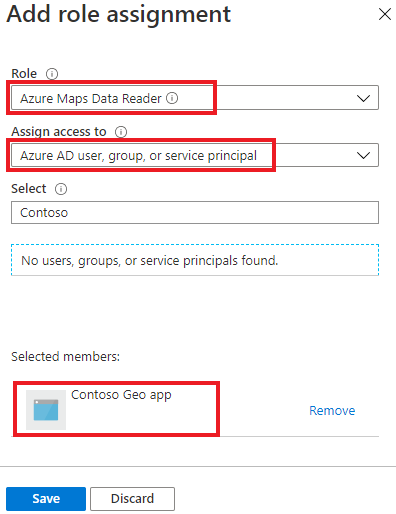

# Secure a daemon application

The following guide is for background processes, timers, and jobs which are hosted in a trusted and secured environment. Examples include Azure Web Jobs, Azure Function Apps, Windows Services, and any other reliable background service.

> [!Tip]
> Microsoft recommends implementing Azure Active Directory (Azure AD) and Azure role-based access control (Azure RBAC) for production applications. For an overview of concepts, see [Azure Maps Authentication](./azure-maps-authentication.md).

[!INCLUDE [authentication details](./includes/view-authentication-details.md)]

## Scenario: Shared key authentication

After you create an Azure Maps account, the primary and secondary keys are generated. We recommend that you use the primary key as the subscription key when you [use shared key authentication to call Azure Maps](./azure-maps-authentication.md#shared-key-authentication). You can use a secondary key in scenarios such as rolling key changes. For more information, see [Authentication in Azure Maps](./azure-maps-authentication.md).

### Securely store shared key

The primary and secondary key allow authorization to all APIs for the Maps account. Applications should store the keys in a secure store such as Azure Key Vault. The application must retrieve the shared key as a Azure Key Vault secret to avoid storing the shared key in plain text in application configuration. To understand how to configure an Azure Key Vault, see [Azure Key Vault developer guide](../key-vault/general/developers-guide.md).

The following steps outline this process:

1. Create an Azure Key Vault.
2. Create an Azure AD service principal by creating an App registration or managed identity, the created principal is responsible to access Azure Key Vault.
3. Assign the service principal access to Azure Key secrets `Get` permission.
4. Temporarily assign access to secrets `Set` permission for you as the developer.
5. Set the shared key in the Key Vault secrets and reference the secret ID as configuration for the daemon application and remove your secrets `Set` permission.
6. Implement Azure AD authentication in the daemon application to retrieve the shared key secret from Azure Key Vault.
7. Create Azure Maps REST API request with shared key.

> [!Tip]
> If the app is hosted in Azure environment, you should implement a Managed Identity to reduce the cost and complexity of managing a secret to authenticate to Azure Key Vault. See the following Azure Key Vault [tutorial to connect via managed identity](../key-vault/general/tutorial-net-create-vault-azure-web-app.md).

The daemon application is responsible for retrieving the shared key from a secure storage. The implementation with Azure Key Vault requires authentication through Azure AD to access the secret. Instead, we encourage direct Azure AD authentication to Azure Maps as a result of the additional complexity and operational requirements of using shared key authentication.

> [!IMPORTANT]
> To simplify key regeneration, we recommend applications use one key at a time. Applications can then regenerate the unused key and deploy the new regenerated key to a secured secret store such as Azure Key Vault.

## Scenario: Azure AD role-based access control

Once an Azure Maps account is created, the Azure Maps `x-ms-client-id` value is present in the Azure portal authentication details page. This value represents the account which will be used for REST API requests. This value should be stored in application configuration and retrieved prior to making HTTP requests. The objective of the scenario is to enable the daemon application to authenticate to Azure AD and call Azure Maps REST APIs.

> [!Tip]
> We recommend hosting on Azure Virtual Machines, Virtual Machine Scale Sets, or App Services to enable benefits of Managed Identity components.

### Daemon hosted on Azure resources

When running on Azure resources, configure Azure managed identities to enable low cost, minimal credential management effort. 

See [Overview of Managed Identities](../active-directory/managed-identities-azure-resources/overview.md) to enable the application access to a Managed Identity.

Managed Identity benefits:

* Azure system managed X509 certificate public key cryptography authentication.
* Azure AD security with X509 certificates instead of client secrets.
* Azure manages and renews all certificates associated with the Managed Identity resource.
* Simplified credential operational management by removing any need for a secured secret store service like Azure Key Vault. 

### Daemon hosted on non-Azure resources

When running on a non-Azure environment Managed Identities are not available. Therefore you must configure a service principal through an Azure AD application registration for the daemon application.

1. In the Azure portal, in the list of Azure services, select **Azure Active Directory** > **App registrations** > **New registration**.  

    > [!div class="mx-imgBorder"]
    > 

2. If you've already registered your app, then continue to the next step. If you haven't registered your app, then enter a **Name**, choose a **Support account type**, and then select **Register**.  

    > [!div class="mx-imgBorder"]
    > 

3. To assign delegated API permissions to Azure Maps, go to the application. Then under **App registrations**, select **API permissions** > **Add a permission**. Under **APIs my organization uses**, search for and select **Azure Maps**.

    > [!div class="mx-imgBorder"]
    > 

4. Select the check box next to **Access Azure Maps**, and then select **Add permissions**.

    > [!div class="mx-imgBorder"]
    > 

5. Complete the following steps to create a client secret or configure certificate.

    * If your application uses server or application authentication, then on your app registration page, go to **Certificates & secrets**. Then either upload a public key certificate or create a password by selecting **New client secret**.

        > [!div class="mx-imgBorder"]
        > 

    * After you select **Add**, copy the secret and store it securely in a service such as Azure Key Vault. Review [Azure Key Vault Developer Guide](../key-vault/general/developers-guide.md) to securely store the certificate or secret. You'll use this secret to get tokens from Azure AD.

        > [!div class="mx-imgBorder"]
        > 

### Grant role-based access for the daemon application to Azure Maps

You grant *Azure role-based access control (Azure RBAC)* by assigning either the created Managed Identity or the service principal to one or more Azure Maps role definitions. To view Azure role definitions that are available for Azure Maps, go to **Access control (IAM)**. Select **Roles**, and then search for roles that begin with *Azure Maps*. These Azure Maps roles are the roles that you can grant access to.

> [!div class="mx-imgBorder"]
> 

1. Go to your **Azure Maps Account**. Select **Access control (IAM)** > **Role assignments**.

    > [!div class="mx-imgBorder"]
    > 

2. On the **Role assignments** tab, **Add** a role assignment. 

    > [!div class="mx-imgBorder"]
    > 

3. Select a built-in Azure Maps role definition such as **Azure Maps Data Reader** or **Azure Maps Data Contributor**. Under **Assign access to**, select **Azure AD user, group, or service principal** or Managed Identity with **User assigned managed identity** / **System assigned Managed identity**. Select the principal. Then select **Save**.

    > [!div class="mx-imgBorder"]
    > 

4. You can confirm the role assignment was applied on the role assignment tab.

## Request token with Managed Identity

Once a managed identity is configured for the hosting resource, use Azure SDK or REST API to acquire a token for Azure Maps, see details on [Acquire an access token](../active-directory/managed-identities-azure-resources/how-to-use-vm-token.md). Following the guide, the expectation is that an access token will be returned which can be used on REST API requests.

## Request token with application registration

After you register your app and associate it with Azure Maps, you can request access tokens.

* Azure AD resource ID `https://atlas.microsoft.com/`
* Azure AD App ID
* Azure AD Tenant ID
* Azure AD App registration client secret

Request:

```http
POST /<Azure AD Tenant ID>/oauth2/token HTTP/1.1
Host: login.microsoftonline.com
Content-Type: application/x-www-form-urlencoded

client_id=<Azure AD App ID>&resource=https://atlas.microsoft.com/&client_secret=<client secret>&grant_type=client_credentials
```

Response:

```json
{
    "token_type": "Bearer",
    "expires_in": "...",
    "ext_expires_in": "...",
    "expires_on": "...",
    "not_before": "...",
    "resource": "https://atlas.microsoft.com/",
    "access_token": "ey...gw"
}
```

See [Authentication scenarios for Azure AD](../active-directory/develop/authentication-vs-authorization.md), for more detailed examples.

## Next steps

Find the API usage metrics for your Azure Maps account:
> [!div class="nextstepaction"]
> [View usage metrics](how-to-view-api-usage.md)

Explore samples that show how to integrate Azure AD with Azure Maps:
> [!div class="nextstepaction"]
> [Azure Maps samples](https://github.com/Azure-Samples/Azure-Maps-AzureAD-Samples)