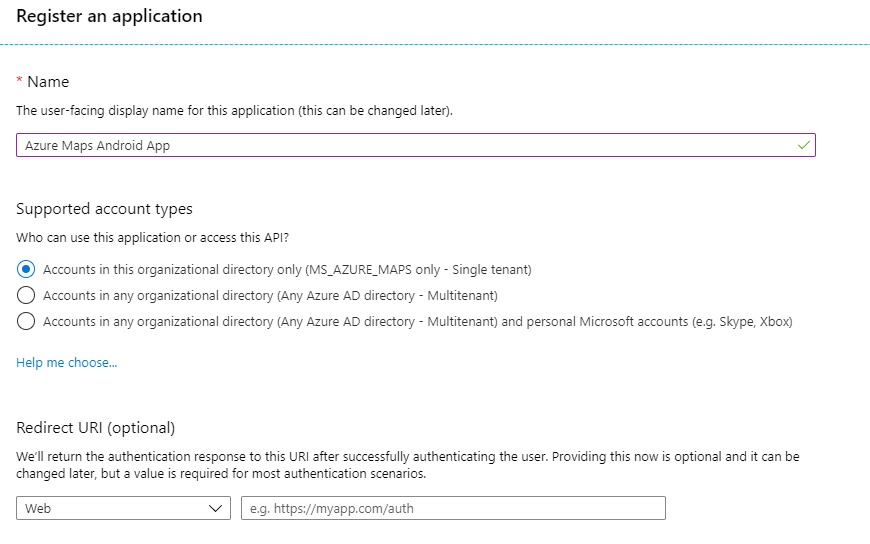
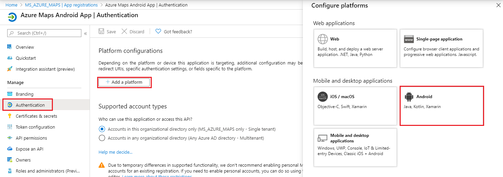
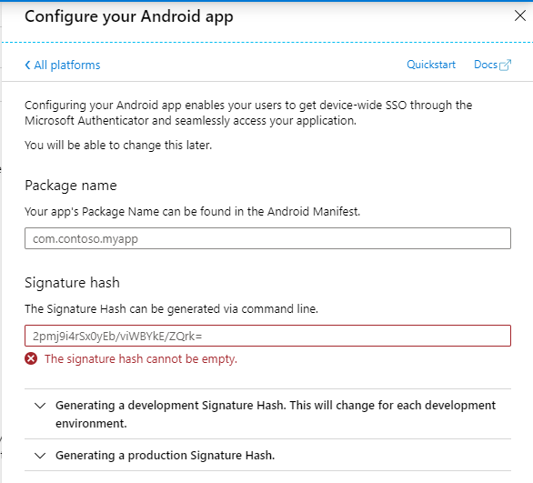

# Secure a mobile applications with user sign-in

Depending on the application requirements, a mobile application may require a user sign-in experience to access protected application data with Azure AD. The application may call additional web services as well as Azure Maps REST APIs. The device may be hosted on an unsecured environment such that they cannot store an application secret.

> [!IMPORTANT]
> To keep applications secure, we recommend using Microsoft's Identity Platform SDKs or leveraging Azure Maps SDKs to prevent attack vectors and ensure proper protocols like Proof Key Code Exchange (PKCE) are implemented.

[!INCLUDE [authentication details](./includes/view-auth-details.md)]

## Create an Android application registration in Azure AD

You must create the public native application in Azure AD for users to sign in. This application will then delegate user access to Azure Maps REST APIs. If you already have enabled a sign-in experience for a mobile application then an **existing application registration** can be used and modified to access Azure Maps REST APIs.

> [!NOTE]
> * **Prerequisite Reading:** [Scenario: Mobile application that calls web APIs](https://docs.microsoft.com/azure/active-directory/develop/scenario-mobile-overview)
> * Microsoft Identity Platform Android Documentation can provide a great starter for integrating sign-in experience.
> * Use the following steps to call Azure Maps REST APIs from within Android applications.

1. In the Azure portal, in the list of Azure services, select **Azure Active Directory** > **App registrations** > **New registration**. Enter a **Name**, choose Accounts in this organizational directory only for **Support account types**.  

    

2. Select **Authentication** > **Add platform** > **Android** to start configuring authentication for an Android application. There are other options which are available to configure for platforms such as iOS, macOS, Windows, and more. 

    

3. Add the Android package name which is found in the Android Manifest. Secondly, generate a development signature hash using the provided tooling listed in the Azure AD Portal.

    > [!IMPORTANT]
    > Be sure to revisit signature hash generation, step to create a production hash when the application is ready to be released to production.
    
    
4. Insert the configuration into your Android application, by following the provided [Android Azure AD tutorial](https://docs.microsoft.com/azure/active-directory/develop/tutorial-v2-android). **Calling Microsoft Graph API is not a necessary step** in the Azure AD tutorial because the application will call Azure Maps REST APIs. 

    

5.  To assign delegated API permissions to Azure Maps, go to the application. Then select **API permissions** > **Add a permission**. Under **APIs my organization uses**, search for and select **Azure Maps**.

    

6. Select the check box next to **Access Azure Maps**, and then select **Add permissions**.

    
   
7. Include the Azure Maps Android SDK into the application. Follow the [getting started with Azure Maps Android SDK](./how-to-use-android-map-control-library.md).

8. Replace subscription key code with Azure Maps Android SDK option for Azure AD. 

```java
    package com.example.myapplication;

    import androidx.appcompat.app.AppCompatActivity;
    import com.microsoft.azure.maps.mapcontrol.AzureMaps;
    import com.microsoft.azure.maps.mapcontrol.MapControl;
    import com.microsoft.azure.maps.mapcontrol.layer.SymbolLayer;
    import com.microsoft.azure.maps.mapcontrol.options.MapStyle;
    import com.microsoft.azure.maps.mapcontrol.source.DataSource;

    public class MainActivity extends AppCompatActivity {
        
        static {
            String clientId = "<Azure Maps Client Id>";
            String aadAppId = "<Azure AD App Id>";
            String aadTenant = "<Azure AD Tenant>";

            // AzureMaps.setSubscriptionKey("..."); <--- remove this code
            AzureMaps.setAadProperties(clientId, aadAppId, aadTenant);
        }

        // Omitted rest of MainActivity for brevity
```  

9.  Configure Azure role based access control for users or groups. See the [following sections to enable RBAC](#grant-role-based-access-for-users-to-azure-maps).

[!INCLUDE [grant role access to users](./includes/grant-rbac-users.md)]

## Next steps

Further understanding of Mobile Application Scenarios:
> [!div class="nextstepaction"]
> [Scenario: Mobile application that calls web APIs](https://docs.microsoft.com/azure/active-directory/develop/scenario-mobile-app-configuration)

Find more information on Android SDK:
> [!div class="nextstepaction"]
> [Getting started with Azure Maps Android SDK](https://docs.microsoft.com/azure/azure-maps/how-to-use-android-map-control-library)
