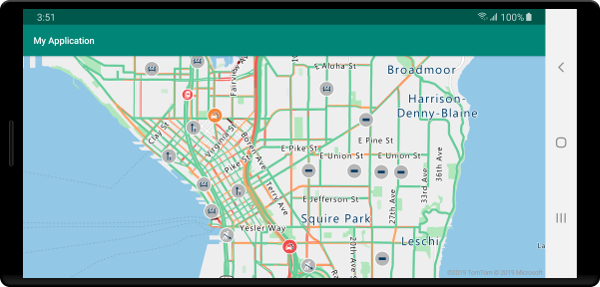
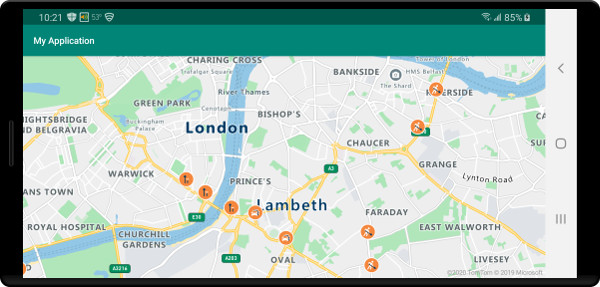

# Show traffic data on the map (Android SDK)

Flow data and incidents data are the two types of traffic data that can be displayed on the map. This guide shows you how to display both types of traffic data. Incidents data consists of point and line-based data for things such as constructions, road closures, and accidents. Flow data shows metrics about the flow of traffic on the road.

## Prerequisites

Be sure to complete the steps in the [Quickstart: Create an Android app](quick-android-map.md) document. Code blocks in this article can be inserted into the maps `onReady` event handler.

## Show traffic on the map

There are two types of traffic data available in Azure Maps:

- Incident data - consists of point and line-based data for things such as construction, road closures, and accidents.
- Flow data - provides metrics on the flow of traffic on the roads. Often, traffic flow data is used to color the roads. The colors are based on how much traffic is slowing down the flow, relative to the speed limit, or another metric. There are four values that can be passed into the traffic `flow` option of the map.

    |Flow enum | Description|
    | :-- | :-- |
    | `TrafficFlow.NONE` | Doesn't display traffic data on the map |
    | `TrafficFlow.RELATIVE` | Shows traffic data that's relative to the free-flow speed of the road |
    | `TrafficFlow.RELATIVE_DELAY` | Displays areas that are slower than the average expected delay |
    | `TrafficFlow.ABSOLUTE` | Shows the absolute speed of all vehicles on the road |

The following code shows how to display traffic data on the map.

::: zone pivot="programming-language-java-android"

```java
//Show traffic on the map using the traffic options.
map.setTraffic(
    incidents(true),
    flow(TrafficFlow.RELATIVE)
);
```

::: zone-end

::: zone pivot="programming-language-kotlin"

```kotlin
map.setTraffic(
    incidents(true),
    flow(TrafficFlow.RELATIVE)
)
```

::: zone-end

The following screenshot shows the above code rendering real-time traffic information on the map.



## Get traffic incident details

Details about a traffic incident are available within the properties of the feature used to display the incident on the map. Traffic incidents are added to the map using the Azure Maps traffic incident vector tile service. The format of the data in these vector tiles if [documented here](https://developer.tomtom.com/traffic-api/traffic-api-documentation-traffic-incidents/vector-incident-tiles). The following code adds a click event to the map and retrieves the traffic incident feature that was clicked and displays a toast message with some of the details.

::: zone pivot="programming-language-java-android"

```java
//Show traffic information on the map.
map.setTraffic(
    incidents(true),
    flow(TrafficFlow.RELATIVE)
);

//Add a click event to the map.
map.events.add((OnFeatureClick) (features) -> {

    if (features != null && features.size() > 0) {
        Feature incident = features.get(0);

        //Ensure that the clicked feature is an traffic incident feature.
        if (incident.properties() != null && incident.hasProperty("incidentType")) {

            StringBuilder sb = new StringBuilder();
            String incidentType = incident.getStringProperty("incidentType");

            if (incidentType != null) {
                sb.append(incidentType);
            }

            if (sb.length() > 0) {
                sb.append("\n");
            }

            //If the road is closed, find out where it is closed from.
            if ("Road Closed".equals(incidentType)) {
                String from = incident.getStringProperty("from");

                if (from != null) {
                    sb.append(from);
                }
            } else {
                //Get the description of the traffic incident.
                String description = incident.getStringProperty("description");

                if (description != null) {
                    sb.append(description);
                }
            }

            String message = sb.toString();

            if (message.length() > 0) {
                Toast.makeText(this, message, Toast.LENGTH_LONG).show();
            }
        }
    }
});
```

::: zone-end

::: zone pivot="programming-language-kotlin"

```kotlin
//Show traffic information on the map.
map.setTraffic(
    incidents(true),
    flow(TrafficFlow.RELATIVE)
)

//Add a click event to the map.
map.events.add(OnFeatureClick { features: List<Feature>? ->
    if (features != null && features.size > 0) {
        val incident = features[0]

        //Ensure that the clicked feature is an traffic incident feature.
        if (incident.properties() != null && incident.hasProperty("incidentType")) {
            val sb = StringBuilder()
            val incidentType = incident.getStringProperty("incidentType")

            if (incidentType != null) {
                sb.append(incidentType)
            }

            if (sb.length > 0) {
                sb.append("\n")
            }

            //If the road is closed, find out where it is closed from.
            if ("Road Closed" == incidentType) {
                val from = incident.getStringProperty("from")
                if (from != null) {
                    sb.append(from)
                }
            } else { //Get the description of the traffic incident.
                val description = incident.getStringProperty("description")
                if (description != null) {
                    sb.append(description)
                }
            }

            val message = sb.toString()
            if (message.length > 0) {
                Toast.makeText(this, message, Toast.LENGTH_LONG).show()
            }
        }
    }
})
```

::: zone-end

The following screenshot shows the above code rendering real-time traffic information on the map with a toast message displaying incident details.


## Filter traffic incidents

On a typical day in most major cities, there can be an overwhelming number of traffic incidents, however, depending on your scenario, it may be desirable to filter and display a subset of these incidents. When setting traffic options, there are `incidentCategoryFilter` and `incidentMagnitudeFilter` options that take in an array of incident categories or magnitude enumerators or string values.

The following table shows all the traffic incident categories that can be used within the `incidentCategoryFilter` option.

| Category enum | String value | Description |
|--------------------|--------------|-------------|
| `IncidentCategory.UNKNOWN` | `"unknown"` | An incident that either doesn't fit any of the defined categories or hasn't yet been classified. |
| `IncidentCategory.ACCIDENT` | `"accident"` | Traffic accident. |
| `IncidentCategory.FOG` | `"fog"` | Fog that reduces visibility, likely reducing traffic flow, and possibly increasing the risk of an accident. |
| `IncidentCategory.DANGEROUS_CONDITIONS` | `"dangerousConditions"` | Dangerous situation on the road, such as an object on the road. |
| `IncidentCategory.RAIN` | `"rain"` | Heavy rain that may be reducing visibility, making driving conditions difficult, and possibly increasing the risk of an accident. |
| `IncidentCategory.ICE` | `"ice"` | Icy road conditions that may make driving difficult or dangerous. |
| `IncidentCategory.JAM` | `"jam"` | Traffic jam resulting in slower moving traffic. |
| `IncidentCategory.LANE_CLOSED` | `"laneClosed"` | A road lane is closed. |
| `IncidentCategory.ROAD_CLOSED` | `"roadClosed"` | A road is closed. |
| `IncidentCategory.ROAD_WORKS` | `"roadWorks"` | Road works/construction in this area. |
| `IncidentCategory.WIND` | `"wind"` | High winds that may make driving difficult for vehicles with a large side profile or high center of gravity. |
| `IncidentCategory.FLOODING` | `"flooding"` | Flooding occurring on road. |
| `IncidentCategory.DETOUR` | `"detour"` | Traffic being directed to take a detour. |
| `IncidentCategory.CLUSTER` | `"cluster"` | A cluster of traffic incidents of different categories. Zooming in the map results in the cluster breaking apart into its individual incidents. |
| `IncidentCategory.BROKEN_DOWN_VEHICLE` | `"brokenDownVehicle"` | Broken down vehicle on or beside road. |

The following table shows all the traffic incident magnitudes that can be used within the `incidentMagnitudeFilter` option.

| Magnitude enum | String value | Description |
|--------------------|--------------|-------------|
| `IncidentMagnitude.UNKNOWN` | `"unknown"` | An incident who's magnitude hasn't yet been classified. |
| `IncidentMagnitude.MINOR` | `"minor"` | A minor traffic issue that is often just for information and has minimal impact to traffic flow. |
| `IncidentMagnitude.MODERATE` | `"moderate"` | A moderate traffic issue that has some impact on traffic flow. |
| `IncidentMagnitude.MAJOR` | `"major"` |  A major traffic issue that has a significant impact to traffic flow. |

The following filters traffic incidents such that only moderate traffic jams and incidents with dangerous conditions are displayed on the map.

::: zone pivot="programming-language-java-android"

``` java
map.setTraffic(
    incidents(true),
    incidentMagnitudeFilter(new String[] { IncidentMagnitude.MODERATE }),
    incidentCategoryFilter(new String[] { IncidentCategory.DANGEROUS_CONDITIONS, IncidentCategory.JAM })              
);
```

::: zone-end

::: zone pivot="programming-language-kotlin"

```kotlin
map.setTraffic(
    incidents(true),
    incidentMagnitudeFilter(*arrayOf(IncidentMagnitude.MODERATE)),
    incidentCategoryFilter(
        *arrayOf(
            IncidentCategory.DANGEROUS_CONDITIONS,
            IncidentCategory.JAM
        )
    )
)
```

::: zone-end

The following screenshot shows a map of moderate traffic jams and incidents with dangerous conditions.



> [!NOTE]
> Some traffic incidents may have multiple categories assigned to them. If an incident has any category that matches any option passed into `incidentCategoryFilter`, it will be displayed. The primary incident category may be different from the categories specified in the filter and thus display a different icon.

## Next steps

View the following guides to learn how to add more data to your map:

> [!div class="nextstepaction"]
> [Add a tile layer](how-to-add-tile-layer-android-map.md)
