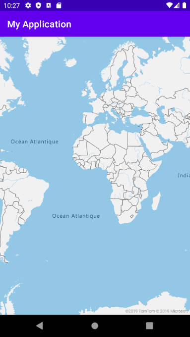

# Get started with Azure Maps Android SDK

The Azure Maps Android SDK is a vector map library for Android. This article guides you through the processes of installing the Azure Maps Android SDK and loading a map.

## Prerequisites

Be sure to complete the steps in the [Quickstart: Create an Android app](quick-android-map.md) article.

## Localizing the map

The Azure Maps Android SDK provides three ways to set the language and regional view of the map. The following code shows how to set the language to French ("fr-FR") and the regional view to "Auto".

1. Pass the language and regional view information into the `AzureMaps` class using the static `setLanguage` and `setView` properties. This sets the default language and regional view properties in your app.

    ::: zone pivot="programming-language-java-android"

    ```java
    static {
        //Alternatively use Azure Active Directory authenticate.
        AzureMaps.setAadProperties("<Your aad clientId>", "<Your aad AppId>", "<Your aad Tenant>");
    
        //Set your Azure Maps Key.
        //AzureMaps.setSubscriptionKey("<Your Azure Maps Key>");   
    
        //Set the language to be used by Azure Maps.
        AzureMaps.setLanguage("fr-FR");
    
        //Set the regional view to be used by Azure Maps.
        AzureMaps.setView("Auto");
    }
    ```

    ::: zone-end

    ::: zone pivot="programming-language-kotlin"

    ```kotlin
    companion object {
        init {
            //Alternatively use Azure Active Directory authenticate.
            AzureMaps.setAadProperties("<Your aad clientId>", "<Your aad AppId>", "<Your aad Tenant>");
    
            //Set your Azure Maps Key.
            //AzureMaps.setSubscriptionKey("<Your Azure Maps Key>");
        
            //Set the language to be used by Azure Maps.
            AzureMaps.setLanguage("fr-FR");
        
            //Set the regional view to be used by Azure Maps.
            AzureMaps.setView("Auto");
        }
    }
    ```

    ::: zone-end

1. You can also pass the language and regional view information to the map control XML.

    ```xml
    <com.azure.android.maps.control.MapControl
        android:id="@+id/myMap"
        android:layout_width="match_parent"
        android:layout_height="match_parent"
        app:azure_maps_language="fr-FR"
        app:azure_maps_view="Auto"
        />
    ```

1. The final way of programmatically setting the language and regional view properties uses the maps `setStyle` method. This can be done at any time to change the language and regional view of the map.

    ::: zone pivot="programming-language-java-android"

    ```java
    mapControl.onReady(map -> {
        map.setStyle(
            language("fr-FR"),
            view("Auto")
        );
    });
    ```

    ::: zone-end

    ::: zone pivot="programming-language-kotlin"

    ```kotlin
    mapControl.onReady(OnReady { map: AzureMap ->
        map.setStyle(
            language("fr-FR"),
            view("Auto")
        )
    })
    ```

    ::: zone-end

Here's an example of Azure Maps with the language set to "fr-FR" and regional view set to "Auto".



For a complete list of supported languages and regional views, see [Localization support in Azure Maps](supported-languages.md).

## Navigating the map

There are several different ways in which the map can be zoomed, panned, rotated, and pitched. The following details all the different ways to navigate the map.

### Zoom the map

* Touch the map with two fingers and pinch together to zoom out or spread the fingers apart to zoom in.
* Double tap the map to zoom in one level.
* Double tap with two fingers to zoom out the map one level.
* Tap twice; on second tap, hold your finger on the map and drag up to zoom in, or down to zoom out.

### Pan the map

* Touch the map and drag in any direction.

### Rotate the map

* Touch the map with two fingers and rotate.

### Pitch the map

* Touch the map with two fingers and drag them up or down together.

## Azure Government cloud support

The Azure Maps Android SDK supports the Azure Government cloud. The Azure Maps Android SDK is accessed from the same Maven repository. The following tasks need to be done to connect to the Azure Government cloud version of the Azure Maps platform.

In same place where the Azure Maps authentication details are specified, add the following line of code to tell the map to use the Azure Maps government cloud domain.

::: zone pivot="programming-language-java-android"

```java
AzureMaps.setDomain("atlas.azure.us");
```

::: zone-end

::: zone pivot="programming-language-kotlin"

```kotlin
AzureMaps.setDomain("atlas.azure.us")
```

::: zone-end

Be sure to use Azure Maps authentication details from the Azure Government cloud platform when authenticating the map and services.

## Migrating from a preview version

With the move from preview to general availability, some breaking changes were introduced into the Azure Maps Android SDK. The following are the key details:

* The maven identifier changed from `"com.microsoft.azure.maps:mapcontrol:0.7"` to `"com.azure.android:azure-maps-control:1.0.0"`. The namespace and major version number changed.
* The import namespace has changed from `com.microsoft.azure.maps.mapcontrol` to `com.azure.android.maps.control`
* Resource names for XML options, color resources, and image resources have had the text `mapcontrol_` replaced with `azure_maps_`.

    **Before:**

    ```xml
    <com.microsoft.azure.maps.mapcontrol.MapControl
        android:id="@+id/myMap"
        android:layout_width="match_parent"
        android:layout_height="match_parent"
        app:mapcontrol_language="fr-FR"
        app:mapcontrol_view="Auto"
        app:mapcontrol_centerLat="47.602806"
        app:mapcontrol_centerLng="-122.329330"
        app:mapcontrol_zoom="12"
    />
    ```

    **After:**

    ```xml
    <com.azure.android.maps.control.MapControl
        android:id="@+id/myMap"
        android:layout_width="match_parent"
        android:layout_height="match_parent"
        app:azure_maps_language="fr-FR"
        app:azure_maps_view="Auto"
        app:azure_maps_centerLat="47.602806"
        app:azure_maps_centerLng="-122.329330"
        app:azure_maps_zoom="12"
    />
    ```

## Next steps

Learn how to add overlay data on the map:

> [!div class="nextstepaction"]
> [Manage authentication in Azure Maps](how-to-manage-authentication.md)

> [!div class="nextstepaction"]
> [Change map styles in Android maps](set-android-map-styles.md)

> [!div class="nextstepaction"]
> [Add a symbol layer](how-to-add-symbol-to-android-map.md)

> [!div class="nextstepaction"]
> [Add a line layer](android-map-add-line-layer.md)

> [!div class="nextstepaction"]
> [Add a polygon layer](how-to-add-shapes-to-android-map.md)
