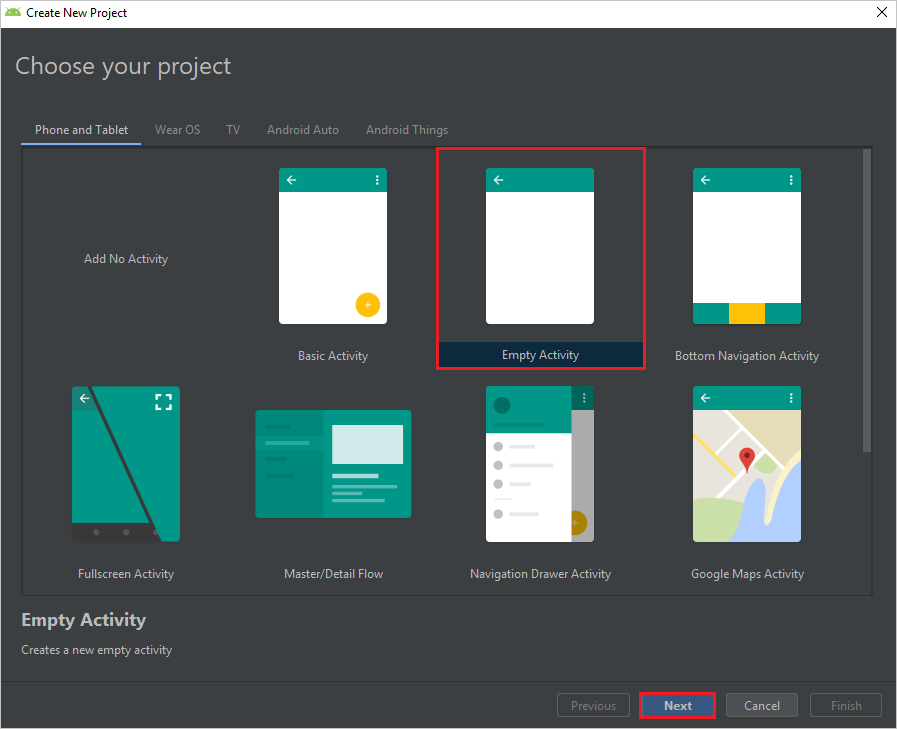
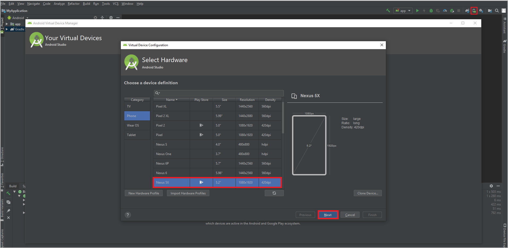
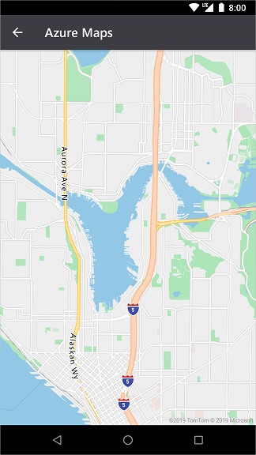

# Getting started with Azure Maps Android SDK

The Azure Maps Android SDK is a vector map library for Android. This article guides you through the processes of installing the Azure Maps Android SDK and loading a map.

## Prerequisites

### Create an Azure Maps account

To complete the procedures in this article, you first need to [Create an Azure Maps account](quick-demo-map-app.md#create-an-account-with-azure-maps) in the S1 pricing tier and [get primary key](quick-demo-map-app.md#get-the-primary-key-for-your-account) for your account.

For more information on authentication in Azure Maps, see [manage authentication in Azure Maps](./how-to-manage-authentication.md).

### Download Android Studio

Download Android Studio and create a project with an empty activity before you install the Azure Maps Android SDK. You can [download Android Studio](https://developer.android.com/studio/) for free from Google. 

## Create a project in Android Studio

First, create a new project with an empty activity. Complete these steps to create an Android Studio project:

1. Under **Choose your project**, select **Phone and Tablet**. Your application will run on this form factor.
2. On the **Phone and Tablet** tab, select **Empty  Activity**, and then select **Next**.
3. Under **Configure your project**, select `API 21: Android 5.0.0 (Lollipop)` as the minimum SDK. This is the earliest version supported by the Azure Maps Android SDK.
4. Accept the default `Activity Name` and `Layout Name` and select **Finish**.

See the [Android Studio documentation](https://developer.android.com/studio/intro/) for more help with installing Android Studio and creating a new project.



## Set up a virtual device

Android Studio lets you set up a virtual Android device on your computer. Doing so can help you test your application during development. To set up a virtual device, select the Android Virtual Device (AVD) Manager icon in the upper-right corner of your project screen, and then select **Create Virtual Device**. You can also get to the AVD Manager by selecting **Tools** > **Android** > **AVD Manager** from the toolbar. In the **Phones** category, select **Nexus 5X**, and then select **Next**.

You can learn more about setting up an AVD in the [Android Studio documentation](https://developer.android.com/studio/run/managing-avds).



## Install the Azure Maps Android SDK

The next step in building your application is to install the Azure Maps Android SDK. Complete these steps to install the SDK:

1. Open the top-level **build.gradle** file and add the following code to the **all projects**, **repositories** block section:

    ```
    maven {
            url "https://atlas.microsoft.com/sdk/android"
    }
    ```

2. Update your **app/build.gradle** and add the following code to it:
    
    1. Make sure that your project's **minSdkVersion** is at API 21 or higher.

    2. Add the following code to the Android section:

        ```
        compileOptions {
            sourceCompatibility JavaVersion.VERSION_1_8
            targetCompatibility JavaVersion.VERSION_1_8
        }
        ```
    3. Update your dependencies block and add a new implementation dependency line for the latest Azure Maps Android SDK:

        ```
        implementation "com.microsoft.azure.maps:mapcontrol:0.4"
        ```
    
    4. Go to **File** in the toolbar and then click on **Sync Project with Gradle Files**.
3. Add a map fragment to the main activity (res \> layout \> activity\_main.xml):
    
    ```XML
    <?xml version="1.0" encoding="utf-8"?>
    <FrameLayout
        xmlns:android="http://schemas.android.com/apk/res/android"
        xmlns:app="http://schemas.android.com/apk/res-auto"
        android:layout_width="match_parent"
        android:layout_height="match_parent"
        >

        <com.microsoft.azure.maps.mapcontrol.MapControl
            android:id="@+id/mapcontrol"
            android:layout_width="match_parent"
            android:layout_height="match_parent"
            />
    </FrameLayout>
    ```

4. In the **MainActivity.java** file you'll need to:
    
    * add imports for the Azure Maps SDK
    * set your Azure Maps authentication information
    * get the map control instance in the **onCreate** method

    Setting the authentication information on the `AzureMaps` class globally using the `setSubscriptionKey` or `setAadProperties` methods makes it so you won't have to add your authentication information on every view. 

    The map control contains its own lifecycle methods for managing Android's OpenGL lifecycle. These lifecycle methods must be called directly from the containing Activity. For your app to correctly call the map control's lifecycle methods, you must override the following lifecycle methods in the Activity that contains the map control. And, you must call the respective map control method. 

    * onCreate(Bundle) 
    * onStart() 
    * onResume() 
    * onPause() 
    * onStop() 
    * onDestroy() 
    * onSaveInstanceState(Bundle) 
    * onLowMemory() 

    Edit the **MainActivity.java** file as follows:
    
    ```java
    package com.example.myapplication;

    //For older versions use: import android.support.v7.app.AppCompatActivity; 
    import androidx.appcompat.app.AppCompatActivity;
    import com.microsoft.azure.maps.mapcontrol.AzureMaps;
    import com.microsoft.azure.maps.mapcontrol.MapControl;
    import com.microsoft.azure.maps.mapcontrol.layer.SymbolLayer;
    import com.microsoft.azure.maps.mapcontrol.options.MapStyle;
    import com.microsoft.azure.maps.mapcontrol.source.DataSource;

    public class MainActivity extends AppCompatActivity {
        
        static {
            AzureMaps.setSubscriptionKey("<Your Azure Maps subscription key>");
        }

        MapControl mapControl;

        @Override
        protected void onCreate(Bundle savedInstanceState) {
            super.onCreate(savedInstanceState);
            setContentView(R.layout.activity_main);

            mapControl = findViewById(R.id.mapcontrol);

            mapControl.onCreate(savedInstanceState);
    
            //Wait until the map resources are ready.
            mapControl.onReady(map -> {
                //Add your post map load code here.
    
            });
        }

        @Override
        public void onResume() {
            super.onResume();
            mapControl.onResume();
        }

        @Override
        protected void onStart(){
            super.onStart();
            mapControl.onStart();
        }

        @Override
        public void onPause() {
            super.onPause();
            mapControl.onPause();
        }

        @Override
        public void onStop() {
            super.onStop();
            mapControl.onStop();
        }

        @Override
        public void onLowMemory() {
            super.onLowMemory();
            mapControl.onLowMemory();
        }

        @Override
        protected void onDestroy() {
            super.onDestroy();
            mapControl.onDestroy();
        }

        @Override
        protected void onSaveInstanceState(Bundle outState) {
            super.onSaveInstanceState(outState);
            mapControl.onSaveInstanceState(outState);
        }
    }
    ```

## Import classes

After you complete the preceding steps, you'll probably get warnings from Android Studio about some of the code. To resolve these warnings, import the classes referenced in `MainActivity.java`.

You can automatically import these classes by selecting Alt+Enter (Option+Return on a Mac).

Select the run button, as shown in the following graphic (or press Control+R on a Mac), to build your application.


Android Studio will take a few seconds to build the application. After the build is complete, you can test your application in the emulated Android device. You should see a map like this one:

<center>

</center>

## Localizing the map

The Azure Maps Android SDK provides three different ways of setting the language and regional view of the map. The following code shows how to set the language to French ("fr-FR") and the regional view to "auto". 

The first option is to pass the language and view regional information into the `AzureMaps` class using the static `setLanguage` and `setView` methods globally. This will set the default language and regional view across all Azure Maps controls loaded in your app.

```Java
static {
    //Set your Azure Maps Key.
    AzureMaps.setSubscriptionKey("<Your Azure Maps Key>");

    //Set the language to be used by Azure Maps.
    AzureMaps.setLanguage("fr-FR");

    //Set the regional view to be used by Azure Maps.
    AzureMaps.setView("auto");
}
```

The second option is to pass the language and view information into the map control XML.

```XML
<com.microsoft.azure.maps.mapcontrol.MapControl
    android:id="@+id/myMap"
    android:layout_width="match_parent"
    android:layout_height="match_parent"
    app:mapcontrol_language="fr-FR"
    app:mapcontrol_view="auto"
    />
```

The third option is to programmatically set the language and regional view of the map using the maps `setStyle` method. This can be done at any time to change the language and regional view of the map.

```Java
mapControl.onReady(map -> {
    map.setStyle(StyleOptions.language("fr-FR"));
    map.setStyle(StyleOptions.view("auto"));
});
```

Here is an example of Azure Maps with the language set to "fr-FR" and regional view set to "auto".

<center>


</center>

A complete list of supported languages and regional views is documented [here](supported-languages.md).

## Navigating the map

There are several different ways in which the map can be zoomed, panned, rotated, and pitched. The following details all the different ways to navigate the map.

**Zoom the map**

- Touch the map with two fingers and pinch together to zoom out or spread the fingers apart to zoom in.
- Double tap the map to zoom in one level.
- Double tap with two fingers to zoom the map out one level.
- Tap twice; on second tap, hold your finger on the map and drag up to zoom in, or down to zoom out.

**Pan the map**

- Touch the map and drag in any direction.

**Rotate the map**

- Touch the map with two fingers and rotate.

**Pitch the map**

- Touch the map with two fingers and drag them up or down together.

## Next steps

Learn how to add overlay data on the map:

> [!div class="nextstepaction"]
> [Add a symbol layer to an Android map](how-to-add-symbol-to-android-map.md)

> [!div class="nextstepaction"]
> [Add shapes to an Android map](https://docs.microsoft.com/azure/azure-maps/how-to-add-shapes-to-android-map)

> [!div class="nextstepaction"]
> [Change map styles in Android maps](https://docs.microsoft.com/azure/azure-maps/set-android-map-styles)
