# Best practices for Azure Maps Route service

The Route Directions and Route Matrix APIs in Azure Maps [Route service] can be used to calculate the estimated arrival times (ETAs) for each requested route. Route APIs consider factors such as real-time traffic information and historic traffic data, like the typical road speeds on the requested day of the week and time of day. The APIs return the shortest or fastest routes available to multiple destinations at a time in sequence or in optimized order, based on time or distance. Users can also request specialized routes and details for walkers, bicyclists, and commercial vehicles like trucks. In this article, we'll share the best practices to call Azure Maps [Route service], and you'll learn how-to:

* Choose between the Route Directions APIs and the Matrix Routing API
* Request historic and predicted travel times, based on real-time and historical traffic data
* Request route details, like time and distance, for the entire route and each leg of the route
* Request route for a commercial vehicle, like a truck
* Request traffic information along a route, like jams and toll information
* Request a route that consists of one or more stops (waypoints)
* Optimize a route of one or more stops to obtain the best order to visit each stop (waypoint)
* Optimize alternative routes using supporting points. For example, offer alternative routes that pass an electric vehicle charging station.
* Use the [Route service] with the Azure Maps Web SDK

## Prerequisites

* An [Azure Maps account]
* A [subscription key]

For more information about the coverage of the Route service, see the [Routing Coverage].

This article uses the [Postman] application to build REST calls, but you can choose any API development environment.

## Choose between Route Directions and Matrix Routing

The Route Directions APIs return instructions including the travel time and the coordinates for a route path. The Route Matrix API lets you calculate the travel time and distances for a set of routes that are defined by origin and destination locations. For every given origin, the Matrix API calculates the cost (travel time and distance) of routing from that origin to every given destination. These API allow you to specify parameters such as the desired departure time, arrival times, and the vehicle type, like car or truck. They all use real-time or predictive traffic data accordingly to return the most optimal routes.

Consider calling Route Directions APIs if your scenario is to:

* Request the shortest or fastest driving route between two or more known locations, to get precise arrival times for your delivery vehicles.
* Request detailed route guidance, including route geometry, to visualize routes on the map
* Given a list of customer locations, calculate the shortest possible route to visit each customer location and return to the origin. This scenario is commonly known as the traveling salesman problem. You can pass up to 150 waypoints (stops) in one request.
* Send batches of queries to the Route Directions Batch API using just a single API call.

Consider calling Matrix Routing API if your scenario is to:

* Calculate the travel time or distance between a set of origins and destinations. For example, you have 12 drivers and you need to find the closest available driver to pick up the food delivery from the restaurant.
* Sort potential routes by their actual travel distance or time. The Matrix API returns only travel times and distances for each origin and destination combination.
* Cluster data based on travel time or distances. For example, your company has 50 employees, find all employees that live within 20 minute Drive Time from your office.

Here is a comparison to show some capabilities of the Route Directions and Matrix APIs:

| Azure Maps API | Max number of queries in the request | Avoid areas | Truck and electric vehicle routing | Waypoints and Traveling Salesman optimization | Supporting points |
| :--------------: |  :--------------: |  :--------------: | :--------------: | :--------------: | :--------------: |
| Get Route Directions | 1 | | ✔ | ✔ | |
| Post Route Directions | 1 | ✔ | ✔ | ✔ | ✔ |
| Post Route Directions Batch | 700 | | ✔ | ✔ | |
| Post Route Matrix | 700 | | ✔ | | |

To learn more about electric vehicle routing capabilities, see our tutorial on how to [route electric vehicles using Azure Notebooks with Python](tutorial-ev-routing.md).

## Request historic and real-time data

By default, the Route service assumes the traveling mode is a car and the departure time is now. It returns route based on real-time traffic conditions unless a route calculation request specifies otherwise. Fixed time-dependent traffic restrictions, like 'Left turns aren't allowed between 4:00 PM to 6:00 PM' are captured and will be considered by the routing engine. Road closures, like roadworks, will be considered unless you specifically request a route that ignores the current live traffic. To ignore the current traffic, set `traffic` to `false` in your API request.

The route calculation **travelTimeInSeconds** value includes the delay due to traffic. It's generated by leveraging the current and historic travel time data, when departure time is set to now. If your departure time is set in the future, the APIs return predicted travel times based on historical data.

If you include the **computeTravelTimeFor=all** parameter in your request, then the summary element in the response will have the following additional fields including historical traffic conditions:

| Element | Description|
| :--- | :--- |
| noTrafficTravelTimeInSeconds | Estimated travel time calculated as if there are no delays on the route because of traffic conditions, for example, because of congestion |
| historicTrafficTravelTimeInSeconds | Estimated travel time calculated using time-dependent historic traffic data |
| liveTrafficIncidentsTravelTimeInSeconds | Estimated travel time calculated using real-time speed data |

The next sections demonstrate how to make calls to the Route APIs using the discussed parameters.

### Sample query

In the first example below the departure time is set to the future, at the time of writing.

```http
https://atlas.microsoft.com/route/directions/json?subscription-key={Your-Azure-Maps-Subscription-key}&api-version=1.0&query=51.368752,-0.118332:51.385426,-0.128929&travelMode=car&traffic=true&departAt=2025-03-29T08:00:20&computeTravelTimeFor=all
```

The response contains a summary element, like the one below. Because the departure time is set to the future, the **trafficDelayInSeconds** value is zero. The **travelTimeInSeconds** value is calculated using time-dependent historic traffic data. So, in this case, the **travelTimeInSeconds** value is equal to the **historicTrafficTravelTimeInSeconds** value.

```json
"summary": {
    "lengthInMeters": 2131,
    "travelTimeInSeconds": 248,
    "trafficDelayInSeconds": 0,
    "departureTime": "2025-03-29T08:00:20Z",
    "arrivalTime": "2025-03-29T08:04:28Z",
    "noTrafficTravelTimeInSeconds": 225,
    "historicTrafficTravelTimeInSeconds": 248,
    "liveTrafficIncidentsTravelTimeInSeconds": 248
},
```

### Sample query

In the second example below, we have a real-time routing request, where departure time is now. It's not explicitly specified in the URL because it's the default value.

```http
https://atlas.microsoft.com/route/directions/json?subscription-key={Your-Azure-Maps-Subscription-key}&api-version=1.0&query=47.6422356,-122.1389797:47.6641142,-122.3011268&travelMode=car&traffic=true&computeTravelTimeFor=all
```

The response contains a summary as shown below. Because of congestions, the **trafficDelaysInSeconds** value is greater than zero. It's also greater than **historicTrafficTravelTimeInSeconds**.

```json
"summary": {
    "lengthInMeters": 16637, 
    "travelTimeInSeconds": 2905, 
    "trafficDelayInSeconds": 1604, 
    "departureTime": "2020-02-28T01:00:20+00:00",
    "arrivalTime": "2020-02-28T01:48:45+00:00", 
    "noTrafficTravelTimeInSeconds": 872, 
    "historicTrafficTravelTimeInSeconds": 1976, 
    "liveTrafficIncidentsTravelTimeInSeconds": 2905 
},
```

## Request route and leg details

By default, the Route service will return an array of coordinates. The response will contain the coordinates that make up the path in a list named `points`. Route response also includes the distance from the start of the route and the estimated elapsed time. These values can be used to calculate the average speed for the entire route.

The following image shows the `points` element.

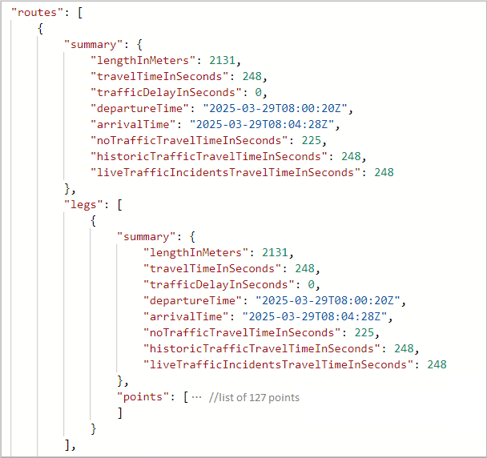

Expand the `point` element to see the list of coordinates for the path:

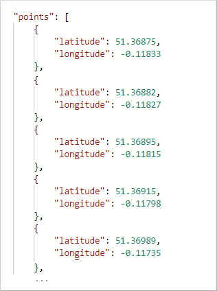

The Route Directions APIs support different formats of instructions that can be used by specifying the **instructionsType** parameter. To format instructions for easy computer processing, use **instructionsType=coded**. Use **instructionsType=tagged** to display instructions as text for the user. Also, instructions can be formatted as text where some elements of the instructions are marked, and the instruction is presented with special formatting. For more information, see the [list of supported instruction types](/rest/api/maps/route/postroutedirections#routeinstructionstype).

When instructions are requested, the response returns a new element named `guidance`. The `guidance` element holds two pieces of information: turn-by-turn directions and summarized instructions.

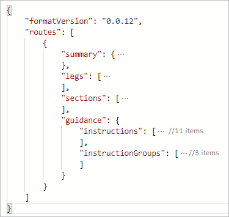

The `instructions` element holds turn-by-turn directions for the trip, and the `instructionGroups` has summarized instructions. Each instruction summary covers a segment of the trip that could cover multiple roads. The APIs can return details for sections of a route. such as, the coordinate range of a traffic jam or the current speed of traffic.

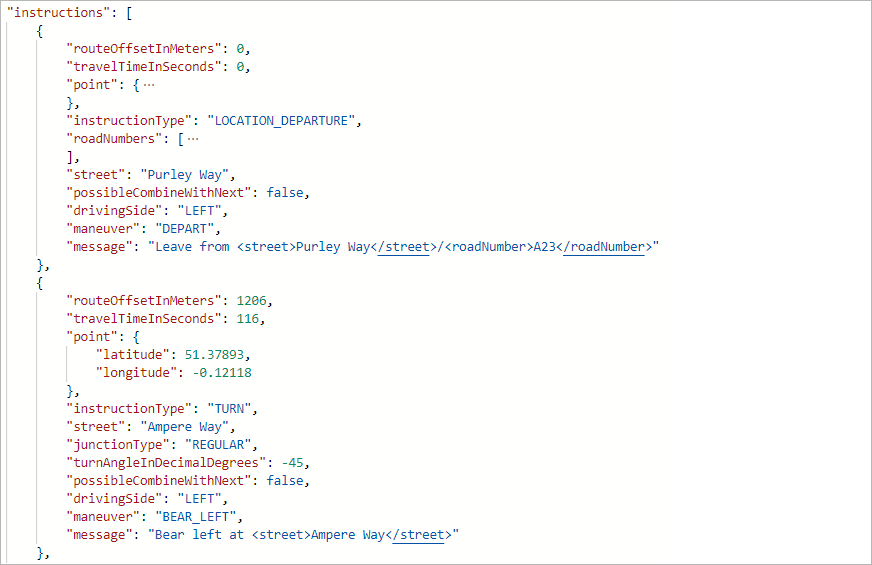

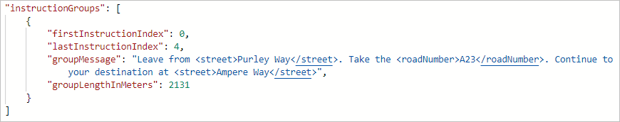

## Request a route for a commercial vehicle

Azure Maps Routing APIs support commercial vehicle routing, covering commercial trucks routing. The APIs consider specified limits. Such as, the height and weight of the vehicle, and if the vehicle is carrying hazardous cargo. For example, if a vehicle is carrying flammable, the routing engine avoid certain tunnels that are near residential areas.

### Sample query

The sample request below queries a route for a commercial truck. The truck is carrying class 1 hazardous waste material.

```http
https://atlas.microsoft.com/route/directions/json?subscription-key={Your-Azure-Maps-Subscription-key}&api-version=1.0&vehicleWidth=2&vehicleHeight=2&vehicleCommercial=true&vehicleLoadType=USHazmatClass1&travelMode=truck&instructionsType=text&query=51.368752,-0.118332:41.385426,-0.128929
```

The Route API returns directions that accommodate the dimensions of the truck and the hazardous waste. You can read the route instructions by expanding the `guidance` element.

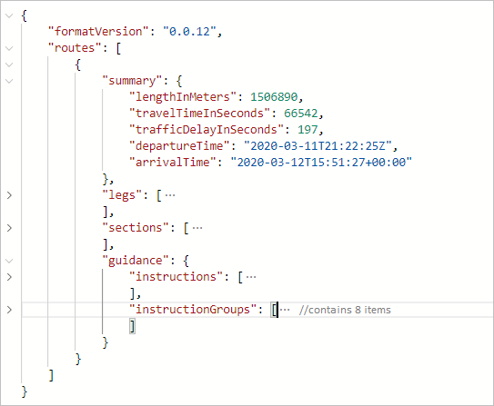

### Sample query

Changing the US Hazmat Class, from the above query, will result in a different route to accommodate this change.

```http
https://atlas.microsoft.com/route/directions/json?subscription-key={Your-Azure-Maps-Subscription-key}&api-version=1.0&vehicleWidth=2&vehicleHeight=2&vehicleCommercial=true&vehicleLoadType=USHazmatClass9&travelMode=truck&instructionsType=text&query=51.368752,-0.118332:41.385426,-0.128929
```

The response below is for a truck carrying a class 9 hazardous material, which is less dangerous than a class 1 hazardous material. When you expand the `guidance` element to read the directions, you'll notice that the directions aren't the same. There are more route instructions for the truck carrying class 1 hazardous material.

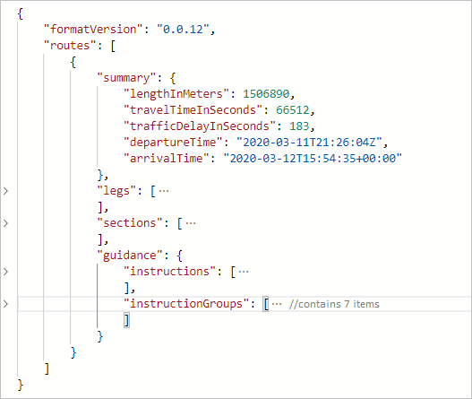

## Request traffic information along a route

With the Azure Maps Route Direction APIs, developers can request details for each section type by including the `sectionType` parameter in the request. For example, you can request the speed information for each traffic jam segment. Refer to the [list of values for the sectionType key](/rest/api/maps/route/getroutedirections#sectiontype) to learn about the various details that you can request.

### Sample query

The following query sets the `sectionType` to `traffic`. It requests the sections that contain traffic information from Seattle to San Diego.

```http
https://atlas.microsoft.com/route/directions/json?subscription-key={Your-Azure-Maps-Subscription-key}&api-version=1.0&sectionType=traffic&query=47.6062,-122.3321:32.7157,-117.1611
```

The response contains the sections that are suitable for traffic along the given coordinates.

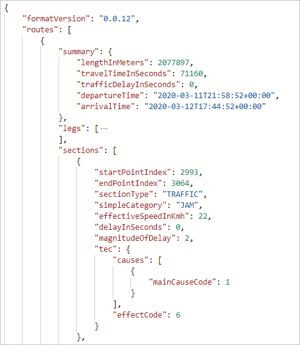

This option can be used to color the sections when rendering the map, as in the image below:

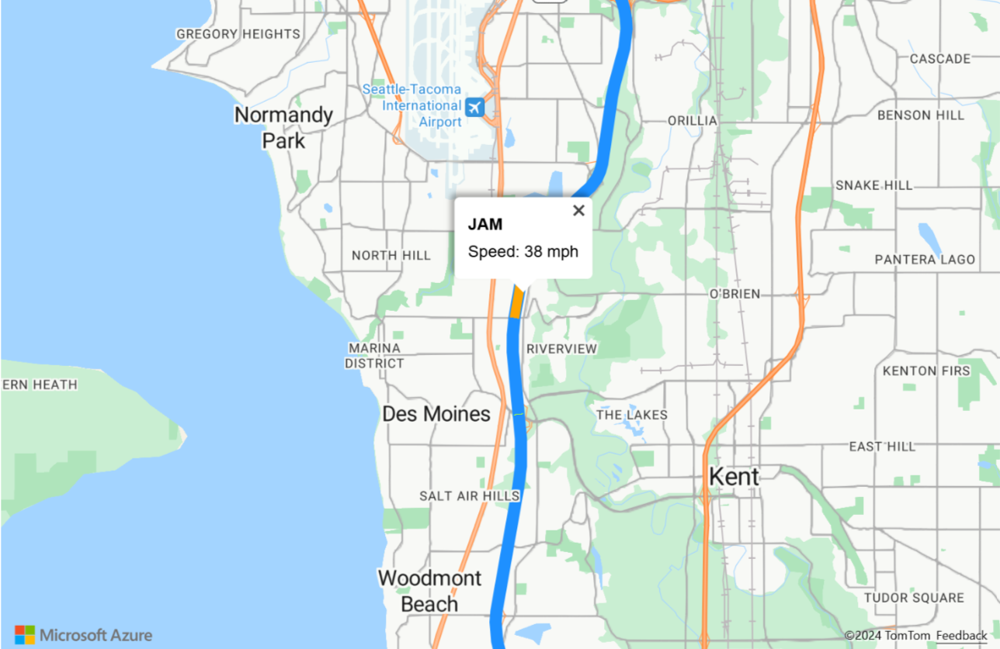

## Calculate and optimize a multi-stop route

Azure Maps currently provides two forms of route optimizations:

* Optimizations based on the requested route type, without changing the order of waypoints. For more information, see [RouteType].

* Traveling salesman optimization, which changes the order of the waypoints to obtain the best order to visit each stop

For multi-stop routing, up to 150 waypoints may be specified in a single route request. The starting and ending coordinate locations can be the same, as would be the case with a round trip. But you need to provide at least one additional waypoint to make the route calculation. Waypoints can be added to the query in-between the origin and destination coordinates.

If you want to optimize the best order to visit the given waypoints, then you need to specify **computeBestOrder=true**. This scenario is also known as the traveling salesman optimization problem.

### Sample query

The following query requests the path for six waypoints, with the `computeBestOrder` parameter set to `false`. It's also the default value for the `computeBestOrder` parameter.

```http
https://atlas.microsoft.com/route/directions/json?api-version=1.0&subscription-key={Your-Azure-Maps-Subscription-key}&computeBestOrder=false&query=47.606544,-122.336502:47.759892,-122.204821:47.670682,-122.120415:47.480133,-122.213369:47.615556,-122.193689:47.676508,-122.206054:47.495472,-122.360861
```

The response describes the path length to be 140,851 meters, and that it would take 9,991 seconds to travel that path.

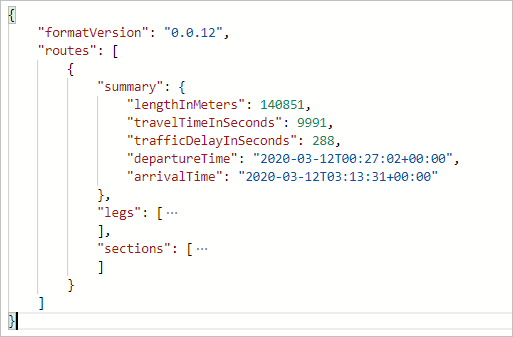

The image below illustrates the path resulting from this query. This path is one possible route. It's not the optimal path based on time or distance.

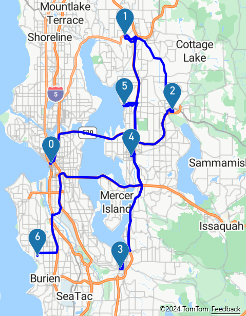

This route waypoint order is: 0, 1, 2, 3, 4, 5, and 6.

### Sample query

The following query requests the path for the same six waypoints, as in the above sample. This time, the `computeBestOrder` parameter set to `true` (the traveling salesman optimization).

```http
https://atlas.microsoft.com/route/directions/json?api-version=1.0&subscription-key={Your-Azure-Maps-Subscription-key}&computeBestOrder=true&query=47.606544,-122.336502:47.759892,-122.204821:47.670682,-122.120415:47.480133,-122.213369:47.615556,-122.193689:47.676508,-122.206054:47.495472,-122.360861
```

The response describes the path length to be 91,814 meters, and that it would take 7,797 seconds to travel that path. The travel distance and the travel time are both lower here because the API returned the optimized route.

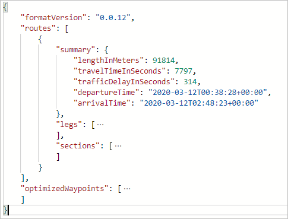

The image below illustrates the path resulting from this query.

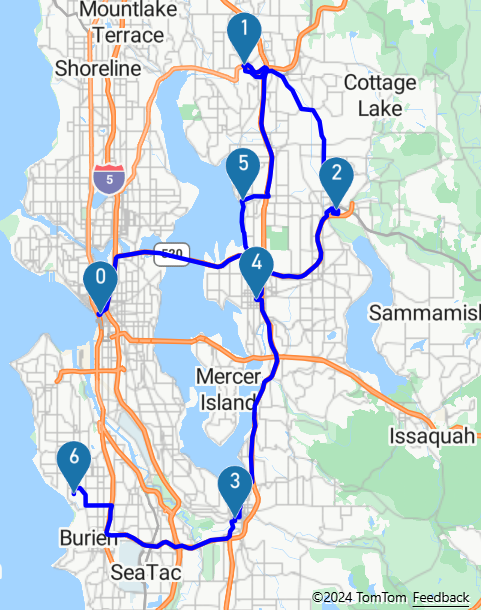

The optimal route has the following waypoint order: 0, 5, 1, 2, 4, 3, and 6.

>[!TIP]
> The optimized waypoint order information from the Routing service provides a set of indices. These exclude the origin and the destination indices. You need to increment these values by 1 to account for the origin. Then, add your destination to the end to get the complete ordered waypoint list.

## Calculate and bias alternative routes using supporting points

You might have situations where you want to reconstruct a route to calculate zero or more alternative routes for a reference route. For example, you may want to show customers alternative routes that pass your retail store. In this case, you need to bias a location using supporting points. Here are the steps to bias a location:

1. Calculate a route as-is and get the path from the route response
2. Use the route path to find the desired locations along or near the route path. For example, you can use the [Point of Interest] request or query your own data in your database.  
3. Order the locations based on the distance from the start of the route
4. Add these locations as supporting points in a new route request to [Post Route Directions]. To learn more about the supporting points, see the [Post Route Directions API documentation].

When calling [Post Route Directions], you can set the minimum deviation time or the distance constraints, along with the supporting points. Use these parameters if you want to offer alternative routes, but you also want to limit the travel time. When these constraints are used, the alternative routes will follow the reference route from the origin point for the given time or distance. In other words, the other routes diverge from the reference route per the given constraints.

The image below is an example of rendering alternative routes with specified deviation limits for the time and the distance.

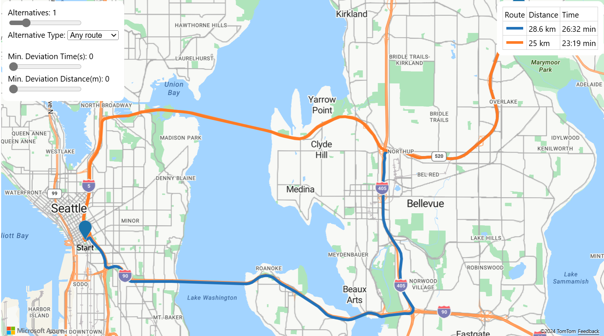

## Use the Routing service in a web app

The Azure Maps Web SDK provides a [Service module]. This module is a helper library that makes it easy to use the Azure Maps REST APIs in web or Node.js applications, using JavaScript or TypeScript. The Service module can be used to render the returned routes on the map. The module automatically determines which API to use with GET and POST requests.

## Next steps

To learn more, please see:

> [!div class="nextstepaction"]
> [Azure Maps Route service](/rest/api/maps/route)

> [!div class="nextstepaction"]
> [How to use the Service module](./how-to-use-services-module.md)

> [!div class="nextstepaction"]
> [Show route on the map](./map-route.md)

> [!div class="nextstepaction"]
> [Azure Maps npm Package](https://www.npmjs.com/package/azure-maps-rest  )

[Route service]: /rest/api/maps/route
[Azure Maps account]: quick-demo-map-app.md#create-an-azure-maps-account
[subscription key]: quick-demo-map-app.md#get-the-subscription-key-for-your-account
[Routing Coverage]: routing-coverage.md
[Postman]: https://www.postman.com/downloads/
[RouteType]: /rest/api/maps/route/postroutedirections#routetype
[Point of Interest]: /rest/api/maps/search/getsearchpoi
[Post Route Directions]: /rest/api/maps/route/postroutedirections
[Post Route Directions API documentation]: /rest/api/maps/route/postroutedirections#supportingpoints
[Service module]: /javascript/api/azure-maps-rest/
