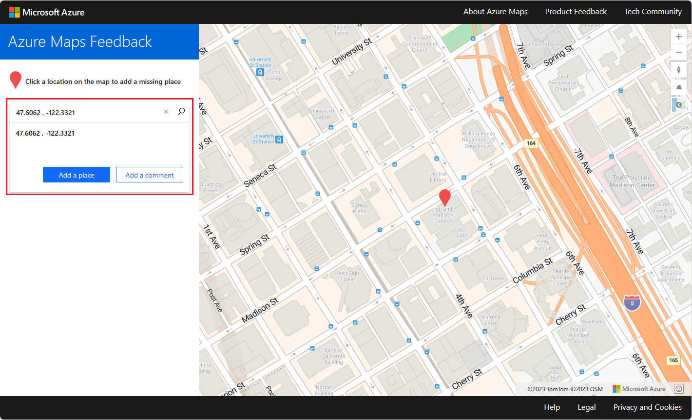
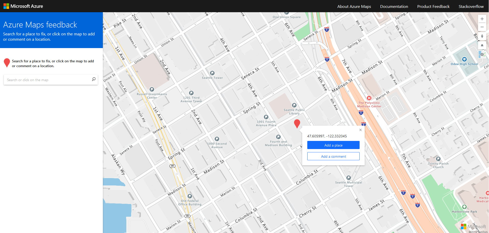
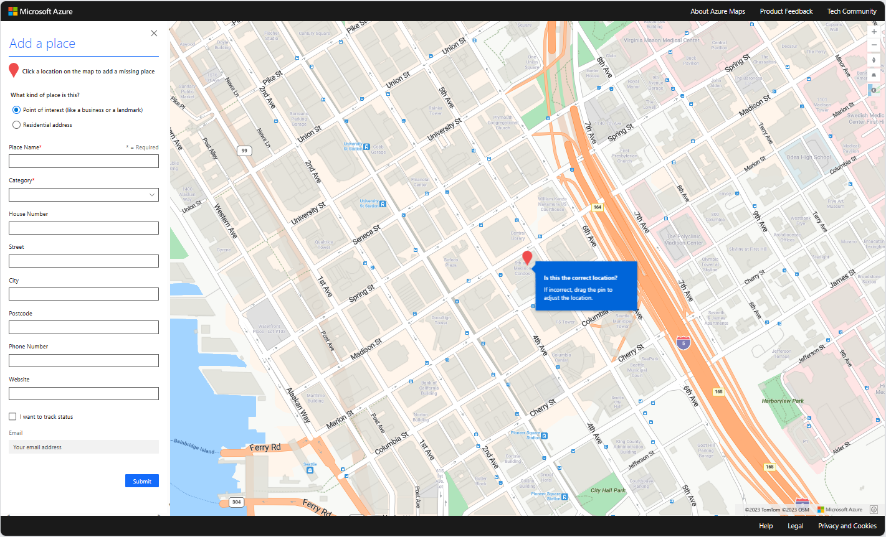
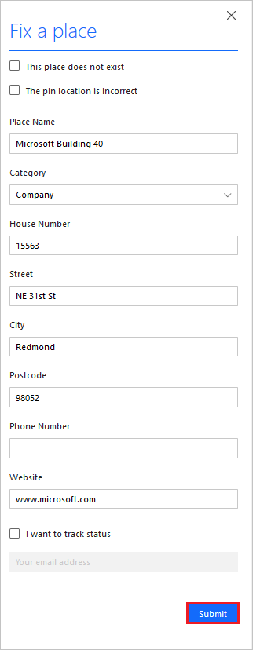
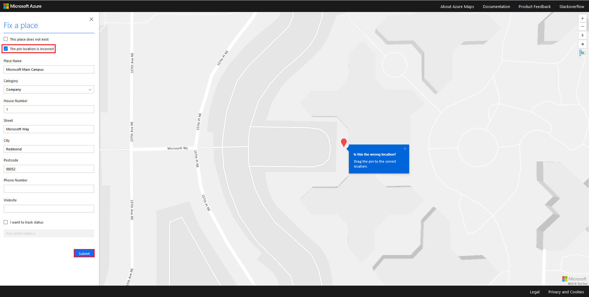
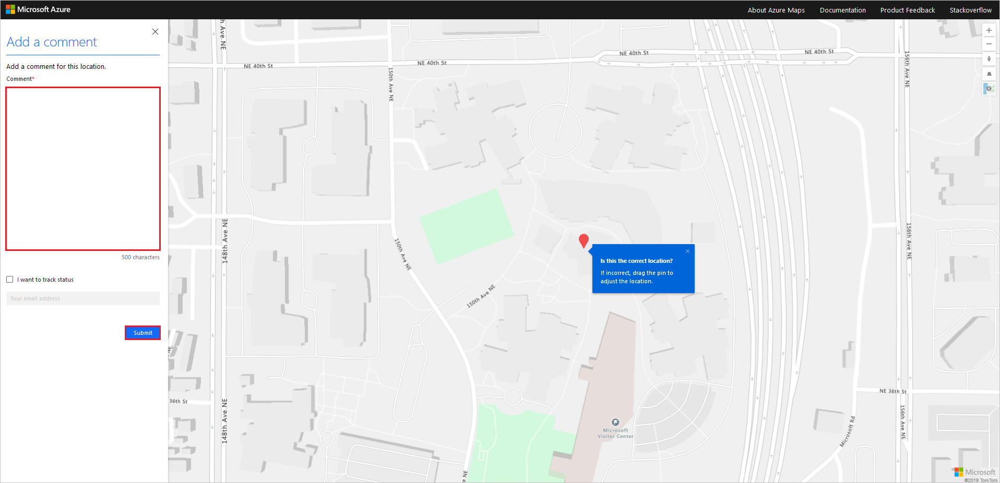
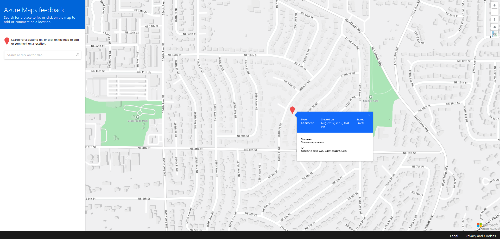

# Provide data feedback to Azure Maps

Azure Maps has been available since May 2018. Azure Maps has been providing fresh map data, easy-to-use REST APIs, and powerful SDKs to support our enterprise customers with different kind of business use cases. The real world is changing every second, and it’s crucial for us to provide a factual digital representation to our customers. Our customers that are planning to open or close facilities need our maps to update promptly. So, they can efficiently plan for delivery, maintenance, or customer service at the right facilities. We have created the Azure Maps data feedback site to empower our customers to provide direct data feedback. Customers’ data feedback goes directly to our data providers and their map editors. They can quickly evaluate and incorporate feedback into our mapping products.  

[Azure Maps Data feedback site] provides an easy way for our customers to provide map data feedback, especially on business points of interest and residential addresses. This article guides you on how to provide different kinds of feedback using the Azure Maps feedback site.

## Add a business place or a residential address

You may want to provide feedback about a missing point of interest or a residential address. There are two ways to do so. Open the Azure Map data feedback site, search for the missing location's coordinates, and then select **Add a place**.

  

Or, you can interact with the map. Select the location to drop a pin at the coordinate then select **Add a place**.

  

Once selected, you're directed to a form to provide the corresponding details for the place.

  

## Fix a business place or a residential address

The feedback site also allows you to search and locate a business place or an address. You can provide feedback to fix the address or the pin location, if they aren't correct. To provide feedback to fix the address, use the search bar to search for a business place or residential address. Select the location of your interest from the results list, then **Fix this place**.

  

To provide feedback to fix the address, fill out the **Fix a place** form, then select **Submit**.

  

If the pin location for the place is wrong, select the **The pin location is incorrect** checkbox. Move the pin to the correct location, and then select **Submit**.

  

## Add a comment

In addition to letting you search for a location, the feedback tool also lets you add a free form text comment for details related to the location. To add a comment, search for the location or select the location, write a comment in the **Add a comment** field then **Submit**.

  

## Track status

You can also track the status of your request by selecting the **I want to track status** box and providing your email while making a request. You receive a tracking link in the email that provides an up-to-date status of your request.

  

## Next steps

For any technical questions related to Azure Maps, see [Microsoft Q & A].

[Azure Maps Data feedback site]: https://feedback.azuremaps.com
[Microsoft Q & A]: /answers/topics/azure-maps.html
