# How to use image templates

Images can be used with HTML markers and various layers within the Azure Maps web SDK:

 - Symbol layers can render points on the map with an image icon. Symbols can also be rendered along a lines path.
 - Polygon layers can be rendered with a fill pattern image. 
 - HTML markers can render points using images and other HTML elements.

In order to ensure good performance with layers, load the images into the map image sprite resource before rendering. The [IconOptions](https://docs.microsoft.com/javascript/api/azure-maps-control/atlas.iconoptions), of the SymbolLayer, preloads a couple of marker images in a handful of colors into the map image sprite, by default. These marker images and more are available as SVG templates. They can be used to create images with custom scales, or used as a customer primary and secondary color. In total there are 42 image templates provided: 27 symbol icons and 15 polygon fill patterns.

Image templates can be added to the map image sprite resources by using the `map.imageSprite.createFromTemplate` function. This function allows up to five parameters to be passed in;

```javascript
createFromTemplate(id: string, templateName: string, color?: string, secondaryColor?: string, scale?: number): Promise<void>
```

The `id` is a unique identifier you create. The `id` is assigned to the image when it's added to the maps image sprite. Use this identifier in the layers to specifying which image resource to render. The `templateName` specifies which image template to use. The `color` option sets the primary color of the image and the `secondaryColor` options sets the secondary color of the image. The `scale` option scales the image template before applying it to the image sprite. When the image is applied to the image sprite, it's converted into a PNG. To ensure crisp rendering, it's better to scale up the image template before adding it to the sprite, than to scale it up in a layer.

This function asynchronously loads the image into the image sprite. Thus, it returns a Promise that you can wait for this function to complete.

The following code shows how to create an image from one of the built-in templates, and use it with a symbol layer.

```javascript
map.imageSprite.createFromTemplate('myTemplatedIcon', 'marker-flat', 'teal', '#fff').then(function () {

	//Add a symbol layer that uses the custom created icon.
	map.layers.add(new atlas.layer.SymbolLayer(datasource, null, {
		iconOptions: {
			image: 'myTemplatedIcon'
		}
	}));
});
```

## Use an image template with a symbol layer

Once an image template is loaded into the map image sprite, it can be rendered as a symbol in a symbol layer by referencing the image resource ID in the `image` option of the `iconOptions`.

The following sample renders a symbol layer using the `marker-flat` image template with a teal primary color and a white secondary color. 

<br/>

<iframe height="500" style="width: 100%;" scrolling="no" title="Symbol layer with built-in icon template" src="//codepen.io/azuremaps/embed/VoQMPp/?height=500&theme-id=0&default-tab=js,result&editable=true" frameborder="no" allowtransparency="true" allowfullscreen="true">
  See the Pen <a href='https://codepen.io/azuremaps/pen/VoQMPp/'>Symbol layer with built-in icon template</a> by Azure Maps
  (<a href='https://codepen.io/azuremaps'>@azuremaps</a>) on <a href='https://codepen.io'>CodePen</a>.
</iframe>

## Use an image template along a lines path

Once an image template is loaded into the map image sprite, it can be rendered along the path of a line by adding a LineString to a data source and using a symbol layer with a `lineSpacing`option and by referencing the ID of the image resource in the `image` option of th `iconOptions`. 

The following sample renders a pink line on the map and uses a symbol layer using the `car` image template with a dodger blue primary color and a white secondary color. 

<br/>

<iframe height="500" style="width: 100%;" scrolling="no" title="Line layer with built-in icon template" src="//codepen.io/azuremaps/embed/KOQvJe/?height=500&theme-id=0&default-tab=js,result&editable=true" frameborder="no" allowtransparency="true" allowfullscreen="true">
  See the Pen <a href='https://codepen.io/azuremaps/pen/KOQvJe/'>Line layer with built-in icon template</a> by Azure Maps
  (<a href='https://codepen.io/azuremaps'>@azuremaps</a>) on <a href='https://codepen.io'>CodePen</a>.
</iframe>

> [!TIP]
> If the image template points up, set the `rotation` icon option of the symbol layer to 90 if you want it to point in the same direction as the line.

## Use an image template with a polygon layer

Once an image template is loaded into the map image sprite, it can be rendered as a fill pattern in a polygon layer by referencing the image resource ID in the `fillPattern` option of the layer.

The following sample renders a polygon layer using the `dot` image template with a red primary color and a transparent secondary color.  

<br/>

<iframe height="500" style="width: 100%;" scrolling="no" title="Fill polygon with built-in icon template" src="//codepen.io/azuremaps/embed/WVMEmz/?height=500&theme-id=0&default-tab=js,result&editable=true" frameborder="no" allowtransparency="true" allowfullscreen="true">
  See the Pen <a href='https://codepen.io/azuremaps/pen/WVMEmz/'>Fill polygon with built-in icon template</a> by Azure Maps
  (<a href='https://codepen.io/azuremaps'>@azuremaps</a>) on <a href='https://codepen.io'>CodePen</a>.
</iframe>

> [!TIP]
> Setting the secondary color of fill patterns makes it easier to see the underlying map will still providing the primary pattern. 

## Use an image template with an HTML marker

An image template can be retrieved using the `altas.getImageTemplate` function and used as the content of an HTML marker. The template can be passed into the `htmlContent` option of the marker, and then customized using the `color`, `secondaryColor`, and `text` options.

The following sample uses the `marker-arrow` template with a red primary color, a pink secondary color, and a text value of "00".

<br/>

<iframe height="500" style="width: 100%;" scrolling="no" title="HTML Marker with built-in icon template" src="//codepen.io/azuremaps/embed/EqQvzq/?height=500&theme-id=0&default-tab=js,result&editable=true" frameborder="no" allowtransparency="true" allowfullscreen="true">
  See the Pen <a href='https://codepen.io/azuremaps/pen/EqQvzq/'>HTML Marker with built-in icon template</a> by Azure Maps
  (<a href='https://codepen.io/azuremaps'>@azuremaps</a>) on <a href='https://codepen.io'>CodePen</a>.
</iframe>

## Create custom reusable templates

If your application uses the same icon with different icons or if you are creating a module that adds additional image templates, you can easily add and retrieve these icons from the Azure Maps web SDK. Use the following static functions on the `atlas` namespace.

| Name | Return Type | Description | 
|-|-|-|
| `addImageTemplate(templateName: string, template: string, override: boolean)` | | Adds a custom SVG image template to the atlas namespace. |
|  `getImageTemplate(templateName: string, scale?: number)`| string | Retrieves an SVG template by name. |
| `getAllImageTemplateNames()` | string[] |  Retrieves an SVG template by name. |

SVG image templates support the following placeholder values:

| Placeholder | Description |
|-|-|
| `{color}` | The primary color. | 
| `{secondaryColor}` | The secondary color. | 
| `{scale}` | The SVG image is converted to an png image when added to the map image sprite. This placeholder can be used to scale a template before it is converted to ensure it renders clearly. | 
| `{text}` | The location to render text when used with an HTML Marker. |

The following example shows how to take an SVG template, and add it to the Azure Maps web SDK as a reusable icon template. 

<br/>

<iframe height="500" style="width: 100%;" scrolling="no" title="Add custom icon template to atlas namespace" src="//codepen.io/azuremaps/embed/NQyvEX/?height=500&theme-id=0&default-tab=js,result&editable=true" frameborder="no" allowtransparency="true" allowfullscreen="true">
  See the Pen <a href='https://codepen.io/azuremaps/pen/NQyvEX/'>Add custom icon template to atlas namespace</a> by Azure Maps
  (<a href='https://codepen.io/azuremaps'>@azuremaps</a>) on <a href='https://codepen.io'>CodePen</a>.
</iframe>

## List of image templates

This table lists all image templates currently available within the Azure Maps web SDK. The template name is above each image. By default, the primary color is blue and the secondary color is white. To make the secondary color easier to see on a white background, the following images have the secondary color set to black.

**Symbol icon templates**

|||||
|:-:|:-:|:-:|:-:|
| marker | marker-thick | marker-circle | marker-flat |
||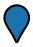|||
||||
| marker-square | marker-square-cluster | marker-arrow | marker-ball-pin | 
|||||
||||
| marker-square-rounded | marker-square-rounded-cluster | flag | flag-triangle |
|  |  | 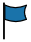 | 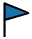 |
||||
| triangle | triangle-thick | triangle-arrow-up | triangle-arrow-left |
|  | 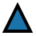 |  |  |
||||
| hexagon | hexagon-thick | hexagon-rounded | hexagon-rounded-thick |
|  |  | 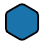 |  |
||||
| pin | pin-round | rounded-square | rounded-square-thick |
|  |  | 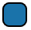 |  |
||||
| arrow-up | arrow-up-thin | car ||
|  |  |  | |

**Polygon fill pattern templates**

|||||
|:-:|:-:|:-:|:-:|
| checker | checker-rotated | circles | circles-spaced |
| 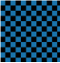 | 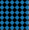 | 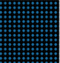 | 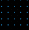 |
|||||
| diagonal-lines-up | diagonal-lines-down | diagonal-stripes-up | diagonal-stripes-down |
| 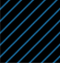 |  | 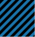 | 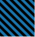 |
|||||
| grid-lines | rotated-grid-lines | rotated-grid-stripes | x-fill |
| 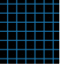 |  | 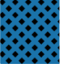 | 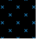 |
|||||
| zig-zag | zig-zag-vertical | dots |  |
| 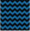 | 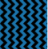 |  | |

## Try it now tool

With the following tool, you can render the different built-in image templates in various ways and customize the primary and secondary colors and scale.

<br/>

<iframe height="500" style="width: 100%;" scrolling="no" title="Icon template options" src="//codepen.io/azuremaps/embed/NQyaaO/?height=500&theme-id=0&default-tab=result" frameborder="no" allowtransparency="true" allowfullscreen="true">
  See the Pen <a href='https://codepen.io/azuremaps/pen/NQyaaO/'>Icon template options</a> by Azure Maps
  (<a href='https://codepen.io/azuremaps'>@azuremaps</a>) on <a href='https://codepen.io'>CodePen</a>.
</iframe>

## Next steps

Learn more about the classes and methods used in this article:

> [!div class="nextstepaction"]
> [ImageSpriteManager](https://docs.microsoft.com/javascript/api/azure-maps-control/atlas.imagespritemanager)

> [!div class="nextstepaction"]
> [atlas namespace](https://docs.microsoft.com/javascript/api/azure-maps-control/atlas?view=azure-maps-typescript-latest#functions
)

See the following articles for more code samples where image templates can be used:

> [!div class="nextstepaction"]
> [Add a symbol layer](map-add-pin.md)

> [!div class="nextstepaction"]
> [Add a line layer](map-add-line-layer.md)

> [!div class="nextstepaction"]
> [Add a polygon layer](map-add-shape.md)

> [!div class="nextstepaction"]
> [Add HTML Makers](map-add-bubble-layer.md)
