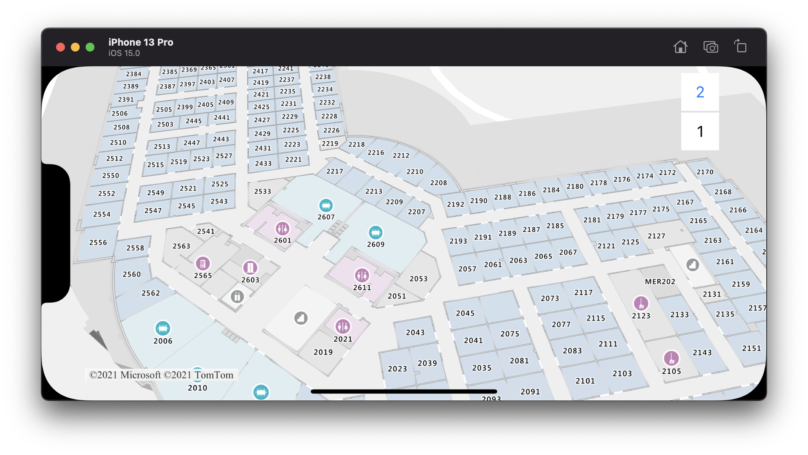

# Indoor maps in the iOS SDK (Preview)

The Azure Maps iOS SDK allows you to render indoor maps created in Azure Maps Creator services.

> [!NOTE]
> The iOS SDK will support *dynamic styling* in a future release, coming soon!

## Prerequisites

1. Be sure to complete the steps in the [Quickstart: Create an iOS app](quick-ios-app.md). Code blocks in this article can be inserted into the  `viewDidLoad` function of `ViewController`.
1. [Create a Creator resource](how-to-manage-creator.md)
1. Get a `tilesetId` by completing the [tutorial for creating Indoor maps](tutorial-creator-indoor-maps.md). You'll use this identifier to render indoor maps with the Azure Maps iOS SDK.

## Instantiate the indoor manager

To load the indoor tilesets and map style of the tiles, you must instantiate an `IndoorManager` and keep a strong reference to it.

```swift
guard let indoor = try? IndoorManager(azureMap: map, options: [.tilesetID({Your-tilesetID})]) else { return }
self.indoorManager = indoor
```

> [!IMPORTANT]
> This guide assumes that your Creator service was created in the United States. If your Creator service was created in Europe, add the following code:
>
> ```swift
> self.indoorManager.setOptions([.geography(.eu)])
> ```

## Indoor level picker control

The *Indoor Level Picker* control allows you to change the level of the rendered map. You can optionally initialize an `IndoorControl` and set to the appropriate option on the `IndoorManager` as in the following code:

```swift
let levelControl = IndoorControl(options: [.controlPosition(.topRight)])
self.indoorManager.setOptions([.levelControl(levelControl)])
```

> [!TIP]
> The *level picker* appears when you tap on a facility.

## Indoor events

Add a delegate to the `IndoorManager` to listen to indoor map events:

```swift
self.indoorManager.addDelegate(self)
```

`IndoorManagerDelegate` has one method, which is invoked when a facility or floor changes.

```swift
func indoorManager(
    _ manager: IndoorManager,
    didSelectFacility selectedFacility: IndoorFacilitySelection,
    previousSelection: IndoorFacilitySelection
) {
    // code that you want to run after a facility or floor has been changed
    print("New selected facility's ID:", selectedFacility.facilityID)
    print("New selected floor:", selectedFacility.levelsOrdinal)
}
```

## Example

The screenshot below shows the above code displaying an indoor map.



## Additional information

- [Creator for indoor maps](creator-indoor-maps.md)
- [Drawing package requirements](drawing-requirements.md)
