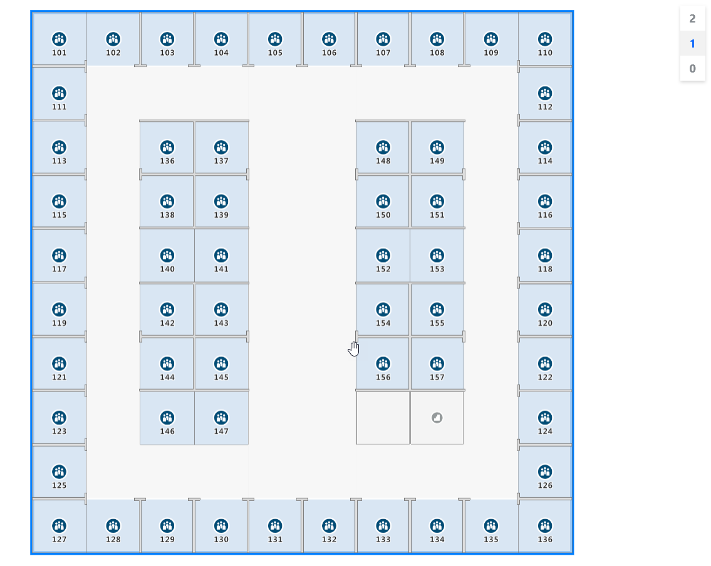

# Use the Azure Maps Indoor Maps module with custom styles (preview)

The Azure Maps Web SDK includes an [Indoor Maps] module, enabling you to render indoor maps created in Azure Maps Creator services.

When you create an indoor map using Azure Maps Creator, default styles are applied. Azure Maps Creator now also supports customizing the styles of the different elements of your indoor maps using the [Style Rest API], or the [visual style editor].

## Prerequisites

- [Azure Maps account]
- [Azure Maps Creator resource]
- [Subscription key]
- A map configuration alias or ID. For more information, see [map configuration API].

> [!TIP]
> If you have never used Azure Maps Creator to create an indoor map, you might find the [Use Creator to create indoor maps] tutorial helpful.

The map configuration `alias` (or `mapConfigurationId`) is required to render indoor maps with custom styles via the Azure Maps Indoor Maps module.

## Embed the Indoor Maps module

You can install and embed the *Azure Maps Indoor* module in one of two ways.

To use the globally hosted Azure Content Delivery Network version of the *Azure Maps Indoor* module, reference the following `script` and `stylesheet` references in the `<head>` element of the HTML file:

```html
<link rel="stylesheet" href="https://atlas.microsoft.com/sdk/javascript/indoor/0.2/atlas-indoor.min.css" type="text/css"/>
<script src="https://atlas.microsoft.com/sdk/javascript/indoor/0.2/atlas-indoor.min.js"></script>
```

 Or, you can download the *Azure Maps Indoor* module. The *Azure Maps Indoor* module contains a client library for accessing Azure Maps services. The following steps demonstrate how to install and load the *Indoor* module into your web application.  
  
  1. Install the latest [azure-maps-indoor package].
  
      ```powershell
      >npm install azure-maps-indoor
      ```

  2. Import the *Azure Maps Indoor* module JavaScript in a source file:

      ```js
      import * as indoor from "azure-maps-indoor";
      ```

      You would also need to embed the CSS Style Sheet for various controls to display correctly. If you're using a JavaScript bundler to bundle the dependencies and package your code, refer to your bundler's documentation on how it's done. For [Webpack], it's commonly done via a combination of `style-loader` and `css-loader` with documentation available at [style-loader].

      To begin, install style-loader and css-loader:

      ```powershell
      npm install --save-dev style-loader css-loader
      ```

      Inside your source file, import atlas-indoor.min.css:

      ```js
      import "azure-maps-indoor/dist/atlas-indoor.min.css";
      ```

      Then add loaders to the module rules portion of the Webpack config:

      ```js
      module.exports = {
        module: {
          rules: [
            {
              test: /\.css$/i,
              use: ["style-loader", "css-loader"]
            }
          ]
        }
      };
      ```

      To learn more, see [How to use the Azure Maps map control npm package].

## Set the domain and instantiate the Map object

Set the map domain with a prefix matching the location of your Creator resource, `US` or `EU`, for example:

 `atlas.setDomain('us.atlas.microsoft.com');`

For more information, see [Azure Maps service geographic scope].

Next, instantiate a *Map object* with the map configuration object set to the `alias` or `mapConfigurationId` property of your map configuration, then set your `styleAPIVersion` to `2022-09-01-preview`.

The *Map object* will be used in the next step to instantiate the *Indoor Manager* object. The following code shows you how to instantiate the *Map object* with `mapConfiguration`, `styleAPIVersion` and map domain set:

```javascript
const subscriptionKey = "<Your Azure Maps Subscription Key>";
const region = "<Your Creator resource region: us or eu>"  
const mapConfiguration = "<map configuration alias or ID>"  
atlas.setDomain(`${region}.atlas.microsoft.com`);

const map = new atlas.Map("map-id", {
  //use your facility's location
  center: [-122.13315, 47.63637],
  //or, you can use bounds: [# west, # south, # east, # north] and replace # with your Map bounds
  authOptions: { 
      authType: 'subscriptionKey',
      subscriptionKey: subscriptionKey
  },
  zoom: 19,

  mapConfiguration: mapConfiguration,
  styleAPIVersion: '2022-09-01-preview'
});
```

## Instantiate the Indoor Manager

To load the indoor map style of the tiles, you must instantiate the *Indoor Manager*. Instantiate the *Indoor Manager* by providing the *Map object*. If you wish to support [dynamic map styling], you must pass the `statesetId`. The `statesetId` variable name is case-sensitive. Your code should look like the following JavaScript code snippet:

```javascriptf
const statesetId = "<statesetId>";

const indoorManager = new atlas.indoor.IndoorManager(map, {
  statesetId: statesetId // Optional
});
```

To enable polling of state data you provide, you must provide the `statesetId` and call `indoorManager.setDynamicStyling(true)`. Polling state data lets you dynamically update the state of dynamic properties or *states*. For example, a feature such as room can have a dynamic property (*state*) called `occupancy`. Your application may wish to poll for any *state* changes to reflect the change inside the visual map. The following code shows you how to enable state polling:

```javascript
const statesetId = "<statesetId>";

const indoorManager = new atlas.indoor.IndoorManager(map, {
  statesetId: statesetId // Optional
});

if (statesetId.length > 0) {
    indoorManager.setDynamicStyling(true);
}
```

## Indoor level picker control

 The *Indoor Level Picker* control allows you to change the level of the rendered map. You can optionally initialize the *Indoor Level Picker* control via the *Indoor Manager*. Here's the code to initialize the level control picker:

```javascript
const levelControl = new atlas.control.LevelControl({ position: "top-right" });
indoorManager.setOptions({ levelControl });
```

## Indoor events

 The *Azure Maps Indoor* module supports *Map object* events. The *Map object* event listeners are invoked when a level or facility has changed. If you want to run code when a level or a facility have changed, place your code inside the event listener. The code below shows how event listeners can be added to the *Map object*.

```javascript
map.events.add("levelchanged", indoorManager, (eventData) => {

  //code that you want to run after a level has been changed
  console.log("The level has changed: ", eventData);
});

map.events.add("facilitychanged", indoorManager, (eventData) => {

  //code that you want to run after a facility has been changed
  console.log("The facility has changed: ", eventData);
});
```

The `eventData` variable holds information about the level or facility that invoked the `levelchanged` or `facilitychanged` event, respectively. When a level changes, the `eventData` object contains the `facilityId`, the new `levelNumber`, and other metadata. When a facility changes, the `eventData` object contains the new `facilityId`, the new `levelNumber`, and other metadata.

## Example: custom styling: consume map configuration in WebSDK (preview)

When you create an indoor map using Azure Maps Creator, default styles are applied. Azure Maps Creator now also supports customizing your indoor styles. For more information, see [Create custom styles for indoor maps]. Creator also offers a [visual style editor].

1. Follow the [Create custom styles for indoor maps] how-to article to create your custom styles. Make a note of the map configuration alias after saving your changes.

2. Use the [Azure Content Delivery Network] option to install the *Azure Maps Indoor* module.

3. Create a new HTML file

4. In the HTML header, reference the *Azure Maps Indoor* module JavaScript and style sheet.

5. Set the map domain with a prefix matching a location of your Creator resource: `atlas.setDomain('us.atlas.microsoft.com');` if your Creator resource has been created in US region, or `atlas.setDomain('eu.atlas.microsoft.com');` if your Creator resource has been created in EU region.

6. Initialize a *Map object*. The *Map object* supports the following options:
    - `Subscription key` is your Azure Maps subscription key.
    - `center` defines a latitude and longitude for your indoor map center location. Provide a value for `center` if you don't want to provide a value for `bounds`. Format should appear as `center`: [-122.13315, 47.63637].
    - `bounds` is the smallest rectangular shape that encloses the tileset map data. Set a value for `bounds` if you don't want to set a value for `center`. You can find your map bounds by calling the [Tileset List API]. The Tileset List API returns the `bbox`, which you can parse and assign to `bounds`. Format should appear as `bounds`: [# west, # south, # east, # north].
    - `mapConfiguration` the ID or alias of the map configuration that defines the custom styles you want to display on the map, use the map configuration ID or alias from step 1.
    - `style` allows you to set the initial style from your map configuration that is displayed. If not set, the style matching map configuration's default configuration is used.
    - `zoom` allows you to specify the min and max zoom levels for your map.
    - `styleAPIVersion`: pass **'2022-09-01-preview'** (which is required while Custom Styling is in public preview)

7. Next, create the *Indoor Manager* module with *Indoor Level Picker* control instantiated as part of *Indoor Manager* options, optionally set the `statesetId` option.

8. Add *Map object* event listeners.  

> [!TIP]
> The map configuration is referenced using the `mapConfigurationId` or `alias` . Each time you edit or change a map configuration, its ID changes but its alias remains the same. It is recommended to reference the map configuration by its alias in your applications. For more information, See [map configuration] in the concepts article.

Your file should now look similar to the following HTML:

  ```html
  <!DOCTYPE html>
  <html lang="en">
    <head>
      <meta charset="utf-8" />
      <meta name="viewport" content="width=device-width, user-scalable=no" />
      <title>Indoor Maps App</title>
      
      <link rel="stylesheet" href="https://atlas.microsoft.com/sdk/javascript/mapcontrol/2/atlas.min.css" type="text/css" />
      <link rel="stylesheet" href="https://atlas.microsoft.com/sdk/javascript/indoor/0.2/atlas-indoor.min.css" type="text/css"/>

      <script src="https://atlas.microsoft.com/sdk/javascript/mapcontrol/2/atlas.min.js"></script>
      <script src="https://atlas.microsoft.com/sdk/javascript/indoor/0.2/atlas-indoor.min.js"></script>
        
      <style>
        html,
        body {
          width: 100%;
          height: 100%;
          padding: 0;
          margin: 0;
        }

        #map-id {
          width: 100%;
          height: 100%;
        }
      </style>
    </head>

    <body>
      <div id="map-id"></div>
      <script>
        const subscriptionKey = "<Your Azure Maps Subscription Key>";
        const mapConfig = "<Your map configuration id or alias>";
        const statesetId = "<Your statesetId>";
        const region = "<Your Creator resource region: us or eu>"    
        atlas.setDomain(`${region}.atlas.microsoft.com`);

        const map = new atlas.Map("map-id", {
          //use your facility's location
          center: [-122.13315, 47.63637],
          //or, you can use bounds: [# west, # south, # east, # north] and replace # with your Map bounds
          authOptions: { 
              authType: 'subscriptionKey',
              subscriptionKey: subscriptionKey
          },
          zoom: 19,

          mapConfiguration: mapConfig,
          styleAPIVersion: '2022-09-01-preview'
        });

        const levelControl = new atlas.control.LevelControl({
          position: "top-right",
        });

        const indoorManager = new atlas.indoor.IndoorManager(map, {
          levelControl: levelControl, //level picker
          statesetId: statesetId // Optional
        });

        if (statesetId.length > 0) {
          indoorManager.setDynamicStyling(true);
        }

        map.events.add("levelchanged", indoorManager, (eventData) => {
          //put code that runs after a level has been changed
          console.log("The level has changed:", eventData);
        });

        map.events.add("facilitychanged", indoorManager, (eventData) => {
          //put code that runs after a facility has been changed
          console.log("The facility has changed:", eventData);
        });
      </script>
    </body>
  </html>
  ```

To see your indoor map, load it into a web browser. It should appear like the following image. If you select the stairwell feature, the *level picker* appears in the upper right-hand corner.

  

For a live demo of an indoor map with available source code, see [Creator Indoor Maps] in the [Azure Maps Samples].

## Next steps

Read about the APIs that are related to the *Azure Maps Indoor* module:

> [!div class="nextstepaction"]
> [Drawing package requirements]

>[!div class="nextstepaction"]
> [Creator for indoor maps]

Learn more about how to add more data to your map:

> [!div class="nextstepaction"]
> [Indoor Maps dynamic styling]

> [!div class="nextstepaction"]
> [Code samples]

[Azure Content Delivery Network]: #embed-the-indoor-maps-module
[Azure Maps account]: quick-demo-map-app.md#create-an-azure-maps-account
[Azure Maps Creator resource]: how-to-manage-creator.md
[Indoor Maps]: https://www.npmjs.com/package/azure-maps-indoor
[Azure Maps service geographic scope]: geographic-scope.md
[azure-maps-indoor package]: https://www.npmjs.com/package/azure-maps-indoor
[Code samples]: /samples/browse/?products=azure-maps
[Create custom styles for indoor maps]: how-to-create-custom-styles.md
[Creator for indoor maps]: creator-indoor-maps.md
[Creator Indoor Maps]: https://samples.azuremaps.com/?sample=creator-indoor-maps
[Drawing package requirements]: drawing-requirements.md
[dynamic map styling]: indoor-map-dynamic-styling.md
[Indoor Maps dynamic styling]: indoor-map-dynamic-styling.md
[map configuration API]: /rest/api/maps/v20220901preview/map-configuration
[map configuration]: creator-indoor-maps.md#map-configuration
[Style Rest API]: /rest/api/maps/v20220901preview/style
[style-loader]: https://webpack.js.org/loaders/style-loader
[Subscription key]: quick-demo-map-app.md#get-the-subscription-key-for-your-account
[Tileset List API]: /rest/api/maps/v2/tileset/list
[Use Creator to create indoor maps]: tutorial-creator-indoor-maps.md
[visual style editor]: https://azure.github.io/Azure-Maps-Style-Editor
[Webpack]: https://webpack.js.org
[How to use the Azure Maps map control npm package]: how-to-use-npm-package.md
