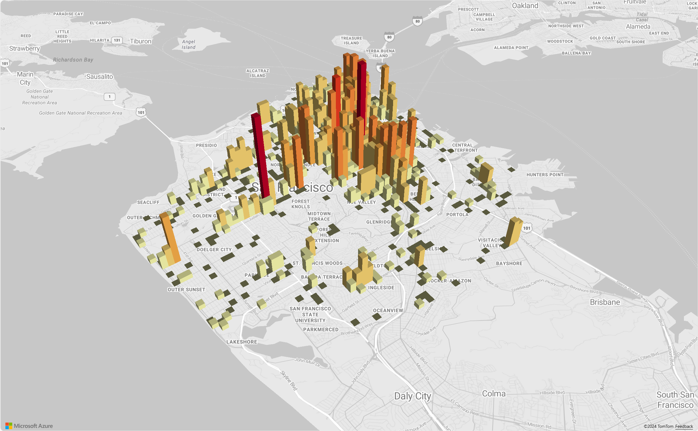

# Use the Azure Maps map control

The Azure Maps Web SDK provides a [Map Control] that enables the customization of interactive maps with your own content and imagery for display in your web or mobile applications. This module is a helper library that makes it easy to use the Azure Maps REST services in web or Node.js applications by using JavaScript or TypeScript.

This article uses the Azure Maps Web SDK, however the Azure Maps services work with any map control. For a list of third-party map control plug-ins, see [Azure Maps community - Open-source projects].

> [!NOTE]
>
> **Azure Maps Web SDK Map Control v1 retirement**
>
> Version 1 of the Web SDK Map Control is now deprecated and will be retired on 9/19/26. To avoid service disruptions, migrate to version 3 of the Web SDK Map Control by 9/19/26. Version 3 is backwards compatible and has several benifits including [WebGL 2 Compatibility], increased performance and support for [3D terrain tiles]. For more information, see [The Azure Maps Web SDK v1 migration guide].

## Prerequisites

To use the Map Control in a web page, you must have one of the following prerequisites:

* An [Azure Maps account]
* A [subscription key] or Azure Active Directory (Azure AD) credentials. For more information, see [authentication options].

## Create a new map in a web page

You can embed a map in a web page by using the Map Control client-side JavaScript library.

1. Create a new HTML file.

2. Load in the Azure Maps Web SDK. You can choose one of two options:

    * Use the globally hosted CDN version of the Azure Maps Web SDK by adding references to the JavaScript and `stylesheet` in the `<head>` element of the HTML file:

      ```html
      <link rel="stylesheet" href="https://atlas.microsoft.com/sdk/javascript/mapcontrol/3/atlas.min.css" type="text/css">
      <script src="https://atlas.microsoft.com/sdk/javascript/mapcontrol/3/atlas.min.js"></script>
      ```

    * Load the Azure Maps Web SDK source code locally using the [azure-maps-control] npm package and host it with your app. This package also includes TypeScript definitions.

      > **npm install azure-maps-control**

    Then add references to the Azure Maps `stylesheet` to the `<head>` element of the file:

    ```html
    <link rel="stylesheet" href="https://atlas.microsoft.com/sdk/javascript/mapcontrol/3/atlas.min.css" type="text/css" />
     ```

    > [!NOTE]
    > TypeScript definitions can be imported into your application by adding the following code:
    >
    > ```javascript
    > import * as atlas from 'azure-maps-control';
    > ```

3. To render the map so that it fills the full body of the page, add the following `<style>` element to the `<head>` element.

   ```HTML
    <style>
        html, body {
            margin: 0;
        }

        #myMap {
            height: 100vh;
            width: 100vw;
        }
    </style>
   ```

4. In the body of the page, add a `<div>` element and give it an `id` of **myMap**.

   ```HTML
    <body onload="InitMap()">
        <div id="myMap"></div>
    </body>
   ```

5. Next, initialize the map control. In order to authenticate the control, use an Azure Maps subscription key or Azure AD credentials with [authentication options].

    If you're using a subscription key for authentication, copy and paste the following script element inside the `<head>` element, and below the first `<script>` element. Replace `<Your Azure Maps Key>` with your Azure Maps subscription key.

    ```html
    <script type="text/javascript">
        function InitMap()
        {
            var map = new atlas.Map('myMap', {
                center: [-122.33, 47.6],
                zoom: 12,
                language: 'en-US',
                authOptions: {
                    authType: 'subscriptionKey',
                    subscriptionKey: '<Your Azure Maps Key>'
                }
            });
       }
    </script>
    ```

    If you're using Azure AD for authentication, copy and paste the following script element inside the `<head>` element, and below the first `<script>` element.

      ```HTML
    <script type="text/javascript">
        function InitMap()
        {
            var map = new atlas.Map('myMap', {
                center: [-122.33, 47.6],
                zoom: 12,
                language: 'en-US',
                authOptions: {
                    authType: 'aad',
                    clientId: '<Your AAD Client Id>',
                    aadAppId: '<Your AAD App Id>',
                    aadTenant: '<Your AAD Tenant Id>'
                }
            });
        }
    </script>
   ```

    For more information about authentication with Azure Maps, see the [Authentication with Azure Maps] document. For a list of samples showing how to integrate Azure AD with Azure Maps, see [Azure Maps & Azure Active Directory Samples] in GitHub.

    >[!TIP]
    >In this example, we've passed in the `id` of the map `<div>`. Another way to do this is to pass in the `HTMLElement` object by passing`document.getElementById('myMap')` as the first parameter.

6. Optionally, you may find it helpful to add the following `meta` elements to the `head` element of the page:

   ```HTML
    <!-- Ensures that IE and Edge uses the latest version and doesn't emulate an older version -->
    <meta http-equiv="x-ua-compatible" content="IE=Edge">

    <!-- Ensures the web page looks good on all screen sizes. -->
    <meta name="viewport" content="width=device-width, initial-scale=1, shrink-to-fit=no">
   ```

7. Your HTML file should now look something like the following code snippet:

   ```HTML
    <!DOCTYPE html>
    <html>
    <head>
        <title></title>

        <meta charset="utf-8">

        <!-- Ensures that IE and Edge uses the latest version and doesn't emulate an older version -->
        <meta http-equiv="x-ua-compatible" content="IE=Edge">

        <!-- Ensures the web page looks good on all screen sizes. -->
        <meta name="viewport" content="width=device-width, initial-scale=1, shrink-to-fit=no">

        <!-- Add references to the Azure Maps Map control JavaScript and CSS files. -->
        <link rel="stylesheet" href="https://atlas.microsoft.com/sdk/javascript/mapcontrol/3/atlas.min.css" type="text/css">
        <script src="https://atlas.microsoft.com/sdk/javascript/mapcontrol/3/atlas.min.js"></script>


        <script type="text/javascript">
            //Create an instance of the map control and set some options.
            function InitMap()
            {
                var map = new atlas.Map('myMap', {
                    center: [-122.33, 47.6],
                    zoom: 12,
                    language: 'en-US',
                    authOptions: {
                        authType: 'subscriptionKey',
                        subscriptionKey: '<Your Azure Maps Key>'
                    }
                });
            }
        </script>

        <style>
            html, body {
                margin: 0;
            }

            #myMap {
                height: 100vh;
                width: 100vw;
            }
        </style>
    </head>
    <body onload="InitMap()">
        <div id="myMap"></div>
    </body>
    </html>
    ```

8. Open the file in your web browser and view the rendered map. It should look like the following image:

   

## Localizing the map

Azure Maps provides two different ways of setting the language and regional view for the rendered map. The first option is to add this information to the global `atlas` namespace, which results in all map control instances in your app defaulting to these settings. The following sets the language to French ("fr-FR") and the regional view to "Auto":

```javascript
atlas.setLanguage('fr-FR');
atlas.setView('Auto');
```

The second option is to pass this information into the map options when loading the map like this:

```javascript
map = new atlas.Map('myMap', {
    language: 'fr-FR',
    view: 'Auto',

    authOptions: {
        authType: 'aad',
        clientId: '<Your AAD Client Id>',
        aadAppId: '<Your AAD App Id>',
        aadTenant: '<Your AAD Tenant Id>'
    }
});
```

> [!NOTE]
> It is possible to load multiple map instances on the same page with different language and region settings. Additionally, these settings can be updated after the map loads using the `setStyle` function of the map.

Here's an example of Azure Maps with the language set to "fr-FR" and the regional view set to `Auto`.


For a list of supported languages and regional views, see [Localization support in Azure Maps].

## WebGL 2 Compatibility

Beginning with Azure Maps Web SDK 3.0, the Web SDK includes full compatibility with [WebGL 2], a powerful graphics technology that enables hardware-accelerated rendering in modern web browsers. By using WebGL 2, developers can harness the capabilities of modern GPUs to render complex maps and visualizations more efficiently, resulting in improved performance and visual quality.



```html
<!DOCTYPE html>
<html lang="en">
    <head>
        <meta charset="utf-8" />
        <meta name="viewport" content="width=device-width, user-scalable=no" />
        <title>WebGL2 - Azure Maps Web SDK Samples</title>
        <link href=https://atlas.microsoft.com/sdk/javascript/mapcontrol/3/atlas.min.css rel="stylesheet"/>
        <script src=https://atlas.microsoft.com/sdk/javascript/mapcontrol/3/atlas.min.js></script>
        <script src="https://unpkg.com/deck.gl@latest/dist.min.js"></script>
        <style>
            html,
            body {
                width: 100%;
                height: 100%;
                padding: 0;
                margin: 0;
            }
            #map {
                width: 100%;
                height: 100%;
            }
        </style>
    </head>
    <body>
        <div id="map"></div>
        <script>
            var map = new atlas.Map("map", {
                center: [-122.44, 37.75],
                bearing: 36,
                pitch: 45,
                zoom: 12,
                style: "grayscale_light",
                // Get an Azure Maps key at https://azuremaps.com/.
                authOptions: {
                    authType: "subscriptionKey",
                    subscriptionKey: " <Your Azure Maps Key> "
                }
            });

            // Wait until the map resources are ready.
            map.events.add("ready", (event) => {
                // Create a custom layer to render data points using deck.gl
                map.layers.add(
                    new DeckGLLayer({
                        id: "grid-layer",
                        data: "https://raw.githubusercontent.com/visgl/deck.gl-data/master/website/sf-bike-parking.json",
                        cellSize: 200,
                        extruded: true,
                        elevationScale: 4,
                        getPosition: (d) => d.COORDINATES,
                        // GPUGridLayer leverages WebGL2 to perform aggregation on the GPU.
                        // For more details, see https://deck.gl/docs/api-reference/aggregation-layers/gpu-grid-layer
                        type: deck.GPUGridLayer
                    })
                );
            });

            // A custom implementation of WebGLLayer
            class DeckGLLayer extends atlas.layer.WebGLLayer {
                constructor(options) {
                    super(options.id);
                    // Create an instance of deck.gl MapboxLayer which is compatible with Azure Maps
                    // https://deck.gl/docs/api-reference/mapbox/mapbox-layer
                    this._mbLayer = new deck.MapboxLayer(options);

                    // Create a renderer
                    const renderer = {
                        renderingMode: "3d",
                        onAdd: (map, gl) => {
                            this._mbLayer.onAdd?.(map["map"], gl);
                        },
                        onRemove: (map, gl) => {
                            this._mbLayer.onRemove?.(map["map"], gl);
                        },
                        prerender: (gl, matrix) => {
                            this._mbLayer.prerender?.(gl, matrix);
                        },
                        render: (gl, matrix) => {
                            this._mbLayer.render(gl, matrix);
                        }
                    };
                    this.setOptions({ renderer });
                }
            }
        </script>
    </body>    
</html>
```

## 3D terrain tiles

Beginning with Azure Maps Web SDK 3.0, developers can take advantage of 3D terrain visualizations. This feature allows you to incorporate elevation data into your maps, creating a more immersive experience for your users. Whether it's visualizing mountain ranges, valleys, or other geographical features, the 3D terrain support brings a new level of realism to your mapping applications.

The following code example demonstrates how to implement 3D terrain tiles.

```html
<!DOCTYPE html>
<html lang="en">
    <head>
        <meta charset="utf-8" />
        <meta name="viewport" content="width=device-width, user-scalable=no" />
        <title>Elevation - Azure Maps Web SDK Samples</title>
        <link href="https://atlas.microsoft.com/sdk/javascript/mapcontrol/3/atlas.min.css rel="stylesheet" />
        <script src="https://atlas.microsoft.com/sdk/javascript/mapcontrol/3/atlas.min.js></script>
        <style>
            html,
            body {
                width: 100%;
                height: 100%;
                padding: 0;
                margin: 0;
            }
            #map {
                width: 100%;
                height: 100%;
            }
        </style>
    </head>

    <body>
        <div id="map"></div>
        <script>
            var map = new atlas.Map("map", {
                center: [-121.7269, 46.8799],
                maxPitch: 85,
                pitch: 60,
                zoom: 12,
                style: "road_shaded_relief",
                // Get an Azure Maps key at https://azuremaps.com/.
                authOptions: {
                    authType: "subscriptionKey",
                    subscriptionKey: "<Your Azure Maps Key>"
                }
            });

            // Create a tile source for elevation data. For more information on creating
            // elevation data & services using open data, see https://aka.ms/elevation
            var elevationSource = new atlas.source.ElevationTileSource("elevation", {
                url: "<tileSourceUrl>"
            });

            // Wait until the map resources are ready.
            map.events.add("ready", (event) => {

                // Add the elevation source to the map.
                map.sources.add(elevationSource);

                // Enable elevation on the map.
                map.enableElevation(elevationSource);
            });
        </script>
    </body>
</html>
```

## Azure Government cloud support

The Azure Maps Web SDK supports the Azure Government cloud. All JavaScript and CSS URLs used to access the Azure Maps Web SDK remain the same. The following tasks need to be done to connect to the Azure Government cloud version of the Azure Maps platform.

When using the interactive map control, add the following line of code before creating an instance of the `Map` class.

```javascript
atlas.setDomain('atlas.azure.us');
```

Be sure to use Azure Maps authentication details from the Azure Government cloud platform when authenticating the map and services.

## JavaScript frameworks

If developing using a JavaScript framework, one of the following open-source projects may be useful:

* [ng-azure-maps] - Angular 10 wrapper around Azure maps.
* [AzureMapsControl.Components] - An Azure Maps Blazor component.
* [Azure Maps React Component] - A react wrapper for the Azure Maps control.
* [Vue Azure Maps] - An Azure Maps component for Vue application.

## Next steps

Learn how to create and interact with a map:

> [!div class="nextstepaction"]
> [Create a map](map-create.md)

Learn how to style a map:

> [!div class="nextstepaction"]
> [Choose a map style](choose-map-style.md)

Learn best practices and see samples:

> [!div class="nextstepaction"]
> [Best practices](web-sdk-best-practices.md)

> [!div class="nextstepaction"]
> [Code samples](/samples/browse/?products=azure-maps)

For a list of samples showing how to integrate Azure AD with Azure Maps, see:

> [!div class="nextstepaction"]
> [Azure AD authentication samples](https://github.com/Azure-Samples/Azure-Maps-AzureAD-Samples)

[3D terrain tiles]: #3d-terrain-tiles
[authentication options]: /javascript/api/azure-maps-control/atlas.authenticationoptions
[Authentication with Azure Maps]: azure-maps-authentication.md
[Azure Maps & Azure Active Directory Samples]: https://github.com/Azure-Samples/Azure-Maps-AzureAD-Samples
[Azure Maps account]: quick-demo-map-app.md#create-an-azure-maps-account
[Azure Maps community - Open-source projects]: open-source-projects.md#third-party-map-control-plugins
[Azure Maps React Component]: https://github.com/WiredSolutions/react-azure-maps
[AzureMapsControl.Components]: https://github.com/arnaudleclerc/AzureMapsControl.Components
[azure-maps-control]: https://www.npmjs.com/package/azure-maps-control
[Localization support in Azure Maps]: supported-languages.md
[Map Control]: https://www.npmjs.com/package/azure-maps-control
[ng-azure-maps]: https://github.com/arnaudleclerc/ng-azure-maps
[subscription key]: quick-demo-map-app.md#get-the-subscription-key-for-your-account
[The Azure Maps Web SDK v1 migration guide]: web-sdk-migration-guide.md
[Vue Azure Maps]: https://github.com/rickyruiz/vue-azure-maps
[WebGL 2 Compatibility]: #webgl-2-compatibility
[WebGL 2]: https://developer.mozilla.org/en-US/docs/Web/API/WebGL_API#webgl_2
