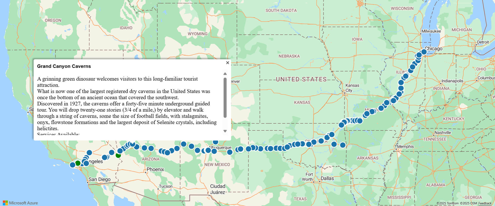

# How to use the Azure Maps Spatial IO module

The Azure Maps Web SDK provides the **Spatial IO module**, which integrates spatial data with the Azure Maps web SDK using JavaScript or TypeScript. The robust features in this module allow developers to:

- [Read and write common spatial data files](spatial-io-read-write-spatial-data.md). Supported file formats include: KML, KMZ, GPX, GeoRSS, GML, GeoJSON and CSV files containing columns with spatial information. Also supports Well-Known Text (WKT).
- [Connect to Open Geospatial Consortium (OGC) services and integrate with Azure Maps web SDK. Overlay Web Map Services (WMS) and Web Map Tile Services (WMTS) as layers on the map](spatial-io-add-ogc-map-layer.md).
- [Query data in a Web Feature Service (WFS)](spatial-io-connect-wfs-service.md).
- [Overlay complex data sets that contain style information and have them render automatically using minimal code](spatial-io-add-simple-data-layer.md).
- [Leverage high-speed XML and delimited file reader and writer classes](spatial-io-core-operations.md).

In this guide, we'll learn how to integrate and use the Spatial IO module in a web application.

This video provides an overview of Spatial IO module in the Azure Maps Web SDK.

<br/>

<iframe src="https://channel9.msdn.com/Shows/Internet-of-Things-Show/Easily-integrate-spatial-data-into-the-Azure-Maps/player" width="960" height="540" allowFullScreen frameBorder="0" title="Easily integrate spatial data into the Azure Maps - Microsoft Channel 9 Video"></iframe>


> [!WARNING]
> Only use data and services that are from a source you trust, especially if referencing it from another domain. The spatial IO module does take steps to minimize risk, however the safest approach is too not allow any danagerous data into your application to begin with. 

## Prerequisites

Before you can use the Spatial IO module, you'll need to [make an Azure Maps account](https://docs.microsoft.com/azure/azure-maps/quick-demo-map-app#create-an-account-with-azure-maps) and [get the primary subscription key for your account](https://docs.microsoft.com/azure/azure-maps/quick-demo-map-app#get-the-primary-key-for-your-account).

## Installing the Spatial IO module

You can load the Azure Maps spatial IO module using one of the two options:

* The globally hosted Azure CDN for the Azure Maps spatial IO module. For this option, you add a reference to the JavaScript in the `<head>` element of the HTML file.

    ```html
    <script src="https://atlas.microsoft.com/sdk/javascript/spatial/0/atlas-spatial.js"></script>
    ```

* The source code for [azure-maps-spatial-io](https://www.npmjs.com/package/azure-maps-spatial-io) can be loaded locally, and then hosted with your app. This package also includes TypeScript definitions. For this option, use the following command to install the package:

    ```sh
    npm install azure-maps-spatial-io
    ```

    Then, add a reference to the JavaScript in the `<head>` element of the HTML document:

    ```html
    <script src="node_modules/azure-maps-spatial-io/dist/atlas-spatial.min.js"></script>
    ```

## Using the Spatial IO module

1. Create a new HTML file.

2. Load the Azure Maps Web SDK and initialize the map control. See the [Azure Maps map control](https://docs.microsoft.com/azure/azure-maps/how-to-use-map-control) guide for the details. Once you're done with this step, your HTML file should look like this:

    ```html
    <!DOCTYPE html>
    <html>

    <head>
        <title></title>

        <meta charset="utf-8">

        <!-- Ensures that IE and Edge uses the latest version and doesn't emulate an older version -->
        <meta http-equiv="x-ua-compatible" content="IE=Edge">

        <!-- Ensures the web page looks good on all screen sizes. -->
        <meta name="viewport" content="width=device-width, initial-scale=1, shrink-to-fit=no">

        <!-- Add references to the Azure Maps Map control JavaScript and CSS files. -->
        <link rel="stylesheet" href="https://atlas.microsoft.com/sdk/javascript/mapcontrol/2/atlas.min.css" type="text/css" />
        <script src="https://atlas.microsoft.com/sdk/javascript/mapcontrol/2/atlas.js"></script>

        <script type='text/javascript'>

            var map;

            function GetMap() {
                //Initialize a map instance.
                map = new atlas.Map('myMap', {
                    view: 'Auto',

                    //Add your Azure Maps subscription key to the map SDK. Get an Azure Maps key at https://azure.com/maps
                    authOptions: {
                        authType: 'subscriptionKey',
                        subscriptionKey: '<Your Azure Maps Key>'
                    }
                });

                //Wait until the map resources are ready.
                map.events.add('ready', function() {

                    // Write your code here to make sure it runs once the map resources are ready

                });
            }
        </script>
    </head>

    <body onload="GetMap()">
        <div id="myMap"></div>
    </body>

    </html>
    ```

2. Load the Azure Maps spatial IO module. For this exercise, use the CDN for the Azure Maps spatial IO module. Add the reference below to the `<head>` element of your HTML file:

    ```html
    <script src="https://atlas.microsoft.com/sdk/javascript/spatial/0/atlas-spatial.js"></script>
    ```

3. Initialize a `datasource`, and add the data source to the map. Initialize a `layer`, and add the data source to the map layer. Then, render both the data source and the layer. Before you scroll down to see the full code in the next step, think about the best places to put the data source and layer code snippets. Recall that, before we programmatically manipulate the map, we should wait until the map resource are ready.

    ```javascript
    var datasource, layer;
    ```

    and

    ```javascript
    //Create a data source and add it to the map.
    datasource = new atlas.source.DataSource();
    map.sources.add(datasource);
    
    //Add a simple data layer for rendering the data.
    layer = new atlas.layer.SimpleDataLayer(datasource);
    map.layers.add(layer);
    ```

4. Putting it all together, your HTML code should look like the following code. This sample demonstrates how to read an XML file from a URL. Then, load and display the file's feature data on the map. 

    ```html
    <!DOCTYPE html>
    <html>

    <head>
        <title>Spatial IO Module Example</title>

        <meta charset="utf-8">

        <!-- Ensures that IE and Edge uses the latest version and doesn't emulate an older version -->
        <meta http-equiv="x-ua-compatible" content="IE=Edge">

        <!-- Ensures the web page looks good on all screen sizes. -->
        <meta name="viewport" content="width=device-width, initial-scale=1, shrink-to-fit=no">

        <!-- Add references to the Azure Maps Map control JavaScript and CSS files. -->
        <link rel="stylesheet" href="https://atlas.microsoft.com/sdk/javascript/mapcontrol/2/atlas.min.css" type="text/css" />
        <script src="https://atlas.microsoft.com/sdk/javascript/mapcontrol/2/atlas.js"></script>

        <!-- Add reference to the Azure Maps Spatial IO module. -->
        <script src="https://atlas.microsoft.com/sdk/javascript/spatial/0/atlas-spatial.js"></script>

        <script type='text/javascript'>
            var map, datasource, layer;

            function GetMap() {
                //Initialize a map instance.
                map = new atlas.Map('myMap', {
                    view: 'Auto',

                    //Add your Azure Maps subscription key to the map SDK. Get an Azure Maps key at https://azure.com/maps
                    authOptions: {
                        authType: 'subscriptionKey',
                        subscriptionKey: '<Your Azure Maps Key>'
                    }
                });

                //Wait until the map resources are ready.
                map.events.add('ready', function() {

                    //Create a data source and add it to the map.
                    datasource = new atlas.source.DataSource();
                    map.sources.add(datasource);

                    //Add a simple data layer for rendering the data.
                    layer = new atlas.layer.SimpleDataLayer(datasource);
                    map.layers.add(layer);

                    //Read an XML file from a URL or pass in a raw XML string.
                    atlas.io.read('superCoolKmlFile.xml').then(r => {
                        if (r) {
                            //Add the feature data to the data source.
                            datasource.add(r);

                            //If bounding box information is known for data, set the map view to it.
                            if (r.bbox) {
                                map.setCamera({
                                    bounds: r.bbox,
                                    padding: 50
                                });
                            }
                        }
                    });
                });
            }
        </script>
    </head>

    <body onload="GetMap()">
        <div id="myMap"></div>
    </body>

    </html>
    ```

5. Remember to replace `<Your Azure Maps Key>` with your primary key. Open your HTML file, and you'll see results similar to the following image:

    <center>

    

    </center>

## Next steps

The feature we demonstrated here is only one of the many features available in the Spatial IO module. Read the guides below to learn how to use other functionalities in the Spatial IO module:

> [!div class="nextstepaction"]
> [Add a simple data layer](spatial-io-add-simple-data-layer.md)

> [!div class="nextstepaction"]
> [Read and write spatial data](spatial-io-read-write-spatial-data.md)

> [!div class="nextstepaction"]
> [Add an OGC map layer](spatial-io-add-ogc-map-layer.md)

> [!div class="nextstepaction"]
> [Connect to a WFS service](spatial-io-connect-wfs-service.md)

> [!div class="nextstepaction"]
> [Leverage core operations](spatial-io-core-operations.md)

> [!div class="nextstepaction"]
> [Supported data format details](spatial-io-supported-data-format-details.md)

Refer to the Azure Maps Spatial IO documentation:

> [!div class="nextstepaction"]
> [Azure Maps Spatial IO package](https://docs.microsoft.com/javascript/api/azure-maps-spatial-io/)
