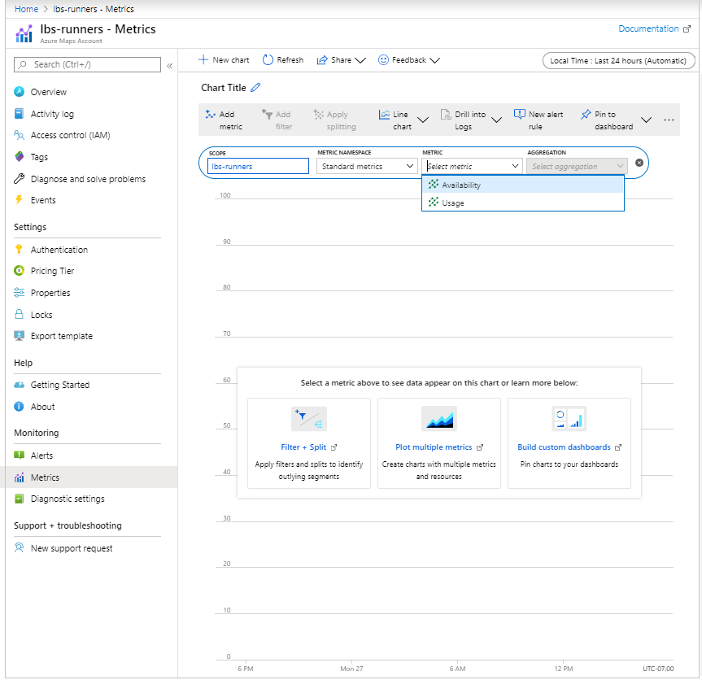
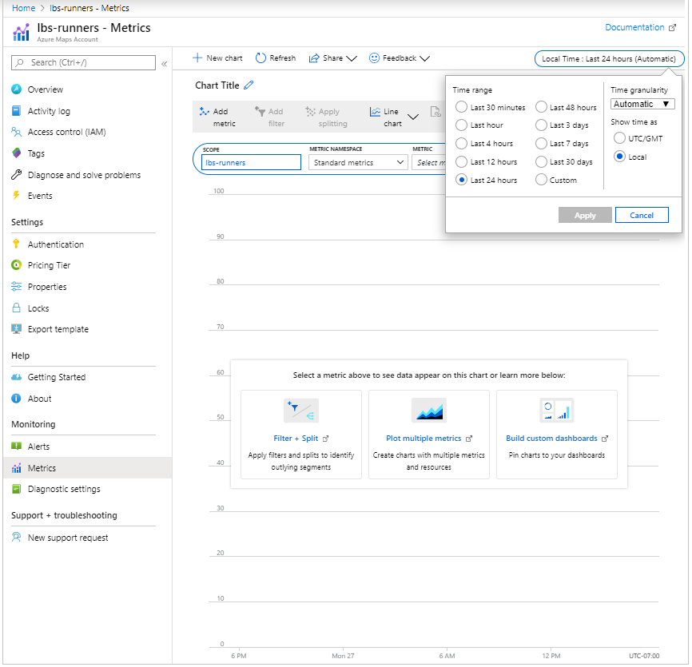
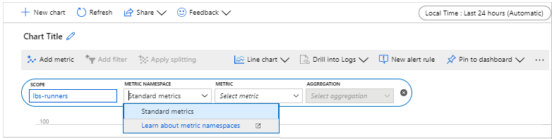
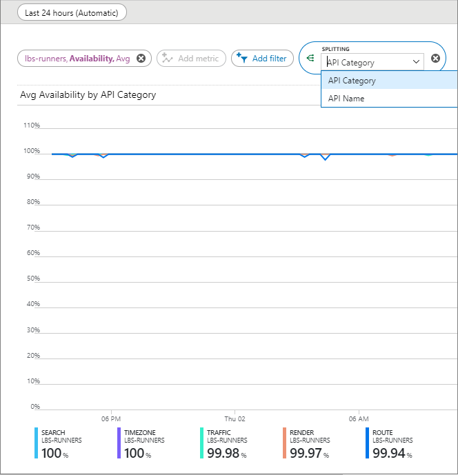

# View Azure Maps API usage metrics

This article shows you how to view the API usage metrics, for your Azure Maps account, in the [Azure portal](https://portal.azure.com). The metrics are shown in a convenient graph format along a customizable time duration.

## View metric snapshot

You can see some common metrics on the **Overview** page of your Maps account. It currently shows *Total Requests*, *Total Errors*, and *Availability* over a selectable time duration.

Continue to the next section if you need to customize these graphs for your particular analysis.

## View detailed metrics

1. Sign in to your Azure subscription in the [portal](https://portal.azure.com).

2. Click the **All resources** menu item on the left-hand side and navigate to your *Azure Maps Account*.

3. Once your Maps account is open, click on the **Metrics** menu on the left.

4. On the **Metrics** pane, choose one of the following options:

   1. **Availability** - which shows the *Average* of API availability over a period of time.
   2. **Usage** - which shows how the usage *Count* for your account.

      

5. Next, you may select the *Time range* by clicking **Last 24 hours (Automatic)**. By default, the time range is set to 24 hours. After clicking, you'll see all selectable time ranges. You can select the *Time granularity* and choose to show the time as *local* or *GMT* in the same drop-down. Click **Apply**.

    

6. Once you add your metric, you can **Add filter** from the properties relevant to that metric. Then, select the value of the property that you want to see reflected on the graph.

    

7. You may also **Apply splitting** for your metric based on your selected metric property. It allows the graph to be split into multiple graphs, for each value of that property. In the following picture, the color of each graph corresponds to the property value shown at the bottom of the graph.

    

8. You may also observe multiple metrics on the same graph, simply by clicking on the **Add metric** button on top.

## Next steps

Learn more about the Azure Maps APIs you want to track usage for:
> [!div class="nextstepaction"]	
> [Azure Maps Web SDK How-To](how-to-use-map-control.md)

> [!div class="nextstepaction"]	
> [Azure Maps Android SDK How-To](how-to-use-android-map-control-library.md)

> [!div class="nextstepaction"]
> [Azure Maps REST API documentation](https://docs.microsoft.com/rest/api/maps)
