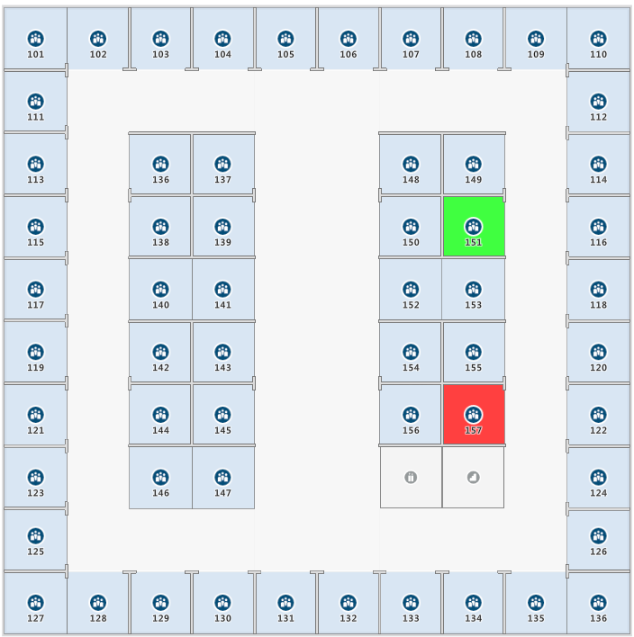

# Implement dynamic styling for Creator indoor maps

Azure Maps Creator [Feature State service](https://docs.microsoft.com/rest/api/maps/featurestate) lets you apply styles based on the dynamic properties of indoor map data features.  For example, you can render facility meeting rooms with a specific color to reflect occupancy status. In this article, we'll show you how to dynamically render indoor map features with the [Feature State service](https://docs.microsoft.com/rest/api/maps/featurestate) and the [Indoor Web Module](how-to-use-indoor-module.md).

## Prerequisites

1. [Create an Azure Maps account](quick-demo-map-app.md#create-an-account-with-azure-maps)
2. [Obtain a primary subscription key](quick-demo-map-app.md#get-the-primary-key-for-your-account), also known as the primary key or the subscription key.
3. [Create a Creator resource](how-to-manage-creator.md)
4. Download the [sample Drawing package](https://github.com/Azure-Samples/am-creator-indoor-data-examples).
5. [Create an indoor map](tutorial-creator-indoor-maps.md) to obtain a `tilesetId` and `statesetId`.
6. Build a web application by following the steps in [How to use the Indoor Map module](how-to-use-indoor-module.md).

This tutorial uses the [Postman](https://www.postman.com/) application, but you may choose a different API development environment.

## Implement dynamic styling

Once you complete the prerequisites, you should have a simple web application configured with your subscription key, `tilesetId`, and `statesetId`.

### Select features

To implement dynamic styling, a feature, such as a meeting or conference room, must be referenced by its feature `id`. You'll use the feature `id` to update the dynamic property or *state* of that feature. To view the features defined in a dataset, you can use one of the following methods:

* WFS API (Web Feature Service). Datasets can be queried using the WFS API. WFS follows the Open Geospatial Consortium API Features. The WFS API is helpful for querying features within a dataset. For example, you can use WFS to find all mid-size meeting rooms of a given facility and floor level.

* Implement customized code that allows a user to select features on a map using your web application. In this article, we'll make use of this option.  

The following script implements the mouse click event. The code retrieves the feature `id` based on the clicked point. In your application, you can insert the code below your Indoor Manager code block. Run your application and check the console to obtain the feature `id` of the clicked point.

```javascript
/* Upon a mouse click, log the feature properties to the browser's console. */
map.events.add("click", function(e){

    var features = map.layers.getRenderedShapes(e.position, "indoor");

    var result = features.reduce(function (ids, feature) {
        if (feature.layer.id == "indoor_unit_office") {
            console.log(feature);
        }
    }, []);
});
```

The [Create an indoor map](tutorial-creator-indoor-maps.md) tutorial configured the feature stateset to accept state updates for `occupancy`.

In the next section, we'll set the occupancy *state* of office `UNIT26` to `true`. while office `UNIT27` will be set to `false`.

### Set occupancy status

 We'll now update the state of the two offices, `UNIT26` and `UNIT27`:

1. In the Postman application, select **New**. In the **Create New** window, select **Request**. Enter a **Request name** and select a collection. Click **Save**

2. Use the [Feature Update States API](https://docs.microsoft.com/rest/api/maps/featurestate/updatestatespreview) to update the state. Pass the stateset ID, and `UNIT26` for one of the two units. Append your Azure Maps subscription key. Here's the URL of a **POST** request to update the state:

    ```http
    https://atlas.microsoft.com/featureState/state?api-version=1.0&statesetID={statesetId}&featureID=UNIT26&subscription-key={Azure-Maps-Primary-Subscription-key}
    ```

3. In the **Headers** of the **POST** request, set `Content-Type` to `application/json`. In the **BODY** of the **POST** request, write the following JSON with the feature updates. The update will be saved only if the posted time stamp is after the time stamp used in previous feature state update requests for the same feature `ID`. Pass the "occupied" `keyName` to update its value.

    ```json
    {
        "states": [
            {
                "keyName": "occupied",
                "value": true,
                "eventTimestamp": "2019-11-14T17:10:20"
            }
        ]
    }
    ```

4. Redo step 2 and 3 using `UNIT27`, with the following JSON.

    ``` json
    {
        "states": [
            {
                "keyName": "occupied",
                "value": false,
                "eventTimestamp": "2019-11-14T17:10:20"
            }
        ]
    }
    ```

### Visualize dynamic styles on a map

The web application you previously opened in a browser should now reflect the updated state of the map features. `UNIT27`(151) should appear green and `UNIT26`(157) should appear red.



## Next steps

Learn more by reading:

> [!div class="nextstepaction"]
> [Creator for indoor mapping](creator-indoor-maps.md)

See to the references for the APIs mentioned in this article:

> [!div class="nextstepaction"]
> [Data Upload](creator-indoor-maps.md#upload-a-drawing-package)

> [!div class="nextstepaction"]
> [Data Conversion](creator-indoor-maps.md#convert-a-drawing-package)

> [!div class="nextstepaction"]
> [Dataset](creator-indoor-maps.md#datasets)

> [!div class="nextstepaction"]
> [Tileset](creator-indoor-maps.md#tilesets)

> [!div class="nextstepaction"]
> [Feature State set](creator-indoor-maps.md#feature-statesets)

> [!div class="nextstepaction"]
> [WFS service](creator-indoor-maps.md#web-feature-service-api)

