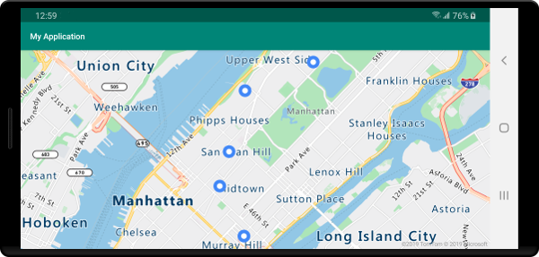
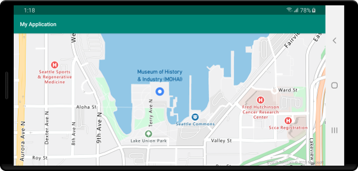

# Add a bubble layer to a map (Android SDK)

This article shows you how to render point data from a data source as a bubble layer on a map. Bubble layers render points as circles on the map with a fixed pixel radius.

> [!TIP]
> Bubble layers by default will render the coordinates of all geometries in a data source. To limit the layer so that it only renders point geometry features, set the `filter` option of the layer to `eq(geometryType(), "Point")`. If you want to include MultiPoint features as well, set the `filter` option of the layer to `any(eq(geometryType(), "Point"), eq(geometryType(), "MultiPoint"))`.

## Prerequisites

Be sure to complete the steps in the [Quickstart: Create an Android app](quick-android-map.md) document. Code blocks in this article can be inserted into the maps `onReady` event handler.

## Add a bubble layer

The following code loads an array of points into a data source. Then, it connects the data points are to a bubble layer. The bubble layer renders the radius of each bubble with five pixels and a fill color of white. And, a stroke color of blue, and a stroke width of six pixels.

::: zone pivot="programming-language-java-android"

```java
//Create a data source and add it to the map.
DataSource source = new DataSource();
map.sources.add(source);

//Create point locations.
Point[] points = new Point[] {
    Point.fromLngLat(-73.985708, 40.75773),
    Point.fromLngLat(-73.985600, 40.76542),
    Point.fromLngLat(-73.985550, 40.77900),
    Point.fromLngLat(-73.975550, 40.74859),
    Point.fromLngLat(-73.968900, 40.78859)
};

//Add multiple points to the data source.
source.add(points);

//Create a bubble layer to render the filled in area of the circle, and add it to the map.
BubbleLayer layer = new BubbleLayer(source, 
    bubbleRadius(5f),
    bubbleColor("white"),
    bubbleStrokeColor("#4288f7"),
    bubbleStrokeWidth(6f)
);

map.layers.add(layer);
```

::: zone-end

::: zone pivot="programming-language-kotlin"

```kotlin
//Create a data source and add it to the map.
val source = DataSource()
map.sources.add(source)

//Create point locations.
val points: Array<Point> = arrayOf<Point>(
    Point.fromLngLat(-73.985708, 40.75773),
    Point.fromLngLat(-73.985600, 40.76542),
    Point.fromLngLat(-73.985550, 40.77900),
    Point.fromLngLat(-73.975550, 40.74859),
    Point.fromLngLat(-73.968900, 40.78859)
)

//Add multiple points to the data source.
source.add(points)

//Create a bubble layer to render the filled in area of the circle, and add it to the map.
val layer = BubbleLayer(
    source,
    bubbleRadius(5f),
    bubbleColor("white"),
    bubbleStrokeColor("#4288f7"),
    bubbleStrokeWidth(6f)
)

map.layers.add(layer)
```

::: zone-end

The following screenshot shows the above code renders points in a bubble layer.



## Show labels with a bubble layer

This code shows you how to use a bubble layer to render a point on the map. And, how to use a symbol layer to render a label. To hide the icon of the symbol layer, set the `iconImage` option to `"none"`.

::: zone pivot="programming-language-java-android"

```java
//Create a data source and add it to the map.
DataSource source = new DataSource();
map.sources.add(source);

//Add a data point to the map.
source.add(Point.fromLngLat(-122.336641,47.627631));

//Add a bubble layer.
map.layers.add(new BubbleLayer(source,
    bubbleRadius(5f),
    bubbleColor("white"),
    bubbleStrokeColor("#4288f7"),
    bubbleStrokeWidth(6f)
));

//Add a symbol layer to display text, hide the icon image.
map.layers.add(new SymbolLayer(source,
    //Hide the icon image.
    iconImage("none"),
    textField("Museum of History & Industry (MOHAI)"),
    textColor("#005995"),
    textOffset(new Float[]{0f, -2.2f})
));
```

::: zone-end

::: zone pivot="programming-language-kotlin"

```kotlin
//Create a data source and add it to the map.
val source = DataSource()
map.sources.add(source)

//Add a data point to the map.
source.add(Point.fromLngLat(-122.336641, 47.627631))

//Add a bubble layer.
map.layers.add(
    BubbleLayer(
        source,
        bubbleRadius(5f),
        bubbleColor("white"),
        bubbleStrokeColor("#4288f7"),
        bubbleStrokeWidth(6f)
    )
)

//Add a symbol layer to display text, hide the icon image.
map.layers.add(
    SymbolLayer(
        source,  //Hide the icon image.
        iconImage("none"),
        textField("Museum of History & Industry (MOHAI)"),
        textColor("#005995"),
        textOffset(arrayOf(0f, -2.2f))
    )
)
```

::: zone-end

The following screenshot shows the above code rendering a point in a bubble layer and a text label for the point with a symbol layer.



## Next steps

See the following articles for more code samples to add to your maps:

> [!div class="nextstepaction"]
> [Create a data source](create-data-source-android-sdk.md)

> [!div class="nextstepaction"]
> [Cluster point data](clustering-point-data-android-sdk.md)

> [!div class="nextstepaction"]
> [Add a symbol layer](how-to-add-symbol-to-android-map.md)

> [!div class="nextstepaction"]
> [Use data-driven style expressions](data-driven-style-expressions-android-sdk.md)

> [!div class="nextstepaction"]
> [Display feature information](display-feature-information-android.md)
