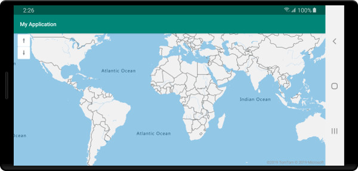
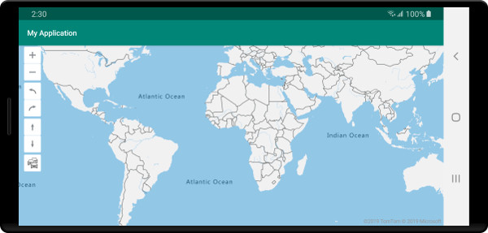

# Add controls to a map (Android SDK)

This article shows you how to add UI controls to the map.

## Add zoom control

A zoom control adds buttons for zooming the map in and out. The following code sample creates an instance of the `ZoomControl` class and adds it to a map.

::: zone pivot="programming-language-java-android"

```java
//Construct a zoom control and add it to the map.
map.controls.add(new ZoomControl());
```

::: zone-end

::: zone pivot="programming-language-kotlin"

```kotlin
//Construct a zoom control and add it to the map.
map.controls.add(ZoomControl())
```

::: zone-end

The following screenshot shows a zoom control loaded on a map.


## Add pitch control

A pitch control adds buttons for tilting the pitch to map relative to the horizon. The following code sample creates an instance of the `PitchControl` class and adds it to a map.

::: zone pivot="programming-language-java-android"

```java
//Construct a pitch control and add it to the map.
map.controls.add(new PitchControl());
```

::: zone-end

::: zone pivot="programming-language-kotlin"

```kotlin
//Construct a pitch control and add it to the map.
map.controls.add(PitchControl())
```

::: zone-end

The following screenshot shows a pitch control loaded on a map.



## Add compass control

A compass control adds a button for rotating the map. The following code sample creates an instance of the `CompassControl` class and adds it to a map.

::: zone pivot="programming-language-java-android"

```java
//Construct a compass control and add it to the map.
map.controls.add(new CompassControl());
```

::: zone-end

::: zone pivot="programming-language-kotlin"

```kotlin
//Construct a compass control and add it to the map.
map.controls.add(CompassControl())
```

::: zone-end

The following screenshot shows a compass control loaded on a map.


## Add traffic control

A traffic control adds a button for toggling the visibility of traffic data on the map. The following code sample creates an instance of the `TrafficControl` class and adds it to a map.

::: zone pivot="programming-language-java-android"

```java
//Construct a traffic control and add it to the map.
map.controls.add(new TrafficControl());
```

::: zone-end

::: zone pivot="programming-language-kotlin"

```kotlin
//Construct a traffic control and add it to the map.
map.controls.add(TrafficControl())
```

::: zone-end

The following screenshot shows a traffic control loaded on a map.


## A map with all controls

To simplify development, add multiple controls to an array and map simultaneously then position in the same area. The following code adds the standard navigation controls to the map using this approach.

::: zone pivot="programming-language-java-android"

```java
map.controls.add(
    new Control[]{
        new ZoomControl(),
        new CompassControl(),
        new PitchControl(),
        new TrafficControl()
    }
);
```

::: zone-end

::: zone pivot="programming-language-kotlin"

```kotlin
map.controls.add(
    arrayOf<Control>(
        ZoomControl(),
        CompassControl(),
        PitchControl(),
        TrafficControl()
    )
)
```

::: zone-end

The following screenshot shows all controls loaded on a map. They appear in the order they're added to the map.



## Next steps

See the following articles for more code samples to add to your maps:

> [!div class="nextstepaction"]
> [Add a symbol layer](how-to-add-symbol-to-android-map.md)

> [!div class="nextstepaction"]
> [Add a bubble layer](map-add-bubble-layer-android.md)

> [!div class="nextstepaction"]
> [Add a line layer](android-map-add-line-layer.md)

> [!div class="nextstepaction"]
> [Add a polygon layer](how-to-add-shapes-to-android-map.md)
