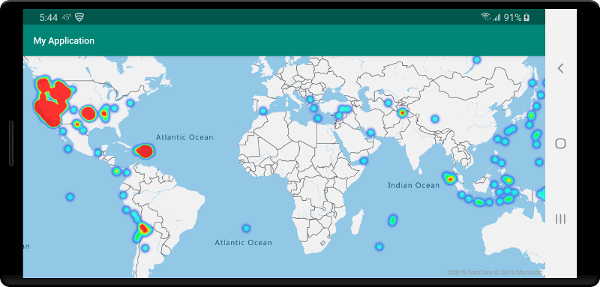
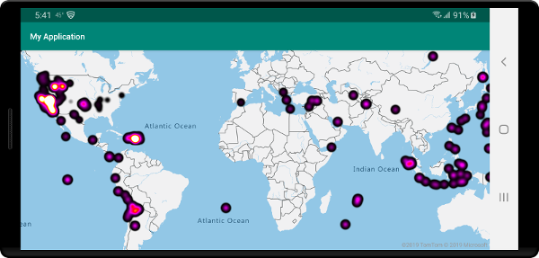
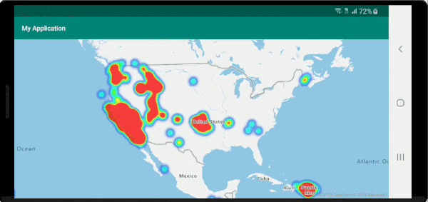
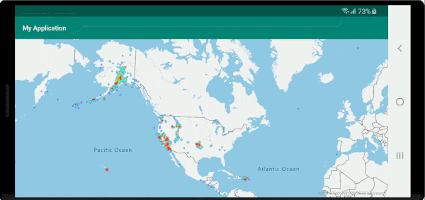

# Add a heat map layer (Android SDK)

Heat maps, also known as point density maps, are a type of data visualization. They're used to represent the density of data using a range of colors and show the data "hot spots" on a map. Heat maps are a great way to render datasets with large number of points.

Rendering tens of thousands of points as symbols can cover most of the map area. This case likely results in many symbols overlapping. Making it difficult to gain a better understanding of the data. However, visualizing this same dataset as a heat map makes it easy to see the density and the relative density of each data point.

You can use heat maps in many different scenarios, including:

- **Temperature data**: Provides approximations for what the temperature is between two data points.
- **Data for noise sensors**: Shows not only the intensity of the noise where the sensor is, but it can also provide insight into the dissipation over a distance. The noise level at any one site might not be high. If the noise coverage area from multiple sensors overlaps, it's possible that this overlapping area might experience higher noise levels. As such, the overlapped area would be visible in the heat map.
- **GPS trace**: Includes the speed as a weighted height map, where the intensity of each data point is based on the speed. For example, this functionality provides a way to see where a vehicle was speeding.

> [!TIP]
> Heat map layers by default render the coordinates of all geometries in a data source. To limit the layer so that it only renders point geometry features, set the `filter` option of the layer to `eq(geometryType(), "Point")`. If you want to include MultiPoint features as well, set the `filter` option of the layer to `any(eq(geometryType(), "Point"), eq(geometryType(), "MultiPoint"))`.

</br>

> [!VIDEO https://learn.microsoft.com/Shows/Internet-of-Things-Show/Heat-Maps-and-Image-Overlays-in-Azure-Maps/player?format=ny]

## Prerequisites

Be sure to complete the steps in the [Quickstart: Create an Android app] document. Code blocks in this article can be inserted into the maps `onReady` event handler.

## Add a heat map layer

To render a data source of points as a heat map, pass your data source into an instance of the `HeatMapLayer` class, and add it to the map.

The following code sample loads a GeoJSON feed of earthquakes from the past week and renders them as a heat map. Each data point is rendered with a radius of 10 pixels at all zoom levels. To ensure a better user experience, the heat map is below the label layer so the labels stay clearly visible. The data in this sample is from the [USGS Earthquake Hazards Program]. This sample loads GeoJSON data from the web using the data import utility code block provided in the [Create a data source] document.

::: zone pivot="programming-language-java-android"

```java
//Create a data source and add it to the map.
DataSource source = new DataSource();

//Import the geojson data and add it to the data source.
source.importDataFromUrl("https://earthquake.usgs.gov/earthquakes/feed/v1.0/summary/all_week.geojson");

//Add data source to the map.
map.sources.add(source);

//Create a heat map layer.
HeatMapLayer layer = new HeatMapLayer(source,
  heatmapRadius(10f),
  heatmapOpacity(0.8f)
);

//Add the layer to the map, below the labels.
map.layers.add(layer, "labels");
```

::: zone-end

::: zone pivot="programming-language-kotlin"

```kotlin
//Create a data source and add it to the map.
val source = DataSource()

//Import the geojson data and add it to the data source.
source.importDataFromUrl("https://earthquake.usgs.gov/earthquakes/feed/v1.0/summary/all_week.geojson")

//Add data source to the map.
map.sources.add(source)

//Create a heat map layer.
val layer = HeatMapLayer(
    source,
    heatmapRadius(10f),
    heatmapOpacity(0.8f)
)

//Add the layer to the map, below the labels.
map.layers.add(layer, "labels")
```

::: zone-end

The following screenshot shows a map loading a heat map using the above code.



## Customize the heat map layer

The previous example customized the heat map by setting the radius and opacity options. The heat map layer provides several options for customization, including:

- `heatmapRadius`: Defines a pixel radius in which to render each data point. You can set the radius as a fixed number or as an expression. By using an expression, you can scale the radius based on the zoom level, and represent a consistent spatial area on the map (for example, a 5-mile radius).
- `heatmapColor`: Specifies how the heat map is colorized. A color gradient is a common feature of heat maps. You can achieve the effect with an `interpolate` expression. You can also use a `step` expression for colorizing the heat map, breaking up the density visually into ranges that resemble a contour or radar style map. These color palettes define the colors from the minimum to the maximum density value.

  You specify color values for heat maps as an expression on the `heatmapDensity` value. The color of area where there's no data is defined at index 0 of the "Interpolation" expression, or the default color of a "Stepped" expression. You can use this value to define a background color. Often, this value is set to transparent, or a semi-transparent black.

  Here are examples of color expressions:

  | Interpolation color expression | Stepped color expression |
  |--------------------------------|--------------------------|
  | interpolate(<br/>&nbsp;&nbsp;&nbsp;&nbsp;linear(), <br/>&nbsp;&nbsp;&nbsp;&nbsp;heatmapDensity(),<br/>&nbsp;&nbsp;&nbsp;&nbsp;stop(0, color(Color.TRANSPARENT)),<br/>&nbsp;&nbsp;&nbsp;&nbsp;stop(0.01, color(Color.MAGENTA)),<br/>&nbsp;&nbsp;&nbsp;&nbsp;stop(0.5, color(parseColor("#fb00fb"))),<br/>&nbsp;&nbsp;&nbsp;&nbsp;stop(1, color(parseColor("#00c3ff")))<br/>)` | step(<br/>&nbsp;&nbsp;&nbsp;&nbsp;heatmapDensity(),<br/>&nbsp;&nbsp;&nbsp;&nbsp;color(Color.TRANSPARENT),<br/>&nbsp;&nbsp;&nbsp;&nbsp;stop(0.01, color(parseColor("#000080"))),<br/>&nbsp;&nbsp;&nbsp;&nbsp;stop(0.25, color(parseColor("#000080"))),<br/>&nbsp;&nbsp;&nbsp;&nbsp;stop(0.5, color(Color.GREEN)),<br/>&nbsp;&nbsp;&nbsp;&nbsp;stop(0.5, color(Color.YELLOW)),<br/>&nbsp;&nbsp;&nbsp;&nbsp;stop(1, color(Color.RED))<br/>) |

- `heatmapOpacity`: Specifies how opaque or transparent the heat map layer is.
- `heatmapIntensity`: Applies a multiplier to the weight of each data point to increase the overall intensity of the heatmap. It causes a difference in the weight of data points, making it easier to visualize.
- `heatmapWeight`: By default, all data points have a weight of 1, and are weighted equally. The weight option acts as a multiplier, and you can set it as a number or an expression. If a number is set as the weight, it's the equivalence of placing each data point on the map twice. For instance, if the weight is `2`, then the density doubles. Setting the weight option to a number renders the heat map in a similar way to using the intensity option.

  However, if you use an expression, the weight of each data point can be based on the properties of each data point. For example, suppose each data point represents an earthquake. The magnitude value has been an important metric for each earthquake data point. Earthquakes happen all the time, but most have a low magnitude, and aren't noticed. Use the magnitude value in an expression to assign the weight to each data point. By using the magnitude value to assign the weight, you get a better representation of the significance of earthquakes within the heat map.
- `minZoom` and `maxZoom`: The zoom level range where the layer should be displayed.
- `filter`: A filter expression used to limit the retrieved from the source and rendered in the layer.
- `sourceLayer`: If the data source connected to the layer is a vector tile source, a source layer within the vector tiles must be specified.
- `visible`: Hides or shows the layer.

The following code snippet is an example of a heat map where a liner interpolation expression is used to create a smooth color gradient. The `mag` property defined in the data is used with an exponential interpolation to set the weight or relevance of each data point.

::: zone pivot="programming-language-java-android"

```java
HeatMapLayer layer = new HeatMapLayer(source,
    heatmapRadius(10f),

    //A linear interpolation is used to create a smooth color gradient based on the heat map density.
    heatmapColor(
        interpolate(
            linear(),
            heatmapDensity(),
            stop(0, color(Color.TRANSPARENT)),
            stop(0.01, color(Color.BLACK)),
            stop(0.25, color(Color.MAGENTA)),
            stop(0.5, color(Color.RED)),
            stop(0.75, color(Color.YELLOW)),
            stop(1, color(Color.WHITE))
        )
    ),

    //Using an exponential interpolation since earthquake magnitudes are on an exponential scale.
    heatmapWeight(
       interpolate(
            exponential(2),
            get("mag"),
            stop(0,0),

            //Any earthquake above a magnitude of 6 will have a weight of 1
            stop(6, 1)
       )
    )
);
```

::: zone-end

::: zone pivot="programming-language-kotlin"

```kotlin
val layer = HeatMapLayer(source,
    heatmapRadius(10f),

    //A linear interpolation is used to create a smooth color gradient based on the heat map density.
    heatmapColor(
        interpolate(
            linear(),
            heatmapDensity(),
            stop(0, color(Color.TRANSPARENT)),
            stop(0.01, color(Color.BLACK)),
            stop(0.25, color(Color.MAGENTA)),
            stop(0.5, color(Color.RED)),
            stop(0.75, color(Color.YELLOW)),
            stop(1, color(Color.WHITE))
        )
    ),

    //Using an exponential interpolation since earthquake magnitudes are on an exponential scale.
    heatmapWeight(
       interpolate(
            exponential(2),
            get("mag"),
            stop(0,0),

            //Any earthquake above a magnitude of 6 will have a weight of 1
            stop(6, 1)
       )
    )
)
```

::: zone-end

The following screenshot shows the above custom heat map layer using the same data from the previous heat map example.



## Consistent zoomable heat map

By default, the radii of data points rendered in the heat map layer have a fixed pixel radius for all zoom levels. As you zoom the map, the data aggregates together and the heat map layer looks different. The following video shows the default behavior of the heat map where it maintains a pixel radius when zooming the map.



Use a `zoom` expression to scale the radius for each zoom level, such that each data point covers the same physical area of the map. This expression makes the heat map layer look more static and consistent. Each zoom level of the map has twice as many pixels vertically and horizontally as the previous zoom level.

Scaling the radius so that it doubles with each zoom level creates a heat map that looks consistent on all zoom levels. To apply this scaling, use `zoom` with a base 2 `exponential interpolation` expression, with the pixel radius set for the minimum zoom level and a scaled radius for the maximum zoom level calculated as `2 * Math.pow(2, minZoom - maxZoom)` as shown in the following sample. Zoom the map to see how the heat map scales with the zoom level.

::: zone pivot="programming-language-java-android"

```java
HeatMapLayer layer = new HeatMapLayer(source,
  heatmapRadius(
    interpolate(
      exponential(2),
      zoom(),

      //For zoom level 1 set the radius to 2 pixels.
      stop(1, 2f),

      //Between zoom level 1 and 19, exponentially scale the radius from 2 pixels to 2 * (maxZoom - minZoom)^2 pixels.
      stop(19, Math.pow(2, 19 - 1) * 2f)
    )
  ),
  heatmapOpacity(0.75f)
);
```

::: zone-end

::: zone pivot="programming-language-kotlin"

```kotlin
val layer = HeatMapLayer(source,
  heatmapRadius(
    interpolate(
      exponential(2),
      zoom(),

      //For zoom level 1 set the radius to 2 pixels.
      stop(1, 2f),

      //Between zoom level 1 and 19, exponentially scale the radius from 2 pixels to 2 * (maxZoom - minZoom)^2 pixels.
      stop(19, Math.pow(2.0, 19 - 1.0) * 2f)
    )
  ),
  heatmapOpacity(0.75f)
)
```

::: zone-end

The following video shows a map running the above code, which scales the radius while the map is being zoomed to create a consistent heat map rendering across zoom levels.



The `zoom` expression can only be used in `step` and `interpolate` expressions. The following expression can be used to approximate a radius in meters. This expression uses a placeholder `radiusMeters`, which you should replace with your desired radius. This expression calculates the approximate pixel radius for a zoom level at the equator for zoom levels 0 and 24, and uses an `exponential interpolation` expression to scale between these values the same way the tiling system in the map works.

::: zone pivot="programming-language-java-android"

```java
interpolate(
    exponential(2),
    zoom(),
    stop(1, product(radiusMeters, 0.000012776039596366526)),
    stop(24, product(radiusMeters, 214.34637593279402))
)
```

> [!TIP]
> When you enable clustering on the data source, points that are close to one another are grouped together as a clustered point. You can use the point count of each cluster as the weight expression for the heat map. This can significantly reduce the number of points to be rendered. The point count of a cluster is stored in a `point_count` property of the point feature:
>
> ```java
> HeatMapLayer layer = new HeatMapLayer(dataSource,
>    heatmapWeight(get("point_count"))
> );
> ```
>
> If the clustering radius is only a few pixels, there would be a small visual difference in the rendering. A larger radius groups more points into each cluster, and improves the performance of the heatmap.

::: zone-end

::: zone pivot="programming-language-kotlin"

```kotlin
interpolate(
    exponential(2),
    zoom(),
    stop(1, product(radiusMeters, 0.000012776039596366526)),
    stop(24, product(radiusMeters, 214.34637593279402))
)
```

> [!TIP]
> When you enable clustering on the data source, points that are close to one another are grouped together as a clustered point. You can use the point count of each cluster as the weight expression for the heat map. This can significantly reduce the number of points to be rendered. The point count of a cluster is stored in a `point_count` property of the point feature:
>
> ```kotlin
> var layer = new HeatMapLayer(dataSource,
>    heatmapWeight(get("point_count"))
> )
> ```
>
> If the clustering radius is only a few pixels, there would be a small visual difference in the rendering. A larger radius groups more points into each cluster, and improves the performance of the heatmap.

::: zone-end

## Next steps

For more code examples to add to your maps, see the following articles:

> [!div class="nextstepaction"]
> [Create a data source]

> [!div class="nextstepaction"]
> [Use data-driven style expressions]

[Quickstart: Create an Android app]: quick-android-map.md
[USGS Earthquake Hazards Program]: https://earthquake.usgs.gov
[Create a data source]: create-data-source-android-sdk.md
[Use data-driven style expressions]: data-driven-style-expressions-android-sdk.md
