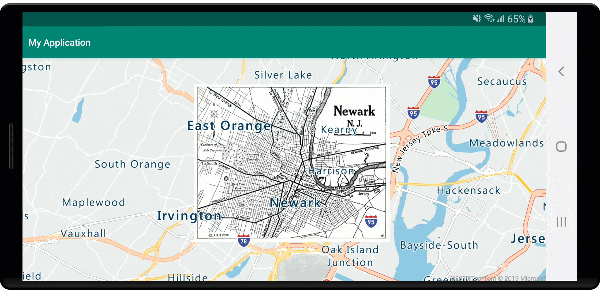
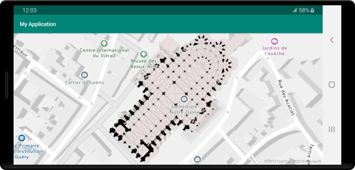

# Add an image layer to a map (Android SDK)

This article shows you how to overlay an image to a fixed set of coordinates. Here are a few examples of different images types that can be overlaid on maps:

* Images captured from drones
* Building floorplans
* Historical or other specialized map images
* Blueprints of job sites

> [!TIP]
> An image layer is an easy way to overlay an image on a map. Note that large images can consume a lot of memory and potentially cause performance issues. In this case, consider breaking your image up into tiles, and loading them into the map as a tile layer.

## Add an image layer

The following code overlays an image of a map of Newark, New Jersey, from 1922 on the map. This image is added to the `drawable` folder of the project. An image layer is created by setting the image and coordinates for the four corners in the format `[Top Left Corner, Top Right Corner, Bottom Right Corner, Bottom Left Corner]`. Adding image layers below the `label` layer is often desirable.

::: zone pivot="programming-language-java-android"

```java
//Create an image layer.
ImageLayer layer = new ImageLayer(
    imageCoordinates(
        new Position[] {
            new Position(-74.22655, 40.773941), //Top Left Corner
            new Position(-74.12544, 40.773941), //Top Right Corner
            new Position(-74.12544, 40.712216), //Bottom Right Corner
            new Position(-74.22655, 40.712216)  //Bottom Left Corner
        }
    ),
    setImage(R.drawable.newark_nj_1922)
);

//Add the image layer to the map, below the label layer.
map.layers.add(layer, "labels");
```

::: zone-end

::: zone pivot="programming-language-kotlin"

```kotlin
//Create an image layer.
val layer = ImageLayer(
    imageCoordinates(
        arrayOf<Position>(
            Position(-74.22655, 40.773941),  //Top Left Corner
            Position(-74.12544, 40.773941),  //Top Right Corner
            Position(-74.12544, 40.712216),  //Bottom Right Corner
            Position(-74.22655, 40.712216)   //Bottom Left Corner
        )
    ),
    setImage(R.drawable.newark_nj_1922)
)

//Add the image layer to the map, below the label layer.
map.layers.add(layer, "labels")
```

::: zone-end

Alternatively, a URL to an image hosted on the online can be specified. However, if your scenario allows, add the image to your projects `drawable` folder, it loads faster since the image is locally available and doesn't need to be downloaded.

::: zone pivot="programming-language-java-android"

```java
//Create an image layer.
ImageLayer layer = new ImageLayer(
    imageCoordinates(
        new Position[] {
            new Position(-74.22655, 40.773941), //Top Left Corner
            new Position(-74.12544, 40.773941), //Top Right Corner
            new Position(-74.12544, 40.712216), //Bottom Right Corner
            new Position(-74.22655, 40.712216)  //Bottom Left Corner
        }
    ),
    setUrl("https://www.lib.utexas.edu/maps/historical/newark_nj_1922.jpg")
);

//Add the image layer to the map, below the label layer.
map.layers.add(layer, "labels");
```

::: zone-end

::: zone pivot="programming-language-kotlin"

```kotlin
//Create an image layer.
val layer = ImageLayer(
    imageCoordinates(
        arrayOf<Position>(
            Position(-74.22655, 40.773941),  //Top Left Corner
            Position(-74.12544, 40.773941),  //Top Right Corner
            Position(-74.12544, 40.712216),  //Bottom Right Corner
            Position(-74.22655, 40.712216) //Bottom Left Corner
        )
    ),
    setUrl("https://www.lib.utexas.edu/maps/historical/newark_nj_1922.jpg")
)

//Add the image layer to the map, below the label layer.
map.layers.add(layer, "labels")
```

::: zone-end

The following screenshot shows a map of Newark, New Jersey, from 1922 overlaid using an image layer.



## Import a KML file as ground overlay

This sample demonstrates how to add KML ground overlay information as an image layer on the map. KML ground overlays provide north, south, east, and west coordinates, and a counter-clockwise rotation. But, the image layer expects coordinates for each corner of the image. The KML ground overlay in this sample is for the Chartres cathedral, and it's sourced from [Wikimedia](https://commons.wikimedia.org/wiki/File:Chartres.svg/overlay.kml).

```xml
<?xml version="1.0" encoding="UTF-8"?>
<kml xmlns="http://www.opengis.net/kml/2.2" xmlns:gx="http://www.google.com/kml/ext/2.2" xmlns:kml="http://www.opengis.net/kml/2.2" xmlns:atom="http://www.w3.org/2005/Atom">
<GroundOverlay>
    <name>Map of Chartres cathedral</name>
    <Icon>
        <href>https://upload.wikimedia.org/wikipedia/commons/thumb/e/e3/Chartres.svg/1600px-Chartres.svg.png</href>
        <viewBoundScale>0.75</viewBoundScale>
    </Icon>
    <LatLonBox>
        <north>48.44820923628113</north>
        <south>48.44737203258976</south>
        <east>1.488833825534365</east>
        <west>1.486788581643038</west>
        <rotation>46.44067597839695</rotation>
    </LatLonBox>
</GroundOverlay>
</kml>
```

The code uses the static `getCoordinatesFromEdges` method from the `ImageLayer` class. This method calculates the four corners of the image using the north, south, east, west, and rotation information of the KML ground overlay.

::: zone pivot="programming-language-java-android"

```java
//Calculate the corner coordinates of the ground overlay.
Position[] corners = ImageLayer.getCoordinatesFromEdges(
    //North, south, east, west
    48.44820923628113, 48.44737203258976, 1.488833825534365, 1.486788581643038,

    //KML rotations are counter-clockwise, subtract from 360 to make them clockwise.
    360 - 46.44067597839695
);

//Create an image layer.
ImageLayer layer = new ImageLayer(
    imageCoordinates(corners),
    setUrl("https://upload.wikimedia.org/wikipedia/commons/thumb/e/e3/Chartres.svg/1600px-Chartres.svg.png")
);

//Add the image layer to the map, below the label layer.
map.layers.add(layer, "labels");
```

::: zone-end

::: zone pivot="programming-language-kotlin"

```kotlin
//Calculate the corner coordinates of the ground overlay.
val corners: Array<Position> =
    ImageLayer.getCoordinatesFromEdges( //North, south, east, west
        48.44820923628113,
        48.44737203258976,
        1.488833825534365,
        1.486788581643038,  //KML rotations are counter-clockwise, subtract from 360 to make them clockwise.
        360 - 46.44067597839695
    )

//Create an image layer.
val layer = ImageLayer(
    imageCoordinates(corners),
    setUrl("https://upload.wikimedia.org/wikipedia/commons/thumb/e/e3/Chartres.svg/1600px-Chartres.svg.png")
)

//Add the image layer to the map, below the label layer.
map.layers.add(layer, "labels")
```

::: zone-end

The following screenshot shows a map with a KML ground overlay overlaid using an image layer.



> [!TIP]
> Use the `getPixels` and `getPositions` methods of the image layer class to convert between geographic coordinates of the positioned image layer and the local image pixel coordinates.

## Next steps

See the following article to learn more about ways to overlay imagery on a map.

> [!div class="nextstepaction"]
> [Add a tile layer](how-to-add-tile-layer-android-map.md)
