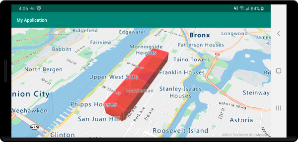
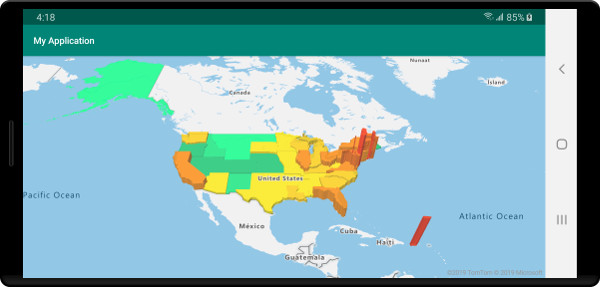

# Add a polygon extrusion layer to the map (Android SDK)

This article shows you how to use the polygon extrusion layer to render areas of `Polygon` and `MultiPolygon` feature geometries as extruded shapes.

## Use a polygon extrusion layer

Connect the polygon extrusion layer to a data source. Then, loaded it on the map. The polygon extrusion layer renders the areas of a `Polygon` and `MultiPolygon` features as extruded shapes. The `height` and `base` properties of the polygon extrusion layer define the base distance from the ground and height of the extruded shape in **meters**. The following code shows how to create a polygon, add it to a data source, and render it using the Polygon extrusion layer class.

> [!NOTE]
> The `base` value defined in the polygon extrusion layer should be less than or equal to that of the `height`.

::: zone pivot="programming-language-java-android"

```java
//Create a data source and add it to the map.
DataSource source = new DataSource();
map.sources.add(source);

//Create a polygon.
source.add(Polygon.fromLngLats(
    Arrays.asList(
        Arrays.asList(
            Point.fromLngLat(-73.958383, 40.800279),
            Point.fromLngLat(-73.981547, 40.768459),
            Point.fromLngLat(-73.981246, 40.767761),
            Point.fromLngLat(-73.973618, 40.764616),
            Point.fromLngLat(-73.973060, 40.765128),
            Point.fromLngLat(-73.972599, 40.764908),
            Point.fromLngLat(-73.949446, 40.796584),
            Point.fromLngLat(-73.949661, 40.797088),
            Point.fromLngLat(-73.957815, 40.800523),
            Point.fromLngLat(-73.958383, 40.800279)
        )
    )
));

//Create and add a polygon extrusion layer to the map below the labels so that they are still readable.
PolygonExtrusionLayer layer = new PolygonExtrusionLayer(source,
    fillColor("#fc0303"),
    fillOpacity(0.7f),
    height(500f)
);

//Create and add a polygon extrusion layer to the map below the labels so that they are still readable.
map.layers.add(layer, "labels");
```

::: zone-end

::: zone pivot="programming-language-kotlin"

```kotlin
//Create a data source and add it to the map.
val source = DataSource()
map.sources.add(source)

//Create a polygon.
source.add(
    Polygon.fromLngLats(
        Arrays.asList(
            Arrays.asList(
                Point.fromLngLat(-73.958383, 40.800279),
                Point.fromLngLat(-73.981547, 40.768459),
                Point.fromLngLat(-73.981246, 40.767761),
                Point.fromLngLat(-73.973618, 40.764616),
                Point.fromLngLat(-73.973060, 40.765128),
                Point.fromLngLat(-73.972599, 40.764908),
                Point.fromLngLat(-73.949446, 40.796584),
                Point.fromLngLat(-73.949661, 40.797088),
                Point.fromLngLat(-73.957815, 40.800523),
                Point.fromLngLat(-73.958383, 40.800279)
            )
        )
    )
)

//Create and add a polygon extrusion layer to the map below the labels so that they are still readable.
val layer = PolygonExtrusionLayer(
    source,
    fillColor("#fc0303"),
    fillOpacity(0.7f),
    height(500f)
)

//Create and add a polygon extrusion layer to the map below the labels so that they are still readable.
map.layers.add(layer, "labels")
```

::: zone-end

The following screenshot shows the above code rendering a polygon stretched vertically using a polygon extrusion layer.



## Add data driven polygons

A choropleth map can be rendered using the polygon extrusion layer. Set the `height` and `fillColor` properties of the extrusion layer to the measurement of the statistical variable in the `Polygon` and `MultiPolygon` feature geometries. The following code sample shows an extruded choropleth map of the United States based on the measurement of the population density by state.

::: zone pivot="programming-language-java-android"

```java
//Create a data source and add it to the map.
DataSource source = new DataSource();

//Import the geojson data and add it to the data source.
source.importDataFromUrl("https://samples.azuremaps.com/data/geojson/US_States_Population_Density.json");

//Add data source to the map.
map.sources.add(source);

//Create and add a polygon extrusion layer to the map below the labels so that they are still readable.
PolygonExtrusionLayer layer = new PolygonExtrusionLayer(source,
    fillOpacity(0.7f),
    fillColor(
        step(
            get("density"),
            literal("rgba(0, 255, 128, 1)"),
            stop(10, "rgba(9, 224, 118, 1)"),
            stop(20, "rgba(11, 191, 103, 1)"),
            stop(50, "rgba(247, 227, 5, 1)"),
            stop(100, "rgba(247, 199, 7, 1)"),
            stop(200, "rgba(247, 130, 5, 1)"),
            stop(500, "rgba(247, 94, 5, 1)"),
            stop(1000, "rgba(247, 37, 5, 1)")
        )
    ),
    height(
        interpolate(
            linear(),
            get("density"),
            stop(0, 100),
            stop(1200, 960000)
        )
    )
);

//Create and add a polygon extrusion layer to the map below the labels so that they are still readable.
map.layers.add(layer, "labels");
```

::: zone-end

::: zone pivot="programming-language-kotlin"

```kotlin
//Create a data source and add it to the map.
val source = DataSource()

//Import the geojson data and add it to the data source.
source.importDataFromUrl("https://samples.azuremaps.com/data/geojson/US_States_Population_Density.json")

//Add data source to the map.
map.sources.add(source)

//Create and add a polygon extrusion layer to the map below the labels so that they are still readable.
val layer = PolygonExtrusionLayer(
    source,
    fillOpacity(0.7f),
    fillColor(
        step(
            get("density"),
            literal("rgba(0, 255, 128, 1)"),
            stop(10, "rgba(9, 224, 118, 1)"),
            stop(20, "rgba(11, 191, 103, 1)"),
            stop(50, "rgba(247, 227, 5, 1)"),
            stop(100, "rgba(247, 199, 7, 1)"),
            stop(200, "rgba(247, 130, 5, 1)"),
            stop(500, "rgba(247, 94, 5, 1)"),
            stop(1000, "rgba(247, 37, 5, 1)")
        )
    ),
    height(
        interpolate(
            linear(),
            get("density"),
            stop(0, 100),
            stop(1200, 960000)
        )
    )
)

//Create and add a polygon extrusion layer to the map below the labels so that they are still readable.
map.layers.add(layer, "labels")
```

::: zone-end

The following screenshot shows a choropleth map of US states colored and stretched vertically as extruded polygons based on population density.



## Next steps

See the following articles for more code samples to add to your maps:

> [!div class="nextstepaction"]
> [Create a data source](create-data-source-android-sdk.md)

> [!div class="nextstepaction"]
> [Use data-driven style expressions](data-driven-style-expressions-android-sdk.md)

> [!div class="nextstepaction"]
> [Add a polygon layer](how-to-add-shapes-to-android-map.md)
