# Tutorial: Migrate a web app from Bing Maps

Web apps that use Bing Maps often use the Bing Maps V8 JavaScript SDK. The Azure Maps Web SDK is the suitable Azure-based SDK to migrate to. The Azure Maps Web SDK lets you customize interactive maps with your own content and imagery for display in your web or mobile applications. This control makes use of WebGL, allowing you to render large data sets with high performance. Develop with this SDK using JavaScript or TypeScript. This tutorial demonstrates how to:

> [!div class="checklist"]
>
> * Load a map
> * Localize a map
> * Add pushpins, polylines, and polygons.
> * Display information in a popup or infobox
> * Load and display KML and GeoJSON data
> * Cluster pushpins
> * Overlay a tile layer
> * Show traffic data
> * Add a ground overlay

If migrating an existing web application, check to see if it's using an open-source map control library such as Cesium, Leaflet, and OpenLayers. In such case, connect your application to the Azure Maps [Render] services ([road tiles] | [satellite tiles]). The following links provide details on how to use Azure Maps in commonly used open-source map control libraries.

* [Cesium] - A 3D map control for the web. <!--[Cesium code samples] \|--> [Cesium plugin]
* [Leaflet] – Lightweight 2D map control for the web. [Leaflet code samples] \| [Leaflet plugin]
* [OpenLayers] - A 2D map control for the web that supports projections. <!--[OpenLayers code samples] \|--> [OpenLayers plugin]

If developing using a JavaScript framework, one of the following open-source projects may be useful:

* [ng-azure-maps] - Angular 10 wrapper around Azure maps.
* [AzureMapsControl.Components] - An Azure Maps Blazor component.
* [Azure Maps React Component] - A react wrapper for the Azure Maps control.
* [Vue Azure Maps] - An Azure Maps component for Vue application.

## Prerequisites

If you don't have an Azure subscription, create a [free account] before you begin.

* An [Azure Maps account]
* A [subscription key]

## Key features support

The following table lists key API features in the Bing Maps V8 JavaScript SDK and the support of a similar API in the Azure Maps Web SDK.

| Bing Maps feature        | Azure Maps Web SDK support                                            |
|--------------------------|:---------------------------------------------------------------------:|
| Pushpins                 | ✓                                                                    |
| Pushpin clustering       | ✓                                                                    |
| Polylines & Polygons     | ✓                                                                    |
| Ground Overlays          | ✓                                                                    |
| Heat maps                | ✓                                                                    |
| Tile Layers              | ✓                                                                    |
| KML Layer                | ✓                                                                    |
| Contour layer            | [Contour layer code samples]                                         |
| Data binning layer       | Included in the open-source Azure Maps [Gridded Data Source module]  |
| Animated tile layer      | Included in the open-source Azure Maps [Animation module]            |
| Drawing tools            | ✓                                                                    |
| Geocoder service         | ✓                                                                    |
| Directions service       | ✓                                                                    |
| Distance Matrix service  | ✓                                                                    |
| Spatial Data service     | N/A                                                                  |
| Satellite/Aerial imagery | ✓                                                                    |
| Birds eye imagery         | N/A                                                                 |
| Streetside imagery       | N/A                                                                  |
| GeoJSON support          | ✓                                                                    |
| GeoXML support           | ✓ [Spatial IO module]                                                |
| Well-Known Text support  | ✓                                                                    |
| Custom map styles        | Partial                                                              |

Azure Maps more [open-source modules for the web SDK] that extend its capabilities.

## Notable differences in the web SDKs

The following are some of the key differences between the Bing Maps and Azure Maps Web SDKs to be aware of:

* In addition to providing a hosted endpoint for accessing the Azure Maps Web SDK, an npm package is available for embedding the Web SDK into apps if preferred. For more information, see [Use the Azure Maps map control]. This package also includes TypeScript definitions.
* Bing Maps provides two hosted branches of their SDK; Release and Experimental. The Experimental branch may receive multiple updates a day when new development is taking place. Azure Maps only hosts a release branch, however experimental features are created as custom modules in the open-source Azure Maps code samples project. Bing Maps used to have a frozen branch as well that was updated less frequently, thus reducing the risk of breaking changes due to a release. In Azure Maps, you can use the npm module and point to any previous minor version release.

> [!TIP]
> Azure Maps publishes both minified and unminified versions of the SDK. Simply remove `.min` from the file names. The unminified version is useful when debugging issues but be sure to use the minified version in production to take advantage of the smaller file size.

* Once an instance of the Map class is created in Azure Maps, your code should wait for the maps `ready` or `load` event to fire before interacting with the map. These events ensure that all the map resources are loaded and ready to be accessed.
* Both platforms use a similar tiling system for the base maps, however the tiles in Bing Maps are 256 pixels and are 512 pixels in Azure Maps. To get the same map view in Azure Maps as Bing Maps, subtract one zoom level in Azure Maps.
* Coordinates in Bing Maps are referred to as `latitude, longitude` while Azure Maps uses `longitude, latitude`. This format aligns with the standard `[x, y]` that is followed by most GIS platforms.

* Shapes in the Azure Maps Web SDK are based on the GeoJSON schema. Helper classes are exposed through the [atlas.data namespace]. There's also the [atlas.Shape] class that can be used to wrap GeoJSON objects and make them easy to update and maintain in a data bindable way.
* Coordinates in Azure Maps are defined as Position objects that can be specified as a simple number array in the format `[longitude, latitude]` or `new atlas.data.Position(longitude, latitude)`.

> [!TIP]
> The Position class has a static helper function for importing coordinates that are in `latitude, longitude` format. The [atlas.data.Position.fromLatLng] function can often be replace the `new Microsoft.Maps.Location` function in Bing Maps code.

* Rather than specifying styling information on each shape that is added to the map, Azure Maps separates styles from the data. Data is stored in data sources and is connected to rendering layers that Azure Maps code uses to render the data. This approach provides enhanced performance benefit. Many layers support data-driven styling, done by adding business logic to layer style options that change how individual shapes are rendered within a layer depending on its properties.
* Azure Maps provides spatial math functions in the `atlas.math` namespace that differ from Bing Maps spatial math functions. The primary difference is that Azure Maps doesn’t provide built-in functions for binary operations such as `union` and `intersection`. However, Azure Maps is based on the open GeoJSON standard and there are open-source libraries available. One popular option that works well with Azure Maps and provides spatial math capabilities is [turf js].

For more information on terminology related to Azure Maps, see the [Azure Maps Glossary].

## Web SDK side-by-side examples

The following list is a collection of code samples for each platform that cover common use cases to help you migrate your web application from Bing Maps V8 JavaScript SDK to the Azure Maps Web SDK. Code samples related to web applications are provided in JavaScript; however, Azure Maps also provides TypeScript definitions in an npm module. For more information about TypeScript definitions, see [Use the Azure Maps map control].

**Topics**

* [Load a map]
* [Localizing the map]
* [Setting the map view]
* [Adding a pushpin]
* [Adding a custom pushpin]
* [Adding a polyline]
* [Adding a polygon]
* [Display an infobox]
* [Pushpin clustering]
* [Add a heat map]
* [Overlay a tile layer]
* [Show traffic data]
* [Add a ground overlay]
* [Add KML data to the map]
* [Add drawing tools]

### Load a map

Loading a map in both SDKs follows the same set of steps;

* Add a reference to the Map SDK.
* Add a `div` tag to the body of the page that acts as a placeholder for the map.
* Create a JavaScript function that gets called when the page has loaded.
* Create an instance of the respective map class.

**Key differences**

* Bing maps require an account key specified in the script reference of the API or as a map option. Authentication credentials for Azure Maps are specified as options of the map class as either [Shared Key authentication] or [Microsoft Entra ID].
* Bing Maps takes in a callback function in the script reference of the API that is used to call an initialization function to load the map. With Azure Maps, the onload event of the page should be used.
* When using an ID to reference the `div` element that the map is rendered in, Bing Maps uses an HTML selector (`#myMap`), whereas Azure Maps only uses the ID value (`myMap`).
* Coordinates in Azure Maps are defined as Position objects that can be specified as a simple number array in the format `[longitude, latitude]`.
* The zoom level in Azure Maps is one level lower than the Bing Maps example due to the difference in tiling system sizes between the platforms.
* By default, Azure Maps doesn’t add any navigation controls to the map canvas, such as zoom buttons and map style buttons. There are however controls for adding a map style picker, zoom buttons, compass or rotation control, and a pitch control.
* An event handler is added in Azure Maps to monitor the `ready` event of the map instance. This fires when the map has finished loading the WebGL context and all resources needed. Any post load code can be added in this event handler.

The following examples demonstrate loading a basic map centered over New York at coordinates (longitude: -73.985, latitude: 40.747) and is at zoom level 12 in Bing Maps.

**Before: Bing Maps**

The following code is an example of how to display a Bing Map centered and zoomed over a location.

```html
<!DOCTYPE html>
<html>
<head>
    <title></title>
    <meta charset="utf-8" />
    <meta http-equiv="x-ua-compatible" content="IE=Edge" />
    <meta name="viewport" content="width=device-width, initial-scale=1, shrink-to-fit=no" />

    <script type='text/javascript'>
        var map;

        function initMap() {
            map = new Microsoft.Maps.Map('#myMap', {
                credentials: '<Your Bing Maps Key>',
                center: new Microsoft.Maps.Location(40.747, -73.985),
                zoom: 12
            });
        }
    </script>

    <!-- Bing Maps Script Reference -->
    <script src="https://www.bing.com/api/maps/mapcontrol?callback=initMap" async defer></script>
</head>
<body>
    <div id='myMap' style='position:relative;width:600px;height:400px;'></div>
</body>
</html>
```

Running this code in a browser displays a map that looks like the following image:

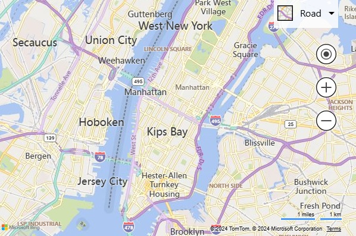

**After: Azure Maps**

The following code shows how to load a map with the same view in Azure Maps along with a map style control and zoom buttons.

```html
<!DOCTYPE html>
<html>
<head>
    <title></title>
    <meta charset="utf-8" />
    <meta http-equiv="x-ua-compatible" content="IE=Edge" />
    <meta name="viewport" content="width=device-width, initial-scale=1, shrink-to-fit=no" />

    <!-- Add references to the Azure Maps Map control JavaScript and CSS files. -->
    <link rel="stylesheet" href="https://atlas.microsoft.com/sdk/javascript/mapcontrol/3/atlas.min.css" type="text/css" />
    <script src="https://atlas.microsoft.com/sdk/javascript/mapcontrol/3/atlas.min.js"></script>

    <script type='text/javascript'>
        var map;

        function initMap() {
            map = new atlas.Map('myMap', {
                center: [-73.985, 40.747],  //Format coordinates as longitude, latitude.
                zoom: 11,   //Subtract the zoom level by one.

                //Add your Azure Maps key to the map SDK. Get an Azure Maps key at https://azure.com/maps. NOTE: The primary key should be used as the key.
                authOptions: {
                    authType: 'subscriptionKey',
                    subscriptionKey: '<Your Azure Maps Key>'
                }
            });

            //Wait until the map resources are ready.
            map.events.add('ready', function () {
                //Add zoom and map style controls to top right of map.
                map.controls.add([
                        new atlas.control.StyleControl(),
                        new atlas.control.ZoomControl()
                    ], {
                        position: 'top-right'
                });
            });
        }
    </script>
</head>
<body onload="initMap()">
    <div id='myMap' style='position:relative;width:600px;height:400px;'></div>
</body>
</html>
```

Running this code in a browser displays a map that looks like the following image:

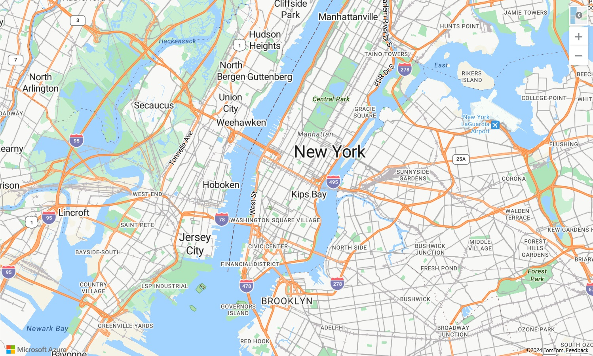

For more information on how to set up and use the Azure Maps map control in a web app, see [Use the Azure Maps map control].

> [!TIP]
> Azure Maps publishes both minified and unminified versions of the SDK. Remove `.min` from the file names. The unminified version is useful when debugging issues but be sure to use the minified version in production to take advantage of the smaller file size.

**More resources**

* For more information on Azure Maps navigation controls for rotating and pitching a map, see [Add controls to a map].

### Localizing the map

If your audience is spread across multiple countries/regions or speak different languages, localization is important.

**Before: Bing Maps**

To localize Bing Maps, language and region are specified using the `setLang` and `UR` parameters are added to `<script>` tag reference to the API. Certain features in Bing Maps are only available
in certain markets, as such the market of the user is specified using the `setMkt` parameter.

```html
<script type="text/javascript" src="https://www.bing.com/api/maps/mapcontrol?callback=initMap&setLang={language-code}&setMkt={market}&UR={region-code}" async defer></script>
```

Here's an example of Bing Maps with the language set to `fr-FR`.


**After: Azure Maps**

Azure Maps only provides options for setting the language and regional view of the map. A market parameter isn't used to limit features. There are two different ways of setting the language and regional view of the map. The first option is to add this information to the global `atlas` namespace that results in all map control instances in your app defaulting to these settings. The following sets the language to French (`fr-FR`) and the regional view to `"Auto"`:

```javascript
atlas.setLanguage('fr-FR');
atlas.setView('auto');
```

The second option is to pass this information into the map options when loading the map like:

```javascript
map = new atlas.Map('myMap', {
    language: 'fr-FR',
    view: 'auto',

    authOptions: {
        authType: 'subscriptionKey',
        subscriptionKey: '<Your Azure Maps Key>'
    }
});
```

> [!NOTE]
> Azure Maps can load multiple map instances on the same page with different language and region settings. It is also possible to update these settings in the map after it has loaded. For a list of supported languages in Azure Maps, see [Localization support in Azure Maps].

Here's an example of Azure Maps with the language set to "fr" and the user region set to `fr-FR`.


### Setting the map view

Dynamic maps in both Bing and Azure Maps can be programmatically moved to new geographic locations by calling the appropriate functions in JavaScript. The following example demonstrates a map displaying satellite aerial imagery, centered over a location with coordinates (longitude: -111.0225, latitude: 35.0272) and change the zoom level to 15 in Bing Maps.

> [!NOTE]
> Bing Maps uses tiles that are 256 pixels in dimensions while Azure Maps uses a larger 512-pixel tile. This reduces the number of network requests needed by Azure Maps to load the same map area as Bing Maps. However, due to the way tile pyramids work in map controls, the larger tiles in Azure Maps means that to achieve that same viewable area as a map in Bing Maps, you need to subtract the zoom level used in Bing Maps by 1 when using Azure Maps.

**Before: Bing Maps**

The Bing Maps map control can be programmatically moved using the `setView` function that allows you to specify the center of the map and a zoom level.

```javascript
map.setView({
    mapTypeId: Microsoft.Maps.MapTypeId.aerial,
    center: new Microsoft.Maps.Location(35.0272, -111.0225),
    zoom: 15
});
```

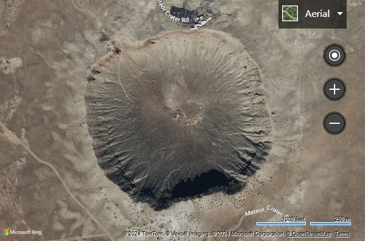

**After: Azure Maps**

In Azure Maps, the map position can be changed programmatically by using the `setCamera` function of the map and the map style can be changed using the `setStyle` function. The coordinates in Azure Maps are in "longitude, latitude" format, and the zoom level value is subtracted by 1.

```javascript
map.setCamera({
    center: [-111.0225, 35.0272],
    zoom: 14
});

map.setStyle({
    style: 'satellite_road_labels'
});
```

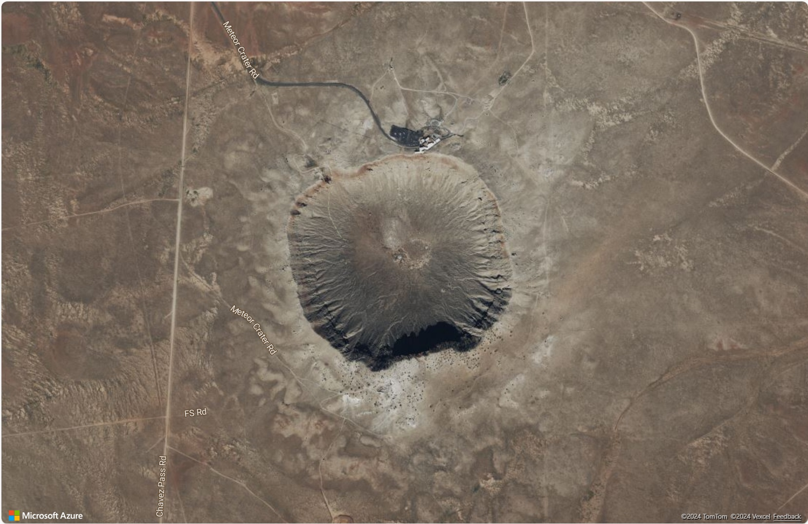

**More resources**

* [Choose a map style]
* [Supported map styles]

### Adding a pushpin

In Azure Maps, there are multiple ways that point data can be rendered on the map;

* HTML Markers – Renders points using traditional DOM elements. HTML Markers support dragging.
* Symbol Layer – Renders points with an icon and/or text within the WebGL context.
* Bubble Layer – Renders points as circles on the map. The radii of the circles can be scaled based on properties in the data.

Both Symbol and Bubble layers are rendered within the WebGL context and are capable of rendering large sets of points on the map. These layers require data to be stored in a data source. Data sources and rendering layers should be added to the map after the `ready` event has fired. HTML Markers are rendered as DOM elements within the page and don’t use a data source. The more DOM elements a page has, the slower the page becomes. If rendering more than a few hundred points on a map, it's recommended to use one of the rendering layers instead.

The following examples add a marker to the map at (longitude: -0.2, latitude: 51.5) with the number 10 overlaid as a label.

**Before: Bing Maps**

With Bing Maps, markers are added to the map using the `Microsoft.Maps.Pushpin` class*. Pushpins are then added to the map using one of two functions.

The first function is to create a layer, insert the pushpin to that and then add the layer to the map’s `layers` property.

```javascript
var pushpin = new Microsoft.Maps.Pushpin(new Microsoft.Maps.Location(51.5, -0.2), {
    text: '10'
});

var layer = new Microsoft.Maps.Layer();
layer.add(pushpin);
map.layers.insert(layer);
```

The second is to add it using the map’s `entities` property. This function is marked deprecated in the documentation for Bing Maps V8 however it has remained partially functional for basic scenarios.

```javascript
var pushpin = new Microsoft.Maps.Pushpin(new Microsoft.Maps.Location(51.5, -0.2), {
    text: '10'
});

map.entities.add(pushpin);
```


**After: Azure Maps using HTML Markers**

In Azure Maps, HTML markers can be used to easily display a point on the map and are recommended for simple apps that only need to display a few points on the map. To use an HTML marker, create an instance of the `atlas.HtmlMarker` class, set the text and position options, and add the marker to the map using the `map.markers.add` function.

```javascript
//Create a HTML marker and add it to the map.
map.markers.add(new atlas.HtmlMarker({
    text: '10',
    position: [-0.2, 51.5]
}));
```


**After: Azure Maps using a Symbol Layer**

When using a Symbol layer, the data must be added to a data source, and the data source attached to the layer. Additionally, the data source and layer should be added to the map after the `ready` event has fired. To render a unique text value above a symbol, the text information needs to be stored as a property of the data point and that property referenced in the `textField` option of the layer. This is a bit more work than using HTML markers but provides performance advantages.

```html
<!DOCTYPE html>
<html>
<head>
    <title></title>
    <meta charset="utf-8" />
    <meta http-equiv="x-ua-compatible" content="IE=Edge" />
    <meta name="viewport" content="width=device-width, initial-scale=1, shrink-to-fit=no" />

    <!-- Add references to the Azure Maps Map control JavaScript and CSS files. -->
    <link rel="stylesheet" href="https://atlas.microsoft.com/sdk/javascript/mapcontrol/3/atlas.min.css" type="text/css" />
    <script src="https://atlas.microsoft.com/sdk/javascript/mapcontrol/3/atlas.min.js"></script>

    <script type='text/javascript'>
        var map, datasource;

        function initMap() {
            map = new atlas.Map('myMap', {
                center: [-0.2, 51.5],
                zoom: 9,
                
                authOptions: {
                    authType: 'subscriptionKey',
                    subscriptionKey: '<Your Azure Maps Key>'
                }
            });

            //Wait until the map resources are ready.
            map.events.add('ready', function () {

                //Create a data source and add it to the map.
                datasource = new atlas.source.DataSource();
                map.sources.add(datasource);

                //Create a point feature, add a property to store a label for it, and add it to the data source.
                datasource.add(new atlas.data.Feature(new atlas.data.Point([-0.2, 51.5]), {
                    label: '10'
                }));

                //Add a layer for rendering point data as symbols.
                map.layers.add(new atlas.layer.SymbolLayer(datasource, null, {
                    textOptions: {
                        //Use the label property to populate the text for the symbols.
                        textField: ['get', 'label'],
                        color: 'white',
                        offset: [0, -1]
                    }
                }));
            });
        }
    </script>
</head>
<body onload="initMap()">
    <div id='myMap' style='position:relative;width:600px;height:400px;'></div>
</body>
</html>
```


**More resources**

* [Create a data source]
* [Add a Symbol layer]
* [Add a Bubble layer]
* [Cluster point data]
* [Add HTML Markers]
* [Use data-driven style expressions]
* [Symbol layer icon options]
* [Symbol layer text option]
* [HTML marker class]
* [HTML marker options]

### Adding a custom pushpin

Custom images can be used to represent points on a map. The following image is used in the below examples and uses a custom image to display a point on the map at (latitude: 51.5, longitude: -0.2) and offsets the position of the marker so that the point of the pushpin icon aligns with the correct position on the map.

| |
|:-----------------------------------------------------------------------:|
| yellow-pushpin.png                                                        |

**Before: Bing Maps**

In Bing Maps, a custom marker is created by passing a URL to an image into the `icon` options of a pushpin. The `anchor` option is used to align the point of the pushpin image with the coordinate on the map. The anchor value in Bing Maps relative to the top-left corner of the image.

```javascript
var pushpin = new Microsoft.Maps.Pushpin(new Microsoft.Maps.Location(51.5, -0.2), {
    icon: 'ylw-pushpin.png',
    anchor: new Microsoft.Maps.Point(5, 30)
});

var layer = new Microsoft.Maps.Layer();
layer.add(pushpin);
map.layers.insert(layer);
```


**After: Azure Maps using HTML Markers**

To customize an HTML marker in Azure Maps an HTML `string` or `HTMLElement` can be passed into the `htmlContent` option of the marker. In Azure Maps, an `anchor` option is used to specify the relative position of the marker relative to the position coordinate using one of nine defined reference points; "center", "top", "bottom", "left", "right", "top-left", "top-right", "bottom-left", "bottom-right". The content is anchored and is centered at the "bottom" by default. To make it easier to migrate code from Bing Maps, set the anchor to "top-left", and then use the `offset` option with the same offset used in Bing Maps. The offsets in Azure Maps move in the opposite direction of Bing Maps, so multiply them by minus one.

> [!TIP]
> Add `pointer-events:none` as a style on the HTML content to disable the default drag behavior in MS Edge that will display an unwanted icon.

```html
map.markers.add(new atlas.HtmlMarker({
    htmlContent: '',
    anchor: 'top-left',
    pixelOffset: [-5, -30],
    position: [-0.2, 51.5]
}));
```

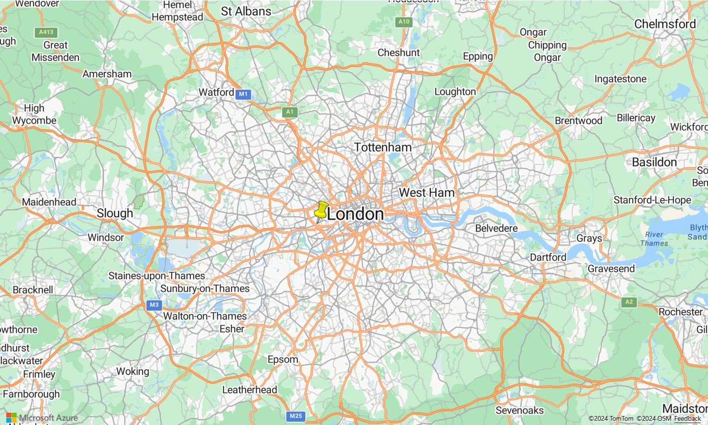

**After: Azure Maps using a Symbol Layer**

Symbol layers in Azure Maps support custom images as well, but the image needs to be loaded into the map resources first and assigned a unique ID. The symbol layer can then reference this ID. The symbol can be offset to align to the correct point on the image by using the icon `offset` option. In Azure Maps, an `anchor` option is used to specify the relative position of the symbol relative to the position coordinate using one of nine defined reference points; "center", "top", "bottom", "left", "right", "top-left", "top-right", "bottom-left", "bottom-right". The content is anchored and set to "bottom" by default that is the bottom center of the HTML content. To make it easier to migrate code from Bing Maps, set the anchor to "top-left", and then use the `offset` option with the same offset used in Bing Maps. The offsets in Azure Maps move in the opposite direction of Bing Maps, so multiply them by minus one.

```javascript
<!DOCTYPE html>
<html>
<head>
    <title></title>
    <meta charset="utf-8" />
    <meta http-equiv="x-ua-compatible" content="IE=Edge" />
    <meta name="viewport" content="width=device-width, initial-scale=1, shrink-to-fit=no" />

    <!-- Add references to the Azure Maps Map control JavaScript and CSS files. -->
    <link rel="stylesheet" href="https://atlas.microsoft.com/sdk/javascript/mapcontrol/3/atlas.min.css" type="text/css" />
    <script src="https://atlas.microsoft.com/sdk/javascript/mapcontrol/3/atlas.min.js"></script>

    <script type='text/javascript'>
        var map, datasource;

        function initMap() {
            map = new atlas.Map('myMap', {
                center: [-0.2, 51.5],
                zoom: 9,
                authOptions: {
                    authType: 'subscriptionKey',
                    subscriptionKey: '<Your Azure Maps Key>'
                }
            });

            //Wait until the map resources are ready.
            map.events.add('ready', function () {

                //Load the custom image icon into the map resources.
                map.imageSprite.add('my-yellow-pin', 'ylw-pushpin.png').then(function () {

                    //Create a data source and add it to the map.
                    datasource = new atlas.source.DataSource();
                    map.sources.add(datasource);

                    //Create a point and add it to the data source.
                    datasource.add(new atlas.data.Point([-0.2, 51.5]));

                    //Add a layer for rendering point data as symbols.
                    map.layers.add(new atlas.layer.SymbolLayer(datasource, null, {
                        iconOptions: {
                            //Set the image option to the id of the custom icon that was loaded into the map resources.
                            image: 'my-yellow-pin',
                            anchor: 'top-left',
                            offset: [-5, -30]
                        }
                    }));
                });
            });
        }
    </script>
</head>
<body onload="initMap()">
    <div id='myMap' style='position:relative;width:600px;height:400px;'></div>
</body>
</html>
```


> [!TIP]
> To create advanced custom rendering of points, use multiple rendering layers together. For example, if you want to have multiple pushpins that have the same icon on different colored circles, instead of creating a bunch of images for each color overlay a symbol layer on top of a bubble layer and have them reference the same data source. This will be much more efficient than creating, and having the map maintain a bunch of different images.

**More resources**

* [Create a data source]
* [Add a Symbol layer]
* [Add HTML Markers]
* [Use data-driven style expressions]
* [Symbol layer icon options]
* [Symbol layer text option]
* [HTML marker class]
* [HTML marker options]

### Adding a polyline

Polylines are used to represent a line or path on the map. The following example demonstrates creating a dashed polyline on the map.

**Before: Bing Maps**

In Bing Maps, the Polyline class takes in an array of locations and a set of options.

```javascript
//Get the center of the map.
var center = map.getCenter();

//Create the polyline.
var polyline = new Microsoft.Maps.Polyline([
        center,
        new Microsoft.Maps.Location(center.latitude - 0.5, center.longitude - 1),
        new Microsoft.Maps.Location(center.latitude - 0.5, center.longitude + 1)
    ], {
        strokeColor: 'red',
        strokeThickness: 4,
        strokeDashArray: [3, 3]
    });

//Add the polyline to the map using a layer.
var layer = new Microsoft.Maps.Layer();
layer.add(polyline);
map.layers.insert(layer);
```


**After: Azure Maps**

In Azure Maps, polylines are referred to the more commonly geospatial terms `LineString` or `MultiLineString` objects. These objects can be added to a data source and rendered using a line layer. The stroke color, width and dash array options are nearly identical between the platforms.

```javascript
//Get the center of the map.
var center = map.getCamera().center;

//Create a data source and add it to the map.
var datasource = new atlas.source.DataSource();
map.sources.add(datasource);

//Create a line and add it to the data source.
datasource.add(new atlas.data.LineString([
    center,
    [center[0] - 1, center[1] - 0.5],
    [center[0] + 1, center[1] - 0.5]
]));

//Add a layer for rendering line data.
map.layers.add(new atlas.layer.LineLayer(datasource, null, {
    strokeColor: 'red',
    strokeWidth: 4,
    strokeDashArray: [3, 3]
}));
```


**More resources**

* [Add lines to the map]
* [Line layer options]
* [Use data-driven style expressions]

### Adding a polygon

Polygons are used to represent an area on the map. Azure Maps and Bing Maps provide similar support for polygons. The following example shows how to create a polygon that forms a triangle based on the center coordinate of the map.

**Before: Bing Maps**

In Bing Maps, the Polygon class takes in an array of coordinates or coordinate rings and a set of options.

```javascript
//Get the center of the map.
var center = map.getCenter();

//Create the polygon.
var polygon = new Microsoft.Maps.Polygon([
        center,
        new Microsoft.Maps.Location(center.latitude - 0.5, center.longitude - 1),
        new Microsoft.Maps.Location(center.latitude - 0.5, center.longitude + 1),
        center
    ], {
        fillColor: 'rgba(0, 255, 0, 0.5)',
        strokeColor: 'red',
        strokeThickness: 2
    });

//Add the polygon to the map using a layer.
var layer = new Microsoft.Maps.Layer();
layer.add(polygon);
map.layers.insert(layer);
```


**After: Azure Maps**

In Azure Maps, Polygon and MultiPolygon objects can be added to a data source and rendered on the map using layers. The area of a polygon can be rendered in a polygon layer. The outline of a polygon can be rendered using a line layer.

```javascript
//Get the center of the map.
var center = map.getCamera().center;

//Create a data source and add it to the map.
datasource = new atlas.source.DataSource();
map.sources.add(datasource);

//Create a polygon and add it to the data source.
datasource.add(new atlas.data.Polygon([
    center,
    [center[0] - 1, center[1] - 0.5],
    [center[0] + 1, center[1] - 0.5],
    center
]));

//Add a polygon layer for rendering the polygon area.
map.layers.add(new atlas.layer.PolygonLayer(datasource, null, {
    fillColor: 'rgba(0, 255, 0, 0.5)'
}));

//Add a line layer for rendering the polygon outline.
map.layers.add(new atlas.layer.LineLayer(datasource, null, {
    strokeColor: 'red',
    strokeWidth: 2
}));
```


**More resources**

* [Add a polygon to the map]
* [Add a circle to the map]
* [Polygon layer options]
* [Line layer options]
* [Use data-driven style expressions]

### Display an infobox

More information for an entity can be displayed on the map as an `Microsoft.Maps.Infobox` class in Bing Maps, in Azure Maps this is achieved using the `atlas.Popup` class. The following example adds a pushpin/marker to the map that when selected, displays an infobox/popup.

**Before: Bing Maps**

With Bing Maps, an infobox is created using the `Microsoft.Maps.Infobox` constructor.

```javascript
//Add a pushpin where we want to display an infobox.
var pushpin = new Microsoft.Maps.Pushpin(new Microsoft.Maps.Location(47.6, -122.33));

//Add the pushpin to the map using a layer.
var layer = new Microsoft.Maps.Layer();
layer.add(pushpin);
map.layers.insert(layer);

//Create an infobox and bind it to the map.
var infobox = new Microsoft.Maps.Infobox(new Microsoft.Maps.Location(47.6, -122.33), {
    description: '<div style="padding:5px"><b>Hello World!</b></div>',
    visible: false
});
infobox.setMap(map);

//Add a click event to the pushpin to open the infobox.
Microsoft.Maps.Events.addHandler(pushpin, 'click', function () {
    infobox.setOptions({ visible: true });
});
```

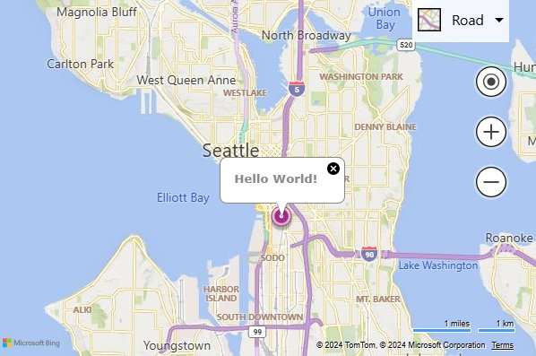

**After: Azure Maps**

In Azure Maps, a popup can be used to display more information for a location. An HTML `string` or `HTMLElement` object can be passed into the `content` option of the popup. Popups can be displayed independently of any shape if desired and thus require a `position` value to be specified. To display a popup, call the `open` function and pass in the map that the popup is to be displayed on.

```javascript
//Add a marker to the map that to display a popup for.
var marker = new atlas.HtmlMarker({
    position: [-122.33, 47.6]
});

//Add the marker to the map.
map.markers.add(marker);

//Create a popup.
var popup = new atlas.Popup({
    content: '<div style="padding:10px"><b>Hello World!</b></div>',
    position: [-122.33, 47.6],
    pixelOffset: [0, -35]
});

//Add a click event to the marker to open the popup.
map.events.add('click', marker, function () {
    //Open the popup
    popup.open(map);
});
```

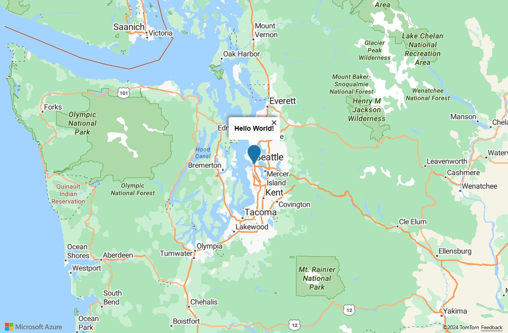

> [!NOTE]
> To do the same thing with a symbol, bubble, line or polygon layer, pass the layer into the maps event code instead of a marker.

**More resources**

* [Add a popup]
* [Popup with Media Content]
* [Popups on Shapes]
* [Reusing Popup with Multiple Pins]
* [Popup class]
* [Popup options]

### Pushpin clustering

When visualizing many data points on the map, points overlap each other, the map looks cluttered and it becomes difficult to see and use. Clustering of point data can be used to improve this user experience and also improve performance. Clustering point data is the process of combining point data that are near each other and representing them on the map as a single clustered data point. As the user zooms into the map, the clusters break apart into their individual data points.

The following example loads a GeoJSON feed of earthquake data from the past week and adds it to the map. Clusters are rendered as scaled and colored circles depending on the number of points they contain.

> [!NOTE]
> There are several different algorithms used for pushpin clustering. Bing Maps uses a simple grid-based function, while Azure Maps uses a more advanced and visually appealing point-based clustering method.

**Before: Bing Maps**

In Bing Maps, GeoJSON data can be loaded using the GeoJSON module. Pushpins are clustered by loading in the clustering module and using the clustering layer it contains.

```html
<!DOCTYPE html>
<html>
<head>
    <title></title>
    <meta charset="utf-8" />
    <meta http-equiv="x-ua-compatible" content="IE=Edge" />
    <meta name="viewport" content="width=device-width, initial-scale=1, shrink-to-fit=no" />

    <script type='text/javascript'>
        var map;
        var earthquakeFeed = 'https://earthquake.usgs.gov/earthquakes/feed/v1.0/summary/all_week.geojson';

        function initMap() {
            map = new Microsoft.Maps.Map(document.getElementById('myMap'), {
                credentials: '<Your Bing Maps Key>',
                center: new Microsoft.Maps.Location(20, -160),
                zoom: 2
            });

            //Load the GeoJSON and Clustering modules.
            Microsoft.Maps.loadModule(['Microsoft.Maps.GeoJson', 'Microsoft.Maps.Clustering'], function () {

                //Load the GeoJSON data from a URL.
                Microsoft.Maps.GeoJson.readFromUrl(earthquakeFeed, function (pins) {

                    //Create a ClusterLayer with options and add it to the map.
                    clusterLayer = new Microsoft.Maps.ClusterLayer(pins, {
                        clusteredPinCallback: createCustomClusteredPin,
                        gridSize: 100
                    });

                    map.layers.insert(clusterLayer);
                });
            });
        }

        //A function that defines how clustered pins are rendered.
        function createCustomClusteredPin(cluster) {
            //Get the number of pushpins in the cluster
            var clusterSize = cluster.containedPushpins.length;

            var radius = 20;    //Default radius to 20 pixels.
            var fillColor = 'lime'; 	//Default to lime green.

            if (clusterSize >= 750) {
                radius = 40;   //If point_count >= 750, radius is 40 pixels.
                fillColor = 'red';    //If the point_count >= 750, color is red.
            } else if (clusterSize >= 100) {
                radius = 30;    //If point_count >= 100, radius is 30 pixels.
                fillColor = 'yellow';    //If the point_count >= 100, color is yellow.
            }

            //Create an SVG string of a circle with the specified radius and color.
            var svg = ['<svg xmlns="http://www.w3.org/2000/svg" width="', (radius * 2), '" height="', (radius * 2), '">',
                '<circle cx="', radius, '" cy="', radius, '" r="', radius, '" fill="', fillColor, '"/>',
                '<text x="50%" y="50%" dominant-baseline="middle" text-anchor="middle" style="font-size:12px;font-family:arial;fill:black;" >{text}</text>',
                '</svg>'];

            //Customize the clustered pushpin using the generated SVG and anchor on its center.
            cluster.setOptions({
                icon: svg.join(''),
                anchor: new Microsoft.Maps.Point(radius, radius),
                textOffset: new Microsoft.Maps.Point(0, radius - 8) //Subtract 8 to compensate for height of text.
            });
        }
    </script>

    <!-- Bing Maps Script Reference -->
    <script src="https://www.bing.com/api/maps/mapcontrol?callback=initMap" async defer></script>
</head>
<body>
    <div id='myMap' style='position:relative;width:600px;height:400px;'></div>
</body>
</html>
```


**After: Azure Maps**

In Azure Maps, data is added and managed by a data source. Layers connect to data sources and render the data in them. The `DataSource` class in Azure Maps provides several clustering options.

* `cluster` – Tells the data source to cluster point data.
* `clusterRadius` - The radius in pixels to cluster points together.
* `clusterMaxZoom` - The maximum zoom level that clustering occurs. Any other zooming results in all points being rendered as symbols.
* `clusterProperties` - Defines custom properties that are calculated using expressions against all the points within each cluster and added to the properties of each cluster point.

When clustering is enabled, the data source sends clustered and unclustered data points to layers for rendering. The data source is capable of clustering hundreds of thousands of data points. A clustered data point has the following properties on it:

| Property name               | Type    | Description                                    |
|-----------------------------|---------|------------------------------------------------|
| `cluster`                   | boolean | Indicates if feature represents a cluster.     |
| `cluster_id`                | string  | A unique ID for the cluster that can be used with the `DataSource` classes `getClusterExpansionZoom`, `getClusterChildren`, and `getClusterLeaves` functions. |
| `point_count`               | number  | The number of points the cluster contains.     |
| `point_count_abbreviated`   | string  | A string that abbreviates the `point_count` value if it's long. (for example, 4,000 becomes 4K) |

The `DataSource` class has the following helper function for accessing additional information about a cluster using the `cluster_id`.

| Function       | Return type        | Description     |
|----------------|--------------------|-----------------|
| `getClusterChildren(clusterId: number)`                              | `Promise<Feature<Geometry, any> | Shape>` | Retrieves the children of the given cluster on the next zoom level. These children may be a combination of shapes and subclusters. The subclusters are features with properties matching cluster properties. |
| `getClusterExpansionZoom(clusterId: number)`                         | `Promise<number>`                            | Calculates a zoom level that the cluster starts expanding or break apart.    |
| `getClusterLeaves(clusterId: number, limit: number, offset: number)` | `Promise<Feature<Geometry, any> | Shape>` | Retrieves all points in a cluster. Set the `limit` to return a subset of the points and use the `offset` to page through the points.    |

When rendering clustered data on the map, it's often easiest to use two or more layers. The following example uses three layers, a bubble layer for drawing scaled colored circles based on the size of the clusters, a symbol layer to render the cluster size as text, and a second symbol layer for rendering the unclustered points. For more information on rendering clustered data in Azure Maps, see [Clustering point data in the Web SDK]

GeoJSON data can be directly imported in Azure Maps using the `importDataFromUrl` function on the `DataSource` class.

```html
<!DOCTYPE html>
<html>
<head>
    <title></title>
    <meta charset="utf-8" />
    <meta http-equiv="x-ua-compatible" content="IE=Edge" />
    <meta name="viewport" content="width=device-width, initial-scale=1, shrink-to-fit=no" />

    <!-- Add references to the Azure Maps Map control JavaScript and CSS files. -->
    <link rel="stylesheet" href="https://atlas.microsoft.com/sdk/javascript/mapcontrol/3/atlas.min.css" type="text/css" />
    <script src="https://atlas.microsoft.com/sdk/javascript/mapcontrol/3/atlas.min.js"></script>

    <script type='text/javascript'>
        var map, datasource;
        var earthquakeFeed = 'https://earthquake.usgs.gov/earthquakes/feed/v1.0/summary/all_week.geojson';

        function initMap() {
            //Initialize a map instance.
            map = new atlas.Map('myMap', {
                center: [-160, 20],
                zoom: 1,

                //Add your Azure Maps key to the map SDK. Get an Azure Maps key at https://azure.com/maps. NOTE: The primary key should be used as the key.
                authOptions: {
                    authType: 'subscriptionKey',
                    subscriptionKey: '<Your Azure Maps Key>'
                }
            });

            //Wait until the map resources are ready.
            map.events.add('ready', function () {

                //Create a data source and add it to the map.
                datasource = new atlas.source.DataSource(null, {
                    //Tell the data source to cluster point data.
                    cluster: true
                });
                map.sources.add(datasource);

                //Create layers for rendering clusters, their counts and unclustered points and add the layers to the map.
                map.layers.add([
                    //Create a bubble layer for rendering clustered data points.
                    new atlas.layer.BubbleLayer(datasource, null, {
                        //Scale the size of the clustered bubble based on the number of points inthe cluster.
                        radius: [
                            'step',
                            ['get', 'point_count'],
                            20,         //Default of 20 pixel radius.
                            100, 30,    //If point_count >= 100, radius is 30 pixels.
                            750, 40     //If point_count >= 750, radius is 40 pixels.
                        ],

                        //Change the color of the cluster based on the value on the point_cluster property of the cluster.
                        color: [
                            'step',
                            ['get', 'point_count'],
                            'lime',            //Default to lime green. 
                            100, 'yellow',     //If the point_count >= 100, color is yellow.
                            750, 'red'         //If the point_count >= 750, color is red.
                        ],
                        strokeWidth: 0,
                        filter: ['has', 'point_count'] //Only rendered data points that have a point_count property, which clusters do.
                    }),

                    //Create a symbol layer to render the count of locations in a cluster.
                    new atlas.layer.SymbolLayer(datasource, null, {
                        iconOptions: {
                            image: 'none' //Hide the icon image.
                        },
                        textOptions: {
                            textField: ['get', 'point_count_abbreviated'],
                            offset: [0, 0.4]
                        }
                    }),

                    //Create a layer to render the individual locations.
                    new atlas.layer.SymbolLayer(datasource, null, {
                        filter: ['!', ['has', 'point_count']] //Filter out clustered points from this layer.
                    })
                ]);

                //Retrieve a GeoJSON data set and add it to the data source. 
                datasource.importDataFromUrl(earthquakeFeed);
            });
        }
    </script>
</head>
<body onload="initMap()">
    <div id='myMap' style='position:relative;width:600px;height:400px;'></div>
</body>
</html>
```


**More resources**

* [Add a Symbol layer]
* [Add a Bubble layer]
* [Cluster point data]
* [Use data-driven style expressions]

### Add a heat map

Heat maps, also known as point density maps, are a type of data visualization used to represent the density of data using a range of colors. They're often used to show the data "hot spots" on a map and are a great way to render large point data sets.

The following example loads a GeoJSON feed of all earthquakes over the past month from the USGS, rendered as a heat map.

**Before: Bing Maps**

In Bing Maps, to create a heat map, load in the heat map module. Similarly, the GeoJSON module is loaded to add support for GeoJSON data.

```html
<!DOCTYPE html>
<html>
<head>
    <title></title>
    <meta charset="utf-8" />
    <meta http-equiv="x-ua-compatible" content="IE=Edge" />
    <meta name="viewport" content="width=device-width, initial-scale=1, shrink-to-fit=no" />

    <script type='text/javascript'>
        var map;
        var earthquakeFeed = 'https://earthquake.usgs.gov/earthquakes/feed/v1.0/summary/all_month.geojson';

        function initMap() {
            map = new Microsoft.Maps.Map(document.getElementById('myMap'), {
                credentials: '<Your Bing Maps Key>',
                center: new Microsoft.Maps.Location(20, -160),
                zoom: 2,
                mapTypeId: Microsoft.Maps.MapTypeId.aerial
            });

            //Load the GeoJSON and HeatMap modules.
            Microsoft.Maps.loadModule(['Microsoft.Maps.GeoJson', 'Microsoft.Maps.HeatMap'], function () {

                //Load the GeoJSON data from a URL.
                Microsoft.Maps.GeoJson.readFromUrl(earthquakeFeed, function (shapes) {

                    //Create a heat map and add it to the map.
                    var heatMap = new Microsoft.Maps.HeatMapLayer(shapes, {
                        opacity: 0.65,
                        radius: 10
                    });
                    map.layers.insert(heatMap);
                });
            });
        }
    </script>

    <!-- Bing Maps Script Reference -->
    <script src="https://www.bing.com/api/maps/mapcontrol?callback=initMap" async defer></script>
</head>
<body>
    <div id='myMap' style='position:relative;width:600px;height:400px;'></div>
</body>
</html>
```

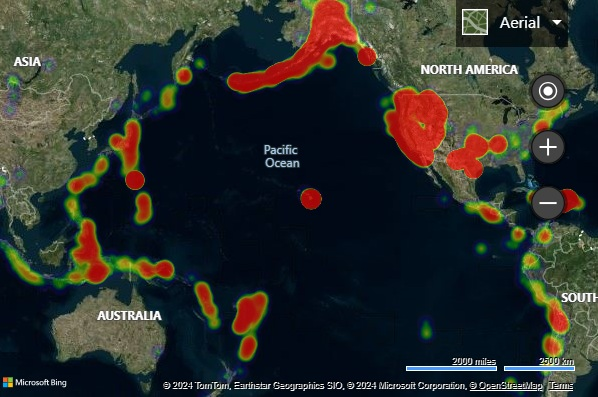

**After: Azure Maps**

In Azure Maps, load the GeoJSON data into a data source and connect the data source to a heat map layer. GeoJSON data can be directly imported in Azure Maps using the `importDataFromUrl` function on the `DataSource` class.

```html
<!DOCTYPE html>
<html>
<head>
    <title></title>
    <meta charset="utf-8" />
    <meta http-equiv="x-ua-compatible" content="IE=Edge" />
    <meta name="viewport" content="width=device-width, initial-scale=1, shrink-to-fit=no" />

    <!-- Add references to the Azure Maps Map control JavaScript and CSS files. -->
    <link rel="stylesheet" href="https://atlas.microsoft.com/sdk/javascript/mapcontrol/3/atlas.min.css" type="text/css" />
    <script src="https://atlas.microsoft.com/sdk/javascript/mapcontrol/3/atlas.min.js"></script>

    <script type='text/javascript'>
        var map;
        var earthquakeFeed = 'https://earthquake.usgs.gov/earthquakes/feed/v1.0/summary/all_month.geojson';

        function initMap() {
            //Initialize a map instance.
            map = new atlas.Map('myMap', {
                center: [-160, 20],
                zoom: 1,
                style: 'satellite_road_labels',

                //Add your Azure Maps key to the map SDK. Get an Azure Maps key at https://azure.com/maps. NOTE: The primary key should be used as the key.
                authOptions: {
                    authType: 'subscriptionKey',
                    subscriptionKey: '<Your Azure Maps Key>'
                }
            });

            //Wait until the map resources are ready.
            map.events.add('ready', function () {

                //Create a data source and add it to the map.
                datasource = new atlas.source.DataSource();
                map.sources.add(datasource);

                //Load the earthquake data.
                datasource.importDataFromUrl(earthquakeFeed);

                //Create a layer to render the data points as a heat map.
                map.layers.add(new atlas.layer.HeatMapLayer(datasource, null, {
                    opacity: 0.65,
                    radius: 10
                }));
            });
        }
    </script>
</head>
<body onload="initMap()">
    <div id='myMap' style='position:relative;width:600px;height:400px;'></div>
</body>
</html>
```

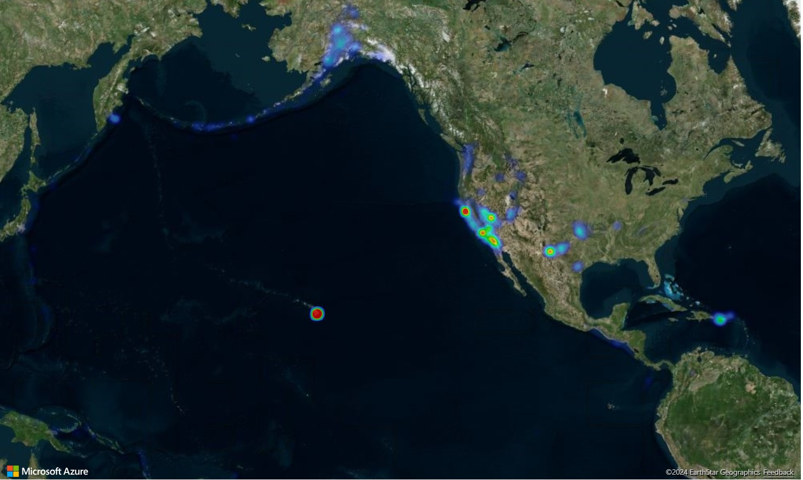

**More resources**

* [Add a heat map layer]
* [Heat map layer class]
* [Heat map layer options]
* [Use data-driven style expressions]

### Overlay a tile layer

Tile layers allow you to overlay large images that have been broken up into smaller tiled images that align with the maps tiling system. This is a common way to overlay large images or large data sets.

The following example overlays a weather radar tile layer from Iowa Environmental Mesonet of Iowa State University that uses an X, Y, Zoom tiling naming schema.

**Before: Bing Maps**

In Bing Maps, tile layers can be created by using the `Microsoft.Maps.TileLayer` class.

```javascript
var weatherTileLayer = new Microsoft.Maps.TileLayer({
    mercator: new Microsoft.Maps.TileSource({
        uriConstructor: 'https://mesonet.agron.iastate.edu/cache/tile.py/1.0.0/nexrad-n0q-900913/{zoom}/{x}/{y}.png'
    })
});
map.layers.insert(weatherTileLayer);
```

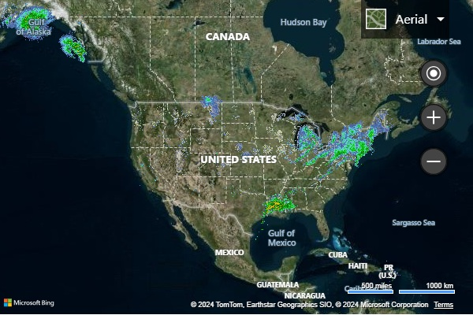

**After: Azure Maps**

In Azure Maps, a tile layer can be added to the map in much the same way as any other layer. A formatted URL that has in x, y, zoom placeholders; `{x}`, `{y}`, `{z}` respectively is used to tell the layer where to access the tiles. Azure Maps tile layers also support `{quadkey}`, `{bbox-epsg-3857}` and `{subdomain}` placeholders.

> [!TIP]
> In Azure Maps, layers can be rendered below other layers, including base map layers. Often it is desirable to render tile layers below the map labels so that they are easy to read. The `map.layers.add` function takes in a second parameter that is the ID of a second layer to insert the new layer below. To insert a tile layer below the map labels the following code can be used:
>
> `map.layers.add(myTileLayer, "labels");`

```javascript
//Create a tile layer and add it to the map below the label layer.
map.layers.add(new atlas.layer.TileLayer({
    tileUrl: 'https://mesonet.agron.iastate.edu/cache/tile.py/1.0.0/nexrad-n0q-900913/{z}/{x}/{y}.png',
    opacity: 0.8,
    tileSize: 256
}), 'labels');
```

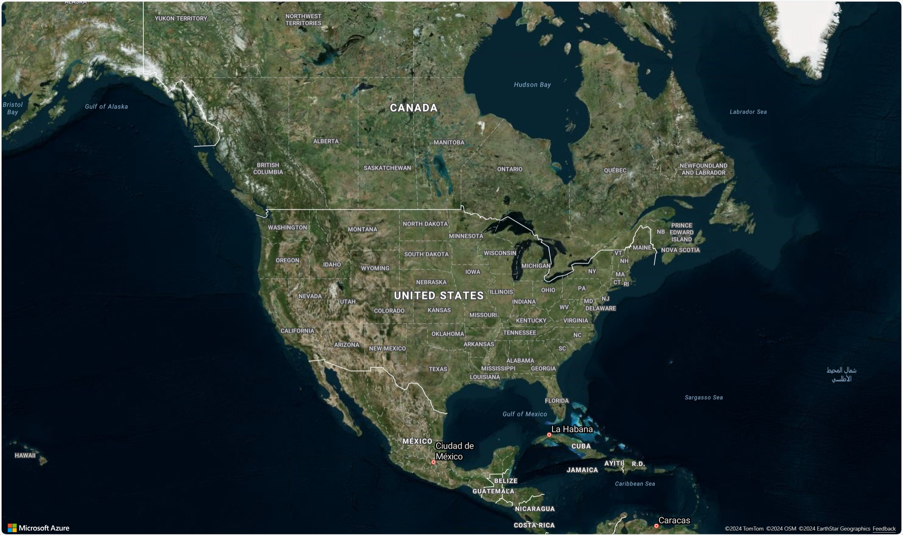

> [!TIP]
> Tile requests can be captured using the `transformRequest` option of the map. This will allow you to modify or add headers to the request if desired.

**More resources**

* [Add tile layers]
* [Tile layer class]
* [Tile layer options]

### Show traffic data

Traffic data can be overlaid both Bing and Azure maps.

**Before: Bing Maps**

In Bing Maps, traffic data can be overlaid the map using the traffic module.

```javascript
Microsoft.Maps.loadModule('Microsoft.Maps.Traffic', function () {
    var manager = new Microsoft.Maps.Traffic.TrafficManager(map);
    manager.show();
});
```

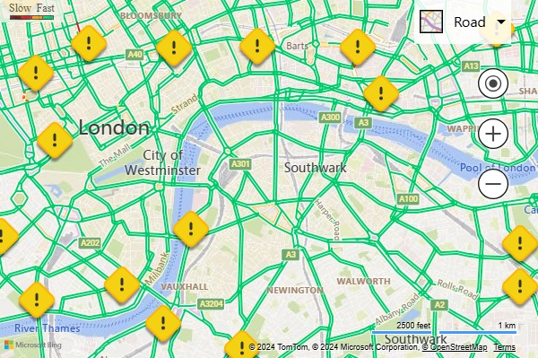

**After: Azure Maps**

Azure Maps provides several different options for displaying traffic. Traffic incidents, such as road closures and accidents can be displayed as icons on the map. Traffic flow, color coded roads, can be overlaid on the map and the colors can be modified relative to the posted speed limit, relative to the normal expected delay, or absolute delay. Incident data in Azure Maps is updated every minute and flow data every 2 minutes.

```javascript
map.setTraffic({
    incidents: true,
    flow: 'relative'
});
```


If you select one of the traffic icons in Azure Maps, more information displays in a popup.

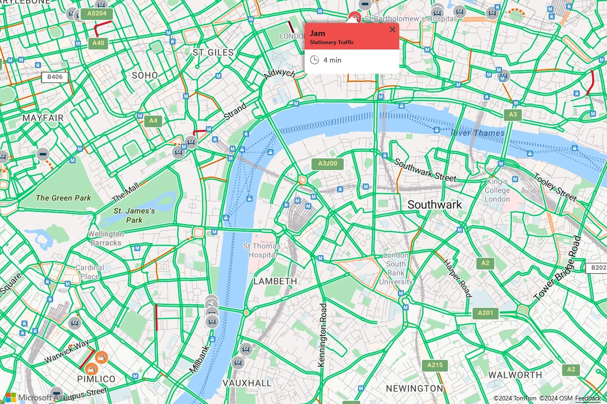

**More resources**

* [Show traffic on the map]
* [Traffic overlay options]
* [Traffic control]

### Add a ground overlay

Both Bing and Azure maps support overlaying georeferenced images on the map that they move and scale as you pan and zoom the map. In Bing Maps these are known as ground overlays, in Azure Maps they're referred to as image layers. image layers are great for building floor plans, overlaying old maps, or imagery from a drone.

**Before: Bing Maps**

To create a ground overlay in Bing Maps, you need to specify the URL to the overlay image and a bounding box that binds the image to the map. This example overlays a map image of Newark New Jersey from 1922 on the map.

```html
<!DOCTYPE html>
<html>
<head>
    <title></title>
    <meta charset="utf-8" />
    <meta http-equiv="x-ua-compatible" content="IE=Edge" />
    <meta name="viewport" content="width=device-width, initial-scale=1, shrink-to-fit=no" />

    <script type='text/javascript'>
        var map;

        function initMap() {
            map = new Microsoft.Maps.Map(document.getElementById('myMap'), {
                credentials: '<Your Bing Maps Key>',
                center: new Microsoft.Maps.Location(40.740, -74.18),
                zoom: 12
            });

            var overlay = new Microsoft.Maps.GroundOverlay({
                //Create a LocationRect from the edges of the bounding box; north, west, south, east.
                bounds: Microsoft.Maps.LocationRect.fromEdges(40.773941, -74.22655, 40.712216, -74.12544),
                imageUrl: 'newark_nj_1922.jpg'
            });
            map.layers.insert(overlay);
        }
    </script>

    <!-- Bing Maps Script Reference -->
    <script src="https://www.bing.com/api/maps/mapcontrol?callback=initMap" async defer></script>
</head>
<body>
    <div id='myMap' style='position:relative;width:600px;height:400px;'></div>
</body>
</html>
```

Running this code in a browser displays a map that looks like the following image:


**After: Azure Maps**

In Azure Maps, georeferenced images can be overlaid using the `atlas.layer.ImageLayer` class. This class requires a URL to an image and a set of coordinates for the four corners of the image. The image must be hosted either on the same domain or have CORs enabled.

> [!TIP]
> If you only have north, south, east, west and rotation information, and not coordinates for each corner of the image, you can use the static [atlas.layer.ImageLayer.getCoordinatesFromEdges] function.

```html
<!DOCTYPE html>
<html>
<head>
    <title></title>
    <meta charset="utf-8" />
    <meta http-equiv="x-ua-compatible" content="IE=Edge" />
    <meta name="viewport" content="width=device-width, initial-scale=1, shrink-to-fit=no" />

    <!-- Add references to the Azure Maps Map control JavaScript and CSS files. -->
    <link rel="stylesheet" href="https://atlas.microsoft.com/sdk/javascript/mapcontrol/3/atlas.min.css" type="text/css" />
    <script src="https://atlas.microsoft.com/sdk/javascript/mapcontrol/3/atlas.min.js"></script>

    <script type='text/javascript'>
        var map;

        function initMap() {
            //Initialize a map instance.
            map = new atlas.Map('myMap', {
                center: [-74.18, 40.740],
                zoom: 12,

                //Add your Azure Maps key to the map SDK. Get an Azure Maps key at https://azure.com/maps. NOTE: The primary key should be used as the key.
                authOptions: {
                    authType: 'subscriptionKey',
                    subscriptionKey: '<Your Azure Maps Key>'
                }
            });

            //Wait until the map resources are ready.
            map.events.add('ready', function () {

                //Create an image layer and add it to the map.
                map.layers.add(new atlas.layer.ImageLayer({
                    url: 'newark_nj_1922.jpg',
                    coordinates: [
                        [-74.22655, 40.773941], //Top Left Corner
                        [-74.12544, 40.773941], //Top Right Corner
                        [-74.12544, 40.712216], //Bottom Right Corner
                        [-74.22655, 40.712216]  //Bottom Left Corner
                    ]
                }));
            });
        }
    </script>
</head>
<body onload="initMap()">
    <div id='myMap' style='position:relative;width:600px;height:400px;'></div>
</body>
</html>
```


**More resources**

* [Overlay an image]
* [Image layer class]

### Add KML data to the map

Both Azure and Bing maps can import and render KML, KMZ, GeoRSS, GeoJSON and Well-Known Text (WKT) data on the map. Azure Maps also supports GPX, GML, spatial CSV files, Web-Mapping Services (WMS), Web-Mapping Tile Services (WMTS), and Web Feature Services (WFS).

**Before: Bing Maps**

Running this code in a browser displays a map that looks like the following image:

```html
<!DOCTYPE html>
<html>
<head>
    <title></title>
    <meta charset="utf-8" />
    <meta http-equiv="x-ua-compatible" content="IE=Edge" />
    <meta name="viewport" content="width=device-width, initial-scale=1, shrink-to-fit=no" />

    <script type='text/javascript'>
        var map;

        function initMap() {
            map = new Microsoft.Maps.Map('#myMap', {
                credentials: '<Your Bing Maps Key>',
                center: new Microsoft.Maps.Location(40.747, -73.985),
                zoom: 12
            });
                
            Microsoft.Maps.loadModule('Microsoft.Maps.GeoXml', function () {
                var callback = function (dataset) {
                    if (dataset.shapes) {
                        var l = new Microsoft.Maps.Layer();
                        l.add(dataset.shapes);
                        map.layers.insert(l);
                    }
                    if (dataset.layers) {
                        for (var i = 0, len = dataset.layers.length; i < len; i++) {
                            map.layers.insert(dataset.layers[i]);
                        }
                    }
                };
                Microsoft.Maps.GeoXml.readFromUrl('myKMLFile.kml', { error: function (msg) { alert(msg); } }, callback);
            });                
        }
    </script>

    <!-- Bing Maps Script Reference -->
    <script src="https://www.bing.com/api/maps/mapcontrol?callback=initMap" async defer></script>
</head>
<body>
    <div id='myMap' style='position:relative;width:600px;height:400px;'></div>
</body>
</html>
```

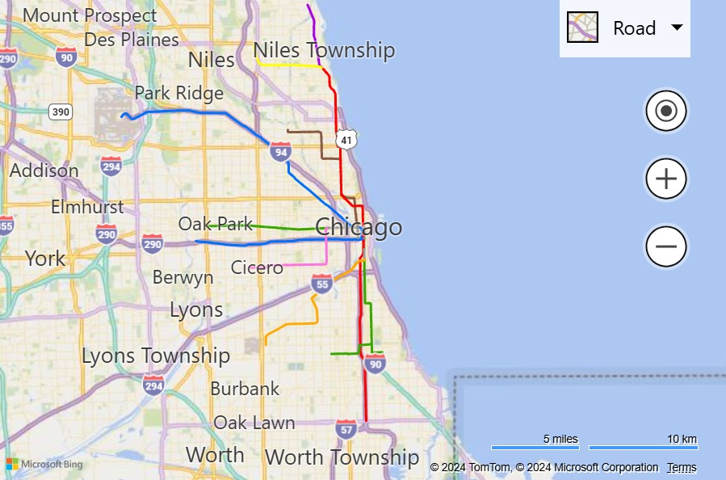

**After: Azure Maps**

In Azure Maps, GeoJSON is the main data format used in the web SDK, more spatial data formats can be easily integrated in using the [spatial IO module]. This module has functions for both reading and writing spatial data and also includes a simple data layer that can easily render data from any of these spatial data formats. To read the data in a spatial data file, pass in a URL, or raw data as string or blob into the `atlas.io.read` function. This returns all the parsed data from the file that can then be added to the map. KML is a bit more complex than most spatial data format as it includes a lot more styling information. The `SpatialDataLayer` class supports rendering most of these styles, however icons images have to be loaded into the map before loading the feature data, and ground overlays have to be added as layers to the map separately. When loading data via a URL, it should be hosted on a CORs enabled endpoint, or a proxy service should be passed in as an option into the read function.

```html
<!DOCTYPE html>
<html>
<head>
    <title></title>
    <meta charset="utf-8" />
    <meta http-equiv="x-ua-compatible" content="IE=Edge" />
    <meta name="viewport" content="width=device-width, initial-scale=1, shrink-to-fit=no" />

    <!-- Add references to the Azure Maps Map control JavaScript and CSS files. -->
    <link rel="stylesheet" href="https://atlas.microsoft.com/sdk/javascript/mapcontrol/3/atlas.min.css" type="text/css" />
    <script src="https://atlas.microsoft.com/sdk/javascript/mapcontrol/3/atlas.min.js"></script>

    <!-- Add reference to the Azure Maps Spatial IO module. -->
    <script src="https://atlas.microsoft.com/sdk/javascript/spatial/0/atlas-spatial.js"></script>

    <script type='text/javascript'>
        var map, datasource, layer;

        function initMap() {
            //Initialize a map instance.
            map = new atlas.Map('myMap', {
                view: 'Auto',

                //Add your Azure Maps key to the map SDK. Get an Azure Maps key at https://azure.com/maps. NOTE: The primary key should be used as the key.
                authOptions: {
                    authType: 'subscriptionKey',
                    subscriptionKey: '<Your Azure Maps Key>'
                }
            });

            //Wait until the map resources are ready.
            map.events.add('ready', function () {
            
                //Create a data source and add it to the map.
                datasource = new atlas.source.DataSource();
                map.sources.add(datasource);

                //Add a simple data layer for rendering the data.
                layer = new atlas.layer.SimpleDataLayer(datasource);
                map.layers.add(layer);

                //Read a KML file from a URL or pass in a raw KML string.
                atlas.io.read('myKMLFile.kml').then(async r => {
                    if (r) {

                        //Check to see if there are any icons in the data set that need to be loaded into the map resources.
                        if (r.icons) {
                            //For each icon image, create a promise to add it to the map, then run the promises in parrallel.
                            var imagePromises = [];

                            //The keys are the names of each icon image.
                            var keys = Object.keys(r.icons);

                            if (keys.length !== 0) {
                                keys.forEach(function (key) {
                                    imagePromises.push(map.imageSprite.add(key, r.icons[key]));
                                });

                                await Promise.all(imagePromises);
                            }
                        }

                        //Load all features.
                        if (r.features && r.features.length > 0) {
                            datasource.add(r.features);
                        }

                        //Load all ground overlays.
                        if (r.groundOverlays && r.groundOverlays.length > 0) {
                            map.layers.add(r.groundOverlays);
                        }

                        //If bounding box information is known for data, set the map view to it.
                        if (r.bbox) {
                            map.setCamera({ bounds: r.bbox, padding: 50 });
                        }
                    }
                });
            });
        }
    </script>
</head>
<body onload="initMap()">
    <div id='myMap' style='position:relative;width:600px;height:400px;'></div>
</body>
</html>
```

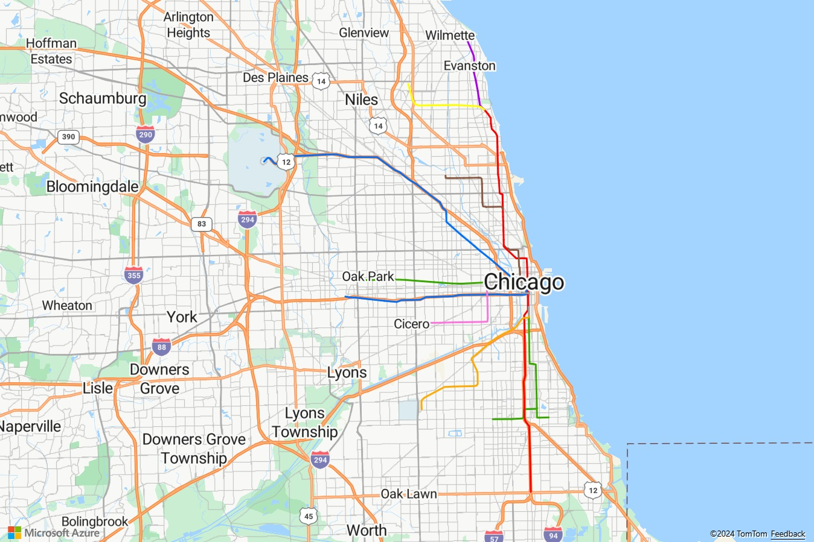

**More resources**

* [atlas.io.read function]
* [SimpleDataLayer]
* [SimpleDataLayerOptions]

### Add drawing tools

Both Bing and Azure Maps provide a module to enable the user to draw and edit shapes on the map using the mouse or other input devices. They both support drawing pushpins, lines, and polygons. Azure Maps also provides options for drawing circles and rectangles.

**Before: Bing Maps**

In Bing Maps the `DrawingTools` module is loaded using the `Microsoft.Maps.loadModule` function. Once loaded, an instance of the DrawingTools class can be created and the `showDrawingManager` function is called add a toolbar to the map.

```html
<!DOCTYPE html>
<html>
<head>
    <title></title>
    <meta charset="utf-8" />
    <meta http-equiv="x-ua-compatible" content="IE=Edge" />
    <meta name="viewport" content="width=device-width, initial-scale=1, shrink-to-fit=no" />

    <script type='text/javascript'>
    var map, drawingManager;

    function initMap() {
        map = new Microsoft.Maps.Map('#myMap', {
            credentials: '<Your Bing Maps Key>'
        });

        //Load the DrawingTools module
        Microsoft.Maps.loadModule('Microsoft.Maps.DrawingTools', function () {
            //Create an instance of the DrawingTools class and bind it to the map.
            var tools = new Microsoft.Maps.DrawingTools(map);

            //Show the drawing toolbar and enable editting on the map.
            tools.showDrawingManager(function (manager) {
                //Store a reference to the drawing manager as it will be useful later.
                drawingManager = manager;
            });
        });
    }
    </script>

    <!-- Bing Maps Script Reference -->
    <script src="https://www.bing.com/api/maps/mapcontrol?callback=initMap" async defer></script>
</head>
<body>
    <div id='myMap' style='position:relative;width:600px;height:400px;'></div>
</body>
</html>

```


**After: Azure Maps**

In Azure Maps, the drawing tools module needs to be loaded by loading the JavaScript and CSS files need to be referenced in the app. Once the map has loaded, an instance of the `DrawingManager` class can be created and a `DrawingToolbar` instance attached.

```html
<!DOCTYPE html>
<html>
<head>
    <title></title>
    <meta charset="utf-8" />
    <meta http-equiv="x-ua-compatible" content="IE=Edge" />
    <meta name="viewport" content="width=device-width, initial-scale=1, shrink-to-fit=no" />

    <!-- Add references to the Azure Maps Map control JavaScript and CSS files. -->
    <link rel="stylesheet" href="https://atlas.microsoft.com/sdk/javascript/mapcontrol/3/atlas.min.css" type="text/css" />
    <script src="https://atlas.microsoft.com/sdk/javascript/mapcontrol/3/atlas.min.js"></script>

    <!-- Add references to the Azure Maps Map Drawing Tools JavaScript and CSS files. -->
    <link rel="stylesheet" href="https://atlas.microsoft.com/sdk/javascript/drawing/0/atlas-drawing.min.css" type="text/css" />
    <script src="https://atlas.microsoft.com/sdk/javascript/drawing/0/atlas-drawing.min.js"></script>
    
    <script type='text/javascript'>
        var map, drawingManager;

        function initMap() {
            //Initialize a map instance.
            map = new atlas.Map('myMap', {
                view: 'Auto',

                //Add your Azure Maps key to the map SDK. Get an Azure Maps key at https://azure.com/maps. NOTE: The primary key should be used as the key.                
                authOptions: {
                    authType: 'subscriptionKey',
                    subscriptionKey: '<Your Azure Maps Key>'
                }
            });

            //Wait until the map resources are ready.
            map.events.add('ready', function () {

                //Create an instance of the drawing manager and display the drawing toolbar.
                drawingManager = new atlas.drawing.DrawingManager(map, {
                    toolbar: new atlas.control.DrawingToolbar({ position: 'top-left' })
                });
            });
        }
    </script>
</head>
<body onload="initMap()">
    <div id="myMap" style="position:relative;width:600px;height:400px;"></div>
</body>
</html>
```

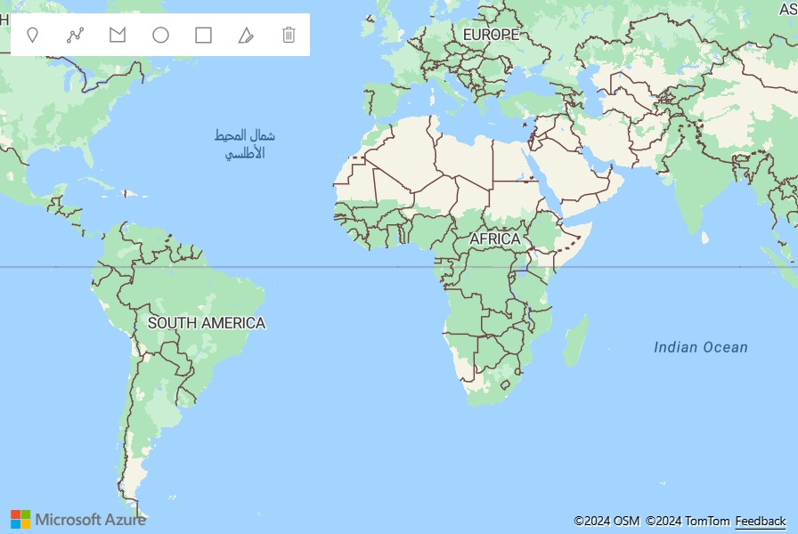

> [!TIP]
> In Azure Maps layers the drawing tools provide multiple ways that users can draw shapes. For example, when drawing a polygon the user can click to add each point, or hold the left mouse button down and drag the mouse to draw a path. This can be modified using the `interactionType` option of the `DrawingManager`.

**More resources**

* [Use the drawing tools module]
* [Drawing tools module code samples]

## Additional resources

Take a look at the [open-source Azure Maps Web SDK modules]. These modules provide more functionality and are fully customizable.

Review code samples related migrating other Bing Maps features:

**Data visualizations**

> [!div class="nextstepaction"]
> [Contour layer](https://samples.azuremaps.com/?search=contour)

> [!div class="nextstepaction"]
> [Data Binning](https://samples.azuremaps.com/?search=Data%20Binning)

**Services**

> [!div class="nextstepaction"]
> [Using the Azure Maps services module](./how-to-use-services-module.md)

> [!div class="nextstepaction"]
> [Search for points of interest](./map-search-location.md)

> [!div class="nextstepaction"]
> [Get information from a coordinate (reverse geocode)](./map-get-information-from-coordinate.md)

> [!div class="nextstepaction"]
> [Show directions from A to B](./map-route.md)

> [!div class="nextstepaction"]
> [Search Autosuggest with JQuery UI](https://samples.azuremaps.com/?sample=search-autosuggest-and-jquery-ui)

Learn more about the Azure Maps Web SDK.

> [!div class="nextstepaction"]
> [How to use the map control](how-to-use-map-control.md)

> [!div class="nextstepaction"]
> [How to use the services module](how-to-use-services-module.md)

> [!div class="nextstepaction"]
> [How to use the drawing tools module](set-drawing-options.md)

> [!div class="nextstepaction"]
> [Code samples](/samples/browse/?products=azure-maps)

> [!div class="nextstepaction"]
> [Azure Maps Web SDK Service API reference documentation](/javascript/api/azure-maps-control/)

## Next steps

Learn more about migrating from Bing Maps to Azure Maps.

> [!div class="nextstepaction"]
> [Migrate a web service](migrate-from-bing-maps-web-services.md)

[Add a Bubble layer]: map-add-bubble-layer.md
[Add a circle to the map]: map-add-shape.md#add-a-circle-to-the-map
[Add a ground overlay]: #add-a-ground-overlay
[Add a heat map layer]: map-add-heat-map-layer.md
[Add a heat map]: #add-a-heat-map
[Add a polygon to the map]: map-add-shape.md#use-a-polygon-layer
[Add a popup]: map-add-popup.md
[Add a Symbol layer]: map-add-pin.md
[Add controls to a map]: map-add-controls.md
[Add drawing tools]: #add-drawing-tools
[Add HTML Markers]: map-add-custom-html.md
[Add KML data to the map]: #add-kml-data-to-the-map
[Add lines to the map]: map-add-line-layer.md
[Add tile layers]: map-add-tile-layer.md
[Adding a custom pushpin]: #adding-a-custom-pushpin
[Adding a polygon]: #adding-a-polygon
[Adding a polyline]: #adding-a-polyline
[Adding a pushpin]: #adding-a-pushpin
[Animation module]: https://github.com/Azure-Samples/azure-maps-animations
[atlas.data namespace]: /javascript/api/azure-maps-control/atlas.data
[atlas.data.Position.fromLatLng]: /javascript/api/azure-maps-control/atlas.data.position
[atlas.io.read function]: /javascript/api/azure-maps-spatial-io/atlas.io#read-string---arraybuffer---blob--spatialdatareadoptions-
[atlas.layer.ImageLayer.getCoordinatesFromEdges]: /javascript/api/azure-maps-control/atlas.layer.imagelayer#getcoordinatesfromedges-number--number--number--number--number-
[atlas.Shape]: /javascript/api/azure-maps-control/atlas.shape
[Azure AD]: azure-maps-authentication.md#azure-ad-authentication
[Azure Maps account]: quick-demo-map-app.md#create-an-azure-maps-account
[Azure Maps Glossary]: glossary.md
[Azure Maps React Component]: https://github.com/WiredSolutions/react-azure-maps
[AzureMapsControl.Components]: https://github.com/arnaudleclerc/AzureMapsControl.Components
[Cesium plugin]: /samples/azure-samples/azure-maps-cesium/azure-maps-cesium-js-plugin
[Cesium]: https://www.cesium.com/
[Choose a map style]: choose-map-style.md
[Cluster point data]: clustering-point-data-web-sdk.md
[Clustering point data in the Web SDK]: clustering-point-data-web-sdk.md
[Contour layer code samples]: https://samples.azuremaps.com/?search=contour
[Create a data source]: create-data-source-web-sdk.md
[Display an infobox]: #display-an-infobox
[Drawing tools module code samples]: https://samples.azuremaps.com#drawing-tools-module
[free account]: https://azure.microsoft.com/free/
[Gridded Data Source module]: https://github.com/Azure-Samples/azure-maps-gridded-data-source
[Heat map layer class]: /javascript/api/azure-maps-control/atlas.layer.heatmaplayer
[Heat map layer options]: /javascript/api/azure-maps-control/atlas.heatmaplayeroptions
[HTML marker class]: /javascript/api/azure-maps-control/atlas.htmlmarker
[HTML marker options]: /javascript/api/azure-maps-control/atlas.htmlmarkeroptions
[Image layer class]: /javascript/api/azure-maps-control/atlas.layer.imagelayer
[Leaflet code samples]: https://samples.azuremaps.com/?search=leaflet
[Leaflet plugin]: /samples/azure-samples/azure-maps-leaflet/azure-maps-leaflet-plugin
[Leaflet]: https://leafletjs.com/
[Line layer options]: /javascript/api/azure-maps-control/atlas.linelayeroptions
[Load a map]: #load-a-map
[Localization support in Azure Maps]: supported-languages.md
[Localizing the map]: #localizing-the-map
[ng-azure-maps]: https://github.com/arnaudleclerc/ng-azure-maps
[OpenLayers plugin]: /samples/azure-samples/azure-maps-OpenLayers/azure-maps-OpenLayers-plugin
[OpenLayers]: https://openlayers.org/
[open-source Azure Maps Web SDK modules]: open-source-projects.md#open-web-sdk-modules
[open-source modules for the web SDK]: open-source-projects.md#open-web-sdk-modules
[Overlay a tile layer]: #overlay-a-tile-layer
[Overlay an image]: map-add-image-layer.md
[Polygon layer options]: /javascript/api/azure-maps-control/atlas.polygonlayeroptions
[Popup class]: /javascript/api/azure-maps-control/atlas.popup
[Popup options]: /javascript/api/azure-maps-control/atlas.popupoptions
[Popup with Media Content]: https://samples.azuremaps.com/?sample=popup-with-media-content
[Popups on Shapes]: https://samples.azuremaps.com/?sample=popups-on-shapes
[Pushpin clustering]: #pushpin-clustering
[Render]: /rest/api/maps/render-v2
[Reusing Popup with Multiple Pins]: https://samples.azuremaps.com/?sample=reusing-popup-with-multiple-pins
[road tiles]: /rest/api/maps/render-v2/get-map-tile
[satellite tiles]: /rest/api/maps/render-v2/get-map-static-image
[Setting the map view]: #setting-the-map-view
[Shared Key authentication]: azure-maps-authentication.md#shared-key-authentication
[Show traffic data]: #show-traffic-data
[Show traffic on the map]: map-show-traffic.md
[SimpleDataLayer]: /javascript/api/azure-maps-spatial-io/atlas.layer.simpledatalayer
[SimpleDataLayerOptions]: /javascript/api/azure-maps-spatial-io/atlas.simpledatalayeroptions
[Spatial IO module]: how-to-use-spatial-io-module.md
[subscription key]: quick-demo-map-app.md#get-the-subscription-key-for-your-account
[Supported map styles]: supported-map-styles.md
[Symbol layer icon options]: /javascript/api/azure-maps-control/atlas.iconoptions
[Symbol layer text option]: /javascript/api/azure-maps-control/atlas.textoptions
[Tile layer class]: /javascript/api/azure-maps-control/atlas.layer.tilelayer
[Tile layer options]: /javascript/api/azure-maps-control/atlas.tilelayeroptions
[Traffic control]: https://samples.azuremaps.com/?sample=traffic-controls
[Traffic overlay options]: https://samples.azuremaps.com/?sample=traffic-overlay-options
[turf js]: https://turfjs.org
[Use data-driven style expressions]: data-driven-style-expressions-web-sdk.md
[Use the Azure Maps map control]: how-to-use-map-control.md
[Use the drawing tools module]: set-drawing-options.md
[Vue Azure Maps]: https://github.com/rickyruiz/vue-azure-maps
