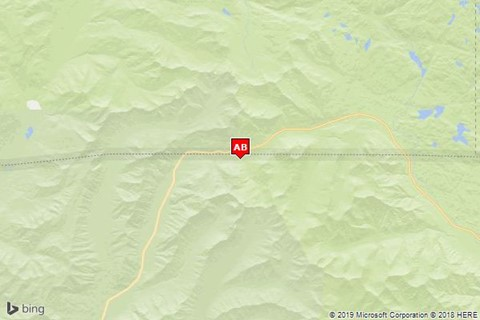
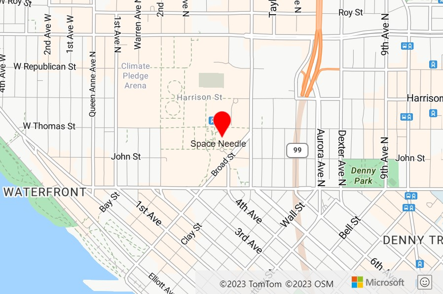
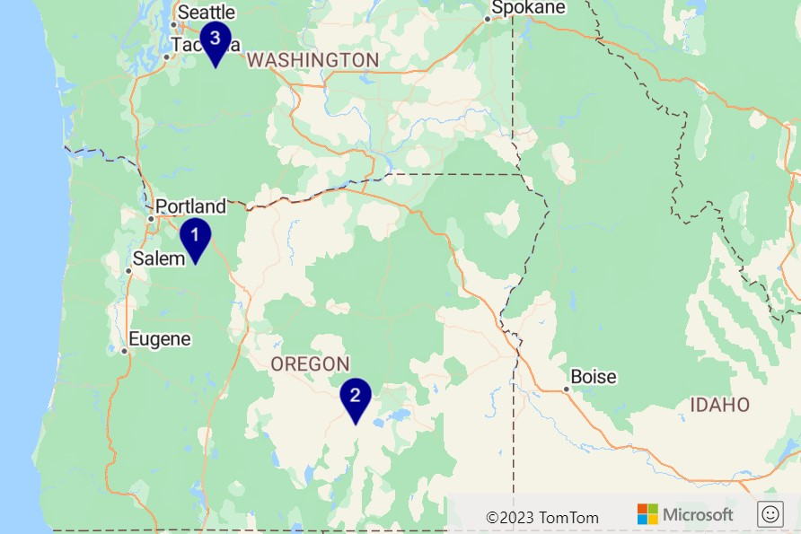
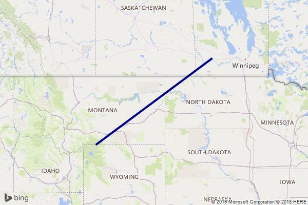
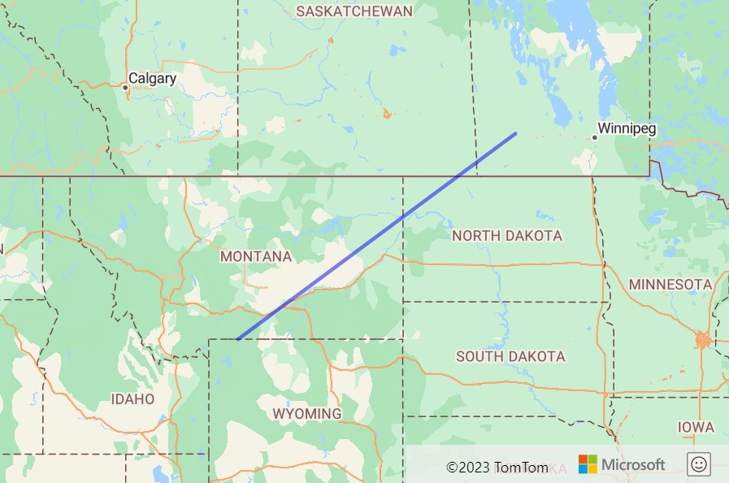

# Tutorial: Migrate web service from Bing Maps

Both Azure and Bing Maps provide access to spatial APIs through REST web services. The API interfaces for these platforms perform similar functionalities but use different naming conventions and response objects. This tutorial demonstrates how to:

> * Forward and reverse geocoding
> * Search for points of interest
> * Calculate routes and directions
> * Retrieve a map image
> * Calculate a distance matrix
> * Get time zone details

The following table provides the Azure Maps service APIs that provide similar functionality to the listed Bing Maps service APIs.

| Bing Maps service API                 | Azure Maps service API                    |
|---------------------------------------|-------------------------------------------|
| Autosuggest                           | [Search]                                  |
| Directions (including truck)          | [Route directions]                        |
| Distance Matrix                       | [Route Matrix]                            |
| Imagery – Static Map                  | [Render]                                  |
| Isochrones                            | [Route Range]                             |
| Local Insights                        | [Search] + [Route Range]                  |
| Local Search                          | [Search]                                  |
| Location Recognition (POIs)           | [Search]                                  |
| Locations (forward/reverse geocoding) | [Search]                                  |
| Snap to Road                          | [POST Route directions]                   |
| Spatial Data Services (SDS)           | [Search] + [Route] + other Azure Services |
| Time Zone                             | [Time Zone]                               |
| Traffic Incidents                     | [Traffic Incident Details]                |
| Elevation                             | [Elevation]

The following service APIs aren't currently available in Azure Maps:

* Optimized Itinerary Routes - Planned. Azure Maps Route API does support traveling salesmen optimization for a single vehicle.
* Imagery Metadata – Primarily used for getting tile URLs in Bing Maps. Azure Maps has a standalone service for directly accessing map tiles.

Azure Maps also has these REST web services:

* [Azure Maps Creator] – Create a custom private digital twin of buildings and spaces.
* [Spatial operations] – Offload complex spatial calculations and operations, such as geofencing, to a service.
* [Map Tiles] – Access road and imagery tiles from Azure Maps as raster and vector tiles.
* [Batch routing] – Allows up to 1,000 route requests to be made in a single batch over a period of time. Routes are calculated in parallel on the server for faster processing.
* [Traffic] Flow – Access real-time traffic flow data as both raster and vector tiles.
* [Geolocation API] – Get the location of an IP address.
* [Weather services] – Gain access to real-time and forecast weather data.

Be sure to also review the following best practices guides:

* [Best practices for Azure Maps Search service]
* [Best practices for Azure Maps Route service]

## Prerequisites

If you don't have an Azure subscription, create a [free account] before you begin.

* An [Azure Maps account]
* A [subscription key]

> [!NOTE]
> For more information on authentication in Azure Maps, see [manage authentication in Azure Maps].

## Geocoding addresses

Geocoding is the process of converting an address (like `"1 Microsoft way, Redmond, WA"`) into a coordinate (like longitude: -122.1298, latitude: 47.64005). Coordinates are then often used to position a pushpin on a map or center a map.

Azure Maps provides several methods for geocoding addresses:

* [Free-form address geocoding]: Specify a single address string (like `"1 Microsoft way, Redmond, WA"`) and process the request immediately. This service is recommended if you need to geocode individual addresses quickly.
* [Structured address geocoding]: Specify the parts of a single address, such as the street name, city, country, and postal code and process the request immediately. This service is recommended if you need to geocode individual addresses quickly and the data is already parsed into its individual address parts.
* [Batch address geocoding]: Create a request containing up to 10,000 addresses and have them processed over a period of time. All the addresses are geocoded in parallel on the server and when completed the full result set can be downloaded. This service is recommended for geocoding large data sets.
* [Fuzzy search]: This API combines address geocoding with point of interest search. This API takes in a free-form string that can be an address, place, landmark, point of interest, or point of interest category and process the request immediately. This API is recommended for applications where users can search for addresses or points of interest from the same textbox.
* [Fuzzy batch search]: Create a request containing up to 10,000 addresses, places, landmarks, or point of interests and have them processed over a period of time. All the data is processed in parallel on the server and when completed the full result set can be downloaded.

The following tables cross-reference the Bing Maps API parameters with the comparable API parameters in Azure Maps for structured and free-form address geocoding.

**Location by Address (structured address)**

| Bing Maps API parameter          | Comparable Azure Maps API parameter                 |
|----------------------------------|-----------------------------------------------------|
| `addressLine`                    | `streetNumber`, `streetName` or `crossStreet`       |
| `adminDistrict`                  | `countrySubdivision`                                |
| `countryRegion`                  | `country` and `countryCode`                         |
| `locality`                       | `municipality` or `municipalitySubdivision`         |
| `postalCode`                     | `postalCode`                                        |
| `maxResults` (`maxRes`)          | `limit`                                             |
| `includeNeighborhood` (`inclnb`) | N/A – Always returned by Azure Maps if available.   |
| `include` (`incl`)               | N/A – Country ISO2 Code always returned by Azure Maps. |
| `key`                            | `subscription-key` – For more information, see [Authentication with Azure Maps]. |
| `culture` (`c`)                  | `language` – For more information, see [Localization support in Azure Maps]. |
| `userRegion` (`ur`)              | `view` – For more information, see [Azure Maps supported views].       |

Azure Maps also supports:

* `countrySecondarySubdivision` – County, districts
* `countryTertiarySubdivision` - Named areas, boroughs, cantons, communes
* `ofs` - Page through the results in combination with `maxResults` parameter.

**Location by Query (free-form address string)**

| Bing Maps API parameter          | Comparable Azure Maps API parameter      |
|----------------------------------|------------------------------------------|
| `query`                          | `query`                                  |
| `maxResults` (`maxRes`)          | `limit`                                  |
| `includeNeighborhood` (`inclnb`) | N/A – Always returned by Azure Maps if available.  |
| `include` (`incl`)               | N/A – Country ISO2 Code always returned by Azure Maps.  |
| `key`                            | `subscription-key` – For more information, see [Authentication with Azure Maps]. |
| `culture` (`c`)                  | `language` – For more information, see [Localization support in Azure Maps].  |
| `userRegion` (`ur`)              | `view` – For more information, see [Azure Maps supported views]. |

Azure Maps also supports:

* `typeahead` - Specifies if the query is interpreted as a partial input and the search enters predictive mode (autosuggest/autocomplete).
* `countrySet` – A comma-separated list of ISO2 countries codes in which to limit the search to.
* `lat`/`lon`, `topLeft`/`btmRight`, `radius` – Specify user location and area to make the results more locally relevant.
* `ofs` - Page through the results in combination with `maxResults` parameter.

For more information on using the search service, see [Search for a location using Azure Maps Search services] and [Best practices for Azure Maps Search service].

## Reverse geocode a coordinate (Find a Location by Point)

Reverse geocoding is the process of converting geographic coordinates (like longitude: -122.1298, latitude: 47.64005) into its approximate address (like `"1 Microsoft way, Redmond, WA"`).

Azure Maps provides several reverse geocoding methods:

* [Address reverse geocoder]: Specify a single geographic coordinate to get its approximate address and process the request immediately.
* [Cross street reverse geocoder]: Specify a single geographic coordinate to get nearby cross street information (for example, 1st & main) and process the request immediately.
* [Batch address reverse geocoder]: Create a request containing up to 10,000 coordinates and have them processed over a period of time. All the data is processed in parallel on the server and when completed the full result set can be downloaded.

The following table cross-references the Bing Maps API parameters with the comparable API parameters in Azure Maps.

| Bing Maps API parameter              | Comparable Azure Maps API parameter                   |
|--------------------------------------|-------------------------------------------------------|
| `point`                              | `query`                                               |
| `includeEntityTypes`                 | `entityType` – See entity type comparison table below.|
| `includeNeighborhood` (`inclnb`)     | N/A – Always returned by Azure Maps if available.     |
| `include` (`incl`)                   | N/A – Country ISO2 Code always returned by Azure Maps.|
| `key`                                | `subscription-key` – For more information, see [Authentication with Azure Maps]. |
| `culture` (`c`)                      | `language` – For more information, see [Localization support in Azure Maps]. |
| `userRegion` (`ur`)                  | `view` – For more information, see [Azure Maps supported views].         |

For more information on searching in Azure Maps, see [Best practices for Azure Maps Search service].

The Azure Maps reverse geocoding API has features not available in Bing Maps that might be useful to integrate when migrating your app:

* Retrieve speed limit data.
* Retrieve road use information, local road, arterial, limited access, ramp, etc.
* The side of street the coordinate falls on.

**Entity type comparison table**

The following table cross references the Bing Maps entity type values to the equivalent property names in Azure Maps.

| Bing Maps Entity Type | Comparable Azure Maps Entity type           | Description                            |
|-----------------------|---------------------------------------------|----------------------------------------|
| `Address`             |                                             | *Address*                              |
| `Neighborhood`        | `Neighbourhood`                             | *Neighborhood*                         |
| `PopulatedPlace`      | `Municipality` or `MunicipalitySubdivision` | *City*, *Town or Sub*, or *Super City* |
| `Postcode1`           | `PostalCodeArea`                            | *Postal Code* or *Zip Code*            |
| `AdminDivision1`      | `CountrySubdivision`                        | *State* or *Province*                  |
| `AdminDivision2`      | `CountrySecondarySubdivison`                | *County* or *districts*                |
| `CountryRegion`       | `Country`                                   | *Country name*                         |
|                       | `CountryTertiarySubdivision`                | *Boroughs*, *Cantons*, *Communes*      |

## Get location suggestions (Autosuggest)

Several of the Azure Maps search API’s support predictive mode that can be used for autosuggest scenarios. The Azure Maps [fuzzy search] API is the most like the Bing Maps Autosuggest API. The following APIs also support predictive mode, add `&typeahead=true` to the query:

* [Free-form address geocoding]: Specify a single address string (like `"1 Microsoft way, Redmond, WA"`) and process the request immediately. This service is recommended if you need to geocode individual addresses quickly.
* [Fuzzy search]: This API combines address geocoding with point of interest search. This API takes in a free-form string that can be an address, place, landmark, point of interest, or point of interest category and process the request immediately. This API is recommended for applications where users can search for addresses or points of interest from the same textbox.
* [POI search]: Search for points of interests by name. For example, `"starbucks"`.
* [POI category search]: Search for points of interests by category. For example, "restaurant".

## Calculate routes and directions

Azure Maps can be used to calculate routes and directions. Azure Maps has many of the same functionalities as the Bing Maps routing service, such as:

* arrival and departure times
* real-time and predictive based traffic routes
* different modes of transportation, driving, walking, truck
* waypoint order optimization (traveling salesmen)

> [!NOTE]
> Azure Maps requires all waypoints to be coordinates. Addresses will need to be geocoded first.

The Azure Maps routing service provides the following APIs for calculating routes:

* [Calculate route]: Calculate a route and have the request processed immediately. This API supports both `GET` and `POST` requests. `POST` requests are recommended when specifying a large number of waypoints or when using lots of the route options to ensure that the URL request doesn’t become too long and cause issues.
* [Batch route]: Create a request containing up to 1,000 route request and have them processed over a period of time. All the data is processed in parallel on the server and when completed the full result set can be downloaded.

The following table cross-references the Bing Maps API parameters with the comparable API parameters in Azure Maps.

| Bing Maps API parameter                            | Comparable Azure Maps API parameter               |
|----------------------------------------------------|---------------------------------------------------|
| `avoid`                                            | `avoid`                                           |
| `dateTime` (`dt`)                                  | `departAt` or `arriveAt`                          |
| `distanceBeforeFirstTurn` (`dbft`)                 | N/A                                               |
| `distanceUnit` (`du`)                              | N/A – Azure Maps only uses the metric system.     |
| `heading` (`hd`)                                   | `vehicleHeading`                                  |
| `maxSolutions` (`maxSolns`)                        | `maxAlternatives`, `alternativeType`, `minDeviationDistance`, and `minDeviationTime`  |
| `optimize` (`optwz`)                               | `routeType` and `traffic`                         |
| `optimizeWaypoints` (`optWp`)                      | `computeBestOrder`                                |
| `routeAttributes` (`ra`)                           | `instructionsType`                                |
| `routePathOutput` (`rpo`)                          | `routeRepresentation`                             |
| `timeType` (`tt`)                                  | `departAt` or `arriveAt`                          |
| `tolerances` (`tl`)                                | N/A                                               |
| `travelMode`                                       | `travelMode`                                      |
| `waypoint.n` (`wp.n`) or `viaWaypoint.n` (`vwp.n`) | `query` – coordinates in the format `lat0,lon0:lat1,lon1….`   |
| `key`                                              | `subscription-key` – For more information, see [Authentication with Azure Maps]. |
| `culture` (`c`)                                    | `language` – For more information, see [Localization support in Azure Maps]. |
| `userRegion` (`ur`)                                | `view` – For more information, see [Azure Maps supported views]. |

The Azure Maps routing API also supports truck routing within the same API. The following table cross-references the additional Bing Maps truck routing parameters with the comparable API parameters in Azure Maps.

| Bing Maps API parameter                  | Comparable Azure Maps API parameter        |
|------------------------------------------|--------------------------------------------|
| `dimensionUnit` (`dims`)                 | N/A – Dimensions in meters only supported. |
| `weightUnit` (`wu`)                      | N/A – Weights in kilograms only supported. |
| `vehicleHeight` (`height`)               | `vehicleHeight`                            |
| `vehicleWidth` (`width`)                 | `vehicleWidth`                             |
| `vehicleLength` (`vl`)                   | `vehicleLength`                            |
| `vehicleWeight` (`weight`)               | `vehicleWeight`                            |
| `vehicleAxles` (`axles`)                 | `vehicleAxelWeight`                        |
| `vehicleTrailers` (`vt`)                 | **N/A**                                    |
| `vehicleSemi` (`semi`)                   | `vehicleCommercial`                        |
| `vehicleMaxGradient` (`vmg`)             | **N/A**                                    |
| `vehicleMinTurnRadius` (`vmtr`)          | **N/A**                                    |
| `vehicleAvoidCrossWind` (`vacw`)         | **N/A**                                    |
| `vehicleAvoidGroundingRisk` (`vagr`)     | **N/A**                                    |
| `vehicleHazardousMaterials` (`vhm`)      | `vehicleLoadType`                          |
| `vehicleHazardousPermits` (`vhp`)        | `vehicleLoadType`                          |

> [!TIP]
> By default, the Azure Maps route API only returns a summary (distance and times) and the coordinates for the route path. Use the `instructionsType` parameter to retrieve turn-by-turn instructions. The `routeRepresentation` parameter can be used to filter out the summary and route path.

For more information on the Azure Maps route API, see [Best practices for Azure Maps Route service].

The Azure Maps routing API has features not available in Bing Maps that might be useful to integrate when migrating your app:

* Support for route type: shortest, fastest, trilling, and most fuel efficient.
* Support for more travel modes: bicycle, bus, motorcycle, taxi, truck, and van.
* Support for 150 waypoints.
* Compute multiple travel times in a single request, historic traffic, live traffic, no traffic.
* Avoid additional road types: carpool roads, unpaved roads, already used roads.
* Engine specification-based routing. Calculate routes for combustion or electric vehicles based on their remaining fuel/charge and engine specifications.
* Specify maximum vehicle speed.

## Snap coordinates to Road

There are several ways to snap coordinates to roads in Azure Maps.

* Use the route directions API to snap coordinates to a logical route along the road network.
* Use the Azure Maps Web SDK to snap individual coordinates to the nearest road in the vector tiles.
* Use the Azure Maps vector tiles directly to snap individual coordinates.

**Using the route direction API to snap coordinates**

Azure Maps can snap coordinates to roads by using the [route directions] API. This service can be used to reconstruct a logical route between a set of coordinates and is comparable to the Bing Maps Snap to Road API.

There are two different ways to use the route directions API to snap coordinates to roads.

* If there are 150 coordinates or less, they can be passed as waypoints in the `GET` route directions API. Using this approach two different types of snapped data can be retrieved; route instructions contain the individual snapped waypoints, while the route path has an interpolated set of coordinates that fill the full path between the coordinates.
* If there are more than 150 coordinates, the `POST` route directions API can be used. The coordinates start and end coordinates have to be passed into the query parameter, but all coordinates can be passed into the `supportingPoints` parameter in the body of the `POST` request and formatted a GeoJSON geometry collection of points. The only snapped data available using this approach is the route path that is an interpolated set of coordinates that fill the full path between the coordinates. To see an example of this approach using the services module in the Azure Maps Web SDK, see the [Snap points to logical route path] sample in the Azure Maps samples.

The following table cross-references the Bing Maps API parameters with the comparable API parameters in Azure Maps.

| Bing Maps API parameter    | Comparable Azure Maps API parameter                                 |
|----------------------------|---------------------------------------------------------------------|
| `points`                   | `supportingPoints` – pass these points into the body of the `POST` request  |
| `interpolate`              | N/A                                                                 |
| `includeSpeedLimit`        | N/A                                                                 |
| `includeTruckSpeedLimit`   | N/A                                                                 |
| `speedUnit`                | N/A                                                                 |
| `travelMode`               | `travelMode`                                                        |
| `key`                      | `subscription-key` – For more information, see [Authentication with Azure Maps]. |
| `culture` (`c`)            | `language` – For more information, see [Localization support in Azure Maps].   |
| `userRegion` (`ur`)        | `view` – For more information, see [Azure Maps supported views].   |

The Azure Maps routing API also supports truck routing parameter within the same API to ensure logical paths are calculated. The following table cross-references the additional Bing Maps truck routing parameters with the comparable API parameters in Azure Maps.

| Bing Maps API parameter                 | Comparable Azure Maps API parameter        |
|-----------------------------------------|--------------------------------------------|
| `dimensionUnit` (`dims`)                | N/A – Dimensions in meters only supported. |
| `weightUnit` (`wu`)                     | N/A – Weights in kilograms only supported. |
| `vehicleHeight` (`height`)              | `vehicleHeight`                            |
| `vehicleWidth` (`width`)                | `vehicleWidth`                             |
| `vehicleLength` (`vl`)                  | `vehicleLength`                            |
| `vehicleWeight` (`weight`)              | `vehicleWeight`                            |
| `vehicleAxles` (`axles`)                | `vehicleAxelWeight`                        |
| `vehicleTrailers` (`vt`)                | **N/A**                                    |
| `vehicleSemi` (`semi`)                  | `vehicleCommercial`                        |
| `vehicleMaxGradient` (`vmg`)            | **N/A**                                    |
| `vehicleMinTurnRadius` (`vmtr`)         | **N/A**                                    |
| `vehicleAvoidCrossWind` (`vacw`)        | **N/A**                                    |
| `vehicleAvoidGroundingRisk` (`vagr`)    | **N/A**                                    |
| `vehicleHazardousMaterials` (`vhm`)     | `vehicleLoadType`                          |
| `vehicleHazardousPermits` (`vhp`)       | `vehicleLoadType`                          |

Since this approach uses the route directions API, the full set of options in that service can be used to customize the logic used to snap the coordinate to roads. For example, specifying a departure time would result in historic traffic data being taken into consideration.

The Azure Maps route directions API doesn't currently return speed limit data, however that can be retrieved using the Azure Maps reverse geocoding API.

**Using the Web SDK to snap coordinates**

The Azure Maps Web SDK uses vector tiles to render the maps. These vector tiles contain the raw road geometry information and can be used to calculate the nearest road to a coordinate for simple snapping of individual coordinates. This is useful when you want the coordinates to visually appear over roads and you're already using the Azure Maps Web SDK to visualize the data.

This approach however will only snap to the road segments that are loaded within the map view. When zoomed out at country level there may be no road data, so snapping can’t be done, however at that zoom level a single pixel can represent the area of several city blocks so snapping isn’t needed. To address this, the snapping logic can be applied every time the map has finished moving.  To see a fully functional example of this snapping logic, see the [Basic snap to road logic] sample in the Azure Maps samples.

**Using the Azure Maps vector tiles directly to snap coordinates**

The Azure Maps vector tiles contain the raw road geometry data that can be used to calculate the nearest point on a road to a coordinate to do basic snapping of individual coordinates. All road segments appear in the sectors at zoom level 15, so you want to retrieve tiles from there. You can then use the [quadtree tile pyramid math] to determine that tiles are needed and convert the tiles to geometries. From there a spatial math library, such as [turf js] or [NetTopologySuite] can be used to calculate the closest line segments.

## Retrieve a map image (Static Map)

Azure Maps provides an API for rendering the static map images with data overlaid. The Azure Maps [Map image render] API is comparable to the static map API in Bing Maps.

> [!NOTE]
> Azure Maps requires the center, all pushpins and path locations to be coordinates in `longitude,latitude` format whereas Bing Maps uses the `latitude,longitude` format. Addresses will need to be geocoded first.

The following table cross-references the Bing Maps API parameters with the comparable API parameters in Azure Maps.

| Bing Maps API parameter  | Comparable Azure Maps API parameter            |
|--------------------------|------------------------------------------------|
| `centerPoint`            | `center`                                       |
| `format`                 | `format` – specified as part of URL path. Currently only PNG supported.  |
| `heading`                | N/A – Streetside not supported.                |
| `imagerySet`             | `layer` and `style` – For more information, see [Supported map styles].|
| `mapArea` (`ma`)         | `bbox`                                         |
| `mapLayer` (`ml`)        | N/A                                            |
| `mapSize` (`ms`)         | `width` and `height` – can be up to 8192x8192 in size. |
| `declutterPins` (`dcl`)  | N/A                                            |
| `dpi`                    | N/A                                            |
| `drawCurve`              | `path`                                         |
| `mapMetadata`            | N/A                                            |
| `pitch`                  | N/A – Streetside not supported.                |
| `pushpin` (`pp`)         | `pins`                                         |
| `zoomLevel`              | `zoom`                                         |
| `query`                  | N/A – center or bounding box must be used.     |
| `highlightEntity` (`he`) | N/A                                            |
| `style`                  | N/A                                            |
| route parameters         | N/A                                            |
| `key`                    | `subscription-key` – For more information, see [Authentication with Azure Maps]. |
| `culture` (`c`)          | `language` – For more information, see [Localization support in Azure Maps].   |
| `userRegion` (`ur`)      | `view` – For more information, see [Azure Maps supported views]. |

> [!NOTE]
> Azure Maps uses a tile system with tiles that are twice the size of the map tiles used in Bing Maps. As such, the zoom level value in Azure Maps will appear one zoom level closer in Azure Maps compared to Bing Maps. Lower the zoom level in the requests you are migrating by 1 to compensate for this.

For more information, see [Render custom data on a raster map].

In addition to being able to generate a static map image, the Azure Maps render service also enables direct access to map tiles in raster (PNG) and vector format:

* [Map tiles] – Retrieve raster (PNG) and vector tiles for the base maps (roads, boundaries, background).
* [Map imagery tile] – Retrieve aerial and satellite imagery tiles.

### Pushpin URL parameter format comparison

**Before: Bing Maps**

In Bing Maps, pushpins can be added to a static map image by using the `pushpin` parameter in the URL. The `pushpin` parameter takes in a location in `latitude,longitude` format, an icon style and text label (up to three characters) as shown below:

> `&pushpin=latitude,longitude;iconStyle;label`

Pushpins can be added by adding more `pushpin` parameters to the URL with a different set of values. Pushpin icon styles are limited to one of the predefined styles available in the Bing Maps API.

For example, in Bing Maps, a red pushpin with the label "AB" can be added to the map at coordinates (longitude: -110, latitude: 45) with the following URL parameter:

> `&pushpin=45,-110;7;AB`

**After: Azure Maps**

In Azure Maps, pushpins can also be added to a static map image by specifying the `pins` parameter in the URL. Pushpins in Azure Maps are defined by specifying an icon style and a list of locations that use that icon style. This information is then passed into the `pins` parameter can be specified multiple times to support pushpins with different styles.

> `&pins=iconType|pinStyles||pinLocation1|pinLocation2|...`

Additional styles can be used by adding more `pins` parameters to the URL with a different style and set of locations.

Regarding pin locations, Azure Maps requires the coordinates to be in `longitude latitude` format whereas Bing Maps uses `latitude,longitude` format. Also note that **there is a space, not a comma** separating longitude and latitude in Azure Maps.

The `iconType` value specifies the type of pin to create and can have the following values:

* `default` – The default pin icon.
* `none` – No icon is displayed, only labels are rendered.
* `custom` – Specifies a custom icon is to be used. A URL pointing to the icon image can be added to the end of the `pins` parameter after the pin location information.
* `{udid}` – A Unique Data ID (UDID) for an icon stored in the Azure Maps Data Storage platform.

Pin styles in Azure Maps are added with the format `optionNameValue`, with multiple styles separated by pipe (`|`) characters like this `iconType|optionName1Value1|optionName2Value2`. Note the option names and values aren't separated. The following style option names can be used to style pushpins in Azure Maps:

* `al` – Specifies the opacity (alpha) of the pushpins. Can be a number between 0 and 1.
* `an` – Specifies the pin anchor. X and y pixel values specified in the format `x y`.
* `co` – The color of the pin. Must be a 24-bit hex color: `000000` to `FFFFFF`.
* `la` – Specifies the label anchor. X and y pixel values specified in the format `x y`.
* `lc` – The color of the label. Must be a 24-but hex color: `000000` to `FFFFFF`.
* `ls` – The size of the label in pixels. Can be a number greater than 0.
* `ro` – A value in degrees to rotate the icon. Can be a number between -360 and 360.
* `sc` – A scale value for the pin icon. Can be a number greater than 0.

Label values are specified for each pin location rather than having a single label value that applies to all pushpins in the list of locations. The label value can be string of multiple characters and be wrapped with single quotes to ensure that it isn’t mistaken as a style or location value.

For example, in Azure Maps, adding a red (`FF0000`) default icon with the label "Space Needle" positioned below (15 50) the icon at coordinates (longitude: -122.349300, latitude: 47.620180) can be done with the following URL parameter:

> `&pins=default|coFF0000|la15 50||'Space Needle'-122.349300 47.620180`

The following example adds three pins with the label values '1', '2', and '3':

> `&pins=default||'1'-122 45|'2'-119.5 43.2|'3'-121.67 47.12`

### Draw curve URL parameter format comparison

**Before: Bing Maps**

In Bing Maps, lines, and polygons can be added to a static map image by using the `drawCurve` parameter in the URL. The `drawCurve` parameter takes in a shape type, a style type and a list of locations to be rendered on the map as shown below:

> `&drawCurve=shapeType,styleType,location1,location2...`

More styles can be used by adding additional `drawCurve` parameters to the URL with a different style and set of locations.

Locations in Bing Maps are specified with the format `latitude1,longitude1_latitude2,longitude2_…`. Locations can also be encoded.

Shape types in Bing Maps include lines, polygons, circle, and curve. Style types include line color, line thickness, outline color, fill color, outline thickness, and circular radius.

For example, in Bing Maps, a blue line with 50% opacity and a thickness of four pixels can be added to the map between coordinates (longitude: -110, latitude: 45 and longitude: -100, latitude: 50) with the following URL parameter:

`&drawCurve=l,FF000088,4;45,-110_50,-100`

**After: Azure Maps**

In Azure Maps, lines and polygons can also be added to a static map image by specifying the *path* parameter in the URL. Like Bing Maps, a style and a list of locations can be specified in this parameter, and the *path* parameter can be specified multiple times to render multiple circles, lines and polygons with different styles.

> `&path=pathStyles||pathLocation1|pathLocation2|...`

When it comes to path locations, Azure Maps requires the coordinates to be in `longitude latitude` format whereas Bing Maps uses `latitude,longitude` format. Also note that **there is a space, not a comma separating** longitude and latitude in Azure Maps. Azure Maps doesn't support encoded paths currently. Larger data sets can be uploaded as a GeoJSON fills into the Azure Maps Data Storage API. For more information, see [Upload pins and path data](./how-to-render-custom-data.md#upload-pins-and-path-data).

Path styles in Azure Maps are added with the format `optionNameValue`, with multiple styles separated by pipe (`|`) characters like this `optionName1Value1|optionName2Value2`. Note the option names and values aren't separated. The following style option names can be used to style paths in Azure Maps:

* `fa` – The fill color opacity (alpha) used when rendering polygons. Can be a number between 0 and 1.
* `fc` – The fill color used to render the area of a polygon.
* `la` – The line color opacity (alpha) used when rendering lines
and the outline of polygons. Can be a number between 0 and 1.
* `lc` – The line color used to render lines and the outline of polygons.
* `lw` – The width of the line in pixels.
* `ra` – Specifies a circles radius in meters.

For example, in Azure Maps, a blue line with 50% opacity and a thickness of four pixels can be added to the map between coordinates (longitude: -110, latitude: 45 and longitude: -100, latitude: 50) with the following URL parameter:

> `&path=lc0000FF|la.5|lw4||-110 45|-100 50`

## Calculate a distance matrix

Azure Maps provides an API for calculating the travel times and distances between a set of locations as a distance matrix. The Azure Maps distance matrix API is comparable to the distance matrix API in Bing Maps:

* [Route matrix]: Asynchronously calculates travel times and distances for a set of origins and destinations. Up to 700 cells per request is supported (the number of origins multiplied by the number of destinations). With that constraint in mind, examples of possible matrix dimensions are: `700x1`, `50x10`, `10x10`, `28x25`, `10x70`.

> [!NOTE]
> A request to the distance matrix API can only be made using a `POST` request with the origin and destination information in the body of the request. Additionally, Azure Maps requires all origins and destinations to be coordinates. Addresses will need to be geocoded first.

The following table cross-references the Bing Maps API parameters with the comparable API parameters in Azure Maps.

| Bing Maps API parameter | Comparable Azure Maps API parameter                         |
|-------------------------|-------------------------------------------------------------|
| `origins`               | `origins` – specify in the `POST` request body as GeoJSON.    |
| `destinations`          | `destination` – specify in the `POST` request body as GeoJSON.|
| `endTime`               | `arriveAt`                                                  |
| `startTime`             | `departAt`                                                  |
| `travelMode`            | `travelMode`                                                |
| `resolution`            | N/A                                                         |
| `distanceUnit`          | N/A – All distances in meters.                              |
| `timeUnit`              | N/A – All times in seconds.                                 |
| `key`                   | `subscription-key` – For more information, see [Authentication with Azure Maps]. |
| `culture` (`c`)         | `language` – For more information, see [Localization support in Azure Maps].  |
| `userRegion` (`ur`)     | `view` – For more information, see [Azure Maps supported views].     |

> [!TIP]
> All the advanced routing options available in the Azure Maps routing API (truck routing, engine specifications, avoid…) is support in the Azure Maps distance matrix API.

## Calculate an isochrone

Azure Maps provides an API for calculating an isochrone, a polygon covering an area that can be traveled to in any direction from an origin point within a specified amount of time or amount of fuel/charge. The Azure Maps route range API is comparable to the isochrone API in Bing Maps.

* [Route] Range: Calculate a polygon covering an area that can be traveled to in any direction from an origin point within a specified amount of time, distance, or amount of fuel/charge available.

> [!NOTE]
> Azure Maps requires the query origin to be a coordinate. Addresses will need to be geocoded first.

Also, Bing Maps can calculate isochrones based on time or distance, while Azure Maps can calculate isochrones based on time, distance, or amount of fuel/charge available.

The following table cross-references the Bing Maps API parameters with the comparable API parameters in Azure Maps.

| Bing Maps API parameter      | Comparable Azure Maps API parameter            |
|------------------------------|------------------------------------------------|
| `waypoint` (`wp`)            | `query`                                        |
| `dateTime` (`dt`)            | `departAt`                                     |
| `maxTime`                    | `timeBudgetInSec`                              |
| `timeUnit` (`tu`)            | N/A – All times in seconds.                    |
| `travelMode` (`mode`)        | `travelMode`                                   |
| `maxDistance` (`maxDis`)     | `distanceBudgetInMeters`                       |
| `distanceUnit` (`du`)        | N/A – All distances in meters.                 |
| `optimize` (`optmz`)         | `routeType`                                    |
| `key`                        | `subscription-key` – For more information, see [Authentication with Azure Maps]. |
| `culture` (`c`)              | `language` – For more information, see [Localization support in Azure Maps].  |
| `userRegion` (`ur`)          | `view` – For more information, see [Azure Maps supported views]. |

> [!TIP]
> All the advanced routing options available in the Azure Maps routing API (truck routing, engine specifications, avoid…) is support in the Azure Maps isochrone API.

## Search for points of interest

Point of interest data can be searched in Bing Maps by using the following APIs:

* **Local search**: Searches for points of interest that are nearby (radial search), by name, or by entity type (category). The Azure Maps [POI search] and [POI category search] APIs are most like this API.
* **Location recognition**: Searches for points of interests that are within a certain distance of a location. The Azure Maps [nearby search] API is most like this API.
* **Local insights**: Searches for points of interests that are within a specified maximum driving time or distance from a specific coordinate. This is achievable with Azure Maps by first calculating an isochrone and then passing it into the [Search within geometry] API.

Azure Maps provides several search APIs for points of interest:

* [POI search]: Search for points of interests by name. For example, `"starbucks"`.
* [POI category search]: Search for points of interests by category. For example, "restaurant".
* [Search within geometry]: Searches for points of interests that are within a certain distance of a location.
* [Fuzzy search]: This API combines address geocoding with point of interest search. This API takes in a free-form string that can be an address, place, landmark, point of interest, or point of interest category and process the request immediately. This API is recommended for applications where users can search for addresses or points of interest from the same textbox.
* [Search within geometry]: Search for points of interests that are within a specified geometry (polygon).
* [Search along route]: Search for points of interests that are along a specified route path.
* [Fuzzy batch search]: Create a request containing up to 10,000 addresses, places, landmarks, or point of interests and have them processed over a period of time. All the data is processed in parallel on the server and when completed the full result set can be downloaded.

For more information on searching in Azure Maps, see [Best practices for Azure Maps Search service].

## Get traffic incidents

Azure Maps provides several APIs for retrieving traffic data. There are two types of traffic data available:

* **Flow data** – provides metrics on the flow of traffic on sections of roads. This is often used to color code roads. This data is updated every 2 minutes.
* **Incident data** – provides data on construction, road closures, accidents, and other incidents that may affect traffic. This data is updated every minute.

Bing Maps provides traffic flow and incident data in its interactive map controls, and also make incident data available as a service.

Traffic data is also integrated into the Azure Maps interactive map controls. Azure maps also provides the following traffic services APIs:

* [Traffic flow segments]: Provides information about the speeds and travel times of the road fragment closest to the given coordinates.
* [Traffic flow tiles]: Provides raster and vector tiles containing traffic flow data. These
can be used with the Azure Maps controls or in third-party map controls such as Leaflet. The vector tiles can also be used for advanced data analysis.
* [Traffic incident details]: Provides traffic incident details that are within a bounding box, zoom level, and traffic model.
* [Traffic incident tiles]: Provides raster and vector tiles containing traffic incident data.
* [Traffic incident viewport]: Retrieves the legal and technical information for the viewport described in the request, such as the traffic model ID.

The following table cross-references the Bing Maps traffic API parameters with the comparable traffic incident details API parameters in Azure Maps.

| Bing Maps API parameter  | Comparable Azure Maps API parameter   |
|--------------------------|---------------------------------------|
| `mapArea`                | `boundingBox` and `boundingZoom`      |
| `includeLocationCodes`   | N/A                                   |
| `severity` (`s`)         | N/A – all data returned               |
| `type` (`t`)             | N/A – all data returned               |
| `key`                    | `subscription-key` – For more information, see [Authentication with Azure Maps]. |
| `culture` (`c`)          | `language` – For more information, see [Localization support in Azure Maps]. |
| `userRegion` (`ur`)      | `view` – For more information, see [Azure Maps supported views]. |

## Get a time zone

Azure Maps provides an API for retrieving the time zone a coordinate is in. The Azure Maps time zone API is comparable to the time zone API in Bing Maps.

* [Time zone by coordinate]: Specify a coordinate and get the details for the time zone it falls in.

The following table cross-references the Bing Maps API parameters with the comparable API parameters in Azure Maps.

| Bing Maps API parameter | Comparable Azure Maps API parameter          |
|-------------------------|----------------------------------------------|
| `point`                 | `query`                                      |
| `query`                 | N/A - locations must be geocoded first.      |
| `dateTime`              | `timeStamp`                                  |
| `includeDstRules`       | N/A – Always included in response by Azure Maps. |
| `key`                   | `subscription-key` – For more information, see [Authentication with Azure Maps]. |
| `culture` (`c`)         | `language` – For more information, see [Localization support in Azure Maps].  |
| `userRegion` (`ur`)     | `view` – For more information, see [Azure Maps supported views].  |

In addition to this the Azure Maps platform also provides many other time zone APIs to help with conversions with time zone names and IDs:

* [Time zone by ID]: Returns current, historical, and future time zone information for the specified IANA time zone ID.
* [Time zone Enum IANA]: Returns a full list of IANA time zone IDs. Updates to the IANA service are reflected in the system within one day.
* [Time zone Enum Windows]: Returns a full list of Windows Time Zone IDs.
* [Time zone IANA version]: Returns the current IANA version number used by Azure Maps.
* [Time zone Windows to IANA]: Returns a corresponding IANA ID, given a valid Windows Time Zone ID. Multiple IANA IDs may be returned for a single Windows ID.

## Spatial Data Services (SDS)

The spatial data services in Bing Maps provide three key functionalities:

* Batch geocoding – Process a large batch of address geocodes with a single request.
* Retrieve administrative boundary data – Use a coordinate and get an intersecting boundary for a specified entity type.
* Host and query spatial business data – Upload a simple 2D table of data and access it using a few simple spatial queries.

### Batch geocode data

Batch geocoding is the process of taking a large number of addresses or places, passing them all in a single request to a service, and having all of them geocoded in parallel and the results returned in a single response.

Bing Maps allows up to 200,000 addresses to be passed in a single batch geocode request. This request goes into a queue and usually processes over a period of time, anywhere from a few minutes to a few hours depending on the size of the data set and the load on the service. Each address in the request generated a transaction.

Azure Maps has a batch geocoding service, however it allows up to 10,000 addresses to be passed in a single request and is processed over seconds to a few minutes depending on the size of the data set and the load on the service. Each address in the request generated a transaction. In Azure Maps, the batch geocoding service is only available the Gen 2 or S1 pricing tier. For more information on pricing tiers, see [Choose the right pricing tier in Azure Maps].

Another option for geocoding a large number addresses with Azure Maps is to make parallel requests to the standard search APIs. These services only accept a single address per request but can be used with the S0 tier that also provides free usage limits. The S0 tier allows up to 50 requests per second to the Azure Maps platform from a single account. So if you process limit these to stay within that limit, it's possible to geocode upwards of 180,000 address an hour. The Gen 2 or S1 pricing tier doesn’t have a documented limit on the number of queries per second that can be made from an account, so a lot more data can be processed faster when using that pricing tier, however using the batch geocoding service helps reduce the total amount of data transferred, reducing network traffic.

* [Free-form address geocoding]: Specify a single address string (like `"1 Microsoft way, Redmond, WA"`) and process the request immediately. This service is recommended if you need to geocode individual addresses quickly.
* [Structured address geocoding]: Specify the parts of a single address, such as the street name, city, country, and postal code and process the request immediately. This service is recommended if you need to geocode individual addresses quickly and the data is already parsed into its individual address parts.
* [Batch address geocoding]: Create a request containing up to 10,000 addresses and have them processed over a period of time. All the addresses are geocoded in parallel on the server and when completed the full result set can be downloaded. This service is recommended for geocoding large data sets.
* [Fuzzy search]: This API combines address geocoding with point of interest search. This API takes in a free-form string that can be an address, place, landmark, point of interest, or point of interest category and process the request immediately. This API is recommended for applications where users can search for addresses or points of interest from the same textbox.
* **[Fuzzy batch search]**: Create a request containing up to 10,000 addresses, places, landmarks, or point of interests and have them processed over a period of time. All the data is processed in parallel on the server and when completed the full result set can be downloaded.

### Get administrative boundary data

In Bing Maps, administrative boundaries for countries, states, counties, cities, and postal codes are made available via the Geodata API. This API takes in either a coordinate or query to geocode. If a query is passed in, it's geocoded and the coordinates from the first result is used. This API takes the coordinates and retrieves the boundary of the specified entity type that intersects the coordinate. This API didn't necessarily return the boundary for the query that was passed in. If a query for `"Seattle, WA"` is passed in, but the entity type value is set to country region, the boundary for the USA would be returned.

Azure Maps also provides access to administrative boundaries (countries, states, counties, cities, and postal codes). To retrieve a boundary, you must query one of the search APIs for the boundary you want (such as `Seattle, WA`). If the search result has an associated boundary, a geometry ID is provided in the result response. The search polygon API can then be used to retrieve the exact boundaries for one or more geometry IDs. This is a bit different than Bing Maps as Azure Maps returns the boundary for what was searched for, whereas Bing Maps returns a boundary for a specified entity type at a specified coordinate. Additionally, the boundary data returned by Azure Maps is in GeoJSON format.

To recap:

1. Pass a query for the boundary you want to receive into one of the following search APIs.

   * [Free-form address geocoding]
   * [Structured address geocoding]
   * [Batch address geocoding]
   * [Fuzzy search]
   * [Fuzzy batch search]

1. If the desired result(s) has a geometry ID(s), pass it into the [Search Polygon API].

### Host and query spatial business data

The spatial data services in Bing Maps provide simple spatial data storage solution for hosting business data and exposing it as a spatial REST service. This service provides four main queries; find by property, find nearby, find in bounding box, and find with 1 mile of a route. Many companies who use this service, often already have their business data already stored in a database somewhere and have been uploading a small subset of it into this service to power applications like store locators. Since key-based authentication provides basic security, it has been recommended that this service be used only with public facing data.

Most business location data starts off in a database. As such it's recommended to use existing Azure storage solutions such as Azure SQL or Azure PostgreSQL (with the PostGIS plugin). Both of these storage solutions support spatial data and provide a rich set of spatial querying capabilities. Once your data is in a suitable storage solution, it can then be integrated into your application by creating a custom web service, or by using a framework such as ASP.NET or Entity Framework. Using this approach is more secure and provides more querying capabilities.

Azure Cosmos DB also provides a limited set of spatial capabilities that, depending on your scenario, may be sufficient.

Here are some useful resources around hosting and querying spatial data in Azure.

* [Azure SQL Spatial Data Types overview]
* [Azure SQL Spatial – Query nearest neighbor]
* [Azure Cosmos DB geospatial capabilities overview]

## Client libraries

Azure Maps provides client libraries for the following programming languages:

* JavaScript, TypeScript, Node.js – [documentation](./how-to-use-services-module.md) \| [npm package](https://www.npmjs.com/package/azure-maps-rest)

Open-source client libraries for other programming languages:

* .NET Standard 2.0 – [GitHub project](https://github.com/perfahlen/AzureMapsRestServices) \| [NuGet package](https://www.nuget.org/packages/AzureMapsRestToolkit/)

## Clean up resources

No resources to be cleaned up.

## Next steps

Learn more about the Azure Maps REST services.

> [!div class="nextstepaction"]
> [Best practices for using the search service](how-to-use-best-practices-for-search.md)

[Azure Maps account]: quick-demo-map-app.md#create-an-azure-maps-account
[subscription key]: quick-demo-map-app.md#get-the-subscription-key-for-your-account

[Search]: /rest/api/maps/search
[Route directions]: /rest/api/maps/route/getroutedirections
[Route Matrix]: /rest/api/maps/route/postroutematrixpreview
[Render]: /rest/api/maps/render/getmapimage
[Route Range]: /rest/api/maps/route/getrouterange
[POST Route directions]: /rest/api/maps/route/postroutedirections
[Route]: /rest/api/maps/route
[Time Zone]: /rest/api/maps/timezone
[Elevation]: /rest/api/maps/elevation

[Azure Maps Creator]: creator-indoor-maps.md
[Spatial operations]: /rest/api/maps/spatial
[Map Tiles]: /rest/api/maps/render/getmaptile
[Map imagery tile]: /rest/api/maps/render/getmapimagerytile
[Batch routing]: /rest/api/maps/route/postroutedirectionsbatchpreview
[Traffic]: /rest/api/maps/traffic
[Geolocation API]: /rest/api/maps/geolocation/get-ip-to-location
[Weather services]: /rest/api/maps/weather

[Best practices for Azure Maps Search service]: how-to-use-best-practices-for-search.md
[Best practices for Azure Maps Route service]: how-to-use-best-practices-for-routing.md

[free account]: https://azure.microsoft.com/free/?azure-portal=true
[manage authentication in Azure Maps]: how-to-manage-authentication.md

[Free-form address geocoding]: /rest/api/maps/search/getsearchaddress
[Structured address geocoding]: /rest/api/maps/search/getsearchaddressstructured
[Batch address geocoding]: /rest/api/maps/search/postsearchaddressbatchpreview
[Fuzzy search]: /rest/api/maps/search/getsearchfuzzy
[Fuzzy batch search]: /rest/api/maps/search/postsearchfuzzybatchpreview

[Authentication with Azure Maps]: azure-maps-authentication.md
[Localization support in Azure Maps]: supported-languages.md
[Azure Maps supported views]: supported-languages.md#azure-maps-supported-views

[Address reverse geocoder]: /rest/api/maps/search/getsearchaddressreverse
[Cross street reverse geocoder]: /rest/api/maps/search/getsearchaddressreversecrossstreet
[Batch address reverse geocoder]: /rest/api/maps/search/postsearchaddressreversebatchpreview

[POI search]: /rest/api/maps/search/get-search-poi
[POI category search]: /rest/api/maps/search/get-search-poi-category
[Calculate route]: /rest/api/maps/route/getroutedirections
[Batch route]: /rest/api/maps/route/postroutedirectionsbatchpreview

[Snap points to logical route path]: https://samples.azuremaps.com/?sample=snap-points-to-logical-route-path?azure-portal=true
[Basic snap to road logic]: https://samples.azuremaps.com/?sample=basic-snap-to-road-logic?azure-portal=true

[quadtree tile pyramid math]: zoom-levels-and-tile-grid.md
[turf js]: https://turfjs.org?azure-portal=true
[NetTopologySuite]: https://github.com/NetTopologySuite/NetTopologySuite?azure-portal=true

[Map image render]: /rest/api/maps/render/getmapimagerytile
[Supported map styles]: supported-map-styles.md
[Render custom data on a raster map]: how-to-render-custom-data.md

[Search along route]: /rest/api/maps/search/postsearchalongroute
[Search within geometry]: /rest/api/maps/search/postsearchinsidegeometry
[nearby search]: /rest/api/maps/search/getsearchnearby
[Search Polygon API]: /rest/api/maps/search/getsearchpolygon
[Search for a location using Azure Maps Search services]: how-to-search-for-address.md

[Traffic flow segments]: /rest/api/maps/traffic/gettrafficflowsegment
[Traffic flow tiles]: /rest/api/maps/traffic/gettrafficflowtile
[Traffic incident details]: /rest/api/maps/traffic/gettrafficincidentdetail
[Traffic incident tiles]: /rest/api/maps/traffic/gettrafficincidenttile
[Traffic incident viewport]: /rest/api/maps/traffic/gettrafficincidentviewport

[Time zone by ID]: /rest/api/maps/timezone/gettimezonebyid
[Time zone Windows to IANA]: /rest/api/maps/timezone/gettimezonewindowstoiana
[Time zone Enum IANA]: /rest/api/maps/timezone/gettimezoneenumiana
[Time zone Enum Windows]: /rest/api/maps/timezone/gettimezoneenumwindows
[Time zone IANA version]: /rest/api/maps/timezone/gettimezoneianaversion
[Time zone by coordinate]: /rest/api/maps/timezone/gettimezonebycoordinates

[Choose the right pricing tier in Azure Maps]: choose-pricing-tier.md

[Azure SQL Spatial Data Types overview]: /sql/relational-databases/spatial/spatial-data-types-overview
[Azure SQL Spatial – Query nearest neighbor]: /sql/relational-databases/spatial/query-spatial-data-for-nearest-neighbor
[Azure Cosmos DB geospatial capabilities overview]: ../cosmos-db/sql-query-geospatial-intro.md