# Tutorial: Migrate a web app from Google Maps

Most web apps, which use Google Maps, are using the Google Maps V3 JavaScript SDK. The Azure Maps Web SDK is the suitable Azure-based SDK to migrate to. The Azure Maps Web SDK lets you customize interactive maps with your own content and imagery. You can run your app on both web or mobile applications. This control makes use of WebGL, allowing you to render large data sets with high performance. Develop with this SDK using JavaScript or TypeScript. This tutorial demonstrates:

> [!div class="checklist"]
> * Load a map
> * Localize a map
> * Add markers, polylines, and polygons.
> * Display information in a popup or info window
> * Load and display KML and GeoJSON data
> * Cluster markers
> * Overlay a tile layer
> * Show traffic data
> * Add a ground overlay

Also:

> [!div class="checklist"]
> * How to accomplish common mapping tasks using the Azure Maps Web SDK.
> * Best practices to improve performance and user experience.
> * Tips on how to make your application using more advanced features available in Azure Maps.

If migrating an existing web application, check to see if it's using an open-source map control library. Examples of open-source map control library are: Cesium, Leaflet, and OpenLayers. You can still migrate your application, even if it uses an open-source map control library, and you don't want to use the Azure Maps Web SDK. In such case, connect your application to the Azure Maps [Render] services ([road tiles] | [satellite tiles]). The following points detail on how to use Azure Maps in some commonly used open-source map control libraries.

* Cesium - A 3D map control for the web. [Cesium documentation].
* Leaflet – Lightweight 2D map control for the web. [Leaflet code sample] \| [Leaflet documentation].
* OpenLayers - A 2D map control for the web that supports projections. [OpenLayers documentation].

If developing using a JavaScript framework, one of the following open-source projects may be useful:

* [ng-azure-maps] - Angular 10 wrapper around Azure Maps.
* [AzureMapsControl.Components] - An Azure Maps Blazor component.
* [Azure Maps React Component] - A react wrapper for the Azure Maps control.
* [Vue Azure Maps] - An Azure Maps component for Vue application.

## Prerequisites

If you don't have an Azure subscription, create a [free account] before you begin.

* An [Azure Maps account]
* A [subscription key]

> [!NOTE]
> For more information on authentication in Azure Maps, see [Manage authentication in Azure Maps].

## Key features support

The table lists key API features in the Google Maps V3 JavaScript SDK and the supported API feature in the Azure Maps Web SDK.

| Google Maps feature     | Azure Maps Web SDK support |
|-------------------------|:--------------------------:|
| Markers                 | ✓                          |
| Marker clustering       | ✓                          |
| Polylines & Polygons    | ✓                          |
| Data layers             | ✓                          |
| Ground Overlays         | ✓                          |
| Heat maps               | ✓                          |
| Tile Layers             | ✓                          |
| KML Layer               | ✓                          |
| Drawing tools           | ✓                          |
| Geocoder service        | ✓                          |
| Directions service      | ✓                          |
| Distance Matrix service | ✓                          |

## Notable differences in the web SDKs

The following are some key differences between the Google Maps and Azure Maps Web SDKs, to be aware of:

* In addition to providing a hosted endpoint for accessing the Azure Maps Web SDK, an npm package is available. For more information on how to Embed the Web SDK package into apps, see [Use the Azure Maps map control]. This package also includes TypeScript definitions.
* You first need to create an instance of the Map class in Azure Maps. Wait for the maps `ready` or `load` event to fire before programmatically interacting with the map. This order ensures that all the map resources have been loaded and are ready to be accessed.
* Both platforms use a similar tiling system for the base maps. The tiles in Google Maps are 256 pixels in dimension; however, the tiles in Azure Maps are 512 pixels in dimension. To get the same map view in Azure Maps as Google Maps, subtract Google Maps zoom level by the number one in Azure Maps.
* Coordinates in Google Maps are referred to as `latitude,longitude`, while Azure Maps uses `longitude,latitude`. The Azure Maps format is aligned with the standard `[x, y]`, which is followed by most GIS platforms.
* Shapes in the Azure Maps Web SDK are based on the GeoJSON schema. Helper classes are exposed through the [atlas.data] namespace. There's also the [atlas.Shape] class. Use this class to wrap GeoJSON objects, to make it easy to update and maintain the data bindable way.
* Coordinates in Azure Maps are defined as Position objects. A coordinate is specified as a number array in the format `[longitude,latitude]`. Or, it's specified using new atlas.data.Position(longitude, latitude).
    > [!TIP]
    > The Position class has a static helper method for importing coordinates that are in "latitude, longitude" format. The [atlas.data.Position.fromLatLng] method can often be replaced with the `new google.maps.LatLng` method in Google Maps code.
* Rather than specifying styling information on each shape that is added to the map, Azure Maps separates styles from the data. Data is stored in a data source, and is connected to rendering layers. Azure Maps code uses data sources to render the data. This approach provides enhanced performance benefit. Additionally, many layers support data-driven styling where business logic can be added to layer style options. This support changes how individual shapes are rendered within a layer based on properties defined in the shape.

## Web SDK side-by-side examples

This collection has code samples for each platform, and each sample covers a common use case. It's intended to help you migrate your web application from Google Maps V3 JavaScript SDK to the Azure Maps Web SDK. Code samples related to web applications are provided in JavaScript. However, Azure Maps also provides TypeScript definitions as another option through an [npm module].

**Topics**

* [Load a map]
* [Localizing the map]
* [Setting the map view]
* [Adding a marker]
* [Adding a custom marker]
* [Adding a polyline]
* [Adding a polygon]
* [Display an info window]
* [Import a GeoJSON file]
* [Marker clustering]
* [Add a heat map]
* [Overlay a tile layer]
* [Show traffic data]
* [Add a ground overlay]
* [Add KML data to the map]

### Load a map

Both SDKs have the same steps to load a map:

* Add a reference to the Map SDK.
* Add a `div` tag to the body of the page, which acts as a placeholder for the map.
* Create a JavaScript function that gets called when the page has loaded.
* Create an instance of the respective map class.

**Some key differences**

* Google Maps requires an account key to be specified in the script reference of the API. Authentication credentials for Azure Maps are specified as options of the map class. This credential can be a subscription key or Azure Active Directory information.
* Google Maps accepts a callback function in the script reference of the API, which is used to call an initialization function to load the map. With Azure Maps, the onload event of the page should be used.
* When referencing the `div` element in which the map renders, the `Map` class in Azure Maps only requires the `id` value while Google Maps requires a `HTMLElement` object.
* Coordinates in Azure Maps are defined as Position objects, which can be specified as a simple number array in the format `[longitude, latitude]`.
* The zoom level in Azure Maps is one level lower than the zoom level in Google Maps. This discrepancy is because the difference in the sizes of tiling system of the two platforms.
* Azure Maps doesn't add any navigation controls to the map canvas. So, by default, a map doesn't have zoom buttons and map style buttons. But, there are control options for adding a map style picker, zoom buttons, compass or rotation control, and a pitch control.
* An event handler is added in Azure Maps to monitor the `ready` event of the map instance. This event fires when the map has finished loading the WebGL context and all the needed resources. Add any code you want to run after the map completes loading, to this event handler.

The following examples use Google Maps to load a map centered over New York at coordinates. The longitude: -73.985, latitude: 40.747, and the map is at zoom level of 12.

#### Before: Google Maps

Display a Google Map centered and zoomed over a location.

```html
<!DOCTYPE html>
<html>
<head>
    <title></title>
    <meta charset="utf-8" />
    <meta http-equiv="x-ua-compatible" content="IE=Edge" />
    <meta name="viewport" content="width=device-width, initial-scale=1, shrink-to-fit=no" />

    <script type='text/javascript'>
        var map;

        function initMap() {
            map = new google.maps.Map(document.getElementById('myMap'), {
                center: new google.maps.LatLng(40.747, -73.985),
                zoom: 12
            });
        }
    </script>

    <!-- Google Maps Script Reference -->
    <script src="https://maps.googleapis.com/maps/api/js?callback=initMap&key={Your-Google-Maps-Key}" async defer></script>
</head>
<body>
    <div id='myMap' style='position:relative;width:600px;height:400px;'></div>
</body>
</html>
```

Running this code in a browser displays a map that looks like the following image:

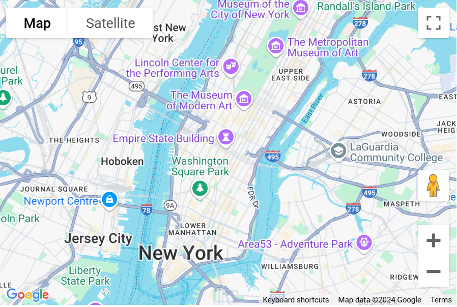

#### After: Azure Maps

Load a map with the same view in Azure Maps along with a map style control and zoom buttons.

```html
<!DOCTYPE html>
<html>
<head>
    <title></title>
    <meta charset="utf-8" />
    <meta http-equiv="x-ua-compatible" content="IE=Edge" />
    <meta name="viewport" content="width=device-width, initial-scale=1, shrink-to-fit=no" />

    <!-- Add references to the Azure Maps Map control JavaScript and CSS files. -->
    <link rel="stylesheet" href="https://atlas.microsoft.com/sdk/javascript/mapcontrol/3/atlas.min.css" type="text/css" />
    <script src="https://atlas.microsoft.com/sdk/javascript/mapcontrol/3/atlas.min.js"></script>

    <script type='text/javascript'>
        var map;

        function initMap() {
            map = new atlas.Map('myMap', {
                center: [-73.985, 40.747],  //Format coordinates as longitude, latitude.
                zoom: 11,   //Subtract the zoom level by one.

                //Specify authentication information when loading the map.
                authOptions: {
                    authType: 'subscriptionKey',
                    subscriptionKey: '<Your Azure Maps Key>'
                }
            });

            //Wait until the map resources are ready.
            map.events.add('ready', function () {
                //Add zoom controls to bottom right of map.
                map.controls.add(new atlas.control.ZoomControl(), {
                    position: 'bottom-right'
                });

                //Add map style control in top left corner of map.
                map.controls.add(new atlas.control.StyleControl(), {
                    position: 'top-left'
                });
            });
        }
    </script>
</head>
<body onload="initMap()">
    <div id='myMap' style='position:relative;width:600px;height:400px;'></div>
</body>
</html>
```

Running this code in a browser displays a map that looks like the following image:

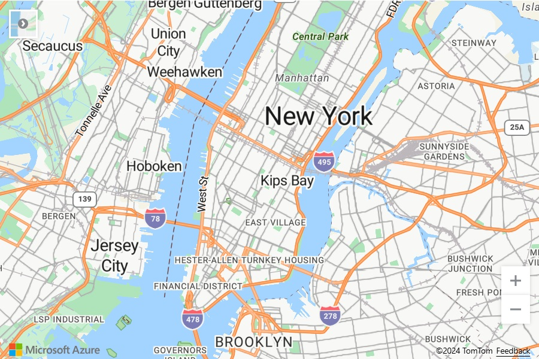

For more information on how to set up and use the Azure Maps map control in a web app, see [Use the Azure Maps map control].

> [!NOTE]
> Unlike Google Maps, Azure Maps does not require an initial center and a zoom level to load the map. If this information is not provided when loading the map, Azure Maps will try to determine city of the user. It will center and zoom the map there.

**More resources:**

* For more information on navigation controls for rotating and pitching the map view, see [Add controls to a map].

### Localizing the map

If your audience is spread across multiple countries/regions or speak different languages, localization is important.

#### Before: Google Maps

To localize Google Maps, add language and region parameters.

```html
<script type="text/javascript" src=" https://maps.googleapis.com/maps/api/js?callback=initMap&key={api-Key}& language={language-code}&region={region-code}" async defer></script>
```

Here's an example of Google Maps with the language set to "fr-FR".

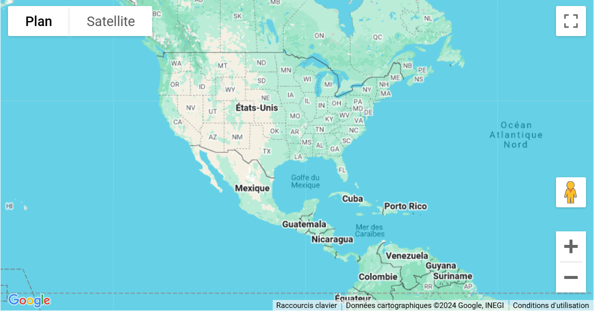

#### After: Azure Maps

Azure Maps provides two different ways of setting the language and regional view of the map. The first option is to add this information to the global *atlas* namespace. It results in all map control instances in your app defaulting to these settings. The following sets the language to French ("fr-FR") and the regional view to "Auto":

```javascript
atlas.setLanguage('fr-FR');
atlas.setView('auto');
```

The second option is to pass this information into the map options when loading the map. Like this:

```javascript
map = new atlas.Map('myMap', {
    language: 'fr-FR',
    view: 'auto',

    authOptions: {
        authType: 'subscriptionKey',
        subscriptionKey: '<Your Azure Maps Key>'
    }
});
```

> [!NOTE]
> With Azure Maps, it is possible to load multiple map instances on the same page with different language and region settings. It is also possible to update these settings in the map after it has loaded.

For more information on supported languages, see [Localization support in Azure Maps].

Here's an example of Azure Maps with the language set to "fr" and the user region set to "fr-FR".


### Setting the map view

Dynamic maps in both Azure and Google Maps can be programmatically moved to new geographic locations. To do so, call the appropriate functions in JavaScript. The examples show how to make the map display satellite aerial imagery, center the map over a location, and change the zoom level to 15 in Google Maps. The following location coordinates are used: longitude: -111.0225 and latitude: 35.0272.

> [!NOTE]
> Google Maps uses tiles that are 256 pixels in dimensions, while Azure Maps uses a larger 512-pixel tile. Thus, Azure Maps requires less number of network requests to load the same map area as Google Maps. Due to the way tile pyramids work in map controls, you need to subtract the zoom level used in Google Maps by the number one when using Azure Maps. This arithmetic operation ensures that larger tiles in Azure Maps render that same map area as in Google Maps,

#### Before: Google Maps

Move the Google Maps map control using the `setOptions` method. This method allows you to specify the center of the map and a zoom level.

```javascript
map.setOptions({
    mapTypeId: google.maps.MapTypeId.SATELLITE,
    center: new google.maps.LatLng(35.0272, -111.0225),
    zoom: 15
});
```

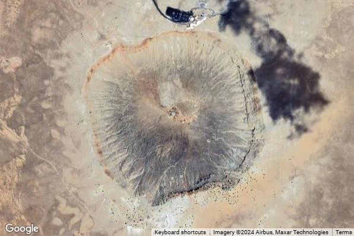

#### After: Azure Maps

In Azure Maps, change the map position using the `setCamera` method and change the map style using the `setStyle` method. The coordinates in Azure Maps are in "longitude, latitude" format, and the zoom level value is subtracted by one.

```javascript
map.setCamera({
    center: [-111.0225, 35.0272],
    zoom: 14
});

map.setStyle({
    style: 'satellite'
});
```

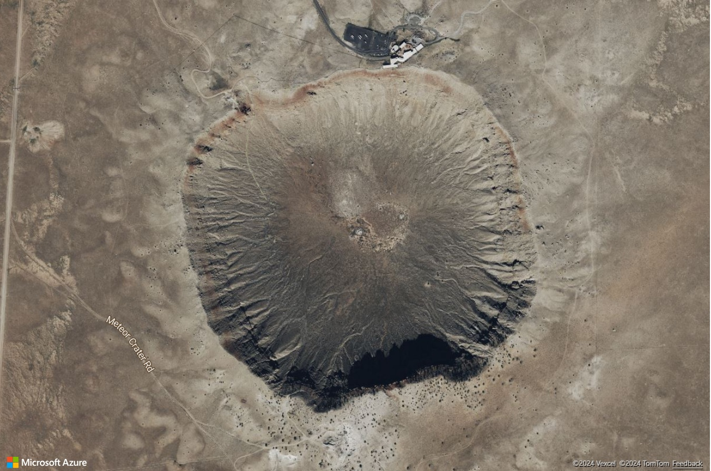

**More resources:**

* [Choose a map style]
* [Supported map styles]

### Adding a marker

In Azure Maps, there are multiple ways in which point data can be
rendered on the map:

* **HTML Markers** – Renders points using traditional DOM elements. HTML Markers support dragging.
* **Symbol Layer** – Renders points with an icon or text within the WebGL context.
* **Bubble Layer** – Renders points as circles on the map. The radii of the circles can be scaled based on properties in the data.

Render Symbol layers and Bubble layers within the WebGL context. Both layers can render large sets of points on the map. These layers require data to be stored in a data source. Data sources and rendering layers should be added to the map after the `ready` event has fired. HTML Markers are rendered as DOM elements within the page, and they don't use a data source. The more DOM elements a page has, the slower the page becomes. If rendering more than a few hundred points on a map, it's recommended to use one of the rendering layers instead.

Let's add a marker to the map at with the number 10 overlaid as a label. Use longitude: -0.2 and latitude: 51.5.

#### Before: Google Maps

With Google Maps, add markers to the map using the `google.maps.Marker` class and specify the map as one of the options.

```javascript
//Create a marker and add it to the map.
var marker = new google.maps.Marker({
    position: new google.maps.LatLng(51.5, -0.2),
    label: '10',
    map: map
});
```

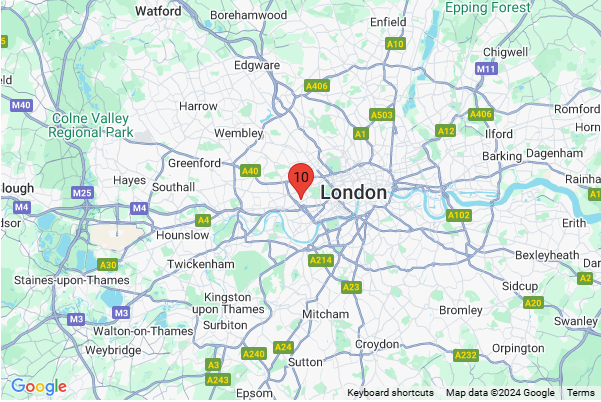

**After: Azure Maps using HTML Markers**

In Azure Maps, use HTML markers to display a point on the map. HTML markers are recommended for apps that only need to display a few points on the map. To use an HTML marker, create an instance of the `atlas.HtmlMarker` class. Set the text and position options, and add the marker to the map using the `map.markers.add` method.

```javascript
//Create a HTML marker and add it to the map.
map.markers.add(new atlas.HtmlMarker({
    text: '10',
    position: [-0.2, 51.5]
}));
```


**After: Azure Maps using a Symbol Layer**

For a Symbol layer, add the data to a data source. Attach the data source to the layer. Additionally, the data source and layer should be added to the map after the `ready` event has fired. To render a unique text value above a symbol, the text information needs to be stored as a property of the data point. The property must be referenced in the `textField` option of the layer. This approach is a bit more work than using HTML markers, but it better performance.

```html
<!DOCTYPE html>
<html>
<head>
    <title></title>
    <meta charset="utf-8" />
    <meta http-equiv="x-ua-compatible" content="IE=Edge" />
    <meta name="viewport" content="width=device-width, initial-scale=1, shrink-to-fit=no" />

    <!-- Add references to the Azure Maps Map control JavaScript and CSS files. -->
    <link rel="stylesheet" href="https://atlas.microsoft.com/sdk/javascript/mapcontrol/3/atlas.min.css" type="text/css" />
    <script src="https://atlas.microsoft.com/sdk/javascript/mapcontrol/3/atlas.min.js"></script>

    <script type='text/javascript'>
        var map, datasource;

        function initMap() {
            map = new atlas.Map('myMap', {
                center: [-0.2, 51.5],
                zoom: 9,
                
                authOptions: {
                    authType: 'subscriptionKey',
                    subscriptionKey: '<Your Azure Maps Key>'
                }
            });

            //Wait until the map resources are ready.
            map.events.add('ready', function () {

                //Create a data source and add it to the map.
                datasource = new atlas.source.DataSource();
                map.sources.add(datasource);

                //Create a point feature, add a property to store a label for it, and add it to the data source.
                datasource.add(new atlas.data.Feature(new atlas.data.Point([-0.2, 51.5]), {
                    label: '10'
                }));

                //Add a layer for rendering point data as symbols.
                map.layers.add(new atlas.layer.SymbolLayer(datasource, null, {
                    textOptions: {
                        //Use the label property to populate the text for the symbols.
                        textField: ['get', 'label'],
                        color: 'white',
                        offset: [0, -1]
                    }
                }));
            });
        }
    </script>
</head>
<body onload="initMap()">
    <div id='myMap' style='position:relative;width:600px;height:400px;'></div>
</body>
</html>
```

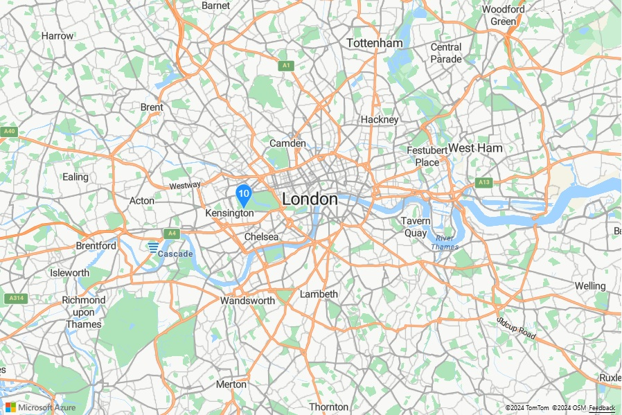

**More resources:**

* [Create a data source]
* [Add a Symbol layer]
* [Add a Bubble layer]
* [Clustering point data in the Web SDK]
* [Add HTML Markers]
* [Use data-driven style expressions]
* [Symbol layer icon options]
* [Symbol layer text option]
* [HTML marker class]
* [HTML marker options]

### Adding a custom marker

You may use Custom images to represent points on a map. The following map uses a custom image to display a point on the map. The point is displayed at latitude: 51.5 and longitude: -0.2. The anchor offsets the position of the marker, so that the point of the pushpin icon aligns with the correct position on the map.

<center>

<br>
yellow-pushpin.png</center>

#### Before: Google Maps

Create a custom marker by specifying an `Icon` object
that contains the `url` to the image. Specify an `anchor` point to align the
point of the pushpin image with the coordinate on the map. The anchor
value in Google Maps is relative to the top-left corner of the image.

```javascript
var marker = new google.maps.Marker({
    position: new google.maps.LatLng(51.5, -0.2),
    icon: {
        url: 'https://samples.azuremaps.com/images/icons/ylw-pushpin.png',
        anchor: new google.maps.Point(5, 30)
    },
    map: map
});
```

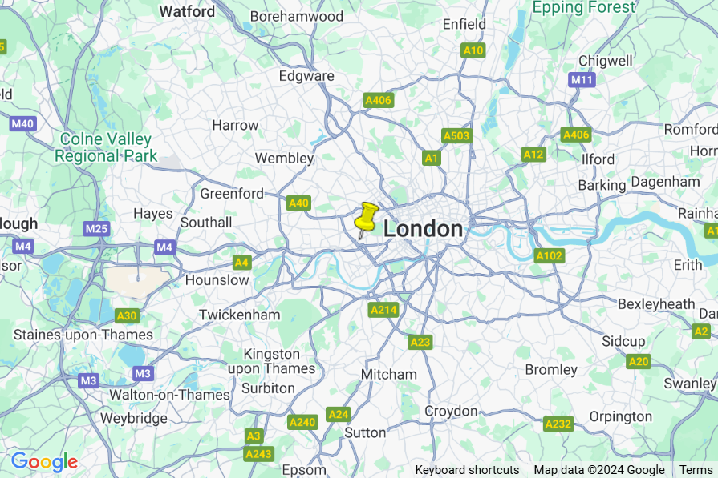

**After: Azure Maps using HTML Markers**

To customize an HTML marker, pass an HTML `string` or `HTMLElement` to the `htmlContent` option of the marker. Use the `anchor` option to specify the relative position of the marker, relative to the position coordinate. Assign one of nine defined reference points to the `anchor` option. Those defined points are: "center", "top", "bottom", "left", "right", "top-left", "top-right", "bottom-left", "bottom-right". The content is anchored to the bottom center of the html content by default. To make it easier to migrate code from Google Maps, set the `anchor` to "top-left", and then use the `pixelOffset` option with the same offset used in Google Maps. The offsets in Azure Maps move in the opposite direction of the offsets in Google Maps. So, multiply the offsets by minus one.

> [!TIP]
> Add `pointer-events:none` as a style on the html content to disable the default drag behavior in Microsoft Edge, which will display an unwanted icon.

```javascript
map.markers.add(new atlas.HtmlMarker({
    htmlContent: '',
    anchor: 'top-left',
    pixelOffset: [-5, -30],
    position: [-0.2, 51.5]
}));
```

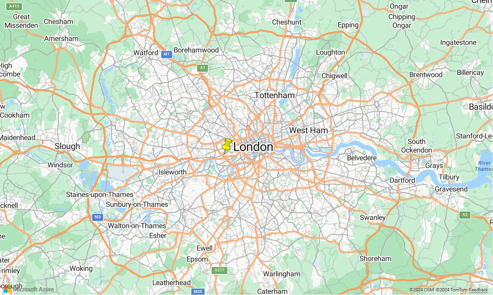

**After: Azure Maps using a Symbol Layer**

Symbol layers in Azure Maps support custom images as well. First, load the image to the map resources and assign it with a unique ID. Reference the image in the symbol layer. Use the `offset` option to align the image to the correct point on the map. Use the `anchor` option to specify the relative position of the symbol, relative to the position coordinates. Use one of the nine defined reference points. Those points are: "center", "top", "bottom", "left", "right", "top-left", "top-right", "bottom-left", "bottom-right". The content is anchored to the bottom center of the html content by default. To make it easier to migrate code from Google Maps, set the `anchor` to "top-left", and then use the `offset` option with the same offset used in Google Maps. The offsets in Azure Maps move in the opposite direction of the offsets in Google Maps. So, multiply the offsets by minus one.

```html
<!DOCTYPE html>
<html>
<head>
    <title></title>
    <meta charset="utf-8" />
    <meta http-equiv="x-ua-compatible" content="IE=Edge" />
    <meta name="viewport" content="width=device-width, initial-scale=1, shrink-to-fit=no" />

    <!-- Add references to the Azure Maps Map control JavaScript and CSS files. -->
    <link rel="stylesheet" href="https://atlas.microsoft.com/sdk/javascript/mapcontrol/3/atlas.min.css" type="text/css" />
    <script src="https://atlas.microsoft.com/sdk/javascript/mapcontrol/3/atlas.min.js"></script>

    <script type='text/javascript'>
        var map, datasource;

        function initMap() {
            map = new atlas.Map('myMap', {
                center: [-0.2, 51.5],
                zoom: 9,
                authOptions: {
                    authType: 'subscriptionKey',
                    subscriptionKey: '<Your Azure Maps Key>'
                }
            });

            //Wait until the map resources are ready.
            map.events.add('ready', function () {

                //Load the custom image icon into the map resources.
                map.imageSprite.add('my-yellow-pin', 'https://samples.azuremaps.com/images/icons/ylw-pushpin.png').then(function () {

                    //Create a data source and add it to the map.
                    datasource = new atlas.source.DataSource();
                    map.sources.add(datasource);

                    //Create a point and add it to the data source.
                    datasource.add(new atlas.data.Point([-0.2, 51.5]));

                    //Add a layer for rendering point data as symbols.
                    map.layers.add(new atlas.layer.SymbolLayer(datasource, null, {
                        iconOptions: {
                            //Set the image option to the id of the custom icon that was loaded into the map resources.
                            image: 'my-yellow-pin',
                            anchor: 'top-left',
                            offset: [-5, -30]
                        }
                    }));
                });
            });
        }
    </script>
</head>
<body onload="initMap()">
    <div id='myMap' style='position:relative;width:600px;height:400px;'></div>
</body>
</html>
```

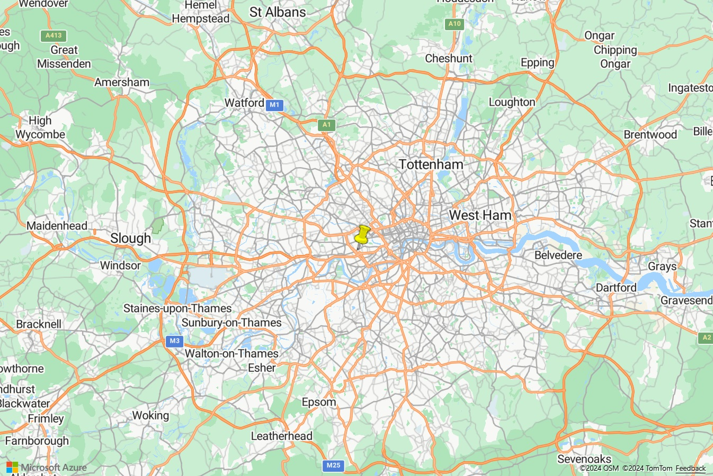</

> [!TIP]
> To render advanced custom points, use multiple rendering layers together. For example, let's say you want to have multiple pushpins that have the same icon on different colored circles. Instead of creating a bunch of images for each color overlay, add a symbol layer on top of a bubble layer. Have the pushpins reference the same data source. This approach will be more efficient than creating and maintaining a bunch of different images.

**More resources:**

* [Create a data source]
* [Add a Symbol layer]
* [Add HTML Markers]
* [Use data-driven style expressions]
* [Symbol layer icon options]
* [Symbol layer text option]
* [HTML marker class]
* [HTML marker options]

### Adding a polyline

Use polylines to represent a line or path on the map. Let's create a dashed polyline on the map.

#### Before: Google Maps

The Polyline class accepts a set of options. Pass an array of coordinates in the `path` option of the polyline.

```javascript
//Get the center of the map.
var center = map.getCenter();

//Define a symbol using SVG path notation, with an opacity of 1.
var lineSymbol = {
    path: 'M 0,-1 0,1',
    strokeOpacity: 1,
    scale: 4
};

//Create the polyline.
var line = new google.maps.Polyline({
    path: [
        center,
        new google.maps.LatLng(center.lat() - 0.5, center.lng() - 1),
        new google.maps.LatLng(center.lat() - 0.5, center.lng() + 1)
    ],
    strokeColor: 'red',
    strokeOpacity: 0,
    strokeWeight: 4,
    icons: [{
        icon: lineSymbol,
        offset: '0',
        repeat: '20px'
    }]
});

//Add the polyline to the map.
line.setMap(map);
```

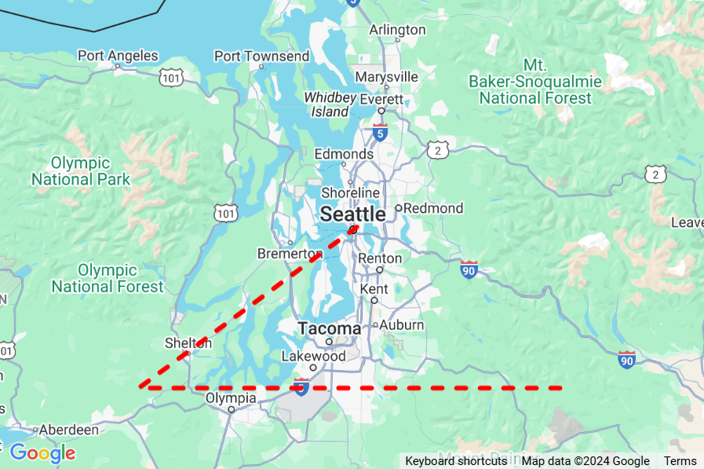

#### After: Azure Maps

Polylines are called `LineString` or `MultiLineString` objects. These objects can be added to a data source and rendered using a line layer. Add `LineString` to a data source, then add the data source to a `LineLayer` to render it.

```javascript
//Get the center of the map.
var center = map.getCamera().center;

//Create a data source and add it to the map.
var datasource = new atlas.source.DataSource();
map.sources.add(datasource);

//Create a line and add it to the data source.
datasource.add(new atlas.data.LineString([
    center,
    [center[0] - 1, center[1] - 0.5],
    [center[0] + 1, center[1] - 0.5]
]));

//Add a layer for rendering line data.
map.layers.add(new atlas.layer.LineLayer(datasource, null, {
    strokeColor: 'red',
    strokeWidth: 4,
    strokeDashArray: [3, 3]
}));
```

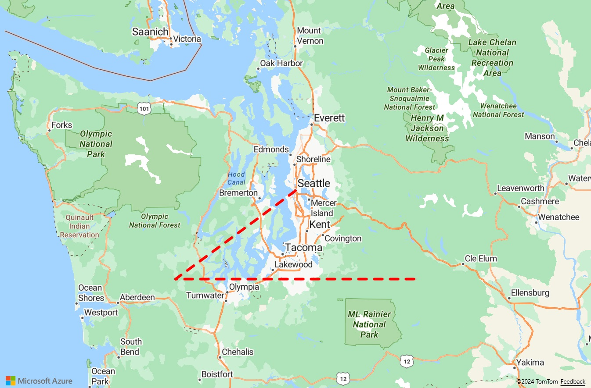

**More resources:**

* [Add lines to the map]
* [Line layer options]
* [Use data-driven style expressions]

### Adding a polygon

Azure Maps and Google Maps provide similar support for polygons. Polygons are used to represent an area on the map. The following examples show how to create a polygon that forms a triangle based on the center coordinate of the map.

#### Before: Google Maps

The Polygon class accepts a set of options. Pass an array of coordinates to the `paths` option of the polygon.

```javascript
//Get the center of the map.
var center = map.getCenter();

//Create a polygon.
var polygon = new google.maps.Polygon({
    paths: [
        center,
        new google.maps.LatLng(center.lat() - 0.5, center.lng() - 1),
        new google.maps.LatLng(center.lat() - 0.5, center.lng() + 1),
        center
    ],
    strokeColor: 'red',
    strokeWeight: 2,
    fillColor: 'rgba(0, 255, 0, 0.5)'
});

//Add the polygon to the map
polygon.setMap(map);
```

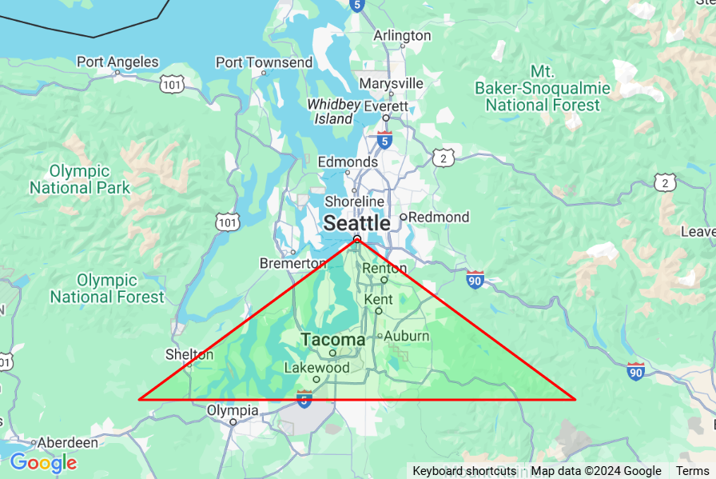

#### After: Azure Maps

Add a `Polygon` or a `MultiPolygon` objects to a data source. Render the object on the map using layers. Render the area of a polygon using a polygon layer. And, render the outline of a polygon using a line layer.

```javascript
//Get the center of the map.
var center = map.getCamera().center;

//Create a data source and add it to the map.
datasource = new atlas.source.DataSource();
map.sources.add(datasource);

//Create a polygon and add it to the data source.
datasource.add(new atlas.data.Polygon([
    center,
    [center[0] - 1, center[1] - 0.5],
    [center[0] + 1, center[1] - 0.5],
    center
]));

//Add a polygon layer for rendering the polygon area.
map.layers.add(new atlas.layer.PolygonLayer(datasource, null, {
    fillColor: 'rgba(0, 255, 0, 0.5)'
}));

//Add a line layer for rendering the polygon outline.
map.layers.add(new atlas.layer.LineLayer(datasource, null, {
    strokeColor: 'red',
    strokeWidth: 2
}));
```

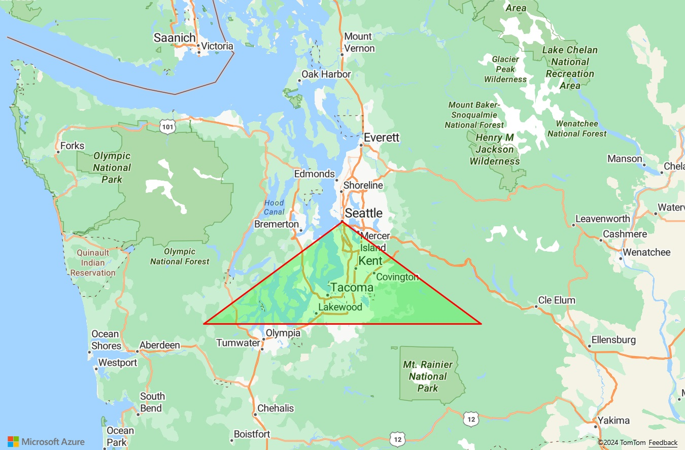

**More resources:**

* [Add a polygon to the map]
* [Add a circle to the map]
* [Polygon layer options]
* [Line layer options]
* [Use data-driven style expressions]

### Display an info window

Additional information for an entity can be displayed on the map as a
`google.maps.InfoWindow` class in Google Maps. In Azure Maps, this functionality can be
achieved using the `atlas.Popup` class. The next examples add a
marker to the map. When the marker is clicked, an info window or a popup is displayed.

#### Before: Google Maps

Instantiate an info window using the
`google.maps.InfoWindow` constructor.

```javascript
//Add a marker in which to display an infowindow for.
var marker = new google.maps.Marker({
    position: new google.maps.LatLng(47.6, -122.33),
    map: map
});

//Create an infowindow.
var infowindow = new google.maps.InfoWindow({
    content: '<div style="padding:5px"><b>Hello World!</b></div>'
});

//Add a click event to the marker to open the infowindow.
marker.addListener('click', function () {
    infowindow.open(map, marker);
});
```

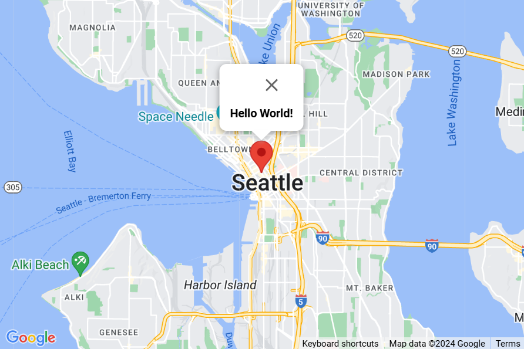

#### After: Azure Maps

Let's use popup to display additional information about the location. Pass an HTML `string` or `HTMLElement` object to the `content` option of the popup. If you want, popups can be displayed independently of any shape. Thus, Popups require a `position` value to be specified. Specify the `position` value. To display a popup, call the `open` method and pass the `map` in which the popup is to be displayed on.

```javascript
//Add a marker to the map in which to display a popup for.
var marker = new atlas.HtmlMarker({
    position: [-122.33, 47.6]
});

//Add the marker to the map.
map.markers.add(marker);

//Create a popup.
var popup = new atlas.Popup({
    content: '<div style="padding:5px"><b>Hello World!</b></div>',
    position: [-122.33, 47.6],
    pixelOffset: [0, -35]
});

//Add a click event to the marker to open the popup.
map.events.add('click', marker, function () {
    //Open the popup
    popup.open(map);
});
```

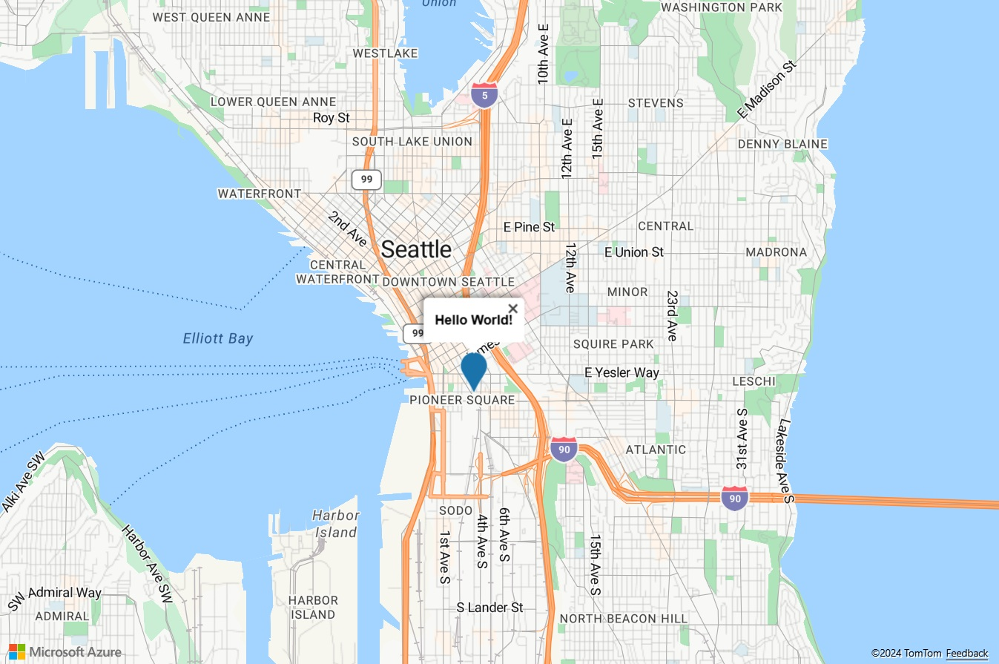

> [!NOTE]
> You may do the same thing with a symbol, bubble, line or polygon layer by passing the chosen layer to the maps event code instead of a marker.

**More resources:**

* [Add a popup]
* [Popup with Media Content]
* [Popups on Shapes]
* [Reusing Popup with Multiple Pins]
* [Popup class]
* [Popup options]

### Import a GeoJSON file

Google Maps supports loading and dynamically styling GeoJSON data via the `google.maps.Data` class. The functionality of this class aligns more with the data-driven styling of Azure Maps. But, there's a key difference. With Google Maps, you specify a callback function. The business logic for styling each feature it processed individually in the UI thread. But in Azure Maps, layers support specifying data-driven expressions as styling options. These expressions are processed at render time on a separate thread. The Azure Maps approach improves rendering performance. This advantage is noticed when larger data sets need to be rendered quickly.

The following examples load a GeoJSON feed of all earthquakes over the last seven days from the USGS. Earthquakes data renders as scaled circles on the map. The color and scale of each circle is based on the magnitude of each earthquake, which is stored in the `"mag"` property of each feature in the data set. If the magnitude is greater than or equal to five, the circle is red. If it's greater or equal to three, but less than five, the circle is orange. If it's less than three, the circle is green. The radius of each circle is the exponential of the magnitude multiplied by 0.1.

#### Before: Google Maps

Specify a single callback function in the `map.data.setStyle` method. Inside the callback function, apply business logic to each feature. Load the GeoJSON feed with the `map.data.loadGeoJson` method.

```html
<!DOCTYPE html>
<html>
<head>
    <title></title>
    <meta charset="utf-8" />
    <meta http-equiv="x-ua-compatible" content="IE=Edge" />
    <meta name="viewport" content="width=device-width, initial-scale=1, shrink-to-fit=no" />

    <script type='text/javascript'>
        var map;
        var earthquakeFeed = 'https://earthquake.usgs.gov/earthquakes/feed/v1.0/summary/all_week.geojson';

        function initMap() {
            map = new google.maps.Map(document.getElementById('myMap'), {
                center: new google.maps.LatLng(20, -160),
                zoom: 2
            });

            //Define a callback to style each feature.
            map.data.setStyle(function (feature) {

                //Extract the 'mag' property from the feature.
                var mag = parseFloat(feature.getProperty('mag'));

                //Set the color value to 'green' by default.
                var color = 'green';

                //If the mag value is greater than 5, set the color to 'red'.
                if (mag >= 5) {
                    color = 'red';
                }
                //If the mag value is greater than 3, set the color to 'orange'.
                else if (mag >= 3) {
                    color = 'orange';
                }

                return /** @type {google.maps.Data.StyleOptions} */({
                    icon: {
                        path: google.maps.SymbolPath.CIRCLE,

                        //Scale the radius based on an exponential of the 'mag' value.
                        scale: Math.exp(mag) * 0.1,
                        fillColor: color,
                        fillOpacity: 0.75,
                        strokeWeight: 2,
                        strokeColor: 'white'
                    }
                });
            });

            //Load the data feed.
            map.data.loadGeoJson(earthquakeFeed);
        }
    </script>

    <!-- Google Maps Script Reference -->
    <script src="https://maps.googleapis.com/maps/api/js?callback=initMap&key={Your-Google-Maps-Key}" async defer></script>
</head>
<body>
    <div id='myMap' style='position:relative;width:600px;height:400px;'></div>
</body>
</html>
```

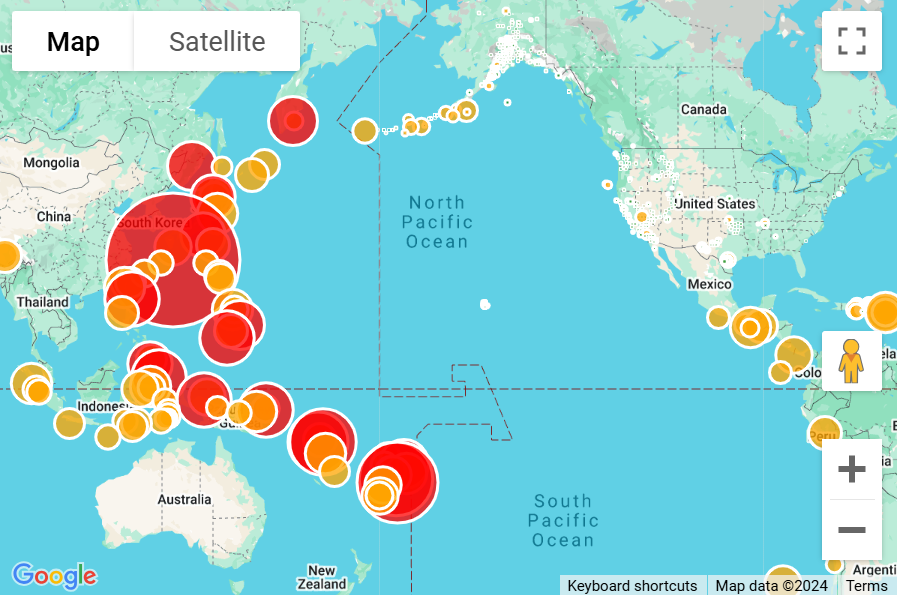

#### After: Azure Maps

GeoJSON is the base data type in Azure Maps. Import it into a data source using the `datasource.importFromUrl` method. Use a bubble layer. The bubble layer provides functionality for rendering scaled circles, based on the properties of the features in a data source. Instead of having a callback function, the business logic is converted into an expression and passed into the style options. Expressions define how the business logic works. Expressions can be passed into another thread and evaluated against the feature data. Multiple data sources and layers can be added to Azure Maps, each with different business logic. This feature allows multiple data sets to be rendered on the map in different ways.

```html
<!DOCTYPE html>
<html>
<head>
    <title></title>
    <meta charset="utf-8" />
    <meta http-equiv="x-ua-compatible" content="IE=Edge" />
    <meta name="viewport" content="width=device-width, initial-scale=1, shrink-to-fit=no" />

    <!-- Add references to the Azure Maps Map control JavaScript and CSS files. -->
    <link rel="stylesheet" href="https://atlas.microsoft.com/sdk/javascript/mapcontrol/3/atlas.min.css" type="text/css" />
    <script src="https://atlas.microsoft.com/sdk/javascript/mapcontrol/3/atlas.min.js"></script>

    <script type='text/javascript'>
        var map;
        var earthquakeFeed = 'https://earthquake.usgs.gov/earthquakes/feed/v1.0/summary/all_week.geojson';

        function initMap() {
            //Initialize a map instance.
            map = new atlas.Map('myMap', {
                center: [-160, 20],
                zoom: 1,

                //Add your Azure Maps subscription key to the map SDK. Get an Azure Maps key at https://azure.com/maps
                authOptions: {
                    authType: 'subscriptionKey',
                    subscriptionKey: '<Your Azure Maps Key>'
                }
            });

            //Wait until the map resources are ready.
            map.events.add('ready', function () {

                //Create a data source and add it to the map.
                datasource = new atlas.source.DataSource();
                map.sources.add(datasource);

                //Load the earthquake data.
                datasource.importDataFromUrl(earthquakeFeed);

                //Create a layer to render the data points as scaled circles.
                map.layers.add(new atlas.layer.BubbleLayer(datasource, null, {
                    //Make the circles semi-transparent.
                    opacity: 0.75,

                    color: [
                        'case',

                        //If the mag value is greater than 5, return 'red'.
                        ['>=', ['get', 'mag'], 5],
                        'red',

                        //If the mag value is greater than 3, return 'orange'.
                        ['>=', ['get', 'mag'], 3],
                        'orange',

                        //Return 'green' as a fallback.
                        'green'
                    ],

                    //Scale the radius based on an exponential of the 'mag' value.
                    radius: ['*', ['^', ['e'], ['get', 'mag']], 0.1]
                }));
            });
        }
    </script>
</head>
<body onload="initMap()">
    <div id='myMap' style='position:relative;width:600px;height:400px;'></div>
</body>
</html>
```


**More resources:**

* [Add a Symbol layer]
* [Add a Bubble layer]
* [Clustering point data in the Web SDK]
* [Use data-driven style expressions]

### Marker clustering

When visualizing many data points on the map, points may overlap each other. Overlapping makes the map look cluttered, and the map becomes difficult to read and use. Clustering point data is the process of combining data points that are near each other and representing them on the map as a single clustered data point. As the user zooms into the map, the clusters break apart into their individual data points. Cluster data points to improve user experience and map performance.

In the following examples, the code loads a GeoJSON feed of earthquake data from the past week and adds it to the map. Clusters are rendered as scaled and colored circles. The scale and color of the circles depends on the number of points they contain.

> [!NOTE]
> Google Maps and Azure Maps use slightly different clustering algorithms. As such, sometimes the point distribution in the clusters varies.

#### Before: Google Maps

Use the MarkerCluster library to cluster markers. Cluster icons are limited to images, which have the numbers one through five as their name. They're hosted in the same directory.

```html
<!DOCTYPE html>
<html>
<head>
    <title></title>
    <meta charset="utf-8" />
    <meta http-equiv="x-ua-compatible" content="IE=Edge" />
    <meta name="viewport" content="width=device-width, initial-scale=1, shrink-to-fit=no" />

    <script type='text/javascript'>
        var map;
        var earthquakeFeed = 'https://earthquake.usgs.gov/earthquakes/feed/v1.0/summary/all_week.geojson';

        function initMap() {
            map = new google.maps.Map(document.getElementById('myMap'), {
                center: new google.maps.LatLng(20, -160),
                zoom: 2
            });

            //Download the GeoJSON data.
            fetch(earthquakeFeed)
                .then(function (response) {
                    return response.json();
                }).then(function (data) {
                    //Loop through the GeoJSON data and create a marker for each data point.
                    var markers = [];

                    for (var i = 0; i < data.features.length; i++) {

                        markers.push(new google.maps.Marker({
                            position: new google.maps.LatLng(data.features[i].geometry.coordinates[1], data.features[i].geometry.coordinates[0])
                        }));
                    }

                    //Create a marker clusterer instance and tell it where to find the cluster icons.
                    var markerCluster = new MarkerClusterer(map, markers,
                        { imagePath: 'https://developers.google.com/maps/documentation/javascript/examples/markerclusterer/m' });
                });
        }
    </script>

    <!-- Load the marker cluster library. -->
    <script src="https://developers.google.com/maps/documentation/javascript/examples/markerclusterer/markerclusterer.js"></script>

    <!-- Google Maps Script Reference -->
    <script src="https://maps.googleapis.com/maps/api/js?callback=initMap&key={Your-Google-Maps-Key}" async defer></script>
</head>
<body>
    <div id='myMap' style='position:relative;width:600px;height:400px;'></div>
</body>
</html>
```

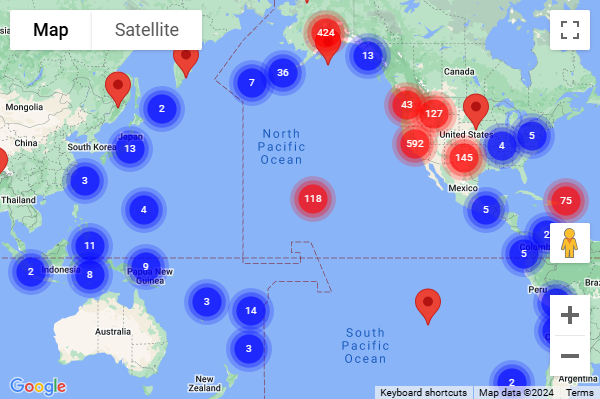

#### After: Azure Maps

Add and manage data in a data source. Connect data sources and layers, then render the data. The `DataSource` class in Azure Maps provides several clustering options.

* `cluster` – Tells the data source to cluster point data.
* `clusterRadius` - The radius in pixels to cluster points together.
* `clusterMaxZoom` - The maximum zoom level in which clustering occurs. If you zoom in more than this level, all points are rendered as symbols.
* `clusterProperties` - Defines custom properties that are calculated using expressions against all the points within each cluster and added to the properties of each cluster point.

When clustering is enabled, the data source sends clustered and unclustered data points to layers for rendering. The data source is capable of clustering hundreds of thousands of data points. A clustered data point has the following properties:

| Property name             | Type    | Description   |
|---------------------------|---------|---------------|
| `cluster`                 | boolean | Indicates if feature represents a cluster. |
| `cluster_id`              | string  | A unique ID for the cluster that can be used with the DataSource `getClusterExpansionZoom`, `getClusterChildren`, and `getClusterLeaves` methods. |
| `point_count`             | number  | The number of points the cluster contains.  |
| `point_count_abbreviated` | string  | A string that abbreviates the `point_count` value if it's long. (for example, 4,000 becomes 4K)  |

The `DataSource` class has the following helper function for accessing additional information about a cluster using the `cluster_id`.

| Method | Return type | Description |
|--------|-------------|-------------|
| `getClusterChildren(clusterId: number)` | Promise&lt;Array&lt;Feature&lt;Geometry, any&gt; \| Shape&gt;&gt; | Retrieves the children of the given cluster on the next zoom level. These children may be a combination of shapes and subclusters. The subclusters are features with properties matching ClusteredProperties. |
| `getClusterExpansionZoom(clusterId: number)` | Promise&lt;number&gt; | Calculates a zoom level at which the cluster starts expanding or break apart. |
| `getClusterLeaves(clusterId: number, limit: number, offset: number)` | Promise&lt;Array&lt;Feature&lt;Geometry, any&gt; \| Shape&gt;&gt; | Retrieves all points in a cluster. Set the `limit` to return a subset of the points, and use the `offset` to page through the points. |

When rendering clustered data on the map, it's often best to use two or more layers. The following example uses three layers. A bubble layer for drawing scaled colored circles based on the size of the clusters. A symbol layer to render the cluster size as text. And, it uses a second symbol layer for rendering the unclustered points. For more information on other ways to render clustered data, see [Clustering point data in the Web SDK].

Directly import GeoJSON data using the `importDataFromUrl` function on the `DataSource` class, inside Azure Maps map.

```html
<!DOCTYPE html>
<html>
<head>
    <title></title>
    <meta charset="utf-8" />
    <meta http-equiv="x-ua-compatible" content="IE=Edge" />
    <meta name="viewport" content="width=device-width, initial-scale=1, shrink-to-fit=no" />

    <!-- Add references to the Azure Maps Map control JavaScript and CSS files. -->
    <link rel="stylesheet" href="https://atlas.microsoft.com/sdk/javascript/mapcontrol/3/atlas.min.css" type="text/css" />
    <script src="https://atlas.microsoft.com/sdk/javascript/mapcontrol/3/atlas.min.js"></script>

    <script type='text/javascript'>
        var map, datasource;
        var earthquakeFeed = 'https://earthquake.usgs.gov/earthquakes/feed/v1.0/summary/all_week.geojson';

        function initMap() {
            //Initialize a map instance.
            map = new atlas.Map('myMap', {
                center: [-160, 20],
                zoom: 1,

                //Add your Azure Maps subscription key to the map SDK. Get an Azure Maps key at https://azure.com/maps
                authOptions: {
                    authType: 'subscriptionKey',
                    subscriptionKey: '<Your Azure Maps Key>'
                }
            });

            //Wait until the map resources are ready.
            map.events.add('ready', function () {

                //Create a data source and add it to the map.
                datasource = new atlas.source.DataSource(null, {
                    //Tell the data source to cluster point data.
                    cluster: true
                });
                map.sources.add(datasource);

                //Create layers for rendering clusters, their counts and unclustered points and add the layers to the map.
                map.layers.add([
                    //Create a bubble layer for rendering clustered data points.
                    new atlas.layer.BubbleLayer(datasource, null, {
                        //Scale the size of the clustered bubble based on the number of points inthe cluster.
                        radius: [
                            'step',
                            ['get', 'point_count'],
                            20,         //Default of 20 pixel radius.
                            100, 30,    //If point_count >= 100, radius is 30 pixels.
                            750, 40     //If point_count >= 750, radius is 40 pixels.
                        ],

                        //Change the color of the cluster based on the value on the point_cluster property of the cluster.
                        color: [
                            'step',
                            ['get', 'point_count'],
                            'lime',            //Default to lime green. 
                            100, 'yellow',     //If the point_count >= 100, color is yellow.
                            750, 'red'         //If the point_count >= 750, color is red.
                        ],
                        strokeWidth: 0,
                        filter: ['has', 'point_count'] //Only rendered data points which have a point_count property, which clusters do.
                    }),

                    //Create a symbol layer to render the count of locations in a cluster.
                    new atlas.layer.SymbolLayer(datasource, null, {
                        iconOptions: {
                            image: 'none' //Hide the icon image.
                        },
                        textOptions: {
                            textField: ['get', 'point_count_abbreviated'],
                            offset: [0, 0.4]
                        }
                    }),

                    //Create a layer to render the individual locations.
                    new atlas.layer.SymbolLayer(datasource, null, {
                        filter: ['!', ['has', 'point_count']] //Filter out clustered points from this layer.
                    })
                ]);

                //Retrieve a GeoJSON data set and add it to the data source. 
                datasource.importDataFromUrl(earthquakeFeed);
            });
        }
    </script>
</head>
<body onload="initMap()">
    <div id='myMap' style='position:relative;width:600px;height:400px;'></div>
</body>
</html>
```

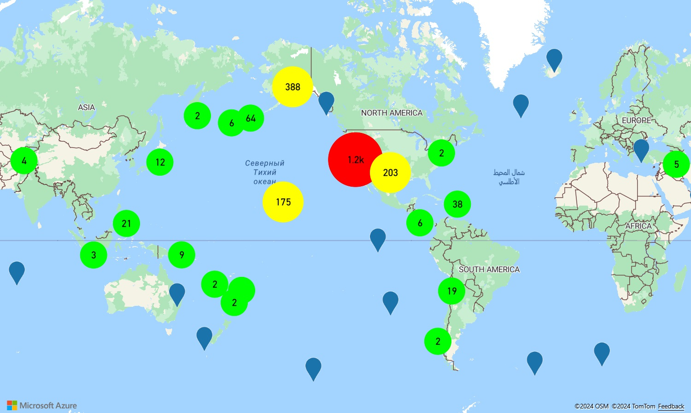

**More resources:**

* [Add a Symbol layer]
* [Add a Bubble layer]
* [Clustering point data in the Web SDK]
* [Use data-driven style expressions]

### Add a heat map

Heat maps, also known as point density maps, are a type of data visualization. They're used to represent the density of data using a range of colors. And, they're often used to show the data "hot spots" on a map. Heat maps are a great way to render large point data sets.

The following examples load a GeoJSON feed of all earthquakes over the past month, from the USGS, and it renders them as a weighted heat map. The `"mag"` property is used as the weight.

#### Before: Google Maps

To create a heat map, load the "visualization" library by adding `&libraries=visualization` to the API script URL. The heat map layer in Google Maps doesn't support GeoJSON data directly. First, download the data and convert it into an array of weighted data points:

```html
<!DOCTYPE html>
<html>
<head>
    <title></title>
    <meta charset="utf-8" />
    <meta http-equiv="x-ua-compatible" content="IE=Edge" />
    <meta name="viewport" content="width=device-width, initial-scale=1, shrink-to-fit=no" />

    <script type='text/javascript'>
        var map;
        var earthquakeFeed = 'https://earthquake.usgs.gov/earthquakes/feed/v1.0/summary/all_month.geojson';

        function initMap() {

            var map = new google.maps.Map(document.getElementById('myMap'), {
                center: new google.maps.LatLng(20, -160),
                zoom: 2,
                mapTypeId: 'satellite'
            });

            //Download the GeoJSON data.
            fetch(url).then(function (response) {
                return response.json();
            }).then(function (res) {
                var points = getDataPoints(res);

                var heatmap = new google.maps.visualization.HeatmapLayer({
                    data: points
                });
                heatmap.setMap(map);
            });
        }

        function getDataPoints(geojson, weightProp) {
            var points = [];

            for (var i = 0; i < geojson.features.length; i++) {
                var f = geojson.features[i];

                if (f.geometry.type === 'Point') {
                    points.push({
                        location: new google.maps.LatLng(f.geometry.coordinates[1], f.geometry.coordinates[0]),
                        weight: f.properties[weightProp]
                    });
                }
            }

            return points;
        } 
    </script>

    <!-- Google Maps Script Reference -->
    <script src="https://maps.googleapis.com/maps/api/js?callback=initMap&key={Your-Google-Maps-Key}&libraries=visualization" async defer></script>
</head>
<body>
    <div id='myMap' style='position:relative;width:600px;height:400px;'></div>
</body>
</html>
```

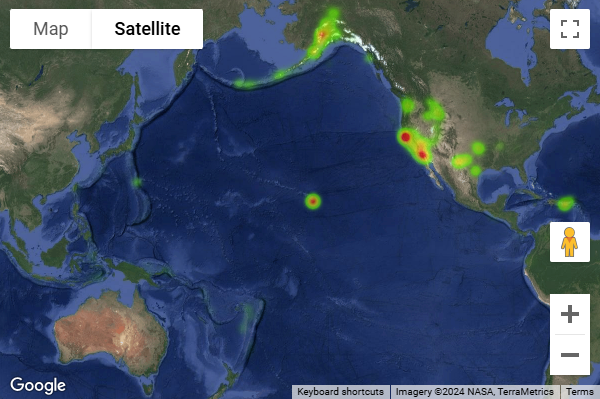

#### After: Azure Maps

Load the GeoJSON data into a data source and connect the data source to a heat map layer. The property that is used for the weight can be passed into the `weight` option using an expression. Directly import GeoJSON data to Azure Maps using the `importDataFromUrl` function on the `DataSource` class.

```html
<!DOCTYPE html>
<html>
<head>
    <title></title>
    <meta charset="utf-8" />
    <meta http-equiv="x-ua-compatible" content="IE=Edge" />
    <meta name="viewport" content="width=device-width, initial-scale=1, shrink-to-fit=no" />

    <!-- Add references to the Azure Maps Map control JavaScript and CSS files. -->
    <link rel="stylesheet" href="https://atlas.microsoft.com/sdk/javascript/mapcontrol/3/atlas.min.css" type="text/css" />
    <script src="https://atlas.microsoft.com/sdk/javascript/mapcontrol/3/atlas.min.js"></script>

    <script type='text/javascript'>
        var map;
        var earthquakeFeed = 'https://earthquake.usgs.gov/earthquakes/feed/v1.0/summary/all_month.geojson';

        function initMap() {
            //Initialize a map instance.
            map = new atlas.Map('myMap', {
                center: [-160, 20],
                zoom: 1,
                style: 'satellite',

                //Add your Azure Maps subscription key to the map SDK. Get an Azure Maps key at https://azure.com/maps
                authOptions: {
                    authType: 'subscriptionKey',
                    subscriptionKey: '<Your Azure Maps Key>'
                }
            });

            //Wait until the map resources are ready.
            map.events.add('ready', function () {

                //Create a data source and add it to the map.
                datasource = new atlas.source.DataSource();
                map.sources.add(datasource);

                //Load the earthquake data.
                datasource.importDataFromUrl(earthquakeFeed);

                //Create a layer to render the data points as a heat map.
                map.layers.add(new atlas.layer.HeatMapLayer(datasource, null, {
                    weight: ['get', 'mag'],
                    intensity: 0.005,
                    opacity: 0.65,
                    radius: 10
                }));
            });
        }
    </script>
</head>
<body onload="initMap()">
    <div id='myMap' style='position:relative;width:600px;height:400px;'></div>
</body>
</html>
```


**More resources:**

* [Add a heat map layer]
* [Heat map layer class]
* [Heat map layer options]
* [Use data-driven style expressions]

### Overlay a tile layer

Tile layers in Azure Maps are known as Image overlays in Google Maps. Tile layers allow you to overlay large images that have been broken up into smaller tiled images, which align with the maps tiling system. This approach is a commonly used to overlay large images or large data sets.

The following examples overlay a weather radar tile layer from Iowa Environmental Mesonet of Iowa State University.

#### Before: Google Maps

In Google Maps, tile layers can be created by using the `google.maps.ImageMapType` class.

```javascript
map.overlayMapTypes.insertAt(0, new google.maps.ImageMapType({
    getTileUrl: function (coord, zoom) {
        return "https://mesonet.agron.iastate.edu/cache/tile.py/1.0.0/nexrad-n0q-900913/" + zoom + "/" + coord.x + "/" + coord.y;
    },
    tileSize: new google.maps.Size(256, 256),
    opacity: 0.8
}));
```

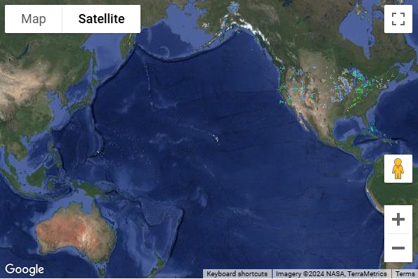

#### After: Azure Maps

Add a tile layer to the map similarly as any other layer. Use a formatted URL that has in x, y, zoom placeholders; `{x}`, `{y}`, `{z}`  to tell the layer where to access the tiles. Azure Maps tile layers also support `{quadkey}`, `{bbox-epsg-3857}`, and `{subdomain}` placeholders.

> [!TIP]
> In Azure Maps layers can easily be rendered below other layers, including base map layers. Often it is desirable to render tile layers below the map labels so that they are easy to read. The `map.layers.add` method takes in a second parameter which is the id of the layer in which to insert the new layer below. To insert a tile layer below the map labels, use this code: `map.layers.add(myTileLayer, "labels");`

```javascript
//Create a tile layer and add it to the map below the label layer.
map.layers.add(new atlas.layer.TileLayer({
    tileUrl: 'https://mesonet.agron.iastate.edu/cache/tile.py/1.0.0/nexrad-n0q-900913/{z}/{x}/{y}.png',
    opacity: 0.8,
    tileSize: 256
}), 'labels');
```

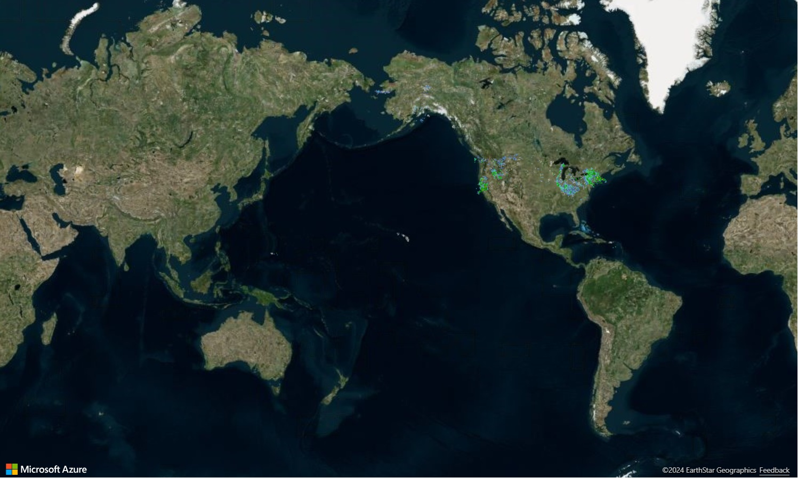

> [!TIP]
> Tile requests can be captured using the `transformRequest` option of the map. This will allow you to modify or add headers to the request if desired.

**More resources:**

* [Add tile layers]
* [Tile layer class]
* [Tile layer options]

### Show traffic data

Traffic data can be overlaid both Azure and Google Maps.

#### Before: Google Maps

Overlay traffic data on the map using the traffic layer.

```javascript
var trafficLayer = new google.maps.TrafficLayer();
trafficLayer.setMap(map);
```

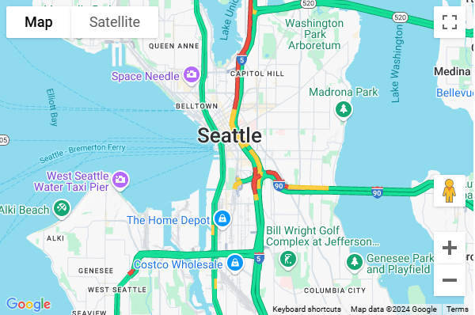

#### After: Azure Maps

Azure Maps provides several different options for displaying traffic. Display traffic incidents, such as road closures and accidents as icons on the map. Overlay traffic flow and color coded roads on the map. The colors can be modified based on the posted speed limit, relative to the normal expected delay, or absolute delay. Incident data in Azure Maps updates every minute, and flow data updates every two minutes.

Assign the wanted values for `setTraffic` options.

```javascript
map.setTraffic({
    incidents: true,
    flow: 'relative'
});
```

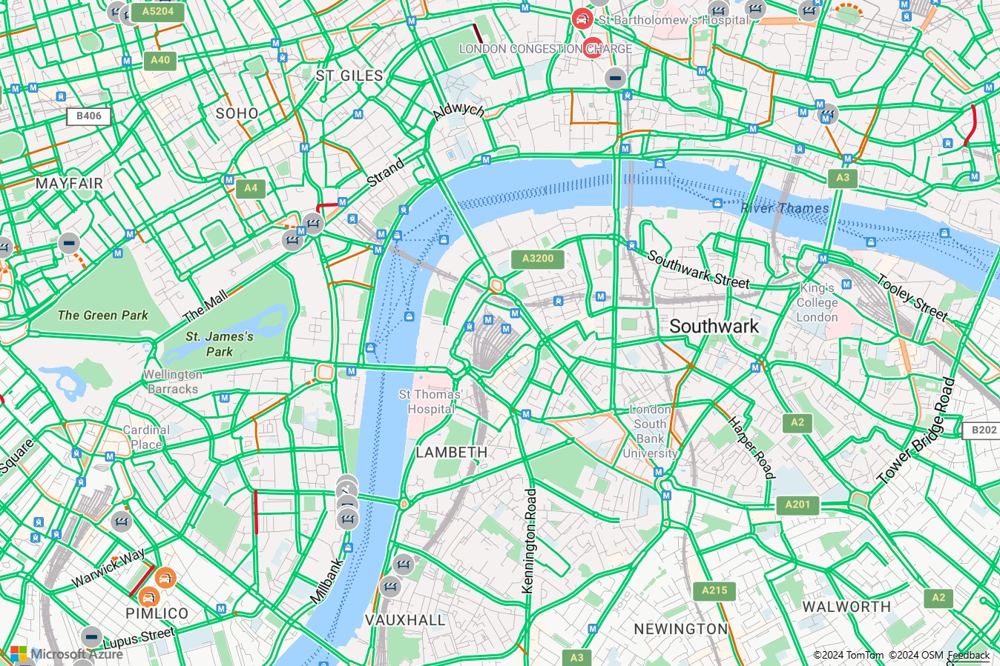

If you select one of the traffic icons in Azure Maps, more information is displayed in a popup.


**More resources:**

* [Show traffic on the map]
* [Traffic overlay options]

### Add a ground overlay

Both Azure and Google Maps support overlaying georeferenced images on the map. Georeferenced images move and scale as you pan and zoom the map. In Google Maps, georeferenced images are known as ground overlays while in Azure Maps they're referred to as image layers. They're great for building floor plans, overlaying old maps, or imagery from a drone.

#### Before: Google Maps

Specify the URL to the image you want to overlay and a bounding box to bind the image on the map. This example overlays a map image of Newark New Jersey from 1922 on the map.

```html
<!DOCTYPE html>
<html>
<head>
    <title></title>
    <meta charset="utf-8" />
    <meta http-equiv="x-ua-compatible" content="IE=Edge" />
    <meta name="viewport" content="width=device-width, initial-scale=1, shrink-to-fit=no" />

    <script type='text/javascript'>
        var map, historicalOverlay;

        function initMap() {
            map = new google.maps.Map(document.getElementById('myMap'), {
                center: new google.maps.LatLng(40.740, -74.18),
                zoom: 12
            });

            var imageBounds = {
                north: 40.773941,
                south: 40.712216,
                east: -74.12544,
                west: -74.22655
            };

            historicalOverlay = new google.maps.GroundOverlay(
                'https://www.lib.utexas.edu/maps/historical/newark_nj_1922.jpg',
                imageBounds);
            historicalOverlay.setMap(map);
        }
    </script>

    <!-- Google Maps Script Reference -->
    <script src="https://maps.googleapis.com/maps/api/js?callback=initMap&key={Your-Google-Maps-Key}" async defer></script>
</head>
<body>
    <div id="myMap" style="position:relative;width:600px;height:400px;"></div>
</body>
</html>
```

Running this code in a browser displays a map that looks like the following image:

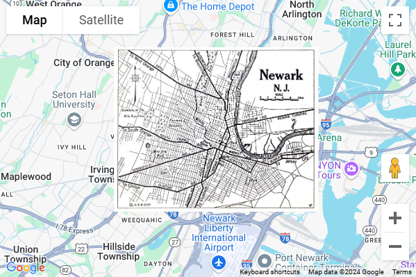

#### After: Azure Maps

Use the `atlas.layer.ImageLayer` class to overlay georeferenced images. This class requires a URL to an image and a set of coordinates for the four corners of the image. The image must be hosted either on the same domain or have CORs enabled.

> [!TIP]
> If you only have north, south, east, west and rotation information, and you do not have coordinates for each corner of the image, you can use the static [`atlas.layer.ImageLayer.getCoordinatesFromEdges`] method.

```html
<!DOCTYPE html>
<html>
<head>
    <title></title>
    <meta charset="utf-8" />
    <meta http-equiv="x-ua-compatible" content="IE=Edge" />
    <meta name="viewport" content="width=device-width, initial-scale=1, shrink-to-fit=no" />

    <!-- Add references to the Azure Maps Map control JavaScript and CSS files. -->
    <link rel="stylesheet" href="https://atlas.microsoft.com/sdk/javascript/mapcontrol/3/atlas.min.css" type="text/css" />
    <script src="https://atlas.microsoft.com/sdk/javascript/mapcontrol/3/atlas.min.js"></script>

    <script type='text/javascript'>
        var map;

        function initMap() {
            //Initialize a map instance.
            map = new atlas.Map('myMap', {
                center: [-74.18, 40.740],
                zoom: 12,

                //Add your Azure Maps subscription key to the map SDK. Get an Azure Maps key at https://azure.com/maps
                authOptions: {
                    authType: 'subscriptionKey',
                    subscriptionKey: '<Your Azure Maps Key>'
                }
            });

            //Wait until the map resources are ready.
            map.events.add('ready', function () {

                //Create an image layer and add it to the map.
                map.layers.add(new atlas.layer.ImageLayer({
                    url: 'newark_nj_1922.jpg',
                    coordinates: [
                        [-74.22655, 40.773941], //Top Left Corner
                        [-74.12544, 40.773941], //Top Right Corner
                        [-74.12544, 40.712216], //Bottom Right Corner
                        [-74.22655, 40.712216]  //Bottom Left Corner
                    ]
                }));
            });
        }
    </script>
</head>
<body onload="initMap()">
    <div id='myMap' style='position:relative;width:600px;height:400px;'></div>
</body>
</html>
```


**More resources:**

* [Overlay an image]
* [Image layer class]

### Add KML data to the map

Both Azure and Google Maps can import and render KML, KMZ and GeoRSS data on the map. Azure Maps also supports GPX, GML, spatial CSV files, GeoJSON, Well Known Text (WKT), Web-Mapping Services (WMS), Web-Mapping Tile Services (WMTS), and Web Feature Services (WFS). Azure Maps reads the files locally into memory and in most cases can handle larger KML files.

#### Before: Google Maps

```javascript
<!DOCTYPE html>
<html>
<head>
    <title></title>
    <meta charset="utf-8" />
    <meta http-equiv="x-ua-compatible" content="IE=Edge" />
    <meta name="viewport" content="width=device-width, initial-scale=1, shrink-to-fit=no" />

    <script type='text/javascript'>
        var map, historicalOverlay;

        function initMap() {
            map = new google.maps.Map(document.getElementById('myMap'), {
                center: new google.maps.LatLng(0, 0),
                zoom: 1
            });

             var layer = new google.maps.KmlLayer({
              url: 'https://googlearchive.github.io/js-v2-samples/ggeoxml/cta.kml',
              map: map
            });
        }
    </script>

    <!-- Google Maps Script Reference -->
    <script src="https://maps.googleapis.com/maps/api/js?callback=initMap&key={Your-Google-Maps-Key}" async defer></script>
</head>
<body>
    <div id="myMap" style="position:relative;width:600px;height:400px;"></div>
</body>
</html>
```

Running this code in a browser displays a map that looks like the following image:


#### After: Azure Maps

In Azure Maps, GeoJSON is the main data format used in the web SDK, more spatial data formats can be easily integrated in using the [spatial IO module]. This module has functions for both reading and writing spatial data and also includes a simple data layer that can easily render data from any of these spatial data formats. To read the data in a spatial data file, pass in a URL, or raw data as string or blob into the `atlas.io.read` function. This returns all the parsed data from the file that can then be added to the map. KML is a bit more complex than most spatial data format as it includes a lot more styling information. The `SpatialDataLayer` class supports most of these styles, however icons images have to be loaded into the map before loading the feature data, and ground overlays have to be added as layers to the map separately. When loading data via a URL, it should be hosted on a CORs enabled endpoint, or a proxy service should be passed in as an option into the read function.

```javascript
<!DOCTYPE html>
<html>
<head>
    <title></title>
    <meta charset="utf-8" />
    <meta http-equiv="x-ua-compatible" content="IE=Edge" />
    <meta name="viewport" content="width=device-width, initial-scale=1, shrink-to-fit=no" />

    <!-- Add references to the Azure Maps Map control JavaScript and CSS files. -->
    <link rel="stylesheet" href="https://atlas.microsoft.com/sdk/javascript/mapcontrol/3/atlas.min.css" type="text/css" />
    <script src="https://atlas.microsoft.com/sdk/javascript/mapcontrol/3/atlas.min.js"></script>

    <!-- Add reference to the Azure Maps Spatial IO module. -->
    <script src="https://atlas.microsoft.com/sdk/javascript/spatial/0/atlas-spatial.js"></script>

    <script type='text/javascript'>
        var map, datasource, layer;

        function initMap() {
            //Initialize a map instance.
            map = new atlas.Map('myMap', {
                view: 'Auto',

                //Add your Azure Maps subscription key to the map SDK. Get an Azure Maps key at https://azure.com/maps
                authOptions: {
                    authType: 'subscriptionKey',
                    subscriptionKey: '<Your Azure Maps Key>'
                }
            });

            //Wait until the map resources are ready.
            map.events.add('ready', function () {
            
                //Create a data source and add it to the map.
                datasource = new atlas.source.DataSource();
                map.sources.add(datasource);

                //Add a simple data layer for rendering the data.
                layer = new atlas.layer.SimpleDataLayer(datasource);
                map.layers.add(layer);

                //Read a KML file from a URL or pass in a raw KML string.
                atlas.io.read('https://googlearchive.github.io/js-v2-samples/ggeoxml/cta.kml').then(async r => {
                    if (r) {

                        //Check to see if there are any icons in the data set that need to be loaded into the map resources.
                        if (r.icons) {
                            //For each icon image, create a promise to add it to the map, then run the promises in parrallel.
                            var imagePromises = [];

                            //The keys are the names of each icon image.
                            var keys = Object.keys(r.icons);

                            if (keys.length !== 0) {
                                keys.forEach(function (key) {
                                    imagePromises.push(map.imageSprite.add(key, r.icons[key]));
                                });

                                await Promise.all(imagePromises);
                            }
                        }

                        //Load all features.
                        if (r.features && r.features.length > 0) {
                            datasource.add(r.features);
                        }

                        //Load all ground overlays.
                        if (r.groundOverlays && r.groundOverlays.length > 0) {
                            map.layers.add(r.groundOverlays);
                        }

                        //If bounding box information is known for data, set the map view to it.
                        if (r.bbox) {
                            map.setCamera({ bounds: r.bbox, padding: 50 });
                        }
                    }
                });
            });
        }
    </script>
</head>
<body onload="initMap()">
    <div id='myMap' style='position:relative;width:600px;height:400px;'></div>
</body>
</html>
```


**More resources:**

* [atlas.io.read function]
* [SimpleDataLayer]
* [SimpleDataLayerOptions]

## More code samples

The following are some more code samples related to Google Maps migration:

* [Drawing tools]
* [Limit Map to Two Finger Panning]
* [Limit Scroll Wheel Zoom]
* [Create a Fullscreen Control]

**Services:**

* [Using the Azure Maps services module]
* [Search for points of interest]
* [Get information from a coordinate (reverse geocode)]
* [Show directions from A to B]
* [Search Autosuggest with JQuery UI]

## Google Maps V3 to Azure Maps Web SDK class mapping

The following appendix provides a cross reference of the commonly used classes in Google Maps V3 and the equivalent Azure Maps Web SDK.

### Core Classes

| Google Maps   | Azure Maps  |
|---------------|-------------|
| `google.maps.Map` | [atlas.Map]  |
| `google.maps.InfoWindow` | [atlas.Popup]  |
| `google.maps.InfoWindowOptions` | [atlas.PopupOptions] |
| `google.maps.LatLng`  | [atlas.data.Position]  |
| `google.maps.LatLngBounds` | [atlas.data.BoundingBox] |
| `google.maps.MapOptions`  | [atlas.CameraOptions]<br>[atlas.CameraBoundsOptions]<br>[atlas.ServiceOptions]<br>[atlas.StyleOptions]<br>[atlas.UserInteractionOptions] |
| `google.maps.Point`  | [atlas.Pixel]   |

## Overlay Classes

| Google Maps  | Azure Maps  |
|--------------|-------------|
| `google.maps.Marker` | [atlas.HtmlMarker]<br>[atlas.data.Point]  |
| `google.maps.MarkerOptions`  | [atlas.HtmlMarkerOptions]<br>[atlas.layer.SymbolLayer]<br>[atlas.SymbolLayerOptions]<br>[atlas.IconOptions]<br>[atlas.TextOptions]<br>[atlas.layer.BubbleLayer]<br>[atlas.BubbleLayerOptions] |
| `google.maps.Polygon`  | [atlas.data.Polygon]   |
| `google.maps.PolygonOptions` |[atlas.layer.PolygonLayer]<br>[atlas.PolygonLayerOptions]<br> [atlas.layer.LineLayer]<br>[atlas.LineLayerOptions]|
| `google.maps.Polyline` | [atlas.data.LineString] |
| `google.maps.PolylineOptions` | [atlas.layer.LineLayer]<br>[atlas.LineLayerOptions] |
| `google.maps.Circle`  | See [Add a circle to the map]                                     |
| `google.maps.ImageMapType`  | [atlas.TileLayer]  |
| `google.maps.ImageMapTypeOptions` | [atlas.TileLayerOptions] |
| `google.maps.GroundOverlay`  | [atlas.layer.ImageLayer]<br>[atlas.ImageLayerOptions] |

## Service Classes

The Azure Maps Web SDK includes a services module, which can be loaded separately. This module wraps the Azure Maps REST services with a web API and can be used in JavaScript, TypeScript, and Node.js applications.

| Google Maps            | Azure Maps                 |
|------------------------|----------------------------|
| `google.maps.Geocoder` | [atlas.service.SearchUrl]  |
| `google.maps.GeocoderRequest` | [atlas.SearchAddressOptions]<br>[atlas.SearchAddressRevrseOptions]<br>[atlas.SearchAddressReverseCrossStreetOptions]<br>[atlas.SearchAddressStructuredOptions]<br>[atlas.SearchAlongRouteOptions]<br>[atlas.SearchFuzzyOptions]<br>[atlas.SearchInsideGeometryOptions]<br>[atlas.SearchNearbyOptions]<br>[atlas.SearchPOIOptions]<br>[atlas.SearchPOICategoryOptions] |
| `google.maps.DirectionsService` | [atlas.service.RouteUrl] |
| `google.maps.DirectionsRequest` | [atlas.CalculateRouteDirectionsOptions] |
| `google.maps.places.PlacesService` | [f] |

## Libraries

Libraries add more functionality to the map. Many of these libraries are in
the core SDK of Azure Maps. Here are some equivalent classes to use in
place of these Google Maps libraries

| Google Maps           | Azure Maps             |
|-----------------------|------------------------|
| Drawing library       | [Drawing tools module] |
| Geometry library      | [atlas.math]           |
| Visualization library | [Heat map layer]       |

## Clean up resources

No resources to be cleaned up.

## Next steps

Learn more about migrating to Azure Maps:

> [!div class="nextstepaction"]
> [Migrate a web service]

[atlas.data]: /javascript/api/azure-maps-control/atlas.data
[atlas.Shape]: /javascript/api/azure-maps-control/atlas.shape
[`atlas.layer.ImageLayer.getCoordinatesFromEdges`]: /javascript/api/azure-maps-control/atlas.layer.imagelayer#getcoordinatesfromedges-number--number--number--number--number-
[Add a Bubble layer]: map-add-bubble-layer.md
[Add a circle to the map]: map-add-shape.md#add-a-circle-to-the-map
[Add a ground overlay]: #add-a-ground-overlay
[Add a heat map layer]: map-add-heat-map-layer.md
[Add a heat map]: #add-a-heat-map
[Add a polygon to the map]: map-add-shape.md
[Add a popup]: map-add-popup.md
[Add a Symbol layer]: map-add-pin.md
[Add controls to a map]: map-add-controls.md
[Add HTML Markers]: map-add-custom-html.md
[Add KML data to the map]: #add-kml-data-to-the-map
[Add lines to the map]: map-add-line-layer.md
[Add tile layers]: map-add-tile-layer.md
[Adding a custom marker]: #adding-a-custom-marker
[Adding a marker]: #adding-a-marker
[Adding a polygon]: #adding-a-polygon
[Adding a polyline]: #adding-a-polyline
[atlas.BubbleLayerOptions]: /javascript/api/azure-maps-control/atlas.bubblelayeroptions
[atlas.CalculateRouteDirectionsOptions]: /javascript/api/azure-maps-rest/atlas.service.calculateroutedirectionsoptions
[atlas.CameraBoundsOptions]: /javascript/api/azure-maps-control/atlas.cameraboundsoptions
[atlas.CameraOptions]: /javascript/api/azure-maps-control/atlas.cameraoptions
[atlas.data.BoundingBox]: /javascript/api/azure-maps-control/atlas.data.boundingbox
[atlas.data.LineString]: /javascript/api/azure-maps-control/atlas.data.linestring
[atlas.data.Point]: /javascript/api/azure-maps-control/atlas.data.point
[atlas.data.Polygon]: /javascript/api/azure-maps-control/atlas.data.polygon
[atlas.data.Position.fromLatLng]: /javascript/api/azure-maps-control/atlas.data.position
[atlas.data.Position]: /javascript/api/azure-maps-control/atlas.data.position
[atlas.HtmlMarker]: /javascript/api/azure-maps-control/atlas.htmlmarker
[atlas.HtmlMarkerOptions]: /javascript/api/azure-maps-control/atlas.htmlmarkeroptions
[atlas.IconOptions]: /javascript/api/azure-maps-control/atlas.iconoptions
[atlas.ImageLayerOptions]: /javascript/api/azure-maps-control/atlas.imagelayeroptions
[atlas.io.read function]: /javascript/api/azure-maps-spatial-io/atlas.io#read-string---arraybuffer---blob--spatialdatareadoptions-
[atlas.layer.BubbleLayer]: /javascript/api/azure-maps-control/atlas.layer.bubblelayer
[atlas.layer.ImageLayer]: /javascript/api/azure-maps-control/atlas.layer.imagelayer
[atlas.layer.LineLayer]: /javascript/api/azure-maps-control/atlas.layer.linelayer
[atlas.layer.PolygonLayer]: /javascript/api/azure-maps-control/atlas.layer.polygonlayer
[atlas.layer.SymbolLayer]: /javascript/api/azure-maps-control/atlas.layer.symbollayer
[atlas.LineLayerOptions]: /javascript/api/azure-maps-control/atlas.linelayeroptions
[atlas.Map]: /javascript/api/azure-maps-control/atlas.map
[atlas.math]: /javascript/api/azure-maps-control/atlas.math
[atlas.Pixel]: /javascript/api/azure-maps-control/atlas.pixel
[atlas.PolygonLayerOptions]: /javascript/api/azure-maps-control/atlas.polygonlayeroptions
[atlas.Popup]: /javascript/api/azure-maps-control/atlas.popup
[atlas.PopupOptions]: /javascript/api/azure-maps-control/atlas.popupoptions
[atlas.SearchAddressOptions]: /javascript/api/azure-maps-rest/atlas.service.searchaddressoptions
[atlas.SearchAddressReverseCrossStreetOptions]: /javascript/api/azure-maps-rest/atlas.service.searchaddressreversecrossstreetoptions
[atlas.SearchAddressRevrseOptions]: /javascript/api/azure-maps-rest/atlas.service.searchaddressreverseoptions
[atlas.SearchAddressStructuredOptions]: /javascript/api/azure-maps-rest/atlas.service.searchaddressstructuredoptions
[atlas.SearchAlongRouteOptions]: /javascript/api/azure-maps-rest/atlas.service.searchalongrouteoptions
[atlas.SearchFuzzyOptions]: /javascript/api/azure-maps-rest/atlas.service.searchfuzzyoptions
[atlas.SearchInsideGeometryOptions]: /javascript/api/azure-maps-rest/atlas.service.searchinsidegeometryoptions
[atlas.SearchNearbyOptions]: /javascript/api/azure-maps-rest/atlas.service.searchnearbyoptions
[atlas.SearchPOICategoryOptions]: /javascript/api/azure-maps-rest/atlas.service.searchpoicategoryoptions
[atlas.SearchPOIOptions]: /javascript/api/azure-maps-rest/atlas.service.searchpoioptions
[atlas.service.RouteUrl]: /javascript/api/azure-maps-rest/atlas.service.routeurl
[atlas.service.SearchUrl]: /javascript/api/azure-maps-rest/atlas.service.searchurl
[atlas.ServiceOptions]: /javascript/api/azure-maps-control/atlas.serviceoptions
[atlas.StyleOptions]: /javascript/api/azure-maps-control/atlas.styleoptions
[atlas.SymbolLayerOptions]: /javascript/api/azure-maps-control/atlas.symbollayeroptions
[atlas.TextOptions]: /javascript/api/azure-maps-control/atlas.textoptions
[atlas.TileLayer]: /javascript/api/azure-maps-control/atlas.layer.tilelayer
[atlas.TileLayerOptions]: /javascript/api/azure-maps-control/atlas.tilelayeroptions
[atlas.UserInteractionOptions]: /javascript/api/azure-maps-control/atlas.userinteractionoptions
[Azure Maps account]: quick-demo-map-app.md#create-an-azure-maps-account
[Azure Maps React Component]: https://github.com/WiredSolutions/react-azure-maps
[AzureMapsControl.Components]: https://github.com/arnaudleclerc/AzureMapsControl.Components
[Cesium documentation]: https://www.cesium.com/
[Choose a map style]: choose-map-style.md
[Clustering point data in the Web SDK]: clustering-point-data-web-sdk.md
[Create a data source]: create-data-source-web-sdk.md
[Create a Fullscreen Control]: https://samples.azuremaps.com/?sample=fullscreen-control
[Display an info window]: #display-an-info-window
[Drawing tools module]: set-drawing-options.md
[Drawing tools]: map-add-drawing-toolbar.md
[f]: /javascript/api/azure-maps-rest/atlas.service.searchurl
[free account]: https://azure.microsoft.com/free/
[Get information from a coordinate (reverse geocode)]: map-get-information-from-coordinate.md
[Heat map layer class]: /javascript/api/azure-maps-control/atlas.layer.heatmaplayer
[Heat map layer options]: /javascript/api/azure-maps-control/atlas.heatmaplayeroptions
[Heat map layer]: map-add-heat-map-layer.md
[HTML marker class]: /javascript/api/azure-maps-control/atlas.htmlmarker
[HTML marker options]: /javascript/api/azure-maps-control/atlas.htmlmarkeroptions
[Image layer class]: /javascript/api/azure-maps-control/atlas.layer.imagelayer
[Import a GeoJSON file]: #import-a-geojson-file
[Leaflet code sample]: https://samples.azuremaps.com/?sample=render-azure-maps-in-leaflet
[Leaflet documentation]: https://leafletjs.com/
[Limit Map to Two Finger Panning]: https://samples.azuremaps.com/?sample=limit-map-to-two-finger-panning
[Limit Scroll Wheel Zoom]: https://samples.azuremaps.com/?sample=limit-scroll-wheel-zoom
[Line layer options]: /javascript/api/azure-maps-control/atlas.linelayeroptions
[Load a map]: #load-a-map
[Localization support in Azure Maps]: supported-languages.md
[Localizing the map]: #localizing-the-map
[Manage authentication in Azure Maps]: how-to-manage-authentication.md
[Marker clustering]: #marker-clustering
[Migrate a web service]: migrate-from-google-maps-web-services.md
[ng-azure-maps]: https://github.com/arnaudleclerc/ng-azure-maps
[npm module]: how-to-use-map-control.md
[OpenLayers documentation]: https://openlayers.org/
[Overlay a tile layer]: #overlay-a-tile-layer
[Overlay an image]: map-add-image-layer.md
[Polygon layer options]: /javascript/api/azure-maps-control/atlas.polygonlayeroptions
[Popup class]: /javascript/api/azure-maps-control/atlas.popup
[Popup options]: /javascript/api/azure-maps-control/atlas.popupoptions
[Popup with Media Content]: https://samples.azuremaps.com/?sample=popup-with-media-content
[Popups on Shapes]: https://samples.azuremaps.com/?sample=popups-on-shapes
[Render]:  /rest/api/maps/render-v2
[Reusing Popup with Multiple Pins]: https://samples.azuremaps.com/?sample=reusing-popup-with-multiple-pins
[road tiles]: /rest/api/maps/render-v2/get-map-tile
[satellite tiles]: /rest/api/maps/render-v2/get-map-static-image
[Search Autosuggest with JQuery UI]: https://samples.azuremaps.com/?sample=search-autosuggest-and-jquery-ui
[Search for points of interest]: map-search-location.md
[Setting the map view]: #setting-the-map-view
[Show directions from A to B]: map-route.md
[Show traffic data]: #show-traffic-data
[Show traffic on the map]: map-show-traffic.md
[SimpleDataLayer]: /javascript/api/azure-maps-spatial-io/atlas.layer.simpledatalayer
[SimpleDataLayerOptions]: /javascript/api/azure-maps-spatial-io/atlas.simpledatalayeroptions
[spatial IO module]: /javascript/api/azure-maps-spatial-io/
[subscription key]: quick-demo-map-app.md#get-the-subscription-key-for-your-account
[Supported map styles]: supported-map-styles.md
[Symbol layer icon options]: /javascript/api/azure-maps-control/atlas.iconoptions
[Symbol layer text option]: /javascript/api/azure-maps-control/atlas.textoptions
[Tile layer class]: /javascript/api/azure-maps-control/atlas.layer.tilelayer
[Tile layer options]: /javascript/api/azure-maps-control/atlas.tilelayeroptions
[Traffic overlay options]: https://samples.azuremaps.com/?sample=traffic-overlay-options
[Use data-driven style expressions]: data-driven-style-expressions-web-sdk.md
[Use the Azure Maps map control]: how-to-use-map-control.md
[Using the Azure Maps services module]: how-to-use-services-module.md
[Vue Azure Maps]: https://github.com/rickyruiz/vue-azure-maps
